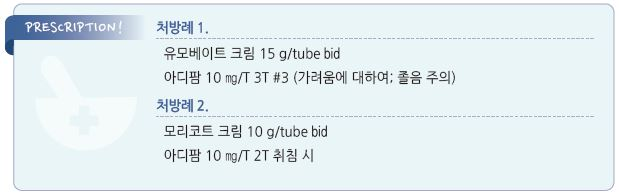

# 장미색 잔비늘증 Pityriasis Rosea


## 일반 사항

* 피부 cleavage line을 따라 타원형의 엷은 색 비늘이 발생하는 급성 염증성 발진 질환
* 호발 : 봄, 가을; 연장아\~젊은 성인, 여성
*   경과 : 대부분 4\~8주 내 자연 치유(간혹 수개월 지속)

    •간혹 색소 침착이 지속될 수 있음

## 원인

* 불명
* 바이러스 감염 관련 추정

## 임상 양상

*   원발반(herald or mother patch) : 지름 2\~6 ㎝의 경계가 명확한 원형 또는 타원형의, 약간의 비늘이 있는 분홍색 또는

    연어색 판(patch); 보통 가슴, 목, 등에 존재
*   후속 발진 : 원발반 발생 1~~2일 후부터 수일~~수 주에 걸쳐 원발반과 비슷한 모양의, 원발반보다 작은 크기의 다수의 발진이

    체간 또는 사지 근위부에 발생; 손발바닥에는 드묾

    •분포 형태 : 타원형 병변의 장축이 피부 할선과 평행하게 분포(Christmas tree 패턴)
* 피부 병소 외 국소 증상 : 소양증(보통 경증)
* 전구 증상 : 일부 환자에서 발열, 두통, 코 막힘, 인두통, 피로 발생

## 진단

* 원발반(단, 모든 환자에서 원발반이 발견되는 것은 아님)
* 실험실 검사 : 다른 질환(예: 매독, 진균 감염) 배제를 위하여 고려

### 감별

```
(☞ p.844)
```

***

## Management

### 치료 방침

* 대부분 필요 없으며 가려움에 대하여 대증 치료 고려 (☞ p.857)
* 가려움에 대하여 중간 역가의 국소 steroid, 경구 항히스타민제 치료
* 심한 증상에 대하여 UVB 또는 단기 경구 steroid 투여 고려

## 약물 치료

### 외용제

* calamine/zinc oxide : 필요시 도포 [칼라민](../%EB%B9%84%EB%B3%B4%ED%97%98/)
*   중간 역가의 국소 steroid : 발진 또는 가려움이 심할 때 고려 (☞ p.1139)

    •triamcinolone 0.1% \[트리코트], mometasone 0.1% \[모리코트]

### 경구제

* acyclovir : 질병 기간 단축 기대(논란); 400\~800 ㎎ ×5회/일 ×7d \[메노바] (보험주의)
*   1세대 항히스타민제 : 가려움에 대하여 고려 (☞ p.1144)

    •hydroxyzine : 25~~50 ㎎ hs or 50~~100 ㎎/d #3\~4 \[아디팜]

    •chlorpheniramine : 4 ㎎ q4\~6hr, 최대 24 ㎎/d \[페니라민]

    •diphenhydramine : 25~~50 ㎎ q4~~6hr, 최대 300 ㎎/d [디펙타민](../%EB%B9%84%EB%B3%B4%ED%97%98/)

### 광선 치료

* 효과가 일정하지 않거나 근거가 부족함

> **질병코드** L42　장미색잔비늘증(비강진)


