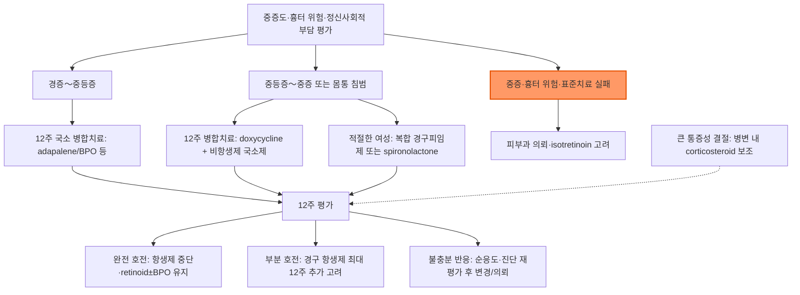

# 여드름 (심상성 여드름) Acne Vulgaris (AV)

## <mark style="color:green;">일반 사항</mark>

* 모낭(pilosebaceous) 상피의 비정상적 탈락으로 인해 모낭관이 막혀 염증을 일으키고 이에 따라 구진, 농포, 결절, 면포 및 흉터가 형성되는 모낭의 만성 질환
* 분포 : sebaceous follicle이 밀집된 곳; 얼굴(주로), 등(upper back), 앞가슴
* 발생 시기 및 유병률 : 청소년기- 남성(skin oil이 많음), 성인기- 여성 호발; 환자의 40%에서 7\~10세에 시작, 청소년의 85% (15～18세에 최대); 보통 25세 전에 쇠퇴, 25～34세의 8%; 여성 환자의 26%, 남성 환자의 12%에서 40대까지 지속
  * 마스크 사용과 관련하여 유병률이 증가하였다는 보고가 있음(acne mechanica)
* 여드름 관리에 있어서 객관적 징후 뿐 아니라 주관적 척도, 삶의 질이 중요함

## <mark style="color:green;">원인</mark>

### <mark style="color:orange;">병인</mark>

1. 모낭 상피의 비정상적인 각질화에 의해 모낭 내강에 각질화된 세포가 들어참(각질 세포 plug)
2. 피지선에서의 피지 과잉 생산 (✽피지는 세균 증식의 배지 역할을 함)
3. 모낭에서의 혐기성 균인 _Cutibacterium acnes_(예전 _Propionibacterium acnes_) 증식
   * proinflammatory mediator 활성 증가 → 염증 조장
   * lipase 생성 → 피지의 TG를 free fatty acid로 분해하고 이것이 염증 반응을 유발
   * C. acnes는 일부 병원성일 가능성이 있지만 나머지는 피부 미생물군집에 공생함; C. acnes 양과 여드름의 중증도는 무관하지만 C. acnes 양을 줄이면 여드름이 개선됨
4. androgen(testosterone, DHEA-S) 활성 : 피지 생성 및 각질 세포 증식을 자극
5. 피부 염증
   * 각질 세포 plug에 의한 피지 모낭의 폐쇄 → 면포 형성 → 모낭 팽창 & 파열 → 진피층으로의 분출 및 염증 반응; 염증 반응이 표면에서 발생하면 구진/농포 형성, 보다 깊은 곳에서 발생하면 결절 형성

### <mark style="color:orange;">관련/악화 인자</mark>

* 유전 : 환자의 50%에서 가족력이 있으며, 가족력이 있는 경우 보다 조기 발생 및 중증 발생
* 호르몬 관련 : 사춘기(androgen 활성 증가), 월경(여드름 발생 여성의 25\~50%가 월경 1주 전 악화), 임신 3분기, 폐경기, 내분비 질환(다낭성난소증후군, 쿠싱증후군)
  * 하악 및 목의 전측방을 따라 분포하는 크고 깊은 염증 병변, menstrual flare, androgen 과다 징후(예: hirsutism, 불규칙 월경)는 호르몬 연관을 시사
* 약물 : steroid, progestin, lithium, iodine, isoniazid, halogen, phenytoin, Vit B2/B6/B12
* 더위, 습함, 열대 기후
  * 계절 요인은 확실치 않음. 자외선이 여드름에 좋고, 찬 바람과 낮은 습도가 피부에 나쁜 영향을 주고 겨울철이 스트레스가 더 많을 가능성 등으로 인하여 여름에 호전되고 겨울에 악화된다고 알려져 있었으나 실제 환자 조사에서는 여름철 악화, 겨울철 악화 및 영향 없음이 각 ⅓로 차이가 없었다는 보고가 있음
* 피부 자극 및 손상 : 마찰, 외상, 머리띠, 휴대폰, 화장품, 헬멧 턱받침, 여드름 짜냄
* 지성 화장품, 머리 기름
* 흡연, 스트레스
* 식이 : 논란; 초콜릿, 기름진 음식, 설탕이 든 음료, 흰 빵, 유제품 등이 관련되는 경우가 있음

## <mark style="color:green;">임상 양상</mark>

* 면포, 농포, 염증성 구진, 결절, 흉터(심하고 깊은 염증이나 잘못된 압출 관련); 보통 여러 형태의 여드름이 동시에 존재
* 통증/압통

**IGA(Investigator Global Assessment) 중증도**

<table><thead><tr><th width="70" align="center">등급</th><th width="140">명칭</th><th>소견</th></tr></thead><tbody><tr><td align="center">0</td><td>깨끗(clear)</td><td>잔여 색소 침착 및 홍반이 있을 수 있음</td></tr><tr><td align="center">1</td><td>거의 깨끗(almost clear)</td><td>몇몇 산재한 면포와 작은 구진</td></tr><tr><td align="center">2</td><td>경증(mild)</td><td>쉽게 인지됨; 얼굴의 절반 이하 이환; 약간의 면포, 구진, 농포</td></tr><tr><td align="center">3</td><td>중등증(moderate)</td><td>얼굴의 절반 이상 이환; 많은 면포, 구진, 농포; 한 개의 결절이 존재할 수 있음</td></tr><tr><td align="center">4</td><td>중증(severe)</td><td>얼굴 전체가 면포로 뒤덮여 있고, 구진과 농포가 많음; 결절과 낭종이 몇몇 있을 수 있음</td></tr></tbody></table>

### <mark style="color:orange;">면포 (Comedone, 여드름집)</mark>

* 각질, 지질, 세균 등으로 피지 모낭이 채워진 상태(plugging)

#### <mark style="color:$primary;">폐쇄성 면포 (Closed comedone; Whitehead)</mark>

* follicular neck의 폐쇄로 표피 바로 밑에서 follicular duct의 낭종성 팽창이 발생
* 본래 피부색 또는 주변 피부보다 약간 밝은 색의 1\~2 ㎜ 크기의 구진
* 입구에 바늘 크기의 구멍만 존재, 내용물이 쉽게 배출되지 않음
* 염증성 여드름(붉은 구진, 농포, 결절, 낭종)의 전구 상태

#### <mark style="color:$primary;">개방성 면포 (Open comedone; Blackhead)</mark>

* 모낭 입구가 열려 있어(크고 확장된 모낭구) 각질 세포 plug 내의 산화된 멜라닌이 보이는 상태(구멍에 후추가 들어가 있는 것처럼 보임)
* 쉽게 배출되는 산화된 검은색의 기름진 부스러기들로 채워짐
* 염증 증상은 별로 없는 상태

### <mark style="color:orange;">결절낭성 여드름 (Nodulocystic lesion)</mark>

* 모낭 주위 피부 깊숙이 염증 부스러기의 낭종(액화된 덩어리)이 형성된 상태

### <mark style="color:$danger;">🚩 Red Flags!</mark>

<mark style="color:$danger;">**즉각 조치 또는 의뢰**</mark>

* **Acne fulminans 의심** : 갑자기 발생한 통증성·궤양성·출혈성 여드름 병변과 발열, 심한 권태감, 관절통 또는 골통 → 당일 피부과/응급실 의뢰(24시간 이내 평가)
* 심한 우울, 자해·자살 사고 또는 급격한 정신건강 악화 → 즉시 안전 확보 및 정신건강 응급 평가(자살예방 상담전화 109)

<mark style="color:$warning;">**당일 또는 조기 의뢰**</mark>

* acne conglobata, 심한 결절성 또는 결절낭성 여드름
* 빠르게 진행하는 흉터 또는 지속적인 염증 후 색소 변화
* 진단이 불확실하거나 그람음성 모낭염 등 다른 질환이 의심되는 경우

<mark style="color:$info;">**외래 추적 / 추가 평가 계획**</mark> <mark style="color:$info;">- 즉각 위험 낮으나 호전 없으면 의뢰</mark>

* 경증～중등증 여드름이 서로 다른 12주 치료 2코스에 반응하지 않는 경우
* 중등증～중증 여드름이 경구 항생제를 포함한 적절한 12주 병합치료에 반응하지 않는 경우
* 여드름으로 인한 지속적인 정신적 고통 또는 삶의 질 저하

## <mark style="color:green;">진단</mark>

* 피임약/약물/화장품/월경 관련 증상 변화, 나이, 생활 방식, 환경, 가족력, 이전 치료력

### <mark style="color:orange;">실험실 검사</mark>

* 일반적으로 필요 없음(유용하지 않음)
* hyperandrogenism 의심 여성에서 total/free testosterone, DHEA-S를 우선 검사. 임상상에 따라 17-hydroxyprogesterone, prolactin, TSH 등을 선택하며 LH/FSH는 일률적인 선별검사가 아님
* 장기간 경구 항생제 치료 중 갑자기 악화되거나 코 주위·중앙 얼굴에 단형성 농포가 발생하면 그람음성 모낭염을 고려하여 농포 배양검사 시행
* isotretinoin을 투여할 경우 baseline LFT & TG, 가임 여성에서 hCG 측정

### <mark style="color:orange;">감별 진단</mark>

* 여드름 모양 발진이 나타날 수 있는 원발성 피부 질환·약물·전신 질환의 감별

<table><thead><tr><th width="150">범주</th><th>예시</th></tr></thead><tbody><tr><td>원발성 피부 질환</td><td>acne rosacea, 세균성 모낭염, 지루피부염, keratosis pilaris, pyoderma</td></tr><tr><td>약물 유발</td><td>steroid, lithium, iodine</td></tr><tr><td>전신 질환</td><td>Cushing's Dz, dimorphic fungi, Behçet's Dz, 다낭성난소증후군</td></tr></tbody></table>

* 장기간 tetracycline계 항생제 치료 중 코·입 주위 등 periorificial 부위에 갑자기 발생한 단형성 농포\~결절은 그람음성 모낭염을 시사 → 농포 배양검사(AAD 2024)
* 몸통(trunk)의 소양성 단형성 구진·농포는 Malassezia(구 Pityrosporum) 모낭염을 시사할 수 있음. 모낭 내용물의 KOH 직접도말을 우선 고려하고, 진단이 불확실하거나 치료에 반응하지 않으면 피부과 의뢰 후 지질 함유 특수 배지를 이용한 배양 또는 조직검사를 고려(AAD 2024)

***



<p align="center"><strong>중증도별 치료 및 평가 알고리듬</strong></p>

<p align="center"><em><mark style="color:$info;">Ref. Reynolds RV, et al. Guidelines of care for the management of acne vulgaris. J Am Acad Dermatol. 2024;90(5):1006.e1–1006.e30. Fig 1 재구성</mark></em></p>

***

## <mark style="background-color:$warning;">Management</mark>

### <mark style="color:orange;">치료 방침</mark>

* 이상각화증 정상화, 과도한 피지 생성 억제, 항염/항균, 여드름집 제거
* 중증도와 hyperpigmentation 후유증 등을 감안하여 치료 수준을 결정

### <mark style="color:orange;">치료 경과</mark>

* 치료 초기 2\~4주에 자극 또는 일시적인 flare가 나타날 수 있으나 모든 환자에서 발생하는 것은 아님
* 치료 반응까지 6～8주, 충분한 호전까지 8～12주 소요; 등과 가슴은 보다 장시간 소요(3\~4개월)
* 새로운 병변 개수로 치료에 대한 반응 평가
* 치료 12주에 평가
  * 완전히 호전되었으면 항생제(국소/경구)를 중단하고, 재발 위험이 있으면 비항생제 국소 유지요법(retinoid±BPO)을 고려
  * 부분 호전되었으면 경구 항생제를 비항생제 국소 치료와 함께 최대 12주 더 연장할 수 있음
  * 반응이 불충분하면 순응도·도포 범위·피부 자극, 진단 오류, 호르몬 요인 및 악화 약물/화장품을 재평가한 후 다른 12주 치료 또는 의뢰 고려
* 치료 중 악화·재발 시 순응도, 진단 오류, 호르몬 요인 등을 먼저 검토하며 항생제 내성은 여러 가능성 중 하나로 고려
* 여성에서 isotretinoin 중단 후 즉각 재발 시 hyperandrogenism 또는 다른 호르몬 질환을 고려

## <mark style="color:green;">비-약물 치료 및 예방</mark>

* 충분한 증거를 가진 예방요법은 없음
* 규칙적 생활, 충분한 수면
* 피로하지 않게 함, 정신적 스트레스를 피함

#### <mark style="color:$primary;">회피</mark>

* 병변을 반복해서 뜯거나 긁으면 염증과 흉터 위험이 증가하므로 피함
* 자가 압출은 염증·흉터를 악화시킬 수 있어 피하며, 필요한 면포 압출은 숙련된 의료인이 시행
* 화장은 oil-based 또는 comedogenic 제품을 피하고 취침 전 제거
* 피부 손상 주의 : 면도기 사용 주의(특히 칼날면도기)
* 헤어 젤, 무스, 스프레이, 옷 등에 의한 피부 자극을 피함
* 지나친 햇빛 노출을 피함 : 양산, oil-free/noncomedogenic 햇빛 차단제 사용 (☞ p.1084)
* 기름진 미용 제품 사용 회피 : 얼굴 및 두발에 사용 시 모공을 막을 수 있음
* 피부 건조 회피 : noncomedogenic moisturizer가 자극을 줄일 수 있음

#### <mark style="color:$primary;">세척</mark>

* 청결한 피부 관리 : 중성 또는 약산성 비누로 하루 2회 이하 세안, 문지르지 않음. 단, 여드름과 나쁜 위생이나 지방의 관계에 대한 증거는 부족함
* 피부 각질 제거 세정제 : 일시적으로 피지를 제거할 수 있으나 미세 면포 형성을 예방할 수는 없음; sulfur, resorcinol, salicylic acid [<mark style="color:blue;">클리어틴</mark>](../%EB%B9%84%EB%B3%B4%ED%97%98/)
* 알코올 함유 세정제는 자극·건조를 유발할 수 있어 일상적인 사용을 권하지 않음

#### <mark style="color:$primary;">음식</mark>

* 여드름을 악화시킨 경험이 있는 음식은 피함
* 저혈당부하 식사가 일부 환자에서 도움이 될 가능성이 있으나 소규모 RCT 결과가 제한적이고 서로 일치하지 않음. 우유 섭취와의 연관성은 주로 관찰연구에서 보고되었으며, 특정 음식이나 식단을 여드름 치료로 일률적으로 제한할 근거는 부족함

#### <mark style="color:$primary;">광선·광역학 치료</mark>

* Blue/red light, photodynamic therapy(ALA), 화학박피, 면포 압출, 레이저·IPL, microneedle RF 등 물리적 치료는 AAD 2024 체계적 문헌고찰에서 권고를 형성할 만한 근거가 부족하여 표준치료로 일상적으로 권장하지 않음. 이는 모든 물리적 치료에 대한 반대 권고를 의미하지는 않음
* 예외적으로 adapalene 0.3% 겔에 pneumatic broadband light를 추가하는 것은 단독 대비 이득이 없고 과다색소침착·자반 위험이 있어 **조건부 반대 권고**(AAD 2024)
* 표준 국소·전신 치료가 효과가 없거나 금기·불내성인 중등증～중증 환자에서 피부과 의뢰 후 제한적으로 고려
* 특정 기기의 치료 일정(예: `4주간 주 2회, 15분/회`)을 일반 처방으로 적용하지 않음
* (참고) 1726 nm 레이저는 2022년 미국 FDA 510(k) 허가(clearance)를 받았으나, RCT 부재로 2024 AAD 가이드라인에서는 근거를 평가하지 않았음; 국내 허가·유통 여부 확인

## <mark style="color:green;">약물 치료</mark>

* 강한 권고 : benzoyl peroxide, 국소 retinoid, 국소 항생제, 경구 doxycycline; 중증 또는 다른 요법으로 실패한 경우 경구 isotretinoin
* 조건부 권고 : 국소 clascoterone, salicylic acid, azelaic acid; 경구 minocycline, sarecycline, 복합 경구 피임제, spironolactone
* 실천적 방법(good practice statement, AAD 2024 — 근거는 간접적이나 확실성이 높아 강한 권고에 준함) : 여러 작용 기전의 국소제 병합, 전신 항생제 사용을 가능한 한 제한, 전신 항생제 사용 시 BPO 등 국소제와 병용, (큰 구진·결절에 대하여) corticosteroid 병변 내 주사를 보조 치료로 추가

### <mark style="color:orange;">국소 약물 치료제</mark>

* 보통 1일 1\~2회, (구진/농포 등 병소 뿐 아니라) 환부 전체에 도포
* 약제에 의한 자극이 심한 경우 적응을 위해 격일 도포로 시작하여 점차 빈도를 늘림
* 의미 있는 효과는 6～8주 후 나타날 수 있으며, 원칙적으로 12주 치료 후 반응·부작용·순응도를 평가
* 용매 선택
  * 건성/민감 부위 : 크림, 로션, 연고
  * 지성/습한 부위 : 겔, 용액
  * 털 부위 : 로션, hydrogel, 폼


**임신 중 국소 여드름 치료제 (AAD 2024)**\
Azelaic acid, benzoyl peroxide, 국소 erythromycin·clindamycin은 전신 흡수가 제한적이어서 태아 위해가 예상되지 않음. Salicylic acid는 노출 부위와 사용 기간이 제한적이면 사용 가능하나 넓은 부위·밀폐 도포는 피함. 국소 dapsone·clascoterone은 임신·수유 중 안전성 자료가 없음. Tazarotene은 임신 중 금기이며, tretinoin·adapalene·trifarotene도 사람에서 기형 유발이 입증되지는 않았으나 안전성 자료가 불충분하므로 임신 중 또는 임신 계획 중에는 사용하지 않음. 국소 minocycline은 임신·수유 중 권장하지 않음.


#### <mark style="color:$primary;">Retinoid</mark>

* 작용 : 각질 용해, 과각화 정상화, 미세 면포 형성 억제 및 감소, 항염
* 여드름의 모든 단계에 적용; 의미 있는 호전까지 4주 이상 소요; 호전 후 수개월간 추가 도포
* 주의 : 눈/코/입 주위 도포 회피. 자외선 차단을 요함. 임신 중 또는 임신 계획 중에는 사용하지 않음. 국소 retinoid 중단 후 6개월간 피임해야 한다는 규정은 없음(경구 isotretinoin과 혼동 주의)
* 부작용 : 자극감, 박피, 홍반; 사용 초기에 보다 흔하며 저자극성 클렌저나 보습제가 도움이 됨
* 별도 제형의 BPO나 azelaic acid와 병용 시 retinoid는 야간, 다른 약제는 아침에 도포할 수 있음
  * Adapalene은 광안정성이 높고 BPO와 화학적으로 안정하여 동시 도포 또는 adapalene/BPO 고정복합제로 사용할 수 있음. 고정복합제는 1일 1회 저녁 도포
  * Trifarotene은 BPO에 의한 비활성화가 확립되지는 않았으나 병용 시 피부 자극이 증가할 수 있으므로, 함께 사용해야 하면 BPO는 아침, trifarotene은 저녁으로 나누어 도포하는 것을 고려
* 염증성 여드름에 대하여 국소/전신 항생제와 병용
* tretinoin : 0.025\~0.1% qd 야간(국내 유통 제품·농도 확인; 스티바에이크림은 판매 중단)
  * 0.025% 크림을 2～3일마다 야간에 1회 도포로 시작하여 점차 빈도를 늘려 (2～4주 후) 매일 밤 세안 20\~30분 후(피부가 건조된 후) 도포; 도포 일수를 늘리지 못하는 경우에도 효과 있음\
    ✽tretinoin과 tazarotene은 자외선에 의해 비활성화되고 benzoyl peroxide에 의해 산화됨
* adapalene : tretinoin보다 자극감은 적고 효과는 우수 (비급여)
  * 0.1%\~0.3% qd 아침 또는 야간 도포 [<mark style="color:blue;">디페린 크림/겔</mark>]; BPO 복합제 [<mark style="color:blue;">에피듀오 겔</mark>]
* tazarotene : 0.05%\~0.1% qd 야간 도포; 효과와 자극감 모두 상대적으로 많음
* trifarotene : 선택적 retinoic acid receptor(RAR)-γ 작용제; qd 저녁 [<mark style="color:blue;">아크리프 크림</mark>]

#### <mark style="color:$primary;">Benzoyl peroxide (BPO)</mark>

* 작용 : 항균, 항염, 각질 용해/과각화 정상화, 면포 용해
* 장점 : 내성 발생이 없어 국소 항생제보다 유리
* 약제 농도와 치료 효과가 비례하지는 않음
* 주의 : 눈/코/입 주위 도포는 피함. 자외선 차단을 요함(SPF ≥30의 자외선 차단제 권고)
* 부작용 : 자극감, 건조, 홍반, 광과민; 농도가 진할수록 부작용 증가; 의복을 탈색시킬 수 있음
* 용법 : qd(hs)～bid; 2.5～10%(농도가 높은 것이 반드시 더 효과적이지는 않음) [<mark style="color:blue;">파티마 겔</mark>](../%EB%B9%84%EB%B3%B4%ED%97%98/)


**BPO 제품과 벤젠(benzene) 이슈 (2024～2025)**\
2024년 3월 Valisure社가 일부 BPO 제품에서 고온 보관 시 벤젠이 형성될 수 있다는 citizen petition을 제기하였음. 2025년 3월 FDA가 95개 제품을 자체 검사한 결과 90% 이상에서 벤젠이 검출되지 않거나 극미량이었고, 기준치를 초과한 6개 제품만 유통사 자율 회수되었음. FDA는 수십 년간 매일 사용해도 암 발생 위험은 매우 낮다고 밝혔으며, BPO 사용과 악성종양 위험 증가는 관련이 없다는 후향적 코호트 연구도 발표됨(Garate D, et al. J Am Acad Dermatol. 2024;91(5):966-968). 다만 고온(자동차 내부 등) 장기 보관은 피하도록 안내하는 것이 합리적임.


#### <mark style="color:$primary;">항생제 (국소)</mark>

* 작용 : 항균; 경구 항생제보다 효과 적음
* 장점 : 자극 또는 건조 부작용이 retinoid 또는 benzoyl peroxide보다 적음
* 단점 : 미세 면포 형성 억제 효과가 없고 내성 발생 가능성이 있어 단일 치료제로는 권하지 않음
* 대상 : 염증성 여드름에서 BPO 또는 retinoid를 포함한 병합치료의 구성 약제로 고려; 장기 사용은 피함
* **단독 사용 금지** : 반드시 BPO가 포함된 치료와 병용하며, 경구 항생제와 국소 항생제를 함께 사용하지 않음
* 부작용 : 건조, 자극감; 크림/로션보다 겔/용액이 자극적임
* clindamycin : 1일 1\~2회; 1% [<mark style="color:blue;">크레오신 티 외용액</mark>](../%EB%B9%84%EB%B3%B4%ED%97%98/)
* erythromycin : C. acnes 내성이 많음
* sulfacetamide : 국내 유통 여부 확인
* dapsone : 5% 겔; 염증성 여드름에 적용(국내 유통 여부 확인)
* minocycline 국소 foam(4%) : 미국에서 FDA 승인된 국소 항생제이나 국내 미유통(2024 AAD 권고 기준)
* 복합제 : clindamycin/BPO [<mark style="color:blue;">듀악 겔</mark>](../%EB%B9%84%EB%B3%B4%ED%97%98/), clindamycin/tretinoin

#### <mark style="color:$primary;">Clascoterone</mark>

* 국소 antiandrogen(안드로겐 수용체에 직접 결합)
* 작용 : 피지 세포의 androgen-mediated lipid 및 inflammatory cytokine 합성 억제; 전신 흡수가 제한적이어서 남녀 모두 사용 가능
* 효과 대비 가격 등을 고려하여 '조건부 권고'
* 12세 이상 중등도～중증 심상성 여드름 : 1% 크림을 환부 전체에 1일 2회(아침·저녁) 도포 [<mark style="color:blue;">윈레비크림</mark>](비급여)
* 부작용·주의 : 홍반, 건조, 박피, 작열감 등 국소 자극. 광범위한 부위, 손상된 피부 또는 밀폐 상태에서의 사용은 전신 흡수를 증가시킬 수 있으며, HPA axis suppression 및 혈청 K 상승 가능성에 유의함. 국내 허가사항에 따른 사용상 주의를 확인

#### <mark style="color:$primary;">Salicylic acid</mark>

* 작용 : 면포 용해, 화학적 박피, 과각화 정상화
* 효과 : tretinoin보다 효과/자극감 적음
* 부작용 : 피부 건조, 자극
* 일반의약품 농도 범위는 0.5\~2%(고농도 10\~30% 화학박피는 시술 영역으로 별도)
* 용법 : 1일 1\~2회 도포 [<mark style="color:blue;">클리어틴 외용액</mark>](비급여)

#### <mark style="color:$primary;">Azelaic acid</mark>

* 작용 : 항균, 면포 용해, 각질 용해, 염증 후 과색소화 감소
* 적용 : 보조 치료, 염증 후의 색소 침착 치료
* 효과 : 다른 도포제 대비 동등 이하 효과
* 의미 있는 호전까지 4주 이상이 소요되며 호전 후 수개월간 추가 적용을 권고함
* 부작용 : 홍반, 건조, 박피, 저색소증; 다른 제제보다 적음
* 용법 : 20% 크림 qd\~bid [<mark style="color:blue;">아젤리아 크림</mark>](../%EB%B9%84%EB%B3%B4%ED%97%98/)

### <mark style="color:orange;">경구 약물 치료</mark>

* 통증이 있는 구진/결절, 광범위한 병변, 중증의 active lesion, 환자의 요구가 있는 경우 고려

#### <mark style="color:$primary;">항생제 (경구)</mark>

* 작용 : C. acnes 대사 억제, 항염
* 일반적으로 tetracycline 계열을 사용
* 항생제 관련 합병증 발생을 줄이기 위해 전신 항생제 사용을 제한. 단독으로는 사용하지 않음. 국소 항생제와 병용하지 않음
* 국소제(BPO, retinoid)와 병용(항생제 사용 기간 및 내성 위험 감소)
* 대상 : 중등증～중증의 광범위 염증성 병변(농포, 결절)에서는 국소 항생제 실패를 기다리지 않고 비항생제 국소제(BPO±retinoid)와 함께 시작할 수 있음
* 투여 기간 : 보통 12주 후 평가. 완전히 호전되면 항생제를 중단하고 비항생제 국소 유지요법으로 전환. 부분 호전 시 국소 치료와 함께 최대 12주 더 연장할 수 있으나, 6개월 이상 사용은 예외적인 경우로 제한하며 3개월마다 재평가
* 정해진 비율로 tapering하지 않으며, 호전 후 국소 항생제를 유지요법으로 사용하지 않음
* tetracycline계 부작용 : 위장 장애(오심, 구토, 설사, 식도염), 세균 증식, 광과민(특히 doxycycline), 치아 착색. Doxycycline은 충분한 물과 복용하고 30분 이상 눕지 않으며, 위장장애가 있으면 음식과 함께 복용할 수 있으나 철분·칼슘·마그네슘·제산제와는 시간차를 둠
* 광범위 macrolide 항생제로서의 azithromycin는 내성 증가 우려 및 여드름 치료에서의 더 열등한 효과를 감안하여 회피
* TMP-SMX는 Stevens-Johnson 증후군, 독성 표피 괴사, 급성 호흡부전 등 중증 이상반응 위험이 있어 1차 선택으로 사용하지 않음(AAD 2024). Tetracycline 사용이 불가능하거나 난치성인 경우에 한해 위험·편익을 평가하여 제한적으로 고려

**종류**

* doxycycline : 100 ㎎ qd～bid [<mark style="color:blue;">독시사이클린</mark>]
  * 저용량(20 ㎎ bid, 서방형 40 ㎎ qd)은 일부 연구에서 중등도 염증성 여드름에 효과가 보고되었으나 국내 제형·허가 여부를 확인
* minocycline : 중등도 이하 여드름에서 국소 BP 5% or erythromycin 2%/BP 5%보다 우월하지 않음; 현훈, 자가면역간염, 피부 과색소침착, 약물유발루푸스 등 잠재적 부작용에 대한 우려로 조건부 권고; 보통 50 ㎎ bid 또는 100 ㎎ qd, 필요 시 최대 100 ㎎ bid [<mark style="color:blue;">미노씬</mark>]
* sarecycline : 위장, 광과민, 칸디다 감염 등 부작용 발생률이 낮음; 효과와 비용을 고려하여 조건부 권고(국내 유통 여부 확인)

#### <mark style="color:$primary;">복합 경구 피임제 (Estrogen/Progestin)</mark>

* 작용 : circulating free testosterone 감소 → 피지 분비 감소
* 대상 : 하악부 분포, 월경 전 악화 등 호르몬 연관성이 있거나 피임도 원하는 적절한 여성; 다른 치료와 병용 가능
* 3\~6개월 치료 후 효과 평가
* 선택 : estrogen/progestin 복합제(비급여). 여드름 개선 효과뿐 아니라 피임 필요성, 흡연, 연령, 편두통 조짐, VTE 위험, 심혈관 위험 및 환자 선호를 종합하여 선택하며 drospirenone을 일률적으로 우선하지 않음 (☞ [피임제](../227_/131_-contraception.md))
  * [<mark style="color:blue;">야스민</mark>](../21T/) : ethinyl estradiol(EE) 30 ㎍, drospirenone 3 ㎎; 21일간 복용 → 7일간 휴약
  * [<mark style="color:blue;">야즈</mark>](../28T/) : EE 20 ㎍, drospirenone 3 ㎎; 24일간 연분홍색 → 4일간 흰색(위약) 복용

#### <mark style="color:$primary;">Mineralocorticoid receptor antagonist/Antiandrogen</mark>

* 작용 : androgen receptor 차단 및 androgen 생성 억제 (✽여드름 치료 목적에 대하여 FDA 미승인)
* 여드름 적응증으로는 주로 여성에서 사용됨; 남성에서는 여성형 유방·성욕 감퇴 등 항안드로겐 관련 부작용으로 통상 사용하지 않음(일반적 피부과 진료 관행)
* 근거 : 2023년 영국 SAFA 시험(RCT, 410명)에서 50～100 ㎎/d 투여군이 12주째 IGA 호전 및 24주째 여드름 삶의 질·환자 전반평가에서 위약 대비 유의한 개선을 보임(Santer M, et al. BMJ. 2023;381:e074349)
* 부작용 : 어지럼, 유방 압통, 월경통, 불규칙 월경(용량 의존적, 경구피임제 병용 시 감소), 저혈압, 고칼륨혈증
* 종양 유발 가능성에 대한 경고 문구가 있으나(고용량 동물실험 근거), 450만 명 대상 메타분석에서 유방암·난소암·방광암·신장암·위암·식도암 위험 증가와의 유의한 연관성은 없었고 전립선암 위험은 오히려 낮았음(Bommareddy K, et al. JAMA Dermatol. 2022;158:275-282)
* 경구 피임제와 병용하면 효과적일 수 있음. Drospirenone 함유 제제는 항미네랄코르티코이드 활성이 있으므로 spironolactone과 병용할 때 신기능 저하·고칼륨혈증 및 K 상승 약물 사용 여부를 확인하고, 위험군에서는 첫 복용 주기 중 혈청 K를 측정
* 임신 중 피함(동물실험에서 태아 남성화 억제 가능성; 인체 자료는 제한적). 신기능 저하, 고칼륨혈증 또는 K 상승 약물 병용 시 baseline 및 추적 K/Cr 검사. 건강한 젊은 여성에서는 반복적인 K 모니터링의 유용성이 낮음(위험군: 고령, 동반질환, 신기능에 영향 주는 약물)
* spironolactone : 25～50 ㎎ qd로 시작하여 반응·내약성에 따라 50～100 ㎎/d(필요 시 최대 200 ㎎/d)로 점증 [<mark style="color:blue;">알닥톤</mark>]

#### <mark style="color:$primary;">Isotretinoin</mark>


**⚠️ 임신 중 절대 금기 — 임신예방 프로그램 준수**\
강력한 기형발생물질로, 임신 가능성이 있는 환자는 복용 1개월 전부터 복용 중 및 종료 후 최소 1개월까지 효과적인 피임(가능하면 두 가지 병용)을 시행하고 정기적으로 임신검사를 받아야 함. 처방은 1회 최대 30일분으로 제한하고 처방 후 7일 이내 조제. 우울·불안·자살 사고 등 정신건강 변화에 대한 사전 고지와 추적 관찰이 필요함.


* 작용 : 피지선 크기/분비 감소, 과각화 정상화, 미세 면포 형성 예방, 피지 감소에 따른 C. acnes 집락의 간접적 감소, 항염
* 대상 : 중증 여드름, 흉터 위험 또는 심한 정신사회적 부담이 있는 여드름, 표준 국소·경구 치료에 실패한 여드름
* 주의 : 부작용 문제로 제한적 사용
  * 임산부 복용 금지(기형 출산 위험). 임신 가능성이 있는 환자는 복용 최소 1개월 전부터 복용 중 및 종료 후 최소 1개월까지 효과적인 피임 시행. 가능하면 상호보완적인 2가지 피임법을 함께 사용
  * 복용 전, 치료 중 정기적으로, 종료 1개월 후 임신검사. 1회 처방은 최대 30일분, 처방 후 7일 이내 조제
  * 복용 중 및 종료 후 최소 1개월간 헌혈 금지. 다른 사람에게 약을 나누어 주지 않음
  * 병용 금지 약물 : tetracycline계, Vit A
  * 각질 치료제 병용을 피함(건조 부작용을 증가시킴)
* 부작용 : 콜레스테롤↑, 중성지방↑, 간 효소 수치↑. 구순염, 피부/입술/구강/안구 건조증, 피부 광과민, 코피, 안검염, 결막염, 야간 시각 이상, S. aureus 감염 증가, 관절통, 뇌 내 고혈압, 감정 변화(예: 우울, 자살), 탈모(가역성)
* 실험실 검사 : 투약 전 fasting lipid profile(특히 TG), LFT 및 임신 가능성이 있는 환자의 hCG 측정
  * 투약 후 약 4～8주 또는 최대 용량 도달 후 lipid profile과 LFT를 재검하고, 이후 검사 간격은 이상 소견·고용량·간질환·비만·당뇨·이상지질혈증·음주 등 위험도에 따라 결정
  * 간기능 검사와 관련하여 치료 중단이 필요한 경우는 1\~5%로 보고되고 있음. 약물 투여와 관련하여 상승한 간 효소와 TG는 치료를 중단하면 빠르게 회복됨
  * 2024 AAD 권고에서는 CBC는 투약 전 검사 및 모니터링에서 제외함; 부작용 발견을 위한 실험실 모니터링의 이점을 뒷받침할 증거가 부족함
  * 인구기반 연구들에서 isotretinoin 치료와 염증성 장질환(IBD, 궤양성 대장염·크론병) 또는 신경정신 질환 발생 위험의 유의한 연관성은 확인되지 않음(AAD 2024). 다만 여드름 자체가 우울·불안·자살 사고 위험과 연관되어 있으므로 치료 전 선별과 치료 중 정신건강 모니터링을 시행. 성기능 이상 가능성에 대해서도 치료 전 설명·평가하고 치료 중 모니터링을 고려(MHRA 2023)
* 용법 : 보통 0.5 ㎎/㎏/d로 시작하여 내약성과 반응에 따라 0.5～1.0 ㎎/㎏/d #1～2로 조정(간헐 투여보다 매일 투여를 조건부 권고), 약 16～24주간 식사와 함께 투여(국내 유통 제품 확인)
  * Lidose-isotretinoin(식사와 무관하게 흡수율이 비교적 일정한 제형)은 표준 isotretinoin과 비열등한 효과를 보여 AAD 2024에서 조건부로 양쪽 모두 권고함; 국내 유통 여부 확인
  * 투여 초기에 일시적으로 악화될 수 있음. 유의한 flare가 발생하면 경구 prednisolone 추가를 고려하며, acne fulminans 또는 매우 심한 염증성 병변에서는 피부과 전문의 관리하에 저용량 isotretinoin과 corticosteroid 병용 고려
  * 적응을 위하여 처음 4주간 0.5 ㎎/㎏ qd 용법을 적용할 수 있음
  * 첫 번째 코스(20\~24주) 치료로 치유되지 않으면 2개월 후 두 번째 코스 치료 고려
* 치료 종료 : 전통적으로 누적 120～150 ㎎/㎏을 목표로 하나, 충분히 호전되고 새 병변이 4～8주간 없으면 더 일찍 종료할 수 있음
* 재발은 성별·연령, 피지 분비, 호르몬 요인, 치료 종료 시 활성 병변, 누적용량 및 유지치료 등 여러 요인의 영향을 받으므로 특정 누적용량에 고정된 재발률을 적용하지 않음
* 저용량 간헐요법(예: 매월 1주 이내)은 지속적인 일일요법보다 효과가 낮아 일상적으로 권하지 않음
* 투약 종료 후 6개월 이내의 full-face dermabrasion, mechanical dermabrasion with rotary device, ablative laser treatment of the entire face or non-facial regions는 부작용 위험으로 권고하지 않음

**병변 단계에 대한 각 약제의 효과**

<table><thead><tr><th width="80">구분</th><th width="230">약제</th><th align="center">Comedone</th><th align="center">Papule</th><th align="center">Pustule</th><th align="center">Nodule/Cyst</th></tr></thead><tbody><tr><td rowspan="7">외용제</td><td>Retinoid: Tretinoin, Adapalene, Tazarotene, Trifarotene</td><td align="center">+++</td><td align="center">++</td><td align="center">+</td><td align="center">+</td></tr><tr><td>Benzoyl peroxide (BPO)</td><td align="center">+</td><td align="center">+++</td><td align="center">+++</td><td align="center">+</td></tr><tr><td>Azelaic acid 20%</td><td align="center">++</td><td align="center">++</td><td align="center">+</td><td align="center">+</td></tr><tr><td>항생제</td><td align="center">–</td><td align="center">+++</td><td align="center">+++</td><td align="center">+</td></tr><tr><td>Retinoid/BPO</td><td align="center">+++</td><td align="center">+++</td><td align="center">+++</td><td align="center">+</td></tr><tr><td>Retinoid/항생제 복합</td><td align="center">++</td><td align="center">+++</td><td align="center">+++</td><td align="center">+</td></tr><tr><td>항생제/BPO 복합</td><td align="center">+</td><td align="center">+++</td><td align="center">+++</td><td align="center">+</td></tr><tr><td rowspan="3">경구제</td><td>항생제</td><td align="center">–</td><td align="center">+++</td><td align="center">+++</td><td align="center">+++</td></tr><tr><td>복합 피임제(여성)</td><td align="center">++</td><td align="center">++</td><td align="center">++</td><td align="center">++</td></tr><tr><td>Isotretinoin</td><td align="center">++</td><td align="center">+++</td><td align="center">+++</td><td align="center">+++</td></tr></tbody></table>

**Ref.** PCDS. _Acne primary care treatment pathway._ 2020.

✽국소제의 결절/낭종 효과는 제한적이며 단독치료로 충분하지 않다. 큰 통증성 결절에는 병변 내 corticosteroid를 보조적으로 고려하고, 중증·흉터 위험 또는 표준치료 실패 시 isotretinoin 평가가 필요하다.

## <mark style="color:green;">시술 및 기타 처치</mark>

### <mark style="color:orange;">Steroid 병소 내 주사</mark>

* 대상 : 결절성 염증성 여드름
* 부작용 : 피부 위축, hypopigmentation, telangiectasia
* triamcinolone : 2.5 ㎎/㎖, 병소 당 0.05 ㎖, 30G 바늘 사용

### <mark style="color:orange;">피부 박피술</mark>

* 여드름의 1차 치료로 권고하지 않음; 추가 연구 필요
* Isotretinoin 복용 중 또는 최근 복용한 환자에서 시술 종류와 깊이에 따라 위험이 다름. 기계적 dermabrasion과 완전 박피성 레이저는 피하며, 표재성 박피·비박피 레이저 등은 피부과에서 개별 판단
* 어두운 피부색은 절대금기가 아니나 염증 후 색소침착 위험이 높아 숙련된 시술자, 보수적인 강도 및 충분한 사전·사후 관리가 필요

***

### <mark style="color:red;">질병코드</mark>

L70 여드름

L70.0 보통여드름

L70.1 응괴성 여드름

***

## <mark style="color:purple;">처방례</mark>

✽다음은 성인 예시 처방이며 연령, 임신 가능성, 병변 중증도·범위, 신·간기능, 병용약물 및 국내 허가사항에 따라 조정한다.

> **처방례 1. 면포성 또는 경증 여드름**
>
> ```
> 디페린 겔 0.1% 15 g/tb   세안 후 건조된 피부에 얇게  qhs
> ```
>
> _✽자극이 있으면 주 2\~3회 또는 격일로 시작하여 점차 매일 도포로 늘림_

> **처방례 2. 경증～중등증 염증성 여드름**
>
> ```
> 에피듀오 겔 0.1%/2.5% 15 g/tb   환부 전체에 얇게  qhs
> ```
>
> _✽또는 clindamycin/BPO 복합제(듀악 겔)로 대체 가능; 국소 clindamycin(항생제) 단독 처방은 하지 않음_

> **처방례 3. 중등증～중증의 광범위 염증성 여드름**
>
> ```
> 독시사이클린 100 ㎎ 1T   qd  ×12주
> 에피듀오 겔 0.1%/2.5% 15 g/tb   환부 전체에 얇게  qhs
> ```
>
> _✽중증도·병변 범위 및 내약성에 따라 100 ㎎ bid를 고려할 수 있음. 12주 후 완전 호전 시 doxycycline을 중단하고 비항생제 국소제(retinoid±BPO)를 유지; 부분 호전 시 국소 치료 병용 하에 최대 12주 추가 고려. Doxycycline은 충분한 물과 함께 복용하고 복용 후 30분 이상 눕지 않으며, 철분·칼슘·마그네슘·제산제와 시간차를 두고 광과민에 주의_

> **처방례 4. 성인 여성의 하악부·호르몬 연관 여드름**
>
> ```
> 알닥톤 25 ㎎ 1T   qd
> ```
>
> _✽25～50 ㎎/d로 시작하여 반응·내약성에 따라 50～100 ㎎/d로 점증. 남성 여드름에는 통상 사용하지 않음. 임신 중 피하며 신기능 저하·고칼륨혈증 또는 K 상승 약물 병용 시 K/Cr 모니터링. 피임이 필요하면 복합 경구피임제 병용을 고려하되 VTE 위험·흡연·편두통 조짐을 평가 후 선택_

> **처방례 5. Isotretinoin — 피부과 전문 진료 권장**
>
> ```
> Isotretinoin (60 ㎏ 성인 예)   20～30 ㎎/d로 시작
> ```
>
> _✽내약성과 반응에 따라 40～60 ㎎/d로 증량. 임신 가능 환자는 복용 1개월 전부터 복용 중 및 종료 후 최소 1개월까지 피임과 정기 임신검사가 필수이며, tetracycline·Vit A 병용 및 헌혈을 금함. Baseline TG/LFT 후 위험도에 따라 추적검사. 국내 유통 제품명 확인 후 처방_

***

### <mark style="color:$success;">핵심 복약 지도</mark>

> **국소 retinoid (tretinoin, adapalene, tazarotene, trifarotene)**
>
> * 세안 후 피부가 완전히 마른 뒤(약 20\~30분) 콩알 크기 정도를 환부 전체에 얇게 바릅니다.
> * 자극(홍반, 박피)이 심하면 격일 또는 주 2\~3회로 줄였다가 적응되면 매일로 늘립니다.
> * 낮에는 반드시 자외선 차단제를 사용합니다. tretinoin·tazarotene은 자외선에 분해되고 benzoyl peroxide와 함께 바르면 산화되므로 같은 시간에 겹쳐 바르지 않습니다.
> * 임신 중이거나 임신을 계획 중이면 사용하지 않습니다. 다만 복용 중단 후 별도의 피임 기간이 필요한 것은 아닙니다(경구 isotretinoin과는 다름).

> **Benzoyl peroxide**
>
> * 의복이나 침구를 탈색시킬 수 있으므로 흰색 옷·수건 사용을 권합니다.
> * 고온 다습한 곳(예: 여름철 차량 내부)에 장기간 보관하지 않도록 안내합니다.
> * 눈·입 주위, 점막 접촉을 피하고 사용 시 자외선 차단을 병행합니다.

> **경구 항생제 (doxycycline 등)**
>
> * 식도 자극을 줄이기 위해 충분한 물과 함께 복용하고, 복용 후 30분 이상 눕지 않습니다.
> * 철분제, 칼슘·마그네슘 함유 제산제와는 최소 2\~3시간 간격을 둡니다.
> * 광과민 반응이 있을 수 있으므로 야외 활동 시 자외선 차단제를 사용합니다.
> * 12주 치료 후 재평가하며, 임의로 장기간 연장하거나 국소 항생제만으로 유지하지 않습니다.

> **Isotretinoin**
>
> * 임신 가능한 여성은 복용 1개월 전부터 복용 중, 종료 후 최소 1개월까지 효과적인 피임(가능하면 2가지 병용)이 반드시 필요하며, 정기적으로 임신검사를 받습니다.
> * 복용 중 및 종료 후 최소 1개월간 헌혈을 하지 않으며, 다른 사람에게 약을 나누어 주지 않습니다.
> * tetracycline계 항생제, 고용량 비타민 A 제제와 함께 복용하지 않습니다.
> * 입술·피부·눈 건조가 흔하므로 보습제·인공눈물을 준비합니다.
> * 기분 변화, 우울감이 생기면 즉시 알립니다.
>
> **언제 다시 병원을 방문해야 하나요?**
>
> * 12주 치료 후에도 새로운 병변이 계속 생기거나 호전이 없는 경우
> * 갑자기 통증성·궤양성 병변과 발열, 관절통이 함께 나타나는 경우 — 즉시 내원
> * 기분 변화, 우울감, 자해·자살 생각이 드는 경우 — 즉시 내원
> * Isotretinoin 복용 중 임신이 의심되는 경우 — 즉시 중단하고 내원

***

### <mark style="color:blue;">환자 안내서</mark>


**여드름, 완치보다 꾸준한 관리가 중요합니다**

여드름은 모공이 막히고 염증이 생기는 만성 피부 질환으로, 사춘기뿐 아니라 성인이 되어서도 발생할 수 있습니다. 치료 효과는 보통 6\~8주는 지나야 나타나기 시작하므로, 며칠 만에 좋아지지 않는다고 임의로 약을 바꾸거나 중단하지 마십시오.


#### <mark style="color:$primary;">왜 여드름이 생기나요?</mark>

* 피지가 많이 만들어지고 모공 입구가 각질로 막히면서 그 안에서 세균이 번식해 염증이 생깁니다.
* 사춘기, 월경 전, 스트레스, 유전적 소인이 있을 때 더 잘 생기거나 악화될 수 있습니다.
* 특정 음식이 여드름을 확실히 일으킨다는 근거는 부족하지만, 본인이 먹었을 때 악화되는 것을 경험한 음식은 피하는 것이 좋습니다.

#### <mark style="color:$primary;">일상생활에서 어떻게 관리하나요?</mark>

* **여드름을 손으로 짜거나 뜯지 마십시오.** 염증과 흉터가 오히려 심해질 수 있습니다.
* **하루 2회 이하로 순한 비누나 클렌저로 세안하십시오.** 너무 자주, 세게 문질러 씻으면 오히려 자극이 됩니다.
* **화장품은 oil-free·noncomedogenic(비면포생성) 제품을 선택하고 자기 전에는 꼭 지우십시오.**
* **머리카락에 바르는 젤·무스·오일이 얼굴에 닿지 않도록 주의하십시오.**
* **자외선 차단제를 매일 바르십시오.** 특히 국소 retinoid를 사용하거나 doxycycline을 복용하는 동안에는 햇빛에 더 민감해질 수 있습니다. BPO 사용으로 피부가 자극된 경우에도 햇빛 노출을 줄이십시오.

#### <mark style="color:$primary;">약은 어떻게 써야 하나요?</mark>

* 바르는 약(retinoid, benzoyl peroxide)은 처음에 따갑거나 벗겨지는 느낌이 들 수 있습니다. 이런 경우 며칠 간격을 두고 바르다가 익숙해지면 매일 사용으로 늘려가십시오.
* 먹는 항생제나 isotretinoin은 반드시 의사가 안내한 기간과 용량을 지키고, 임의로 오래 복용하거나 중단하지 마십시오.
* Isotretinoin을 복용하는 여성은 임신을 절대적으로 피해야 하며, 복용 전후로 정해진 기간 동안 반드시 피임해야 합니다.

#### <mark style="color:$primary;">이럴 때는 즉시 병원을 방문하세요</mark>

* 갑자기 통증이 심한 여드름과 함께 열이 나거나 관절이 아픈 경우
* 기분이 심하게 가라앉거나 자해·자살 생각이 드는 경우 (자살예방 상담전화 ☎️ 109)
* 얼굴에 흉터가 빠르게 늘어나는 것 같은 경우
* 12주 이상 치료했는데도 전혀 호전이 없는 경우
