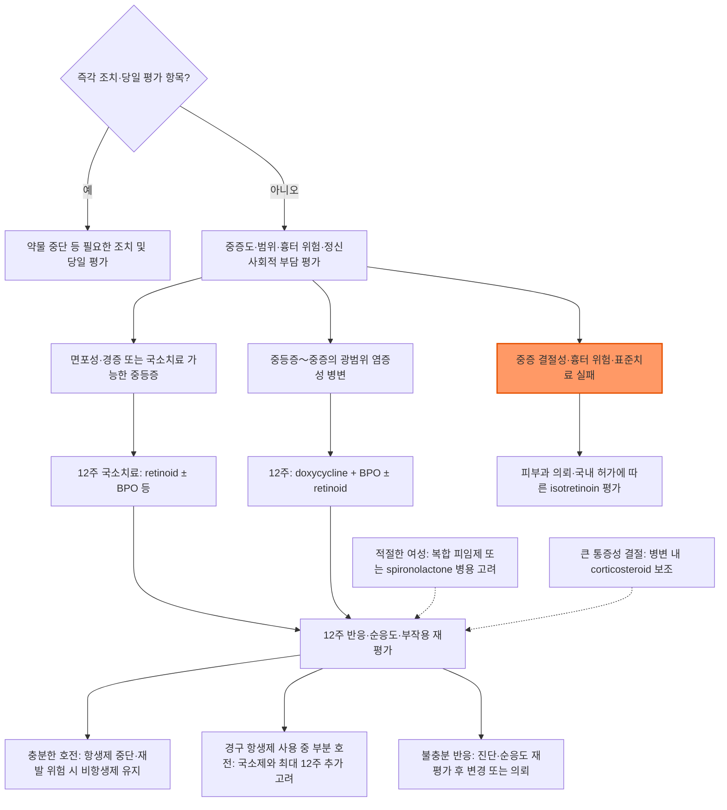

# 여드름 (심상성 여드름) Acne Vulgaris (AV)

## <mark style="color:green;">일반 사항</mark>

* 모낭피지선 단위(pilosebaceous unit)의 만성 염증성 질환; 모낭 과각화, 피지 과다, Cutibacterium acnes와 숙주 면역반응 등이 관여하며 면포, 구진, 농포, 결절 및 흉터를 형성함
* 분포 : sebaceous follicle이 밀집된 곳; 얼굴(주로), 등(upper back), 앞가슴
* 발생 시기 : 사춘기에 흔하며 사춘기 전에도 시작할 수 있음. 청소년기에는 남성에서 중증 병변이 흔하고, 성인 여드름은 여성에서 더 흔함. 성인기에 지속되거나 새로 발생할 수 있으며 유병률은 연구 대상·연령·정의에 따라 차이가 큼
  * 마스크 사용과 관련하여 유병률이 증가하였다는 보고가 있음(acne mechanica)
* 여드름 관리에 있어서 객관적 징후 뿐 아니라 주관적 척도, 삶의 질이 중요함

## <mark style="color:green;">원인</mark>

### <mark style="color:orange;">병인</mark>

1. 모낭 상피의 비정상적인 각질화에 의해 모낭 내강에 각질화된 세포가 들어참(각질 세포 plug)
2. 피지선에서의 피지 과잉 생산 (✽피지는 세균 증식의 배지 역할을 함)
3. 모낭에서의 혐기성 균인 _Cutibacterium acnes_(예전 _Propionibacterium acnes_) 증식
   * proinflammatory mediator 활성 증가 → 염증 조장
   * lipase 생성 → 피지의 TG를 free fatty acid로 분해하고 이것이 염증 반응을 유발
   * C. acnes는 정상 피부에도 존재하는 공생균이며, 단순한 균의 양뿐 아니라 균주 구성·미생물군집 변화와 숙주 염증반응이 병인에 관여함; 여드름을 단순 세균 감염으로 보지 않음
4. androgen(testosterone, DHEA-S) 활성 : 피지 생성 및 각질 세포 증식을 자극
5. 피부 염증
   * 각질 세포 plug에 의한 피지 모낭의 폐쇄 → 면포 형성 → 모낭 팽창 & 파열 → 진피층으로의 분출 및 염증 반응; 염증 반응이 표면에서 발생하면 구진/농포 형성, 보다 깊은 곳에서 발생하면 결절 형성

### <mark style="color:orange;">관련/악화 인자</mark>

* 유전 : 환자의 50%에서 가족력이 있으며, 가족력이 있는 경우 보다 조기 발생 및 중증 발생
* 호르몬 관련 : 사춘기(androgen 활성 증가), 월경(여드름 발생 여성의 25\~50%가 월경 1주 전 악화), 임신 3분기, 폐경기, 내분비 질환(다낭성난소증후군, 쿠싱증후군)
  * 하악 및 목의 전측방을 따라 분포하는 크고 깊은 염증 병변, menstrual flare, androgen 과다 징후(예: hirsutism, 불규칙 월경)는 호르몬 연관을 시사
* 약물 : corticosteroid, testosterone·anabolic steroid, 일부 progestin, lithium, iodine·bromide, isoniazid, phenytoin, 고용량 Vit B6/B12, EGFR 억제제 등; 약물 유발 여드름모양발진은 면포 없이 단형성 구진·농포로 나타날 수 있음
* 더위, 습함, 열대 기후
  * 계절별 경과는 개인차가 큼. 햇빛 노출을 여드름 치료로 권하지 않으며, 자외선은 피부 자극·염증 후 색소침착을 악화시킬 수 있음
* 피부 자극 및 손상 : 마찰, 외상, 머리띠, 휴대폰, 화장품, 헬멧 턱받침, 여드름 짜냄
* 지성 화장품, 머리 기름
* 흡연, 스트레스
* 식이 : 논란; 초콜릿, 기름진 음식, 설탕이 든 음료, 흰 빵, 유제품 등이 관련되는 경우가 있음

## <mark style="color:green;">임상 양상</mark>

* 면포, 농포, 염증성 구진, 결절, 흉터(심하고 깊은 염증이나 잘못된 압출 관련); 보통 여러 형태의 여드름이 동시에 존재
* 통증/압통

**IGA(Investigator’s Global Assessment) 중증도 — 0～4 척도의 예**

✽IGA는 연구마다 세부 정의가 다르며 하나의 표준화된 척도는 아님. 아래는 임상 설명용 예시이며, 얼굴 침범 면적만으로 등급을 결정하지 않음. 몸통 침범, 결절, 흉터 및 정신사회적 부담도 별도로 평가함.

<table><thead><tr><th width="70" align="center">등급</th><th width="140">명칭</th><th>소견 예시</th></tr></thead><tbody><tr><td align="center">0</td><td>깨끗(clear)</td><td>활성 면포·염증성 병변이 없음; 잔여 홍반·색소침착은 남을 수 있음</td></tr><tr><td align="center">1</td><td>거의 깨끗(almost clear)</td><td>소수의 면포와 매우 적은 작은 염증성 병변</td></tr><tr><td align="center">2</td><td>경증(mild)</td><td>소수의 면포·구진·농포; 깊은 결절성 병변은 없음</td></tr><tr><td align="center">3</td><td>중등증(moderate)</td><td>다수의 면포·구진·농포; 척도에 따라 소수의 결절이 허용될 수 있음</td></tr><tr><td align="center">4</td><td>중증(severe)</td><td>광범위하고 심한 염증성 병변; 결절성 병변이 동반될 수 있음</td></tr></tbody></table>

### <mark style="color:orange;">면포 (Comedone, 여드름집)</mark>

* 각질, 지질, 세균 등으로 피지 모낭이 채워진 상태(plugging)

#### <mark style="color:$primary;">폐쇄성 면포 (Closed comedone; Whitehead)</mark>

* follicular neck의 폐쇄로 표피 바로 밑에서 follicular duct의 낭종성 팽창이 발생
* 본래 피부색 또는 주변 피부보다 약간 밝은 색의 1\~2 ㎜ 크기의 구진
* 입구에 바늘 크기의 구멍만 존재, 내용물이 쉽게 배출되지 않음
* 염증성 여드름(붉은 구진, 농포, 결절, 낭종)의 전구 상태

#### <mark style="color:$primary;">개방성 면포 (Open comedone; Blackhead)</mark>

* 확장된 모낭 입구에 각질·피지가 차 있으며, 멜라닌과 내용물의 산화 등에 의해 검게 보임; 오염이나 불결함 때문이 아님
* 개방된 입구에서 검은 각질·피지 마개가 관찰됨
* 염증 증상은 별로 없는 상태

### <mark style="color:orange;">결절낭성 여드름 (Nodulocystic lesion)</mark>

* 진피 깊숙이 형성되는 통증성 염증 결절; 일부는 액화·변동감을 보임. 흔히 낭종으로 부르지만 진정한 상피성 낭종과는 다르며 흉터 위험이 높음

### <mark style="color:$danger;">🚩 Red Flags!</mark>

<mark style="color:$danger;">**즉각 조치 또는 의뢰**</mark>

* **Acne fulminans 의심** : 갑자기 발생한 통증성·궤양성·출혈성 여드름 병변과 발열, 심한 권태감, 관절통 또는 골통 → 당일 피부과/응급실 의뢰(24시간 이내 평가)
* 현재 자살 의도·계획, 최근 자해·자살 시도 또는 안전 유지가 어려운 급격한 정신건강 악화 → 즉시 안전 확보 및 응급 평가(119/응급실; 자살예방 상담전화 109)
* Isotretinoin 복용 중 임신 또는 임신 의심 → 즉시 중단하고 당일 처방의·산부인과에 연락
* Isotretinoin/tetracycline 복용 중 새로 발생한 심한 두통과 시력장애·구토 → 약물 중단 및 두개내압 상승에 대한 당일 응급 평가

<mark style="color:$warning;">**당일 정신건강 평가**</mark>

* 자살 사고가 있으나 현재 의도·계획이 없거나, 심한 우울·불안이 동반되는 경우 → 위험도를 당일 평가하고 적절한 정신건강 진료로 연결; 안전 유지가 어려우면 즉각 조치

<mark style="color:$info;">**조기 피부과 의뢰 / 추가 평가**</mark>

* acne conglobata, 심한 결절성 또는 결절낭성 여드름
* 빠르게 진행하는 흉터 또는 지속적인 염증 후 색소 변화
* 진단이 불확실하거나 그람음성 모낭염 등 다른 질환이 의심되는 경우
* 갑작스러운 중증 여드름과 빠른 다모증·남성화 또는 사춘기 전 비전형적 여드름 → 내분비 질환 평가 고려

<mark style="color:$info;">**외래 추적 / 추가 평가 계획**</mark> <mark style="color:$info;">- 즉각 위험 낮으나 호전 없으면 의뢰</mark>

* 경증～중등증 여드름이 서로 다른 12주 치료 2코스에 반응하지 않는 경우
* 중등증～중증 여드름이 경구 항생제를 포함한 적절한 12주 병합치료에 반응하지 않는 경우
* 여드름으로 인한 지속적인 정신적 고통 또는 삶의 질 저하

## <mark style="color:green;">진단</mark>

* 피임약/약물/화장품/월경 관련 증상 변화, 나이, 생활 방식, 환경, 가족력, 이전 치료력

### <mark style="color:orange;">실험실 검사</mark>

* 전형적인 여드름의 진단에는 일률적인 혈액검사·배양검사가 필요하지 않음; 내분비 질환 의심, 비전형적 병변 및 전신 약제의 안전성 평가 시 선택적으로 시행
* hyperandrogenism 의심 여성에서 total/free testosterone, DHEA-S를 우선 검사. 임상상에 따라 17-hydroxyprogesterone, prolactin, TSH 등을 선택하며 LH/FSH는 일률적인 선별검사가 아님
* 장기간 경구 항생제 치료 중 갑자기 악화되거나 코 주위·중앙 얼굴에 단형성 농포가 발생하면 그람음성 모낭염을 고려하여 농포 배양검사 시행
* isotretinoin을 투여할 경우 baseline LFT & TG, 가임 여성에서 hCG 측정

### <mark style="color:orange;">감별 진단</mark>

* 여드름 모양 발진이 나타날 수 있는 원발성 피부 질환·약물·전신 질환의 감별

<table><thead><tr><th width="150">범주</th><th>예시</th></tr></thead><tbody><tr><td>원발성 피부 질환</td><td>주사(rosacea), 세균성·Malassezia 모낭염, 입주위피부염, 모공각화증; 면포 유무, 단형성·소양성 여부 및 분포로 감별</td></tr><tr><td>약물 유발</td><td>steroid, lithium, iodine</td></tr><tr><td>전신 질환</td><td>다낭성난소증후군, Cushing 증후군, 안드로겐 분비 종양; 반복 구강·생식기 궤양 등이 동반되면 Behçet병의 여드름모양 병변 고려</td></tr></tbody></table>

* 장기간 tetracycline계 항생제 치료 중 코·입 주위 등 periorificial 부위에 갑자기 발생한 단형성 농포\~결절은 그람음성 모낭염을 시사 → 농포 배양검사
* 몸통(trunk)의 소양성 단형성 구진·농포는 Malassezia(구 Pityrosporum) 모낭염을 시사할 수 있음. 모낭 내용물의 KOH 직접도말을 우선 고려하고, 진단이 불확실하거나 치료에 반응하지 않으면 피부과 의뢰 후 지질 함유 특수 배지를 이용한 배양 또는 조직검사를 고려

***


```mermaid
flowchart TD
    R{"즉각 조치·당일 평가 항목?"} --->|예| U["약물 중단 등 필요한 조치 및 당일 평가"]
    R --->|아니오| A["중증도·범위·흉터 위험·정신사회적 부담 평가"]
    A ---> B["면포성·경증 또는 국소치료 가능한 중등증"]
    A ---> C["중등증～중증의 광범위 염증성 병변"]
    A ---> D["중증 결절성·흉터 위험·표준치료 실패"]
    B ---> E["12주 국소치료: retinoid ± BPO 등"]
    C ---> F["12주: doxycycline + BPO ± retinoid"]
    D ---> H["피부과 의뢰·국내 허가에 따른 isotretinoin 평가"]
    E ---> I["12주 반응·순응도·부작용 재평가"]
    F ---> I
    I ---> J["충분한 호전: 항생제 중단·재발 위험 시 비항생제 유지"]
    I ---> K["경구 항생제 사용 중 부분 호전: 국소제와 최대 12주 추가 고려"]
    I ---> L["불충분 반응: 진단·순응도 재평가 후 변경 또는 의뢰"]
    G["적절한 여성: 복합 피임제 또는 spironolactone 병용 고려"] -.-> I
    M["큰 통증성 결절: 병변 내 corticosteroid 보조"] -.-> I
    style D fill:#f96,stroke:#e65100,stroke-width:2px
```

<p align="center"><strong>중증도별 치료 및 평가 알고리듬</strong></p>

<p align="center"><em><mark style="color:$info;">Ref. AAD 2024 및 NICE NG198 치료·12주 재평가 권고를 바탕으로 구성</mark></em></p>

***

## <mark style="background-color:$warning;">Management</mark>

### <mark style="color:orange;">치료 방침</mark>

* 이상각화증 정상화, 과도한 피지 생성 억제, 항염/항균, 여드름집 제거
* 중증도와 hyperpigmentation 후유증 등을 감안하여 치료 수준을 결정

### <mark style="color:orange;">치료 경과</mark>

* 치료 초기 2\~4주에 자극 또는 일시적인 flare가 나타날 수 있으나 모든 환자에서 발생하는 것은 아님
* 치료 반응까지 6～8주, 충분한 호전까지 8～12주 소요; 등과 가슴은 보다 장시간 소요(3\~4개월)
* 새로운 병변 개수로 치료에 대한 반응 평가
* 치료 12주에 평가
  * 완전히 호전되었으면 항생제(국소/경구)를 중단하고, 재발 위험이 있으면 비항생제 국소 유지요법(retinoid±BPO)을 고려
  * 경구 항생제를 사용 중이고 부분 호전되었으면 비항생제 국소 치료와 함께 최대 12주 더 연장할 수 있음; 국소치료만 사용한 환자에게 자동으로 경구 항생제를 추가하지 않음
  * 반응이 불충분하면 순응도·도포 범위·피부 자극, 진단 오류, 호르몬 요인 및 악화 약물/화장품을 재평가한 후 다른 12주 치료 또는 의뢰 고려
* 치료 중 악화·재발 시 순응도, 진단 오류, 호르몬 요인 등을 먼저 검토하며 항생제 내성은 여러 가능성 중 하나로 고려
* 여성에서 반복 재발하고 다모증·불규칙 월경 등이 동반되면 hyperandrogenism 또는 다른 호르몬 질환을 평가
* 유지요법 : 재발이 잦으면 adapalene/BPO를 우선 고려; 불내성·금기 시 adapalene, azelaic acid 또는 BPO 단독을 선택하고 약 12주 후 재평가

## <mark style="color:green;">비-약물 치료 및 예방</mark>

* 피부 관리와 비면포생성 제품 선택, 병변을 뜯지 않는 습관을 교육함
* 규칙적인 생활·충분한 수면·스트레스 관리는 전반적인 건강과 치료 지속에 도움이 될 수 있으나 단독 치료 효과는 확립되지 않음

#### <mark style="color:$primary;">회피</mark>

* 병변을 반복해서 뜯거나 긁으면 염증과 흉터 위험이 증가하므로 피함
* 자가 압출은 염증·흉터를 악화시킬 수 있어 피하며, 필요한 면포 압출은 숙련된 의료인이 시행
* 화장은 oil-based 또는 comedogenic 제품을 피하고 취침 전 제거
* 피부 손상 주의 : 면도기 사용 주의(특히 칼날면도기)
* 헤어 젤, 무스, 스프레이, 옷 등에 의한 피부 자극을 피함
* 지나친 햇빛 노출을 피함 : 양산, oil-free/noncomedogenic 햇빛 차단제 사용
* 기름진 미용 제품 사용 회피 : 얼굴 및 두발에 사용 시 모공을 막을 수 있음
* 피부 건조 회피 : noncomedogenic moisturizer가 자극을 줄일 수 있음

#### <mark style="color:$primary;">세척</mark>

* 청결한 피부 관리 : 중성 또는 약산성 비누로 하루 2회 이하 세안, 문지르지 않음. 단, 여드름과 나쁜 위생이나 지방의 관계에 대한 증거는 부족함
* 스크럽·과도한 각질 제거는 자극을 유발하므로 피함. Salicylic acid 외용액(클리어틴)은 세정제가 아닌 치료제로 아래 약물 항목을 참조
* 알코올 함유 세정제는 자극·건조를 유발할 수 있어 일상적인 사용을 권하지 않음

#### <mark style="color:$primary;">음식</mark>

* 여드름을 악화시킨 경험이 있는 음식은 피함
* 저혈당부하 식사가 일부 환자에서 도움이 될 가능성이 있으나 소규모 RCT 결과가 제한적이고 서로 일치하지 않음. 우유 섭취와의 연관성은 주로 관찰연구에서 보고되었으며, 특정 음식이나 식단을 여드름 치료로 일률적으로 제한할 근거는 부족함

#### <mark style="color:$primary;">광선·광역학 치료</mark>

* Blue/red light, photodynamic therapy(ALA), 화학박피, 면포 압출, 레이저·IPL, microneedle RF 등 물리적 치료는 AAD 2024 체계적 문헌고찰에서 권고를 형성할 만한 근거가 부족하여 표준치료로 일상적으로 권장하지 않음. 이는 모든 물리적 치료에 대한 반대 권고를 의미하지는 않음
* 예외적으로 adapalene 0.3% 겔에 pneumatic broadband light를 추가하는 것은 단독 대비 이득이 없고 과다색소침착·자반 위험이 있어 **조건부 반대 권고**(AAD 2024)
* 표준 국소·전신 치료가 효과가 없거나 금기·불내성인 중등증～중증 환자에서 피부과 의뢰 후 제한적으로 고려
* 특정 기기의 치료 일정(예: `4주간 주 2회, 15분/회`)을 일반 처방으로 적용하지 않음
* (참고) 1726 nm 레이저는 2022년 미국 FDA 510(k) 허가(clearance)를 받았으나, RCT 부재로 2024 AAD 가이드라인에서는 근거를 평가하지 않았음; 국내 허가·유통 여부 확인

## <mark style="color:green;">약물 치료</mark>

* 강한 권고 : benzoyl peroxide, 국소 retinoid, 국소 항생제, 경구 doxycycline; 중증 또는 다른 요법으로 실패한 경우 경구 isotretinoin
* 조건부 권고 : 국소 clascoterone, salicylic acid, azelaic acid; 경구 minocycline, sarecycline, 복합 경구 피임제, spironolactone
* 실천적 방법(good practice statement, AAD 2024 - 근거등급·권고강도를 별도로 매긴 권고와 구분) : 여러 작용 기전의 국소제 병합, 전신 항생제 사용을 가능한 한 제한, 전신 항생제 사용 시 BPO 등 국소제와 병용, (큰 구진·결절에 대하여) corticosteroid 병변 내 주사를 보조 치료로 추가

### <mark style="color:orange;">국소 약물 치료제</mark>

* 보통 1일 1\~2회, (구진/농포 등 병소 뿐 아니라) 환부 전체에 도포
* 약제에 의한 자극이 심한 경우 적응을 위해 격일 도포로 시작하여 점차 빈도를 늘림
* 의미 있는 효과는 6～8주 후 나타날 수 있으며, 원칙적으로 12주 치료 후 반응·부작용·순응도를 평가
* 용매 선택
  * 건성/민감 부위 : 크림, 로션, 연고
  * 지성/습한 부위 : 겔, 용액
  * 털 부위 : 로션, hydrogel, 폼


**임신 중 국소 여드름 치료제 (AAD 2024 및 국내 허가사항)**\
Azelaic acid, benzoyl peroxide, 국소 erythromycin·clindamycin은 전신 흡수가 제한적이어서 태아 위해가 예상되지 않음. Salicylic acid는 노출 부위와 사용 기간이 제한적이면 사용 가능하나 넓은 부위·밀폐 도포는 피함. 국소 dapsone은 임신·수유 중 자료가 제한적임. Clascoterone(윈레비)은 국내 허가상 임부 금기이며 수유 중 안전성 자료가 없음. Tazarotene은 임신 중 금기이며, tretinoin·adapalene·trifarotene도 사람에서 기형 유발이 입증되지는 않았으나 안전성 자료가 불충분하므로 임신 중 또는 임신 계획 중에는 사용하지 않음. 국소 minocycline은 임신·수유 중 권장하지 않음.


#### <mark style="color:$primary;">Retinoid</mark>

* 작용 : 각질 용해, 과각화 정상화, 미세 면포 형성 억제 및 감소, 항염
* 여드름의 모든 단계에 적용; 의미 있는 호전까지 4주 이상 소요; 호전 후 수개월간 추가 도포
* 주의 : 눈/코/입 주위 도포 회피. 자외선 차단을 요함. 임신 중 또는 임신 계획 중에는 사용하지 않음. 국소 retinoid 중단 후 6개월간 피임해야 한다는 규정은 없음(경구 isotretinoin과 혼동 주의)
* 부작용 : 자극감, 박피, 홍반; 사용 초기에 보다 흔하며 저자극성 클렌저나 보습제가 도움이 됨
* 별도 제형의 BPO나 azelaic acid와 병용 시 retinoid는 야간, 다른 약제는 아침에 도포할 수 있음
  * Adapalene은 광안정성이 높고 BPO와 화학적으로 안정하여 동시 도포 또는 adapalene/BPO 고정복합제로 사용할 수 있음. 고정복합제는 1일 1회 저녁 도포
  * Trifarotene은 BPO에 의한 비활성화가 확립되지는 않았으나 병용 시 피부 자극이 증가할 수 있으므로, 함께 사용해야 하면 BPO는 아침, trifarotene은 저녁으로 나누어 도포하는 것을 고려
* 염증성 여드름에 대하여 항생제와 병용할 때에는 BPO도 포함하여 내성 위험을 줄임
* tretinoin : 0.025\~0.1% qd 야간(국내 유통 제품·농도 확인; 스티바에이크림은 판매 중단)
  * 0.025% 크림을 2～3일마다 야간에 1회 도포로 시작하여 점차 빈도를 늘려 (2～4주 후) 매일 밤 세안 20\~30분 후(피부가 건조된 후) 도포; 도포 일수를 늘리지 못하는 경우에도 효과 있음\
    ✽일반 tretinoin 제형은 빛과 BPO에 의해 분해될 수 있어 BPO는 아침, tretinoin은 저녁으로 분리함. 안정성이 제형별로 다르므로 모든 retinoid에 같은 제한을 적용하지 않음
* adapalene : tretinoin보다 일반적으로 자극이 적으며, 효과는 비교 제형·농도에 따라 다름 (비급여)
  * 국내 디페린 크림/겔은 0.1%, 12세 이상에서 1일 1회 취침 전 도포 [<mark style="color:blue;">디페린 크림/겔</mark>]
  * BPO 고정복합제 : [<mark style="color:blue;">에피듀오 겔 0.1%/2.5%</mark>]은 9세 이상; [<mark style="color:blue;">에피듀오 포르테 겔 0.3%/2.5%</mark>]은 12세 이상 중등증～중증 여드름; 1일 1회 저녁 도포
* tazarotene : 국외 여드름 제형으로 0.1% 크림/겔 등 사용; 국내 제품·여드름 적응증 확인 필요. 임부 금기이며 자극에 주의
* trifarotene : 선택적 retinoic acid receptor(RAR)-γ 작용제; 0.005% 크림, 만 9세 이상 중등도 얼굴·몸통 여드름에 1일 1회 저녁 도포 [<mark style="color:blue;">아크리프 크림</mark>]

#### <mark style="color:$primary;">Benzoyl peroxide (BPO)</mark>

* 작용 : 항균, 항염, 각질 용해/과각화 정상화, 면포 용해
* 장점 : 내성 발생이 없어 국소 항생제보다 유리
* 약제 농도와 치료 효과가 비례하지는 않음
* 주의 : 눈/코/입 주위 도포는 피함. 자외선 차단을 요함(SPF ≥30의 자외선 차단제 권고)
* 부작용 : 자극감, 건조, 홍반, 광과민; 농도가 진할수록 부작용 증가; 의복을 탈색시킬 수 있음
* 용법 : qd(hs)～bid; 2.5～10%(농도가 높은 것이 반드시 더 효과적이지는 않음) [<mark style="color:blue;">파티마 겔</mark>](../%EB%B9%84%EB%B3%B4%ED%97%98/)


**BPO 제품과 벤젠(benzene) 이슈 (2024～2025)**\
2024년 3월 Valisure社가 일부 BPO 제품에서 고온 보관 시 벤젠이 형성될 수 있다는 citizen petition을 제기하였음. 2025년 3월 FDA가 95개 제품을 자체 검사한 결과 90% 이상에서 벤젠이 검출되지 않거나 극미량이었고, 6개 제품에서 높은 수치가 확인되어 해당 제품의 특정 로트가 소매 단계에서 자율 회수되었음. 제조사 자체 검사로 추가 회수된 Zapzyt 제품도 있어 전체 회수 제품을 6개로 한정하지 않음. FDA는 수십 년간 매일 사용해도 암 발생 위험은 매우 낮다고 밝혔으며, BPO 사용과 악성종양 위험 증가는 관련이 없다는 후향적 코호트 연구도 발표됨(Garate D, et al. J Am Acad Dermatol. 2024;91(5):966-968). 이는 미국의 특정 제품·로트에 관한 조치이며 국내 모든 BPO 제품의 회수를 뜻하지 않음. 고온(자동차 내부 등) 장기 보관을 피하고 각 제품의 보관온도·사용기한을 따름.


#### <mark style="color:$primary;">항생제 (국소)</mark>

* 작용 : 항균·항염; 국소 염증성 병변에 사용하며 광범위한 중등증～중증 병변에는 국소제만으로 부족할 수 있음
* 장점 : 자극 또는 건조 부작용이 retinoid 또는 benzoyl peroxide보다 적음
* 단점 : 미세 면포 형성 억제 효과가 없고 내성 발생 가능성이 있어 단일 치료제로는 권하지 않음
* 대상 : 염증성 여드름에서 BPO를 포함한 병합치료의 구성 약제로 고려; retinoid를 추가할 수 있으며 장기 사용은 피함
* **Clindamycin·erythromycin 등 항균 항생제 단독 사용 금지** : BPO가 포함된 치료와 병용하며, 경구 항생제와 국소 항생제를 함께 사용하지 않음
* 부작용 : 건조, 자극감; 용매에 따라 자극이 다름. Clindamycin은 국소제에서도 드물게 항생제 관련 대장염이 보고되어 지속적·심한 설사 시 중단·평가
* clindamycin : 1일 1\~2회; 1% [<mark style="color:blue;">크레오신 티 외용액</mark>](../%EB%B9%84%EB%B3%B4%ED%97%98/)
* erythromycin : C. acnes 내성이 많음
* sulfacetamide : 국내 유통 여부 확인
* minocycline 국소 foam(4%) : 미국에서 FDA 승인된 국소 항생제이나 국내 미유통(2024 AAD 권고 기준)
* 복합제 : clindamycin/BPO [<mark style="color:blue;">듀악 겔</mark>](../%EB%B9%84%EB%B3%B4%ED%97%98/), clindamycin/tretinoin

#### <mark style="color:$primary;">Dapsone (국소)</mark>

* dapsone : 국외 5% 겔 bid 또는 7.5% 겔 qd; 항염 효과로 염증성 여드름에 사용(국내 허가·유통 확인 필요). BPO와 같은 시각에 도포하면 일시적인 황색·주황색 착색이 생길 수 있으며 드물게 methemoglobinemia에 주의

#### <mark style="color:$primary;">Clascoterone</mark>

* 국소 antiandrogen(안드로겐 수용체에 직접 결합)
* 작용 : 피지 세포의 androgen-mediated lipid 및 inflammatory cytokine 합성 억제; 전신 흡수가 제한적이어서 남녀 모두 사용 가능
* 효과 대비 가격 등을 고려하여 '조건부 권고'
* 12세 이상 중등도～중증 심상성 여드름 : 1% 크림을 환부 전체에 1일 2회(아침·저녁) 얇게 도포; **1회 최대 약 1 g** [<mark style="color:blue;">윈레비크림</mark>](비급여)
* 국내 허가상 **임부 금기**; 상처·습진·화상 부위 및 점막에 사용하지 않음. 수유 중 안전성 자료가 없어 개별 판단
* 보관 : 조제 후 25℃ 이하, 얼리지 않음. **조제 후 180일 또는 최초 개봉 후 1개월 중 먼저 도래하는 날짜에 폐기**
* 부작용·주의 : 홍반, 건조, 박피, 작열감 등 국소 자극. 광범위한 부위, 손상된 피부 또는 밀폐 상태에서의 사용은 전신 흡수를 증가시킬 수 있으며, HPA axis suppression 및 혈청 K 상승 가능성에 유의함. 국내 허가사항에 따른 사용상 주의를 확인

#### <mark style="color:$primary;">Salicylic acid</mark>

* 작용 : 면포 용해, 화학적 박피, 과각화 정상화
* 효과 : 면포와 염증성 병변에 일부 효과; AAD 2024 조건부 권고이며 자극·노출 범위에 주의
* 부작용 : 피부 건조, 자극
* 일반의약품 농도 범위는 0.5\~2%(고농도 10\~30% 화학박피는 시술 영역으로 별도)
* 용법 : 1일 1\~2회 도포 [<mark style="color:blue;">클리어틴 외용액</mark>](비급여)

#### <mark style="color:$primary;">Azelaic acid</mark>

* 작용 : 항균, 면포 용해, 각질 용해, 염증 후 과색소화 감소
* 적용 : 경증～중등증 여드름의 대안·병합치료; retinoid 불내성, 임신 중 치료 또는 염증 후 색소침착이 함께 있을 때 고려
* 효과 : 면포·염증성 병변 개선; AAD 2024 조건부 권고
* 의미 있는 호전까지 4주 이상이 소요되며 호전 후 수개월간 추가 적용을 권고함
* 부작용 : 작열감, 홍반, 건조, 박피; 드물게 저색소증
* 용법 : 20% 크림 qd\~bid [<mark style="color:blue;">아젤리아 크림</mark>](../%EB%B9%84%EB%B3%B4%ED%97%98/)

### <mark style="color:orange;">경구 약물 치료</mark>

* 중등증～중증의 광범위 염증성 병변, 결절·흉터 위험, 국소치료 실패 또는 적절한 여성의 호르몬 치료 필요성에 따라 선택; 환자 선호를 함께 고려

#### <mark style="color:$primary;">항생제 (경구)</mark>

* 작용 : C. acnes 대사 억제, 항염
* 일반적으로 tetracycline 계열을 사용
* 항생제 관련 합병증 발생을 줄이기 위해 전신 항생제 사용을 제한. 단독으로는 사용하지 않음. 국소 항생제와 병용하지 않음
* BPO를 포함하는 비항생제 국소치료와 병용하며 retinoid를 함께 사용할 수 있음(항생제 사용 기간 및 내성 위험 감소)
* 대상 : 중등증～중증의 광범위 염증성 병변(농포, 결절)에서는 국소 항생제 실패를 기다리지 않고 비항생제 국소제(BPO±retinoid)와 함께 시작할 수 있음
* 투여 기간 : 보통 12주 후 평가. 완전히 호전되면 항생제를 중단하고 비항생제 국소 유지요법으로 전환. 부분 호전 시 국소 치료와 함께 최대 12주 더 연장할 수 있으나, 6개월 초과 사용은 예외적인 경우로 제한하며 3개월마다 재평가
* 정해진 비율로 tapering하지 않으며, 호전 후 국소 항생제를 유지요법으로 사용하지 않음
* tetracycline계 부작용 : 위장 장애(오심, 구토, 설사, 식도염), 칸디다 감염 등 균교대증, 광과민(특히 doxycycline), 치아 착색. Doxycycline은 충분한 물과 복용하고 30분 이상 눕지 않으며, 위장장애가 있으면 음식과 함께 복용할 수 있으나 철분·칼슘·마그네슘·제산제와는 시간차를 둠
* 임신 중·임신 계획 중·수유 중에는 tetracycline계를 피하며 소아·청소년에서는 제품별 금기 연령을 확인; isotretinoin과 병용하지 않음
* Macrolide계(azithromycin 등)는 내성 우려와 제한된 근거로 통상적인 1차 약제로 사용하지 않음; tetracycline 사용이 불가능한 경우 대안을 개별 판단
* TMP-SMX는 Stevens-Johnson 증후군, 독성 표피 괴사, 급성 호흡부전 등 중증 이상반응 위험이 있어 1차 선택으로 사용하지 않음(AAD 2024). Tetracycline 사용이 불가능하거나 난치성인 경우에 한해 위험·편익을 평가하여 제한적으로 고려

**종류**

* doxycycline : 100 ㎎ qd～bid [<mark style="color:blue;">독시사이클린</mark>]
  * 저용량(20 ㎎ bid, 서방형 40 ㎎ qd)은 일부 연구에서 중등도 염증성 여드름에 효과가 보고되었으나 국내 제형·허가 여부를 확인
* minocycline : doxycycline을 사용할 수 없는 경우 등의 대안; 현훈, 자가면역간염, 피부 과색소침착, 약물유발루푸스 등 잠재적 부작용에 대한 우려로 조건부 권고; 보통 50 ㎎ bid 또는 100 ㎎ qd, 필요 시 최대 100 ㎎ bid [<mark style="color:blue;">미노씬</mark>]
* sarecycline : 비교적 좁은 항균 범위의 tetracycline계로 AAD 2024 조건부 권고; 다른 tetracycline계보다 안전하다고 일률적으로 단정하지 않으며 국내 허가·유통 확인 필요

#### <mark style="color:$primary;">복합 경구 피임제 (Estrogen/Progestin)</mark>

* 작용 : circulating free testosterone 감소 → 피지 분비 감소
* 대상 : 하악부 분포, 월경 전 악화 등 호르몬 연관성이 있거나 피임도 원하는 적절한 여성; 다른 치료와 병용 가능
* 3\~6개월 치료 후 효과 평가
* 선택 : estrogen/progestin 복합제(비급여). 여드름 개선 효과뿐 아니라 피임 필요성, 흡연, 연령, 편두통 조짐, VTE 위험, 심혈관 위험 및 환자 선호를 종합하여 선택하며 drospirenone을 일률적으로 우선하지 않음 (☞ [피임제](../227_/131_-contraception.md))
  * [<mark style="color:blue;">야스민</mark>](../21T/) : ethinyl estradiol(EE) 30 ㎍, drospirenone 3 ㎎; 21일간 복용 → 7일간 휴약; 피임 적응증 제품으로 여드름 목적 사용 시 허가 외 여부를 구분
  * [<mark style="color:blue;">야즈</mark>](../28T/) : EE 20 ㎍, drospirenone 3 ㎎; 24일간 연분홍색 → 4일간 흰색(위약) 복용. 국내 여드름 적응증은 피임을 원하는, 피임제 금기가 없는 14세 이상 초경 후 여성의 중등도 여드름
* 주요 금기 : 조짐편두통, VTE 병력·혈전성향, 35세 이상 흡연, 중증/조절되지 않는 고혈압 등; 처방 전 혈압과 개인별 위험 확인

#### <mark style="color:$primary;">Mineralocorticoid receptor antagonist/Antiandrogen</mark>

* 작용 : androgen receptor 차단 및 androgen 생성 억제 (✽여드름 치료는 국내 허가 외 사용이며 FDA도 미승인)
* 여드름 적응증으로는 주로 여성에서 사용됨; 남성에서는 여성형 유방·성욕 감퇴 등 항안드로겐 관련 부작용으로 통상 사용하지 않음(일반적 피부과 진료 관행)
* 근거 : 2023년 영국 SAFA 시험(RCT, 410명)에서 50～100 ㎎/d 투여군이 12주째 IGA 호전 및 24주째 여드름 삶의 질·환자 전반평가에서 위약 대비 유의한 개선을 보임(Santer M, et al. BMJ. 2023;381:e074349)
* 부작용 : 어지럼, 유방 압통, 월경통, 불규칙 월경(용량 의존적, 경구피임제 병용 시 감소), 저혈압, 고칼륨혈증
* 종양 유발 가능성에 대한 경고 문구가 있으나(고용량 동물실험 근거), 450만 명 대상 메타분석에서 유방암·난소암·방광암·신장암·위암·식도암 위험 증가와의 유의한 연관성은 없었고 전립선암 위험은 오히려 낮았음(Bommareddy K, et al. JAMA Dermatol. 2022;158:275-282)
* 경구 피임제와 병용하면 효과적일 수 있음. Drospirenone 함유 제제는 항미네랄코르티코이드 활성이 있으므로 spironolactone과 병용할 때 신기능 저하·고칼륨혈증 및 K 상승 약물 사용 여부를 확인하고, 장기간 spironolactone과 병용하면 야즈 허가사항에 따라 첫 복용 주기 중 혈청 K를 측정
* 임신 중 피함(동물실험에서 태아 남성화 억제 가능성; 인체 자료는 제한적). 신기능 저하, 고칼륨혈증 또는 K 상승 약물 병용 시 baseline 및 추적 K/Cr 검사. 건강한 젊은 여성에서는 반복적인 K 모니터링의 유용성이 낮음(위험군: 고령, 동반질환, 신기능에 영향 주는 약물)
* spironolactone : 25～50 ㎎ qd로 시작하여 반응·내약성에 따라 50～100 ㎎/d(필요 시 최대 200 ㎎/d)로 점증 [<mark style="color:blue;">알닥톤</mark>]; **국내 여드름 허가 외**
  * 치료 전 혈압·신기능·혈청 K와 병용약물을 확인; 건강한 젊은 여성의 반복 K 검사는 생략할 수 있으나 위험군에서는 추적함. 반응은 3～6개월에 걸쳐 나타날 수 있으며 효과적인 피임을 안내

#### <mark style="color:$primary;">Isotretinoin</mark>


**⚠️ 임신 중 절대 금기 - 임신예방 프로그램 준수**\
강력한 기형발생물질로, 임신 가능성이 있는 환자는 복용 1개월 전부터 복용 중 및 종료 후 최소 1개월까지 상보적인 두 가지 피임법을 시행하고 정기적으로 임신검사를 받아야 함. 처방은 1회 최대 30일분으로 제한하고 처방 후 7일 이내 조제. 우울·불안·자살 사고 등 정신건강 변화에 대한 사전 고지와 추적 관찰이 필요함.


* 작용 : 피지선 크기/분비 감소, 과각화 정상화, 미세 면포 형성 예방, 피지 감소에 따른 C. acnes 집락의 간접적 감소, 항염
* 국내 허가 대상 : 다른 치료법으로 잘 치료되지 않는 중증의 결절성·낭포성·응괴성 여드름, 특히 몸통의 낭포성·응괴성 여드름
* AAD 2024는 중증 외에도 흉터 위험·심한 정신사회적 부담·표준치료 실패 시 권고하므로, 국내 허가 범위와 구분하여 피부과에서 판단
* 주의 : 부작용 문제로 제한적 사용
  * 임산부 복용 금지(기형 출산 위험). 임신 가능성이 있는 환자는 복용 최소 1개월 전부터 복용 중 및 종료 후 최소 1개월까지 상보적인 2가지 피임법을 시행
  * 국내 허가상 첫 처방 전 임신검사 음성 2회, 치료 중 매월 처방 전 검사, 종료 약 1개월 후 검사(국내 문구상 5주까지 확인). 1회 처방은 최대 30일분, 처방 후 7일 이내 조제; 임신예방 프로그램 설명·동의 절차 준수
  * 복용 중 및 종료 후 최소 1개월간 헌혈 금지. 다른 사람에게 약을 나누어 주지 않음
  * 임부·수유부 금기; 간·신장 장애, 과도한 고지질혈증 및 제품별 첨가제 알레르기 등 국내 금기 확인
  * 병용 금지 약물 : tetracycline계, Vit A
  * 각질 치료제 병용을 피함(건조 부작용을 증가시킴)
* 부작용 : 콜레스테롤↑, 중성지방↑, 간 효소 수치↑. 구순염, 피부/입술/구강/안구 건조증, 피부 광과민, 코피, 안검염, 결막염, 야간 시각 이상, S. aureus 감염 증가, 관절통, 뇌 내 고혈압, 감정 변화(예: 우울, 자살), 탈모(가역성)
* 실험실 검사 : 투약 전 fasting lipid profile(특히 TG), LFT 및 임신 가능성이 있는 환자의 hCG 측정
  * **국내 허가사항** : 치료 전, 시작 1개월 후, 이후 3개월 간격으로 공복 지질·간기능 검사; 임상상에 따라 간격 조정. 비만·당뇨·이상지질혈증·과음 등 위험군은 더 자주 확인
  * AAD 2024는 건강한 환자의 검사 빈도를 일률적으로 정하지 않으므로 국내 허가사항과 환자 위험도를 함께 고려
  * 유의한 간효소·TG 상승은 재검·용량 감량·중단을 고려; 조절되지 않는 고중성지방혈증 또는 췌장염 증상 시 중단
  * AAD 2024 : **건강한 환자에서** 일률적인 CBC 모니터링은 필요하지 않음; 혈액질환 의심·동반질환·관련 증상이 있으면 별도로 검사
  * 인구기반 연구들에서 isotretinoin 치료와 염증성 장질환(IBD, 궤양성 대장염·크론병) 또는 신경정신 질환 발생 위험의 유의한 연관성은 확인되지 않음(AAD 2024). 다만 여드름 자체가 우울·불안·자살 사고 위험과 연관되어 있으므로 치료 전 선별과 치료 중 정신건강 모니터링을 시행. 성기능 이상 가능성에 대해서도 치료 전 설명·평가하고 치료 중 모니터링을 고려(MHRA 2023)
* 용법 : 보통 0.5 ㎎/㎏/d로 시작하여 내약성과 반응에 따라 0.5～1.0 ㎎/㎏/d #1～2로 조정(간헐 투여보다 매일 투여를 조건부 권고), 식사와 함께 투여 [<mark style="color:blue;">이소티논 연질캡슐 10 ㎎</mark> 등]; 치료기간은 반응·내약성·누적용량에 따라 조정(보통 16～24주이나 더 길어질 수 있음)
  * Lidose-isotretinoin(식사와 무관하게 흡수율이 비교적 일정한 제형)은 표준 isotretinoin과 비열등한 효과를 보여 AAD 2024에서 조건부로 양쪽 모두 권고함; 국내 유통 여부 확인
  * 투여 초기에 일시적으로 악화될 수 있음. 유의한 flare가 발생하면 경구 prednisolone 추가를 고려하며, acne fulminans 또는 매우 심한 염증성 병변에서는 피부과 전문의 관리하에 저용량 isotretinoin과 corticosteroid 병용 고려
  * 불내약성·부작용 위험이 높으면 0.5 ㎎/㎏/d 미만의 저용량 일일요법을 고려; 낮은 용량에서는 치료기간 연장·재발 위험을 함께 설명
  * 치료 종료 후에도 호전될 수 있어 재치료는 최소 8주 후 반응·재발 정도를 평가하여 결정
* 치료 종료 : 전통적으로 누적 120～150 ㎎/㎏을 목표로 하나, 충분히 호전되고 새 병변이 4～8주간 없으면 더 일찍 종료할 수 있음
* 재발은 성별·연령, 피지 분비, 호르몬 요인, 치료 종료 시 활성 병변, 누적용량 및 유지치료 등 여러 요인의 영향을 받으므로 특정 누적용량에 고정된 재발률을 적용하지 않음
* 저용량 간헐요법(예: 매월 1주 이내)은 지속적인 일일요법보다 효과가 낮아 일상적으로 권하지 않음
* **국내 허가사항**은 복용 중 및 종료 후 5～6개월간 화학박피·레이저 시술과 왁스제모 회피를 명시함. 일부 국제 합의는 표재성 박피·비박피/분획 레이저의 일률적인 연기 근거가 부족하다고 보나, 기계적 dermabrasion·완전 박피성 레이저는 피하며 국내 허가 문구와 시술 종류를 고려해 피부과에서 판단

**병변 양상에 따른 약제의 역할**

<table><thead><tr><th width="190">약제</th><th>주요 역할</th><th>임상 적용 시 주의</th></tr></thead><tbody><tr><td>국소 retinoid</td><td>면포·미세면포 억제 및 염증성 병변 치료; 유지요법</td><td>임신 중 회피; 자극 조절</td></tr><tr><td>BPO</td><td>염증성 병변 및 일부 면포; 항생제 내성 억제를 위한 병용</td><td>자극·탈색 주의</td></tr><tr><td>Azelaic acid</td><td>면포·염증성 병변, 염증 후 색소침착</td><td>임신 중 대안으로 고려</td></tr><tr><td>국소 항생제 / 항생제 복합제</td><td>주로 염증성 병변; BPO와 병용</td><td>단독·유지요법 금지; retinoid/항생제 복합제에도 BPO 병용</td></tr><tr><td>Retinoid/BPO</td><td>면포와 염증성 병변을 함께 치료; 유지요법</td><td>자극에 따라 도포 빈도 조절</td></tr><tr><td>Clascoterone</td><td>안드로겐 수용체 억제를 통한 국소 치료</td><td>12세 이상 국내 허가; 임부 금기</td></tr><tr><td>경구 항생제</td><td>중등증～중증의 광범위 염증성 병변</td><td>BPO를 포함한 국소치료와 병용; 기간 제한</td></tr><tr><td>복합 피임제 / spironolactone</td><td>적절한 여성의 염증성·호르몬 연관 여드름</td><td>효과까지 수개월; 제품별 허가·금기·피임 확인</td></tr><tr><td>경구 isotretinoin</td><td>난치성 중증 결절성 여드름 등</td><td>국내 허가·임신예방 프로그램·안전성 모니터링 준수</td></tr></tbody></table>

✽이 표는 치료 역할을 요약한 것으로 약제 간 직접 비교효과나 근거등급을 의미하지 않음. 깊은 결절·낭포성 병변은 국소제만으로 충분하지 않으며, 큰 통증성 결절에는 병변 내 corticosteroid를 보조적으로 고려함.

## <mark style="color:green;">시술 및 기타 처치</mark>

### <mark style="color:orange;">Steroid 병소 내 주사</mark>

* 대상 : 결절성 염증성 여드름
* 부작용 : 피부 위축, hypopigmentation, telangiectasia
* triamcinolone : 피부과에서 저농도·소량 사용; 예를 들어 2.5 ㎎/㎖, 병소당 0.05 ㎖, 30G 바늘. 농도·주입량은 병변 크기·부위에 따라 조정하며 피부 위축·저색소침착 위험 설명
  * NICE는 심한 염증성 낭포에 0.6 ㎎/㎖ 용액을 병변 직경 1 ㎝당 0.1 ㎖로 제시하므로, 2.5 ㎎/㎖를 모든 병변의 표준 용량으로 적용하지 않음

### <mark style="color:orange;">피부 박피술</mark>

* 여드름의 1차 치료로 권고하지 않음; 추가 연구 필요
* Isotretinoin과 시술의 시점은 위 약물 항목 참조; 국내 허가상 박피·레이저·왁스제모 회피 기간과 시술 깊이를 확인
* 어두운 피부색은 절대금기가 아니나 염증 후 색소침착 위험이 높아 숙련된 시술자, 보수적인 강도 및 충분한 사전·사후 관리가 필요

***

### <mark style="color:red;">질병코드</mark>

L70 여드름 Acne

L70.0 보통여드름 Acne vulgaris

L70.1 응괴성 여드름 Acne conglobata

***

## <mark style="color:purple;">처방례</mark>

✽다음은 성인 예시 처방이며 연령, 임신 가능성, 병변 중증도·범위, 신·간기능, 병용약물 및 국내 허가사항에 따라 조정함.

> **처방례 1. 면포성 또는 경증 여드름**
>
> ```
> 디페린 겔 0.1% 15 g/tb   세안 후 건조된 피부에 얇게  qhs
> ```
>
> _✽자극이 있으면 주 2\~3회 또는 격일로 시작하여 점차 매일 도포로 늘림_

> **처방례 2. 경증～중등증 염증성 여드름**
>
> ```
> 에피듀오 겔 0.1%/2.5% 15 g/tb   환부 전체에 얇게  qhs
> ```
>
> _✽또는 clindamycin/BPO 복합제(듀악 겔)로 대체 가능; 국소 clindamycin(항생제) 단독 처방은 하지 않음_

> **처방례 3. 중등증～중증의 광범위 염증성 여드름**
>
> ```
> 독시사이클린 100 ㎎ 1T   qd  ×12주
> 에피듀오 겔 0.1%/2.5% 15 g/tb   환부 전체에 얇게  qhs
> ```
>
> _✽중증도·병변 범위 및 내약성에 따라 100 ㎎ bid를 고려할 수 있음. 12주 후 완전 호전 시 doxycycline을 중단하고 비항생제 국소제(retinoid±BPO)를 유지; 부분 호전 시 국소 치료 병용 하에 최대 12주 추가 고려. Doxycycline은 충분한 물과 함께 복용하고 복용 후 30분 이상 눕지 않으며, 철분·칼슘·마그네슘·제산제와 시간차를 두고 광과민에 주의_

> **처방례 4. 성인 여성의 하악부·호르몬 연관 여드름**
>
> ```
> 알닥톤 25 ㎎ 1T   qd
> ```
>
> _✽여드름 치료는 국내 허가 외 사용. 25～50 ㎎/d로 시작하여 반응·내약성에 따라 50～100 ㎎/d로 점증. 남성 여드름에는 통상 사용하지 않음. 임신 중 피하며 신기능 저하·고칼륨혈증 또는 K 상승 약물 병용 시 K/Cr 모니터링. 피임이 필요하면 복합 경구피임제 병용을 고려하되 VTE 위험·흡연·편두통 조짐을 평가 후 선택_

> **처방례 5. Isotretinoin - 피부과 전문 진료 권장**
>
> ```
> 이소티논 연질캡슐 10 ㎎   1일 총 3C (30 ㎎), 식사와 함께 (60 ㎏ 성인 시작 예)
> ```
>
> _✽내약성과 반응에 따라 40～60 ㎎/d로 증량. 임신 가능 환자는 복용 1개월 전부터 복용 중 및 종료 후 최소 1개월까지 상보적인 두 가지 피임법, 치료 전 음성 임신검사 2회와 매월 검사가 필수이며, tetracycline·Vit A 병용 및 헌혈을 금함. 국내 허가상 치료 전·시작 1개월 후·이후 3개월 간격 TG/LFT 검사(위험도에 따라 조정). 30일분 이내 처방·7일 이내 조제와 임신예방 프로그램 준수_

***

### <mark style="color:$success;">핵심 복약 지도</mark>

> **국소 retinoid (tretinoin, adapalene, tazarotene, trifarotene)**
>
> * 세안 후 피부가 완전히 마른 뒤 얇게 바릅니다. 얼굴 전체에는 대개 콩알 크기 정도면 충분하지만 제품·부위별 사용량을 따르십시오. Tretinoin은 세안 후 20\~30분 기다리면 자극을 줄일 수 있습니다.
> * 자극(홍반, 박피)이 심하면 격일 또는 주 2\~3회로 줄였다가 적응되면 매일로 늘립니다.
> * 낮에는 자외선 차단제를 사용합니다. 일반 tretinoin 제형과 BPO는 각각 저녁·아침으로 나누어 바릅니다. Adapalene/BPO 복합제는 1일 1회 함께 바르도록 만들어진 제품입니다. 다른 retinoid는 제품별 지시를 따릅니다.
> * 임신 중이거나 임신을 계획 중이면 사용하지 않습니다. 국소제를 중단한 뒤 경구 isotretinoin과 같은 피임 대기기간을 일률적으로 적용하지는 않습니다.

> **Benzoyl peroxide**
>
> * 의복이나 침구를 탈색시킬 수 있으므로 흰색 옷·수건 사용을 권합니다.
> * 고온 다습한 곳(예: 여름철 차량 내부)에 장기간 보관하지 않도록 안내합니다.
> * 눈·입 주위, 점막 접촉을 피하고 사용 시 자외선 차단을 병행합니다.

> **경구 항생제 (doxycycline 등)**
>
> * 식도 자극을 줄이기 위해 충분한 물과 함께 복용하고, 복용 후 30분 이상 눕지 않습니다.
> * 철분제, 칼슘·마그네슘 함유 제산제와는 최소 2\~3시간 간격을 둡니다.
> * 광과민 반응이 있을 수 있으므로 야외 활동 시 자외선 차단제를 사용합니다.
> * 12주 치료 후 재평가하며, 임의로 장기간 연장하거나 국소 항생제만으로 유지하지 않습니다.

> **Isotretinoin**
>
> * 임신 가능한 여성은 복용 1개월 전부터 복용 중, 종료 후 최소 1개월까지 상보적인 두 가지 피임법이 반드시 필요하며, 치료 전 두 번, 치료 중 매월 및 종료 약 1개월 후 임신검사를 받습니다.
> * 복용 중 및 종료 후 최소 1개월간 헌혈을 하지 않으며, 다른 사람에게 약을 나누어 주지 않습니다.
> * Tetracycline계 항생제와 함께 복용하지 않으며 비타민 A 보충제도 피합니다. 복용 중 및 종료 후 5\~6개월간 박피·레이저·왁스제모를 피하도록 한 국내 허가사항을 따르십시오.
> * 입술·피부·눈 건조가 흔하므로 보습제·인공눈물을 준비합니다.
> * 우울감이 새로 생기거나 악화되면 복용을 중단하고 바로 의료진에게 연락합니다. 심한 두통·시력장애·구토, 심한 복통·출혈성 설사도 즉시 알립니다.
>
> **언제 다시 병원을 방문해야 하나요?**
>
> * 12주 치료 후에도 새로운 병변이 계속 생기거나 호전이 없는 경우
> * 갑자기 통증성·궤양성 병변과 발열, 관절통이 함께 나타나는 경우 - 즉시 내원
> * 기분 변화, 우울감, 자해·자살 생각이 드는 경우 - 즉시 내원
> * Isotretinoin 복용 중 임신이 의심되는 경우 - 즉시 중단하고 내원

***

### <mark style="color:blue;">환자 안내서</mark>


**여드름, 완치보다 꾸준한 관리가 중요합니다**

여드름은 모공이 막히고 염증이 생기는 만성 피부 질환으로, 사춘기뿐 아니라 성인이 되어서도 발생할 수 있습니다. 치료 효과는 보통 6\~8주는 지나야 나타나기 시작하므로, 며칠 만에 좋아지지 않는다고 임의로 약을 바꾸거나 중단하지 마십시오.


#### <mark style="color:$primary;">왜 여드름이 생기나요?</mark>

* 피지가 많이 만들어지고 모공 입구가 각질로 막히면서 그 안에서 세균이 번식해 염증이 생깁니다.
* 사춘기, 월경 전, 스트레스, 유전적 소인이 있을 때 더 잘 생기거나 악화될 수 있습니다.
* 특정 음식이 여드름을 확실히 일으킨다는 근거는 부족하지만, 본인이 먹었을 때 악화되는 것을 경험한 음식은 피하는 것이 좋습니다.

#### <mark style="color:$primary;">일상생활에서 어떻게 관리하나요?</mark>

* **여드름을 손으로 짜거나 뜯지 마십시오.** 염증과 흉터가 오히려 심해질 수 있습니다.
* **하루 2회 이하로 순한 비누나 클렌저로 세안하십시오.** 너무 자주, 세게 문질러 씻으면 오히려 자극이 됩니다.
* **화장품은 oil-free·noncomedogenic(비면포생성) 제품을 선택하고 자기 전에는 꼭 지우십시오.**
* **머리카락에 바르는 젤·무스·오일이 얼굴에 닿지 않도록 주의하십시오.**
* **자외선 차단제를 매일 바르십시오.** 특히 국소 retinoid를 사용하거나 doxycycline을 복용하는 동안에는 햇빛에 더 민감해질 수 있습니다. BPO 사용으로 피부가 자극된 경우에도 햇빛 노출을 줄이십시오.

#### <mark style="color:$primary;">약은 어떻게 써야 하나요?</mark>

* 바르는 약(retinoid, benzoyl peroxide)은 처음에 따갑거나 벗겨지는 느낌이 들 수 있습니다. 이런 경우 며칠 간격을 두고 바르다가 익숙해지면 매일 사용으로 늘려가십시오.
* 먹는 항생제나 isotretinoin은 반드시 의사가 안내한 기간과 용량을 지키고, 임의로 오래 복용하거나 중단하지 마십시오.
* Isotretinoin을 복용하는 여성은 임신을 절대적으로 피해야 하며, 복용 전후로 정해진 기간 동안 반드시 피임해야 합니다.

#### <mark style="color:$primary;">이럴 때는 즉시 병원을 방문하세요</mark>

* 갑자기 통증이 심한 여드름과 함께 열이 나거나 관절이 아픈 경우
* 기분이 심하게 가라앉거나 자해·자살 생각이 드는 경우 (자살예방 상담전화 ☎️ 109)
* Isotretinoin 복용 중 임신이 의심되는 경우에는 즉시 중단하고 당일 의료진에게 연락하십시오.
* Isotretinoin 또는 tetracycline 복용 중 심한 두통과 시력장애·구토가 함께 나타나는 경우

#### <mark style="color:$primary;">예약을 앞당겨 재진하세요</mark>

* 얼굴에 흉터가 빠르게 늘어나는 경우
* 12주 이상 치료했는데도 호전이 없는 경우

***

### <mark style="color:orange;">주요 참고 지침·허가사항</mark>

* [AAD 2024. Guidelines of care for the management of acne vulgaris](https://doi.org/10.1016/j.jaad.2023.12.017). J Am Acad Dermatol. 2024;90(5):1006.e1–1006.e30.
* [NICE NG198. Acne vulgaris: management](https://www.nice.org.uk/guidance/ng198/chapter/Recommendations) — 치료 선택·12주 재평가·유지요법·병변 내 주사.
* [식약처 이소티논연질캡슐10밀리그램 허가사항](https://nedrug.mfds.go.kr/pbp/CCBBB01/getItemDetail?itemSeq=200301825) — 국내 적응증·임신예방·검사·시술 주의.
* [식약처 야즈정 허가사항](https://nedrug.mfds.go.kr/pbp/CCBBB01/getItemDetail?itemSeq=200807400) — 여드름 적응증·금기·K 모니터링.
* [식약처 윈레비크림 허가사항](https://nedrug.mfds.go.kr/pbp/CCBBB01/getItemDetail?itemSeq=202502573) — 투여량·임부 금기·개봉 후 사용기한(2025년 품목허가 보고서 확인).
* [FDA MedWatch 2025. BPO 제품의 벤젠 검사·회수 안내](https://content.govdelivery.com/accounts/USFDA/bulletins/3d7746c).

✽검토일: 2026-10-04. 국외 제형·국내 허가 외 사용을 구분하였으며, 국내 유통을 확인하지 못한 제형은 처방 전 확인하도록 표시함.
