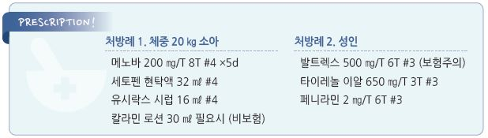

# 수두 Varicella, Chickenpox


## 일반 사항

* 원인균 : varicella zoster virus(VZV)
* 전염 경로 : airborne(환자의 구강인두 분비물), 피부 직접 접촉(피부 병소 수포액)
* 잠복기 : 10~~21일(평균 14~~16일)
* 전염 기간 : 발진 발생 24~~48시간 전부터 발진 발생 5~~7일 후 모든 병소가 딱지로 덮일 때까지
* 호발 시기 : 겨울\~봄; 백신 도입 후에는 계절적 영향이 적음
* 호발 연령 : 1~~4세 (✽비슷한 빈도로 5~~9세에서 발생); 대부분의 소아가 15세까지 감염을 경험
* 경과 : 건강한 소아에서 7\~10일 내 자연 치유; 성인에서는 보다 심한 증상을 보임
* 재감염 : 면역저하자에서 재감염이 가능한 것으로 알려져 있으며, 재감염 때의 증상은 경미함
* 재발 : 감염 후 VZV가 dorsal root ganglia에 잠복 → 추후 대상포진으로 발현
* 합병증 : 2차 피부 감염, 폐렴, 뇌염(소아), 임신 초기 감염 시 기형아 출산

## 임상 양상

* 발진 : 가려움을 동반한 수포성 발진, 전신성, 피부 및 점막 이환
* 발열 등 전신 증상, 전구 증상

### 전형적 양상

#### 전구 증상

* 발열(37.8\~39.4℃), malaise, 식욕 부진, 두통, 복통
* 발진 발생 24~~48시간 전 출현, 발진 발생 후 2~~4일 내 호전

#### 피부 병소

* 열 발생 1~~2일 후부터 3~~5일 동안 새로운 병변들이 출현
* 분포 : 두피, 얼굴, 몸통에서 시작하여 사지로 퍼져 감
*   모양 변화 : 5~~10 ㎜의 반구진성 홍반으로 시작 → 12~~24시간 후 소수포(장미꽃잎 위의 이슬 방울 모양) → 48시간 후 농포

    → 딱지 형성(발진 발생부터 5\~7일)
* 여러 형태의 병변이 동시에 존재; 습진 등 피부 질환을 가진 경우에 보다 심하게 발생
* 회복 : 수일\~수 주에 걸쳐 변색된 피부가 회복되며 세균에 의한 2차 감염이 동반되지 않는 한 심한 흉터 없이 치유됨
* 기타 병소 : 구강 및 질 점막에서 궤양이 형성될 수 있음

### 백신을 접종한 경우

* 증상이 보다 가벼움 : 발진 기간이 짧음, 발열 적음, 수포 숫자 적음(보통 ＜50개; 수포 숫자가 적으면 전염성도 적음), 합병증 적음
* 종종 비전형적인 반점구진성 발진

## 진단

* 보통 검사 없이 진단 (☞ p.845)

### 검사

* CBC : 발진 발생 첫 72시간 동안 leukopenia 발생, 이후 lymphocytosis
* s-IgM Ab : 급성 감염
* s-IgG Ab : 회복기에 급성기 대비 ≥4배 증가
* varicella zoster virus &/or 특이 유전자 : 수포액, 가피, 구인두/비인두 도말, 혈액, 뇌척수액으로 검사

### 감별

* 농가진과의 감별 : 농가진은 주로 환자의 손이 닿는 부위에 발생

***

## Management

### 치료 방침

*   대증 치료 : 통증, 발열, 가려움 치료

    •가려움 치료 : 국소 드레싱, 미지근한 목욕(oatmeal), 젖은 찜질, 항소양제 (☞ p.857)
* 항바이러스제
* 예방접종, 면역 글로불린
* 긁음에 의한 2차 감염을 막기 위하여 손톱을 짧게 자름

## 약물 치료

### 가려움증

* 외용제 : calamine/zinc oxide 필요시 또는 1일 수회 도포 [칼라민](../%EB%B9%84%EB%B3%B4%ED%97%98/)
*   경구 H1-항히스타민제 : 수면 효과가 있는 1세대 제제가 보다 유효 (☞ p.1144)

    •hydroxyzine : 25~~50 ㎎ hs or 50~~100 ㎎/d #3\~4 \[아디팜]

    •chlorpheniramine : 4 ㎎ q4\~6hr, 최대 24 ㎎/d \[페니라민]

### 해열제

*   acetaminophen : 650\~1,300 ㎎ tid \[타이레놀 이알]

    •소아 : 10~~15 ㎎/㎏ q4~~6hr, 최대 5회/d; ≥3개월 연령 허가 \[세토펜 현탁액]\(32 ㎎/㎖. 0.4 ㎖/㎏ qid 또는 1.5\~2 ㎖/㎏/d #4)
*   ibuprofen : 400 ㎎ tid\~qid \[부루펜]

    •소아 : 5~~10 ㎎/㎏ q6~~8hr, 최대 40 ㎎/㎏/d; ≥6개월 연령 허가 \[부루펜 시럽]\(20 ㎎/㎖. 0.25~~0.5 ㎖/㎏ tid~~qid 또는 1.5 ㎖/㎏/d #3\~4)
* aspirin/acetylsalicylic acid는 Reye syndrome과 관련하여 소아에서 금기

### 항바이러스제

* 대상 : 백신 미-접종 청소년/성인, 만성 피부/폐질환, 면역저하자, 가족 내 전파에 의해 발생
*   효과 : 증상 완화, 전파 기간 단축; 발진 발생 24시간 내(늦어도 72시간 내) 투여 시 가장 유익

    •소아에서의 유용성은 적음
* acyclovir : 20 ㎎/㎏ (최대 800 ㎎/회) qid ×5d(면역저하자에서는 7\~10d) \[메노바]
* valaciclovir : 20 ㎎/㎏ (최대 1 g/회) tid ×5d \[발트렉스] (보험주의); ≥2세 허가
* famciclovir : 500 ㎎ tid ×7d \[팜비어] (보험주의)

## 예방 및 관리

### 사회 격리

* 모든 피부 병변에 가피가 생길 때까지(발진 발생 후 최소 5일간) 출근/등교 제한
* 단, 예방접종을 시행한 사람에서 발생하여 가피가 생기지 않은 경우에는 24시간 동안 새로운 피부 병변이 생기지 않을 때까지

### 접촉자 조치

*   수두 백신 접종 : 수두 접종력이 없고 과거에 수두를 앓은 적이 없는 감수성자는 수두 의심 환자 접촉 후 72시간(\~5일) 내 백신 접종;

    예방 또는 증상 완화 효과가 있음
* 수두 면역 글로불린 접종 : 면역저하자, 출산 전후 수두에 걸린 산모의 신생아, 출생체중 ＜1 ㎏,

＜28주 조산아에 대하여 고려; 노출 후 96시간(최대 10일) 내 접종

* 보육 시설 출입 중지 : 환자와 밀접 접촉한 백신 미-접종자나 면역 미-확인자는 접촉 후 8\~21일간

## 예방접종

```
(☞ p.1120)
```

> **질병코드** B01　수두


