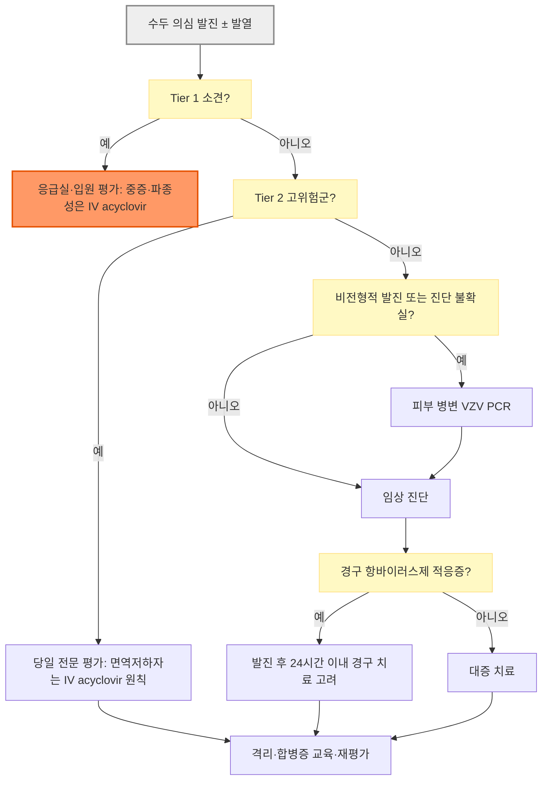

# 수두 Varicella, Chickenpox

## <mark style="color:green;">일반 사항</mark>

* 원인 바이러스 : varicella-zoster virus(VZV)의 일차 감염
* 전염 경로 : 호흡기 분비물에 의한 공기·비말 전파, 피부 병소의 수포액과 직접 접촉
* 잠복기 : 10\~21일(평균 14\~16일)
* 전염 기간 : 발진 발생 1\~2일 전부터 모든 병소가 가피로 덮일 때까지(보통 발진 후 4\~7일)
  * 돌파 수두로 가피가 생기지 않는 반점·구진만 있는 경우 : 24시간 동안 새로운 병변이 생기지 않을 때까지
* 호발 시기 : 겨울\~봄; 예방접종 도입 후 계절성은 덜 뚜렷함
* 경과 : 건강한 소아에서는 대개 7\~10일 내 자연 치유하지만, 영아·청소년·성인·임신부·면역저하자는 중증 위험이 높음
* 재감염 : 평생면역이 흔하고 임상적 재감염은 드물지만 면역저하자에서 상대적으로 더 가능함
* 재활성화 : 감염 후 VZV가 감각신경절에 잠복하였다가 추후 대상포진으로 발현
* 주요 합병증
  * 소아 : 병변의 2차 세균감염(특히 *Streptococcus pyogenes*, *Staphylococcus aureus*), 드물게 괴사성근막염·패혈증
  * 성인 : 수두 폐렴 위험 증가
  * 모든 연령 : 소뇌실조, 뇌염·수막염, 간염, 혈소판감소·출혈성 수두
  * 임신 : 임신 초기 또는 임신 중기 초반 감염 시 선천수두증후군 위험 약 0.4\~2.0%; 분만 5일 전\~분만 2일 후 산모 발진 시 중증 신생아 수두 위험

## <mark style="color:green;">임상 양상</mark>

### <mark style="color:orange;">전구 증상</mark>

* 미열 또는 발열, malaise, 식욕부진, 두통, 복통
* 청소년·성인에서는 발진 1\~2일 전 전구 증상이 비교적 흔함
* 건강한 소아에서는 전구 증상 없이 발진이 첫 증상일 수 있음

### <mark style="color:orange;">피부 병소</mark>

* 가려움을 동반한 전신성 발진으로 피부와 점막을 침범
* 두피·얼굴·몸통에서 시작해 사지로 퍼지며, 몸통 중심 분포가 흔함
* 반점 → 구진 → 투명한 소수포(장미꽃잎 위의 이슬방울) → 농포 → 가피로 빠르게 진행
* 3\~5일 동안 병변이 여러 차례 무리지어 발생하므로 서로 다른 단계의 병변이 동시에 존재하는 것이 특징
* 구강·인두·결막·질 점막에 통증성 미란 또는 궤양이 생길 수 있음
* 세균성 2차 감염이 없으면 대개 심한 흉터 없이 치유되나 일시적 색소 변화가 남을 수 있음
* 아토피피부염 등 피부장벽 질환이 있으면 병변이 더 광범위하거나 심할 수 있음

### <mark style="color:orange;">돌파 수두 Breakthrough varicella</mark>

* 수두 백신 접종 42일 이후 야생형 VZV 감염으로 발생한 수두
* 대개 발열이 없거나 미열이고 병변 수가 적으며(흔히 ＜50개), 수포보다 반점·구진이 많고 기간이 짧음
* 병변이 적어도 전파 가능함. ＜50개이면 미접종 수두보다 전염력이 낮지만, ≥50개이면 미접종 수두와 비슷할 수 있으므로 동일한 격리 원칙을 적용
* 비전형적 발진으로 임상 진단이 어려워 의심 시 피부 병변 VZV PCR로 확인

***

### <mark style="color:$danger;">🚩 Red Flags!</mark>

<mark style="color:$danger;">**즉각 조치 또는 의뢰**</mark>

* 호흡곤란, 저산소증, 심한 기침·흉통 : 수두 폐렴 의심
* 의식 변화, 경련, 심한 두통·경부강직 또는 급성 보행실조
* 출혈성·괴사성 병변, 쇼크 또는 뚜렷한 전신독성
* 심한 복통, 반복 구토, 현저한 탈수 또는 경구섭취 불가
* 빠르게 번지는 발적·열감·심한 통증, 고름, 연부조직 부종 : 침습성 세균감염·괴사성근막염 의심
* 면역저하자에서 광범위·출혈성 병변, 손바닥·발바닥 침범 또는 내장 침범 의심

<mark style="color:$warning;">**당일 또는 조기 의뢰**</mark>

* 임신부의 수두 또는 감수성 임신부의 유의한 VZV 노출
* 면역저하자의 수두 또는 감수성 면역저하자의 유의한 노출
* 생후 1세 미만, 특히 신생아·미숙아의 수두 또는 유의한 노출
* 분만 5일 전\~분만 2일 후 산모에게 수두 발진이 발생한 신생아
* 청소년·성인에서 중등도 이상의 수두
* 눈 주위 발진, 안구 통증·충혈·시력 변화
* 4일 이상 지속되는 발열, 호전 후 재발열 또는 7일 이상 계속 생기는 새로운 병변

<mark style="color:$info;">**외래 추적 / 추가 평가 계획**</mark> <mark style="color:$info;">- 즉각 위험 낮으나 호전 없으면 의뢰</mark>

* 만성 피부·폐질환, 장기 salicylate 치료 또는 corticosteroid 사용 환자
* 구강병변으로 수분·음식 섭취가 줄거나 소양증으로 수면장애가 심한 경우
* 병변 주위의 국소 발적·압통이 새로 생기거나 보호자가 악화 여부를 판단하기 어려운 경우
* 고위험군은 초기 상태가 안정적이어도 24\~48시간 이내 재평가를 고려

***

## <mark style="color:green;">진단</mark>

* 전형적 발진과 역학적 연관성이 있으면 임상적으로 진단할 수 있으나, 돌파 수두·비전형적 발진·중증 또는 집단발생에서는 검사 확인의 가치가 큼 (☞ p.845)

### <mark style="color:orange;">검사</mark>

* **우선검사 : 피부 병변 VZV PCR**
  * 권장 검체 : 가피, 수포액, 병변 바닥 세포 또는 반점구진 병변의 긁은 검체
  * 구인두/비인두 도말이나 혈액은 피부 병변 검체보다 민감도가 낮을 수 있음
* **VZV IgM** : PCR보다 민감도·특이도가 낮고 초감염과 재활성화를 구분하지 못하므로 확진을 위한 일상검사로 권장하지 않음
* **급성기-회복기 VZV IgG** : ≥4배 상승은 특이도가 높지만 두 차례 채혈이 필요하고, 과거 감염·백신 접종자에서는 4배 상승이 나타나지 않을 수 있어 실용성이 제한적
* **CBC** : 일시적 leukopenia·lymphocytosis가 나타날 수 있으나 비특이적이며 일상적인 진단검사는 아님
* 뇌염·수막염 등 중추신경계 합병증 의심 시 : 뇌척수액 VZV PCR 등 전문 평가

### <mark style="color:orange;">감별 진단</mark>

<table><thead><tr><th width="170">질환</th><th>주요 감별점</th></tr></thead><tbody><tr><td>돌파 수두</td><td>백신 접종 42일 이후 발생; 병변이 적고 반점구진성이 흔함. 병변 PCR이 유용</td></tr><tr><td>파종성 HSV / eczema herpeticum</td><td>통증성·단형성 군집 수포/미란, punched-out erosion; 아토피피부염 환자에서 특히 주의</td></tr><tr><td>파종성 대상포진</td><td>선행하는 피부분절성 통증·수포와 그 밖의 전신 산재 병변; 면역저하자에서 흔함</td></tr><tr><td>수족구병</td><td>구강병변과 손·발·둔부 병변; 손바닥·발바닥 침범이 흔함</td></tr><tr><td>엠폭스</td><td>깊고 단단하며 통증성인 병변, 같은 부위에서 병변 단계가 비교적 균일; 림프절병증·노출력 확인</td></tr><tr><td>농가진</td><td>국소적 수포·농포와 꿀색 가피, 노출 부위 중심; 전신에 여러 단계 병변이 퍼지는 양상은 드묾</td></tr><tr><td>벌레물림·구진성 두드러기</td><td>노출 부위 중심의 군집성 구진, 중심부 punctum; 점막병변 없음</td></tr><tr><td>옴</td><td>야간 소양증, 가족 동시 발생, 손가락 사이·손목·겨드랑이·생식기 burrow</td></tr><tr><td>약물발진</td><td>대칭성 반점구진 발진과 약물력; 전형적인 여러 단계의 수포·가피가 없음</td></tr></tbody></table>

***


```mermaid
graph TD
    A["수두 의심 발진 ± 발열"] --> B["Tier 1 소견?"]
    B -->|예| C["응급실·입원 평가: 중증·파종성은 IV acyclovir"]
    B -->|아니오| D["Tier 2 고위험군?"]
    D -->|예| E["당일 전문 평가: 면역저하자는 IV acyclovir 원칙"]
    D -->|아니오| F["비전형적 발진 또는 진단 불확실?"]
    F -->|예| G["피부 병변 VZV PCR"]
    F -->|아니오| H["임상 진단"]
    G --> H
    H --> I["경구 항바이러스제 적응증?"]
    I -->|예| J["발진 후 24시간 이내 경구 치료 고려"]
    I -->|아니오| K["대증 치료"]
    E --> L["격리·합병증 교육·재평가"]
    J --> L
    K --> L

    style A fill:#eeeeee,stroke:#888888,stroke-width:2px
    style C fill:#f96,stroke:#e65100,stroke-width:2px
    style B fill:#fff9c4,stroke:#ffe082
    style D fill:#fff9c4,stroke:#ffe082
    style F fill:#fff9c4,stroke:#ffe082
    style I fill:#fff9c4,stroke:#ffe082
```

<p align="center"><strong>수두 진료 흐름도</strong></p>

<p align="center"><em><mark style="color:$info;">Ref. CDC 2024; AAP Red Book 2024–2027, 33rd ed.; 국내 의약품 허가사항을 종합한 저자 정리</mark></em></p>

***

## <mark style="background-color:$warning;">Management</mark>

### <mark style="color:orange;">치료 방침</mark>

* 건강한 소아의 전형적 비합병 수두 : 대증 치료가 원칙이며 항바이러스제를 일상적으로 권고하지 않음
* 통증·발열 : acetaminophen 우선
* 소양증 : 미지근한 목욕, 젖은 찜질, calamine, 필요 시 경구 H1-항히스타민제
* 손톱을 짧게 자르고 긁은 뒤 손 씻기; 피부를 청결하게 유지하여 2차 세균감염 예방
* 고위험군은 발진 발생 시점, 면역상태, 임신 여부, 합병증과 신기능을 확인해 항바이러스제 또는 입원 치료 결정


수두에서는 ibuprofen을 포함한 NSAID를 가능하면 피하고 acetaminophen을 우선 사용한다. NSAID는 중증 세균성 피부·연조직 감염(침습성 A군 연쇄구균 감염, 괴사성근막염)과의 연관성이 반복 보고되었다. Aspirin/acetylsalicylic acid는 Reye syndrome 위험 때문에 소아·청소년에서 금기이다.


### <mark style="color:orange;">항바이러스제 대상과 경로</mark>

<table><thead><tr><th width="210">환자군</th><th>권장 접근</th></tr></thead><tbody><tr><td>건강한 소아의 전형적 비합병 수두</td><td>경구 항바이러스제를 일상적으로 권고하지 않음</td></tr><tr><td>면역정상 고위험 외래 환자</td><td>건강한 12세 초과 청소년·성인, 만성 피부/폐질환, 장기 salicylate 치료, 단기간 반복·간헐적 또는 흡입 corticosteroid 사용 환자에서 경구 acyclovir 또는 valaciclovir 고려</td></tr><tr><td>가족 내 2차 발생</td><td>중증도가 더 높을 수 있어 연령·위험인자와 발진 시점을 고려해 경구 치료를 개별 결정</td></tr><tr><td>임신부의 비합병 수두</td><td>당일 산과·감염 전문 평가. 일부 전문가는 특히 임신 2·3분기에 경구 acyclovir/valaciclovir를 고려</td></tr><tr><td>면역저하자</td><td>입원·전문 평가 및 IV acyclovir가 원칙</td></tr><tr><td>중증·파종성 수두</td><td>폐렴·뇌염·혈소판감소·중증 간염 등에서는 입원 및 IV acyclovir</td></tr><tr><td>임신 중 폐렴 등 합병증</td><td>입원 및 IV acyclovir</td></tr></tbody></table>

* 경구 치료는 최대 효과를 위해 발진 후 24시간 이내 시작
* 24시간이 지난 경우에도 고위험군, 새로운 병변이 계속 발생하거나 중증도가 높은 환자는 개별적으로 치료 고려
* 항바이러스제 투여 여부와 관계없이 모든 병변이 가피화되거나 24시간 동안 새로운 병변이 없을 때까지 격리

***

## <mark style="color:green;">비-약물 치료 및 예방</mark>

### <mark style="color:orange;">법정감염병 신고</mark>

* 수두는 제2급 법정감염병
* 환자와 의사환자를 진단한 경우 24시간 이내 질병관리청장 또는 관할 보건소장에게 신고

### <mark style="color:orange;">환자 격리</mark>

* 모든 피부 병변에 가피가 생길 때까지 출근·등교·등원 제한(통상 발진 발생 후 최소 5일)
* 돌파 수두로 가피가 생기지 않는 반점·구진만 있는 경우 : 24시간 동안 새로운 병변이 생기지 않을 때까지
* 임신부·면역저하자·신생아 등 고위험 감수성자와 접촉하지 않도록 안내


의료기관에서는 가능하면 내원 전 전화로 알리도록 안내하고, 도착 즉시 일반 대기실에서 분리한다. 표준주의에 더해 공기주의와 접촉주의를 적용하고, 가능한 경우 음압격리실을 사용한다.


### <mark style="color:orange;">접촉자 조치</mark>

* **수두 면역의 증거** : 연령에 맞는 예방접종 기록, 검사실상 면역 또는 과거 감염의 검사실 확진, 의사가 확인한 수두·대상포진 병력 중 하나
  * 상용 VZV IgG 검사는 백신 유도 면역을 검출하는 민감도가 충분하지 않아 위음성이 나타날 수 있음
* **유의한 노출** : 가족 내 동거, 같은 실내 공간에서의 밀접·지속 접촉, 대면 접촉 또는 수두·대상포진 병변액과의 직접 접촉
  * 단순히 잠시 같은 건물을 이용한 것만으로는 일반적으로 유의한 노출로 보지 않으며, 노출 강도·거리·지속시간과 공기 공유 여부를 종합해 판단

#### <mark style="color:$primary;">노출 후 수두 백신</mark>

* 수두 또는 대상포진에 유의하게 노출된 뒤 수두 면역의 증거가 없고 생백신 금기가 없는 감수성자에게 가능한 한 빨리 접종
* 이상적으로 노출 후 72시간 이내, 늦어도 5일 이내 접종하면 발병을 예방하거나 중증도를 낮출 수 있음
* 임신부와 중증 면역저하자 등 생백신 금기자는 접종하지 않고 VZIG 적응증을 평가

#### <mark style="color:$primary;">수두-대상포진 면역글로불린 VZIG</mark>

* 투여 전제 : 수두 면역의 증거가 없고, 감염 가능성이 있는 유의한 노출이며, 중증 수두 고위험군이면서 생백신을 접종할 수 없는 경우
* 대상
  * 면역의 증거가 없는 면역저하자
  * 면역의 증거가 없는 임신부
  * 산모가 분만 5일 전\~분만 2일 후 수두 발진을 보인 신생아
  * 입원 중인 재태주수 ≥28주 미숙아 : 산모에게 수두 면역의 증거가 없는 경우
  * 입원 중인 재태주수 ＜28주 또는 출생체중 ≤1,000 g 미숙아 : 산모 면역 여부와 관계없이
* 시기 : 가능한 한 빨리, 이상적으로 96시간 이내; 늦어도 노출 후 10일 이내
* VZIG 투여 후 잠복기가 28일까지 연장될 수 있으므로 증상 발생을 관찰


국내에서는 VZIG가 모든 의료기관에 상시 구비되어 있지 않을 수 있다. 적응증이 의심되면 지체하지 말고 상급병원 감염내과·소아청소년과 및 관할 보건소에 연락하여 가용성과 투여 동선을 확인한다.


#### <mark style="color:$primary;">접촉자 관찰·출입 제한</mark>

* 일반 지역사회 접촉자를 일률적으로 출근·등교 제한하지 않으며 면역 여부, 노출 강도와 시설 내 유행 상황에 따라 결정
* 유행 중인 학교·보육시설 또는 의료기관에서 면역의 증거가 없는 접촉자를 제한하는 경우 : 첫 노출 후 8일부터 마지막 노출 후 21일까지
* VZIG 투여자는 마지막 노출 후 28일까지 관찰·제한
* 의료종사자는 별도의 노출 후 예방 및 업무제한 지침을 적용

### <mark style="color:orange;">예방접종</mark>

☞ [예방접종](../231_/210_-vaccination.md#varicella)

* 국내 표준접종 : 생후 12\~15개월 1회
* 13세 미만 감수성 소아 : 1회
* 13세 이상 감수성 청소년·성인 : 4\~8주 간격 2회
* 생백신이므로 임신과 중증 면역저하에서는 금기; 항체 함유 혈액제제 투여 후에는 제제와 용량에 따른 접종 간격 확인


국내 예방접종 기준은 13세 미만 감수성 소아 1회, 13세 이상 감수성 청소년·성인 4\~8주 간격 2회이며(2026년 국가예방접종 지침 기준), 미국 CDC/ACIP 등 다수 해외 지침의 소아 2회 접종(12\~15개월, 4\~6세)과 차이가 있다. 1회 접종만으로도 중증 수두 예방 효과는 크지만 돌파 수두는 상대적으로 흔히 발생할 수 있다. 국가예방접종 지원 연령·대상과 비용은 해당 연도 사업지침을 별도로 확인한다.


***

## <mark style="color:green;">약물 치료</mark>

### <mark style="color:orange;">가려움증</mark>

* 외용제 : calamine/zinc oxide 필요 시 또는 1일 수회 도포 <mark style="color:blue;">[칼라민](../%EB%B9%84%EB%B3%B4%ED%97%98/)</mark>
* 경구 H1-항히스타민제 : 야간 소양증에는 진정성 1세대 제제가 도움이 될 수 있으나 연령·체중에 맞춰 투여 (☞ [항히스타민제](../231_/212_-antihistamines.md))
  * hydroxyzine <mark style="color:blue;">\[유시락스]</mark> : 졸림·어지럼·구강건조·항콜린성 이상반응 및 QT 연장 위험에 주의
  * chlorpheniramine <mark style="color:blue;">\[페니라민]</mark> : 졸림과 항콜린성 이상반응에 주의
* 국소 항히스타민제나 국소 마취제는 감작 위험 때문에 일상적으로 권고하지 않음

### <mark style="color:orange;">해열·진통제</mark>

* acetaminophen <mark style="color:blue;">\[타이레놀, 세토펜]</mark>
  * 성인 : 500\~1,000 mg q6\~8hr PRN; 일반적으로 최대 3,000 mg/d, 의료진 감독하에는 제품별 최대용량 확인
  * 소아 : 10\~15 mg/kg/dose q4\~6hr PRN, 최대 5회/d 및 75 mg/kg/d(단, 성인 최대용량을 넘지 않음)
* **피함 : ibuprofen 등 NSAID** — 중증 세균성 피부·연조직 감염과의 연관성이 보고됨
* **금기 : 소아·청소년의 aspirin/acetylsalicylic acid** — Reye syndrome 위험

### <mark style="color:orange;">경구 항바이러스제</mark>

* **acyclovir** <mark style="color:blue;">\[메노바]</mark>
  * 국내 허가 : 2세 이상 소아 수두에서 20 mg/kg/dose(최대 800 mg/dose) qid ×5d
  * 성인 수두 참고 용법 : 800 mg 1일 5회 ×7d — 국내 허가 외 사용이며 제품별 허가범위·급여 확인
* **valaciclovir** <mark style="color:blue;">\[발트렉스]</mark>
  * 국내 허가 : 면역기능이 정상인 2세 이상 18세 미만 소아 수두에서 20 mg/kg/dose(최대 1 g/dose) tid ×5d
  * 성인 수두 1 g tid 요법은 국내 허가 외 사용이므로 근거·허가·급여를 확인하고 환자에게 설명
* **famciclovir** : 국내 허가사항에 수두 적응증이 없고(대상포진·생식기포진에 한정) 근거가 제한적이므로 일상적인 수두 치료 선택지로 권고하지 않음
* acyclovir·valaciclovir는 신기능에 따라 감량하고 충분한 수분 섭취를 유지함. 고령자·신장애 환자에서는 급성 신손상과 혼돈·환각 등 신경독성에 특히 주의

***

### <mark style="color:red;">질병코드 (KCD)</mark>

B01　수두

B01.0　수두수막염

B01.1　수두뇌염

B01.2　수두폐렴

B01.8　기타 합병증을 동반한 수두

B01.9　합병증이 없는 수두

P35.8　기타 선천바이러스병(선천수두증후군)

✽ 실제 청구 시 최신 KOICD 분류와 청구 기준을 재확인

***

## <mark style="color:purple;">처방례</mark>

> **처방례 1.** 6세, 체중 20 kg, 항바이러스제 적응증이 있는 소아
>
> ```
> 메노바 200 mg/T  8T #4 ×5d
> ※ 1회 2T(400 mg), 1일 4회
>
> 세토펜 현탁액 32 mg/mL  1회 8 mL q4~6hr PRN ×3d
> ※ 1회 256 mg(12.8 mg/kg); 최대 5회/d
>
> 유시락스 시럽 2 mg/mL  1회 5 mL tid PRN ×3d
> ※ 졸림·어지럼에 주의하고 연령·증상에 따라 조절
>
> 칼라민 로션 30 mL  병변에 필요 시 1일 수회 도포 (비보험)
> ```

> **처방례 2.** 면역정상 성인 수두 — valaciclovir 국내 허가 외 사용
>
> ```
> 발트렉스 500 mg/T  2T tid ×5d
> ※ 1회 1 g(2T), 1일 3회; 신기능에 따라 감량
>
> 타이레놀 500 mg/T  1~2T q6~8hr PRN ×3d
> ※ 일반적으로 최대 3,000 mg/d
>
> 페니라민 2 mg/T  2T hs PRN ×3d
> ※ 졸림·항콜린성 이상반응에 주의
> ```
>
> _✽성인 수두에서 valaciclovir 1 g tid는 국내 허가 외 사용이다(국내 허가는 면역정상 2세 이상 18세 미만 소아 수두로 한정). 발진 후 24시간 이내 시작할 때 효과가 가장 크며, 처방 전 환자에게 허가 외 사용임을 설명하고 급여 인정 여부를 확인한다._

***

### <mark style="color:$success;">핵심 복약 지도</mark>

> **해열·진통제 선택**
>
> * acetaminophen을 우선 사용하고, ibuprofen 등 NSAID와 aspirin/acetylsalicylic acid는 복용하지 않습니다. NSAID는 중증 세균성 피부·연조직 감염과의 연관성이 보고되었고, aspirin은 소아·청소년에서 Reye 증후군 위험이 있습니다.

> **항바이러스제 복용**
>
> * 정해진 횟수와 기간을 끝까지 지켜 충분한 물과 함께 복용합니다.
> * 발진 후 24시간 이내 시작할 때 가장 효과적입니다.
> * 복용 중 소변량 감소, 심한 구역, 혼돈·환각이 나타나면 즉시 진료받습니다.

> **가려움증 관리**
>
> * 진정성 항히스타민제(hydroxyzine, chlorpheniramine)는 졸릴 수 있으므로 복용 후 운전·위험한 작업을 피하도록 안내합니다.

> **언제 다시 병원을 방문해야 하나요?**
>
> * 숨이 차거나 심한 기침·흉통이 생기는 경우 — 즉시 내원
> * 의식 변화, 경련, 심한 두통·경부강직 또는 보행 이상이 생기는 경우 — 즉시 내원
> * 병변 주위가 빠르게 붉어지고 붓거나 고름이 생기는 경우 — 침습성 세균감염 의심, 즉시 내원
> * 4일 이상 열이 계속되거나 새로운 병변이 7일 이상 계속 생기는 경우

***

### <mark style="color:blue;">환자 안내서</mark>


**수두는 전염력이 매우 강하지만, 대부분 1\~2주 안에 저절로 좋아집니다**

수포성 발진과 가려움이 주요 증상이며, 모든 물집에 딱지가 앉을 때까지는 다른 사람에게 옮길 수 있습니다.


#### <mark style="color:$primary;">왜 수두에 걸리나요?</mark>

* 수두-대상포진바이러스(VZV)에 처음 감염되면 발생합니다. 기침·재채기로 나오는 비말이나 물집액과의 직접 접촉으로 전파됩니다.
* 노출 후 10\~21일(평균 14\~16일) 뒤에 증상이 나타납니다.

#### <mark style="color:$primary;">일상생활에서 어떻게 관리하나요?</mark>

* **손톱을 짧게 자르고, 긁은 뒤에는 비누와 물로 손을 씻으십시오.** 긁어서 생긴 상처로 세균이 2차 감염되는 것을 막기 위함입니다.
* **미지근한 물로 목욕하고, 칼라민 로션을 발라 가려움을 줄이십시오.**
* **수건, 침구, 옷은 다른 가족과 따로 사용하십시오.**
* **모든 물집에 딱지가 앉을 때까지 등교·등원·출근하지 않습니다.** 물집 없이 붉은 반점만 생기는 돌파 수두는 24시간 동안 새 병변이 없을 때까지 기다립니다.
* **임신부, 면역저하자, 신생아와는 접촉하지 마십시오.**

#### <mark style="color:$primary;">약은 어떻게 써야 하나요?</mark>

* 열과 통증에는 acetaminophen을 사용하고, ibuprofen 등 NSAID와 aspirin은 사용하지 않습니다.
* 항바이러스제를 처방받았다면 정해진 횟수와 기간을 끝까지 지켜 복용합니다.

#### <mark style="color:$primary;">이럴 때는 즉시 병원을 방문하세요</mark>

* 숨이 차거나 심한 기침·흉통이 있는 경우
* 의식이 변하거나 경련, 심한 두통·목 경직, 걷기 어려운 경우
* 출혈성 물집이 생기거나 심한 복통·구토가 있는 경우
* 물집 주위가 빠르게 붉어지고 붓거나 고름이 생기는 경우
