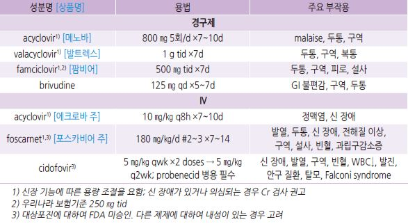
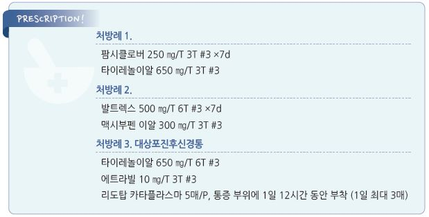

# 대상포진 Herpes Zoster, Shingles


## 일반 사항

* 체내 잠복 varicella zoster virus의 재활성에 의한 통증성 발진
*   기전 : 과거 수두 감염 시 dorsal root ganglia에 바이러스 잠복 → 재활성화되면 신경 세포 내에서 복제되고 virion이 피부 분절의

    axon을 따라 이동하여 증상을 일으킴

> ✽항바이러스제는 바이러스의 DNA 복제를 차단시키는 효과만 있어 잠복 감염을 치료할 수는 없음

* 빈도 : 인구의 20\~30%가 일생 중 경험; 85세까지 50%가 경험
* 호발 연령 : 주로 ＞50세에서 발병하지만 어느 연령에서나 발생 가능
* 호발 피부 분절 : 흉요추부(T3\~L2), 삼차신경(V1 분지); 면역저하자에서는 광범위 이환
*   전염

    •병소 직접 접촉 : 병변이 건조해지기 전에(딱지가 생기기 전에) 병소 부위의 직접 접촉에 의해 감수성이 있는 사람(비-보균자,

    백신 미-접종자)에게 전염 가능

    •공기 전염 : 환자의 침에서 바이러스가 발견되고 장기 밀집 수용 시설(예: 요양원)에서 공기 전염 가능성이 제기되지만,

    공기를 통한 전염력에 대해서는 알려지지 않음
*   재발 : 정상 면역자에서는 드물고 면역저하자에서 보다 흔함

    •재발 시 실험실 검사 등을 통하여 HSV 등 다른 질환 감별을 요함; 재발 증례의 많은 경우가 다른 질환, 특히 단순포진의

    linear(dermatomal) distribution으로 확인됨
* 드물게(1\~5%) 운동 신경 이환 : zoster motorius(약화), Ramsay Hunt syndrome(안면 마비), spinal motor radiculopathy
*   합병증 : 피부 2차 감염(2%), 포진후신경통(\~15%), 눈 합병증(2%; herpes zoster ophthalmicus,

    retinal necrosis), 귀(Ramsay Hunt syndrome), 뇌염; 급성 심장 및 뇌혈관 증상에 유의

    •전신 상태가 악화되는 환자에서 폐렴, 간염, DIC, CNS 이환 등 합병증 감별을 요함

#### 합병증 발생 위험 인자

* 고령, 면역저하자
* 중증 기저 피부 질환(예: 아토피)
* 안구 또는 귀 부위 이환
* 심한 홍반, 확산
* 심한 전구 증상 or 빠른 진행
* 여러 분절 or 광범위 피부 이환
* 비전형적 수포, 위성 병변
* 다른 stage의 병변이 동시 발생
* CNS, 내장 기관 이환 증상
* 출혈/괴사성 병변

### Ophthalmic zoster

* 삼차 신경의 nasociliary branch 이환
* 코의 base-side-tip을 따라 병소 발생(Hutchinson’s sign)
* 주의 : 안구 합병증
* 의뢰

### Chronic zoster

* 하나 이상의 발진이 수 주\~수개월 동안 지속되는 상태
* HIV 감염자 등 주로 면역저하자에서 발생
* 흔히 acyclovir에 내성이 있음
* 필요시 조직 검사 및 바이러스 배양

### 대상포진후신경통 (Postherpetic neuralgia, PHN)

* 피부 병변 회복 후 3개월 이상 지속되는 통증
* 빈도 : 50세 이상 발병자의 10\~13%에서 발생
* 호발 : 60세 이상, 급성기 증상(통증, 발진)이 심했던 경우
* 경과 : 수개월\~수년 동안 점차 호전

## 임상 양상

### 전구 증상

* 발진 발생 1일\~수일 전부터 병변 부위에 가려움, 이상 감각(과민, 따끔거림), 또는 통증 발생

### 활성기 증상

* 발진
* 발진 부위 및 주변부 통증
* 전신 증상 : (＜20%에서) 발열, 두통, 피로, malaise

#### 발진

* 대부분 편측 피부 분절을 따라 발생; 드물게 양측 발생
* 3개 이내의 이웃한 분절 이환; 간혹 주된 이환 분절과 떨어진 곳에서도 발생
* 경과 : maculopapular rash → 1~~2일 내 수포 → 3~~4일 내 농포, 궤양 → 7\~10일 내 딱지

→ 3~~4주 내 회복; 흉통 또는 색조 변화는 수개월~~수년간 지속될 수 있음

## 진단

* 전형적 양상의 흉요추부 편측 발생 시 실험실 검사 없이 진단

### 검사

* 진단이 불확실한 경우, 특히 얼굴이나 생식기 부위 발생 시 PCR 검사
* zoster sine herpete(ZSH; 피부 병변 없는 신경근 통증) 의심 시 anti-VZV IgG/IgM 검사
* 안면 마비를 동반한 ZSH 의심 시 안면 마비 발생 2\~4일 후 VZV-DNA 검사(구인두 swab)
* 비전형 피부 점막 병변에 대하여 조직 검사(궤양이 없는 경우) 또는 swab 검사(궤양이 있는 경우)
* 신경학적 증상이 있는 경우 MRI, CT, 뇌척수액 검사
* ＜50세, 다분절 이환, 재발, 특히 다른 stage의 병변 동시 발생, HIV 위험 인자가 있는 환자에서 HIV 검사

***

## Management

### 치료 방침

* 휴식, 충분한 영양 섭취
* 항바이러스제 : 가능한 한 조기 투여
* 대증 치료 : 초기부터 진통제 투여
* 항생제 : 2차 감염 시 고려
* 첫 병소 발생 1주 이후에도 새로운 병변이 출현하는 경우 면역 저하 상태를 고려
* 10\~21일간의 치료에 반응하지 않는 경우에 내성균 의심
* 피부 병변 완화 4주 후에도 통증이 지속될 경우 의뢰 고려

## 약물 치료

### 항바이러스제

*   효과 : 발진 발생 48\~72시간 이내 투여를 시작할 경우 증상 및 유병 기간 감소

    •72시간 이후에 치료를 시작하는 경우에는 새로운 병변이 발생하는 상황 외에는 효과 적음

    •항바이러스제 치료로 포진후신경통의 빈도를 줄이지는 못함

    •피부 병변 발생 72시간 이후의 합병증이 없는 ＜50세 환자에서 투여하지 않을 것을 권고 \[EDF]
* 약제간의 효과 차이는 명확하지 않음

> ✽acyclovir보다 valaciclovir, famciclovir, brivudin이 효과적이라는 보고가 있음

*   합병증 위험이 있는 환자에서 IV 제제 고려

    

\*\* 국소 항바이러스제\*\*

* ophthalmic zoster(acyclovir 3% 안연고 1일 5회)외에는 국소 항바이러스제는 권고하지 않음

### Steroid

* 효과 : 급성기 증상 및 안면 마비 합병증 완화(효과 논란)
* 주의 : 항바이러스제 사용 없이 투여하지 않음
* ophthalmic zoster에 적용할 수 있으나 ophthalmic zoster는 의뢰를 권고

### 진통제

* acetaminophen : 650\~1,300 ㎎ tid \[타이레놀]
* ibuprofen : 400\~800 ㎎ tid \[부루펜]
* 국소제 : calamine [칼라민](../%EB%B9%84%EB%B3%B4%ED%97%98/), Al acetate 1:20\~1:40 soaking, colloidal oatmeal baths;

\[세네풀액]\(국소 마취/혈관수축/항히스타민/항균 복합제)

### 항생제

```
(☞ p.901)
```

* 2차 세균 감염이 의심되는 경우 Staphylococcus 및 Streptococcus 에 대하여 항생제 치료 고려

## 대상포진후신경통 (PHN)

### 진통제

```
(☞ p.11)
```

* acetaminophen : 650\~1,300 ㎎ tid \[타이레놀]
* ibuprofen : 400\~800 ㎎ tid \[부루펜]
* tramadol/acetaminophen : 항콜린작용 주의 \[울트라셋]
* mefenamic acid : 1,000 ㎎ #3\~4 \[폰탈]

#### 국소제

*   lidocaine patch : 1일 1회 1\~3매, 상처나 손상 없는 피부 중 가장 통증이 심한 부위에 최대 12시간 연속 부착

    (12시간 drug-free interval 필요) \[리도탑 카타플라스마]

> ✽capsaicin보다 lidocaine이 효과와 내약성이 우수하다는 보고가 있음

*   capsaicin cream : 효과 발현까지 2주 이상 소요; 0.075% qid \[다이악센]

    •부작용 : 작열감, 발적; 초기에 심함. 국소 마취제와 함께 적용할 수 있음

### Gabapentinoid

* gabapentin : 300 ㎎ qd ×1d → 300 ㎎ bid ×1d → 300 ㎎ tid; 일반적 유지 용량 300\~600 ㎎ tid \[뉴론틴]
* pregabalin : 150 ㎎ #2\~3 → 점차 증량 300 ㎎ bid \[리리카]

> ✽보험기준 : 대상포진후신경통 상병하의 gabapentin과 lidocaine 패취제 병용 시 저렴한 약제의 약값 전액을 환자가 부담

### TCA

* 우울증 치료 때보다 저용량으로 시작, 필요시 증량; 고령에서 부작용 주의 (☞ p.1146)
*   amitriptyline : 10~~25 ㎎ qd~~tid \[에트라빌] (✽발진 발생 72시간 내에 amitriptyline 25 ㎎ 취침 시 투여를 시작하여

    90일간 지속하면 PHN의 빈도와 기간을 줄일 수 있다는 보고가 있음)
* nortriptyline : 10\~25 ㎎ tid \[센시발]
* desipramine

### Steroid

* PHN의 빈도, 중증도, 지속 기간을 줄이는 증거는 부족함
*   경구제

    •대상 : 건강한 고령 환자에서의 중등증 이상의 통증

    •고용량 사용 후 tapering

    •prednisolone : 60 ㎎/d ×1wk → 30 ㎎/d ×1wk → 15 ㎎/d ×1wk \[소론도]
* 주사제 : 다른 치료로 호전되지 않는 중증 통증에 대하여 척추 주위에 주사

### Paravertebral blockade

* 신경 차단술이 활성기 및 PHN 통증을 줄일 수 있음

## 예방접종

* 방법 : 대상포진/수두 감염력과 무관; ZVL \[조스타박스] ≥60세에서 1회, RZV \[싱그릭스] ≥50세에서 2회

> (✽CDC에서는 싱그릭스를 선호) (☞ p.1121)

*   대상포진 예방 •ZVL : 60\~69세- 64%, ≥80세- 18%

    •RZV : 50\~59세- 96.6%, ≥70세- 91%
* 대상포진후신경통 감소 •ZVL : 66% •RZV : ≥70세- 88.8%
* 장기 효과에 대해서는 연구 부족
* 감염 후 접종 시기에 대해서는 논란; CDC 권고안- 질환의 급성기 증상 완화 이후

> **질병코드** B02 대상포진

G53.0 대상포진후신경통


