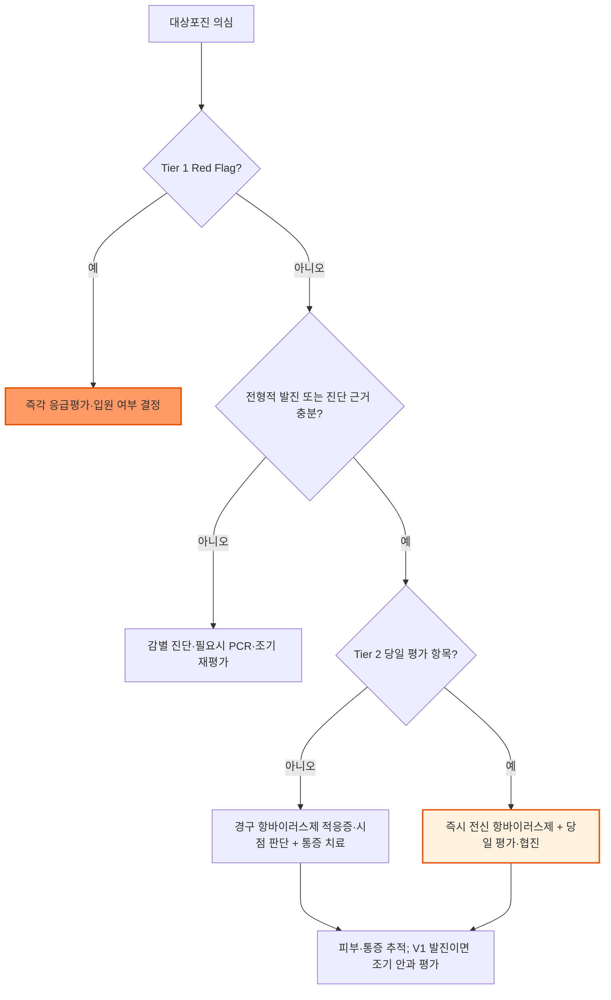

# 대상포진 Herpes Zoster, Shingles

## <mark style="color:green;">일반 사항</mark>

* 수두-대상포진바이러스(varicella-zoster virus, VZV)가 감각신경절에 잠복한 후 재활성화되어 발생하는 통증성 수포성 질환
* 기전 : 수두 감염 후 VZV가 후근신경절 또는 뇌신경 감각신경절에 잠복 → 세포매개면역 저하 시 재활성화 → 해당 감각신경을 따라 피부로 이동하여 피부분절성 발진과 신경통 유발
  * 항바이러스제는 증식 중인 VZV의 DNA 복제를 억제하지만 잠복 감염을 제거하지는 못함
* 일생 중 발생 위험은 약 30%로 추정되며(미국 자료), 연령 증가와 면역저하에 따라 위험 및 합병증이 증가
* 호발 부위 : 흉부 피부분절, 삼차신경 제1분지(V1); 일반적으로 한 개 또는 인접한 두 개의 피부분절을 편측으로 침범하며 정중선을 거의 넘지 않음
* 주요 합병증 : 대상포진후신경통(postherpetic neuralgia, PHN), 안구 합병증, Ramsay Hunt syndrome, 분절성 근력저하, 수막염·뇌염·척수염·혈관병증, 피부 2차 세균감염, 파종성·내장 대상포진
  * 대상포진 후 수 주\~수개월 동안 뇌졸중 및 심혈관질환 위험이 일시적으로 증가할 수 있으므로 새로운 국소 신경학적 증상이나 흉통을 대상포진 통증으로 단정하지 않음

### <mark style="color:orange;">발생 관련 최신 지견</mark>

* COVID-19 감염 후 대상포진 발생 위험 증가가 관찰연구와 메타분석에서 보고됨
* 반면 COVID-19 백신 접종 후 대상포진 위험 증가 여부는 연구 결과가 일관되지 않고 인과관계가 확립되지 않음(JAMA Netw Open 2022;5:e2242240; J Infect Dis 2023;228:1326; JAAD 2023 메타분석)
  * 이러한 관찰 결과를 COVID-19 예방접종 제한의 근거로 해석하지 않으며, 발생 시 조기 진단·치료 원칙은 동일함

### <mark style="color:orange;">합병증 위험 인자</mark>

* 고령, 면역저하 상태
* 안구(V1) 또는 귀 부위 이환
* 심한 발진 또는 여러 분절·광범위 피부 이환
* 심한 급성 통증 또는 심한 전구 증상
* 비전형적 수포, 출혈·괴사성 병변

### <mark style="color:orange;">재발</mark>

* 면역정상자에서도 재발할 수 있으며 일반 인구 연구의 재발 경험률은 약 1.2\~9.6%로 다양함
* 반복 재발, 같은 부위의 잦은 재발 또는 생식기·둔부 병변에서는 HSV를 PCR로 감별하고 면역저하 상태를 평가

### <mark style="color:orange;">전파 및 감염관리</mark>

* 감수성자가 대상포진 환자에게서 VZV에 감염되면 **대상포진이 아니라 수두**가 발생함
* 국소 대상포진 : 주로 수포액과의 직접 접촉 또는 병변 유래 에어로졸을 통해 전파 가능
  * 대상포진은 수두보다 전염력이 낮으며 병변을 덮고 손 위생을 시행하면 전파 위험을 줄일 수 있음
* 의료기관 감염관리
  * 면역정상자의 국소 대상포진 : 병변을 완전히 덮고 표준주의 적용
  * 파종성 대상포진 : 공기주의·접촉주의와 표준주의 적용
  * 면역저하자의 국소 대상포진 : 파종성 감염을 배제할 때까지 공기주의·접촉주의 적용; 배제 후 병변을 덮고 표준주의 적용
* 모든 병변이 가피화될 때까지 전염 가능
  * 병변을 깨끗하고 건조하게 유지하고 가능한 범위에서 덮음
  * 손 위생을 철저히 하고 수포를 터뜨리지 않음
  * 수두 면역이 없는 임신부, 신생아 및 중증 면역저하자와의 접촉을 피함

## <mark style="color:green;">임상 양상</mark>

### <mark style="color:orange;">전구기</mark>

* 발진 발생 1일\~수일 전부터 해당 피부분절에 통증, 작열감, 가려움, 감각과민 또는 이상감각
* 발진 전 흉통·복통·두통으로 내장 또는 심혈관·신경계 질환으로 오인할 수 있으며, 반대로 위험 질환을 대상포진 전구통으로 단정하지 않음

### <mark style="color:orange;">활성기</mark>

* 편측 피부분절을 따라 군집성 홍반성 구진과 수포가 발생하며 대개 정중선을 넘지 않음
* 새 수포는 보통 3\~5일 동안 발생 → 수포가 혼탁해지고 농포화 → 7\~10일 내 가피 형성 → 2\~4주 내 치유
* 통증·감각이상 또는 색소 변화는 피부 병변보다 오래 지속될 수 있음
* 발열, 두통, 피로, 권태감 등의 전신 증상은 일부 환자에서 동반

### <mark style="color:orange;">파종성 대상포진</mark>

* 주 침범 피부분절과 인접 분절을 벗어나 다수의 수포가 발생하는 상태
* 임상에서 **주 병변 및 인접 분절 밖의 수포가 대략 20개를 초과할 때** 의심하는 실용적 기준이 흔히 사용되지만 절대적인 진단기준은 아님
* 파종성 대상포진은 면역정상자에서도 발생할 수 있으며 당일 병원 평가가 필요함; 면역저하·내장 침범 또는 빠른 진행이면 입원 및 IV acyclovir를 적극 고려

### <mark style="color:orange;">Herpes zoster ophthalmicus (HZO)</mark>

* 삼차신경 제1분지(V1) 침범으로 발생하며 nasociliary branch 침범에만 국한되지 않음
* Hutchinson sign : 코끝·콧등 또는 코 옆면의 병변으로 안구 합병증 위험을 높이는 소견
  * Hutchinson sign이 없어도 안구 침범을 배제할 수 없음
* 안구 통증, 충혈, 눈부심, 시력저하, 각막 이상이 있으면 전신 항바이러스제를 즉시 시작하고 당일 안과 의뢰
* Hutchinson sign이 있으면 안구 증상이 없어도 당일 안과 평가
* V1 발진만 있고 안구 증상·Hutchinson sign이 없어도 전신 항바이러스제를 시작하고 조기 안과 평가를 계획함
  * 안구 합병증은 피부 발진 이후 지연되어 발생할 수 있으므로 새 눈 통증·충혈·눈부심·시력 변화 시 당일 재평가

### <mark style="color:orange;">Herpes zoster oticus 및 Ramsay Hunt syndrome</mark>

* 이개·외이도·구강의 수포, 심한 이통, 말초성 안면마비, 청력저하 또는 현훈
* 가능한 한 72시간 이내 전신 항바이러스제와 전신 스테로이드 병용을 고려하고 이비인후과·신경과 당일 의뢰
  * 병용은 임상적으로 널리 사용되지만 양질의 무작위시험 근거가 제한적임
  * 용법 예시 : prednisolone 1 ㎎/㎏/day(최대 60 ㎎/day) 5\~7일 투여 후 임상 반응과 총 투여 기간에 따라 5\~10일에 걸쳐 감량을 고려하며, 용량·기간은 협진 하에 개별화
* 안면신경마비로 눈이 완전히 감기지 않으면 인공눈물·안연고 및 취침 시 눈꺼풀 보호 등 각막 노출 손상 예방을 시행; 눈 통증·충혈·시력 변화가 있으면 당일 안과 의뢰

### <mark style="color:orange;">지속성·만성 피부 대상포진</mark>

* 수 주 이상 새 수포·미란·궤양이 지속하는 비전형적 형태로 주로 중증 면역저하자에서 발생
* 진단 오류, HSV, 복약 순응도, 약물 흡수 및 면역저하 상태를 먼저 재평가
* acyclovir 내성 VZV는 특히 장기간 항바이러스제에 노출된 중증 면역저하자에서 의심하며 감염내과 협진 하에 PCR 확인 및 필요시 내성 평가

### <mark style="color:orange;">대상포진후신경통 Postherpetic Neuralgia, PHN</mark>

* 가장 흔히 사용하는 정의 : 발진 발생 후 90일 이상 해당 피부분절에 지속되는 통증
  * 발진 후 30\~90일의 통증은 아급성 대상포진 통증으로 구분할 수 있으나, 치료를 90일까지 미루지 않음
  * 대한통증학회 2026 난치성 PHN 지침은 실제 진료를 반영하여 발진 후 1개월을 초과해 1차 약제에도 NRS ≥4인 통증이 지속되는 환자를 적용 대상으로 삼음
* 위험 인자 : 고령, 심한 급성 통증, 심한 발진, 안면 또는 V1 침범, 면역저하
* 작열통·전격통·감각저하·감각과민·이질통(allodynia)이 나타나며 수개월\~수년 지속될 수 있음

### <mark style="color:$danger;">🚩 Red Flags!</mark>

<mark style="color:$danger;">**Tier 1 - 즉각 조치 또는 의뢰**</mark>

* 의식 변화, 경련, 수막자극징후, 급성 국소 신경학적 결손 또는 뇌졸중 의심
* 호흡곤란, 저혈압, 심한 전신독성 또는 폐렴·간염 등 내장 침범 의심
* 급격한 시력저하, 심한 안구 통증 또는 급성 망막괴사 의심
* 새로 발생한 사지 근력저하, 보행장애, 척수병증 의심
* 천수 대상포진에 요폐, 대소변 장애 또는 회음부 감각저하 동반
* 중증 면역저하자에서 파종성·출혈괴사성 병변 또는 빠른 진행

<mark style="color:$warning;">**Tier 2 - 당일 평가 및 필요시 의뢰**</mark>

* V1 분포 발진과 안구 통증·충혈·눈부심·시력 변화·각막 이상 또는 Hutchinson sign
* 이개·외이도 수포와 안면마비, 청력저하 또는 현훈(Ramsay Hunt syndrome 의심)
* 면역저하자의 대상포진 또는 다분절·파종성 대상포진 — 당일 중증도·입원 필요성 평가 및 감염내과 등 협진
* 경구약으로 조절되지 않는 심한 통증, 광범위 발진 또는 출혈괴사성 병변
* 임신 중 중증·파종성 대상포진 또는 산과적 고위험 상태

<mark style="color:$info;">**Tier 3 - 조기 평가 및 외래 추적**</mark> <mark style="color:$info;">- 즉각 위험 낮으나 호전 없으면 의뢰</mark>

* V1 발진만 있고 안구 증상·Hutchinson sign이 없는 경우 — 조기 안과 평가 및 증상 변화 시 당일 평가
* 진단이 불확실하거나 반복 재발하여 HSV 등 감별이 필요한 경우; 생식기·둔부 병변에서 특히 주의
* 발진 초기 3\~5일의 새 수포는 자연 경과일 수 있으나, 치료 중 병변이 계속 확대되거나 발진 발생 7일 이후에도 새 수포가 출현하면 조기 재평가
* 적절한 치료에도 호전이 없거나 국소 2차 세균감염이 의심됨; 빠른 악화·확대되는 홍반·발열·전신 증상이 있으면 당일 평가로 상향
* 발진 발생 4주 이후에도 중등도 이상의 신경병성 통증이 지속됨
* 1차 PHN 치료에 반응하지 않거나 약물 부작용으로 치료가 어려움

## <mark style="color:green;">진단</mark>

* 전형적인 편측 피부분절성 군집 수포는 임상적으로 진단

### <mark style="color:orange;">감별 진단</mark>

* 편측 군집성 발진·수포 : HSV(대상포진양 단순포진), 접촉피부염, 농가진, 벌레물림, 수포성 자가면역질환, 피부 괴사·혈관염
* 발진 없이 피부분절성 통증만 있는 경우 : 신경근병증, 근골격계 통증, 심혈관·내장 질환 등

### <mark style="color:orange;">검사</mark>

* 진단이 불확실한 얼굴·생식기 병변, 재발성·비전형적·파종성 병변 또는 면역저하자에서는 **병변 VZV PCR**을 우선 고려; 전형적인 국소 대상포진은 위치만으로 PCR이 필수인 것은 아님
  * 수포액, 수포 바닥 세포 또는 가피를 검체로 채취
  * 반복성 생식기·둔부 병변에서는 HSV PCR을 함께 고려
* 혈청 VZV IgM은 민감도·특이도가 낮고 초감염과 재활성화를 구분하지 못하므로 대상포진 확진에 단독 사용하지 않음
* Zoster sine herpete : 발진 없이 피부분절성 통증 또는 VZV 신경계 합병증이 의심되는 상태
  * 발진 없는 피부분절성 통증만으로 진단하지 않으며 심혈관·내장 질환, 신경근병증 등 다른 원인을 우선 배제하고 가능한 경우 검사로 뒷받침
  * 신경계 침범·안면마비 등 임상 상황에 따라 CSF VZV PCR 또는 타액·비인두 검체 VZV PCR 등을 전문의와 고려
  * 타액·비인두 검체 검사는 표준화·민감도에 한계가 있어 일반 외래의 단독 확진·배제 검사로 사용하지 않음
  * CNS VZV 감염이 의심되면 CSF VZV PCR과 CSF 내 anti-VZV IgG의 수막강 내 생성을 함께 평가할 수 있으므로 신경과·감염내과 협진
* 신경학적 증상 : 증상에 따라 뇌·척수 MRI, CSF 검사 및 혈관 평가
* HIV 검사 : 원인 불명의 젊은 환자, 반복 재발, 다분절·파종성·비전형적 대상포진 또는 HIV 위험인자가 있는 경우 권고

***



<p align="center"><strong>진단 및 초기 치료 결정 알고리듬</strong></p>

* 안구·신경계 합병증이나 파종성 감염이 의심되는 경우 진단 검사를 위해 항바이러스제 시작·의뢰를 지연하지 않음

<p align="center"><em>주요 권고를 진료 편의를 위해 종합한 요약 알고리듬이며, 공식 기관 알고리듬을 그대로 재현한 것은 아님</em></p>

<p align="center"><em><mark style="color:$info;">Ref. CDC Clinical Overview of Herpes Zoster; NHS Ayrshire &amp; Arran, Varicella zoster virus infections</mark></em></p>

***

## <mark style="background-color:$warning;">Management</mark>

### <mark style="color:orange;">치료 방침</mark>

* 항바이러스제를 가능한 한 조기에 시작하고 통증 강도를 초기부터 평가하여 치료
* 병변을 깨끗하고 건조하게 유지하고 느슨한 옷, 냉습포 등을 사용
* 예방적 항생제 또는 국소 항생제를 일률적으로 사용하지 않으며 2차 세균감염이 확인·의심될 때만 치료
* 발진 초기에는 새 수포가 생길 수 있으나, 발진 7일 이후에도 새 병변이 발생하거나 치료에도 진행하면 순응도·진단 오류·면역저하를 재평가하고 중증 면역저하자에서 내성을 고려

## <mark style="color:green;">비-약물 치료 및 예방</mark>

* 휴식과 충분한 수분·영양 섭취
* 병변을 깨끗하고 건조하게 유지하고, 헐렁한 옷을 착용하며, 냉습포로 통증·가려움을 완화
* 수포를 터뜨리지 않으며 필요시 비점착성 드레싱으로 덮음; 병변에 달라붙거나 밀폐하여 습하게 만드는 드레싱은 피함
* 모든 병변이 가피화될 때까지 수두 면역이 없는 임신부·신생아·중증 면역저하자와의 접촉을 회피(☞ 전파 및 감염관리)
* 대상포진 예방의 핵심은 예방접종이며, 50세 이상 성인에서 접종을 권고(☞ 예방접종)

## <mark style="color:green;">약물 치료</mark>

### <mark style="color:orange;">항바이러스제 투여 대상과 시점</mark>

* 50세 이상, 면역저하, 중등도 이상의 통증·발진, 안구·귀 또는 신경계 침범 등에서는 적극 치료하며 발진 발생 후 가능한 한 72시간 이내 시작
* 젊은 면역정상자의 경증 국소 대상포진은 기대 이득·복약 부담을 설명하고 개별 결정
* 72시간이 지났더라도 다음이면 치료를 시작하거나 적극적으로 고려
  * 새 수포가 계속 발생함; 가피화되지 않은 병변이 남아 있다는 이유만으로 후기의 항바이러스제 투여를 일률적으로 결정하지 않음
  * HZO, Ramsay Hunt syndrome 또는 신경계 합병증
  * 면역저하, 다분절·파종성 또는 내장 침범 의심
  * 발진 후 7일 이내의 고령, 중등도 이상의 통증 또는 광범위·중증 발진; 7일 이후에는 새 수포·합병증·면역저하 여부로 개별 결정
* 합병증이 없고 모든 병변이 가피화된 젊은 면역정상자가 발진 7일 이후 내원한 경우 기대 이득은 제한적
* 항바이러스제는 급성 통증과 새 병변 발생·치유 기간을 줄이지만 PHN 발생을 확실히 예방하지는 못함

<table><thead><tr><th width="170">성분명 [상품명]</th><th width="200">성인 예시 용법</th><th>주요 주의사항</th></tr></thead><tbody><tr><td><strong>acyclovir</strong><br><mark style="color:blue;">\[메노바 등]</mark></td><td>800 ㎎ 1일 5회 × 7\~10일</td><td>신기능에 따라 감량, 충분한 수분섭취<br>두통, 구역, 신독성·신경독성</td></tr><tr><td><strong>valacyclovir</strong><br><mark style="color:blue;">\[발트렉스 등]</mark></td><td>1 g tid × 7일</td><td>신기능에 따라 감량<br>두통, 구역, 복통, 드물게 신경독성</td></tr><tr><td><strong>famciclovir</strong><br><mark style="color:blue;">\[팜비어 등]</mark></td><td><strong>국내 허가 기준 : 250 ㎎ tid × 7일</strong></td><td>신기능에 따라 감량<br>해외 문헌의 500 ㎎ tid는 국내 일반 성인 허가 용량과 다름</td></tr><tr><td><strong>IV acyclovir</strong><br><mark style="color:blue;">\[에크로바주 등]</mark></td><td>10 ㎎/㎏ IV q8h<br>치료 기간은 침범 장기·면역상태·반응에 따라 결정</td><td>중증 면역저하, 파종성·내장 또는 중증 신경계 합병증<br>신기능에 따라 용량·간격 조절, bolus 투여 금지<br>적절한 수분상태를 유지하고 최소 1시간 이상 점적</td></tr></tbody></table>

* 파종성·내장 침범에서는 IV acyclovir로 시작하고 새 수포 발생이 멎고 임상적으로 호전되면 경구제로 전환할 수 있음; 총 10\~14일을 예로 들 수 있으나 CNS·망막 침범이나 지속성 면역저하에서는 더 긴 치료 등 전문의 결정이 필요함
* 면역저하자라도 경증 국소 병변이고 경구 투여·면밀한 추적이 가능하면 경구 치료를 선택할 수 있음; 면역저하라는 이유만으로 IV 요법을 일률 적용하지 않음

#### <mark style="color:$primary;">신기능별 경구 항바이러스제 감량</mark>

<table><thead><tr><th width="135">약제</th><th width="125">CrCl (mL/min)</th><th>대상포진 성인 용법 예시</th></tr></thead><tbody><tr><td rowspan="3"><strong>acyclovir</strong></td><td>&gt;25</td><td>800 ㎎ 1일 5회</td></tr><tr><td>10\~25</td><td>800 ㎎ q8h</td></tr><tr><td>&lt;10</td><td>800 ㎎ q12h</td></tr><tr><td rowspan="4"><strong>valacyclovir</strong></td><td>≥50</td><td>1 g q8h</td></tr><tr><td>30\~49</td><td>1 g q12h</td></tr><tr><td>10\~29</td><td>1 g q24h</td></tr><tr><td>&lt;10</td><td>500 ㎎ q24h</td></tr><tr><td rowspan="4"><strong>famciclovir</strong><br>(국내 허가 기준)</td><td>≥60</td><td>250 ㎎ tid</td></tr><tr><td>30\~59</td><td>250 ㎎ bid</td></tr><tr><td>10\~29</td><td>250 ㎎ qd</td></tr><tr><td>&lt;10, 비투석</td><td>국내 허가사항에 명확한 별도 기준이 없어 제품설명서·약제부 확인 후 개별 결정</td></tr></tbody></table>

* 혈액투석 환자는 valacyclovir를 투석 후 투여함
* Famciclovir는 투석 간격을 고려하여 48시간마다 투여하며, 대상포진 권장용량은 투석 직후 250 ㎎임
* 약제 감량은 제품별 CrCl 기준을 따르며 검사실 eGFR과 동일한 수치로 간주하지 않음; famciclovir 국내 설명서는 청소율 단위를 mL/min/1.73 ㎡로 표기하면서 Cockcroft–Gault 계산식을 제시하므로 제품 원문과 환자 체격을 함께 확인
* 위 표는 성인 대상포진 용법에 한정한 요약이며, 고령·급성 신손상·신기능 변동 또는 투석 환자에서는 제품설명서와 약제부 확인이 필요


**⚠️ Brivudine 안전성 경고**\
국내 허가·유통 여부가 확인되지 않아 본 가이드의 기본 처방 선택지에는 포함하지 않음\
fluorouracil(5-FU), capecitabine, tegafur 등 fluoropyrimidine 또는 flucytosine을 현재 투여 중인 환자에게 brivudine 투여 금기\
brivudine 종료 후 4주 이내 fluoropyrimidine 또는 flucytosine 치료가 예정된 환자에게 brivudine을 시작하지 않음\
brivudine 종료 후 최소 4주가 지난 뒤 fluoropyrimidine 또는 flucytosine 치료를 시작\
병용 또는 간격 오류 시 치명적인 fluoropyrimidine 독성이 발생할 수 있으므로 즉시 입원 평가


#### <mark style="color:$primary;">Acyclovir 내성 VZV</mark>

* 적절한 치료에도 병변이 지속·진행하는 중증 면역저하자에서 순응도·흡수·진단 오류를 먼저 확인
* acyclovir 내성이 확인되거나 강하게 의심되면 감염내과 협진 하에 IV foscarnet을 구제요법으로 고려
* cidofovir는 foscarnet 사용이 불가능하거나 실패한 예외적 상황에서만 전문의가 고려하며, CMV 망막염 용법을 대상포진 표준요법으로 적용하지 않음

### <mark style="color:orange;">임신 중 대상포진 치료</mark>

* 임신부의 경증 국소 대상포진은 항바이러스제 투여 여부를 산부인과와 개별 결정함
* 중증 통증·안구 또는 신경계 침범·면역저하·파종성 등 치료가 필요한 경우, 임신 중 사용 경험이 가장 많은 acyclovir를 우선 고려하고 모체 이득과 위험을 평가함
* Famciclovir는 임신 중 자료가 제한적이므로 성인 처방례를 임신부에게 그대로 적용하지 않음

### <mark style="color:orange;">HZO의 장기 항바이러스 억제요법</mark>

* ZEDS 2025 : 최근 1년 내 각막염 또는 홍채염이 확인된 면역정상·비임신 성인 HZO 환자(eGFR ≥45 mL/min/1.73 ㎡)에서 valacyclovir 1 g qd를 12개월 투여함
  * 12개월 일차 평가변수는 통계적으로 유의하지 않았으나, 18개월 이차 평가 및 각막염·홍채염의 반복 악화에서 이득이 관찰됨
  * 재발성·지속성 안구 염증 환자에서 안과의사가 고려할 수 있는 **국내 허가 외 용법**임; 단순 V1 피부 발진이나 일반 PHN 예방에 일률 적용하지 않음
  * 급성기 1 g tid ×7일 요법과 구분하며, 신기능·부작용을 추적함 [JAMA Ophthalmol 2025;143:269–276](https://doi.org/10.1001/jamaophthalmol.2024.6114)

### <mark style="color:orange;">국소 항바이러스제와 스테로이드</mark>

* 국소 항바이러스제는 전신 항바이러스제를 대체하지 못함
* HZO의 항바이러스 안연고·점안제 및 점안 스테로이드는 안과 진찰에서 확인된 각막염·포도막염 등에 따라 안과의사가 결정
* 전신 스테로이드
  * 일상적으로 사용하거나 PHN 예방 목적으로 사용하지 않음
  * 면역정상 성인의 중증 급성 통증 또는 Ramsay Hunt syndrome 등 선별된 상황에서 전신 항바이러스제와 함께 제한적으로 고려하되, Ramsay Hunt syndrome의 병용 근거는 제한적임
  * 항바이러스제 없이 단독 투여하지 않으며 당뇨병, 감염, 소화성궤양, 골다공증 등 위험을 평가

### <mark style="color:orange;">급성 통증 및 피부 관리</mark>

* 경증 통증
  * acetaminophen 500\~1,000 ㎎ q6\~8h 필요시 <mark style="color:blue;">\[타이레놀]</mark>
  * 일반 성인 최대 4,000 ㎎/day를 넘지 않으며 다른 복합제의 함량도 합산함; 서방제는 해당 제품의 최대용량·투여 간격을 따름. 고령·쇠약·저체중·간질환·과음 위험에서는 3,000 ㎎/day 이하 등 더 낮은 한도를 개별 결정
* NSAID가 적합한 환자
  * ibuprofen 200\~400 ㎎ tid 필요시 <mark style="color:blue;">\[부루펜]</mark> - 가능한 최저 유효용량으로 단기간 사용
  * 신장질환, 심혈관질환, 소화성궤양, 항응고제 복용 또는 고령자에서 주의
* 중등도\~중증의 신경병성 통증은 gabapentinoid 또는 저용량 TCA를 조기에 고려할 수 있으나 PHN 예방 효과가 입증된 것은 아님
* 피부 관리 : 냉습포, calamine <mark style="color:blue;">\[칼라민]</mark>, aluminum acetate 습포 또는 colloidal oatmeal bath
  * 수포를 터뜨리거나 병변에 붙는 폐쇄성 드레싱을 사용하지 않음
  * 예방적 국소 항생제는 사용하지 않음

### <mark style="color:orange;">2차 세균감염</mark>

* 홍반·열감·압통이 확대되거나 화농성 분비물, 악취, 발열이 새로 발생하면 *Staphylococcus aureus* 및 *Streptococcus pyogenes* 감염을 평가
* 단순 가피·혼탁한 수포만으로 세균감염으로 판단하지 않음(☞ [피부감염](165_-skin-and-soft-tissue-infection.md))

### <mark style="color:orange;">대상포진후신경통(PHN) 약물치료</mark>

* 통증 강도, 이질통, 수면장애, 신기능, 낙상 위험 및 항콜린 부작용 위험을 평가
* 국소 통증·이질통이 두드러지면 lidocaine patch를 우선 또는 병용 고려
* 전신 치료는 gabapentinoid 또는 TCA 중 하나를 저용량으로 시작하여 서서히 증량
* acetaminophen과 NSAID는 동반된 체성통증의 보조요법일 수 있으나 PHN의 주된 치료제가 아님
* 여러 진정성 약제를 동시에 시작하지 않음
* Gabapentin과 pregabalin을 일상적으로 병용하지 않음; 중단 시 최소 1주 이상에 걸쳐 감량하며 장기·고용량 투여 시 더 천천히 감량할 수 있음
* Gabapentinoid와 opioid·benzodiazepine 등 중추신경억제제를 병용하면 호흡억제 위험이 증가하므로 고령·호흡기질환 환자는 특히 주의
* TCA의 신경병성 통증 치료는 국내 허가 외 사용임; 부정맥·QT 연장 위험, 녹내장·요폐 및 항콜린 부작용을 확인

<table><thead><tr><th width="150">약제</th><th width="230">시작 및 증량 예시</th><th>주요 주의사항</th></tr></thead><tbody><tr><td><strong>lidocaine patch</strong><br><mark style="color:blue;">\[리도탑 카타플라스마]</mark></td><td>통증 부위의 손상되지 않은 피부에 1\~3매<br>최대 12시간 부착 후 12시간 휴약</td><td>열린 상처·활성 수포 위에 부착하지 않음<br>국소 피부반응</td></tr><tr><td><strong>gabapentin</strong><br><mark style="color:blue;">\[뉴론틴 등]</mark></td><td>300 ㎎ hs → 300 ㎎ bid → 300 ㎎ tid<br>고령자는 100\~300 ㎎ hs부터 더 천천히 증량<br>통상 900\~1,800 ㎎/day, 필요시 최대 3,600 ㎎/day</td><td>신기능에 따른 감량 필수<br>졸림, 어지럼, 부종, 낙상</td></tr><tr><td><strong>pregabalin</strong><br><mark style="color:blue;">\[리리카 등]</mark></td><td>75 ㎎ bid 또는 50 ㎎ tid로 시작<br>반응·내약성에 따라 150\~300 ㎎/day<br>정상 신기능에서 최대 600 ㎎/day</td><td>신기능에 따른 감량 필수<br>졸림, 어지럼, 부종, 체중증가</td></tr><tr><td><strong>amitriptyline</strong><br><mark style="color:blue;">\[에트라빌]</mark></td><td>10\~25 ㎎ hs로 시작<br>1\~2주 간격으로 서서히 증량</td><td>항콜린작용, 기립저혈압, 진정, QT 연장<br>고령자는 가능한 한 회피하거나 매우 저용량 사용</td></tr><tr><td><strong>nortriptyline</strong><br><mark style="color:blue;">\[센시발]</mark></td><td>10\~25 ㎎ hs로 시작<br>1\~2주 간격으로 서서히 증량</td><td>amitriptyline보다 항콜린·진정 작용이 상대적으로 적지만 고령자 주의</td></tr><tr><td><strong>capsaicin 0.075% cream</strong><br><mark style="color:blue;">\[다이악센]</mark></td><td>소량 1일 3\~4회(4시간 이상 간격)<br>수 주간 규칙적으로 사용</td><td>초기 작열감·발적, 점막·손상 피부 회피<br>도포 후 손 씻기, 가열·온수욕 회피<br>처방 전 제품·공급 여부 확인</td></tr><tr><td><strong>tramadol ± acetaminophen</strong><br><mark style="color:blue;">\[울트라셋 등]</mark></td><td>다른 치료가 불충분한 중증 통증의 단기 구조요법</td><td>진정, 낙상, 변비, 의존성, 경련, 세로토닌증후군<br>신·간기능 및 병용약물 확인</td></tr></tbody></table>

#### <mark style="color:$primary;">Gabapentinoid 신기능 조절</mark>

<table><thead><tr><th width="140">약제</th><th width="125">CrCl (mL/min)</th><th>성인 1일 총량 및 분할 예시</th></tr></thead><tbody><tr><td rowspan="5"><strong>gabapentin</strong></td><td>≥60</td><td>900\~3,600 ㎎/day, tid</td></tr><tr><td>30\~59</td><td>400\~1,400 ㎎/day, bid</td></tr><tr><td>&gt;15\~29</td><td>200\~700 ㎎ qd</td></tr><tr><td>15</td><td>100\~300 ㎎ qd</td></tr><tr><td>&lt;15</td><td>CrCl 15의 용량을 청소율에 비례하여 추가 감량</td></tr><tr><td rowspan="4"><strong>pregabalin</strong></td><td>≥60</td><td>시작 150 ㎎/day, bid 또는 tid</td></tr><tr><td>30\~59</td><td>시작 75 ㎎/day, bid 또는 tid</td></tr><tr><td>15\~29</td><td>시작 25\~50 ㎎/day, qd 또는 bid</td></tr><tr><td>&lt;15</td><td>시작 25 ㎎ qd</td></tr></tbody></table>

* Gabapentin 표는 증량 후 1일 총량 범위이며 시작용량을 뜻하지 않음; 고령·쇠약 환자는 더 낮게 시작할 수 있으며 효과·진정·어지럼·낙상 위험을 보면서 서서히 증량
* 혈액투석 환자는 유지용량 외에 투석 후 보충용량이 필요하므로 제품설명서 또는 약제부 확인


급성 대상포진에서 amitriptyline 또는 gabapentinoid를 예방적으로 투여하여 PHN을 감소시킨다는 근거는 확립되지 않았으므로 일상적인 PHN 예방 목적으로 사용하지 않습니다. 다만 급성 신경병성 통증 자체의 치료 목적으로는 환자별로 고려할 수 있습니다.


## <mark style="color:green;">시술 및 기타 처치</mark>

### <mark style="color:orange;">신경차단술 및 통증의학과 의뢰</mark>

* 적절히 증량한 1차 약제와 국소 치료에도 일상생활·수면을 방해하는 중증 통증이 지속되는 경우 → 통증의학과 의뢰
* 약물 부작용 또는 복합질환 때문에 전신 약물치료가 어려운 경우 → 통증의학과 의뢰
* 급성기의 신경차단술을 PHN 예방 목적으로 모든 환자에게 일률 시행하지 않음
* 대한통증학회 2026 난치성 PHN 지침 : 1차 약제에도 발진 후 1개월 초과 NRS ≥4인 통증이 지속되면 통증의학과 의뢰
  * 경막외·척추주위·늑간신경차단 등 : 선별적 사용(조건부 권고), 시술별 근거수준은 낮음\~매우 낮음
  * 약물치료에 박동성 고주파술(pulsed radiofrequency)을 추가 : 강한 권고, 근거수준 낮음
  * 신경차단·박동성 고주파술 등에도 불응하면 척수자극술을 전문의가 선별적으로 고려
* 시술은 출혈·감염·신경손상 및 흉부 시술의 기흉 위험, 항응고제 복용 여부와 환자 선호를 평가하여 결정 [Korean J Pain 2026;39:171–190](https://doi.org/10.3344/kjp.25161)

## <mark style="color:green;">예방접종</mark>

### <mark style="color:orange;">접종 대상과 방법</mark>

* 대상포진 과거력이 있어도 접종 가능; 면역정상 50세 이상 성인은 수두 과거력이 기억나지 않아도 접종 전 항체검사가 일반적으로 필요하지 않음
* 수두 감수성(VZV 면역 없음)이 확인되면 수두 예방을 별도로 평가함; **RZV는 수두 백신을 대체하지 못함**
* 젊은 면역저하자에서 수두·수두 백신·대상포진의 기록이 없으면 병력·접종 기록과 필요시 혈청검사로 VZV 면역 여부를 평가
* 대한감염학회 2023 권고
  * **RZV** <mark style="color:blue;">\[싱그릭스]</mark> : 50세 이상 성인에게 권고
  * **RZV** <mark style="color:blue;">\[싱그릭스]</mark> : 대상포진 위험이 증가한 18세 이상 중증 면역저하자에게 권고
  * 0.5 ㎖ IM 2회, 2\~6개월 간격; 최소 간격 4주
  * 면역억제 치료 일정 등으로 접종을 빨리 완료해야 하는 경우 1\~2개월 간격을 고려하되 최소 4주를 유지
  * 2차 접종이 6개월을 넘겨 지연되면 가능한 한 빨리 접종하며 처음부터 다시 시작하지 않음
  * RZV는 생백신이 아니므로 acyclovir·valacyclovir·famciclovir 복용 중에도 접종 가능
* **ZVL** <mark style="color:blue;">\[스카이조스터]</mark> : 국내에서 50세 이상 성인에게 1회 SC 접종할 수 있으나 예방효과와 지속성, 면역저하자 사용 가능성을 고려하면 RZV가 우선 선호됨
  * 생백신이므로 임신부 및 중증 면역저하자에게 금기
  * 조스타박스는 국내 공급이 중단됨

* ZVL 기접종자도 RZV 2회 접종 가능
  * 대한감염학회 2023 : 일반적으로 5년 간격을 고려하되 고령·위험 증가·환자 선호에 따라 앞당길 수 있음; ZVL 후 2개월 이내 RZV 접종은 권고하지 않음
* 백신 성분 또는 이전 접종에 중증 알레르기 반응이 있었으면 해당 백신 금기
* 임신 중 RZV는 자료가 제한되어 출산 후로 접종을 연기하는 것을 고려; ZVL은 임신 중 금기

### <mark style="color:orange;">효과와 접종 후 안내</mark>

* RZV는 임상시험에서 50세 이상 대상포진 예방효과가 90% 이상이었으며 10년 장기 추적자료가 보고됨
* ZVL은 연령 증가 및 시간 경과에 따라 예방효과가 감소
* RZV는 주사부위 통증, 발적, 근육통, 피로, 두통, 오한, 발열 등 반응원성이 비교적 흔함
  * 1차 접종 후 반응이 있었더라도 금기가 아니라면 예정대로 2차 접종을 완료
* 백신은 현재 진행 중인 대상포진의 치료제가 아님

### <mark style="color:orange;">대상포진 발병 후 접종 시기</mark>

* 급성 발진과 전신 증상이 지속하는 동안 접종하지 않음
* CDC : 급성기가 종료되고 증상이 완화되면 별도의 최소 간격을 두지 않음
* 대한감염학회 2023 : 면역정상자의 경우 즉시 접종하기보다 발병 후 1\~2년 간격을 두는 것을 선호
* 면역저하 또는 향후 면역억제 치료 예정 환자는 재발 위험과 치료 일정을 고려하여 감염내과·접종 전문가와 시기를 개별 결정
* 요약하면 국내에서는 면역정상자의 경우 발병 후 1\~2년 간격을 선호하지만 절대적인 최소 간격은 아니며, 면역저하 상태·재발 위험·향후 면역억제 치료 일정에 따라 급성기 종료 후 접종 시기를 앞당길 수 있음

### <mark style="color:orange;">최신 지견 - 대상포진 백신과 치매 위험</mark>


대상포진 백신 접종과 이후 치매 진단 위험 감소 사이의 연관성이 관찰연구와 자연실험에서 보고되었습니다. Taquet 등은 RZV 접종자를 ZVL 접종자와 비교했고(*Nat Med* 2024;30:2777), Eyting 등은 Wales의 생년월일 기준 접종정책을 이용하여 ZVL의 효과를 평가했습니다(*Nature* 2025;641:438).\
다만 이러한 결과만으로 치매 예방 효과나 기전이 확립된 것은 아니며, 치매 예방을 목적으로 대상포진 백신을 권고하는 공식 지침은 없습니다. 환자 상담 시 참고할 수 있는 최신 근거로만 소개합니다.


***

### <mark style="color:red;">질병코드</mark>

✽ 아래는 KCD 기준이며, 실제 청구 시 주된 진료 사유와 동반 합병증에 따라 주상병·부상병 코드를 선택합니다.

B02.0 대상포진뇌염

B02.1 대상포진수막염

B02.2 기타 신경계통 침범을 동반한 대상포진

B02.3 대상포진눈병

B02.7 파종성 대상포진

B02.8 기타 합병증을 동반한 대상포진

B02.9 합병증이 없는 대상포진

G53.0\* 대상포진후신경통 Postzoster neuralgia (B02.2†)

✽ PHN은 원인질환 B02.2†와 발현질환 G53.0\*의 검표·별표 짝을 확인하여 병기하며, G53.0\*를 단독 원인질환 코드처럼 사용하지 않음.

***

## <mark style="color:purple;">처방례</mark>


아래는 성인 예시 처방입니다. 항바이러스제와 gabapentinoid는 신기능에 따라 감량하고, 고령·저체중·간질환·과음 위험에서는 acetaminophen 총량을 낮춥니다.


> **처방례 1.** 면역정상 성인의 급성 대상포진
>
> ```
> 팜비어 250 ㎎/T　3T　#3　×7일
> 타이레놀이알 650 ㎎/T　3T　#3　필요시
> ```
>
> _✽ Famciclovir 250 ㎎ tid는 국내 허가 기준입니다. 발진 발생 72시간 이내 시작을 원칙으로 하며, 신기능에 따라 감량합니다._

> **처방례 2.** Valacyclovir를 선택한 급성 대상포진
>
> ```
> 발트렉스 500 ㎎/T　6T　#3　×7일
> 부루펜 200 ㎎/T　3T　#3　필요시, 단기간
> ```
>
> _✽ 발트렉스 500 ㎎은 1회 2정씩 1일 3회 복용합니다. 부루펜은 신장·심혈관·위장관 위험이 낮은 환자에서 최저 유효용량으로 단기간 사용합니다. 덱시부프로펜 서방제(맥시부펜이알)는 일반정의 tid 용법과 혼용하지 않습니다._

> **처방례 3.** 국소 이질통이 동반된 PHN
>
> ```
> 에트라빌 10 ㎎/T　1T　취침 전
> 리도탑 카타플라스마 5매/P　통증 부위에 1일 최대 3매, 12시간 부착 후 12시간 휴약
> ```
>
> _✽ Amitriptyline의 PHN 치료는 국내 허가 외 사용입니다. 고령·쇠약 환자에서는 lidocaine 단독 또는 신기능에 맞춘 저용량 gabapentinoid를 우선 고려하며, TCA 사용 시 항콜린·기립저혈압·부정맥 위험을 평가합니다._

> **처방례 4.** 정상 신기능 성인의 PHN
>
> ```
> 리리카 75 ㎎/C　2C　#2
> ```
>
> _✽ 3\~7일 후 효과·졸림·어지럼·부종을 평가하여 필요시 서서히 증량하고, 신기능에 따라 초기 용량을 조정합니다._

***

### <mark style="color:$success;">핵심 복약 지도</mark>

> **항바이러스제 복용**
>
> * 처방된 기간(보통 7일) 동안 정해진 횟수를 지켜 복용합니다. 임의로 중단하거나 남은 약을 다음 재발 시 복용하지 않습니다.
> * 신기능이 저하된 환자는 용량·간격 조절이 필요하므로 반드시 확인합니다.

> **전파 예방**
>
> * 모든 병변이 딱지로 변할 때까지 병변을 덮고 손 위생을 철저히 합니다.
> * 수두 면역이 없는 임신부, 신생아 및 중증 면역저하자와의 접촉을 피하도록 설명합니다.

> **경고 징후 교육**
>
> * 눈 통증·충혈·시력저하, 안면마비, 청력저하·현훈, 심한 두통·의식 변화, 새로운 근력저하, 호흡곤란 또는 전신 발진이 생기면 즉시 재평가가 필요함을 설명합니다.

> **언제 다시 병원을 방문해야 하나요?**
>
> * 발진 발생 7일 이후에도 새 수포가 나타나거나 치료 중 병변이 계속 확대되는 경우
> * 발진이 나은 뒤에도 4주 이상 통증이 지속되거나 악화되는 경우
> * PHN 약물치료에도 통증·수면장애가 지속되거나 부작용으로 복용이 어려운 경우 - 통증의학과 의뢰 고려

***

## <mark style="color:blue;">환자 안내서</mark>


**대상포진, 몸속에 잠들어 있던 수두 바이러스가 다시 깨어난 것입니다**

어릴 때 앓은 수두 바이러스는 완전히 없어지지 않고 신경 속에 조용히 남아 있다가, 나이가 들거나 질환·치료로 면역력이 떨어질 때 다시 활동을 시작해 통증과 물집을 일으킵니다.


#### <mark style="color:$primary;">왜 생기나요?</mark>

* 어릴 때 수두를 앓으면 바이러스가 완전히 사라지지 않고 신경 마디에 잠복합니다.
* 나이가 들거나 다른 질환·치료로 면역력이 떨어지면 위험이 커집니다. 피로·스트레스만으로 원인을 단정할 수는 없습니다.
* 대상포진 환자의 물집 진물과 직접 접촉하거나 병변에서 나온 바이러스 입자에 노출되면, 수두 면역이 없는 사람에게 대상포진이 아니라 수두가 발생할 수 있습니다.

#### <mark style="color:$primary;">일상생활에서 어떻게 관리하나요?</mark>

* **물집을 터뜨리지 마십시오.** 상처를 통해 세균 감염이 생기거나 흉터가 남을 수 있습니다.
* **병변을 깨끗하고 건조하게 유지하십시오.** 헐렁한 옷을 입으면 마찰로 인한 자극을 줄일 수 있습니다.
* **손을 자주 씻으십시오.** 특히 물집을 만진 뒤에는 반드시 손을 씻어 수두 면역이 없는 임신부·아기·면역저하자에게 옮기지 않도록 합니다.
* **모든 물집이 마르고 딱지로 변할 때까지 전염될 수 있습니다.** 그때까지 병변을 가능한 범위에서 덮고 고위험군과의 접촉을 피하십시오.
* **차가운 젖은 수건을 잠시 대면** 통증과 가려움을 줄이는 데 도움이 됩니다.

#### <mark style="color:$primary;">약은 어떻게 써야 하나요?</mark>

* 항바이러스제는 발진 후 가능한 한 빨리, 가급적 3일 이내에 시작해야 효과가 좋습니다.
* 처방된 기간을 다 채워 복용하며, 증상이 좋아졌다고 임의로 중단하지 않습니다.
* 통증약은 처방된 용법에 따라 복용하고, acetaminophen의 하루 총량과 NSAID의 사용 기간을 지킵니다.

#### <mark style="color:$primary;">이럴 때는 즉시 병원을 방문하세요</mark>

* 눈 주위에 물집이 생기거나 눈이 아프고 시야가 흐려질 때
* 귀 주위 물집과 함께 얼굴 한쪽이 움직이지 않거나 어지러울 때
* 심한 두통, 의식이 흐려짐, 팔다리에 힘이 빠질 때

#### <mark style="color:$primary;">통증이 계속되면 다시 진료받으세요</mark>

* 피부 병변이 나은 뒤에도 통증이 지속되거나 옷깃만 스쳐도 아프면 외래를 다시 방문하여 대상포진후신경통 여부를 평가받으십시오.

#### <mark style="color:$primary;">예방접종이 권고됩니다</mark>

* 대상포진을 앓은 적이 있어도 다시 생길 수 있으므로, 급성기가 지난 뒤 대상포진 예방접종을 상담하십시오.
* 50세 이상 성인에게는 대상포진 예방접종이 권고되므로 의료진과 접종을 상담하십시오.

***

### <mark style="color:$info;">주요 참고 자료</mark>

* [CDC. Clinical Overview of Shingles](https://www.cdc.gov/shingles/hcp/clinical-overview/index.html)
* [CDC. Laboratory Testing for VZV](https://www.cdc.gov/chickenpox/php/laboratories/index.html)
* [CDC. Isolation Precautions, Appendix A](https://www.cdc.gov/infection-control/hcp/isolation-precautions/appendix-a-type-duration.html)
* [NHS Ayrshire & Arran. Varicella zoster virus infections](https://aaamedicines.org.uk/guidelines/infections-secondary-care/varicella-zoster-virus-infections/)
* [대한감염학회. Recommendations for Adult Immunization, 2023](https://doi.org/10.3947/ic.2023.0072) (Infect Chemother 2024;56:188–203)
* [CDC. Shingles Vaccine Recommendations](https://www.cdc.gov/shingles/hcp/vaccine-considerations/index.html)
* [CDC. Shingrix Use in Immunocompromised Adults](https://www.cdc.gov/shingles/hcp/vaccine-considerations/immunocompromised-adults.html)
* [동화약품. 클로비어정 제품정보·국내 famciclovir 용법](https://m.dong-wha.co.kr/product/content.asp?t_d=07&t_idx=320&t_page=2)
* [한미약품. 맥시부펜ER정 제품정보](https://hanmi.co.kr/business/product/finder/detail-402.hm)
* [동화약품. 에트라빌정 제품정보](https://m.dong-wha.co.kr/product/content.asp?t_d=07&t_idx=55&t_page=1)
* [Pfizer. Neurontin prescribing information](https://labeling.pfizer.com/ShowLabeling.aspx?id=630) (gabapentin 신기능별 용량 및 안전성 참고)
* [NIH. VZV Disease: Adult and Adolescent OIs](https://clinicalinfo.hiv.gov/en/guidelines/hiv-clinical-guidelines-adult-and-adolescent-opportunistic-infections/varicella-zoster) (면역저하·파종성 대상포진 치료 참고)
* [UKTIS. Aciclovir/Valaciclovir in Pregnancy](https://uktis.org/monographs/use-of-aciclovir-in-pregnancy/)
* [Pfizer. Lyrica prescribing information](https://labeling.pfizer.com/ShowLabeling.aspx?id=561) (pregabalin 신기능별 용량 및 안전성 참고)
* [ZEDS. Low-Dose Valacyclovir in HZO](https://doi.org/10.1001/jamaophthalmol.2024.6114) (JAMA Ophthalmol 2025;143:269–276)
* [대한통증학회. Clinical practice guidelines for the management of refractory PHN](https://doi.org/10.3344/kjp.25161) (Korean J Pain 2026;39:171–190)
