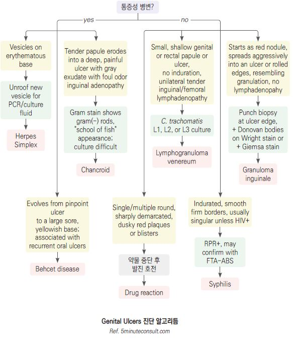
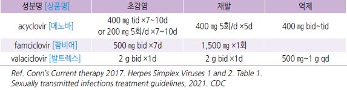
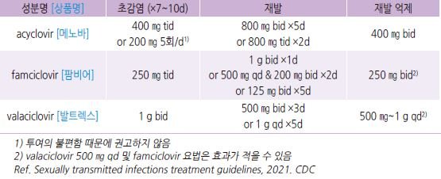
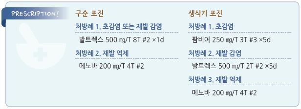
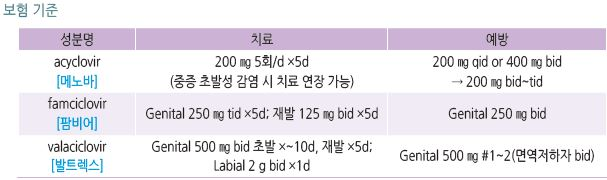

# 단순포진 Herpes Simplex

####


## 일반 사항

* Herpes simplex virus에 의한 입 주위 또는 항문생식기 부위의 특징적 수포성 병변
* 전염 경로 : 직간접 접촉; 침/구강 접촉, 성 접촉
*   전염력 : 초감염 시 강하고 재발 시 적음; 무증상 or 초감염 회복 후에도 전염력이 있음

    •많은 경우에 감염을 인지하지 못하거나 무증상 상태에서 다른 사람에게 전염을 일으킴

#### 초감염 (Primary infection)

* HSV-1 또는 -2에 대한 항체가 없는 환자에서 발생한 감염
* 기전 : 접촉을 통하여 피부나 점막에 침투/증식 → viral nucleocapsid가 신경을 타고 이동
* 대부분 무증상으로 흔히 인지하지 못하고 지나감

#### non-Primary infection

*   이미 한 type의 HSV에 대한 항체가 존재하는 환자에서 발생한 다른 type의 HSV 감염

    •예: 과거 구강안면 헤르페스 감염으로 HSV-1 항체를 가지고 있는 환자에서 새로이 발생한 HSV-2에 의한 생식기 감염
* 초감염보다 병소의 숫자 및 증상 정도가 가벼움(기존 HSV 항체가 다른 형태의 HSV 감염에도 영향을 미치기 때문으로 추정)

#### 재감염 (Recurrent infection)

* 이전의 감염 치유 후 재활성화된 HSV 감염
* 기전 : 초감염 후 HSV가 dorsal root ganglia에 잠복 → 유발 요인에 의해 재활성화
* 재활성의 빈도 및 중증도는 면역 저하, 스트레스 등 여러 인자와 관련
* 대부분의 초감염이 무증상이기 때문에 종종 환자는 재감염 또는 initial non-primary infection을 첫 감염이라고 생각함

## 원인

*   원인균 : Herpes simplex virus

    •HSV-1 : 입술, 구강, 얼굴, 눈 이환; 외음부 이환 가능; 주로 소아기에 초감염 발생

    •HSV-2 : 외음부 이환; 드물게 입술, 구강 이환; 주로 청년기에 감염 발생

### 감염 및 재발 위험 인자

*   면역 저하(화학요법, 악성 종양, HIV 감염, 당뇨병 등 만성 질환, 고령), 감염된 산모에서 질식 분만 출생한 신생아,

    기존 피부 질환(아토피 피부염), 직업적 노출(치과 의료인)
* 생식기 헤르페스 : 빈번한 성 생활/파트너 교체, 이른 성 생활(17세 이전에 시작), 여성
* 입술 헤르페스 재발 : 자외선 노출, 발열, 찰과상, 월경, 스트레스, 다른 질환(예: 다른 감염)
* 생식기 헤르페스 재발 : 발열, 스트레스, 외상

## 종류

### 구강-안면 헤르페스 감염 (Orofacial HSV; Herpes gingivostomatitis)

#### 초감염

* 보통 소아기에 발생
*   호발 부위 : palate, 볼 점막, 혀, 구강 바닥, 입술; 보통 한 곳에 무리지어 발생하지만 동떨어져서 발생할 수도 있음

    (autoinoculation)
* 잠복기 : 2\~12일
* 대부분 무증상이지만 증상이 발생하는 경우에는 갑자기 중증으로 나타남
* 증상 발생 시 대부분 gingivostomatitis(± perioral lesion)로 발생
*   사춘기에 발생하는 경우에는 인두염/편도염 증상이 보다 두드러질 수 있음 (Streptococcus 감염과 증상이 비슷하지만

    보다 오래 지속)
* 경과 : 10~~14일(1~~3주) 내 자연 치유; 림프절병증은 수 주 동안 지속될 수 있음
*   구강 증상 : 다발성 통증성 수포 → 빠르게 파열 → 궤양(수포 출현 수일 내 발생)

    •궤양 : 황회색 막으로 덮인 1\~3 ㎜ 크기의 얕은 통증성 궤양
* 구강 외 증상 : 발열(2\~7일간 지속), 두통, 근육통, 경부 림프절병증

#### 재감염

*   전구 증상 : ＞85%에서 발생

    •전신 증상 : 피로, 미열, 두통, 가려움, 저림, 피부 열감 → 수일 내 홍반성 수포 발생

    •잇몸 구내염 : 구강 작열감, 가려움 → 24시간 내 수포 발생

    •입술 : 통증, 작열감, 가려움 → 6\~48시간 내 수포 발생
*   입술 주위 병변 : 전형적으로 입술 가장자리에 발생(herpes labialis)

    •경과 : 전구 증상 → 수포 군집 → 48시간 내 미란, 궤양, 딱지 발생 → 수일\~2주 내 치유
* 구강 내 병변 : 구강 내 재발은 정상 면역자에서는 흔하지 않음
* 구강 외 증상 : 국소 adenopathy 외 다른 증상은 드묾
*   herpetic sycosis : 남자에서 수염 부위에 농포 형성(모낭염); 세균 감염으로 오인할 수 있으며 동일 부위에 재발하는 모낭염에

    대하여 herpes 감염 감별이 필요

### 생식기 헤르페스 감염 (Herpes genitalis)

#### 초감염

* 이환 부위 : vagina/vulva(여), penis/scrotum(남), anus, buttock, thigh
* 잠복기 : 4(2\~14)일
* 경과 : 2\~3주 내 회복
* 증상 정도 : 환자의 ⅔에서 무증상이나 증상이 발생하면 보통 심함
* 국소 피부/점막 증상 : 다발성 양측 수포, 농포, 미란, 궤양; 국소 통증, 가려움
* 기타 증상 : 발열, 두통, malaise, 근육통(67%), 배뇨통(63%), 압통성 서혜부 림프절병증(80%)

#### 재감염

* 유증상 초감염 환자의 거의 모든 경우에서 재발이 발생함
* 재발 기간 : 수 주\~수년(4년); 재발 빈도는 초감염의 중증도, serotype, 환자의 면역력과 관련됨
* 경과 : 10일 내 회복
* 증상 정도 : 환자의 ¼에서 무증상이며 증상이 발생하는 경우에도 초감염 증상보다는 약함
* 전구 증상 : 50%에서 발생; 엉덩이, 다리, 고관절의 따가움, 욱신거림
* 국소 증상 : 편측 수포, 궤양, 출혈
* 전신 증상 : 흔하지 않음

### 눈 헤르페스 감염 (Herpes ocularis)

* 이환 부위 : corneal epithelium(안검염, 결막염, 각막염)
* 빈도 : ＞5%
* 위험 인자 : 스트레스, 외상, 자외선, 다른 바이러스 감염, 안약(면역억제제, prostaglandin)
* 국소 증상 : 안구통, 두통, 눈부심, 눈물, 눈 충혈
* 경과 : 보통 편측에서 급성 발생, 2\~3주 지속
* 합병증 : 실명

## 진단

*   이환부의 수포 or 쑤시는 통증을 동반한 전형적인 형태로 진단하지만, 진단 시점에서 피부 병변 등 명확한 소견이 없는

    경우가 많아 임상적 진단이 어려움
*   성인에서의 일률적인 선별 검사는 권하지 않음; 증상이 없는 생식기 헤르페스도 전염 가능성이 있으나 검사의 정확도 및

    치료의 효율성을 고려하여 권하지 않음

### 검사

* 병변 viral culture, NAAT(PCR) : 증상 발생 후 2\~3일에 수포 바닥을 swab
* immunofluorescence staining : 건조된 병소 조직에서의 항체 검사
* serologic test : HSV-1과 HSV-2을 감별 못함
* Tzanck smear(cytologic detection) : 민감도 및 특이도 모두 낮음; HSV 종류들을 감별 못함
* genital HSV 환자는 HIV 검사를 받아야 함

### 재발성 헤르페스성 및 아프타 구내염 감별

```
(☞ p.264)


```



***

## Management

## 구강-안면 감염

#### 국소 항바이러스제

* 효과 : 재발 감염 시 유병 기간을 약간 단축시킴(\~10%); 첫 증상 발현 시 치료를 시작해야 효과적
* acyclovir 크림 : 5회/d ×5\~10d \[바이버]
* penciclovir 1% 크림 : 깨어 있는 동안 2시간마다 ×4d; ≥16세 허가 \[펜시비어]
* docosanol 크림 : 5회/d; ≥12세 허가 \[헤리페어]

#### 전신 항바이러스제

* 정상 면역자에서는 권고하지 않음 (보험주의)
*   바이러스 증식 기간인 수포 발생 전(전구기)에 투여해야 효과; 실제 전구기를 파악하기 어려우며 구진, 소포진, 궤양 등

    육안적 증상 발생 후에는 투여 효과가 확실하지 않음
* 신 기능 저하 환자에서 용량 조절 필요



* foscarnet : 다른 약제 내성 및 전신이 이환된 면역저하자에서 고려; 40 ㎎/㎏ IV q8h \[포스카비어주]

#### 기타

* 구강 병변의 통증에 대하여 자극적인 음식 섭취를 피함 (☞ p.1045)
* 가글 : diphenhydramine 12.5 ㎎/5 ㎖ 및 {액상 제산제 또는 bismuth subsalicylate} 1:1 혼합물
* 입술 보호제
* 2차 감염 시 항생제 도포 : bacitracin, mupirocin \[에스로반]

※ steroid는 바이러스의 전파를 촉진시키므로 사용하지 않음

## 생식기 감염

#### 전신 항바이러스제

* 효과 : 전염력/증상/유병 기간 단축(포진 기간 1\~2일 단축); 재발을 포함한 자연 경과를 바꾸지는 못함
* 증상 발현 72시간 내 투여(가능한 한 빨리; 24시간 이내 투여하면 보다 효과적)
*   경구 재발 억제 치료 : 투여 중 재발 빈도를 70\~80% 줄임

    •주기적(예: 1년에 한 번) 반복 치료를 시도할 수 있음

    •임신 중 재발 억제 : 임신 36주에 acyclovir 400 ㎎ tid or valacyclovir 500 ㎎ bid
* 중증, 다른 약제 내성 및 전신 이환의 면역저하자에서 IV 치료 또는 foscarnet, cidofovir 고려



※ 국소 항바이러스제는 임상적 이득이 미약하여 권고하지 않음

#### 대증 치료

* 식염수 목욕
* 국소 petroleum jelly \[바셀린]
* 진통제
* 국소 마취제 : lignocaine, prilocaine [엠라](../lidocaine%EB%B3%B5%ED%95%A9/)(비보험). benzocaine(자극 심함)

## 눈 감염

#### 국소 항바이러스제 (안약제)

* trifluridine or acyclovir 치료율 : 90%(2주 내)
* 항바이러스 안약제 부작용 : corneal epithelium 독성(특히 10\~14일 이상 지속 사용 시)
* trifluridine 1% : 재상피화 발생까지 1 drop q2hr, 최대 9 drops/d → 이후 1 drop q4hr ×7d \[오큐플리딘 점안액]
* acyclovir 연고 : 1 ㎝ q4hr (5회/d); 완치 후 3일째까지 안구 하부에 투여
* ganciclovir 0.15% : 재상피화 발생까지 1 drop q3h (5회/d) → 이후 1 drop q8hr ×7d \[버간 점안겔]

> ```
> (✽acyclovir 대비 동등 이상의 효과라는 보고가 있음)
> ```

* vidarabine 3% : 재상피화 발생까지 lower conjunctival sac에 0.5 inch q3hr (5회/d)

#### 경구 항바이러스제

* 국소제에 반응하지 않는 환자에서 고려
* acyclovir : 400 ㎎ 5회/d ×10d; 신 기능 저하 시 감량 \[메노바]

#### 기타

* 냉찜질
* 인공 눈물
* 경구 진통제
* 국소 steroid : 상태를 악화시킬 수 있으므로 중증 uveitis 외에는 고려하지 않음
* 렌즈 사용 중지

## 예방

* 활동성 병변이 있는 환자는 성 접촉 및 면역저하자/고령/신생아와의 접촉을 피함
* 손 위생 관리
* 세면도구/칫솔, 설거지를 하지 않은 컵 등 식기의 공동 사용을 피함
* 입술 헤르페스 재발이 많은 환자는 입술 및 입술 주위에 자외선 차단제 도포
* 성관계 시 콘돔 사용

> **질병코드** B00.1 헤르페스바이러스 소수포피부염

A60 항문생식기의 헤르페스바이러스\[단순헤르페스]감염

B00.5 헤르페스바이러스눈병




