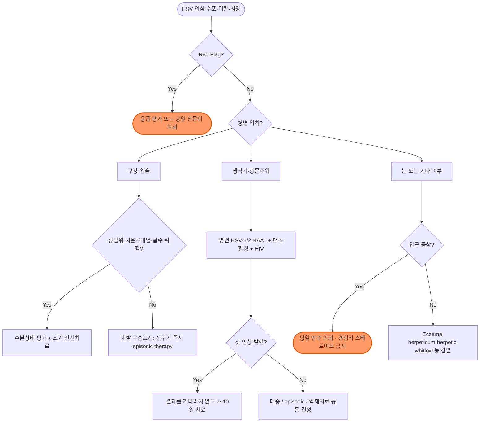

# 단순포진 Herpes Simplex

## <mark style="color:green;">일반 사항</mark>

* 단순포진바이러스(herpes simplex virus, HSV)는 피부·점막 감염 후 감각신경절에 잠복하며, 이후 재활성화되어 반복적인 수포·미란·궤양을 일으키는 만성 잠복 바이러스 감염
* HSV-1과 HSV-2 모두 구강·안면 및 항문생식기 감염을 일으킬 수 있음
  * HSV-1은 구강·안면 감염의 주된 원인이지만 생식기 헤르페스의 중요한 원인이기도 함(젊은 연령층에서 비중 증가)
  * HSV-2는 재발성 생식기 헤르페스의 주된 원인이며, 생식기 HSV-1보다 재발과 무증상 바이러스 배출이 흔함
* 전파 경로 : 감염된 피부·점막, 타액, 생식기 분비물과의 직접 접촉(키스, 구강성교, 성접촉 등)
* 활동성 병변이나 전구 증상이 있을 때 전파 위험이 가장 높지만, 병변이 없는 무증상 바이러스 배출 시에도 전파될 수 있음
* 항바이러스제는 증상과 바이러스 배출을 줄일 수 있으나 잠복 바이러스를 제거하거나 완치시키지는 못함

#### <mark style="color:$primary;">원발 감염 (Primary infection)</mark>

* 해당 HSV type에 대한 항체가 없는 환자에게 발생한 최초 감염
* 대부분 무증상 또는 경미하여 실제 감염 시점을 인지하지 못함

#### <mark style="color:$primary;">비원발성 첫 감염 (Non-primary first infection)</mark>

* 한 HSV type의 항체가 있는 환자에게 다른 HSV type의 감염이 새로 발생한 경우
  * 예 : 기존 HSV-1 항체가 있는 환자에게 새로 발생한 HSV-2 생식기 감염
* 기존 교차면역의 영향으로 원발 감염보다 증상이 가벼울 수 있음

#### <mark style="color:$primary;">첫 임상 발현 (First clinical episode)</mark>

* 환자가 처음 인지하거나 의료진이 처음 진단한 임상 episode
* 원발 감염, 비원발성 첫 감염 또는 과거 무증상 감염의 첫 인지 재발을 모두 포함할 수 있으므로 `첫 임상 발현 = 최근 감염`으로 단정하지 않음

#### <mark style="color:$primary;">재발·재활성화 (Recurrent infection/reactivation)</mark>

* 감각신경절에 잠복한 HSV가 재활성화되어 발생
* 재발 빈도와 무증상 바이러스 배출은 생식기 HSV-2에서 HSV-1보다 흔함

## <mark style="color:green;">원인 및 위험 인자</mark>

* 중증·비전형 감염 위험 : HIV 감염, 장기이식, 항암치료, 면역억제제 사용, 기타 중증 면역저하
* Eczema herpeticum 위험 : 아토피피부염 등 피부장벽이 손상된 광범위 피부질환
* 신생아 HSV 위험 : 분만 시 산모의 생식기 병변·전구 증상, 특히 임신 후반기에 새로 획득한 생식기 HSV
* 구순포진 재발 유발 요인 : 자외선, 발열성 질환, 국소 외상·시술, 월경, 스트레스 등
* 생식기 헤르페스 재발 유발 요인 : 발열성 질환, 스트레스, 마찰·외상 등

## <mark style="color:green;">임상 양상</mark>

### <mark style="color:orange;">구강·안면 헤르페스</mark>

#### <mark style="color:$primary;">원발성 헤르페스 치은구내염</mark>

* 주로 소아와 젊은 성인에서 발생하며 잠복기는 대개 2\~12일
* 발열, 권태감, 경부 림프절병증과 함께 잇몸·입술·혀·볼점막·구개 등 여러 부위에 통증성 수포와 궤양이 발생
* 수포는 빠르게 파열되어 황회색 위막으로 덮인 얕은 궤양으로 보일 수 있음
* 대개 10\~14일(때로 1\~3주) 이내 회복하지만, 소아에서는 통증과 섭취 부족으로 탈수가 발생할 수 있음
* 청소년·성인에서는 인두염·편도염 양상이 두드러질 수 있음

#### <mark style="color:$primary;">재발성 구순포진 (Herpes labialis)</mark>

* 입술 가장자리(vermilion border)에 가장 흔함
* 작열감·가려움·저림·통증 등의 전구 증상 후 군집성 수포 → 미란·궤양·딱지 순으로 진행
* 대개 수일\~2주 이내 자연 치유
* 정상 면역자의 재발성 구강 내 HSV는 흔하지 않으며, 주로 경구개·부착치은 등 각화점막에 발생
* 동일 수염 부위에 반복되는 단형성 수포·농포성 모낭염에서는 herpetic sycosis를 감별

### <mark style="color:orange;">생식기 헤르페스</mark>

#### <mark style="color:$primary;">첫 임상 발현</mark>

* 외음부·질·자궁경부, 음경·음낭, 요도, 항문·항문주위, 둔부 및 대퇴 등에 발생 가능
* 전형적으로 통증성 군집 수포, 농포, 미란 또는 궤양으로 나타나지만 병변이 없거나 균열·찰과상·홍반 등 비전형적 형태일 수 있음
* 발열, 권태감, 근육통, 배뇨통, 압통성 서혜부 림프절병증, 신경근통이 동반될 수 있음
* 치료하지 않으면 2\~3주 이상 지속하거나 새 병변이 연속적으로 발생할 수 있음

#### <mark style="color:$primary;">재발성 생식기 헤르페스</mark>

* 첫 발현보다 병변 수와 전신 증상이 적고 회복이 빠른 경우가 많음
* 병변 전 엉덩이·대퇴·회음부의 저림, 작열감 또는 신경통이 선행할 수 있음
* 유증상 첫 발현 HSV-2 환자에서는 재발이 흔하지만, 생식기 HSV-1은 재발과 바이러스 배출이 상대적으로 적음

### <mark style="color:orange;">안구 헤르페스</mark>

* 안검염, 결막염, 상피각막염, 기질각막염, 내피염 또는 포도막염으로 나타날 수 있음
* 상피각막염에서는 형광염색 시 가지 모양의 수지상 각막궤양(dendritic corneal ulcer)이 관찰될 수 있음
* 대개 편측 안구통, 충혈, 눈물, 이물감, 눈부심 또는 시력저하를 호소
* 재발성 각막염은 각막혼탁과 영구적 시력손상을 일으킬 수 있으므로 의심 즉시 당일 안과 평가가 원칙

### <mark style="color:orange;">기타 임상형</mark>

* Herpetic whitlow : 손가락 말단의 통증성 수포·농포; 세균성 화농성 손발톱주위염과 혼동하기 쉬우나 **절개·배농하지 않음**
* Eczema herpeticum : 아토피피부염 등 기존 피부질환 부위에 갑자기 확산하는 단형성 천공성 수포·미란; 발열 동반 시 파종성 감염 의심
* HSV 뇌염·수막염 : 성인 산발성 뇌염의 주요 원인; 발열·의식 변화·국소 신경학적 징후
* 신생아 HSV : 피부·눈·구강형, 중추신경계형, 파종형으로 분류되며 조기 인지가 예후를 좌우
* 면역저하자의 만성·비전형적 궤양 : 전형적 수포 없이 지속되는 궤양성 병변으로 나타날 수 있음

***

### <mark style="color:$danger;">🚩 Red Flags!</mark>

<mark style="color:$danger;">**즉각 응급 평가 또는 입원 치료**</mark>

* 의식 변화, 성격 변화, 경련, 국소 신경학적 결손, 심한 두통·경부강직 → HSV 뇌염·수막염 의심
* 쇼크, 파종성 수포, 급격한 전신 악화, 중증 간염·폐렴 → 파종성 HSV 의심
* 신생아의 수포·발열·저체온·수유 저하·처짐 또는 경련 → 병변이 없어도 신생아 HSV 배제 필요
* 광범위 eczema herpeticum에 전신독성, 안면·안구 침범 또는 급속한 진행이 동반된 경우

<mark style="color:$warning;">**당일 평가 또는 조기 전문의 의뢰**</mark>

* 안구통, 눈부심, 시력저하, 편측 충혈 또는 각막병변 의심 → 당일 안과 의뢰
* 중증 면역저하자의 광범위·괴사성·비전형적 또는 지속성 병변
* 심한 생식기 통증, 배뇨곤란·요폐, 탈수 또는 경구약 복용 불가
* 임신 후반기에 처음 발생한 생식기 HSV, 또는 분만 시점의 생식기 병변·전구 증상 → 산과와 즉시 협진
* 항바이러스 치료 중에도 병변이 지속·진행하거나 반복되어 내성 HSV가 의심되는 경우

<mark style="color:$info;">**외래 치료 후 추적 / 재평가**</mark> <mark style="color:$info;">- 즉각 위험 낮으나 호전 없으면 의뢰</mark>

* 첫 임상 발현 생식기 헤르페스 : 검사 결과를 기다리지 말고 즉시 치료하고 병변 치유까지 추적
* 잦은 재발, 삶의 질 저하, 전파 불안 또는 임신 계획이 있는 환자 → 억제치료·파트너 상담 평가
* 2\~3주 이상 낫지 않는 구강·생식기 궤양 또는 비전형 병변 → 다른 감염, 염증성 질환 및 악성종양 재평가

***

## <mark style="color:green;">진단</mark>

* 전형적인 군집 수포와 통증성 미란·궤양은 HSV를 시사하지만, 임상 소견만으로 생식기 헤르페스를 확진하지 않음
* 생식기·항문·항문주위 궤양은 HSV와 매독의 중복감염이 가능하므로 통증 유무나 외형만으로 양자를 구분하지 않음
* 무증상 성인과 임신부에 대한 일률적인 HSV-2 혈청 선별검사는 권고하지 않음

### <mark style="color:orange;">병변 검사</mark>

* 활동성 수포·미란·궤양이 있으면 기다리지 말고 병변 바닥에서 즉시 HSV-1/2 NAAT(PCR)를 채취
  * 온전한 수포는 개방한 뒤 병변 바닥을 충분히 문질러 채취
* NAAT가 가장 민감한 검사이며, 검출된 HSV는 HSV-1/2로 typing하여 예후와 상담에 활용
* 바이러스 배양은 NAAT를 사용할 수 없거나 항바이러스제 내성 검사가 필요한 경우 고려
  * 배양 민감도는 재발 병변과 치유 중인 병변에서 빠르게 감소
* NAAT 또는 배양 음성만으로 HSV를 배제하지 않음 : 오래된 병변, 부적절한 검체 또는 간헐적 바이러스 배출로 위음성 가능
* 병변이 없는 상태에서의 무작위(blind) 생식기 swab은 민감도가 낮아 진단 목적으로 시행하지 않음
* Tzanck smear와 직접면역형광검사는 민감도가 낮아 일상적 진단검사로 권고하지 않음

### <mark style="color:orange;">혈청검사</mark>

* 비형특이적 HSV 항체검사는 HSV-1과 HSV-2를 구분하지 못하므로 진단에 사용하지 않음
* 필요한 경우 gG 기반 type-specific HSV-1/2 IgG를 선택
  * 최근 감염이 의심되나 초기 음성이면 추정 노출 약 12주 후 재검 고려
  * 낮은 HSV-2 EIA index 양성은 위양성 가능성이 있어 가능한 경우 다른 검사법으로 확인
* HSV IgM은 형 특이적이지 않고 원발감염과 재발을 구분하지 못하며 재발 때도 양성일 수 있음. 임상적 의미가 제한적이므로 HSV 진단에 사용하지 않음
* HSV-1 IgG 양성만으로 구강 감염과 생식기 감염의 위치를 구분할 수 없음
* Type-specific HSV-2 IgG 고려 상황 : 반복되는 비전형적 생식기 증상이나 병변 PCR 음성, 검사 없이 임상 진단된 과거력, 성 파트너의 생식기 HSV

### <mark style="color:orange;">생식기·항문주위 궤양의 동반 검사</mark>

* 병변 HSV-1/2 NAAT와 함께 매독 혈청검사 및 HIV 검사를 시행
* 노출력과 증상에 따라 임질·클라미디아 등 다른 성매개감염 검사 고려
* 매독 검사의 전통적·역순 알고리듬과 결과 해석은 매독 관련 챕터 참조
* 첫 임상 발현 HSV가 의심되면 검체를 채취한 뒤 검사 결과를 기다리지 않고 경험적 항바이러스 치료 시작

### <mark style="color:orange;">재발성 헤르페스성 구내염과 아프타성 구내염 감별</mark>

(☞ [구내염](../222_/054_-stomatitis.md))

<table><thead><tr><th width="110">구분</th><th width="230">재발성 아프타성 구내염</th><th>재발성 구강 헤르페스</th></tr></thead><tbody><tr><td>초기 병소</td><td>수포 없이 궤양으로 시작</td><td>소수포가 빠르게 파열되어 궤양 형성</td></tr><tr><td>호발 위치</td><td>볼·입술 안쪽, 구강바닥, 연구개, 구강전정 등 비각화·가동점막</td><td>경구개, 부착치은, 입술 가장자리 등 각화점막</td></tr><tr><td>병변 양상</td><td>경계가 뚜렷한 원형 궤양과 홍반성 테두리</td><td>군집성·점상 얕은 궤양</td></tr><tr><td>전구 증상</td><td>뚜렷하지 않은 경우가 많음</td><td>작열감·저림·가려움이 선행할 수 있음</td></tr><tr><td>통상 경과</td><td>대개 1\~2주</td><td>대개 수일\~2주</td></tr></tbody></table>

***


```mermaid
flowchart TD
    A(["HSV 의심 수포·미란·궤양"]) --> B{"Red Flag?"}
    B -->|Yes| C(["응급 평가 또는 당일 전문의 의뢰"])
    B -->|No| D{"병변 위치?"}
    D --> E["구강·입술"]
    D --> F["생식기·항문주위"]
    D --> G["눈 또는 기타 피부"]
    E --> H{"광범위 치은구내염·탈수 위험?"}
    H -->|Yes| I["수분상태 평가 ± 조기 전신치료"]
    H -->|No| J["재발 구순포진: 전구기 즉시 episodic therapy"]
    F --> K["병변 HSV-1/2 NAAT + 매독혈청 + HIV"]
    K --> L{"첫 임상 발현?"}
    L -->|Yes| M["결과를 기다리지 않고 7~10일 치료"]
    L -->|No| N["대증 / episodic / 억제치료 공동 결정"]
    G --> O{"안구 증상?"}
    O -->|Yes| P(["당일 안과 의뢰 · 경험적 스테로이드 금지"])
    O -->|No| Q["Eczema herpeticum·herpetic whitlow 등 감별"]
    style C fill:#f96,stroke:#e65100,stroke-width:2px
    style P fill:#f96,stroke:#e65100,stroke-width:2px
```

<p align="center"><strong>단순포진 의심 병변의 초진-검사-치료 알고리듬</strong></p>

<p align="center"><em><mark style="color:$info;">Ref. CDC STI Treatment Guidelines (2021); CDC Genital, Anal, or Perianal Ulcers Guideline (2021)</mark></em></p>

***

## <mark style="background-color:$warning;">Management</mark>


**부위별 우선순위**\
구강·안면은 탈수·경구섭취 여부, 생식기는 "첫 임상 발현인가 재발인가", 안구는 "당일 안과 의뢰가 필요한가"를 가장 먼저 판단한다.


## <mark style="color:green;">비-약물 치료 및 예방</mark>

### <mark style="color:orange;">구강·안면 감염 — 대증 치료</mark>

* 충분한 수분 섭취, 부드럽고 자극이 적은 음식, 입술 보호제
* 소아에서는 통증으로 인한 섭취량·소변량을 확인하고 탈수 위험을 재평가
* 세균성 2차 감염이 임상적으로 확인된 경우에만 국소 또는 전신 항생제 고려
* 구순포진 재발이 자외선으로 반복 유발되는 경우 입술과 입술 주변에 자외선차단제 사용 고려

### <mark style="color:orange;">생식기 감염 — 대증 치료</mark>

* 생리식염수 좌욕 또는 세척, petroleum jelly, 경구 진통제
* 심한 배뇨통은 물 또는 생리식염수에 외음부를 담근 상태에서 배뇨하면 완화될 수 있음
* Lidocaine gel·ointment는 제한적으로 고려할 수 있으나 benzocaine은 감작 위험이 커 피함
* 생식기 HSV에 국소 항바이러스제는 임상적 이득이 적어 권고하지 않음

### <mark style="color:orange;">안구 감염</mark>

* 콘택트렌즈 사용을 즉시 중단
* 국소 마취 안약은 외래 자가사용 목적으로 처방하지 않음(각막 독성·통증 감각 소실로 인한 손상 위험)

### <mark style="color:orange;">전파 예방·상담</mark>

* 병변이나 전구 증상이 있는 동안 키스, 구강성교 및 성접촉을 피함
* 병변 접촉 후 손 위생을 시행하고 눈·콘택트렌즈를 만지지 않음
* 콘돔은 전파 위험을 줄이지만 완전히 제거하지는 못함
* 증상이 없는 시기에도 바이러스가 배출되어 전파될 수 있음을 설명
* 증상이 있는 HSV-2 감염자와 감염되지 않은 이성 파트너 사이에서 감염자의 valacyclovir 500 ㎎ qd 억제치료는 전파 위험 감소에 도움이 될 수 있음
* 현재 성 파트너에게 알리고, 무증상 파트너에게는 병력 확인과 type-specific HSV-2 IgG 검사를 고려
* 비감염 파트너에게 항바이러스제 PEP 또는 PrEP를 투여하지 않음
* 신생아, 중증 면역저하자 및 광범위 아토피피부염 환자는 활동성 구순포진 병변과 직접 접촉하지 않도록 함

## <mark style="color:green;">약물 치료</mark>

### <mark style="color:orange;">구강·안면 감염 — 국소 항바이러스제 (재발성 구순포진)</mark>

* 임상적 이득은 제한적이며 전구기 또는 병변 초기부터 사용해야 함
* acyclovir 5% cream : 5회/d ×5\~10일 <mark style="color:blue;">\[바이버]</mark>
* penciclovir 1% cream : 16세 이상, 깨어 있는 동안 q2h ×4일 <mark style="color:blue;">\[펜시비어]</mark>
* docosanol 10% cream : 성인 및 12세 이상에서 5회/d(미국 일반의약품 허가 기준, 국내 제품 미확인)

### <mark style="color:orange;">구강·안면 감염 — 경구 항바이러스제</mark>

<table><thead><tr><th width="200">임상 상황</th><th width="230">예시 요법</th><th>비고</th></tr></thead><tbody><tr><td>중증 원발성 치은구내염</td><td>acyclovir 400 ㎎ tid 또는 200 ㎎ 5회/d ×7\~10일</td><td>가급적 증상 초기에 고려. 소아는 연령·체중별 용량과 탈수 여부 평가</td></tr><tr><td rowspan="3">재발성 구순포진 episodic therapy</td><td>valacyclovir 2 g bid ×1일</td><td rowspan="3">전구기 또는 최초 증상부터 즉시 시작</td></tr><tr><td>famciclovir 1,500 ㎎ 1회</td></tr><tr><td>acyclovir 400 ㎎ 5회/d ×5일</td></tr><tr><td>빈번하거나 중증인 재발의 억제치료</td><td>acyclovir 400 ㎎ bid 또는 valacyclovir 500 ㎎\~1 g qd</td><td>근거·허가 범위와 환자 선호를 확인하고 주기적으로 필요성 재평가</td></tr></tbody></table>


valacyclovir 2 g bid ×1일과 famciclovir 1,500 ㎎ 1회 요법은 **재발성 구순포진**의 episodic therapy이며, 원발성 헤르페스 치은구내염 용법이 아니다.


### <mark style="color:orange;">생식기 헤르페스 — 첫 임상 발현 (모든 환자 치료)</mark>

* 검사 결과를 기다리지 않고 임상적으로 의심되는 즉시 치료
* 발병 5일 이내에 내원했거나 계속 새 병변이 생기면 특히 적극적으로 치료
* 10일 후에도 치유가 불완전하면 치료 기간 연장 가능

<table><thead><tr><th width="170">성분명 [상품명]</th><th>CDC 2021 권장 요법</th></tr></thead><tbody><tr><td>acyclovir <mark style="color:blue;">\[메노바]</mark></td><td>400 ㎎ tid ×7\~10일 또는 200 ㎎ 5회/d ×7\~10일</td></tr><tr><td>famciclovir <mark style="color:blue;">\[팜비어]</mark></td><td>250 ㎎ tid ×7\~10일</td></tr><tr><td>valaciclovir <mark style="color:blue;">\[발트렉스]</mark></td><td>1 g bid ×7\~10일</td></tr></tbody></table>

### <mark style="color:orange;">생식기 헤르페스 — 재발성 HSV-2 episodic therapy</mark>

* 전구기 또는 병변 발생 24시간 이내 환자가 즉시 시작할 수 있도록 미리 처방하거나 약을 준비하도록 교육

<table><thead><tr><th width="170">성분명 [상품명]</th><th>CDC 2021 권장 요법</th></tr></thead><tbody><tr><td>acyclovir <mark style="color:blue;">\[메노바]</mark></td><td>800 ㎎ bid ×5일 또는 800 ㎎ tid ×2일</td></tr><tr><td rowspan="3">famciclovir <mark style="color:blue;">\[팜비어]</mark></td><td>1 g bid ×1일</td></tr><tr><td>500 ㎎ 1회 → 250 ㎎ bid ×2일</td></tr><tr><td>125 ㎎ bid ×5일</td></tr><tr><td rowspan="2">valaciclovir <mark style="color:blue;">\[발트렉스]</mark></td><td>500 ㎎ bid ×3일</td></tr><tr><td>1 g qd ×5일</td></tr></tbody></table>

### <mark style="color:orange;">생식기 헤르페스 — 재발 억제치료</mark>

* 재발 빈도·중증도, 삶의 질, 성생활, 전파 불안과 환자 선호를 바탕으로 공동 결정
* 빈번한 재발에서 재발 횟수를 약 70\~80% 감소시킴
* 생식기 HSV-1은 재발과 바이러스 배출이 적으므로 빈번한 재발 또는 상당한 심리적 고통이 있을 때 제한적으로 고려
* 지속 여부를 매년 환자와 재평가하되, 일률적인 휴약이나 정기 검사실 모니터링은 필요하지 않음

<table><thead><tr><th width="170">성분명 [상품명]</th><th width="150">CDC 2021 권장 요법</th><th>주의</th></tr></thead><tbody><tr><td>acyclovir <mark style="color:blue;">\[메노바]</mark></td><td>400 ㎎ bid</td><td></td></tr><tr><td>famciclovir <mark style="color:blue;">\[팜비어]</mark></td><td>250 ㎎ bid</td><td>바이러스 배출 억제는 다소 덜 효과적일 수 있음</td></tr><tr><td rowspan="2">valaciclovir <mark style="color:blue;">\[발트렉스]</mark></td><td>500 ㎎ qd</td><td>연간 재발 ≥10회에서는 덜 효과적일 수 있음</td></tr><tr><td>1 g qd</td><td></td></tr></tbody></table>


**신장 기능 저하 환자**\
Acyclovir·valacyclovir·famciclovir는 신장으로 배설되므로 신기능 저하 시 용량 또는 투여 간격을 조절한다. 조절 기준은 약제·적응증·요법별로 다르므로 제품별 허가사항의 CrCl 기준을 확인한다. 고령자·탈수 환자는 약물 축적에 따른 신독성과 의식 변화·환각·떨림 등의 신경독성 위험이 증가한다.


### <mark style="color:orange;">중증·파종성·CNS 감염</mark>

* 파종성 감염, 폐렴, 간염, 수막염·뇌염 또는 경구약 복용이 불가능한 중증 환자는 입원 후 IV acyclovir 5\~10 ㎎/㎏ q8h를 투여하며 신기능에 따라 감량
* HSV-2 수막염은 뇌염보다 대체로 예후가 양호하며, 임상 호전 후 valacyclovir 1 g tid로 전환하여 총 10\~14일 치료 가능
* HSV 뇌염은 IV acyclovir 10 ㎎/㎏ q8h로 14\~21일 치료하며 신기능에 따라 감량하고 신경과·감염내과 협진
* 적절한 치료에도 병변이 지속·진행하면 먼저 순응도, 신기능에 맞는 용량, 대체 진단을 재평가한다. 특히 면역저하자에서는 acyclovir 내성을 고려하여 바이러스 배양과 감수성검사를 시행하고 감염내과와 협진
  * acyclovir 내성주는 valacyclovir에도 내성이며 대부분 famciclovir에도 내성
  * foscarnet과 cidofovir는 신독성이 크므로 전문의 감독과 집중 모니터링하에 사용


**주목할 최신 동향 (2026년 8월 기준, 국내 미도입)**\
Pritelivir(helicase-primase inhibitor)는 acyclovir 내성을 포함한 면역저하자의 난치성 HSV 감염을 대상으로 한 3상 임상시험(PRIOH-1)에서 연구자 선택 치료보다 완전 병변 치유 효과가 우수했다. 2026년 1분기 미국 FDA에 신약허가신청서(NDA)가 제출되어 우선심사 대상으로 지정되었고, PDUFA 목표 시점은 2026년 4분기이다. 2026년 8월 현재 미국과 국내에서 허가되지 않았다. 같은 계열의 amenamevir는 일본에서 2017년 대상포진, 2023년 재발성 단순포진의 환자 주도 치료(초기 증상 후 6시간 이내 식후 1,200 ㎎ 1회)로 허가되었으나 국내에는 도입되지 않았다.


### <mark style="color:orange;">임신</mark>

* 임신 중 생식기 HSV 병력과 새 병변을 산과 의료진에게 알림
* 분만에 가까운 시기에 새로 획득한 생식기 HSV는 신생아 전파 위험이 약 30\~50%로 높으므로 모체태아의학·감염 전문의와 협진. 재발성 감염 또는 임신 전반기에 획득한 감염에서는 위험이 1% 미만
* 재발성 생식기 헤르페스의 임신 36주 이후 억제치료 : acyclovir 400 ㎎ tid 또는 valacyclovir 500 ㎎ bid
* 분만 진통 시 활동성 생식기 병변 또는 전구 증상이 있으면 제왕절개를 권고하되, 제왕절개도 신생아 전파 위험을 완전히 제거하지는 못함

### <mark style="color:orange;">안구 감염</mark>


**안구통·눈부심·시력저하·편측 충혈 또는 각막 HSV가 의심되면 당일 안과 의뢰한다.**\
일차의료에서 경험적으로 국소 스테로이드를 시작하지 않는다.


* 활동성 상피각막염 : 국소 또는 경구 항바이러스제 단독 치료가 기본이며 국소 스테로이드는 금기
* 기질각막염·내피염·포도막염 : 안과 전문의 감독하에 항바이러스제를 병용하면서 국소 스테로이드를 사용할 수 있음
* 구체적인 점안제 선택·용량·치료기간은 병변 층과 범위에 따라 달라지므로 안과 진찰 후 결정

***

### <mark style="color:red;">질병코드 (KCD)</mark>

B00.0 헤르페스습진

B00.1 헤르페스바이러스 소수포피부염

B00.2 헤르페스바이러스 치은구내염 및 인두편도염

B00.3 헤르페스바이러스 수막염

B00.4 헤르페스바이러스 뇌염

B00.5 헤르페스바이러스 눈병

B00.7 파종성 헤르페스바이러스병

B00.8 기타 형태의 헤르페스바이러스감염

B00.9 상세불명의 헤르페스바이러스 감염

A60.0 생식기 및 비뇨생식관의 헤르페스바이러스 감염

A60.1 항문주위 피부 및 직장의 헤르페스바이러스 감염

A60.9 상세불명의 항문생식기 헤르페스바이러스 감염

***

## <mark style="color:purple;">처방례</mark>

> **처방례 1. 재발성 구순포진 — 전구기 또는 최초 증상 시**
>
> ```
> 발트렉스정 500 ㎎ 8T #2 ×1일
> ※ 1회 4정, 12시간 간격으로 총 2회 복용
> ※ 전구 증상(따끔거림·가려움) 인지 즉시 복용해야 효과적
> ```

> **처방례 2. 첫 임상 발현 생식기 헤르페스**
>
> ```
> 팜비어정 250 ㎎ 21T #3 ×7일
> ※ 1회 1정, 1일 3회 복용
> ※ 검사 결과를 기다리지 않고 임상 의심 시 즉시 시작
> ```
>
> _✽CDC 2021 국제 지침 기준 예시. 국내 허가 용법은 아래 표를 참조하고, 건강보험 급여 인정기준은 별도로 확인_

> **처방례 3. 재발성 생식기 헤르페스 episodic therapy**
>
> ```
> 발트렉스정 500 ㎎ 6T #2 ×3일
> ※ 1회 1정, 1일 2회 복용
> ※ 전구기 또는 병변 발생 24시간 이내 자가 복용 시작이 가장 효과적
> ```

> **처방례 4. 재발성 생식기 HSV-2 억제치료**
>
> ```
> 메노바정 200 ㎎ 120T #2 ×30일
> ※ 1회 2정, 1일 2회 복용
> ※ 처방 지속 여부는 매년 재평가
> ```


위 처방례 2\~4는 국제 지침(CDC 2021) 기반 예시이다. 국내 제품 허가사항과 건강보험 인정 용량·기간은 국제 지침과 다를 수 있으므로 처방·청구 전 최신 허가사항과 심사기준을 확인한다.


### <mark style="color:orange;">국내 허가 용법과 국제 지침의 차이</mark>

<table><thead><tr><th width="110">성분명</th><th width="230">국내 허가 용법</th><th>국제 지침(CDC 2021)과 대조 시 주의</th></tr></thead><tbody><tr><td>acyclovir</td><td>치료 200 ㎎ 5회/d ×5일, 중증 초발 감염은 연장 가능<br>억제 200 ㎎ qid 또는 400 ㎎ bid</td><td>CDC 첫 임상 발현 요법은 400 ㎎ tid ×7\~10일을 우선 제시</td></tr><tr><td>famciclovir</td><td>생식기 첫 발현 250 ㎎ tid ×5일<br>재발 125 ㎎ bid ×5일<br>억제 250 ㎎ bid</td><td>CDC 첫 임상 발현 기간은 7\~10일. 처방 목적에 따라 국내 허가 용법과 구분 표기</td></tr><tr><td>valaciclovir</td><td>생식기 첫 발현 500 ㎎ bid, 최대 10일<br>재발 500 ㎎ bid ×5일<br>구순포진 2 g bid ×1일<br>생식기 억제 500 ㎎ qd\~bid</td><td>CDC 첫 임상 발현은 1 g bid ×7\~10일, 재발은 500 ㎎ bid ×3일 또는 1 g qd ×5일</td></tr></tbody></table>


**국내 허가 용법과 건강보험 급여 인정기준은 동일한 개념이 아니다.** 처방·청구 전 식품의약품안전처의 제품별 최신 허가사항과 건강보험심사평가원의 급여기준을 각각 확인한다.


***

### <mark style="color:$success;">핵심 복약 지도</mark>

> **재발 치료약은 전구 증상 즉시 복용**
>
> * 구순포진·생식기 헤르페스 재발 치료제는 따끔거림·가려움 등 전구 증상이나 병변을 처음 느낀 즉시 복용해야 효과가 가장 좋습니다.
> * 정해진 1회량과 복용 횟수를 임의로 줄이지 마십시오. 구순포진 valacyclovir 2 g bid ×1일 요법은 500 ㎎ 정을 1회 4정씩, 12시간 간격으로 총 2회 복용합니다.

> **신기능에 따른 용량 조절**
>
> * acyclovir·valacyclovir·famciclovir는 신기능과 적응증에 따라 1회량 감량 또는 투여 간격 조절이 필요할 수 있습니다.
> * 고령자, 신장애 또는 탈수 환자에서는 신독성·신경독성 위험이 증가하므로 신기능에 맞게 용량을 조절하고 충분한 수분 섭취를 안내합니다.
> * 새로 발생한 의식 변화·환각·떨림 또는 소변량 감소는 약물 독성의 징후일 수 있으므로 즉시 재평가합니다.

> **억제치료 중에도 전파 가능**
>
> * 억제치료 중에도 무증상 바이러스 배출로 인한 전파 가능성이 완전히 없어지지 않으므로 병변·전구기 성접촉 회피와 콘돔 사용을 병행합니다.

> **언제 다시 병원을 방문해야 하나요?**
>
> * 적절한 용량으로 치료했는데도 치료 완료 후 병변이 치유되지 않거나 진행하는 경우 — 순응도·신기능별 용량·대체 진단을 재평가하고, 특히 면역저하자에서는 내성을 고려
> * 안구통·눈부심·시력저하가 새로 생긴 경우 — 즉시 안과 진료
> * 심한 두통, 의식 변화, 경부강직이 동반되는 경우 — 즉시 응급 평가
> * 임신 중 새로운 생식기 병변이 발생한 경우 — 즉시 산과 협진

***

### <mark style="color:blue;">환자 안내서</mark>


**단순포진, 재발할 수 있지만 조절할 수 있습니다**

단순포진은 매우 흔한 바이러스 감염이며, 한 번 감염되면 몸속 신경에 바이러스가 남아 있다가 컨디션이 떨어지거나 스트레스를 받을 때 다시 증상을 일으킬 수 있습니다. 약으로 바이러스를 완전히 없앨 수는 없지만, 재발 증상과 전염 위험은 충분히 줄일 수 있습니다.


#### <mark style="color:$primary;">왜 자꾸 재발하나요?</mark>

* 처음 감염된 이후 바이러스는 몸의 신경 속에 조용히 숨어 있습니다.
* 피로, 스트레스, 감기·발열, 자외선, 월경, 마찰 등으로 몸의 저항력이 떨어지면 바이러스가 다시 활동해 병변이 생깁니다.

#### <mark style="color:$primary;">일상생활에서 어떻게 관리하나요?</mark>

* **따끔거림이나 가려움이 느껴지면 바로 병원에 연락하거나 처방받은 약을 시작하십시오.** 물집이 생기기 전에 시작할수록 효과가 좋습니다.
* **입술이나 생식기에 물집·상처가 있는 동안에는 키스, 구강성교, 성접촉을 피하십시오.** 물집이 없을 때도 바이러스가 나올 수 있어 완전히 안전하지는 않지만, 병변이 있을 때 전염 위험이 가장 높습니다.
* **손을 자주 씻고, 병변을 만진 손으로 눈을 만지지 마십시오.** 눈에 옮으면 시력에 영향을 줄 수 있습니다.
* **재발이 잦다면 자외선 차단제, 충분한 수면, 스트레스 관리가 재발을 줄이는 데 도움이 될 수 있습니다.**

#### <mark style="color:$primary;">약은 어떻게 써야 하나요?</mark>

* 처방받은 용량과 기간을 끝까지 지켜서 복용하십시오. 중간에 좋아졌다고 임의로 중단하면 효과가 떨어질 수 있습니다.
* 재발이 잦은 경우 매일 복용하는 예방(억제) 요법을 의사와 상의할 수 있습니다.

#### <mark style="color:$primary;">이럴 때는 즉시 병원을 방문하세요</mark>

* 눈이 아프거나 빛을 보기 어렵고 시야가 흐려지면 **당일** 진료를 받으십시오.
* 심한 두통, 의식이 흐려짐, 소변을 보지 못함, 빠르게 퍼지는 물집이 있으면 즉시 병원에 알리십시오.
* 임신 중이거나 임신을 계획한다면 생식기 헤르페스 병력을 반드시 산과 의료진에게 알려야 합니다.
* 신생아가 물집, 발열, 축 처짐, 잘 먹지 않는 증상을 보이면 즉시 응급 진료를 받으십시오.
