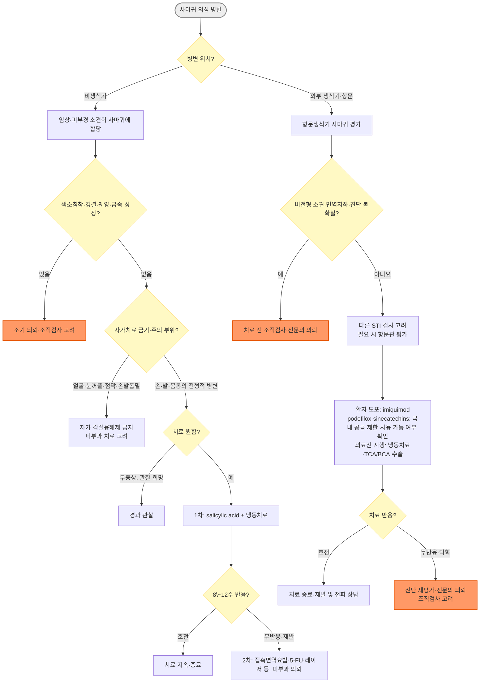

# 사마귀 Wart, Verruca

## <mark style="color:green;">일반 사항</mark>

* 전파 : 피부 직접 접촉 또는 오염된 물건을 통한 간접 접촉; 긁기·면도·손톱 물어뜯기 등에 의한 자가접종(autoinoculation) 가능
* 호발 : 소아·청소년과 젊은 성인
* 증상 : 대개 무증상의 과각화성 구진 또는 결절
  * 발바닥 사마귀 : 체중부하 시 통증
  * 손발톱주위 사마귀 : 갈라짐, 압통, 조갑변형
  * 항문생식기 사마귀 : 가려움, 불편감 또는 출혈 가능
* 경과
  * 자연 소실되거나 수년간 지속할 수 있으며 치료 후에도 재발할 수 있음
  * 소아에서는 약 절반이 1년 이내, 약 2/3가 2년 이내 자연 소실된다는 자료가 있으나 연구와 병변 위치에 따라 차이가 큼
  * 성인에서는 소아보다 자연 소실이 느린 경향이 있으나 정확한 소실률 자료는 제한적이며, 면역저하자·오래된 병변·발바닥 및 손발톱주위 병변은 치료 저항성이 높음
  * 치료는 눈에 보이는 병변 제거와 증상 완화를 목표로 하며 HPV를 완전히 제거하거나 재발을 확실히 예방하지는 못함

## <mark style="color:green;">원인 및 위험 인자</mark>

* 원인 바이러스 : 사람유두종바이러스(human papillomavirus, HPV)

### <mark style="color:orange;">위험 인자</mark>

* 피부 장벽 손상, 물에 오래 노출되어 불어난 피부
* 밀접 접촉 생활, 공용 샤워실·수영장 이용, 이전 사마귀
* 아토피피부염 등 만성 피부질환
* 면역저하(HIV 감염, 장기이식, 면역억제제 사용 등)
* 도축업·육류 및 수산물 가공업 등 손의 습윤과 미세손상이 반복되는 직업

## <mark style="color:green;">종류 및 특징</mark>

### <mark style="color:orange;">보통 사마귀(Common wart, Verruca vulgaris)</mark>

* 단단하고 표면이 거친 과각화성 구진 또는 결절
* 손가락·손등·팔꿈치·무릎 등 외상을 받기 쉬운 부위에 호발
* 손발톱주위 병변은 조갑기질 손상 및 조갑변형을 유발할 수 있음

### <mark style="color:orange;">편평 사마귀(Flat or plane wart, Verruca plana)</mark>

* 지름 1\~4 ㎜의 평평하거나 약간 융기된 피부색·분홍색 구진
* 표면이 매끈하거나 미세한 비늘이 있어 전형적인 사마귀처럼 보이지 않을 수 있음
* 얼굴·손등·팔·다리에 호발하며 면도·긁기 방향을 따라 선형으로 분포(Koebner 현상)

### <mark style="color:orange;">발바닥 사마귀(Plantar wart, Verruca plantaris)</mark>

* 체중부하 압력으로 병변이 바깥쪽보다 안쪽으로 자라는 내향성(endophytic) 과각화 병변
* 단일 병변 또는 여러 병변이 융합된 모자이크 사마귀 형태로 발생
* 피부선이 병변에서 끊기며, 각질을 조심스럽게 제거하면 점상 혈전 모세혈관 또는 점상 출혈이 보일 수 있음
* 티눈·굳은살과 달리 측면 압박 시 통증이 상대적으로 뚜렷할 수 있음
* 발바닥 흑색종, verrucous carcinoma 등이 유사하게 보일 수 있으므로 비전형적 병변은 조직검사 고려

### <mark style="color:orange;">실모양 사마귀(Filiform wart)</mark>

* 가늘고 길게 돌출되는 병변
* 얼굴, 눈꺼풀, 입술 주위에 호발하므로 자가 각질용해제 사용을 피하고 피부과 치료 고려

***

## <mark style="color:$danger;">🚩 Red Flags!</mark>

<mark style="color:$danger;">**즉각 조치 또는 의뢰**</mark>

* 치료 약제를 섭취한 경우
* 치료 약제가 눈에 노출된 경우
  * 증상 유무와 관계없이 즉시 충분한 물로 세척하고 응급 평가
* 광범위 점막 노출 또는 심한 화학화상
* 시술 후 조절되지 않는 심한 통증, 급격한 부종·긴장성 수포, 원위부 감각·혈류 이상
* 빠르게 확산하는 발적·열감과 발열·오한 등 중증 이차 세균감염 의심

<mark style="color:$warning;">**당일 또는 조기 의뢰**</mark>

* 색소침착, 경결, 기저부 고정, 자발 출혈, 궤양, 빠른 성장 등 악성종양 의심
* 면역저하자에서 크거나 다발성·급속 진행성·난치성 병변
* 눈꺼풀·점막·손발톱밑 병변 또는 조갑 파괴를 동반한 손발톱주위 병변
* 자궁경부·질·요도·항문관 병변 또는 진단이 불확실한 항문생식기 병변
* 소아의 항문생식기 사마귀 : 주산기·자가접종·가족 내 비성접촉 전파 가능성을 함께 고려하되, 연령·병변 위치·동반 손상·다른 STI·행동 소견을 바탕으로 성학대 가능성도 신중히 평가

<mark style="color:$info;">**외래 추적 / 추가 평가 계획**</mark> <mark style="color:$info;">- 즉각 위험 낮으나 호전 없으면 의뢰</mark>

* 통증·기능장애·조갑변형이 있거나 병변이 빠르게 증가
* 자가치료 여부가 불확실한 얼굴·생식기 병변
* salicylic acid를 8\~12주 적절히 사용해도 반응이 없거나 냉동치료 약 6회 후에도 의미 있는 호전이 없음
* 당뇨병성 신경병증·말초동맥질환 환자의 발 병변

***

## <mark style="color:green;">진단</mark>

* 대부분 병력과 임상 소견으로 진단하며 필요 시 피부경검사를 이용
* 특징적 소견
  * 피부선의 단절
  * 점상 또는 선상 혈전 모세혈관
  * 조심스럽게 각질을 제거했을 때의 점상 출혈
* 각질 제거 시 출혈이 나도록 과도하게 깎지 않음
* 사용한 손톱줄·부석·각질 제거 도구는 다른 부위에 재사용하거나 다른 사람과 공유하지 않음

### <mark style="color:orange;">검사</mark>

* 일반적인 피부사마귀에서는 검사 불필요
* HPV DNA 검사는 일반 피부사마귀 또는 항문생식기 사마귀의 진단 목적으로 권고하지 않음
* 다음 경우 조직검사 고려
  * 진단이 불확실한 경우
  * 색소침착, 경결, 기저부 고정, 자발 출혈, 궤양 또는 빠른 성장
  * 적절한 치료에도 반응하지 않거나 치료 중 악화
  * 면역저하자의 비전형적·거대·난치성 병변

### <mark style="color:orange;">감별 진단</mark>

* 티눈·굳은살 : 피부선이 비교적 유지됨. 티눈은 수직 압박통과 paring 시 중앙의 단단한 핵(core)이 특징이며, 굳은살은 뚜렷한 핵 없이 넓고 균일한 과각화를 보임. 사마귀는 피부선이 단절되고 측면 압박통과 점상 출혈·검은 점(혈전 모세혈관)이 나타날 수 있음
* 지루각화증, 피부연성섬유종, molluscum contagiosum
* 편평태선, 표피모반
* 편평세포암, keratoacanthoma, verrucous carcinoma
* 무색소성 또는 말단 흑색종
* 항문생식기 병변 : condyloma lata(2기 매독), molluscum contagiosum, vestibular papillomatosis 등

***



<p align="center"><strong>사마귀 진단 및 치료 알고리듬</strong></p>

***

## <mark style="background-color:$warning;">Management</mark>

### <mark style="color:orange;">치료 방침</mark>

* 무증상이고 진단이 확실하면 경과 관찰도 합리적인 1차 선택
* 치료 고려 : 통증·출혈·기능장애, 미용상 불편, 병변의 확산, 환자가 치료를 원하는 경우
* 비생식기 피부사마귀의 1차 선택
  * 국소 salicylic acid
  * 액체질소 냉동치료
* 난치성·다발성 병변은 진단을 재평가하고 병변 위치·면역상태에 따라 피부과 전문치료 고려


항문생식기·얼굴·눈꺼풀·점막 병변에 일반 피부사마귀용 salicylic acid, 5-FU 또는 cantharidin을 임의로 적용하지 않는다.


## <mark style="color:green;">비-약물 치료 및 예방</mark>

* 병변을 뜯거나 긁지 않고 면도에 의한 손상을 피함
* 손톱깎이·면도기·손톱줄·부석 등 피부 손상 도구를 공유하지 않음
* 공용 샤워실·수영장에서는 개인 슬리퍼를 사용하고 발을 잘 말림
* 병변에 접촉하거나 약을 바른 뒤 손을 씻음
* HPV 백신은 생식기 사마귀와 HPV 관련 암을 예방하지만 기존 사마귀를 치료하거나 일반 피부사마귀의 재발을 막는 치료는 아님(☞ p.1127)

### <mark style="color:orange;">테이프 밀폐요법</mark>

* 단독 치료의 효과는 불확실하며 초기 소규모 연구의 높은 치료율은 후속 연구에서 재현되지 않음
* salicylic acid 도포 후 보조적 밀폐 방법으로 제한적으로 고려 가능
* 자극·미란이 생기면 중단
* 당뇨병성 신경병증, 말초동맥질환, 감각저하 부위에는 사용하지 않음

## <mark style="color:green;">약물 치료</mark>

### <mark style="color:orange;">salicylic acid</mark>

* 작용 : 각질용해 및 국소 자극을 통한 면역반응 유도
* 대상 : 보통사마귀와 발바닥 사마귀
* 용법 예시
  * 따뜻한 물에 5\~10분간 불린 뒤 잘 건조
  * 두꺼운 각질만 출혈 없이 조심스럽게 제거
  * 정상 피부는 petrolatum 등으로 보호하고 병변에만 1일 1회 도포
  * 제품 허가사항에 따라 필요 시 밴드나 테이프로 밀폐
  * 매일 8\~12주 이상 꾸준히 사용해야 할 수 있으며 3\~4개월까지 치료 가능
* 국내 제품 예 : salicylic acid 16.7%/lactic acid 16.7% <mark style="color:blue;">\[두오필름겔]</mark> - 제품 허가사항에 따라 1일 1회 병변에만 사용
* 부작용 : 따가움, 홍반, 미란, 주변 정상 피부 손상
  * 심한 통증·진무름·출혈이 생기면 수일간 중단하고 재평가
* 사용하지 않거나 의료진 평가가 필요한 부위
  * 얼굴, 눈 주위, 생식기·항문, 점막
  * 색이 짙거나 형태가 비전형적인 병변, 털이 자라는 병변
  * 개방창, 감염된 피부
  * 감각저하·당뇨병성 신경병증·말초동맥질환이 있는 발

### <mark style="color:orange;">5-fluorouracil/salicylic acid 복합 외용제</mark>

* 역할 : 1차 치료에 반응하지 않는 비생식기 사마귀에서 제한적으로 고려
* 작용 : 감염된 증식성 각질형성세포의 DNA 합성을 억제하고 각질을 용해
* 국내 제품 예 : fluorouracil 0.5%/salicylic acid 10% <mark style="color:blue;">\[베루말액]</mark>(비급여)
  * 허가 용법 : 특별한 지시가 없으면 각 사마귀에 1일 2\~3회 도포
  * 이전 도포로 생긴 피막을 제거한 뒤 병변에만 얇게 바름
  * 치료 기간은 병변 반응과 허가사항에 따르며 통상 수주가 필요
* 부작용 : 작열감, 홍반, 미란, 피부 변색, 접촉피부염
* 금기·주의
  * 임부·임신 가능성이 있는 여성 및 수유부, 소아
  * 눈 주위·점막·생식기·항문 및 넓은 면적
  * 베루말액 허가사항상 금기인 중증 신장애·폐기능장애·혈액순환장애 환자
  * 치료 부위의 과도한 햇빛·자외선 노출을 피함
* 병변 내 5-FU 주사는 난치성 병변에 대한 피부과 전문치료이며 일차의료의 표준요법으로 권고하지 않음

### <mark style="color:orange;">접촉면역요법</mark>

* DPCP(diphenylcyclopropenone), SADBE(squaric acid dibutyl ester) 등으로 지연과민반응을 유도
* 다발성·난치성 사마귀에서 피부과 전문의가 허가 외로 고려
* 감작 농도와 치료 농도를 개별 조절해야 하며 일반적인 일차의료 자가치료로 사용하지 않음
* 부작용 : 심한 접촉피부염, 수포, 가려움, 색소변화, 광범위 습진, 두드러기
* DNCB(dinitrochlorobenzene)는 변이원성 우려 때문에 현재 권고하지 않음

### <mark style="color:orange;">병변내 면역요법(Candida antigen, MMR 등; 허가 외)</mark>

* 작용 : 항원 또는 면역조절제를 병변 내 주사하여 국소·원격 면역반응을 유도하며, 주입하지 않은 병변의 소실도 보고됨
* 대상 : 다발성·재발성·난치성 비생식기 사마귀에서 피부과 전문의가 제한적으로 고려
* Candida antigen
  * 생리식염수보다 완전소실률이 높았으나(RR 5.39), MMR·PPD·vitamin D3·2가 HPV 백신·zinc sulfate 등 다른 병변내 치료보다 우월하다는 근거는 없음
  * 연구별 제제·농도·용량·주입 간격이 서로 달라 결과의 이질성이 큼
* MMR(measles-mumps-rubella) 백신
  * 비교연구의 통합분석에서는 vitamin D3의 완전소실률이 MMR보다 낮았음(vitamin D3 vs MMR RR 0.85, 95% CI 0.75\~0.96)
  * 제제·용량·투여 간격이 표준화되지 않았으므로 이를 근거로 MMR을 표준치료로 권고할 수는 없음
* vitamin D3
  * 기존 소규모 연구에서는 효과가 보고되었으나, 2025년 위약대조 RCT(77명)에서는 완전소실률이 vitamin D3군 30%, 위약군 31%로 유의한 차이가 없었음
  * 현재 근거가 일관되지 않아 표준치료로 권고하지 않음
* 부작용 : 주사 부위 통증·홍반·부종; 발열·근육통이 발생할 수 있으며 드물게 심한 부종, 림프관염 또는 손발톱주위 주사 후 허혈성 통증 보고
* 접촉면역요법과 달리 별도의 피부 감작 과정은 필요하지 않지만, 모두 허가 외 전문치료이며 국내 제제의 허가·공급 여부를 확인해야 함

### <mark style="color:orange;">병변내 4가 HPV 백신(실험적 치료)</mark>

* 재발성 비생식기 사마귀 환자 60명을 세 군으로 나눈 단일 소규모 RCT에서 병변내 4가 HPV 백신의 완전소실률이 75%로 Candida antigen군의 40%보다 높았음
* 예방백신의 허가된 근육주사와 다른 허가 외 투여경로이며, 용량·간격이 표준화되지 않아 일상 진료에서 권고하지 않음
* 이 결과를 9가 HPV 백신에 동일하게 일반화할 수 없음

### <mark style="color:orange;">cantharidin</mark>

* 수포를 형성하여 병변을 표피에서 분리시키는 vesicant
* 미국에서는 cantharidin 0.7% <mark style="color:blue;">\[Ycanth]</mark>가 2세 이상 molluscum contagiosum 치료제로 승인되었으나 보통사마귀 치료는 허가 외 사용
* 일반 피부에 임의로 자가 도포하지 않으며 제품·조제 제형에 따라 도포·밀폐·세척 시간이 달라질 수 있음
* 피부과 전문의가 병변 위치와 제형을 확인하여 시행
* 부작용 : 통증, 수포, 미란, 부종, 색소변화; 섭취 시 중증 또는 치명적 독성 가능
* 얼굴·눈 주위·점막·생식기·항문, 개방창과 감염 부위에는 사용하지 않음

### <mark style="color:orange;">imiquimod</mark>

* 비생식기 보통·편평·발바닥 사마귀에서는 양질의 무작위 대조시험이 부족하여 유효성이 확립되지 않았으며, 표준치료로 권고하지 않는 허가 외 사용
* 국내 <mark style="color:blue;">\[알다라크림 5%]</mark>의 사마귀 관련 허가 적응증은 성인의 외부 생식기·항문주위 사마귀
  * 취침 전 주 3회 도포하고 6\~10시간 후 비누와 물로 세척
  * 완전 소실 시까지 또는 최대 16주 사용
* 부작용 : 홍반, 작열감, 미란·궤양, 수포, 저색소침착; 심한 국소반응 시 일시 중단 및 재평가
* 임신 중 인체 자료가 제한적이므로 가급적 피하고 대체 치료를 우선 고려

### <mark style="color:orange;">근거 불충분/권고하지 않는 치료</mark>

* 경구 cimetidine : 위약대조시험에서 유효성이 확인되지 않아 표준치료로 권고하지 않음
* 경구 zinc sulfate : 소아·다발성 난치성 사마귀에서 보조 요법으로 시도되나 연구 간 결과가 상반되어 표준치료로 권고하지 않음
* DNCB : 변이원성 우려로 현재 권고하지 않음
* 가정에서 일정 온도의 온탕에 반복적으로 담그는 치료 : 근거가 제한적이고 화상 위험이 있어 권고하지 않음

## <mark style="color:green;">시술 및 기타 처치</mark>

### <mark style="color:orange;">냉동치료(액체질소)</mark>

* 작용 : HPV 감염 각질형성세포를 냉동 손상시키고 국소 면역반응을 유도
* 시술 전 두꺼운 각질을 출혈 없이 제거하면 냉동 침투에 도움이 됨
* 용법 예시
  * 병변과 주위 약 1\~2 ㎜에 냉동 halo가 형성될 때까지 병변·부위에 따라 약 10\~30초 적용
  * 보통사마귀·얇은 부위 : 대개 1회 동결–완전 해동
  * 두꺼운 발바닥·모자이크 사마귀 : 필요 시 2회 동결–해동; 통증·수포 위험 증가를 설명
  * 2\~4주 간격으로 반복하고 약 6회에도 의미 있는 호전이 없으면 진단과 치료 전략 재평가
* salicylic acid를 병용할 경우 시술 직후가 아니라 냉동치료 사이에 사용
* 부작용 : 통증, 수포, 미란, 감염, 흉터, 일시적 또는 지속적 저·과색소침착
* 주의
  * 손가락·발가락의 신경 및 힘줄 주행 부위, 손발톱주위는 보수적으로 시행
  * 조갑기질을 침범하면 영구적 조갑변형 가능
  * 짙은 피부색에서는 저색소침착 위험을 충분히 설명
  * 감각저하·말초혈관질환 부위에는 신중히 시행

### <mark style="color:orange;">레이저·전기소작·소파술·수술적 제거</mark>

* 1차 치료에 반응하지 않거나 크고 증상이 있는 병변에서 피부과 전문치료로 고려
* 흉터, 통증, 색소변화 및 재발 가능성을 설명
* 레이저·전기소작 시 HPV가 포함된 시술 연무(plume) 노출을 줄이기 위해 적절한 환기, 국소 배기 및 연기흡입기 사용

## <mark style="color:green;">항문생식기 사마귀 (독립 관리)</mark>


항문생식기 사마귀에는 일반 피부사마귀의 자가치료법을 적용하지 않는다. 병변 위치를 확인하고 다른 STI, 전암병변 및 암을 감별한 뒤 별도의 치료 원칙을 적용한다.


* 약 90%는 비종양성 HPV 6·11형과 관련
* 진단은 대부분 육안으로 하며 HPV 검사는 진단 또는 치료 선택 목적으로 권고하지 않음
* 색소침착, 경결, 기저부 고정, 출혈, 궤양, 진단 불확실, 치료 불응 또는 면역저하자에서는 조직검사 고려
* 외부 항문·항문주위 병변이 있으면 필요 시 직장수지검사 또는 항문경검사로 항문관 병변 평가

### <mark style="color:orange;">치료 선택</mark>

* 국내 허가 제품을 이용한 환자 도포
  * imiquimod 5% <mark style="color:blue;">\[알다라크림]</mark> : 취침 전 주 3회(예: 월·수·금), 6\~10시간 후 세척, 최대 16주
* 국제 지침의 환자 도포 선택지 : podofilox 0.5%, sinecatechins 15% - 국내 통상 공급이 제한적이므로 실제 사용 가능 여부를 확인하며, imiquimod 또는 의료진 시행 치료를 현실적인 대안으로 고려
* 의료진 시행 : 액체질소 냉동치료, TCA/BCA 80\~90%, 수술적 제거·전기소작·레이저
* podophyllin resin은 더 안전한 대체제가 있고 심각한 전신독성이 보고되어 권장요법으로 사용하지 않음
* 자궁경부 사마귀는 치료 전 HSIL 배제를 위한 조직검사와 산부인과 협진 고려
* 항문관 병변은 대장항문 전문의 의뢰

### <mark style="color:orange;">임신</mark>

* podofilox, podophyllin, sinecatechins는 사용하지 않음
* imiquimod는 인체 자료가 제한적이므로 가급적 피함
* 필요 시 냉동치료 또는 TCA/BCA 등 의료진 시행 치료를 병변 위치에 따라 고려
* 항문생식기 사마귀만을 이유로 제왕절개를 시행하지 않으며, 산도 폐쇄 또는 질식분만 시 과다출혈이 예상될 때 산과적으로 판단

### <mark style="color:orange;">상담</mark>

* 치료는 보이는 사마귀를 제거하지만 HPV 감염 자체를 완치하지 않으며 특히 치료 후 첫 3개월에 재발이 흔함
* 감염 시점을 특정할 수 없으며 현재 파트너에게서 최근 감염되었다는 의미는 아님
* 다른 STI 검사를 고려하고 현재 성 파트너에게 알리도록 상담
* 파트너는 병변 진찰과 다른 STI 검사를 고려할 수 있으나 HPV 검사는 권고하지 않음
* 콘돔은 전파 위험을 낮출 수 있지만 덮이지 않는 피부에서도 전파될 수 있어 완전한 예방은 아님
* 생식기 사마귀가 있다는 이유만으로 자궁경부암 선별검사 간격을 일률적으로 단축하지 않음

***

### <mark style="color:red;">질병코드 (KCD-9)</mark>

B07 바이러스사마귀

A63.0 항문생식기의(성병성) 사마귀

***

## <mark style="color:purple;">처방례</mark>

> **처방례 1. 보통사마귀 - 자가치료 가능한 손·발 병변**
>
> ```
> 두오필름겔(salicylic acid 16.7%/lactic acid 16.7%) 1병  1일 1회 병변에 도포
> ```
>
> _✽온수에 5\~10분 불린 뒤 각질 제거 → 정상 피부는 petrolatum으로 보호 → 병변에만 도포; 8\~12주 이상 꾸준히 사용, 자극이 심하면 수일 중단 후 재개_

> **처방례 2. 발바닥 사마귀 - 냉동치료 + 자가치료 병용**
>
> ```
> (내원) 액체질소 냉동치료 10\~30초, 1\~2회 동결–해동, 2\~4주 간격
> 두오필름겔 1병  냉동치료 시행일 사이 기간에 1일 1회 도포
> ```
>
> _✽두꺼운 각질을 미리 제거하면 냉동 침투가 향상됨; salicylic acid는 시술 직후가 아니라 시술 사이 기간에 사용_

> **처방례 3. 1차 치료 무반응 비생식기 사마귀**
>
> ```
> 베루말액(fluorouracil 0.5%/salicylic acid 10%) 1병  1일 2\~3회 병변에만 도포 (비급여)
> ```
>
> _✽임부·수유부·소아 금기; 도포 부위 자외선 노출 회피; 심한 작열감·홍반·미란이 발생하면 일시 중단하고 회복 후 필요 시 1일 1회로 감량하여 재개 고려; 수주 사용 후에도 무반응이면 접촉면역요법·레이저 등 피부과 전문치료 고려_

> **처방례 4. 외부 항문생식기 사마귀 - 환자 도포**
>
> ```
> 알다라크림 5%(imiquimod 12.5 mg/250 mg/포) 12포(초기 4주분)  취침 전 주 3회(예: 월·수·금) 병변에 얇게 도포, 6\~10시간 후 세척
> ```
>
> _✽개봉한 포는 1회 사용 후 폐기; 치료 부위를 진료실에서 확인하고 병변에 얇게 문질러 바름; 완전 소실 시까지 또는 최대 16주 사용. 임신 중에는 가급적 회피; 국소 발적·미란이 심하면 휴약 후 재평가; 현재 파트너에게 알리도록 상담하며 파트너 진찰·다른 STI 검사는 필요에 따라 고려하되 HPV 검사는 권고하지 않음_

***

### <mark style="color:$success;">핵심 복약 지도</mark>

* 사마귀 약은 정상 피부에 닿지 않게 병변에만 바릅니다.
* salicylic acid는 매일 꾸준히 사용해야 하며 심하게 따갑거나 진물이 나면 며칠 쉬고 진료받습니다.
* 얼굴·생식기·점막에는 일반 사마귀 약을 자가 사용하지 않습니다.
* 베루말액은 임부·수유부·소아가 사용하지 않으며 눈·점막에 닿지 않게 합니다.
* 냉동치료 뒤 작은 물집은 흔하지만 심한 통증, 급격한 부종, 고름 또는 발열이 있으면 바로 진료받습니다.

### <mark style="color:blue;">환자 안내서</mark>

* 사마귀는 흔한 HPV 피부감염이며 암이 되는 일반 피부사마귀는 매우 드뭅니다.
* 많은 소아 사마귀는 치료하지 않아도 자연히 없어지므로 불편하지 않다면 기다려 볼 수 있습니다.
* 치료해도 바이러스가 즉시 완전히 사라지는 것은 아니어서 새 병변이나 재발이 생길 수 있습니다.
* 항문생식기 사마귀는 치료 후에도 재발할 수 있으며, 특히 치료 후 첫 3개월에 재발이 흔합니다.
* 일반적인 항문생식기 사마귀도 대부분 양성이지만, 병변의 색이 짙어지거나 단단해짐, 빠른 성장, 출혈, 궤양 또는 지속 통증이 있으면 전암병변이나 암과 감별하기 위해 진료가 필요합니다.
* 병변을 뜯거나 깎지 말고 사용한 손톱줄·부석·면도기를 가족과 함께 쓰지 마십시오.
