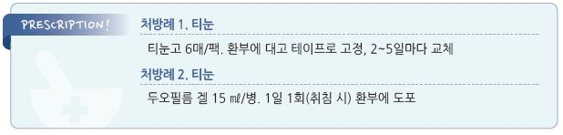

# 굳은 살 Callus, 티눈 Corn

## 일반 사항

* 굳은살 (Callus, Tyloma) : 반복적인 외압(마찰, 압박)에 의해 발생하는 넓은 범위의 과각화증
* 티눈 (Corn, Heloma) : 중심부에 원뿔 모양의 core(두꺼워진 각질층)가 있는 둥근 과각화증

## 원인 및 위험 인자

* 잘 맞지 않는 새 신발/양말
* 오래 걷기/달리기, 운동, 맨발로 걷기, 양말 없이 신발 착용
* 손으로의 도구/장비 반복 사용, 반복적인 손 글씨
* 손발의 기형/돌출 : hammertoe, bunion, bone spur
* 고령 : 발의 신경/혈관 기능 저하

## 임상 양상

### 굳은살

* 경계가 뚜렷하지 않은 피부의 두꺼워짐
* 주로 손/발바닥에 발생
* 다양한 색상 : 흰색, 노란색, 갈색, 붉은색
* 무통 또는 압통

### 티눈

#### Hard corn (= Heloma durum)

* 보통 발가락 dorsum(특히 5번째 PIPJ)에 발생
* 원뿔형, 명확한 경계
* 보통 통증이 있음

#### Soft corn (= Heloma molle)

* 보통 손발가락 사이(특히 4\~5번째 발가락 사이)에 발생
* 보통 심한 통증이 있음

## 진단

* X선 검사 : 뼈의 이상이 의심되는 경우 고려

***

## Management

### 치료 방침

*   자극 회피

    •잘 맞는 양말/신발, 굽이 낮은 신발, 볼이 넓은 부드러운 신발 착용; 보행을 줄임

    •마찰 방지 : soft foam padding, silicone sleeve 등을 마찰 부위, 튀어나온 부위에 부착

    •손작업 시 장갑 착용
* 보습제 도포
* 각질 제거
* 수술, 냉동 요법(액체 질소), 레이저 소작법 : 치료되지 않는 티눈에 대하여 고려

### 각질 제거

1. 물리적 제거 : 하루 한 번 따듯한 물에 5\~10분간 soaking 후 피부용 사포/부석으로 단단한 병소 제거
2.  각질 용해제 도포 : 물리적 제거 후 약제 도포 (보험주의); urea \[유리아], ammonium lactate \[타로암모늄락테이트],

    salicylic acid \[티눈고]\(salicylic acid 725 ㎎), \[두오필름 겔]\(salicylic acid 16.7%/lactic acid 16.7%)

* 부작용 : 피부 자극(심하면 빈도를 줄임)
* 주의/금기 : 말초신경병증(약제에 의한 피부 손상을 조기에 발견하지 못할 수 있음)

> **질병코드** L84 티눈 및 굳은살

