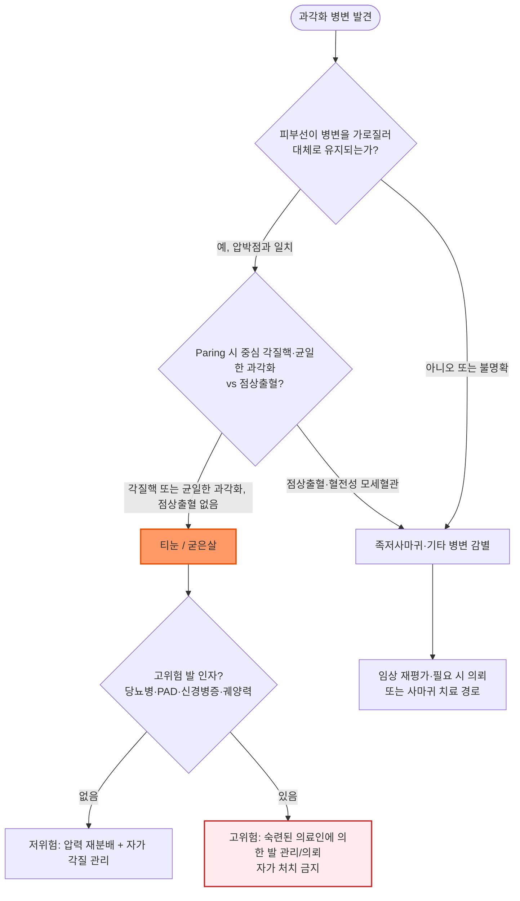

# 굳은살 Callus, 티눈 Corn

## <mark style="color:green;">일반 사항</mark>

* **굳은살(Callus, Tyloma)** : 반복적인 마찰·압박에 대한 보호 반응으로 생기는 넓고 비교적 편평한 과각화증. 중심 각질핵(core)이 없으며 대개 무증상이다.
* **티눈(Corn, Heloma)** : 국소 압박점에 생기는 경계가 뚜렷한 과각화증. 중심부의 원뿔형 각질핵이 진피 쪽으로 눌리면서 통증을 유발한다.
* 매우 흔한 외래 문제이나 국내 대규모 역학자료는 제한적이다.
* 무증상 굳은살을 일률적으로 제거할 필요는 없다. 통증, 균열, 기능장애 또는 궤양 위험이 있을 때 치료한다.
* 원인이 되는 압력·마찰을 교정하지 않으면 각질을 제거해도 재발한다.

## <mark style="color:green;">원인 및 위험 인자</mark>

* 너무 꽉 끼거나 헐거운 신발, 좁은 toe box, 높은 굽, 주름지거나 잘 맞지 않는 양말
* 오래 걷기·달리기, 반복적인 운동, 맨발 보행, 양말 없이 신발 착용
* 도구·장비의 반복 사용, 악기 연주, 반복적인 손 글씨 등 손의 기계적 자극
* 발의 구조적 이상 또는 압력 분포 변화 : hammertoe, bunion, claw toe, bone spur, 비정상 보행
* 고령 : 족저 지방패드 위축, 피부 건조, 족부 변형 증가
* 당뇨병성 신경병증과 말초동맥질환(PAD)은 발생 원인이라기보다 손상 인지 지연, 감염 및 궤양 위험을 높이는 중요한 동반 질환이다

## <mark style="color:green;">임상 양상</mark>

### <mark style="color:orange;">굳은살</mark>

* 경계가 비교적 불명확하고 넓으며 편평한 황백색 과각화
* 주로 손바닥과 발바닥의 체중부하 부위에 발생
* 피부선이 병변을 가로질러 대체로 유지됨
* 대부분 무통이나 두꺼워지거나 균열이 생기면 압통·통증 가능
* 홍반, 굳은살 아래 출혈, 수포, 균열은 단순한 색상 변화로 보지 말고 감염 또는 궤양 전 병변 여부를 평가한다

### <mark style="color:orange;">티눈</mark>

#### <mark style="color:$primary;">Hard corn (Heloma durum)</mark>

* 주로 발가락 등쪽의 관절 돌출부 또는 발가락 측면에 발생하며 제5족지 PIP 관절 부위가 흔함
* 건조하고 단단하며 경계가 뚜렷하고 중심 각질핵이 있음
* 직접 수직 압박이나 신발 착용 시 국소 통증이 흔함

#### <mark style="color:$primary;">Soft corn (Heloma molle)</mark>

* 주로 제4\~5족지 사이에 발생
* 습기와 밀착된 발가락 사이 압박 때문에 희고 물러진 침연성 병변으로 보임
* 통증이 심할 수 있으며 족부백선, 세균성 intertrigo, erythrasma를 감별한다

### <mark style="color:$danger;">🚩 Red Flags!</mark>

<mark style="color:$danger;">**즉각 조치 또는 당일 긴급 평가**</mark>

* 궤양, 고름·삼출, 빠르게 퍼지는 발적·열감·부종, 괴사 또는 전신 발열
* 갑작스러운 창백·청색증·냉감, 안정 시 심한 통증 등 급성 또는 중증 허혈 의심
* 당뇨병·면역저하 환자에서 감염이나 심부 조직 손상이 의심되는 병변

<mark style="color:$warning;">**당일 또는 조기 전문 평가**</mark>

* 당뇨병성 보호감각 소실, 말초동맥질환, 이전 족부궤양·절단 병력
* 굳은살 아래 출혈, 수포, 균열 또는 초기 궤양이 의심되는 위험 발
* 일상생활이나 보행을 방해하는 심한 통증
* 빠르게 커지거나 반복 출혈하는 비전형 병변, 진단이 불확실한 병변

<mark style="color:$info;">**외래 추적 / 재평가 계획**</mark> <mark style="color:$info;">- 즉각 위험 낮으나 호전 없으면 의뢰</mark>

* 압력 조절과 적절한 치료에도 반복 재발하거나 호전되지 않음
* hammertoe, bunion 등 구조적 변형으로 같은 부위에 지속적으로 재발
* 보행·신발 조정이나 보조기 처방이 필요한 경우

## <mark style="color:green;">진단</mark>

* 대부분 병력과 시진·촉진으로 진단한다.
* 발생 부위와 압력점, 직업·운동, 신발 크기와 마모 양상, 족부 변형 및 보행을 확인한다.
* 당뇨병이나 고위험 발에서는 피부 손상·감염·궤양 여부, 보호감각, 족배동맥·후경골동맥과 말초관류를 평가한다.
* 진단이 불확실하면 숙련된 의료인이 병변을 조심스럽게 paring하여 중심 각질핵 또는 점상출혈·혈전성 모세혈관 여부를 확인할 수 있다.
* 단순 병변에는 검사가 필요하지 않다. X선은 골 돌출·구조적 변형·이물 등 심부 원인이 의심될 때 고려한다.
* 비전형적이거나 치료에 반응하지 않는 병변은 이물육아종, punctate palmoplantar keratoderma, porokeratosis, 표피낭종 및 드문 종양성 병변을 재평가하고 필요 시 피부과 의뢰·생검을 고려한다.

### <mark style="color:orange;">감별 진단</mark>

* 티눈·굳은살과 족저사마귀는 육안상 혼동되기 쉬우나 치료 방침이 크게 다르므로 감별이 중요하다.

<table><thead><tr><th width="110">소견</th><th width="260">티눈·굳은살</th><th>족저사마귀</th></tr></thead><tbody><tr><td>피부선</td><td>병변을 가로질러 대체로 유지</td><td>단절되거나 병변 주위를 우회</td></tr><tr><td>통증 양상</td><td>티눈은 직접 수직 압박 시 통증이 흔함. 굳은살은 대개 무통이나 두껍거나 균열이 있으면 압통 가능</td><td>좌우에서 집는 압박 시 통증이 흔함</td></tr><tr><td>표면 각질 제거</td><td>티눈은 중심 각질핵, 굳은살은 균일한 과각화가 관찰되며 대개 점상출혈 없음</td><td>점상출혈 또는 혈전성 모세혈관이 보일 수 있음</td></tr><tr><td>분포</td><td>압박점·골 돌출부와 일치</td><td>압박점과 무관하게 발생하거나 여러 병변이 모일 수 있음</td></tr></tbody></table>


압통 방식과 피부선은 유용한 보조 소견이지만 민감도·특이도가 완전하지 않다. 점상출혈 하나만으로 확정하지 말고 병변의 위치, 압력점 및 전체 형태를 함께 판단한다.


***


```mermaid
graph TD
    A([과각화 병변 발견]) --> B{피부선이 병변을 가로질러<br>대체로 유지되는가?}
    B -->|예, 압박점과 일치| C{Paring 시 중심 각질핵·균일한 과각화<br>vs 점상출혈?}
    B -->|아니오 또는 불명확| G[족저사마귀·기타 병변 감별]
    C -->|각질핵 또는 균일한 과각화, 점상출혈 없음| D[티눈 / 굳은살]
    C -->|점상출혈·혈전성 모세혈관| G
    D --> E{고위험 발 인자?<br>당뇨병·PAD·신경병증·궤양력}
    E -->|없음| F[저위험: 압력 재분배 + 자가 각질 관리]
    E -->|있음| H[고위험: 숙련된 의료인에 의한 발 관리/의뢰<br>자가 처치 금지]
    G --> I[임상 재평가·필요 시 의뢰<br>또는 사마귀 치료 경로]
    style D fill:#f96,stroke:#e65100,stroke-width:2px
    style H fill:#ffebee,stroke:#c62828,stroke-width:2px
```

<p align="center"><strong>과각화 병변 평가 흐름</strong></p>

<p align="center"><em><mark style="color:$info;">Ref. IWGDF Prevention Guideline (2023) - 고위험 발 관리 원칙</mark></em></p>

***

## <mark style="background-color:$warning;">Management</mark>

### <mark style="color:orange;">치료 원칙</mark>

1. 증상이 없고 합병증 위험이 낮으면 관찰과 원인 교정만으로 충분하다.
2. 치료의 핵심은 병변 자체의 반복 제거가 아니라 **마찰 감소와 압력 재분배(off-loading)**이다.
3. 각질 제거는 통증 완화를 위한 보조 치료이며 원인이 지속되면 재발한다.
4. 고위험 발에서는 자가 절삭이나 고농도 각질용해제를 피하고 숙련된 의료인의 발 관리와 off-loading을 우선한다.

## <mark style="color:green;">비-약물 치료 및 예방</mark>

### <mark style="color:orange;">압력·마찰 줄이기</mark>

* 굽이 낮고 볼과 toe box가 넓으며 발에 맞는 부드러운 신발과 잘 맞는 양말 착용
* 병변 자체를 누르지 않도록 병변 **주위에** donut pad 또는 felted foam을 적용
* 위치에 따라 silicone toe sleeve, interdigital spacer, 중족골 패드, 깔창 또는 orthosis 고려
* Soft corn은 발가락 사이를 씻은 뒤 충분히 건조하고 toe separator로 접촉과 습윤을 줄임
* 손 병변은 장갑, grip padding 또는 작업 도구의 손잡이 조정
* 보행을 일률적으로 제한하지 말고 원인 활동과 신발을 조정한다. 고위험 발에서 피부 온도 상승이나 궤양 전 병변이 발생하면 활동량을 줄이고 신속히 평가한다

### <mark style="color:orange;">물리적 각질 제거</mark>

* **저위험 환자의 자가 관리** : 따뜻한 물에 5\~10분 담근 뒤 부석 또는 피부용 foot file로 피부가 손상되지 않도록 가볍게 제거한다
* 칼, 면도날, 가위, 손톱깎이로 병변을 잘라내지 않는다
* 통증, 출혈, 미란이 생기면 즉시 중단한다
* 당뇨병성 보호감각 소실, PAD, 이전 족부궤양·절단 병력이 있으면 자가 제거를 피하고 전문적 발 관리를 시행한다

## <mark style="color:green;">약물 치료</mark>

### <mark style="color:orange;">넓고 건조한 굳은살</mark>

* urea 200 ㎎/g(20%) : 환부를 씻고 건조한 뒤 1일 1\~수회 얇게 도포 <mark style="color:blue;">\[한미유리아크림200㎎]</mark>
* ammonium lactate 12% : 건조하고 거친 피부의 보습·연화 보조요법으로 고려. 티눈의 중심 각질핵 제거제는 아니며 처방 전 국내 유통 여부를 확인한다 <mark style="color:blue;">\[타로암모늄락테이트로션12%]</mark> - 수급 확인 필요
* 균열·미란 부위에는 따갑거나 자극적일 수 있으므로 주의한다

### <mark style="color:orange;">국소 티눈</mark>

* salicylic acid 725 ㎎/매 patch : 보호 펠트의 구멍을 병변에 맞추어 부착, 2\~5일마다 교체 <mark style="color:blue;">\[신신티눈고]</mark>
* salicylic acid 16.7%/lactic acid 16.7% 외용액 : 1일 1회 병변에만 소량 도포 <mark style="color:blue;">\[듀오케어액]</mark>
* **듀오케어액 허가상 금기** : 당뇨병 환자, 말초혈액순환장애 환자, 2세 미만 소아, 얼굴·간찰부위·항문생식기·눈 주위·점막 및 점·모반·털이 많은 사마귀·기타 피부병변에는 사용하지 않는다. 임부·임신 가능성이 있는 여성과 넓은 부위를 정기적으로 치료해야 하는 수유부는 사용 전 상담한다.
* **Soft corn 주의** : 제4\~5족지 사이는 간찰부위이므로 듀오케어액을 사용하지 않는다. 건조 유지, toe spacer 및 압력 교정을 우선하고 족부백선·세균성 intertrigo·erythrasma를 평가한다.
* 제품별 허가 적응증, 적용 방법, 교체 간격과 최대 사용기간을 확인한다
* 정상 피부는 보호 펠트의 구멍, petrolatum 등으로 보호하고 약제가 병변 밖으로 번지지 않게 한다
* 상처, 염증, 감염, 출혈 또는 미란이 있는 피부에는 사용하지 않는다
* 피부 자극, 통증, 미란, 화학화상 및 2차 감염이 발생할 수 있다. 심한 작열감이나 피부 손상이 생기면 중단한다


**⚠️ 제품 금기와 고위험 발 관리의 구분**\
듀오케어액은 보호감각 소실 여부와 관계없이 **모든 당뇨병 환자와 말초혈액순환장애 환자에서 허가상 금기**이다. 다른 살리실산 제품도 개별 허가사항을 확인한다. 임상적으로 당뇨병성 보호감각 소실, PAD, 이전 족부궤양·절단 병력 또는 면역저하가 있으면 자가 각질 제거를 피하고 먼저 전문 평가를 받는다. 위험 발의 과도한 굳은살, 출혈, 수포, 균열 등 궤양 전 병변은 숙련된 의료인이 치료한다(IWGDF 2023).


## <mark style="color:green;">시술 및 기타 처치</mark>

* 통증성 티눈·굳은살은 숙련된 의료인이 scalpel paring 또는 debridement를 시행할 수 있다
* 진단을 다시 확인하고 족저사마귀, 감염, 이물 및 비전형적 피부병변을 재평가한다
* 신발, 압력점, 보행, 골 돌출 및 hammertoe·bunion 등 구조적 변형을 평가한다
* 구조적 이상이 원인인 지속적 통증성 티눈은 보조기·족부 전문 평가를 우선하고, 보존 치료 실패 시 드물게 원인이 되는 골 돌출이나 변형의 수술적 교정을 고려한다
* 냉동요법은 사마귀 치료에 사용하며 티눈·굳은살의 일상적 치료로 사용하지 않는다 - 압력이라는 기계적 원인을 해결하지 못한다
* 레이저 치료는 근거가 제한적이고 압력 원인을 해결하지 못하므로 일상적인 1차 치료로 권고하지 않는다

***

### <mark style="color:red;">질병코드</mark>

L84 티눈 및 굳은살

***

## <mark style="color:purple;">처방례</mark>

> **처방례 1. 국소 티눈 - Salicylic acid plaster**
>
> ```
> 신신티눈고 6매/팩  환부 크기에 맞춰 부착, 2~5일마다 교체
> ```
>
> _✽ 보호 펠트 구멍을 병변에 맞추어 정상 피부를 보호한다. 상처·감염·출혈 부위에는 사용하지 않으며, 당뇨병성 신경병증 또는 PAD 환자의 자가 사용은 피한다._

> **처방례 2. 국소 티눈 - Salicylic acid/lactic acid 외용액**
>
> ```
> 듀오케어액 15 ㎖/병  1일 1회, 병변에만 소량 도포
> ```
>
> _✽ 온수에 담가 완전히 말린 뒤 도포하고 각 방울을 충분히 건조시킨다. 정상 피부는 petrolatum 등으로 보호하며, 심한 작열감·미란·출혈 발생 시 중단한다. 당뇨병·말초혈액순환장애 환자와 발가락 사이 Soft corn에는 사용하지 않는다._

> **처방례 3. 넓고 건조한 굳은살**
>
> ```
> 한미유리아크림200㎎(urea 200 ㎎/g, 20%) 50 g/튜브  1일 1~수회 얇게 도포
> ```
>
> _✽ 균열·미란 부위에는 자극감이 생길 수 있다. 압력 재분배와 신발 교정을 병행하지 않으면 재발한다._

***

### <mark style="color:$success;">핵심 복약 지도</mark>

> **각질용해제 사용법**
>
> * 병변에만 도포하고 정상 피부는 보호 펠트나 petrolatum으로 차단합니다.
> * 도포 전 온수에 5\~10분 담근 뒤 무리하지 않는 범위에서 느슨한 각질만 제거합니다.
> * 심한 따가움, 통증, 피부 벗겨짐, 출혈 또는 진물이 생기면 즉시 중단합니다.

> **고위험 발 환자 주의**
>
> * 당뇨병, 발 감각저하 또는 혈액순환 장애가 있으면 티눈약이나 칼·가위로 직접 제거하지 말고 진료를 받으십시오.

> **언제 다시 병원을 방문해야 하나요?**
>
> * 병변 주위가 붉게 붓거나 열감·고름·진물이 있는 경우 - 즉시 내원
> * 갑자기 창백해지거나 차갑고 통증이 심한 경우 - 즉시 내원
> * 압력 조절과 치료에도 4\~6주 이상 호전이 없는 경우
> * 같은 부위에 반복적으로 재발하는 경우 - 구조적 원인 평가 필요

***

### <mark style="color:blue;">환자 안내서</mark>


**굳은살과 티눈, 압력을 줄여야 좋아집니다**

굳은살과 티눈은 반복되는 압력과 마찰에 대한 피부의 보호 반응입니다. 각질만 제거하고 원인을 그대로 두면 다시 생깁니다.


#### <mark style="color:$primary;">왜 굳은살과 티눈이 생기나요?</mark>

* 잘 맞지 않는 신발, 오래 걷거나 서 있는 습관, 손의 반복적인 마찰이 원인입니다.
* 발가락 모양(hammertoe, bunion 등)이 있으면 특정 부위에 압력이 집중되어 잘 생깁니다.

#### <mark style="color:$primary;">일상생활에서 어떻게 관리하나요?</mark>

* **발가락이 편하게 움직일 정도로 앞이 넓은 신발을 신으세요.** 굽이 낮고 부드러운 재질이 좋습니다.
* **병변을 직접 누르지 말고 그 주위에 보호 패드를 붙이세요.**
* **발가락 사이 티눈은 씻은 뒤 물기를 완전히 말리세요.** 발가락 사이 간격을 벌려주는 spacer를 사용하면 도움이 됩니다.
* **칼, 면도날, 가위, 손톱깎이로 병변을 직접 자르지 마세요.** 감염과 상처의 위험이 있습니다.

#### <mark style="color:$primary;">약은 어떻게 써야 하나요?</mark>

* 티눈약(살리실산 등)은 병변에만 바르고 주변 정상 피부에는 닿지 않게 하세요.
* 심하게 따갑거나 피부가 벗겨지면 바로 사용을 멈추세요.

#### <mark style="color:$primary;">이럴 때는 즉시 병원을 방문하세요</mark>

* 당뇨병이나 손발 감각이 둔한 경우에는 절대 스스로 자르거나 티눈약을 사용하지 말고 먼저 진료를 받으세요.
* 붉게 붓거나 뜨겁고 아프거나, 피·고름·진물이 나오거나 피부가 검게 변하면 즉시 병원에 가세요.
