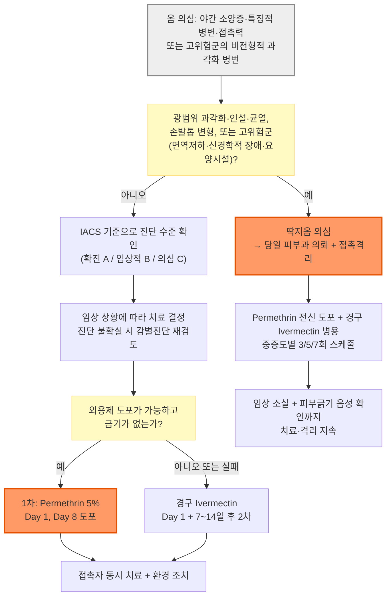

# 옴 Scabies

## <mark style="color:green;">일반 사항</mark>

* 사람옴진드기(*Sarcoptes scabiei* var. *hominis*)가 각질층에 침투하여 발생하는 전염성 피부 기생충 감염
* 호발 계절 : 겨울; 밀집 생활, 두꺼운 의복, 장시간 실내 접촉 및 집단생활과 관련
* 잠복기 : 초감염 시 보통 2\~6주, 과거 감염력이 있으면 1\~4일; 잠복기 동안 무증상이어도 전파 가능
* 전염 경로 : 주로 장시간의 직접 피부 접촉(동거·돌봄·성접촉 등). 짧은 악수나 포옹만으로는 흔히 전파되지 않으며, 의복·수건·침구 등 매개물에 의한 전파는 일반 옴에서는 드물지만 딱지옴에서는 중요
* 가려움 기전 : 진드기, 충란, 분변 등에 대한 지연형 과민반응
* 적절한 구충 치료 후에도 가려움과 피부염은 2\~4주 이상 지속될 수 있음

## <mark style="color:green;">원인</mark>

* 원인 기생충 : *Sarcoptes scabiei* var. *hominis* (성숙 암컷 약 0.4×0.3 ㎜)

### <mark style="color:orange;">위험 인자</mark>

* 가족·성접촉자·돌봄 제공자와의 장시간 밀접 피부 접촉 및 공동침구 사용
* 요양병원·요양시설·기숙사·교정시설 등 밀집된 집단생활
* 돌봄이 필요한 고령자·장애인, 인지·신경학적 질환으로 가려움이나 긁기 반응이 감소한 환자
* 진단·치료 지연 또는 접촉자 동시 치료 실패
* 면역저하, 영양결핍, 장기간 corticosteroid 또는 면역억제제 사용 — 특히 딱지옴 위험

## <mark style="color:green;">임상 양상</mark>

### <mark style="color:orange;">심한 가려움</mark>

* 특히 밤 또는 뜨거운 샤워 후 심함
* 고령자, 면역저하자 및 신경학적 장애 환자에서는 가려움이 경미하거나 없고 분포도 비전형적일 수 있음
* 치료 후 소양증(post-scabetic itch)은 진드기가 제거된 뒤에도 2\~4주, 때로 더 오래 지속될 수 있음

### <mark style="color:orange;">국소 병소</mark>

* 호발 부위 : 손가락 사이, 손목 굴측, 팔꿈치·무릎 주위, 겨드랑이, 배꼽·허리, 엉덩이, 유두·유방, 외부 생식기
  * 건강한 성인의 전형적 옴에서는 얼굴과 두피가 대개 보존됨
  * 영유아·고령자·면역저하자에서는 얼굴, 두피, 목, 손바닥과 발바닥까지 침범 가능
* 홍반성 작은 구진, 소수포, 옴굴(burrow)
  * 옴굴 : 길이 2\~15 ㎜의 가늘고 굽은 융기선; 끝부분에서 진드기를 확인할 수 있으나 육안으로 발견하기 어려움
* 찰과상, 습진성 판, 결절; 2차 세균감염 시 농포·삼출·가피·통증
* 음낭·음경의 소양성 결절은 옴을 강하게 시사하며, 성공적인 구충 후에도 수개월 지속될 수 있음

### <mark style="color:$danger;">🚩 Red Flags!</mark>

<mark style="color:$danger;">**즉각 조치 또는 의뢰**</mark>

* 발열·저혈압·빈맥·의식 변화 등 전신독성을 동반한 광범위 2차 세균감염 또는 패혈증 의심
* 빠르게 진행하는 홍반·부종·심한 통증, 수포·괴사 등 침습성 피부연조직감염 의심

<mark style="color:$warning;">**당일 또는 조기 의뢰**</mark>

* 딱지옴 의심 : 광범위한 과각화·인설·균열, 손발톱 변형, 가려움이 경미하거나 없는 고위험 환자
* 요양병원·요양시설 등 집단생활시설에서 환자 또는 역학적으로 연관된 다수의 가려움 환자 발생
* 면역저하자, 중증 신경학적 장애 환자, 생후 2개월 미만 영아의 옴 의심
* 진단이 불확실하지만 감염력이 높은 딱지옴을 배제할 수 없는 경우

<mark style="color:$info;">**외래 추적 / 추가 평가 계획**</mark> <mark style="color:$info;">- 즉각 위험 낮으나 호전 없으면 의뢰</mark>

* 올바른 2회 치료와 접촉자 동시 치료 후에도 새 옴굴·새 전형적 병변이 발생하거나 진드기가 검출됨
* 치료 4주 후에도 소양증이 악화·지속되거나 진단이 불확실함
* 결절옴·치료 후 피부염이 장기간 지속되거나 반복 치료로 자극피부염이 의심됨

## <mark style="color:green;">진단</mark>

### <mark style="color:orange;">2020 IACS 진단 기준</mark>

* **A. 확진 옴(Confirmed scabies)** — 다음 중 하나
  * A1 : 피부 검체의 광학현미경검사에서 진드기·충란 또는 분변(scybala) 확인
  * A2 : 고배율 영상장비로 진드기·충란 또는 분변 확인
  * A3 : dermoscopy로 진드기 확인
* **B. 임상적 옴(Clinical scabies)** — 다음 중 하나
  * B1 : 옴굴 관찰
  * B2 : 남성 생식기의 전형적 병변
  * B3 : 전형적 분포의 전형적 병변＋병력 특징 2가지
* **C. 의심 옴(Suspected scabies)** — 다음 중 하나
  * C1 : 전형적 분포의 전형적 병변＋병력 특징 1가지
  * C2 : 비전형적 병변 또는 비전형적 분포＋병력 특징 2가지

- [ ] 병력 특징 : ① 가려움 ② 양성 접촉력
- [ ] **B·C 기준은 감별진단을 검토한 뒤 옴이 가장 가능성이 높은 경우에만 적용한다.** 치료에 반응하지 않으면 진단을 고정하지 말고 감별진단, 도포 오류 및 재감염 가능성을 다시 평가한다. IACS 기준은 임상 판단을 대체하거나 치료 여부만을 결정하기 위한 기준은 아니다.

### <mark style="color:orange;">검사</mark>

* Dermoscopy : 옴굴 끝의 진드기를 확인(delta-wing/jet-with-condensation-trail sign)
* 피부긁기＋광학현미경검사 : 옴굴 또는 손가락 사이·손목·생식기의 긁지 않은 병변을 선택하여 진드기·충란·분변 확인
* 접착테이프 검사 : 병변에 투명 테이프를 붙였다 떼어 슬라이드에 부착 후 현미경 관찰
* Burrow ink test : 옴굴 확인을 보조
* 피부생검 : 비전형적이고 다른 질환과 감별이 어려울 때 제한적으로 고려

- [ ] 피부긁기·테이프검사의 민감도는 제한적이므로 음성 결과만으로 옴을 배제하지 않는다. 말초혈액 eosinophilia는 진단검사가 아니다.

### <mark style="color:orange;">감별 진단</mark>

* 옴과 유사한 소양성 발진·피부병변을 보일 수 있는 질환들의 감별

<table><thead><tr><th width="230">감별 질환</th><th>옴과의 감별 포인트</th></tr></thead><tbody><tr><td>아토피피부염, 접촉피부염, 건조피부염</td><td>기저 병력·노출 유발인자와 전형적인 습진 분포를 확인한다. 옴굴, 동시 접촉자의 야간 소양증 및 옴의 전형적 분포가 뚜렷하지 않은 경우가 많다.</td></tr><tr><td>구진두드러기, 빈대·이 등 다른 절지동물 감염</td><td>노출 부위 위주의 산발 구진; 여행·기숙사 등 환경력 확인; 옴굴 없음</td></tr><tr><td>모낭염, 농가진, 결절성 양진</td><td>모낭 중심 병변 또는 국소 농포·가피 위주로 분포가 옴과 다름</td></tr><tr><td>약진, 포진상 피부염, 고령자의 수포성 유사천포창</td><td>약물력, 대칭적 수포성 병변; 감별이 어려우면 생검·직접면역형광검사 고려</td></tr><tr><td>망상기생충증(delusional parasitosis)</td><td>충분한 반복 평가로 실제 감염과 피부·약물·신경정신과적 원인을 배제했는데도 기생충 감염에 대한 고정된 확신이 지속됨</td></tr></tbody></table>

***



<p align="center"><strong>진단 및 치료 알고리듬</strong></p>

***

## <mark style="background-color:$warning;">Management</mark>

### <mark style="color:orange;">치료 방침</mark>

* 의심·임상적·확진 옴은 임상 상황에 따라 치료하며, 진단이 불확실하거나 딱지옴이 의심되면 검사와 전문의 평가를 병행
* 환자와 가족·성접촉자·밀접 접촉자를 **같은 날 동시에 치료**
* 환자 치료, 치료 후 소양증 관리, 2차 세균감염 치료 및 접촉 물품 조치를 함께 시행
* 외용제 사용법을 구두 설명에 그치지 말고 인쇄물 또는 체크리스트로 제공
* 치료 완료 후 2주와 4주에 치료 반응을 평가

### <mark style="color:orange;">치료 성공과 실패 판정</mark>

* 치료 후 가려움만 남아 있는 경우 : 진드기에 대한 과민반응 또는 자극피부염일 수 있으므로 즉시 재치료하지 않음
* 치료 실패·재감염 시사 소견 : 살아 있는 진드기 또는 새 옴굴 확인, 새로운 전형적 구진·수포 발생, 소양증 악화
* 재치료 전 확인
  * 목 아래 전신 또는 연령·상태에 맞는 두피·얼굴까지 빠짐없이 도포했는가?
  * 손 씻기 후 손에 약을 다시 발랐는가?
  * 손발가락 사이·손발톱 밑·배꼽·외음부·엉덩이 주름을 빠뜨리지 않았는가?
  * 7\~14일 후 2차 치료를 완료했는가?
  * 가족·성접촉자·밀접 접촉자가 같은 날 치료받았는가?
  * 환경 조치 후 재노출되지 않았는가?
  * 다른 진단 또는 scabicide 유발 자극피부염 가능성이 있는가?


정확한 도포, 충분한 약제량, 2차 치료, 접촉자 동시 치료 및 재감염 가능성을 모두 확인한 뒤에도 살아 있는 진드기가 확인되면 약제 감수성 저하 가능성을 고려하고 피부과에 의뢰한다. 임상적 치료 실패만으로 permethrin 내성을 확정하지 않는다.


***

## <mark style="color:green;">비-약물 치료 및 예방</mark>

### <mark style="color:orange;">접촉자 조치</mark>

* 가족, 성접촉자 및 장시간 피부 접촉을 한 돌봄 제공자·밀접 접촉자는 증상 유무와 관계없이 가능한 한 환자와 같은 날 치료
* 접촉자의 증상이 없더라도 잠복기 감염이 가능함을 설명
* 딱지옴 또는 집단시설 발생에서는 감염관리 담당자와 함께 접촉 범위와 예방치료 대상을 확대 평가

### <mark style="color:orange;">접촉 물품 조치</mark>

* 치료 전 3일 동안 사용한 의복·수건·침구류를 조치
* 뜨거운 물(약 60℃)로 세탁하고 고온 건조하거나 드라이클리닝
* 세척할 수 없는 물품은 플라스틱 가방에 밀봉하여 최소 72시간, 실무적으로 3\~7일간 보관
* 일반 옴에서 살충제 분무·훈증 또는 매트리스 폐기는 불필요
* 딱지옴 환자가 사용한 방과 가구는 철저히 청소·진공청소하고, 진공청소기 먼지봉투를 안전하게 폐기

- [ ] 옴진드기는 보통 사람 피부에서 떨어지면 2\~3일 이상 생존하지 못하지만, 딱지옴의 탈락 각질에서는 매개물 전파 위험이 커진다.

### <mark style="color:orange;">의료기관·집단시설 조치</mark>

* 환자와 직접 접촉하거나 의복·침구를 다룰 때 장갑과 긴소매 가운 착용
* 환자 접촉 후 손 위생 및 사용 물품·환경 관리
* 일반 옴은 효과적인 첫 치료 후 최소 24시간 직접 피부접촉을 피하고, 다음 날부터 등교·출근을 고려
* 딱지옴은 접촉격리를 시행하고, 의료기관·집단시설에서는 임상 병변 소실과 피부긁기 음성이 확인될 때까지 접촉주의를 유지
* 요양시설 등 집단시설 발생 시 감염관리 담당자 및 필요 시 관할 보건당국과 협의하여, 노출 가능성과 업무상 필요성을 기준으로 직원·환자 가족·자원봉사자·방문객 등에 대한 공지 범위와 내용을 결정 (질병관리청 2024년 옴 예방관리 안내서)


옴은 국내 법정감염병으로 지정되어 있지 않아 의무 신고 대상은 아니다. 다만 집단시설에서 발생한 경우 질병관리청의 「옴 예방관리 안내서」에 따라 시설 자체의 감염관리·환경소독 체계를 가동한다.


## <mark style="color:green;">약물 치료</mark>

### <mark style="color:orange;">국내 치료 선택</mark>

* **1차 선택 : permethrin 5% 크림**
* **대안 : crotamiton 10% 외용제, 경구 ivermectin**
  * 외용제 도포가 어렵거나 적절한 permethrin 치료에 실패한 경우, 집단시설 발생 등에서 환자 상태·허가사항·수급을 확인하여 선택
* **딱지옴 : permethrin 5%＋경구 ivermectin 병용**

- [ ] **처방 전 확인:** Crotamiton은 제형별 허가 적응증이 다르며, 경구 ivermectin의 국내 옴 치료와 현재 유통 중인 crotamiton 연고의 옴 치료는 허가 외 사용이다. 반드시 최신 제품 허가사항, 수급 여부 및 기관 프로토콜을 확인한다.
- [ ] 외용제는 뜨거운 목욕 직후가 아닌 서늘하고 완전히 건조된 피부에 바르며 눈·입·점막을 피한다.

### <mark style="color:orange;">Permethrin 5% 크림</mark>

* 효과가 높고 내약성이 양호한 1차 치료제
* 용법 : 목 아래 모든 신체 부위에 도포 → 8\~14시간 후 세척 → 7일 후(허용 범위 7\~14일) 같은 방법으로 1회 반복
* 평균 성인 1회 25\~30 g이 필요하므로, 30 g/tube 제품은 2회 치료를 위해 통상 2튜브 처방
* 손가락·발가락 사이, 손발톱 밑, 손목, 겨드랑이, 배꼽, 외부 생식기, 엉덩이 주름까지 도포하고 치료 중 손을 씻으면 손에 재도포
* 영유아·고령자·면역저하자 또는 두경부 병변이 있는 환자는 눈·입 주위를 제외한 두피·헤어라인·관자놀이·이마·귀 뒤·목에도 도포
* 생후 2개월 이상 사용. 임신·수유부에서도 일반적으로 우선 선택할 수 있으나 수유 직전 유두 부위 약제는 씻어냄
* 부작용 : 일시적 작열감·따가움·가려움·홍반; 반복 과사용 시 자극피부염
* 제품 : [오메크린크림](../%EB%B9%84%EB%B3%B4%ED%97%98/)

### <mark style="color:orange;">Crotamiton 10%</mark>

* 옴진드기 사멸 및 가려움 완화 효과가 있으나 permethrin보다 치료 실패가 흔함
* 국내 지침상 전신에 1일 1회 3\~5일간 반복 도포하는 방법이 사용되며, 구체적 도포·세척 간격은 제품 허가사항을 확인
* 성인에서 대안으로 고려하며 소아·임신부에서는 안전성 자료와 제품 허가사항을 확인
* 국내 허가상 로션제는 옴·피부가려움, 연고제는 피부가려움에 해당한다. 현재 국내 유통 중인 `유락신연고`의 옴 치료는 허가 외 사용이므로, 성분 수준의 치료 지침과 개별 제품의 허가사항을 구분하여 판단
* 제품 : [유락신연고](../%EB%B9%84%EB%B3%B4%ED%97%98/) — 옴 치료 시 허가 외 사용

### <mark style="color:orange;">Ivermectin 경구제</mark>

* 용법 : 200 ㎍/㎏/회, 7\~14일 간격으로 2회 투여
* 충란에 대한 효과가 충분하지 않으므로 2차 투여가 중요
* 단회 투여의 초기 치료율은 permethrin보다 낮을 수 있으나 2회 투여 시 유효한 대안
* 외용제 사용이 어렵거나 적절한 외용 치료에 실패한 경우, 집단시설 발생 또는 딱지옴에서 고려
* 딱지옴에서는 permethrin과 병용하며 단독 사용하지 않음
* 주의 : 체중을 실제로 확인하여 용량 계산; 약물상호작용과 간기능 확인
* 체중 ＜15 ㎏ 소아와 임신부에서는 안전성이 확립되지 않아 사용하지 않음. 수유부는 위험·이득 평가
* 국내 옴 치료는 허가 외 사용이며 경구 제제의 수급이 제한될 수 있으므로 처방 전 확인
* 식사 관계 : 국내 `스트로멕톨` 허가사항은 공복 복용이나, CDC 옴 전문가 권고는 생체이용률을 높이기 위해 식사와 함께 복용하는 방법이다. 옴 치료가 국내 허가 외 사용인 점을 고려하여 기관·피부과 프로토콜에 따라 일관되게 적용


**최신 근거 — SCRATCH trial (BMJ, 2026)** : 일반 옴 환자에게 Day 0·10의 2회 치료를 시행했을 때, 클러스터 단위 치료율은 ivermectin 71.8%, permethrin 88.5%였고 개인 단위 치료율도 각각 85.3%, 94.2%로 permethrin이 우수했다. 이는 permethrin을 1차 치료로, 경구 ivermectin을 외용 치료가 어렵거나 실패한 경우의 대안으로 두는 현재 구조를 뒷받침한다.


### <mark style="color:orange;">Sulfur 5\~10% 연고</mark>

* 상용 제품보다 조제 연고 형태로 사용하며 냄새·착색·피부 자극 및 순응도 저하가 단점
* 3일 연속 전신 도포하는 방법이 사용됨
* 생후 2개월 미만 영아에서 permethrin을 사용할 수 없을 때 고려할 수 있는 대안

### <mark style="color:orange;">국내 미유통·제한적 또는 권고하지 않는 약제</mark>

* Benzyl benzoate 10\~25%, malathion 0.5%, spinosad 0.9% : 일부 국가의 대안이나 국내 상용 제제·허가·수급이 제한적
* Topical ivermectin : 해외 연구용 옴 치료제와 국내 `수란트라크림 1%`을 혼동하지 않는다. 수란트라는 성인의 주사(rosacea) 치료제로 허가되었으며 옴 치료제가 아님
* Pyrethrin : 국내에서는 이감염증 치료제로 접할 수 있으나 옴 치료제로 사용하지 않음
* Lindane 1% : 신경독성·혈액독성과 더 안전한 대체제의 존재로 권고하지 않으며, 특히 영유아·소아, 체중 ＜50 ㎏, 임신·수유부, 고령자, 면역저하자, 광범위 피부염·손상 피부 및 발작 위험 환자에서는 사용하지 않음

### <mark style="color:orange;">치료 후 가려움</mark>

* 보습제와 calamine/zinc oxide를 우선 사용
* 중등도 피부염에는 부위에 맞는 저·중등도 국소 corticosteroid를 단기간 사용
  * 진단 전 또는 치료되지 않은 옴에 corticosteroid를 단독 사용하면 임상 양상을 은폐하고 딱지옴을 악화시킬 수 있음
* 경구 H1-항히스타민제는 진드기를 제거하지 않으며, 야간 소양으로 수면이 어려울 때 증상 완화를 위해 단기간 고려
  * Hydroxyzine, chlorpheniramine, diphenhydramine 등 1세대 제제는 진정·항콜린작용, 낙상·섬망·요폐 위험이 있으므로 특히 고령자에서 피하거나 최소 용량으로 제한
  * 비진정성 2세대 제제도 효과는 제한적일 수 있으나 주간 증상에서 안전성을 고려하여 선택 가능
* 구충 완료 후에도 결절옴은 잔존 항원에 대한 과민반응으로 수개월 지속될 수 있음. 살아 있는 진드기와 재감염을 배제한 뒤 병변 부위에 적합한 저·중등도 국소 corticosteroid를 단기간 사용하거나 tacrolimus/pimecrolimus 등 국소 calcineurin inhibitor를 고려. 난치성 결절의 병소내 corticosteroid 주사는 피부과에서 제한적으로 고려
* 전신 corticosteroid는 통상 사용하지 않음. 성공적인 구충 후에도 심한 염증·소양증이 지속되는 예외적 환자에서 진단 재평가 후 짧게 고려
* 긁음에 의한 2차 세균감염(발적·열감·부종·농·통증) 시 중증도를 평가하여 항생제 치료 (☞ [피부감염](165_-skin-and-soft-tissue-infection.md#undefined-14))
  * *S. pyogenes*에 의한 농가진 등 피부감염 후 드물게 급성 연쇄상구균 후 사구체신염(PSGN)이 발생할 수 있으므로 이후 혈뇨·부종·소변량 감소·고혈압이 나타나면 신장 합병증을 평가

## <mark style="color:green;">딱지옴 Crusted scabies</mark>

* 매우 많은 옴진드기가 증식하여 발생하는 광범위 과각화성 피부질환으로, 과거 Norwegian scabies로 불림
* 고령자, 면역저하자, 인지·신경학적 장애 또는 감각저하로 긁기 반응이 감소한 환자에서 호발
* 두꺼운 과각화성 판·인설·균열, 손발톱 밑 과각화와 조갑변형이 발생하며 두피·얼굴을 포함한 전신 침범 가능
* 전형적 가려움이 경미하거나 없을 수 있어 건선·습진으로 오인하기 쉬움
* 제한적인 직접 접촉이나 오염된 의복·침구·가구로도 전파될 수 있어 집단시설 유행의 주요 원인
* 2차 *S. aureus* 또는 *S. pyogenes* 감염, 봉와직염·패혈증 위험

### <mark style="color:orange;">치료 및 감염관리</mark>

* 당일 피부과 의뢰 및 의료기관·집단시설 감염관리 담당자와 협력
* 접촉격리, 광범위 접촉자 추적·동시 치료 및 강화된 환경청소
* **Permethrin 5% 전신 도포＋경구 ivermectin 병용**
  * Permethrin : 두피·얼굴·귀 뒤·손발톱 밑을 포함해 초기 매일 또는 2\~3일 간격으로 1\~2주 치료. 국내 지침에서는 매일 7일 후 치료될 때까지 주 2회 방법을 사용할 수 있음
  * Ivermectin 200 ㎍/㎏/회 : 중증도에 따라 3회(1·2·8일), 5회(1·2·8·9·15일), 또는 7회(1·2·8·9·15·22·29일)
  * 두꺼운 각질에는 permethrin 비도포일에 urea 또는 salicylic acid 등 keratolytic을 사용하여 약물 침투 개선
* 의료기관·집단시설에서는 임상 병변이 소실되고 피부긁기 음성이 확인될 때까지 치료와 접촉격리를 지속
* 집단시설 발생 시에는 질병관리청 안내서의 「딱지옴 환자 발생 시 관리지침」에 따라 접촉 범위·환경소독을 별도로 확대 적용


**최신 근거 — 중증 옴 무작위시험 (NEJM, 2026)** : ivermectin 200 ㎍/㎏을 Day 0·7·14에 투여하고 permethrin을 Day 0·7에 병용한 표준용량군의 치료율은 82%였으며, ivermectin 400 ㎍/㎏ 고용량군은 75%로 더 우수하지 않았다. 이 결과는 고용량 ivermectin의 우월성을 지지하지 않지만, CDC의 딱지옴 5회·7회 투여 스케줄을 직접 비교한 연구가 아니므로 기존 스케줄을 대체하는 근거로 해석하지 않는다.


***

### <mark style="color:red;">질병코드 (KCD)</mark>

B86 옴

***

## <mark style="color:purple;">처방례</mark>

> **처방례 1. 성인 일반 옴의 표준 치료**
>
> ```
> 오메크린크림 30 g/tube  2 tubes  (비보험)
> Day 1 취침 전 목 아래 전신에 1튜브 도포 → 8~14시간 후 세척
> Day 8 같은 방법으로 남은 1튜브 도포 → 8~14시간 후 세척
> Cetirizine 10 ㎎/T  7T #7  1T qd — 가려움에 대하여; 졸림·신기능에 따라 조절
> 칼라민로션 100 ㎖  필요시 가려운 부위에 도포  (비보험)
> ```
>
> _✽체격이 크거나 두피까지 치료해야 하는 환자는 1회 30 g보다 더 필요할 수 있다. 가족·성접촉자·밀접 접촉자를 같은 날 치료하고, 치료 전 3일간 사용한 의복·수건·침구를 함께 처리한다._

> **처방례 2. 외용제 사용이 어렵거나 적절한 Permethrin 치료에 실패한 성인**
>
> ```
> Ivermectin 200 ㎍/㎏ PO  Day 1 및 Day 8  (허용 간격 7~14일)
> — 실제 체중으로 용량을 계산하고 3 ㎎ 정제 단위로 조정
> — 국내 허가 외 사용·수급 및 약물상호작용 확인
> — 식사 관계는 국내 허가사항(공복)과 CDC 옴 전문가 권고(식사와 함께)가 다르므로 기관·피부과 프로토콜에 따름
> — 임신부와 체중 ＜15 ㎏ 소아에게 사용하지 않음
> Cetirizine 10 ㎎/T  7T #7  1T qd — 가려움에 대하여; 졸림·신기능에 따라 조절
> 칼라민로션 100 ㎖  필요시 가려운 부위에 도포  (비보험)
> ```

> **딱지옴(Crusted scabies) 전문치료 프로토콜 예시 — 피부과·감염관리 협진**
>
> ```
> Permethrin 5% 크림: 1회 필요량을 체표면적과 침범 범위에 따라 산정
> Day 1~7 두피·얼굴·귀 뒤·손발톱 밑 포함 전신 도포 → 8~14시간 후 세척
> 이후 임상 병변 소실 및 피부긁기 음성 확인까지 주 2회 지속
> Ivermectin 200 ㎍/㎏ PO  Day 1, 2, 8, 9, 15  (중증도에 따라 Day 22, 29 추가)
> Urea 10~40% 크림: 각질 두께와 부위에 맞는 농도를 선택하여 permethrin 비도포일에 두꺼운 각질 부위에 도포
> ```
>
> _✽고정된 튜브 수로 처방하지 말고 매회 전신 도포에 충분한 양을 산정한다. 피부과 및 감염관리 담당자와 협진하며 접촉격리, 광범위 접촉자 추적·동시 치료를 병행하고, 임상 병변 소실과 피부긁기 음성이 확인될 때까지 치료·격리를 지속한다._

***

### <mark style="color:$success;">핵심 복약 지도</mark>

> **약은 이렇게 바릅니다**
>
> 1. 목 아래 전신에 빠짐없이 바릅니다. 눈에 보이는 병변에만 바르면 치료가 실패합니다.
> 2. 손가락·발가락 사이, 손발톱 밑, 배꼽, 겨드랑이, 외음부, 엉덩이 주름까지 놓치지 않습니다.
> 3. 영유아·고령자·면역저하자 또는 머리·목 병변이 있는 환자는 의료진의 지시에 따라 눈·입 주위와 점막을 제외한 두피·헤어라인·귀 뒤·목과 얼굴에도 바릅니다.
> 4. 바른 뒤 손을 씻었다면 손과 손가락 사이에 다시 바릅니다.
> 5. 8\~14시간 후 씻어냅니다. 두 번째 도포는 첫 치료에서 살아남았거나 이후 부화한 진드기를 제거하기 위한 핵심 치료이므로 가능하면 표준 Day 8에 시행하되, 처방된 7\~14일 간격을 지키고 임의로 생략하거나 지나치게 자주 바르지 않습니다.

> **접촉자도 반드시 함께 치료합니다**
>
> * 증상이 없는 가족·동거인·성접촉자도 같은 날 함께 치료해야 재감염을 막을 수 있습니다.

> **치료 후 남는 가려움만으로 재도포하지 않습니다**
>
> * 성공적인 치료 후에도 가려움은 2\~4주, 때로 더 오래 남을 수 있습니다.
> * 새로운 옴굴이나 새 구진이 없다면 가려움만으로 약을 반복 사용하지 마십시오.

> **의복·침구는 이렇게 관리합니다**
>
> * 치료 전 3일간 사용한 의복·수건·침구는 뜨거운 물로 세탁·고온 건조합니다.
> * 세탁이 어려운 물품은 비닐봉지에 밀봉해 최소 72시간(권장 3\~7일) 보관합니다.

> **언제 다시 병원을 방문해야 하나요?**
>
> * 올바르게 2회 치료하고 접촉자도 함께 치료했는데도 새 옴굴·새 병변이 계속 생기는 경우
> * 치료 4주 후에도 가려움이 오히려 악화되거나 진단이 불확실한 경우
> * 딱지·인설이 두껍게 퍼지거나 열·통증·고름 등 2차 감염 징후가 동반되는 경우 — 즉시 내원

***

### <mark style="color:blue;">환자 안내서</mark>


**옴, 개인위생과는 상관없이 누구나 걸릴 수 있습니다**

옴은 아주 작은 진드기가 피부 각질층 속에 살면서 심한 가려움을 일으키는 전염성 피부병입니다. 가족·돌봄·동거처럼 오랜 시간 피부를 맞대는 접촉으로 전파되며, 개인위생과는 관계가 없습니다.


#### <mark style="color:$primary;">왜 이렇게 가려운가요?</mark>

* 진드기와 진드기의 알·배설물에 대한 알레르기 반응 때문에 가려움이 생깁니다.
* 밤이나 따뜻한 목욕 후에 특히 심해지는 경향이 있습니다.

#### <mark style="color:$primary;">치료는 어떻게 하나요?</mark>

* 처방받은 약을 목 아래 전신에 빠짐없이 바르고, 정해진 시간에 씻어냅니다.
* 영유아·고령자·면역저하자 또는 머리·목에 병변이 있는 환자는 의료진의 지시에 따라 두피·헤어라인·귀 뒤·목과 얼굴에도 바릅니다. 눈·입 주위와 점막은 피합니다.
* **두 번째 도포일을 지키는 것이 중요합니다.** 첫 도포 후 가능하면 표준 Day 8에 다시 바르되, 처방된 7\~14일 간격을 지킵니다. 이는 첫 치료에서 살아남았거나 이후 부화한 진드기를 제거하여 치료 실패를 줄이기 위한 것이며, 임의로 생략하거나 지나치게 자주 바르지 않습니다.
* **증상이 없어도 가족·동거인은 같은 날 함께 치료해야 합니다.**

#### <mark style="color:$primary;">치료 후에도 가려운데, 다시 발라야 하나요?</mark>

* 치료가 성공해도 알레르기 반응 때문에 가려움이 2\~4주, 길게는 그 이상 남을 수 있습니다.
* 새로운 물집·발진이 계속 생기지 않는다면 가려움만으로 약을 반복해서 바르지 마십시오. 오히려 피부를 자극할 수 있습니다.

#### <mark style="color:$primary;">의복과 침구는 어떻게 관리하나요?</mark>

* 치료 전 3일 동안 사용한 옷·수건·이불은 뜨거운 물로 세탁하고 건조기를 사용합니다.
* 세탁이 어려운 물건은 비닐봉지에 밀봉해 3일 이상(가능하면 일주일) 보관한 뒤 사용합니다.
* 소독제를 뿌리거나 매트리스를 버릴 필요는 없습니다.

#### <mark style="color:$primary;">이럴 때는 즉시 병원을 방문하세요</mark>

* 올바르게 치료했는데도 새로운 물집이나 발진이 계속 생기는 경우
* 딱지가 두껍게 퍼지거나 열·심한 통증·고름이 동반되는 경우
* 요양시설이나 기숙사 등 여러 사람이 함께 지내는 곳에서 비슷한 증상이 동반 발생하는 경우
