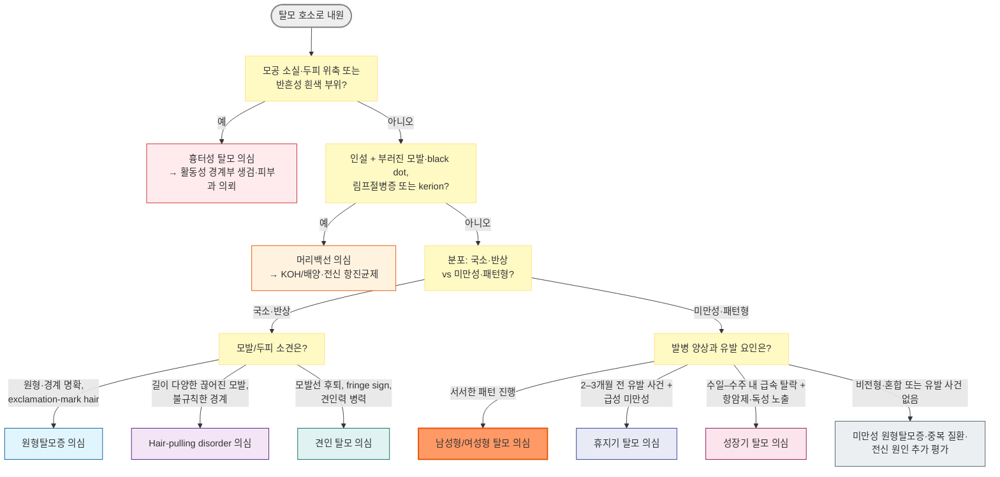

# 탈모증 Alopecia

## <mark style="color:green;">일반 사항</mark>

### <mark style="color:orange;">Hair cycle</mark>

* **성장기(anagen)**: 두피 모낭의 약 85\~90%, 보통 2\~6년 지속, 약 0.3 ㎜/day 성장
* **퇴행기(catagen)**: ＜1\~2%, 약 2\~3주 지속
* **휴지기(telogen)**: 약 10\~15%, 평균 약 3개월(약 100일; 대략 2\~4개월) 지속
* 이후 모발이 탈락(exogen)하고 같은 모낭에서 새로운 성장기가 시작된다. 정상적인 일일 탈락량은 개인·세정 습관에 따라 달라 대개 50\~150개/day 범위로 설명할 수 있다.

## <mark style="color:green;">분류 및 원인</mark>

### <mark style="color:orange;">비흉터성 탈모(nonscarring alopecia)</mark>

* **국소성/반상**: 원형탈모증, 머리백선, 매독성 탈모, 측두삼각탈모, 발모벽(hair-pulling disorder), 초기 견인 탈모
* **패턴형**: 남성형 탈모(male pattern hair loss), 여성형 탈모(female pattern hair loss)
* **미만성**: 휴지기 탈모, 성장기 탈모, 미만성 원형탈모증, loose anagen syndrome 등
* 견인 탈모와 압박성(수술 후) 탈모는 초기에는 비흉터성이지만 손상이 지속되거나 심하면 흉터성 탈모로 진행할 수 있다.

### <mark style="color:orange;">흉터성 탈모(scarring/cicatricial alopecia)</mark>

* 기전: 염증과 섬유화에 의한 모낭 줄기세포 영역의 비가역적 파괴
* **일차성**: lichen planopilaris, frontal fibrosing alopecia, central centrifugal cicatricial alopecia(CCCA), discoid lupus erythematosus, folliculitis decalvans, dissecting cellulitis 등
* **이차성**: 심한 머리백선(특히 kerion), 종양, 방사선 조사, 화상·외상 흉터 등
* 임상 단서: 모공(follicular opening) 소실, 두피 위축·윤기, 모낭 주위 홍반·인설, 통증·작열감·가려움, 농포·딱지

### <mark style="color:orange;">모발 줄기 이상 및 파손(hair shaft disorder/breakage)</mark>

* 후천성 손상: 열·화학 처리, 반복 마찰·견인, trichorrhexis nodosa, trichoptilosis 등
* 유전성 질환: monilethrix, trichothiodystrophy, Menkes disease 등
* 소아에서 반복되는 모발 파손, 성장 장애 또는 신경학적 이상이 동반되면 전문 평가를 고려한다.

### <mark style="color:orange;">위험 인자 및 유발 요인</mark>

* 유전과 연령
* 발열성 질환, 중증 감염, 수술, 출산, 급격한 체중 감소 등 생리적 스트레스
* 철 결핍·영양실조, 갑상선질환 및 기타 전신질환
* 약물, 항암화학요법, 방사선 치료
* 반복적인 견인, 열·화학 처리 및 두피 감염·염증

## <mark style="color:green;">주요 탈모 형태</mark>

### <mark style="color:orange;">남성형 탈모(male pattern hair loss)</mark>

* 유전적으로 소인이 있는 두피 모낭이 dihydrotestosterone(DHT)에 과민하게 반응하여 성장기가 짧아지고 모낭이 점차 소형화된다.
* 굵은 terminal hair가 가늘고 짧은 vellus-like hair로 변하면서 모발 굵기의 이질성이 증가한다.
* 사춘기 이후 어느 연령에서나 시작할 수 있으며 전두-양측두부와 두정부에서 대칭적으로 진행한다. 후두부 모발은 상대적으로 보존된다.
* 갑작스럽거나 불규칙한 탈모, 두피 염증 또는 미만성 shedding이 두드러지면 다른 원인 또는 동반 휴지기 탈모를 평가한다.

### <mark style="color:orange;">여성형 탈모(female pattern hair loss)</mark>

* 유전적 소인, 연령, 모낭의 안드로겐 감수성 등 여러 인자가 관여하며 대부분의 여성에서 혈중 안드로겐은 정상이다(Society for Endocrinology, 2025).
* 어느 연령에서도 시작할 수 있으나 연령 증가와 폐경 후 더 흔해진다.
* 정수리·중앙 가르마 부위가 넓어지고 모발 밀도가 감소한다. 전두 모발선은 대개 유지되지만 전두부 강조형 또는 남성형 양상도 가능하다.
* 다모증, 치료 저항성 여드름, 월경 이상, 불임, 급속한 진행 또는 남성화가 동반되면 고안드로겐혈증을 평가한다.

### <mark style="color:orange;">휴지기 탈모(telogen effluvium)</mark>

* 발열성 질환, 중증 감염, 수술, 출산, 급격한 체중 감소·영양실조, 갑상선질환, 철 결핍 또는 약물 등의 유발 사건 후 성장기 모낭이 조기에 휴지기로 전환한다.
* 보통 유발 사건 2\~3개월 후(경우에 따라 약 4개월) 미만성 탈락이 시작된다. 모낭은 파괴되지 않으며 원인 교정 후 다시 성장기로 진입한다.
* 관련 약물: retinoid, valproate, lithium, 일부 항응고제·β-blocker·항우울제·항결핵제 등. 시간적 연관성과 대체 원인을 함께 평가한다.
* 급성형은 탈락 기간이 6개월 미만이다. 원인이 해소되면 탈락이 먼저 줄고 밀도 회복에는 6\~12개월 이상 걸릴 수 있다.
* 비타민 D·아연 등과의 연관성은 일관되지 않으므로 결핍을 확인하지 않은 일률적 보충은 권고하지 않는다.

### <mark style="color:orange;">성장기 탈모(anagen effluvium)</mark>

* 성장기 모낭의 빠르게 분열하는 모기질세포(matrix keratinocyte)가 항암제나 독성 물질 등에 의해 직접 손상되어 발생한다.
* 세포독성 항암화학요법이 가장 흔한 원인이며, 방사선 조사, 탈륨·비소 등의 독성 물질 노출도 원인이 될 수 있다. 방사선 유발 탈모는 대개 조사 부위에 국한된다.
* 항암제 투여 후 대개 1\~3주 이내에 급격하고 광범위한 모발 탈락 또는 모발 줄기의 절단이 나타난다. 유발 사건 2\~3개월 후 탈락이 시작되는 휴지기 탈모와 구분한다.
* 모낭 줄기세포는 대개 보존되어 원인 치료 종료 후 회복할 수 있지만, 고용량 방사선 조사나 일부 항암제에서는 지속성 탈모가 발생할 수 있다.

### <mark style="color:orange;">견인 탈모(traction alopecia)</mark>

* 꽉 묶기·땋기, 붙임머리, 롤·고무밴드 등 반복적인 견인이 원인이다.
* 초기에는 짧고 끊어진 모발, 모발선 주변의 `fringe sign`, 홍반·모낭염이 보일 수 있다.
* 견인을 조기에 중단하면 회복 가능하지만 오래 지속되어 모공이 소실되면 영구적인 흉터성 탈모가 될 수 있다.

### <mark style="color:orange;">Hair-pulling disorder(trichotillomania)</mark>

* 불규칙한 탈모반 안에 길이가 서로 다른 끊어진 모발과 새로 자라는 모발이 혼재한다.
* 병변 위치만으로 우세손과의 연관성을 단정하지 않는다.
* 비난하지 않는 면담으로 반복적 뽑기 행동·긴장 완화·동반 불안이나 우울을 평가한다. 일차 치료는 habit reversal training을 포함한 인지행동치료이다.

### <mark style="color:orange;">원형탈모증(alopecia areata)</mark>

☞ [원형탈모증](187_-alopecia-areata.md)

### <mark style="color:orange;">머리백선(tinea capitis)</mark>

* 인설, 부러진 모발·black dot, 국소 탈모, 후두부/경부 림프절병증 또는 압통성 종창(kerion)으로 나타날 수 있다.
* 모발 침범 질환이므로 국소 항진균제만으로 치료하지 않고 전신 항진균제가 필요하다.

### <mark style="color:$danger;">🚩 Red Flags!</mark>

<mark style="color:$danger;">**즉각 조치 또는 의뢰**</mark>

* 탈모와 함께 실신, 흉통, 호흡곤란, 심한 저혈압·빈맥이 발생한 경우 → 경구 minoxidil 등 약물 이상반응 평가
* 중증 감염·독성 노출 또는 심한 영양실조와 함께 의식 변화, 탈수, 혈역학적 불안정 등 급속한 전신 상태 악화가 동반된 미만성 탈모
* 자해·자살사고가 있거나 즉각적인 안전 확보가 필요한 심한 우울·불안

<mark style="color:$warning;">**당일 또는 조기 의뢰**</mark>

* 모공 소실, 두피 위축, 모낭 주위 홍반·인설, 통증·작열감, 농포·딱지 → 활동성 흉터성 탈모 의심
* 인설·부러진 모발·림프절병증 또는 압통성 종창 → 머리백선/kerion 의심(성인에서도 발생 가능)
* 여성의 급속한 탈모와 다모증, 목소리 변화, 음핵비대 등 남성화 → total testosterone·DHEAS를 우선 평가하고 안드로겐 분비 종양 감별
* 눈썹 소실과 전두·측두 모발선의 띠 모양 후퇴 → frontal fibrosing alopecia 의심
* 견인 부위의 모공 소실·두피 위축 또는 염증이 지속되는 경우 → 흉터성 견인 탈모 의심

<mark style="color:$info;">**외래 추적 / 추가 평가 계획**</mark> <mark style="color:$info;">- 즉각 위험 낮으나 호전 없으면 의뢰</mark>

* 6개월 이상 지속되는 미만성 탈락, 진행성 패턴 탈모 또는 진단이 불명확한 경우
* 모공은 보존되어 있으나 충분한 견인 중단 후에도 호전되지 않거나 진행하는 견인 탈모
* 탈모로 인한 우울·불안, 사회적 위축 또는 반복적 모발 뽑기 행동

## <mark style="color:green;">진단</mark>

### <mark style="color:orange;">병력 및 신체검사</mark>

* 시작 시점, 진행 속도, 국소/미만성 여부, 2\~4개월 전 발열·감염·수술·출산·체중 감소 및 신규·중단 약물을 확인한다.
* 가족력, 월경·임신 가능성, 다모증·여드름, 영양 상태, 만성질환, 모발 관리 습관을 확인한다.
* 두피의 인설·홍반·농포와 모공 보존 여부, 모발선·가르마·후두부 밀도, 눈썹·속눈썹·손발톱을 관찰한다.
* 동일한 조명·거리·가르마로 표준 사진을 남기면 6\~12개월 치료 반응 평가에 유용하다.

### <mark style="color:orange;">검사</mark>

* 전형적인 패턴 탈모는 병력과 진찰로 진단하며 일률적인 혈액검사는 필요하지 않다.
* 미만성 탈락 또는 관련 병력이 있으면 CBC, ferritin, TSH를 우선 고려한다. 철 결핍은 표준 진단 기준과 임상 상황으로 판단하며 탈모만을 위한 임의의 ferritin 목표치를 적용하지 않는다.
* 아연, vitamin D, 간·신장기능, ANA, 매독검사 등은 영양결핍·전신질환·자가면역질환·감염을 시사하는 병력이나 진찰 소견이 있을 때 선택한다.
* 여성에서 고안드로겐혈증이 의심되면 total testosterone 또는 신뢰도 높은 free testosterone 평가와 DHEAS 등을 고려한다. DHT 측정은 일상적 평가에 권고되지 않는다.
* 머리백선이 의심되면 KOH 직접검사·배양 또는 분자검사를 고려한다.
* 흉터성 탈모가 의심되면 치료 전 활동성 병변의 경계부에서 피부과적 두피 생검을 고려한다.

### <mark style="color:orange;">Hair pull test</mark>

* 두피 각 부위에서 약 50\~60가닥을 두피 가까이에서 잡아 모발 방향으로 부드럽게 당긴다.
* 전통적으로 약 10% 초과 탈락을 양성으로 보았으나, 표준화 연구에서는 정상 상한을 2가닥 이하로 제시하였다. 2가닥을 초과하거나 여러 부위에서 뚜렷하게 증가하면 활동성 탈락을 시사하지만 세정 시점·검사 부위·시행 방법에 따라 달라지므로 단독으로 진단하지 않는다.
* 모발이 뿌리에서 빠지지 않고 끊어지면 모발 줄기 손상, 머리백선 또는 hair-pulling disorder를 고려한다.

### <mark style="color:orange;">Trichoscopy</mark>

<table><thead><tr><th>질환</th><th>주요 소견</th><th>모공(follicular opening)</th></tr></thead><tbody><tr><td>안드로겐탈모증</td><td>전두부의 hair shaft diameter diversity, vellus-like hair 증가, 단일 모발 follicular unit 증가, peripilar sign; 후두부와 비교</td><td>보존</td></tr><tr><td>원형탈모증</td><td>yellow dots, black dots, exclamation-mark hair, tapered hair</td><td>보존</td></tr><tr><td>머리백선</td><td>comma hair, corkscrew hair, broken hair, scale</td><td>대개 보존; 심한 kerion 후 소실 가능</td></tr><tr><td>Hair-pulling disorder</td><td>길이가 다양한 broken hair, flame hair, V-sign 등</td><td>보존</td></tr><tr><td>흉터성 탈모</td><td>follicular opening 소실, perifollicular scale·erythema, white scar-like area</td><td>소실</td></tr></tbody></table>

모공 소실은 흉터성 탈모를 강하게 시사하지만 질환 초기에는 모공이 보존될 수 있으므로, 증상과 모낭 주위 염증 소견을 함께 평가한다.

탈모의 분포, 모공 보존 여부 및 두피 염증 소견을 기준으로 한 감별 접근은 아래 알고리듬을 참고한다.

***



<p align="center"><strong>탈모 감별 진단 알고리듬</strong></p>

<p align="center"><em><mark style="color:$info;">저자 종합(여러 임상 검토 자료를 근거로 재구성)</mark></em></p>

***

## <mark style="background-color:$warning;">Management</mark>

### <mark style="color:orange;">공통 치료 방침</mark>

* 진단을 먼저 확정하고 원인 약물은 임의로 중단하지 말고 위험–편익과 대체 가능성을 검토한다.
* 갑상선질환, 철 결핍, 감염·염증 및 영양실조 등 확인된 원인을 치료한다.
* 결핍이 확인되지 않은 철분·아연·비오틴·vitamin D의 일률적 보충은 권고하지 않는다.
* 고용량 biotin은 갑상선기능검사, troponin 등 일부 면역검사 결과를 왜곡할 수 있으므로 복용량과 마지막 복용 시각을 확인한다. 5\~10 ㎎/day 복용자는 일반적으로 채혈 전 최소 8시간 중단하고, 고용량 복용·신장애 또는 민감한 검사에서는 검사실 지침에 따라 48\~72시간 이상 중단할 수 있다. 응급 troponin 검사는 중단기간을 기다리지 말고 검사실에 즉시 알린다.
* 열·화학 처리와 반복 견인을 줄이고, 치료 전후 표준 사진으로 반응을 평가한다.

## <mark style="color:green;">약물 치료</mark>

### <mark style="color:orange;">안드로겐탈모증 치료 원칙</mark>

* 모낭 소형화가 오래될수록 회복 가능성이 낮아 조기에 치료하는 것이 유리하다.
* 효과 판정에는 대개 최소 4\~6개월, 충분한 평가는 6\~12개월이 필요하다.
* 약물치료를 중단하면 수개월에 걸쳐 효과가 소실되므로 효과와 내약성이 좋으면 장기 유지한다.
* 국내에서 탈모 치료는 대체로 비급여이며, 제품별 허가 연령·성별·용법을 확인한다.

### <mark style="color:orange;">국소 minoxidil - 남녀 일차 치료</mark>

* 작용: 성장기 연장, 휴지기 단축 및 소형화 모낭의 성장 촉진
* 용액이나 스프레이가 모발에 묻을 수 있으나 약물이 **마른 두피의 탈모 부위에 직접 닿도록** 도포하고 사용 후 손을 씻는다.
* 국내 액제의 대표적 허가 용법
  * 2%·5% 액: 통상 0.5\~1 mL bid, 총 2 mL/day를 초과하지 않음. 성별 적응증은 제품별 확인
  * 3% 액 여성: 0.5 mL bid, 총 1.3 mL/day를 초과하지 않음
  * 여성 5% foam qd는 국제적으로 근거가 있는 요법이나 국내 해당 제품의 허가·유통 및 용법을 별도로 확인한다.
* 초기 2\~8주에 일시적으로 탈락이 증가할 수 있으며 대개 4\~6개월 이후 반응을 평가한다.
* 이상반응: 자극·접촉피부염, 인설, 얼굴의 원치 않는 다모증. 용액의 propylene glycol에 자극이 있으면 적절한 foam 제형을 고려한다.
* 임신·수유 중에는 사용을 피한다. 흉통·심계항진·어지럼·부종이 발생하면 중단하고 평가한다.

### <mark style="color:orange;">경구 5α-reductase inhibitor - 성인 남성</mark>

* DHT 생성을 억제하며 androgen receptor를 직접 차단하지 않는다.
* **finasteride**: 1 ㎎ qd, 식사 무관 <mark style="color:blue;">\[프로페시아]</mark>
  * 국내 허가: 만 18\~41세 성인 남성의 남성형 탈모증
  * 5α-reductase type 2 억제, 반감기 약 5\~6시간
* **dutasteride**: 0.5 ㎎ qd, 식사 무관 <mark style="color:blue;">\[아보다트]</mark>
  * 국내 허가: 만 18\~50세 성인 남성의 남성형 탈모증
  * 5α-reductase type 1·2 억제, 반감기 약 5주. 여러 비교 연구에서 finasteride 1 ㎎보다 높은 효과가 보고되었으나 긴 반감기와 허가 범위를 함께 고려한다.
* 이상반응: 성욕 감소, 발기·사정 장애, 정액량 감소, 유방 압통·비대. 일부 성기능 증상이 중단 후 지속되었다는 시판 후 보고가 있으며 빈도와 인과관계에는 불확실성이 있다.
* 투여 전 우울증·자살사고 병력을 확인한다. 기분 변화·우울감·자살사고가 나타나면 finasteride 1 ㎎은 중단하고 즉시 진료받도록 안내한다. dutasteride에서도 예방적으로 같은 증상을 안내한다(EMA PRAC, 2025).
* PSA가 감소할 수 있으므로 검사 시 복용 사실과 기간을 알린다. 모든 탈모 환자에게 투여 전·매년 PSA를 일률적으로 검사하지 않고 연령과 개인 위험도에 따른 통상적 선별 원칙을 적용한다. 치료 중 최저치에서 확인된 PSA 상승은 정상범위 안이라도 평가한다.
* 여성에게 허가된 치료가 아니다. 임신 중 또는 임신 가능성이 있는 여성은 복용하지 않으며 부서진 finasteride 정제나 누출된 dutasteride 연질캡슐을 만지지 않는다.
* 수혈받는 임신부를 통한 남성 태아의 외부생식기 발달 이상 위험을 방지하기 위해 복용 중에는 헌혈하지 않는다. 마지막 복용 후 헌혈 제한기간은 finasteride 4주, dutasteride 6개월이다.

### <mark style="color:orange;">저용량 경구 minoxidil - 선별 환자의 비허가 치료</mark>


경구 minoxidil 정제는 국내에서 중증·불응성 고혈압 치료제로 허가되어 있으며 탈모 치료는 **비허가(off-label)** 사용이다. 국소제 사용이 어렵거나 순응도가 낮은 선별 환자에서 불확실한 장기 안전성과 대안을 설명한 후 고려한다. 남성 대상 무작위시험에서 5 ㎎/day는 국소 5% bid보다 전체적으로 우월하지 않았다(Penha et al., JAMA Dermatol 2024).


* 국제 Delphi 합의에서 가장 흔히 선택된 성인 시작 용량은 여성 1.25 ㎎ qd, 남성 2.5 ㎎ qd였다. 연령·저혈압 위험·병용약물에 따라 이보다 낮게 시작할 수 있으나, 표준화된 증량 간격이나 단일 적정법에는 합의가 없었다(Akiska et al., JAMA Dermatol 2025).
* 통상 고려되는 상한 예: 남성 2.5\~5 ㎎/day, 여성 1.5\~2.5 ㎎/day. 탈모 치료의 표준화된 용량·적정법은 아니며 더 낮은 용량으로도 이상반응이 발생할 수 있다.
* 투여 전 혈압·맥박, 체중, 부종, 심혈관·신장질환, 임신 가능성 및 병용 혈압약을 확인한다. 심장질환·부정맥·저혈압·체액저류 위험이 있으면 피부과/심장내과 협의를 고려한다.
* 임신·수유, 갈색세포종, 심낭질환, 승모판협착에 의한 폐고혈압, 급성 심근경색에서는 피한다. 심부전, 중증 신장애, 협심증, 부정맥 또는 부종·체액저류 위험이 있으면 신중히 판단하고 필요 시 관련 전문과와 협의한다.
* 정상 기초 상태의 무증상 환자에게 CBC·LFT·신기능검사를 일률적으로 반복해야 한다는 근거는 제한적이다. 기저질환과 병용약물에 따라 필요한 검사와 혈압·맥박 추적을 개별화한다.
* 이상반응: 다모증, 어지럼·저혈압, 두통, 빈맥·심계항진, 체액저류·말초부종. 흉통, 호흡곤란, 실신 또는 급격한 체중 증가·부종 시 즉시 중단하고 평가한다.
* 기립성 어지럼이 있으면 취침 전 복용을 고려할 수 있다.
* K·Mg 함유 음료나 전해질 보충을 일률적으로 권고하지 않는다. 특히 spironolactone, ACE inhibitor/ARB 또는 신장애가 있으면 고칼륨혈증 위험을 고려한다.

### <mark style="color:orange;">spironolactone - 여성의 비허가 치료</mark>

* Androgen receptor 길항 및 항안드로겐 작용이 있으며 여성형 탈모, 특히 고안드로겐 소견이 동반된 경우 고려할 수 있다.
* 예: 25\~50 ㎎ qd로 시작하여 혈압·내약성을 보며 50\~100 ㎎/day 전후로 증량한다. 선별 환자에서 최대 200 ㎎/day까지 연구되었으나 처음부터 100 ㎎ bid로 처방하지 않는다. <mark style="color:blue;">\[알닥톤]</mark>
* 이상반응: 어지럼·저혈압, 피로, 유방 압통, 불규칙 월경, 고칼륨혈증
* 신장애, 부신기능저하, 고칼륨혈증에서 피한다. ACE inhibitor/ARB, 칼륨보충제 등 병용약물을 확인하고 위험도에 따라 기저 및 증량 후 K·신기능을 평가한다.
* 임신 중 금기이며 가임 여성에게 효과적인 피임과 임신 계획을 확인한다.

### <mark style="color:orange;">여성의 경구 5α-reductase inhibitor - 제한적 비허가 치료</mark>

* 폐경 후 여성에서 finasteride 1 ㎎/day는 유효성이 입증되지 않았다. 임신 가능성이 없는 폐경 후 여성의 치료 저항성 여성형 탈모에서 finasteride 2.5\~5 ㎎/day 또는 dutasteride 0.5 ㎎/day가 사용된 보고가 있으나, 근거는 주로 소규모 비무작위 연구이고 dutasteride 자료는 더욱 제한적이어서 여성형 탈모의 표준치료로 확립되지 않았다.
* 여성에게 허가된 치료가 아니므로 국소 minoxidil 등 표준치료의 반응과 대안을 검토하고, 불확실한 효과·장기 안전성·이상반응을 설명한 후 전문적 평가 아래 선별적으로 고려한다.
* 임신 중 또는 임신 가능성이 있으면 사용하지 않는다. 폐경 여부와 관계없이 임신 가능성이 불확실하면 임신 배제와 피임을 확인한다.

### <mark style="color:orange;">국소 17α-estradiol(alfatradiol)</mark>

* 0.025% qd <mark style="color:blue;">\[엘크라넬]</mark>
* 남녀의 경증 안드로겐탈모증에서 진행 억제를 목적으로 사용할 수 있으나 발모 효과에 대한 근거는 국소 minoxidil보다 제한적이다. "minoxidil의 절반 정도 효과"처럼 직접 정량 비교하지 않는다.

### <mark style="color:orange;">ketoconazole shampoo/solution</mark>

* 지루피부염·비듬이 동반되면 두피 염증과 인설 조절을 위한 보조요법으로 사용할 수 있다. <mark style="color:blue;">\[니조랄]</mark>
* 안드로겐탈모증 자체에 대한 근거는 제한적이며 표준 단독치료 또는 여성 전용 치료로 간주하지 않는다(Fields et al., Dermatol Ther 2020).

### <mark style="color:orange;">병용 및 기타 치료</mark>

<table><thead><tr><th width="180">치료</th><th width="260">임상적 위치</th><th>주요 주의점</th></tr></thead><tbody><tr><td>finasteride + 국소 minoxidil</td><td>남성에서 단독요법보다 추가 효과를 기대할 수 있음</td><td>각 약물의 이상반응과 지속 치료 필요성 설명</td></tr><tr><td>저출력 광선치료(LLLT)</td><td>일부 기기에서 모발 밀도 개선 근거가 있으나 효과 크기와 장기 자료가 제한적</td><td>비용·기기별 근거·지속 사용 부담</td></tr><tr><td>PRP</td><td>일부 연구에서 개선되었으나 제조·주입법이 표준화되지 않음</td><td>비용, 통증, 반복 시술, 근거의 이질성</td></tr><tr><td>모발 이식</td><td>약물로 충분히 안정화된 패턴 탈모에서 미용적 복원</td><td>탈모 진행이 안정되지 않으면 이식하지 않은 주변 모발의 탈락이 계속되어 장기 결과가 제한될 수 있음; 공여부 밀도, 비용·수술 위험 평가</td></tr><tr><td>clascoterone 5% 국소액(Breezula, 개발 중)</td><td>전신 5α-reductase inhibitor와 달리 두피의 androgen receptor를 국소적으로 길항하도록 개발 중</td><td>남성 안드로겐탈모증 3상 2건의 긍정적 topline 결과가 발표되었으나 전체 동료평가 논문과 규제기관 제출·심사가 남아 있다. 2026년 8월 기준 탈모 적응증은 국내·미국 모두 미승인이다. 여드름에 허가된 clascoterone 1% cream과 구분한다.</td></tr></tbody></table>

### <mark style="color:orange;">약용효모(medicinal yeast) 복합제와 맥주효모(brewer's yeast) 보충제</mark>

* **약용효모 복합 일반의약품**: 약용효모(medicinal yeast) 100 ㎎, thiamine nitrate 60 ㎎, calcium pantothenate 60 ㎎, L-cystine 20 ㎎, keratin 20 ㎎, p-aminobenzoic acid(PABA) 20 ㎎ 등을 함유한 제품이 있다. <mark style="color:blue;">\[판시딜]</mark>
  * 국내 허가 효능은 손상된 모발, 감염성이 아닌 손발톱 발육부진 및 **탈모의 보조치료**이다.
  * 허가사항상 흉터로 인한 탈모, 안드로겐 유전성 탈모증 및 남성형 대머리의 치료 목적으로 사용하지 않는다.
* **맥주효모(brewer's yeast)·영양효모(nutritional yeast) 보충제**: 식품 또는 영양보조제로 판매되며 제품마다 단백질·비타민 B군·미량원소의 종류와 함량이 다르다. 의약품의 별도 규격 원료인 약용효모와 동일한 제품으로 간주하지 않는다.
* 약용효모·L-cystine·B-vitamin 복합제를 평가한 일부 소규모 연구에서 성장기 모발 비율이나 주관적 모발 상태의 개선이 보고되었으나, 모발 수·밀도·굵기의 임상적으로 의미 있는 증가와 장기 효과는 확립되지 않았다. 휴지기 탈모의 자연 회복과 구분하기 어렵고 안드로겐탈모증의 진행을 억제한다는 근거도 부족하다(Drake et al., JAMA Dermatol 2023).
* 확인된 영양결핍을 교정하는 경우를 제외하면 약용효모, 맥주효모, biotin, keratin, L-cystine 또는 복합 영양제를 탈모의 표준 단독치료로 권고하지 않는다. 이들 제품이 국소 minoxidil, 5α-reductase inhibitor 또는 원인질환 치료를 대체해서는 안 된다.
* 여러 탈모 영양제를 병용하면 biotin·아연·selenium·vitamin A 등이 중복될 수 있다. 과도한 vitamin A와 selenium 섭취는 오히려 탈모를 유발하거나 악화시킬 수 있으며, 고용량 biotin은 일부 혈액검사를 왜곡할 수 있다. 판시딜의 현재 표시 성분에는 biotin이 포함되어 있지 않지만 함께 복용하는 다른 제품의 전체 성분과 함량을 확인한다.
* 판시딜은 12세 미만에서 사용하지 않는다. 임신·수유 중에는 복용 전 상담하고, PABA 함유 제품은 sulfonamide 제제와의 병용에 주의한다.
* 위통·구토, 발한, 빈맥, 가려움·두드러기, 두통·어지럼·홍조 또는 두피 이외 부위의 발모가 나타나면 중단하고 평가한다. 허가 용법대로 3\~4개월 복용해도 개선되지 않으면 계속 복용하기보다 진단과 치료 계획을 재평가한다.

## <mark style="color:green;">기타 탈모 유형별 치료</mark>

### <mark style="color:orange;">휴지기 탈모</mark>

* 유발 요인을 확인·교정하고 모낭이 보존되어 있음을 설명한다.
* 원인 약물은 임의로 중단하지 않고 처방 목적과 대체 가능성을 검토한다.
* 철 결핍·갑상선질환·영양실조 등 확인된 원인을 치료한다. 결핍이 없는 보충제의 일률적 투여는 권고하지 않는다.
* 6개월 이상 지속되거나 가르마 확장·모발 소형화가 동반되면 여성형/남성형 탈모의 동반을 재평가한다.

### <mark style="color:orange;">성장기 탈모</mark>

* 항암제를 환자가 임의로 중단하거나 감량하지 않도록 하고, 탈모 발생 시 종양내과와 치료 계획을 상의한다. 독성 물질 노출이 의심되면 노출을 중단하고 전신 독성 여부를 신속히 평가한다.
* 선택된 고형암 환자에서는 첫 항암제 투여 전에 두피냉각(scalp cooling)을 예방 옵션으로 고려할 수 있다. 효과는 항암제 종류·용량과 냉각 방법에 따라 다르며 완전한 예방을 보장하지 않는다.
* 혈액암, 조혈모세포이식 전처치, 두개골 방사선치료, 한랭글로불린혈증(cryoglobulinemia) 또는 한랭응집소병(cold agglutinin disease) 등에서는 두피냉각을 피하거나 종양내과의 전문적 판단에 따른다.
* 부드러운 모발 관리, 가발·두건 준비 및 심리적 지지를 제공한다. 모발은 치료 종료 후 대개 수개월 내 다시 자라기 시작하지만 색·굵기·곱슬 정도가 달라질 수 있다.
* Minoxidil은 항암화학요법 유발 탈모를 확실하게 예방하지 못하므로 표준 예방요법으로 안내하지 않는다.

### <mark style="color:orange;">견인 탈모</mark>

* 견인되는 헤어스타일과 붙임머리를 즉시 중단하거나 장력을 크게 줄인다.
* 초기 염증·모낭염이 있으면 피부과적 항염증 치료를 고려한다.
* 모공 소실 또는 충분한 견인 중단 후에도 진행하면 흉터성 탈모로 의뢰한다.

### <mark style="color:orange;">Hair-pulling disorder</mark>

* 모발을 짧게 자르는 것만으로 치료하지 않는다.
* Habit reversal training을 포함한 인지행동치료가 중심이며 동반 불안·우울·강박 증상을 함께 평가한다.
* 진단이 불명확하면 머리백선·원형탈모증·모발 줄기 질환을 감별한다.

### <mark style="color:orange;">머리백선</mark>

☞ [피부백선증](172_-dermatophytosis-tinea.md#management)

***

### <mark style="color:red;">질병코드</mark>

L64 안드로겐탈모증

L65.0 휴지기 탈모

L65.1 성장기 탈모(anagen effluvium)

L65 기타 비흉터성 모발손실

L66 흉터성 탈모

L63 원형탈모증

B35.0 머리백선

F63.3 발모광(trichotillomania/hair-pulling disorder)

국내 청구 시 최신 질병분류의 세분류와 해당 급여기준을 확인한다.

***

## <mark style="color:purple;">처방례</mark>


아래 용법은 성인 예시이다. 국내 제품별 허가사항, 연령·성별, 임신 가능성, 기저질환 및 병용약물을 확인한다. 경구 minoxidil과 spironolactone의 탈모 치료는 국내 비허가 사용이다.


> **처방례 1.** 남성형 탈모 - finasteride
>
> ```
> 프로페시아 1 ㎎/T  1T  qd
> ```
>
> _✽국내 허가 범위: 만 18\~41세 성인 남성. 성기능·기분 변화, 임신부의 분쇄정 접촉 금지, PSA 해석 주의를 설명한다._

> **처방례 2.** 남성형 탈모 - dutasteride
>
> ```
> 아보다트 0.5 ㎎/C  1C  qd
> ```
>
> _✽국내 허가 범위: 만 18\~50세 성인 남성. 캡슐을 씹거나 열지 않고 그대로 복용한다._

> **처방례 3.** 남성형 탈모 - 국소 minoxidil
>
> ```
> 마이녹실 5% 액  0.5\~1 mL  bid, 최대 2 mL/day
> ```
>
> _✽완전히 마른 두피의 탈모 부위에 도포한다. 성별 적응증과 정확한 용량은 선택 제품의 허가사항을 확인한다._

> **처방례 4.** 여성형 탈모 - 국내 3% 액제 예
>
> ```
> 마이녹실 3% 액  0.5 mL  bid, 최대 1.3 mL/day
> ```
>
> _✽임신·수유 중 사용을 피한다. 여성 5% foam qd를 선택할 때는 국내 해당 제품의 허가·유통과 용법을 확인한다._

> **처방례 5.** 여성형 탈모 - spironolactone 선택 예
>
> ```
> 알닥톤 25 ㎎/T  1T  qd
> ```
>
> _✽비허가 사용. 혈압·K·신기능·병용약물과 임신 가능성을 확인하고, 필요 시 50\~100 ㎎/day 전후로 단계적으로 적정한다._

> **처방례 6.** 저용량 경구 minoxidil 선택 예
>
> ```
> 성인 여성: minoxidil 1.25 ㎎  qd
> 성인 남성: minoxidil 2.5 ㎎  qd
> ```
>
> _✽국제 Delphi 합의에서 가장 흔히 선택된 시작 용량의 예이며 국내 탈모 적응증은 비허가이다. 연령·혈압·동반질환에 따라 더 낮게 시작할 수 있다. 국내 2.5 ㎎ 제제를 사용하면 여성 1.25 ㎎은 1/2정, 남성 2.5 ㎎은 1정에 해당한다. 5 ㎎ 제제는 각각 1/4정과 1/2정이 필요하며, 분할선이 없는 정제의 미세 분할·조제 시 용량 정확성을 확인한다. 투여 전 금기·심혈관 위험·병용약물을 평가하여 이상반응과 중단 기준을 설명한다._

***

### <mark style="color:$success;">핵심 복약 지도</mark>

> **탈모 치료는 시간이 걸립니다**
>
> * 효과 판정에는 대개 최소 4\~6개월, 충분한 평가에는 6\~12개월이 필요합니다. 1\~2개월 만에 효과가 없다고 임의로 중단하지 않도록 설명합니다.
> * 국소 minoxidil은 모발이 아니라 완전히 마른 두피에 도포하며, 초기 2\~8주에는 일시적으로 탈락이 증가할 수 있습니다.

> **finasteride/dutasteride 복용 시 주의**
>
> * 성기능 변화, 유방 압통·비대 또는 기분 변화가 생기면 진료받도록 안내합니다. 우울감·자살사고가 나타나면 finasteride 1 ㎎은 즉시 중단하고 진료받도록 합니다.
> * PSA 검사를 받을 때는 반드시 복용 사실과 기간을 알리도록 안내합니다.
> * 임신 중이거나 임신 가능성이 있는 여성은 복용하지 않으며, 부서진 정제나 누출된 캡슐과 접촉하지 않도록 설명합니다.
> * 복용 중에는 헌혈하지 않습니다. 마지막 복용 후에도 finasteride는 4주, dutasteride는 6개월이 지나야 헌혈할 수 있습니다.

> **경구 minoxidil·spironolactone 사용 시 주의**
>
> * 경구 minoxidil 복용 중 흉통, 호흡곤란, 실신, 심한 두근거림 또는 급격한 체중 증가·부종이 생기면 즉시 중단하고 평가받도록 안내합니다.
> * spironolactone은 월경 이상·유방 압통·어지럼을 일으킬 수 있습니다. 복용 중에는 임신 계획과 피임, K·신기능 추적 필요성을 설명합니다.
> * 두 약물 모두 국내 탈모 적응증 비허가 사용임을 처방 시 설명합니다.

> **언제 다시 병원을 방문해야 하나요?**
>
> * 권장 기간(finasteride/dutasteride 6\~12개월, minoxidil 4\~6개월) 치료 후에도 호전이 없는 경우
> * 위에 기술한 심혈관계·정신과적 이상반응이 나타나는 경우 - 즉시 내원
> * 여성에서 다모증·목소리 변화 등 남성화 소견이 새로 나타나는 경우 - 즉시 내원

***

### <mark style="color:blue;">환자 안내서</mark>


**탈모, 원인에 따라 치료가 다릅니다**

머리카락이 갑자기 많이 빠지는 경우와 서서히 가르마가 넓어지는 경우는 같은 질환이 아닐 수 있습니다. 정확한 진단이 치료의 출발점입니다.


#### <mark style="color:$primary;">왜 탈모가 생기나요?</mark>

* 남성형·여성형 탈모는 유전과 호르몬(안드로겐)의 영향으로 모낭이 서서히 작아지면서 생깁니다.
* 발열, 수술, 출산, 급격한 다이어트 후에는 2\~3개월 지나 머리카락이 많이 빠질 수 있습니다(휴지기 탈모). 모낭이 파괴된 것은 아니므로 원인이 해결되면 대개 다시 자랍니다.
* 항암화학요법 후에는 빠르게 자라는 모발이 직접 영향을 받아 치료 시작 후 수주 안에 급격히 빠질 수 있습니다(성장기 탈모). 항암제를 임의로 중단하지 말고 담당 종양내과와 상의하십시오.
* 꽉 묶거나 땋는 머리, 붙임머리를 오래 하면 모발선 주변이 서서히 빠지는 견인 탈모가 생길 수 있습니다.

#### <mark style="color:$primary;">일상생활에서 어떻게 관리하나요?</mark>

* **탈모 영양제는 결핍이 있을 때 도움이 됩니다.** 검사를 하지 않고 철분·아연·biotin을 과량으로 복용하지 마십시오. 여러 제품을 함께 복용하면 vitamin A·selenium·아연·biotin 등이 중복되어 오히려 탈모를 악화시키거나 혈액검사 결과를 왜곡할 수 있습니다.
* **약용효모(medicinal yeast)·맥주효모(brewer's yeast)·biotin 제품이 모든 탈모에 효과가 있는 것은 아닙니다.** 판시딜 같은 일반의약품도 탈모의 보조치료제이며 남성형·여성형 탈모의 표준치료를 대신할 수 없습니다. 3\~4개월 복용해도 호전되지 않으면 계속 구입하기보다 진단을 다시 확인하십시오.
* **꽉 묶거나 땋는 머리, 붙임머리와 반복적인 열·화학 처리는 줄이십시오.**
* **매일 빠지는 모발 수를 세기보다 같은 조명과 가르마로 3\~6개월 간격 사진을 찍으십시오.** 치료 경과를 확인하는 데 더 유용합니다.

#### <mark style="color:$primary;">치료제는 어떻게 사용하나요?</mark>

* **바르는 미녹시딜은 모발이 아니라 탈모 부위의 마른 두피에 직접 닿도록 바르십시오.** 초기 2\~8주에는 일시적으로 더 빠질 수 있으나 대개 4\~6개월 후부터 효과를 판단합니다.
* **먹는 약(finasteride, dutasteride 등)은 매일 같은 시간에 꾸준히 복용하십시오.** 중단하면 수개월에 걸쳐 효과가 없어집니다.
* **효과가 있어도 중단하면 다시 진행될 수 있습니다.** 장기간 유지가 필요한 이유를 의료진과 상의하십시오.
* **경구 minoxidil과 spironolactone의 탈모 치료는 비허가 사용입니다.** 임의로 복용하지 말고 담당 의사의 평가와 추적관찰 아래 사용하십시오. spironolactone 복용 중 월경 이상·유방 압통·어지럼이 생길 수 있으며 임신 계획과 피임을 의료진과 상의해야 합니다.
* **항암화학요법에 따른 탈모가 걱정되면 첫 투여 전에 두피냉각(scalp cooling)이 가능한지 종양내과에 문의하십시오.** 모든 암이나 항암요법에 적합한 것은 아니며 탈모를 완전히 예방하지는 못합니다.

#### <mark style="color:$primary;">이럴 때는 즉시 병원을 방문하세요</mark>

* 두피가 아프거나 화끈거리고, 붉은 인설·농포·딱지가 생기거나 모공이 사라지는 경우
* 소아의 두피에 인설과 부러진 머리카락, 고름이 찬 종창이 생긴 경우
* 여성에서 탈모가 매우 빠르게 진행하면서 털 증가, 목소리 변화 또는 월경 이상이 동반되는 경우
* 치료제 복용 중 기분 변화나 우울감이 심해지는 경우
* 탈모 때문에 심한 우울감·불안 또는 자해·자살 생각이 드는 경우 - 즉시 **자살예방상담전화 109**로 연락하거나 가까운 응급실을 방문하십시오.

## 주요 참고 문헌

* Akiska YM, et al. Low-Dose Oral Minoxidil Initiation for Patients With Hair Loss: An International Modified Delphi Consensus Statement. *JAMA Dermatol*. 2025;161:87-95.
* Penha MA, et al. Oral Minoxidil vs Topical Minoxidil for Male Androgenetic Alopecia: A Randomized Clinical Trial. *JAMA Dermatol*. 2024;160:600-605.
* European Medicines Agency. Measures to minimise risk of suicidal thoughts with finasteride and dutasteride medicines. 2025.
* Society for Endocrinology. Clinical Practice Guideline for the Evaluation of Androgen Excess in Women. 2025.
* Ramos PM, et al. Female-pattern hair loss: therapeutic update. *An Bras Dermatol*. 2023;98:506-519.
* Fields JR, et al. Topical Ketoconazole for the Treatment of Androgenetic Alopecia: A Systematic Review. *Dermatol Ther*. 2020;33:e13202.
* ClinicalTrials.gov. Clascoterone 5% solution for male androgenetic alopecia: SCALP 1 (NCT05910450) and SCALP 2 (NCT05914805).
* Cosmo Pharmaceuticals. Phase III topline results from SCALP 1 and SCALP 2 for clascoterone 5% solution in male hair loss. December 3, 2025; H1 2026 program update, July 23, 2026.
* Drake L, et al. Evaluation of the Safety and Effectiveness of Nutritional Supplements for Treating Hair Loss: A Systematic Review. *JAMA Dermatol*. 2023;159:79-86.
* Li D, et al. AACC Guidance Document on Biotin Interference in Laboratory Tests. *J Appl Lab Med*. 2020;5:575-587.
* McDonald KA, et al. Hair Pull Test: Evidence-Based Update and Revision of Guidelines. *J Am Acad Dermatol*. 2017;76:472-477.
* Wikramanayake TC, et al. Prevention and Treatment of Chemotherapy-Induced Alopecia: What Is Available and What Is Coming? *Curr Oncol*. 2023;30:3609-3626.
* 식품의약품안전처 의약품안전나라. 프로페시아정1㎎, 아보다트연질캡슐0.5㎎, 현대미녹시딜정2.5㎎ 및 미녹시딜 경구정 허가사항. 2026년 8월 확인.
* 대한적십자사 혈액관리본부. 헌혈금지약물 관련 채혈금지기간 안내: finasteride 4주, dutasteride 6개월. 2026년 8월 확인.
* 동국제약. 판시딜캡슐 제품정보 및 사용상의 주의사항. 2026년 8월 확인.
