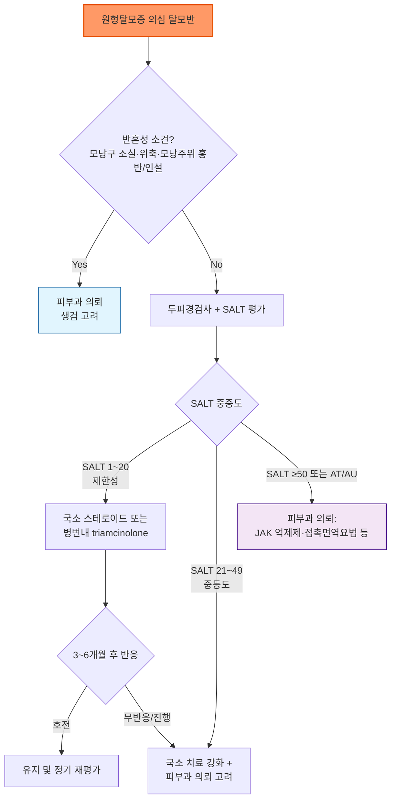

# 원형탈모증 Alopecia Areata (AA)

## <mark style="color:green;">일반 사항</mark>

* 원형탈모증은 모낭이 보존되는 **비반흔성(non-scarring) 자가면역성 탈모질환**이다. 두피뿐 아니라 눈썹·속눈썹·수염과 전신의 털을 침범할 수 있다.
* 정의(BAD Living Guideline 2025) : 모낭을 표적으로 하는 만성 염증성 질환으로, 두피의 반점형 탈모로 흔히 발현하며 손발톱을 침범하기도 한다.
* 평생 발생 위험은 약 2%로 알려져 있으며 소아부터 고령자까지 모든 연령에서 발생할 수 있으나 젊은 연령에서 비교적 흔하다.
* 모낭 자체가 파괴되는 질환은 아니므로 재성장 가능성이 있다. 다만 자연 경과는 예측하기 어렵고, 제한된 탈모반은 자연 회복되기도 하지만 **재발과 진행이 흔하다**.
* 전두탈모(alopecia totalis), 전신탈모(alopecia universalis), 어린 연령의 발병, ophiasis 형태, 장기간 지속, 손발톱 침범은 불량한 경과와 연관된다.

## <mark style="color:green;">원인 및 병태생리</mark>

* 유전적 소인이 있는 사람에서 모낭의 면역특권(immune privilege)이 붕괴되고, 세포독성 T세포와 IFN-γ/JAK-STAT 신호가 모구(hair bulb) 주변의 염증을 유발하여 성장기 모낭을 조기에 퇴행기로 전환시키는 것으로 이해한다.
* 감염·약물·백신·심리적 스트레스가 일부 환자에서 발병 전 관찰되기도 하지만, 개별 환자에서 원인으로 단정할 수 없다.
* 혈중 비타민 D 저하와의 연관성이 보고되었으나 인과관계와 보충 치료의 발모 효과는 확립되지 않았다(BAD Living Guideline 2025).

### <mark style="color:orange;">동반 질환 및 관련 인자</mark>

* 자가면역 갑상선질환, 백반증, 1형 당뇨병, 악성빈혈 등 자가면역질환 — 갑상선질환 위험은 평생 지속되는 것으로 간주한다.
* 아토피피부염, 천식, 알레르기비염
* 원형탈모증 또는 자가면역질환의 가족력
* 우울·불안, 낙인감, 사회적 위축 등 정신사회적 부담 : 탈모 범위와 별개로 반드시 평가한다. BAD Living Guideline 2025는 PHQ-4·PHQ-9(우울), GAD-7(불안), DLQI(삶의 질) 등 간단한 선별 도구를 이용한 정기 평가를 권고한다.

## <mark style="color:green;">임상 양상</mark>

* 경계가 비교적 명확한 원형 또는 타원형의 갑작스러운 탈모반이 전형적이다. 병변 피부는 대개 정상이며 모낭구(follicular ostia)가 보존된다.
* 활동성 병변의 가장자리에서 **느낌표 모발(exclamation-mark hair)**, 검은 점(black dots), 부러진 모발과 양성 모발당김검사가 관찰될 수 있다. 느낌표 모발은 두피 쪽 근위부가 가늘어진 짧은 모발이다.
* 재성장 초기에는 가늘고 색소가 적은 솜털이 보일 수 있으며 이후 굵고 색소가 있는 종말모로 바뀐다.
* 손발톱에는 소와(pitting), trachyonychia, 종주선, 백색 변화 등이 동반될 수 있다.

### <mark style="color:orange;">임상 형태</mark>

* **Patchy AA** : 하나 이상의 국소 탈모반
* **Ophiasis** : 후두부·측두부 모발선을 따라 띠 모양으로 침범
* **Alopecia totalis (AT)** : 두피 모발 전체 소실
* **Alopecia universalis (AU)** : 두피·얼굴·체모를 포함한 전신의 털 소실
* **Diffuse AA / alopecia areata incognita** : 뚜렷한 원형 탈모반 없이 급성 미만성 탈모로 나타날 수 있어 휴지기탈모·안드로겐탈모 등과 감별이 필요하다.

### <mark style="color:$danger;">🚩 Red Flags!</mark>

<mark style="color:$danger;">**즉각 조치 또는 의뢰**</mark>

* 구체적인 자살 사고 또는 심한 우울·불안 위기 → 즉시 정신건강 위기 평가 및 안전 확보(자살예방상담전화 109)
* 접촉면역요법(DPCP/SADBE) 시행 후 전신 두드러기·안면부종·호흡곤란 등 아나필락시스양 반응 → 즉시 응급 처치

<mark style="color:$warning;">**당일 또는 조기 의뢰**</mark>

* 모낭구 소실, 위축, 모낭주위 홍반·인설, 통증·작열감 등 **반흔성 탈모 의심** → 조기 피부과 의뢰(생검 고려)
* 빠르게 진행하는 광범위 탈모, SALT ≥50, AT/AU, 눈썹·속눈썹의 현저한 소실, 손발톱 기능장애 → 피부과 의뢰
* 진단이 불확실한 경우, 특히 소아의 염증성·인설성 병변(두부백선 등과 감별 필요) → 조기 피부과 의뢰

<mark style="color:$info;">**외래 추적 / 추가 평가 계획**</mark> <mark style="color:$info;">- 즉각 위험 낮으나 호전 없으면 의뢰</mark>

* 3\~6개월의 적절한 국소 치료에도 진행하거나 반응이 없는 경우 → 피부과 의뢰
* 소아에서 경과 관찰 중인 작은 안정 병변 — 진행 여부를 정기적으로 추적

## <mark style="color:green;">진단</mark>

* 대부분 병력과 전형적인 임상 소견으로 진단한다.
* 두피경검사(trichoscopy) : 보존된 모낭구, 황색 점(yellow dots), 검은 점, 느낌표 모발, 짧은 솜털 등을 확인한다.
* 조직검사는 보통 불필요하다. 진단이 불확실하거나 반흔성 탈모가 의심되면 피부과에서 고려한다.
* 치료 전 표준화된 두피 사진을 남기고, 두피 침범이 있으면 SALT 점수로 범위와 치료 반응을 기록한다.

### <mark style="color:orange;">SALT 기반 중증도</mark>

* SALT 0 : 두피 탈모 없음
* SALT 1\~20 : 제한성(경증)
* SALT 21\~49 : 중등도
* SALT 50\~100 : 중증
* 눈썹·속눈썹의 뚜렷한 침범, 현저한 정신사회적 영향, 6개월 이상 적절한 치료에 불충분한 반응, 빠르게 진행하는 미만성 활동성이 있으면 두피 면적만으로 평가한 중증도를 한 단계 높여 판단할 수 있다.

### <mark style="color:orange;">검사</mark>

* **전형적인 원형탈모증에서 일률적인 혈액검사는 필요하지 않다.**
* 갑상선검사(TSH ± free T4, 필요 시 갑상선 자가항체)는 갑상선 증상·징후, 갑상선질환 가족력, Down syndrome, 아토피, AT/AU 등 위험이 있을 때 선택적으로 고려한다.
* 철분상태(ferritin, iron/TIBC), 아연, 비타민 D의 routine screening은 근거가 부족하다(BAD Living Guideline 2025 — 철분 보충의 발모 효과를 입증한 연구 없음). 미만성 탈모, 빈혈 위험, 영양결핍 의심 등 별도의 임상 적응증이 있을 때만 선택적으로 검사한다.
* 인설·염증·후두부 림프절종대가 있으면 KOH/진균배양을, 위험력과 좀먹은 모양 탈모가 있으면 매독 혈청검사를 고려한다.

### <mark style="color:orange;">감별 진단</mark>

<table><thead><tr><th width="140">질환</th><th>핵심 감별점</th></tr></thead><tbody><tr><td>두부백선</td><td>소아에서 흔함; 인설·홍반·농포, 부러진 모발, 후두부 림프절종대. KOH/배양</td></tr><tr><td>발모벽(trichotillomania)</td><td>불규칙한 경계, 길이가 다양한 부러진 모발; 느낌표 모발보다 flame hair·V-sign 등</td></tr><tr><td>반흔성 탈모</td><td>모낭구 소실, 위축, 모낭주위 홍반·인설·통증/작열감. 조기 피부과 의뢰 및 생검 고려</td></tr><tr><td>측두삼각탈모</td><td>어린 시절부터 안정적인 전측두부 삼각형 병변, 솜털 존재; 황색 점·검은 점·느낌표 모발 없음</td></tr><tr><td>견인성 탈모</td><td>견인성 헤어스타일 병력, 모발선 중심, fringe sign; 장기화 시 반흔 가능</td></tr><tr><td>휴지기/성장기 탈모</td><td>미만성 탈락, 유발 사건·약물·항암치료 병력; 전형적인 원형 탈모반이 없음</td></tr><tr><td>이차매독</td><td>여러 부위의 좀먹은 모양(moth-eaten) 탈모, 성접촉 위험 또는 다른 이차매독 소견</td></tr><tr><td>전신홍반루푸스</td><td>미만성 또는 patchy 탈모와 전신 증상; 원반루푸스는 반흔·위축·모낭마개 동반 가능</td></tr></tbody></table>

### <mark style="color:orange;">미만성 탈모의 두피경 감별</mark>

<table><thead><tr><th width="170">질환</th><th>두피경 및 임상 단서</th></tr></thead><tbody><tr><td>미만성 원형탈모증</td><td>황색 점, 검은 점, 부러진 모발, tapering hair·느낌표 모발, 짧은 재성장 솜털. 황색 점 단독은 비특이적이므로 다른 소견과 함께 판단</td></tr><tr><td>휴지기탈모</td><td>미만성 탈락과 다양한 길이의 균일한 굵기 재성장모. 특징적인 검은 점·tapering hair는 대개 없으며 두피경 소견은 비특이적</td></tr><tr><td>안드로겐탈모</td><td>모발 굵기 다양성, 가늘어진 모발, 단일 모발 모낭단위 증가와 특징적인 부위별 분포</td></tr></tbody></table>

***



<p align="center"><strong>진단 및 중증도 기반 치료 알고리듬</strong></p>

<p align="center"><em><mark style="color:$info;">Ref. British Association of Dermatologists Living Guideline for Alopecia Areata 2025; 건강보험심사평가원 바리시티닙 급여기준(2026.7.1 시행)</mark></em></p>

***

## <mark style="background-color:$warning;">Management</mark>

### <mark style="color:orange;">치료 방침</mark>

* 치료 여부는 탈모 범위·진행 속도·발병 기간·연령·동반 부위·이전 치료 반응과 환자의 선호 및 정신사회적 영향을 함께 고려하여 결정한다.
* 작고 안정적인 탈모반은 설명 후 경과 관찰도 가능하다. 그러나 "소아는 자연 치유되므로 치료가 필요 없다"고 일률적으로 판단하지 않으며, 치료를 원하면 강한 역가의 국소 스테로이드를 우선 고려한다.
* 성인의 제한성\~중등도 병변은 국소 스테로이드 또는 병변내 triamcinolone이 1차 선택이다.
* minoxidil은 면역 염증을 치료하는 단독 1차제가 아니라 모발 밀도와 유지에 도움을 줄 수 있는 **보조요법**이다.
* 중등도\~중증, 빠른 진행, AT/AU, 눈썹·속눈썹 또는 손발톱의 유의한 침범, 국소 치료 실패에서는 피부과 의뢰 후 접촉면역요법·전신면역조절제·허가된 경구 JAK 억제제를 고려한다.
* 갈색 및 검은 피부(brown and black skin) 등 짙은 피부색에서는 국소·병변내 corticosteroid에 의한 피부 탈색소와 접촉면역요법에 의한 백반증 및 국소 색소침착·저색소침착 위험을 고려한다. 치료 전 잠재적인 피부 색소변화를 별도로 설명한다(BAD Living Guideline 2025, R5).

## <mark style="color:green;">비-약물 치료 및 예방</mark>

* 외모 및 삶의 질 개선이 기대되는 환자에게 가발·헤어피스·눈썹 문신(마이크로피그멘테이션)·헤어스타일링 등 위장 방법을 적극적으로 제안한다. 이는 치료 실패가 아니라 삶의 질을 높이는 정당한 관리 방법이다(BAD Living Guideline 2025).
* 탈모 부위 두피는 자외선에 취약하므로 모자·자외선 차단제 사용을 권장한다.
* 속눈썹이 소실되면 이물질 차단 기능이 줄어들므로 인공눈물 등으로 안구 표면을 보호하도록 안내한다.
* 확립된 근거 없는 비타민·아연·철분 보충제를 단독 치료로 권하지 않는다; 검사에서 결핍이 확인된 경우에만 교정한다.
* 정신사회적 부담이 확인되면 정신건강의학과 협진과 환자 모임·지지단체 정보 제공을 고려한다.

## <mark style="color:green;">약물 치료</mark>

### <mark style="color:orange;">국소 치료</mark>

#### <mark style="color:$primary;">국소 Steroid</mark>

* 두피 원형탈모증의 1차 치료로 강한 또는 매우 강한 역가의 제제를 **1일 1회, 3\~6개월 범위에서** 사용한다. 6\~12주 후 초기 반응과 피부 부작용을 확인하고 이후 정기적으로 재평가한다.
* 예 : clobetasol propionate 0.05% <mark style="color:blue;">\[더모베이트]</mark> 얇게 qd. 제형은 병변 위치와 두피 상태에 맞춘다.
* 소아·청소년에서는 6주 사용–6주 휴약–6주 재사용과 같은 간헐 요법을 고려할 수 있다.
* 부작용 : 모낭염, 모세혈관확장, 피부위축, 저색소증. 어두운 피부색에서는 색소 변화 위험을 사전에 설명한다. 병변 위치·면적과 1회 사용량을 구체적으로 지정하고 광범위한 두피에 장기간 무제한 사용하지 않는다. 모발 재성장이 확인되면 사용 빈도 감량 또는 중단을 고려하며, 피부위축·모세혈관확장·모낭염이 발생하면 즉시 중단하거나 치료를 변경한다.

#### <mark style="color:$primary;">병변내 Steroid 주사</mark>

* 성인의 제한성\~중등도 원형탈모증에서 1차 선택으로 고려한다. 통증 때문에 소아에서는 연령과 협조도를 고려하여 선별적으로 시행한다.
* triamcinolone acetonide는 성인 두피에서 **5 ㎎/㎖로 시작**하는 것이 일반적이며(허용 범위 2.5\~10 ㎎/㎖), 탈모반과 경계에 1 ㎝ 간격으로 0.1 ㎖/㎠씩 피내 주사한다. 보통 6\~12주 간격으로 반복하며 회당 총량은 병변 범위와 기관 프로토콜에 따른다.
* 눈썹·수염 등 피부가 얇거나 위축 위험이 큰 부위에는 **2.5 ㎎/㎖ 정도의 저농도**를 우선 고려한다. 눈 주위 병변은 세심한 주사 깊이가 필요하고 안구 합병증 위험이 있어 숙련된 피부과에서 시행한다.
* 3\~6개월 내 반응이 없거나 위축이 발생하면 중단·변경한다.
* 부작용 : 통증, 일시적 피부/피하지방 위축, 모세혈관확장, 저색소증. 국소마취크림·냉각·진동 등을 통증 감소에 활용할 수 있다.

#### <mark style="color:$primary;">Minoxidil</mark>

* 다른 치료와 병용하는 보조요법으로 사용한다. 염증을 억제하는 치료가 아니므로 활동성·광범위 질환의 단독 치료로 권하지 않는다.
* 원형탈모증에 대한 국소 minoxidil 사용은 보조적 치료이며 국내 허가 적응증에 포함되지 않을 수 있다. 제품별 허가사항과 성별·연령 제한을 확인하고 환자에게 허가 외 사용 여부를 설명한다. 일부 5% 제품은 갑작스럽거나 반점형인 탈모를 사용 제외 대상으로 규정하므로 해당 제품설명서를 반드시 확인한다.
* 예 : minoxidil 5% 용액 또는 폼 <mark style="color:blue;">\[마이녹실 등]</mark> qd\~bid.
* 부작용 : 자극/알레르기 접촉피부염, 원치 않는 얼굴 다모증, 초기 일시적 탈락 증가. 임신·수유 중 사용은 피한다.

#### <mark style="color:$primary;">Dithranol(Anthralin)</mark>

* 접촉 자극을 이용하는 치료로, 특히 소아·청소년 또는 다른 국소 치료가 어려운 경우 피부과에서 고려할 수 있다.
* short-contact therapy로 낮은 접촉시간부터 시작해 견딜 수 있는 경도의 피부염이 생기도록 조절한다.
* 부작용 : 자극성 피부염, 피부·모발·의복 착색. 눈과 얼굴에 닿지 않도록 한다.
* 국내 1·2차 의료기관에서 통상적으로 구비하기 어렵고 별도 조제 또는 공급처 확인이 필요하여 실제 임상 적용이 제한될 수 있다.

#### <mark style="color:$primary;">접촉면역요법</mark>

* DPCP(diphenylcyclopropenone) 또는 SADBE(squaric acid dibutyl ester)를 중등도\~중증 원형탈모증에 고려한다.
* 먼저 감작한 뒤 낮은 농도에서 시작하여 경도의 습진 반응을 목표로 농도를 조절하는 전문 치료이다. 심한 피부염·림프절병증·두드러기·색소변화·백반증이 발생할 수 있으므로 피부과에서 시행한다. 어두운 피부색에서는 색소 변화 위험이 더 크다(BAD Living Guideline 2025).
* DNCB는 돌연변이 유발 우려 때문에 사용하지 않는다.

### <mark style="color:orange;">전신 치료</mark>

* 전신치료는 중등도\~중증 또는 빠르게 진행하는 질환에서 피부과 전문의가 이득과 위험을 평가하여 시행한다.

#### <mark style="color:$primary;">전신 Steroid</mark>

* 빠르게 진행하는 원형탈모증 또는 일부 중등도\~중증 질환에서 단기 관해 유도 목적으로 고려할 수 있다.
* 예 : prednisolone 약 0.5 ㎎/㎏/일에서 시작하여 6\~12주에 걸쳐 감량하는 방법이 있으나, 최적 요법은 확립되지 않았고 중단 후 재발이 흔하다.
* 월 1회 prednisolone 5 ㎎/㎏ 또는 300 ㎎을 투여하는 펄스요법도 국내외 문헌에 보고되어 있으나, 근거와 투여법이 충분히 표준화되지 않았다. 일상적인 1차 치료로 권고하기보다는 피부과 전문의가 환자를 선별하여 고려한다. 전신 steroid는 장기 유지요법으로 사용하지 않는다.
* methotrexate, ciclosporin, azathioprine 등은 일부 환자에서 steroid-sparing 치료로 고려할 수 있으며, 중등도\~중증 환자에서 전신 steroid와 병용해 재발 위험을 줄이는 목적으로도 쓰일 수 있으나 전문의 처방과 약제별 모니터링이 필요하다.

#### <mark style="color:$primary;">Janus kinase(JAK) 억제제</mark>

<table><thead><tr><th width="190">약제</th><th width="230">2026년 8월 국내 허가 범위</th><th width="170">일반적 허가 용량</th><th>비고</th></tr></thead><tbody><tr><td>Baricitinib <mark style="color:blue;">\[올루미언트]</mark></td><td>중증 원형탈모증 : 성인 및 만 12세 이상이면서 체중 30 ㎏ 이상인 청소년</td><td>통상 4 ㎎ qd; 고령자·만성/재발성 감염 위험 등에서는 2 ㎎ 고려</td><td>King 등이 2건의 3상 임상시험(BRAVE-AA1·BRAVE-AA2)을 보고함(NEJM 2022). 성인 중증 원형탈모증은 2026-07-01부터 조건부 급여</td></tr><tr><td>Ritlecitinib <mark style="color:blue;">\[리트풀로캡슐 50 ㎎]</mark></td><td>성인 및 만 12세 이상 청소년의 중증 원형탈모증</td><td>50 ㎎ qd</td><td>2024년 9월 국내 허가. 효과·위험을 정기 재평가하며 36주까지 치료 이득이 없으면 중단 고려(국내 제품설명서, 2025-05-19 개정)</td></tr><tr><td>Deuruxolitinib(Leqselvi)</td><td>국내 미허가 (2026년 8월 기준)</td><td>—</td><td>미국·영국에서는 승인됨; CYP2C9 대사저하 환자는 투여 권장되지 않음</td></tr><tr><td>Tofacitinib, ruxolitinib 등</td><td>원형탈모증 국내 허가 치료제가 아님</td><td>—</td><td>off-label 사용; 허가된 JAK 억제제와 구분. 국소 JAK 억제제의 근거도 불충분</td></tr></tbody></table>


**바리시티닙 성인 중증 원형탈모증 급여 기준 (2026-07-01 시행)**\
전신 corticosteroid 또는 ciclosporin 등 기존 치료를 3개월 이상 시행했으나 SALT가 30% 이상 감소하지 않았거나 부작용 등으로 지속할 수 없고, ① SALT ≥50 또는 ② 20≤SALT<50이면서 눈썹 및 속눈썹 모두에 탈락 또는 명확한 단절이 있는 경우에 인정된다. 36주차에 SALT ≤20이어야 계속 투여가 인정되고 이후 6개월마다 평가하며 최대 2년까지 인정된다.\
✽투여 전 병변 사진, SALT 산출 근거, 선행 치료 및 이상반응을 객관적으로 기록한다. **급여기준은 변경될 수 있으므로 처방 시점의 최신 건강보험 고시를 반드시 확인한다. 특히 청소년 및 다른 JAK 억제제의 급여 여부를 성인 기준과 동일하다고 간주하지 않는다.**


* **투여 전 체크리스트**
  * 활동성 감염과 중증·반복 감염 병력을 평가한다.
  * 결핵은 IGRA 또는 TST로 선별한다. 양성, 결핵 증상 또는 고위험력이 있으면 흉부 X-ray와 추가 평가를 시행한다.
  * B형간염은 HBsAg, anti-HBc, anti-HBs를, C형간염은 anti-HCV를 확인하고 양성이면 HCV RNA 등 추가 평가를 시행한다.
  * CBC with differential, AST/ALT를 확인한다. Baricitinib은 Hb·ANC·ALC, Cr/eGFR 및 지질검사를 포함하고, ritlecitinib은 특히 ALC·혈소판수를 확인하며 필요 시 간기능과 CPK를 약제 허가사항에 따라 평가한다.
  * 임신 가능성과 피임, 예방접종 상태를 확인하고 필요한 예방접종을 가능하면 투여 전에 완료한다. 치료 중 생백신은 피한다.
* 약제별 검사 항목·투여 제한·추적 간격이 다르므로 해당 제품설명서를 따른다. Ritlecitinib에서는 지질검사를 일률적으로 요구하지 않는다.
* 중대한 감염, 대상포진, 혈구감소, 간효소·지질 변화, 혈전색전증, 주요 심혈관사건, 악성종양 위험을 설명한다. 특히 65세 이상, 흡연자, 심혈관·혈전·악성종양 위험군에서는 신중히 선택한다.
* 다른 JAK 억제제, 생물학적 면역조절제, ciclosporin 등 강력한 면역억제제와의 병용은 권장하지 않는다.
* 반응이 나타나기까지 수개월이 걸릴 수 있으며 중단 후 재발 가능성이 있어 장기 계획과 정기적인 SALT/사진 평가가 필요하다.

## <mark style="color:green;">시술 및 기타 처치</mark>

### <mark style="color:orange;">광선치료</mark>

* PUVA는 위험–이득을 고려하여 선택된 환자에서만 시행한다. 특히 갈색 및 검은 피부에서 국소적 치료를 원하는 경우, 접촉면역요법에 따른 피부 탈색소 위험을 피하기 위한 선택지로 더 수용 가능할 수 있다. 시행 시 짧은 치료 주기, 작은 치료 면적 및 제한된 치료기간을 고려하며, 장기 광독성·광노화·피부암 위험과 재발 가능성도 함께 평가한다(BAD Living Guideline 2025, R36).
* NB-UVB, excimer, low-level laser 등은 원형탈모증에 일률적으로 권고할 근거가 불충분하다. Prednisolone과 PUVA 병용도 표준치료로 권하지 않는다.

***

### <mark style="color:red;">질병코드</mark>

L63 원형탈모증

L63.0 전두탈모

L63.1 전신탈모

L63.2 사행성 탈모증(ophiasis)

L63.8 기타 원형탈모증

L63.9 상세불명의 원형탈모증

***

## <mark style="color:purple;">처방례</mark>

> **처방례 1. 성인 제한성 두피 원형탈모증**
>
> ```
> Clobetasol propionate 0.05% 로션  병변에 얇게 도포  qd × 6~12주
> Minoxidil 5% 액상/폼          qd~bid  필요시 병용
> ```
>
> _✽강한 역가 국소 스테로이드가 1차 치료이며 minoxidil은 모발 밀도 유지를 위한 보조요법으로 병용할 수 있다. 원형탈모증에 대한 minoxidil의 허가 외 사용 여부와 제품별 제한을 확인·설명한다. 두 제제를 같은 부위에 바를 때는 한 제제가 마른 뒤 다른 제제를 도포하도록 안내한다. 6\~12주 후 표준 사진과 SALT로 반응 및 피부 부작용을 확인한다. 모발 재성장이 확인되면 clobetasol의 사용 빈도 감량 또는 중단을 고려한다._

> **처방례 2. 성인 제한성\~중등도 병변내 주사**
>
> ```
> Triamcinolone acetonide 5 ㎎/㎖   병변 내 0.1 ㎖/㎠, 1 ㎝ 간격 피내주사
> ```
>
> _✽성인 두피의 1차 선택 시작 농도이며 허용 범위는 2.5\~10 ㎎/㎖이다. 6\~12주 간격으로 반복하고, 3\~6개월 내 반응이 없거나 피부위축이 발생하면 중단·변경한다. 눈썹·수염 등 피부가 얇거나 위축 위험이 큰 부위는 2.5 ㎎/㎖ 정도의 저농도를 우선 고려하며, 눈 주위 병변은 안구 합병증 위험이 있어 피부과 의뢰를 우선한다._

> **처방례 3. 소아·청소년 제한성 병변 (간헐 요법)**
>
> ```
> Clobetasol propionate 0.05% 로션  병변에 얇게 도포  qd, 6주 사용-6주 휴약 반복
> ```
>
> _✽소아·청소년에서는 지속적 매일 사용 대신 6주 사용–6주 휴약–6주 재사용과 같은 간헐 요법으로 피부위축 등 국소 부작용 위험을 줄일 수 있다. 병변내 주사는 통증 때문에 협조 가능한 연령에서 선별적으로 고려한다._

***

### <mark style="color:$success;">핵심 복약 지도</mark>

> **국소 스테로이드 사용법**
>
> * 병변에만 얇게 바르고 정상 피부에는 바르지 않습니다.
> * 처방된 면적과 기간을 지키고 광범위한 두피에 임의로 장기간 사용하지 않습니다.
> * 6\~12주 후 치료 반응과 피부위축·모낭염 등 부작용을 확인하고, 모발이 자라면 의료진의 지시에 따라 사용 횟수를 줄이거나 중단합니다.

> **Minoxidil은 보조 치료입니다**
>
> * 염증을 가라앉히는 치료가 아니므로 활동성·광범위 질환에서 단독으로 사용하지 않습니다.
> * 얼굴로 흐르지 않도록 바르고, 자극이나 원치 않는 얼굴 털이 생기면 상담하십시오.

> **치료 반응은 수개월 단위로 평가합니다**
>
> * 치료 후 바로 모발이 자라지 않으며, 반응 평가에는 보통 수개월이 필요합니다.
> * 새로 자라는 털은 처음에 가늘고 희게 보일 수 있으나 점차 굵고 색이 돌아올 수 있습니다.

> **언제 다시 병원을 방문해야 하나요?**
>
> * 탈모가 갑자기 넓어지거나 눈썹·속눈썹까지 빠지는 경우
> * 국소 스테로이드 사용 부위에 피부가 얇아지거나 모낭염이 생기는 경우
> * 3\~6개월의 적절한 치료에도 호전이 없는 경우
> * **심한 우울감이나 자살 생각이 드는 경우** — 예정된 방문을 기다리지 말고 즉시 내원 또는 응급 평가

***

### <mark style="color:blue;">환자 안내서</mark>


**원형탈모증, 전염되지 않으며 다시 자랄 수 있는 병입니다**

원형탈모증은 면역세포가 실수로 자신의 모낭을 공격해서 생기는 자가면역질환입니다. 위생이나 생활습관 때문에 생기는 병이 아니며, 모낭 자체가 파괴되지 않으므로 다시 자랄 가능성이 있습니다.


#### <mark style="color:$primary;">왜 원형탈모증이 생기나요?</mark>

* 유전적 소인이 있는 사람에서 면역세포가 모낭을 이물질로 착각해 공격하면서, 자라던 털이 일찍 빠지는 것으로 알려져 있습니다.
* 감염, 약물, 심한 스트레스가 발병 전에 있었던 경우도 있지만, 특정 원인 하나로 단정할 수는 없습니다. **스트레스가 악화 요인이 될 수는 있지만 환자분의 잘못이 아닙니다.**

#### <mark style="color:$primary;">치료는 어떻게 진행되나요?</mark>

* 탈모 범위와 진행 속도에 따라 바르는 약, 병변에 놓는 주사, 또는 중등도 이상에서는 먹는 약까지 치료 방법이 달라집니다.
* 치료를 시작해도 효과가 나타나기까지 보통 수개월이 걸리며, 처음 자라는 털은 가늘고 색이 옅을 수 있습니다.
* 회복 시기와 재발 여부는 정확히 예측하기 어려우며, 치료를 중단하면 재발할 수 있습니다.
* **미녹시딜은 제품에 따라 원형탈모증이 허가된 사용 목적에 포함되지 않을 수 있습니다.** 제품설명서를 확인하고 의료진으로부터 보조적 사용 목적과 허가 외 사용 여부에 관한 설명을 들으십시오.
* PUVA 등의 특수 광선치료는 일부 선택된 환자에서 피부과 전문의가 제한적으로 고려할 수 있지만, 원형탈모증의 일반적인 표준치료는 아닙니다.

#### <mark style="color:$primary;">일상생활에서 어떻게 관리하나요?</mark>

* **탈모 부위 두피는 햇볕에 약하므로 모자나 자외선 차단제로 보호하십시오.**
* **가발·헤어피스·눈썹 문신·화장 등 위장 방법도 삶의 질을 높이는 정당한 관리 방법입니다.** 치료의 실패를 의미하지 않습니다.
* 비타민이나 건강기능식품만으로 치료된다는 근거는 충분하지 않습니다. 균형 잡힌 식사가 우선입니다.

#### <mark style="color:$primary;">마음 건강도 함께 돌보세요</mark>

* **우울감·불안과 삶의 질을 살피는 마음 건강 평가는 원형탈모증 치료 과정의 일부입니다.** 탈모 범위가 작더라도 우울감·불안·대인관계의 어려움이 있다면 반드시 의료진에게 알리십시오.
* 환자 모임이나 지지 단체를 통해 경험을 나누는 것도 도움이 될 수 있습니다.
* **자살 생각이 들 정도로 힘들다면 즉시 병원을 방문하거나 자살예방상담전화 109로 연락하십시오.**

#### <mark style="color:$primary;">이럴 때는 즉시 병원을 방문하세요</mark>

* 탈모가 갑자기 넓게 번지거나 눈썹·속눈썹까지 빠질 때
* 바르는 약을 쓴 부위의 피부가 얇아지거나 통증이 생길 때
* 심한 우울감이나 자살 생각이 들 때
