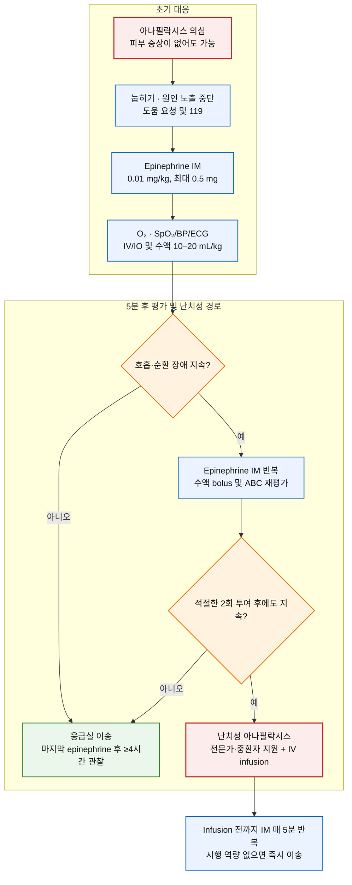

# 아나필락시스 Anaphylaxis

## <mark style="color:green;">일반 사항</mark>

* 아나필락시스는 대개 급속히 발생하며 사망할 수 있는 심각한 전신 과민반응이다. 중증 아나필락시스는 생명을 위협하는 호흡기 또는 순환기 장애를 특징으로 하지만, 피부 증상·쇼크·명백한 호흡곤란이 모두 나타나야 하는 것은 아니다.
* IgE 매개 알레르기뿐 아니라 비-IgE 매개 기전으로도 발생할 수 있으므로, '감작된 사람에서 특정 항원에 노출된 경우'로 한정하지 않는다.
* 치료의 핵심은 조기 인지와 신속한 대퇴부 근육주사 epinephrine이다. 진단기준을 완전히 충족할 때까지 투여를 미루지 않는다.
* 평생 유병률은 미국 자료에서 약 1.6\~5.1%로 보고되지만, 연구 대상과 진단기준에 따라 차이가 크다.
* **Biphasic anaphylaxis** : 초기 증상이 완전히 소실된 후 원인 물질에 재노출되지 않았는데 1\~48시간 이내 아나필락시스가 다시 발생하는 경우. 이 챕터의 기본 지침인 ASCIA 2026은 초기 아나필락시스의 \*\*3\~20%\*\*에서 48시간 이내 발생한다고 기술한다. 다른 체계적 문헌고찰과 진료지침에는 약 0.4\~20%, 중앙값 약 6.5%로 보고되어 연구 정의와 대상에 따른 차이가 크다. 중증 초기 반응과 2회 이상의 epinephrine 투여는 중요한 위험 인자이다.


**이 챕터의 근거 틀** : 급성치료 등은 [**ASCIA Guidelines for Acute Management of Anaphylaxis 2026**](https://www.allergy.org.au/hp/anaphylaxis/acute-management-guidelines)을 기본으로 하였음. 정의·진단·tryptase·자가주사기·응급의료체계 활성화는 WAO 2020 및 AAAAI/ACAAI 2023을, 항히스타민제·glucocorticoid·이중반응과 관찰은 AAAAI/ACAAI 2020 GRADE를 함께 반영하였음


## <mark style="color:green;">원인</mark>

* 음식 : 땅콩·견과류, 갑각류·어류, 우유, 계란, 밀 등
* 약물 : β-lactam 항생제와 기타 항생제, NSAID, 항암제·생물학적 제제, 근육이완제, 조영제, protamine, 면역글로불린 등
* 벌·곤충독, 뱀독, 라텍스, 수혈 및 혈액제제, 알레르겐 면역치료
* 운동, 한랭·열 등 물리적 요인 ; 음식의존 운동유발 아나필락시스
* 원인을 확인하지 못하는 특발성 아나필락시스

### <mark style="color:orange;">보조 인자 및 위험 인자</mark>

* 과거 아나필락시스 또는 중증 알레르기 반응
* 조절되지 않는 천식, 만성 호흡기질환, 심혈관질환, 고령
* 비만세포질환, 유전성 α-tryptasemia 또는 기저 tryptase 상승
* 운동, 음주, NSAID, 감염, 수면 부족, 월경 등은 일부 환자에서 반응 역치를 낮추거나 중증도를 높일 수 있음
* β-blocker 또는 ACE inhibitor 복용은 환자·원인에 따라 위험에 영향을 줄 수 있으나, 약제 중단 여부는 원래 적응증과 위험-이득을 함께 평가하여 개별화

## <mark style="color:green;">임상 양상</mark>

* 피부·점막 증상(전신 두드러기, 가려움, 홍조, 입술·혀·목젖 부종)이 흔하지만 약 10\~20%에서는 없을 수 있다.
* 호흡기 : dyspnea, wheeze·bronchospasm, stridor, 지속 기침, 저산소증
* 순환기 : 저혈압, 빈맥, collapse, 실신
* 위장관 : 심한 지속성 경련성 복통, 반복 구토. 특히 곤충 알레르기에서는 갑작스러운 복통·구토가 그 자체로 아나필락시스 징후일 수 있다.
* 영아·소아에서는 저혈압이 늦게 나타날 수 있으며, 지속적 빈맥, 창백·축 늘어짐, 보챔, 침 흘림, 졸림, 저긴장 등이 초기 소견일 수 있다.

### <mark style="color:$danger;">🚩 Red Flags!</mark>

<mark style="color:$danger;">**즉각 조치 또는 의뢰**</mark>

* 진행하는 stridor·후두부종, 청색증, 중증 bronchospasm 또는 호흡부전
* 저혈압, collapse, 의식 변화 또는 쇼크
* 적절한 IM epinephrine 2회 후에도 호흡기 또는 순환기 장애가 지속되는 난치성 아나필락시스
* 반응이 없고 정상 호흡이 없는 심정지 의심
* 곤충 알레르기에서 노출 후 갑작스러운 심한 지속성 복통 또는 반복 구토 (그 자체로 아나필락시스 징후)

<mark style="color:$warning;">**당일 또는 조기 의뢰**</mark>

* 자가주사용 epinephrine으로 증상이 완전히 소실되었으나 아직 의료기관 평가와 관찰을 받지 않은 경우
* 알려진 원인 노출 후 피부·점막에 국한된 반응이라도 빠르게 진행하거나 과거 중증 아나필락시스 병력이 있는 경우
* 관찰 후에도 중증 초기반응, 반복 epinephrine, 과거 이중반응, 중증 천식 또는 의료 접근성 저하가 확인되면 퇴원시키지 말고 야간 또는 입원 관찰을 고려한다.

<mark style="color:$info;">**외래 추적 / 추가 평가 계획**</mark>

* 급성 증상과 관찰이 종료된 뒤 원인이 확인되지 않은 초회 아나필락시스
* 원인 회피교육, 자가주사기 처방·재교육, action plan, 동반 천식 조절 및 알레르기 전문의 의뢰가 필요한 경우
* 재발성·특발성·중증 반응에서 baseline tryptase 및 비만세포질환 평가가 필요한 경우

즉시 조치 단계에서는 환자를 눕히고 IM epinephrine을 투여하며 119·응급대응 인력을 호출한다. 난치성 아나필락시스는 '당일 의뢰' 단계가 아니라 즉각적인 전문가·중환자 지원이 필요한 단계이다. 당일 의뢰 단계에서 진행성 호흡·순환 증상 또는 재발이 나타나면 즉시 첫 번째 단계로 전환한다. 외래 추적 단계는 급성 증상이 없는 안정기 추적이며, 현재 진행 중인 반응을 외래에서 기다리는 단계가 아니다.

## <mark style="color:green;">진단</mark>

* 아나필락시스는 임상적으로 진단한다. 검사 결과를 기다리느라 epinephrine 투여와 소생 처치를 지연하지 않는다.
* 갑작스러운 bronchospasm, 상기도 폐쇄 또는 저혈압이 있고 아나필락시스 가능성이 있다면 피부 증상이 없어도 진단하고 치료할 수 있다.

### <mark style="color:orange;">임상 진단기준</mark>

현재 NIAID/FAAN 2006 또는 WAO 2020 기준을 진단 보조도구로 사용할 수 있다. 다음 NIAID/FAAN 3개 기준 중 하나 이상이면 아나필락시스 가능성이 높다.

1. 피부 또는 점막 증상(예: 전신 두드러기, 가려움, 홍조, 입술·혀·목젖 부종)이 수 분\~수 시간 내 갑자기 발생하면서 다음 중 하나 이상
   1. 호흡기 장애 : dyspnea, wheeze·bronchospasm, stridor, PEF 감소, hypoxemia
   2. 혈압 감소 또는 말단장기 기능장애 증상 : hypotonia·collapse, 실신, 요실금
2. 해당 환자에게 가능성 높은 알레르겐 노출 후 다음 중 2개 이상이 빠르게 발생
   1. 피부·점막 증상
   2. 호흡기 장애
   3. 혈압 감소 또는 관련 증상
   4. 지속적인 위장관 증상 : 경련성 복통, 반복 구토
3. 해당 환자에게 알려진 알레르겐 노출 후 수 분\~수 시간 내 혈압 감소
   1. 영아·소아 : 연령별 낮은 SBP 또는 평소보다 30% 초과 감소
   2. 성인 : SBP <90 mmHg 또는 평소보다 30% 초과 감소

낮은 SBP 기준 : 1개월\~1세 <70 mmHg, 1\~10세 <(70 + 2 × 나이) mmHg, 11\~17세 <90 mmHg.


진단기준은 역학·기록 및 진단의 일관성에 유용하지만 치료 문턱과 동일하지 않다. 진행 가능성이 있는 전신 과민반응에서는 기준을 모두 충족하기 전에도 epinephrine을 투여할 수 있다.


### <mark style="color:orange;">검사</mark>

* **Acute serum tryptase** : 가능한 한 빨리 채혈하되 치료를 지연하지 않는다. 이상적으로 증상 시작 1\~2시간 이내, 늦어도 4시간 이내 채혈한다.
* **Baseline tryptase** : 완전 회복 24시간 이후 또는 추후 알레르기 진료 시 재측정하여 급성기 수치와 비교한다.
* 정상 tryptase는 아나필락시스를 배제하지 않으며, 특히 음식 유발 반응에서는 상승하지 않을 수 있다.
* 재발성·특발성·중증 아나필락시스, 특히 저혈압이 동반되었거나 비만세포질환이 의심되는 경우 baseline tryptase 평가가 중요하다.
* 원인 확인을 위한 피부검사·특이 IgE·유발검사는 급성기 안정화 후 알레르기 전문의가 병력과 의심 원인에 따라 계획한다.

### <mark style="color:orange;">감별 진단</mark>

* 실신·미주신경성 반응, 특히 채혈·주사 직후 발생한 경우 아나필락시스와 혼동되기 쉽다. 피부·호흡기 증상 유무와 서맥/빈맥 여부로 감별한다.

<table data-header-hidden><thead><tr><th width="110"></th><th></th><th></th></tr></thead><tbody><tr><td><strong>특성</strong></td><td><strong>Anaphylaxis</strong></td><td><strong>Vasovagal reaction</strong></td></tr><tr><td><strong>발생 시점</strong></td><td>대개 노출 후 수 분~수 시간; 주사 후 15~30분 이내가 흔함</td><td>대개 주사 직후 수 초~수 분, 흔히 15분 이내</td></tr><tr><td><strong>의식</strong></td><td>불안, 어지러움, 혼란, collapse 또는 의식 소실</td><td>실신감, 터널 시야(주변이 어두워지며 눈앞이 좁아지는 느낌), 소리가 멀어지거나 잘 들리지 않음, 일시적 의식 소실; 눕히면 빠르게 호전</td></tr><tr><td><strong>호흡</strong></td><td>호흡곤란, 지속 기침, 천명, stridor, 저산소증</td><td>대개 정상 또는 느림; 불안 시 빈호흡</td></tr><tr><td><strong>맥박·혈압</strong></td><td>대개 빈맥과 저혈압, 약한 맥박</td><td>서맥이 흔하며 저혈압 동반 가능</td></tr><tr><td><strong>피부</strong></td><td>가려움, 두드러기, 홍조, 혈관부종; 피부 증상이 없을 수도 있음</td><td>창백, 발한, 차고 축축함; 두드러기·혈관부종 없음</td></tr><tr><td><strong>위장관</strong></td><td>심한 복통, 반복 구토, 설사 가능</td><td>구역, 간혹 구토</td></tr></tbody></table>

***



<p align="center"><strong>의료기관에서의 급성치료 알고리듬</strong></p>

<p align="center"><em><mark style="color:$info;">Ref. ASCIA Guidelines for Acute Management of Anaphylaxis, updated July 2026. allergy.org.au</mark></em></p>

***

## <mark style="background-color:$warning;">Management</mark>

> 119 연락과 epinephrine 투여는 우선순위를 다투는 순차적 절차가 아니라 가능한 인력이 동시에 시행해야 하는 조치이다. 혼자인 경우에도 119 연락 때문에 epinephrine 투여를 지연하지 않는다.

### <mark style="color:orange;">1. 즉시 시행할 처치</mark>

1. **자세**
   * 환자를 눕히고 서거나 걷지 못하게 한다. 회복된 것처럼 보여도 화장실이나 구급차까지 걷게 하지 않는다.
   * 아나필락시스에서는 전신 혈관확장과 모세혈관 누출로 정맥환류가 감소한다. 이때 갑자기 일어서거나 걷게 하면 심실 충만이 더 감소하여 급격한 저혈압·collapse 또는 심정지가 발생할 수 있다(이른바 **empty ventricle syndrome**).
   * 순환기 장애가 있으면 바로 눕히고 다리를 약간 올린다.
   * 주로 호흡곤란이 있는 환자는 다리를 앞으로 뻗은 상태로 앉을 수 있으나, 의식 변화나 혈압 저하가 나타나면 즉시 눕힌다. 의자에 다리를 아래로 내리고 앉히지 않는다.
   * 의식이 없거나 구토하면 recovery position, 임신부는 좌측와위로 둔다. 영아·어린 소아는 보호자가 똑바로 눕혀 안거나 다리를 뻗은 자세로 안고, 어깨 위로 세워 안지 않는다.
2. **원인 노출 중단**
   * 약물·조영제·수액 주입을 중단한다. 보이는 벌침은 신속히 제거한다. 음식 섭취는 중단한다.
3. **도움 요청 및 119 연락**
   * 의료기관 내 응급대응 인력을 호출하고 병원 밖이라면 119를 요청한다. epinephrine 투여와 이송 준비를 동시에 진행한다.
4. **Epinephrine IM**
   * 1 mg/mL(1:1,000) 제제를 대퇴부 전외측에 **0.01 mg/kg(=0.01 mL/kg), 1회 최대 0.5 mg(0.5 mL)** 근육주사한다. 대둔근(엉덩이)에는 주사하지 않는다.
   * **의료기관의 ampoule·주사기 투여**는 성인에서 보통 0.5 mg IM이다. **국내 자가주사기**는 젝스트 300 μg(0.3 mg) 또는 150 μg(0.15 mg)의 고정용량이므로, 자가주사기 용량을 의료기관의 체중 기반 표준용량과 혼동하지 않는다.
   * 반응이 없거나 불충분하면 **5분 후 반복**한다. 생명을 위협하는 호흡·순환 증상이 지속되면 추가 투여를 지연하지 않는다.
   * 급성 아나필락시스에서 IM epinephrine의 **절대적 금기는 없다.** 고령, 임신, 심혈관질환 또는 β-blocker 복용은 면밀한 감시가 필요한 상황이지, 필요한 epinephrine을 미루거나 생략할 근거가 아니다.
   * SC 주사는 흡수가 느리고 예측하기 어려우므로 사용하지 않는다. IV bolus epinephrine은 권고하지 않는다. 예외적으로 숙련된 급성기 전문의가 관리하는 peri-arrest 상황에서 infusion을 준비하는 동안 **1 μg/kg(최대 50 μg)을 1\~2분에 걸쳐 IV**로 투여할 수 있으나, 일반 의원이나 통상적 아나필락시스 치료에 적용하지 않는다.
5. **모니터링과 지지요법**
   * SpO₂, 혈압, ECG를 모니터링하고 고유량 산소를 투여한다.
   * IV access를 확보한다. 저혈압·쇼크 또는 치료 반응이 불충분하면 NaCl 0.9% **10\~20 mL/kg을 rapid bolus**로 투여하고 반응에 따라 반복한다. 대량 수액이 필요하면 전해질과 산-염기 상태를 감시하고 균형 결정질액도 고려한다.
   * 반응 확인과 epinephrine 재투여를 수액·산소·검사 때문에 지연하지 않는다.
6. **심정지**
   * 반응이 없고 정상 호흡이 없으면 즉시 심폐소생술을 시작한다.
   * 세부 CPR 술기와 약물은 이 챕터에서 중복 기술하지 않고 **별도 부록 : 2025 한국 심폐소생술 가이드라인 기반 CPR 알고리듬**을 따른다.

### <mark style="color:orange;">2. 난치성 아나필락시스</mark>

적절한 IM epinephrine 2회에도 호흡기 또는 순환기 장애가 지속되어 계속 치료가 필요한 경우 난치성 아나필락시스로 보고 즉시 전문가·응급실·중환자 지원을 요청한다.

* IV/IO access를 확보하고 수액 소생술을 최적화한다.
* epinephrine infusion이 시작될 때까지 생명을 위협하는 증상이 지속하면 epinephrine IM을 5분마다 반복한다.
* **저용량 IV/IO epinephrine infusion 예시(ASCIA 2026)**
  * epinephrine 1 mg(1 mg/mL 1 mL) + NaCl 0.9% 100 mL, 즉 10 μg/mL로 조제
  * \*\*0.5 mL/kg/hr(약 0.083 μg/kg/min)\*\*로 시작하여 임상반응에 따라 적정
  * infusion pump와 전용 정맥로를 사용하고, 다른 수액에 piggyback하지 않는다. 혈압계 cuff와 같은 팔의 정맥로는 피한다.
  * 지속 ECG·SpO₂와 빈번한 혈압 측정이 필수이다. 빈맥, 부정맥, 고혈압, 심근허혈 및 혈관 외 유출을 감시한다.
* **비-3차 의료기관용 대체 희석법(ASCIA 2026)**
  * epinephrine 1 mg + NaCl 0.9% 1,000 mL로 조제하고 **5 mL/kg/hr**로 시작한다. 표준 희석법과 같은 약 0.083 μg/kg/min에 해당한다.
  * 이 대체법도 infusion pump, 전용 정맥로, 지속 ECG·SpO₂ 및 빈번한 혈압 측정이 가능한 병원에서만 사용한다. 희석 오차와 과도한 수액량 위험이 있어 영아·소아 또는 수액 제한이 필요한 환자에서는 특히 주의한다.
* 저혈압이면 NaCl 0.9% 10\~20 mL/kg rapid bolus를 반복한다.
* 의원에서 안전한 infusion과 지속 감시를 시행할 인력·장비가 없으면 IV epinephrine을 시도하지 말고, 119 이송을 최우선으로 하면서 IM epinephrine·산소·수액을 지속한다.


**⚠️ IV epinephrine 투약오류 경고**\
1 mg/mL(1:1,000) 제제를 희석하지 않고 IV 투여하거나, 심정지용 epinephrine과 아나필락시스 infusion 용량을 혼동하면 치명적 부정맥·고혈압·심근허혈을 유발할 수 있다. 조제 농도와 주입속도는 두 명이 독립적으로 확인한다.


### <mark style="color:orange;">3. 천식 동반 환자</mark>

* 음식·약물·곤충 알레르기가 알려진 천식 환자에서 원인 노출 가능성과 함께 갑작스러운 호흡곤란, 천명, 지속 기침 또는 쉰목소리가 나타나면 피부 증상이 없어도 아나필락시스로 간주하고 치료한다.
* **자가주사용 epinephrine을 천식 증상완화 흡입제보다 먼저** 투여한다. Salbutamol 등 bronchodilator는 epinephrine 후의 보조치료이며 상기도 폐쇄·저혈압·쇼크를 치료하지 못한다.
* ASCIA는 기존 천식 또는 만성 폐쇄성 기도질환 환자의 bronchospasm에 의한 호흡정지를 음식·약물 아나필락시스 사망의 가장 흔한 기전으로 강조한다. 급성 반응 후 퇴원 전 천식 조절상태와 흡입기 사용법을 반드시 재평가한다.

### <mark style="color:orange;">4. 임신부와 영아</mark>

* **임신부** : 치료 원칙과 IM epinephrine 용량은 비임신부와 같다. 태반 관류 저하를 우려하여 epinephrine 투여를 미루거나 보류하지 않는다. 좌측와위로 두고 산모 소생을 최우선으로 하며, 가능한 환경에서는 산과·태아 평가를 병행한다.
* **영아** : 체중 기반 IM epinephrine 0.01 mg/kg이 원칙이다. ASCIA는 개별 위험을 충분히 평가한 의료진이 7.5\~10 kg 영아에게 150 μg 자가주사기를 고려할 수 있다고 한다. 국내 젝스트 150 μg는 15\~30 kg이 일반 권장 체중이며, **15 kg 미만에서는 원칙적으로 권장되지 않지만 생명을 위협하는 상황 또는 의사의 권고가 있는 경우는 예외**이다. 처방 여부는 예상되는 아나필락시스 위험, 의료 접근성 및 대체용량 부재를 고려하여 전문가가 개별 판단한다.
* 영아는 epinephrine 후에도 창백이 남았다가 추가 투여 없이 호전될 수 있다. 반대로 2회 초과 투여 뒤 생긴 고혈압·빈맥을 지속적 순환장애로 오인할 수 있으므로, 임상 증상과 혈압을 함께 평가한다. 다만 호흡·순환 장애가 실제로 지속되면 필요한 epinephrine 투여를 지연하지 않는다.

### <mark style="color:orange;">5. 증상별 추가 처치</mark>

#### <mark style="color:$primary;">Airway</mark>

* 진행하는 stridor·후두부종에서는 조기 기도 전문가를 호출하고, 숙련자가 endotracheal intubation을 고려한다. 삽관이 불가능한 완전 기도폐쇄에는 응급 외과적 기도가 필요할 수 있다.
* Nebulized epinephrine 1 mg/mL 5 mL는 상기도 폐쇄의 보조치료로 고려할 수 있으나 IM 또는 IV infusion epinephrine을 대체하지 않는다.

#### <mark style="color:$primary;">Breathing</mark>

* Epinephrine 후에도 천명·bronchospasm이 지속하면 salbutamol 5 mg nebulization 또는 100 μg/puff 8\~12 puff를 spacer로 투여할 수 있다. 중증이면 ipratropium 병용과 생명위협 천식 프로토콜을 고려한다.
* Bronchodilator는 상기도 폐쇄, 저혈압 또는 쇼크를 치료하지 못하므로 epinephrine보다 먼저 사용하지 않는다.

#### <mark style="color:$primary;">Circulation 및 특수상황</mark>

* Epinephrine infusion과 충분한 수액에도 쇼크가 지속하면 중환자 전문가와 상의하여 noradrenaline, metaraminol 또는 vasopressin 등 추가 vasopressor를 지역 프로토콜에 따라 적정한다. 특정 2차 vasopressor가 우월하다는 근거는 없다.
* β-blocker 복용 환자에서 epinephrine infusion과 충분한 수액에도 난치성인 경우 glucagon을 고려한다. 성인 1 mg IV를 투여하고 필요시 반복하거나 1\~2 mg/hr infusion을 고려할 수 있다(RCUK 2021). 구역·구토가 흔하고 흡인 위험이 있으므로 기도 보호와 환자 자세에 주의하며, 고혈당, 저칼륨혈증·저칼슘혈증을 감시한다.

### <mark style="color:orange;">6. 항히스타민제와 corticosteroid</mark>

항히스타민제와 corticosteroid는 안정화 후 특정 증상에 **보조적으로 사용할 수 있으나 epinephrine을 대체하거나 투여를 지연시켜서는 안 된다.**

* **항히스타민제는 호흡기·순환기 증상의 치료 또는 예방 역할이 없다.** 초기 소생술에 포함하지 않는다.
* 안정화 후 지속되는 가려움·두드러기에는 cetirizine 10 ㎎ PO 등 비진정성 H1-antihistamine을 고려한다. 진정성 경구 항히스타민제는 졸림이 아나필락시스 진행 소견과 혼동될 수 있다.
* 급속 IV chlorpheniramine은 저혈압을 악화시킬 수 있다. 피부증상 완화 이외의 목적으로 정기 투여하지 않는다.
* **Corticosteroid의 급성 아나필락시스 치료효과와 이중반응 예방효과는 입증되지 않았다.** routine 투여나 퇴원 후 정기 처방을 권고하지 않는다.
* 초기 소생술 후에도 지속되는 천식성 bronchospasm 또는 난치성 반응에서는 보조적으로 **prednisone/prednisolone PO 1 ㎎/kg(최대 50 ㎎)** 또는 \*\*hydrocortisone IV 5 ㎎/kg(최대 200 ㎎)\*\*을 고려할 수 있으나 epinephrine infusion과 수액보다 우선하지 않는다.

## <mark style="color:green;">비-약물 치료 및 예방</mark>

### <mark style="color:orange;">관찰 및 이송</mark>

이 챕터는 국내 의원급 안전성과 일관성을 위해 ASCIA 2026의 보수적인 관찰 체계를 기본으로 한다.

* 아나필락시스로 epinephrine을 투여한 환자는 원칙적으로 119를 통해 응급실로 이송한다.
* **마지막 epinephrine 투여 후 최소 4시간** 의료기관에서 관찰한다.
* 다음 중 하나이면 야간 또는 입원 관찰을 강하게 고려한다.
  * 중증 또는 난치성 반응
  * 반복 epinephrine, IV 수액 소생술 또는 epinephrine infusion이 필요했던 경우
  * 과거 중증·난치성·이중반응 병력
  * 중증 천식, 부정맥, 심혈관질환, systemic mastocytosis 또는 기타 비만세포질환
  * 혼자 거주하거나 의료 접근성이 낮은 경우
  * 늦은 저녁에 발생한 경우
* 정해진 관찰시간이 모든 이중반응을 포착하지는 못한다. 퇴원 시 재발 증상, epinephrine 재사용과 119 연락 기준을 교육한다.

### <mark style="color:orange;">퇴원 후 관리</mark>

1. 원인·노출상황·보조 인자, 증상 발생시각, epinephrine 투여시각과 횟수, 치료반응을 기록한다.
2. 자가주사용 epinephrine은 통상 **2개를 함께 처방·휴대**하도록 권장한다. 과거 여러 회 투여가 필요했거나 이중반응 병력, 의료 접근성 저하 등이 있으면 2개 처방이 특히 중요하며, 실제 필요 개수는 개별 위험을 고려해 조정한다.
3. 국내 자가주사기 : <mark style="color:blue;">\[젝스트 프리필드펜주]</mark> 150 μg·300 μg. 환자와 보호자가 trainer 등을 이용해 실제 사용법을 반복 연습하도록 한다.
4. 서면 **Anaphylaxis action plan**을 제공한다. 대한천식알레르기학회 [자가주사용 epinephrine 사용법](http://www.allergy.or.kr/mail/img/card_2017.pdf) 또는 국내 기관의 최신 안내서를 함께 제공한다.
5. 모든 아나필락시스 환자는 원인 확인, 회피교육, 동반 천식 관리, 자가주사기 재평가를 위해 알레르기 전문의 의뢰를 고려한다.

### <mark style="color:orange;">재노출 예방</mark>

* 원인으로 확인되거나 강하게 의심되는 약물과 교차반응 가능 약물을 회피한다. Penicillin과 모든 cephalosporin을 일률적으로 금기화하지 말고, β-lactam R1 side-chain과 알레르기 평가 결과를 바탕으로 대체약을 결정한다.
* 음식·곤충독·운동 등 확인된 원인과 개인별 보조 인자를 회피하고, 직장·학교·가족과 action plan을 공유한다.
* 의료정보 팔찌·카드와 자가주사용 epinephrine을 휴대하고 유효기간과 보관상태를 정기적으로 확인한다.
* 조영제 과민반응 병력에서는 원인 조영제 확인, 대체 조영제 선택 및 영상의학과·알레르기 협진이 중요하다. 저·등삼투압 조영제 사용 전 항히스타민제·steroid의 routine 전처치가 재발성 아나필락시스를 확실히 예방한다는 근거는 부족하다.
* 특정 항암제 투여 또는 신속 알레르겐 면역치료처럼 근거가 있는 개별 프로토콜에서는 전처치를 사용할 수 있으나, 이를 모든 약물 과민반응에 일반화하지 않는다.

***

### <mark style="color:red;">질병코드</mark>

<mark style="color:red;">T78.2</mark> 상세불명의 아나필락시스쇼크

<mark style="color:red;">T78.0</mark> 음식의 유해작용으로 인한 아나필락시스쇼크

<mark style="color:red;">T88.6</mark> 적절히 투여된 올바른 약물 또는 약제의 유해작용에 의한 아나필락시스쇼크

<mark style="color:red;">T80.5</mark> 혈청에 의한 아나필락시스쇼크

<mark style="color:red;">T63.4</mark> 기타 절지동물 독액의 독성효과 - 벌·곤충독이 원인인 경우 임상 상황과 KCD 코딩 원칙에 따라 원인·외인 코드를 함께 검토


T78.4(상세불명의 알레르기)는 아나필락시스쇼크의 대표 코드가 아니다. 실제 청구 시 원인과 진료기록에 맞는 최신 KCD·심사기준을 확인한다.


***

## <mark style="color:purple;">처방례</mark>

> **처방례 1. 의료기관 초기 처치**
>
> ```
> Epinephrine 1 mg/mL(1:1,000)   성인 0.5 mL IM, 대퇴부 전외측; 5분 후 반응 불충분 시 반복
> O₂ 고유량 투여                  SpO₂·BP·ECG monitoring
> NaCl 0.9%                       10~20 mL/kg IV rapid bolus; 저혈압·쇼크 지속 시 재평가 후 반복
> Salbutamol [벤토린 네뷸]        5 mg nebulization  prn (epinephrine 후에도 천명 지속 시)
> ```
>
> _✽H1-antihistamine과 corticosteroid는 초기 처방세트에 routine으로 포함하지 않는다._

> **처방례 2. 난치성 아나필락시스 infusion**
>
> ```
> Epinephrine 1 mg(1 mg/mL 1 mL) + NaCl 0.9% 100 mL   0.5 mL/kg/hr로 시작, 반응에 따라 적정
> Infusion pump·전용 정맥로·지속 ECG/SpO₂·빈번한 혈압 측정 필수
> ```
>
> _✽infusion과 혈역학 감시에 숙련된 의료진 및 적절한 장비가 있는 의료기관 전용. 일반 의원에서는 119 이송을 우선하고 IM epinephrine·산소·수액을 지속한다. Infusion 시작 전까지 생명위협 증상 지속 시 epinephrine IM을 5분마다 반복한다._

### <mark style="color:orange;">보험기준</mark>

**Epinephrine bitartrate 주사제&#x20;**<mark style="color:blue;">**\[젝스트 프리필드펜주]**</mark> (2020-01-01 고시 기준)

* 다음 중 어느 하나에 해당하여 자가투여 목적으로 처방할 때 1회 처방당 최대 2개까지 요양급여를 인정한다.
  1. 아나필락시스 치료 후 퇴원 처방
  2. 아나필락시스 과거력이 있는 환자에게 처방
* 재처방은 유효기간 경과 등에 따른 폐기 사유 또는 이전 처방 제품의 사용이 확인된 경우 인정한다.
* 실제 처방 시 최신 식품의약품안전처 허가사항과 건강보험 급여기준을 다시 확인한다.


위 급여 문구는 2020-01-01 고시를 인용한 것이므로 **처방일 현재의 보건복지부 고시·심평원 급여기준을 반드시 재확인**한다.


***

### <mark style="color:$success;">핵심 복약 지도</mark>

> **자가주사용 epinephrine, 언제 어떻게 쓰나요?**
>
> 1. 심한 호흡곤란, 목 조임·혀 부종, 갑작스러운 천명·지속 기침, 쉰목소리, 심한 어지러움·실신·축 늘어짐 등 **호흡기 또는 순환기 이상**이 있으면 피부 증상이 없어도 즉시 사용합니다. 두드러기만 있는 경우와 구분하되, 증상이 빠르게 진행하거나 다른 장기 증상이 동반되면 지체하지 않습니다. 곤충 알레르기에서는 갑작스러운 심한 지속성 복통이나 반복 구토도 아나필락시스 징후일 수 있습니다.
> 2. 대퇴부 바깥쪽에 옷 위에서도 주사할 수 있습니다. **엉덩이·손·발에는 주사하지 않습니다.** 검은색 끝을 단단히 눌러 클릭음이 난 뒤, 해당 제품의 최신 사용설명서에 기재된 시간 동안 유지하고 제거합니다. 제거 후 가능하면 주사부위를 가볍게 마사지하되, 마사지 때문에 119 연락이나 환자 자세 관리를 지연하지 않습니다.\
>    _✽ASCIA 2026 호주판은 EpiPen·Jext 모두 3초 유지를 안내하나, 국내 제품은 동봉 설명서와 제조사 교육자료를 따른다._
> 3. 사용 직후 119에 연락하고, 걷거나 서지 말고 눕거나(호흡곤란 시 다리를 뻗고 앉아) 이송을 기다립니다.
> 4. 증상이 남아 있거나 악화되면 **5분 후** 두 번째 자가주사기를 사용합니다. 국내 젝스트 허가사항의 두 번째 투여 간격은 **첫 투여 5\~15분 후**이지만, 지속·악화하는 아나필락시스에서 15분까지 기다리라는 뜻이 아닙니다. 이 때문에 자가주사기는 **2개를 함께 처방·휴대하는 것이 권장됩니다**.
> 5. 사용한 자가주사기는 폐기하지 말고 구급대·응급실에 사용 시각과 함께 전달합니다.

> **처방 시 확인할 점**
>
> * 유효기간을 확인하고, 만료 예정이면 재처방한다.
> * **25°C 이하**에서 밀봉용기(휴대용기)에 넣어 실온보관하고 냉동하지 않는다. 고온의 차량 내부와 직사광선을 피한다. 액이 변색되거나 침전물이 있으면 **사용하지 말고 새 제품으로 교체**한다. 폐수나 가정용 쓰레기로 버리지 말고 폐기 방법은 약사에게 문의한다.
> * Trainer device로 환자·보호자와 함께 실제 사용 순서를 반복 연습시킨다.
> * 급성 아나필락시스에서 epinephrine의 절대적 금기는 없다. 심혈관질환·고령·임신 등 주의가 필요한 상황에서도 아나필락시스가 의심되면 처방된 자가주사기 사용을 미루지 않도록 교육한다.
> * β-blocker 복용 환자는 epinephrine 반응이 저하될 수 있음을 설명하되, **β-blocker 복용 중이라도 epinephrine 투여를 미루거나 생략해서는 안 된다**는 점을 함께 강조한다. 난치성인 경우 응급실에서 glucagon이 보조적으로 사용될 수 있음을 안내한다.
> * 환자 본인이 사용할 수 없는 상태일 수 있으므로 동거인·보호자·교사 등 주변인에게도 사용법을 함께 교육한다.

> **언제 다시 병원을 방문해야 하나요?**
>
> * 자가주사기 사용 후에는 증상이 소실되어도 예외 없이 즉시 119 또는 응급실로 향한다.
> * 자가주사기를 소지하지 않았거나 사용법이 불확실한 경우 재교육을 위해 내원한다.
> * 원인 확인, 자가주사기 재평가, 동반 천식 조절을 위해 정기적으로 알레르기 전문의 추적을 받는다.

***

### <mark style="color:blue;">환자 안내서</mark>


**아나필락시스, 의심되면 망설이지 말고 epinephrine부터 주사하세요**

아나필락시스는 음식·약물·벌쏘임 등에 노출된 뒤 갑자기 나타나는 심한 알레르기 반응입니다. 피부 발진이 없어도 숨쉬기 힘들거나 어지러우면 아나필락시스일 수 있습니다.


#### <mark style="color:$primary;">이럴 때는 즉시 자가주사용 epinephrine을 사용하세요</mark>

* <mark style="color:green;">심한 호흡곤란·목 조임·갑작스러운 천명·실신감이 있으면 피부 발진이 없어도 자가주사용 epinephrine을 즉시 허벅지 바깥쪽에 주사합니다.</mark>
* 천식과 음식·약물·곤충 알레르기가 있는 사람이 갑자기 숨이 차거나 쌕쌕거리면 **천식 흡입제보다 epinephrine을 먼저** 사용합니다.
* 환자 본인이 주사하기 어려운 상태라면 옆에 있는 보호자·동료·교사가 즉시 대신 주사해야 합니다. 주저하다가 시간을 놓치는 것이 가장 위험합니다.
* 심장질환이 있거나 임신 중이어도 아나필락시스가 의심되면 처방된 epinephrine 사용을 미루지 않습니다.

#### <mark style="color:$primary;">주사 후에는 어떻게 하나요?</mark>

* 환자를 눕히고 걷거나 일어서지 않게 하십시오. 숨쉬기 매우 힘들면 다리를 앞으로 뻗고 앉을 수 있지만 갑자기 일어서면 안 됩니다.
* 허벅지 바깥쪽에 주사하고 엉덩이·손·발에는 주사하지 마십시오. 주사기를 제거한 뒤 가능하면 주사부위를 가볍게 마사지합니다.
* 119에 연락하고, 증상이 남아 있거나 악화하면 5분 후 두 번째 epinephrine을 사용합니다(국내 젝스트 허가사항: 첫 투여 5\~15분 후 두 번째 투여 가능).
* 천식 흡입제나 항히스타민제는 epinephrine을 대신할 수 없습니다.
* 좋아진 뒤에도 다시 악화될 수 있으므로 반드시 응급실 평가와 관찰을 받습니다.

#### <mark style="color:$primary;">평소에는 어떻게 관리하나요?</mark>

* 원인으로 확인된 음식·약물·곤충 등을 정확히 알고 피합니다.
* 자가주사용 epinephrine은 2개를 함께 휴대하는 것이 권장되며, 유효기간을 주기적으로 확인합니다.
* 학교·직장·가족에게 나의 알레르기와 action plan을 미리 알립니다.
* 의료정보 팔찌나 카드를 착용하면 의식이 없을 때 도움이 됩니다.

## 참고문헌 및 지침

1. ASCIA. [Guidelines for Acute Management of Anaphylaxis. Updated July 2026](https://www.allergy.org.au/hp/anaphylaxis/acute-management-guidelines).
2. ASCIA. [Initial Management of Anaphylaxis Flowchart 2026](https://www.allergy.org.au/images/ASCIA_HP_Initial_Anaphylaxis_Management_Flowchart_2026.pdf).
3. ASCIA. [Management of Refractory Anaphylaxis Flowchart 2026](https://www.allergy.org.au/images/ASCIA_HP_Refractory_Anaphylaxis_Management_Flowchart_2026_v2.pdf).
4. Golden DBK, et al. [Anaphylaxis: A 2023 Practice Parameter Update](https://www.aaaai.org/Aaaai/media/Media-Library-PDFs/Allergist%20Resources/Statements%20and%20Practice%20Parameters/Anaphylaxis-Practice-Paramaters-2023.pdf). Ann Allergy Asthma Immunol. 2024;132:124-176.
5. Shaker MS, et al. [Anaphylaxis: A 2020 Practice Parameter Update and GRADE Analysis](https://www.aaaai.org/Aaaai/media/Media-Library-PDFs/Allergist%20Resources/Statements%20and%20Practice%20Parameters/Anaphylaxis-2020-grade-document.pdf). J Allergy Clin Immunol. 2020;145:1082-1123.
6. Cardona V, et al. [World Allergy Organization Anaphylaxis Guidance 2020](https://www.worldallergyorganizationjournal.org/article/S1939-4551\(20\)30375-6/fulltext). World Allergy Organ J. 2020;13:100472.
7. Resuscitation Council UK. [Emergency Treatment of Anaphylaxis: Guidelines for Healthcare Providers](https://www.resus.org.uk/sites/default/files/2021-05/Emergency%20Treatment%20of%20Anaphylaxis%20May%202021_0.pdf). 2021.
8. 질병관리청 국가건강정보포털. [식품알레르기 관리하기·아나필락시스 응급대처](https://health.kdca.go.kr/healthinfo/biz/health/ntcnInfo/healthSourc/thtimtCntnts/thtimtCntntsView.do?thtimt_cntnts_sn=81).
9. 식품의약품안전처 의약품안전나라. [젝스트프리필드펜주150마이크로그램 허가사항](https://nedrug.mfds.go.kr/pbp/CCBBB01/getItemDetail?itemSeq=201708377).
10. 비씨월드제약. [젝스트 프리필드펜주 제품정보](https://www.bcwp.co.kr/product/1?it_id=1658112177\&page=1\&viewType=view).
