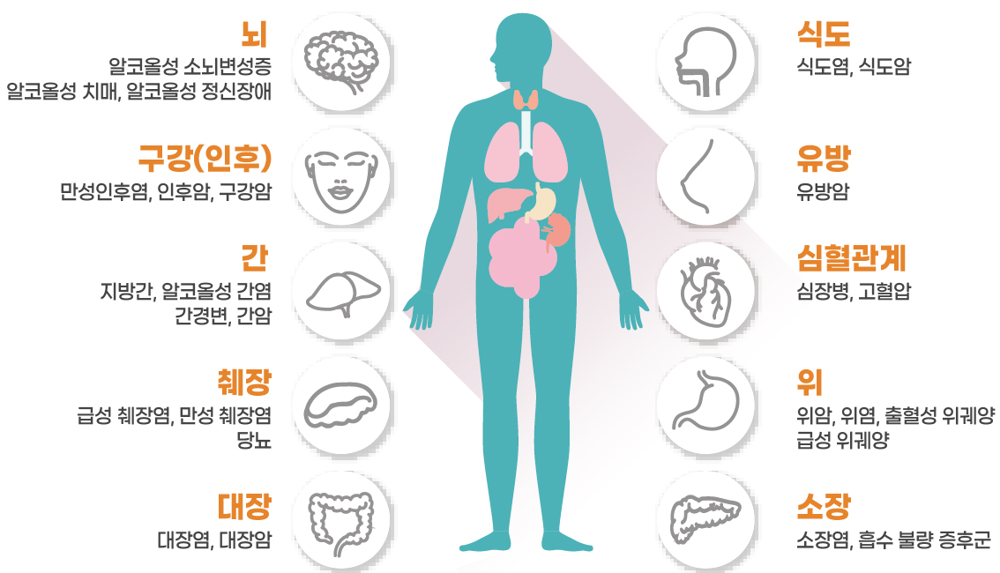
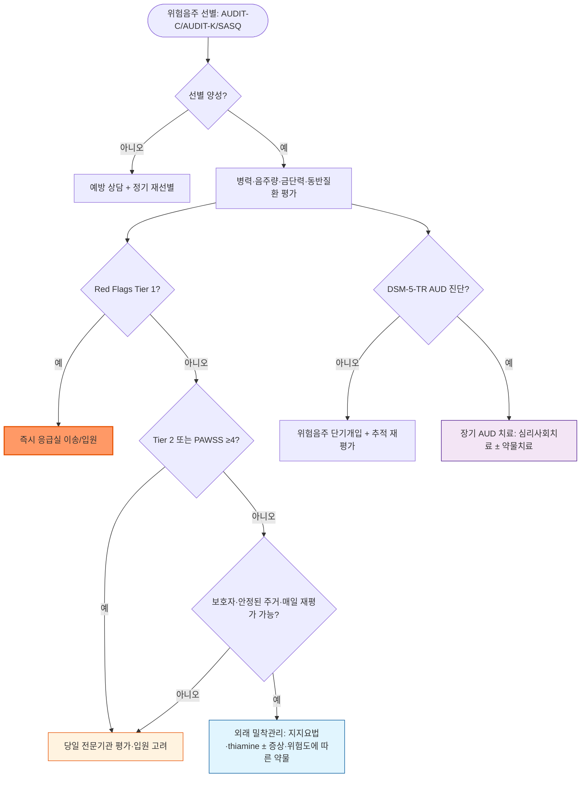

# 음주, 알코올 사용 장애 Alcohol Use Disorder, AUD

## <mark style="color:green;">일반 사항</mark>

<figure><figcaption><p> <strong>음주로 인한 질병</strong> (<a href="https://www.cancer.go.kr/lay1/S1T231C232/contents.do">국가암정보센터</a>)</p></figcaption></figure>


* 알코올 사용 장애(alcohol use disorder, AUD)는 **임상적으로 유의한 손상이나 고통을 초래하는 문제성 알코올 사용 양상**이다.
* DSM-IV의 alcohol abuse와 alcohol dependence는 DSM-5-TR에서 AUD로 통합되었으며, 최근 12개월간 충족한 진단 기준 수에 따라 경증·중등증·중증으로 분류한다 (☞ 진단).
* 알코올과 카페인을 함께 섭취하면 주관적 취기가 덜 느껴질 수 있으나 판단력·운동기능 손상이나 혈중알코올농도가 줄어드는 것은 아니므로 오히려 과음·사고 위험이 증가할 수 있다.
* 유병률 : 2021년 정신건강실태조사(국립정신건강센터)에서 알코올사용장애 평생유병률은 11.6%(남 17.6%, 여 5.4%), 1년유병률은 2.6%(남 3.4%, 여 1.8%)였다. 평생유병률은 남자가 여자보다 3.3배, 1년유병률은 1.9배 높아 지표에 따라 성비가 다르다. 이 조사는 alcohol abuse·dependence 진단체계에 근거하므로 DSM-5-TR AUD 유병률과 직접 동일시하지 않는다. 국내 음주 행태 통계는 아래 "국내 음주 통계" 참고.
* 음주하지 않는 사람에게 건강을 목적으로 음주를 시작하도록 권하지 않는다. 음주량이 적을수록 위해가 낮지만 위험이 0인 음주량은 확립되지 않았으며, 특히 암 위험 측면에서는 안전한 음주량이 없다(WHO Alcohol Fact Sheet).

### <mark style="color:orange;">표준잔과 순수 알코올량</mark>


**이 장의 단위 원칙**

* 일반적인 음주량 기록과 NIAAA 기준은 별도 표시가 없으면 **1 standard drink(SD)=순수 알코올 14 g**을 사용한다.
* WHO AUDIT 문항은 원 도구에 따라 **1 drink=순수 알코올 10 g**으로 해석한다.
* 국민건강영양조사의 **"잔"은 조사 고유의 술 종류별 잔 단위**이므로 위 두 단위로 임의 환산하거나 국제 기준 수치와 직접 비교하지 않는다.


순수 알코올량은 다음과 같이 계산한다.

`음료량(㎖) × 알코올 도수(소수) × 에탄올 비중(0.79 g/㎖)`

* 5% 맥주 330 ㎖ = 330 × 0.05 × 0.79 = 약 13 g
* 12% 와인 140 ㎖ = 140 × 0.12 × 0.79 = 약 13.3 g
* 20% 소주 50 ㎖ = 50 × 0.20 × 0.79 = 약 7.9 g
* 20% 소주 1병 360 ㎖ = 약 57 g

### <mark style="color:orange;">국내 음주 통계</mark>

국민건강영양조사(질병관리청, 2023년 결과, 2024.12.3. 발표)의 19세 이상 성인 대상 결과는 다음과 같다.

* **고위험음주율**(1회 평균 음주량 남 ≥7잔·여 ≥5잔이며 주 ≥2회 이상 음주하는 분율) : 전체 13.8%, 남 19.9%(2022년 21.3%), 여 7.7%(2022년 7.0%)
* **월간폭음률**(최근 1년 중 월 1회 이상 한 자리에서 남 ≥7잔·여 ≥5잔 음주한 분율) : 전체 37.2%, 남 47.9%(2022년 48.8%), 여 26.3%(2022년 25.9%)

> **정의 주의 :** 국민건강영양조사의 "잔" 기준(남 ≥7잔·여 ≥5잔)은 아래 "음주 수준"에서 다루는 NIAAA 기준 폭음(남 ≥5 SD·여 ≥4 SD, 1 SD=14 g)이나 과음 정의와 동일하지 않다. <mark style="color:red;">국내 통계와 국제 기준의 수치는 서로 환산하거나 직접 비교할 수 없다.</mark> 위 전년 대비 수치는 기술적 비교이며 장기 추세나 통계적 유의성을 의미하지 않는다.

### <mark style="color:orange;">음주 수준</mark>

#### <mark style="color:$primary;">폭음 Binge drinking</mark>

* 미국 1 SD=14 g 기준으로 약 2시간 이내 여성 ≥4 SD, 남성 ≥5 SD를 마셔 혈중알코올농도가 약 0.08% 이상에 이르는 음주 양상이다.
* 같은 잔 수라도 체중, 체수분, 음주 속도, 식사 여부, 약물 병용에 따라 혈중알코올농도와 위해가 달라질 수 있다.
* 국내 통계(월간폭음률)는 위 "국내 음주 통계" 참고.

#### <mark style="color:$primary;">과음 Heavy drinking</mark>

* NIAAA 정의(미국 1 SD=14 g) : 여성은 하루 ≥4 SD 또는 주 ≥8 SD, 남성은 하루 ≥5 SD 또는 주 ≥15 SD.
* 이는 AUD 진단 기준이 아니라 위험이 증가하는 음주량 기준이다. 국가·기관별 정의가 다르므로 출처와 단위를 명시한다.

#### <mark style="color:$primary;">저위험 음주에 대한 설명</mark>

* "적정 음주"를 건강상 이득이 있는 음주로 설명하지 않는다.
* 음주를 계속하는 환자에게는 "적을수록 위해가 낮다"는 원칙 아래 폭음일을 없애고 총 음주량과 음주 빈도를 줄이도록 권고한다.
* 임신·임신 계획, 미성년자, AUD, 금단 병력, 음주로 악화되는 질환, 알코올 상호작용 약물 복용, 운전·기계조작 전에는 금주한다.

### <mark style="color:orange;">알코올 관련 위해</mark>

* **급성 위해 :** 판단·협응 장애, 낙상·교통사고·익수·화상, 폭력·자해·성폭력, 저혈당, 흡인, 부정맥, 급성 췌장염, 다른 약물·물질과의 복합 중독
* **뇌·정신건강 :** 우울·불안·수면장애·자살 위험, 기억력·집행기능 저하, 뇌병증, 말초신경병증
* **심혈관계 :** 고혈압, 심방세동 등 부정맥, 심근병증, 심부전, 뇌졸중
* **소화기·간·췌장 :** 위염, 알코올 관련 지방간·간염·간경변, 췌장염
* **암 :** 구강·인두·후두·식도·간·대장·직장암 및 여성 유방암. IARC는 1988년 알코올을 담배·석면과 같은 1군 발암물질로 지정하였다. 저용량 음주에서도 일부 암 위험이 증가할 수 있다(WHO/IARC). 국내 코호트 자료에서는 하루 평균 소주 1병(약 57 g) 음주자의 위장관암 위험이 비음주자 대비 약 39%(남성 약 65%) 증가하는 것으로 보고되었으며(Yoo JE 등, JAMA Netw Open 2021), 흡연을 함께하면 상부소화기암 등 일부 암종의 위험이 더욱 커질 수 있다.
* **영양·면역 :** thiamine·folate 등 영양 결핍, 빈혈, 면역기능 저하, 결핵·폐렴 등 감염 위험 증가
* **생식·임신 :** 성기능 저하, 유산·사산·조산·저체중 출생 및 태아알코올스펙트럼장애 위험. 임신 중 안전한 음주량이나 안전한 시기는 확립되지 않았다.
* **사회적 위해 :** 가족·직업·법률·재정 문제와 타인에 대한 사고·폭력 피해

## <mark style="color:green;">원인 및 위험 인자</mark>

* AUD·다른 물질사용장애의 가족력, 이른 음주 시작, 높은 음주량·폭음
* 스트레스, 가족 갈등, 이혼, 실직, 장시간 노동, 사회적 고립
* 흡연 또는 다른 물질사용장애
* 우울·불안·양극성장애·외상후스트레스장애·섭식장애·수면장애
* 충동성, 음주를 용인하거나 장려하는 또래·직장·사회문화적 환경
* 사회경제적 취약성, 주거 불안정, 의료 접근성 부족
* ALDH2 유전자 변이(동아시아인에서 흔함)로 인한 안면홍조 반응 : acetaldehyde 분해 능력이 낮아 소량 음주에도 부담이 크며, 소량 음주에서도 식도암 등 위험이 더 높아질 수 있어 이런 환자에게는 금주를 권고한다.

> 성별·연령·사회경제적 특성은 AUD 위험과 관련될 수 있으나 낙인적 표현을 피하고, 모든 환자에게 비판단적인 보편적 선별을 시행한다.

## <mark style="color:green;">임상 양상</mark>

### <mark style="color:orange;">알코올 사용 장애의 임상 양상</mark>

* **행동적 징후 :** 음주 조절 실패, 갈망, 음주 중심으로 생활 재편, 직장·학교·가정의 역할 수행 장애
* **신체 진찰 소견 :** 손바닥 홍반, 거미모양혈관종, 여성형유방·고환 위축, 이하선 비대, Dupuytren 구축, 간비대, 손 떨림, 보행 실조, 말초신경병증(사지 이상감각·심부건반사 저하). 진행된 간질환에서는 복수·비장비대·근감소 등이 동반될 수 있다.
* 위 소견은 AUD를 시사하나 특이도가 높지 않으므로 병력 청취·선별도구·DSM-5-TR 기준과 함께 종합적으로 판단한다.

### <mark style="color:orange;">알코올 금단 증후군의 병태생리와 임상 경과</mark>

* 만성 음주로 GABA성 억제계가 하향 조절되고 glutamate성 흥분계가 상향 조절된 상태에서 음주를 갑자기 중단하거나 크게 줄이면 중추신경계 과흥분이 발생한다.
* 혈중알코올농도가 아직 양성이어도 평소보다 농도가 급격히 떨어지면 금단이 시작될 수 있다.

<table><thead><tr><th width="120">양상</th><th width="200">전형적 발생 시기</th><th>임상 특징</th></tr></thead><tbody><tr><td>초기 금단</td><td>감량·중단 후 약 6\~24시간</td><td>떨림, 불안, 불면, 구역·구토, 발한, 두통, 빈맥·혈압 상승</td></tr><tr><td>알코올성 환각증</td><td>약 12\~48시간</td><td>주로 청각 환각이며 시각·촉각 환각도 나타날 수 있음. 의식과 지남력은 비교적 명료할 수 있음</td></tr><tr><td>금단 발작</td><td>대개 8\~48시간</td><td>주로 전신 강직간대발작. 국소 발작·지속적 의식저하·첫 발작은 다른 원인 평가 필요</td></tr><tr><td>금단 섬망</td><td>대개 48\~72시간 이후, 때로 3\~5일까지 지연</td><td>주의력·의식 변동, 지남력 장애, 심한 자율신경 항진, 환각·초조</td></tr></tbody></table>

> 시간 범위는 전형적인 경과일 뿐이다. 과거 금단 반복, 동반질환, 진정제 사용, 마지막 음주량 등에 따라 더 빠르거나 늦게 발생할 수 있다.

### <mark style="color:$danger;">🚩 Red Flags!</mark>

<mark style="color:$danger;">**즉시 응급실 이송 / 응급 처치**</mark>

* 금단 발작, 금단 섬망, 심한 혼돈·지남력 장애·초조·환각
* 의식저하, 호흡억제, 반복 구토·흡인 위험, 저혈당, 저산소증
* 심한 빈맥·고혈압·발열·부정맥·흉통 또는 혈역학적 불안정
* 두부외상, 국소 신경학적 이상, 원인이 불분명한 첫 발작
* 자살·자해·타해 위험 또는 안전 확보가 어려운 공격성
* Wernicke 뇌병증 의심 : 혼돈, 보행실조, 안구운동 이상 중 하나 이상

<mark style="color:$warning;">**당일 응급실 / 전문기관 평가**</mark>

* 과거 금단 섬망·금단 발작 또는 PAWSS ≥4 (☞ 진단)
* 임신, 고령·쇠약, 중대한 간·심장·폐·신장질환, 활동성 감염·췌장염
* 중등도 이상 금단, 증상의 빠른 악화, 경구 투약·수분 섭취 불가
* benzodiazepine 등 다른 진정수면제 금단 가능성 또는 복합 물질사용
* 활동성 정신병·중증 우울·인지장애
* 보호자·안정된 주거·교통·일일 추적이 없거나 외래 금단 치료 실패 병력

<mark style="color:$info;">**외래 밀착 관리 / 추가 평가 계획**</mark> <mark style="color:$info;">- 안정적이며 중증 금단 위험인자가 낮을 때만</mark>

* 경증 금단, 활력징후와 의식이 안정적이고 중증 금단 위험인자가 낮음
* 신뢰할 수 있는 보호자, 안정된 주거, 약물관리와 매일 재평가가 가능함
* 악화 시 즉시 응급실로 이동할 수 있으며 환자·보호자가 경고 증상을 이해함


**Wernicke 뇌병증은 고전적 3대 징후가 모두 나타나지 않아도 배제할 수 없다**

Tier 1 기준은 치료 지연을 막기 위한 낮은 응급 대응 문턱이며, Caine 기준은 임상 진단의 민감도와 확신도를 높이기 위한 기준이다. Caine 기준을 충족하지 않더라도 Wernicke 뇌병증이 의심되면 thiamine 치료를 지연하지 않는다.

다음 Caine 기준 4개 중 2개 이상이면 강하게 의심한다.

1. 영양 결핍
2. 안구운동 이상
3. 소뇌기능 장애 또는 보행실조
4. 정신상태 변화 또는 경도 기억장애

Caine 기준은 만성 알코올 사용자를 대상으로 개발된 임상 기준이며 간성뇌병증 등이 동반되면 감별이 어려울 수 있다. 2개 미만이더라도 임상적으로 의심되면 검사 결과를 기다리거나 진단 기준 충족을 기다리지 말고 비경구 thiamine 치료와 응급 평가를 시행한다.


## <mark style="color:green;">진단</mark>

### <mark style="color:orange;">알코올 사용 장애 진단 기준 \[DSM-5-TR]</mark>

최근 12개월 동안 다음 11개 항목 중 2개 이상을 충족하고 임상적으로 유의한 손상이나 고통을 초래하면 AUD로 진단한다.

1. 의도했던 것보다 더 많이 또는 더 오래 음주한다.
2. 음주를 줄이거나 조절하려는 지속적인 욕구가 있거나 반복적인 시도가 실패한다.
3. 술을 구하거나 마시거나 음주 영향에서 회복하는 데 많은 시간을 보낸다.
4. 술에 대한 갈망 또는 강한 욕구가 있다.
5. 반복적인 음주로 직장·학교·가정의 주요 역할 수행에 실패한다.
6. 음주로 지속적·반복적인 대인관계 문제가 생겨도 계속 음주한다.
7. 음주 때문에 중요한 사회적·직업적·여가 활동을 포기하거나 줄인다.
8. 신체적으로 위험한 상황에서 반복적으로 음주한다.
9. 음주로 신체적·정신적 문제가 발생하거나 악화됨을 알면서도 계속 음주한다.
10. 내성이 발생한다.
11. 금단 증상이 발생하거나 금단을 피하거나 완화하기 위해 음주한다.

* 경증 : 2\~3개 / 중등증 : 4\~5개 / 중증 : ≥6개

> AUDIT-C·AUDIT-K·CAGE는 선별도구이며 AUD 진단도구가 아니다. 양성 선별 후 DSM-5-TR 기준, 음주량·기능 손상·동반질환 및 금단 위험을 평가한다.

### <mark style="color:orange;">감별 진단</mark>

* 급성 중독·금단 양상이 다른 원인으로도 발생할 수 있으므로 병력상 최근 음주량·마지막 음주 시각이 불확실하면 아래를 함께 고려한다.

<table><thead><tr><th width="170">감별 대상</th><th>핵심 감별 포인트</th></tr></thead><tbody><tr><td>Benzodiazepine·barbiturate 금단</td><td>임상상이 알코올 금단과 유사; 병용·동시 사용 여부 확인, 필요 시 병력·소변 검사로 확인</td></tr><tr><td>갑상선기능항진증, 갈색세포종</td><td>빈맥·발한·진전이 지속되고 음주 중단 시기와 시간적으로 맞지 않음</td></tr><tr><td>패혈증, 중추신경계 감염</td><td>발열·의식변화가 있으나 국소 신경학적 이상, 뇌수막 자극징후 동반 가능</td></tr><tr><td>저혈당</td><td>즉시 혈당 확인으로 감별; 알코올 중독 환자에서 병발 흔함</td></tr><tr><td>Serotonin syndrome</td><td>Serotonergic 약물(SSRI, tramadol 등) 병용력, clonus·과반사·근경직·고체온</td></tr><tr><td>항콜린 중독</td><td>1세대 항히스타민제·항무스카린제 병용력, 산동, 건조한 피부·점막, 요정체, 장음 감소</td></tr><tr><td>일차 정신병적장애·기분장애</td><td>음주와 무관하게 지속되는 병력, 금주 후에도 지속되는 증상으로 감별</td></tr><tr><td>각성제(암페타민류) 중독</td><td>동공산대, 고체온, 다른 물질사용력으로 감별</td></tr></tbody></table>

### <mark style="color:orange;">선별</mark>

#### <mark style="color:$primary;">AUDIT-C</mark>

아래 표는 원 WHO AUDIT-C 형식이며 **1 drink=순수 알코올 10 g**으로 해석한다. 미국 14 g SD 또는 국내 술잔 환산표와 혼용하지 않는다.

| 항목                                  | 0점      | 1점      | 2점        | 3점        | 4점    |
| ----------------------------------- | ------- | ------- | --------- | --------- | ----- |
| **① 지난 1년간 술을 얼마나 자주 마셨는가?**        | 전혀 없음   | 월 1회 이하 | 월 2\\\~4회 | 주 2\\\~3회 | 주 ≥4회 |
| **② 술을 마시는 날 보통 몇 잔을 마셨는가?**        | 1\\\~2잔 | 3\\\~4잔 | 5\\\~6잔   | 7\\\~9잔   | ≥10잔  |
| **③ 한 번에 6잔 이상 마신 적이 얼마나 자주 있었는가?** | 없음      | 월 1회 미만 | 월 1회      | 주 1회      | 거의 매일 |

* 흔히 남성 ≥4점, 여성 ≥3점을 양성 기준으로 사용하지만 연령·인구집단·사용한 한국어판에 따라 절단값이 다를 수 있다.
* 양성은 "위험음주 또는 AUD 가능성"을 뜻하며 active AUD로 확진하는 기준이 아니다.
* 국내 진료에서는 검증된 AUDIT-K 문항과 해당 도구의 표준잔·절단값을 그대로 사용하는 것이 바람직하다.

#### <mark style="color:$primary;">AUDIT-K</mark>

국내에서 검증된 10문항 도구이며, AUDIT-C(3문항, 0\~12점)와 절단값 체계가 다르므로 혼동하지 않는다.

| 문항                                          | 0점      | 1점         | 2점       | 3점       | 4점    |
| ------------------------------------------- | ------- | ---------- | -------- | -------- | ----- |
| ① 술은 얼마나 자주 마십니까?                           | 전혀 마시지 않는다 | 한 달에 한 번 이하 | 한 달에 2\~4회 | 1주일에 2\~3회 | 1주일에 4회 이상 |
| ② 평소 술을 마시는 날 몇 잔 정도 마십니까?                   | 1\~2잔    | 3\~4잔       | 5\~6잔     | 7\~9잔     | 10잔 이상 |
| ③ 한 번 술을 마실 때 소주 1병 또는 맥주 4병 이상 마시는 음주 빈도    | 전혀 없다  | 한 달에 한 번 미만 | 한 달에 한 번 | 일주일에 한 번 | 매일같이 |
| ④ 지난 1년간, 술을 마시기 시작하면 멈출 수 없었던 때가 얼마나 있었나  | 전혀 없다  | 한 달에 한 번 미만 | 한 달에 한 번 | 일주일에 한 번 | 매일같이 |
| ⑤ 지난 1년간, 평소 할 수 있었던 일을 음주 때문에 실패한 적       | 전혀 없다  | 한 달에 한 번 미만 | 한 달에 한 번 | 일주일에 한 번 | 매일같이 |
| ⑥ 지난 1년간, 술 마신 다음날 아침 해장술이 필요했던 적          | 전혀 없다  | 한 달에 한 번 미만 | 한 달에 한 번 | 일주일에 한 번 | 매일같이 |
| ⑦ 지난 1년간, 음주 후 죄책감이나 후회를 느낀 적              | 전혀 없다  | 한 달에 한 번 미만 | 한 달에 한 번 | 일주일에 한 번 | 매일같이 |
| ⑧ 지난 1년간, 음주 때문에 전날 밤 일이 기억나지 않았던 적        | 전혀 없다  | 한 달에 한 번 미만 | 한 달에 한 번 | 일주일에 한 번 | 매일같이 |
| ⑨ 음주로 인해 자신이나 다른 사람이 다친 적이 있는가             | 없었다    | —          | 있지만 지난 1년간에는 없었다 | — | 지난 1년 내 있었다 |
| ⑩ 친척·친구·의사가 음주를 걱정하거나 술 끊기를 권유한 적이 있는가     | 없었다    | —          | 있지만 지난 1년간에는 없었다 | — | 지난 1년 내 있었다 |

> **절단값과 단계별 대처** (한국건강증진개발원; 조근호 등, 중독정신의학 2009)

| 총점 (남 / 여) | 단계 | 대처 |
|---|---|---|
| 0점 | 정상 | 특이 조치 불요 |
| 1\~9 / 1\~5 | 저위험 음주 | 음주량을 최대한 줄이고, 음주 취약군(임신·청소년·알코올 의존 가족력 등)은 완전 금주 |
| 10\~19 / 6\~9 | 고위험 음주 | 음주 폐해 교육, 음주 유발 상황·패턴 파악, 정기적 AUDIT-K 재평가 |
| ≥20 / ≥10 | 알코올사용장애 의심 | 감량이 아닌 완전 금주가 목표; 전문 병·의원 또는 중독관리통합지원센터 의뢰, DSM-5-TR 기준으로 확인 |

#### <mark style="color:$primary;">단일 선별 질문 SASQ</mark>

* 미국 14 g SD 기준 : "지난 1년 동안 하루에 여성 4잔, 남성 5잔 이상 마신 날이 몇 번 있었습니까?"
* 1회 이상이면 음주량·빈도, AUDIT-C 또는 전체 AUDIT, DSM-5-TR 기준으로 추가 평가한다.

#### <mark style="color:$primary;">CAGE</mark>

* **C**ut down : 음주를 줄여야 한다고 느낀 적이 있는가?
* **A**nnoyed : 다른 사람이 음주를 비판하여 화가 난 적이 있는가?
* **G**uilty : 음주에 죄책감을 느낀 적이 있는가?
* **E**ye opener : 아침에 해장술을 마신 적이 있는가?

> CAGE는 현재 위험음주보다 평생 알코올 문제 탐지에 더 적합하며, AUDIT-C 또는 SASQ를 우선 고려한다.

### <mark style="color:orange;">양성 선별 후 평가</mark>

* 최근 1주 및 전형적인 1주 음주량, 최대 1회 음주량, 폭음일, 마지막 음주 시각
* DSM-5-TR AUD 기준과 중증도, 과거 치료·금주 시도 및 재발 양상
* 과거 금단 발작·금단 섬망, 금단 횟수, 최근 금단 증상
* 오피오이드·benzodiazepine·수면제·각성제·대마 등 동시 사용
* 우울·불안·양극성장애·정신병·인지장애, 자살·자해 및 타해 위험
* 간질환·췌장염·심혈관질환·신경병증·영양결핍·외상·감염
* 임신 가능성, 주거·보호자·교통·치료 접근성, 가정폭력과 아동 안전

### <mark style="color:orange;">중증 금단 위험 평가</mark>

* 과거 금단 섬망 또는 금단 발작
* 여러 차례의 금단 병력(kindling), 이전 금단 치료 실패
* 장기간 지속된 많은 음주, 마지막 음주 후 이미 중등도 이상의 증상
* 고령, 임신, 중대한 내·외과 질환 또는 두부외상
* benzodiazepine·barbiturate 등 다른 진정수면제 의존·금단
* 의식·인지장애, 정신병, 자살 위험
* 전해질 이상, 영양실조, 경구 섭취 불가
* 보호자·주거·교통·일일 재평가가 불가능한 경우

#### <mark style="color:$primary;">PAWSS Prediction of Alcohol Withdrawal Severity Scale</mark>

* 아직 심한 증상이 없는 환자에서 복잡 금단(발작·섬망) 위험을 예측하는 도구이다.
* 일반적으로 ≥4점이면 고위험으로 보지만, 임상 판단과 치료 환경을 함께 고려한다(Maldonado 등, 2015년 원 검증 연구).

#### <mark style="color:$primary;">CIWA-Ar Clinical Institute Withdrawal Assessment for Alcohol-Revised</mark>

* 10개 항목으로 **현재 금단 증상의 중증도와 치료 반응**을 평가한다.
* 향후 발작·섬망을 예측하거나 입원 여부를 결정하는 단독 도구가 아니다(ASAM, 2020).
* 감염·통증·불안·다른 약물 금단은 점수를 높이고, β차단제·clonidine 등 교감신경 억제제는 점수를 낮출 수 있다.
* 섬망, 의사소통 장애, 중환자에게는 신뢰도가 낮으므로 객관적 관찰척도와 임상 판단을 함께 사용한다.
* 기관마다 투약 역치가 다르며, CIWA-Ar ≥8\~10에서 symptom-triggered 투약을 시작하는 프로토콜이 흔하다.

### <mark style="color:orange;">검사</mark>

AUD는 임상적으로 진단하며, 검사 이상이 없다고 AUD를 배제할 수 없다. 검사는 급성 위험, 동반질환과 약물치료의 안전성을 평가하기 위해 선택한다.

* 상황에 따라 CBC, glucose, 전해질, BUN/Cr, AST/ALT, bilirubin, albumin, PT/INR, Mg, P
* 임신 가능성이 있으면 임신검사
* 급성 중독·의식장애에서는 혈중알코올농도, 혈당, 산소포화도, ECG 및 의심되는 동시 중독 검사
* 최근 음주를 객관화할 임상적 필요가 있을 때 GGT, CDT, PEth 등을 선택적으로 고려하되 단독 진단에 사용하지 않는다.
* thiamine·pyridoxine 농도는 일률적으로 검사하지 않으며, 결핍 또는 Wernicke 뇌병증이 의심되면 결과를 기다리지 않고 치료한다.
* 복부 초음파·CT, 뇌 영상, 상부위장관내시경은 AUD 단계가 아니라 외상, 국소 신경학적 이상, 간질환, 췌장염, 출혈 등 구체적 적응증에 따라 시행한다.

#### <mark style="color:$primary;">알코올 생체지표</mark>

<table><thead><tr><th width="120">생체지표</th><th width="180">대략적 반영기간</th><th>특징과 해석</th></tr></thead><tbody><tr><td><strong>PEth</strong><br>Phosphatidylethanol</td><td>반복 음주 후 대개 최근 2\~4주</td><td>적혈구막에 형성되는 직접 지표로 특이도가 높다. 음주량·검사 역치·개인별 소실속도에 따라 검출기간이 달라지며 단회·소량 음주 검출을 보장하지 않는다. 최근 수혈은 해석에 영향을 줄 수 있다.</td></tr><tr><td><strong>CDT</strong><br>Carbohydrate-deficient transferrin</td><td>지속 과음 후 약 1\~3주, 금주 후 수 주에 걸쳐 정상화</td><td>지속적인 고위험 음주 평가에 비교적 특이적이다. 임신, 중증 간질환, transferrin 변이 등이 결과에 영향을 줄 수 있다.</td></tr><tr><td><strong>GGT</strong><br>Gamma-glutamyl transferase</td><td>수 주간의 음주·간 손상을 간접 반영</td><td>접근성이 높지만 간담도질환, 비만·대사질환, 약물 등에 의한 위양성이 흔하다. 정확한 음주 탐지기간을 특정하기 어렵고 단독 진단에 부적합하다.</td></tr></tbody></table>

> **국내 적용 :** GGT는 일반 생화학검사로 접근성이 높다. CDT는 2021년 8월 1일부터 누-477 탄수화물 결핍 트랜스페린으로 등재되어 선별급여 90%가 적용되었으나 최신 적용기준과 시행기관을 확인한다. PEth는 국내 급여·검사 접근성이 명확하지 않고 시행기관이 제한적일 수 있으므로 의뢰 전에 확인한다.

***



<p align="center"><strong>선별 후 금단 위험 평가 및 치료 장소 결정 알고리듬</strong></p>

<p align="center"><em><mark style="color:$info;">Ref. ASAM Clinical Practice Guideline on Alcohol Withdrawal Management (2020); VA/DoD Clinical Practice Guideline for the Management of Substance Use Disorders (2021)</mark></em></p>

***

## <mark style="background-color:$warning;">Management</mark>


**치료의 큰 그림**\
급성 중독과 금단은 안전 확보가 최우선이다. 그 이후의 장기 목표는 완전 금주가 가장 안전하지만, 환자가 이를 당장 선택하지 않더라도 폭음일·총 음주량 감소를 목표로 참여를 유지할 수 있다. 동기강화상담·인지행동치료 등 심리사회적 치료와 약물치료는 모두 근거 기반 치료이며, 환자 선호와 적응증에 따라 단독 또는 병합한다. 치료 중 음주가 재개되어도 치료 실패로 보지 말고 계획을 재평가할 신호로 다룬다.


### <mark style="color:orange;">급성 알코올 중독</mark>

* 기도·호흡·순환, 산소포화도, 혈당, 체온, 의식 수준을 우선 평가한다.
* 두부외상·뇌졸중·감염·저혈당·저산소증·간성뇌병증 및 오피오이드·진정수면제 등 동시 중독을 적극적으로 감별한다.
* 호흡억제·축동 또는 원인 불명의 의식저하로 오피오이드 동반 중독이 의심되면 기도·환기 보조와 함께 naloxone 투여를 지연하지 않는다. 반응 후에도 재진정 가능성을 고려해 반복 관찰한다.
* 안정적인 단순 중독은 조용하고 안전한 환경에서 반복 활력징후·신경학적 상태를 관찰하며 대사·회복을 기다린다.
* 수액은 탈수·저혈압 등 적응증이 있을 때 사용하며 알코올 제거를 촉진하지는 않는다.
* 공격성은 언어적 진정과 환경 안전 확보가 우선이다. 약물 진정이 필요하면 호흡·심전도 감시가 가능한 응급 환경에서 시행한다.
* 단순 알코올 중독 환자에게 benzodiazepine을 일률적으로 투여하지 않는다. 호흡억제·흡인·과진정 위험이 있으며, benzodiazepine은 금단이 동반되었을 때 중심적으로 사용한다.
* IM olanzapine과 비경구 benzodiazepine의 근접 병용은 심폐억제에 주의한다. IV haloperidol은 QT 연장·부정맥 위험을 고려해 ECG·전해질 상태를 확인하고 기관 프로토콜에 따른다.

### <mark style="color:orange;">알코올 금단 치료</mark>

#### <mark style="color:$primary;">Benzodiazepine</mark>

* 중등도\~중증 금단의 1차 선택제이며 발작·금단 섬망 예방에 효과적이다.
* diazepam·chlordiazepoxide 같은 장시간 작용제는 매끄러운 치료가 장점이다.
* 고령, 중증 질환, 간기능 저하 또는 지속적 과진정 우려가 있으면 glucuronidation 의존도가 높은 lorazepam·oxazepam을 선호한다.
* symptom-triggered regimen은 훈련된 인력이 신뢰도 높은 반복 평가를 시행할 수 있을 때 선호한다.
* 반복 평가가 어렵거나 과거 중증 금단 위험이 있으면 fixed-schedule regimen에 필요 시 추가 용량을 병용할 수 있다.
* 호흡수·산소포화도·의식·보행·낙상 위험과 과진정을 반복 평가한다.

<table><thead><tr><th width="150">예시 약제</th><th width="200">Symptom-triggered 단회 용량 예시</th><th>주의</th></tr></thead><tbody><tr><td>Chlordiazepoxide</td><td>25\~50 ㎎ PO</td><td>간기능 저하·고령에서 축적</td></tr><tr><td>Diazepam</td><td>5\~10 ㎎ PO/IV</td><td>호흡억제·과진정, 간기능 저하에서 축적</td></tr><tr><td>Lorazepam</td><td>1\~2 ㎎ PO/IV</td><td>간기능 저하·고령에서 상대적으로 선호</td></tr><tr><td>Oxazepam</td><td>15\~30 ㎎ PO</td><td>발현이 느려 중증·응급 상황에는 부적합</td></tr></tbody></table>

> 위 용량은 성인 예시이며 기관 프로토콜, 증상 중증도, 이전 투여 반응, 연령·간기능·호흡 상태에 따라 조절한다. 중증 금단은 외래 고정 처방으로 치료하지 않는다.

#### <mark style="color:$primary;">자율신경 항진 보조 치료</mark>

* β차단제 또는 α2 작용제는 benzodiazepine으로 조절되지 않는 빈맥·고혈압에 제한적으로 병용할 수 있다.
* 단독 치료로 사용하지 않으며 발작·섬망을 예방하지 못한다.
* 빈맥·고혈압과 CIWA-Ar 점수를 가려 중증도를 과소평가할 수 있으므로 일률적인 처방례에 포함하지 않는다.

#### <mark style="color:$primary;">Thiamine 및 영양·전해질</mark>

* 영양불량, 흡수장애 또는 중증 금단 위험 환자는 thiamine 비경구 투여를 우선 고려한다.
* **예방 예시 :** thiamine 100 ㎎ IV/IM qd ×3\~5일 후 경구 보충. 기관 프로토콜에 따른다.
* **Wernicke 뇌병증 의심 :** 예방 용량으로 치료하지 말고 즉시 고용량 IV thiamine을 투여하며 입원·전문 치료한다. 기관 프로토콜에 따라 thiamine 200\~500 ㎎ IV q8h 등의 고용량 요법을 시행한다.
* 가능하면 thiamine을 glucose보다 먼저 또는 동시에 투여하되, <mark style="color:red;">저혈당 교정을 지연하지 않는다.</mark>
* folate, Mg, P, K는 영양상태·검사 결과와 임상 적응증에 따라 보충한다. 부정맥, 전해질 이상, 과거 금단 발작이 있는 저Mg혈증은 적극 교정한다.

## <mark style="color:green;">비-약물 치료 및 예방</mark>

### <mark style="color:orange;">예방 및 위해 감소</mark>

* 가장 안전한 선택은 금주이며, 음주를 계속한다면 총 음주량·빈도와 폭음일을 줄인다.
* 음주량을 표준잔으로 기록하고 음주 유발 상황·갈망·결과를 함께 기록한다.
* 천천히 마시고 공복 음주를 피하며 물과 무알코올 음료를 번갈아 마신다. 이러한 방법이 음주 위험을 없애지는 않는다.
* 혼자 마시기, 술게임, 여러 종류의 술을 빠르게 마시기, 카페인·에너지음료와 혼합하기를 피한다.
* 음주 후 운전·자전거·전동킥보드·수영·기계조작을 하지 않는다.
* **무알코올·비알코올 음료 표시 주의** : "무알코올(Alcohol free)"은 알코올 함량 0.00% 미만이지만, "비알코올(Non-alcoholic)"은 알코올 1% 미만으로 소량의 알코올을 포함할 수 있다(0.0%로 표기되기도 함). 완전 금주가 목표인 환자(disulfiram 복용, 임신·수유, 회복 중인 AUD 환자 등)에게는 제품 표시를 확인하도록 안내한다(식품의약품안전처 고시 제2024-41호).

### <mark style="color:orange;">다음의 경우 금주</mark>

* 운전·기계조작·위험한 신체 활동 전
* 임신 중·임신 계획 또는 수유 관련 위험 평가가 필요한 경우
* AUD 또는 중증 금단 병력
* 알코올과 상호작용하는 약물 복용
* 간질환·췌장염·심부전·부정맥 등 음주로 악화될 수 있는 질환
* 중요한 결정이나 타인의 안전을 책임져야 하는 상황

### <mark style="color:orange;">지원 자원</mark>

* [중독관리통합지원센터](https://www.mohw.go.kr/menu.es?mid=a10706040400)
* 보건복지상담센터 129, 정신건강위기상담전화 1577-0199, 자살예방상담전화 109
* 지역 정신건강복지센터, 전문 중독치료기관, 정신건강의학과, 자조모임·상호지원 프로그램

## <mark style="color:green;">약물 치료</mark>

### <mark style="color:orange;">장기 약물치료 선택</mark>

> 국내 급여 기준은 변경될 수 있으므로 처방 전 HIRA 고시를 확인한다.

<table><thead><tr><th width="130">약제</th><th width="230">적합한 상황</th><th>주요 제한</th></tr></thead><tbody><tr><td>Naltrexone</td><td>과음·갈망 감소 목표, 아직 음주 중인 환자에서도 고려 가능</td><td>오피오이드 사용·의존, 급성 간염·중증 간기능장애</td></tr><tr><td>Acamprosate</td><td>해독 후 금주 유지, 간질환·오피오이드 진통 필요 가능성이 있는 환자</td><td>1일 3회 복용, 신기능 저하</td></tr><tr><td>Disulfiram</td><td>완전 금주 목표가 명확하고 감독 복용이 가능한 선별 환자</td><td>심각한 심장·간질환, 정신병, 알코올 노출 위험. <mark style="color:red;">국내 상용 제품 미유통으로 실제 임상 적용이 매우 제한적이며 처방 전 최신 허가·유통 여부 확인</mark></td></tr><tr><td>Topiramate</td><td>1차 약제가 부적합하거나 효과 불충분한 경우</td><td>국내 AUD 허가 외 사용, 인지·감각·대사 부작용, 임신</td></tr><tr><td>Gabapentin</td><td>1차 약제가 부적합하고 불면·불안·경증 금단 후 증상이 동반된 경우</td><td>국내 AUD 허가 외 사용, 신기능 감량, 진정·오남용 위험</td></tr></tbody></table>

### <mark style="color:orange;">Naltrexone</mark>

* opioid receptor antagonist로 음주의 보상 효과·갈망과 과음일을 감소시킨다.
* <mark style="color:red;">시작을 위해 7\~10일간 금주할 필요는 없다.</mark> 음주 중인 환자에서도 감량 목표로 시작할 수 있다.
* 투여 전 오피오이드 성분이 포함된 진통제·진해제·지사제, tramadol, 불법 오피오이드 사용을 확인한다.
* 단기 작용 오피오이드는 보통 7\~10일, buprenorphine·methadone은 최대 14일 이상 중단해야 유발 금단 위험을 줄일 수 있다.
* 불확실하면 소변 오피오이드 검사 및 전문적인 naloxone challenge를 고려한다.
* 기저 AST/ALT·bilirubin을 확인한다. 급성 간염, 임상적 간부전 또는 비대상성 중증 간질환에서는 다른 약제를 우선하거나 전문의와 협의한다.
* 무증상 aminotransferase 상승만으로 일률적으로 금기하지 않지만, AST/ALT가 ULN의 3\~5배 이상이면 다른 원인을 평가하고 위험-편익 판단과 면밀한 추적이 필요하다. 많은 임상시험에서는 5배 이상 상승 환자를 제외하였다.
* 황달·진한 소변·지속적인 우상복부 통증 등 급성 간염 증상이나 현저한 추가 상승이 발생하면 중단하고 즉시 평가한다.
* 용법 예시 : 25 ㎎ qd ×2\~3일 후 50 ㎎ qd \[<mark style="color:blue;">환인날트렉손정 등</mark>]. 표준 유지 용량은 50 ㎎ qd이다.
* 380 ㎎ q4wk 근육주사 제형은 해외 허가 용법이다. <mark style="color:red;">국내 허가·유통 여부를 확인하기 전 처방례로 제시하지 않는다.</mark>
* 오피오이드 차단으로 진통 효과가 감소하고, 중단 후 오피오이드 과량투여에 취약할 수 있음을 교육한다.

### <mark style="color:orange;">Acamprosate</mark>

* glutamate·GABA계 조절을 통해 **급성 해독이 아니라 해독 후 금주 유지**를 돕는다.
* 부작용 : 설사, 복통, 불안, 피로. 우울·자살사고를 모니터링한다.
* CrCl ≤30 ㎖/min에서는 금기이며 CrCl 30\~50 ㎖/min에서는 333 ㎎ tid로 감량한다(신장애 용량은 국제 라벨 기준).
* 국내 허가 용법 \[<mark style="color:blue;">환인아캄프로세이트정 333 ㎎, 명인아캄프로세이트정 333 ㎎ 등</mark>]
  * 체중 ≥60 ㎏ : 666 ㎎ tid
  * 체중 <60 ㎏ : 아침 666 ㎎, 점심·저녁 각 333 ㎎
* 정제를 씹거나 부수지 않고 복용한다.

### <mark style="color:orange;">Disulfiram</mark>

* aldehyde dehydrogenase를 억제해 음주 시 acetaldehyde가 축적되면서 홍조, 두통, 구역·구토, 빈맥·저혈압 등 반응을 일으킨다.
* 환자의 충분한 설명과 동의, 명확한 금주 목표가 필요하며 가능하면 가족·치료자의 감독 복용을 고려한다.
* 마지막 음주 후 최소 12시간이 지나고 혈중알코올이 없을 때 시작한다.
* 구강청결제·조리용 술·일부 시럽·향수 등 알코올 함유 제품을 피하며, 중단 후에도 최대 14일까지 반응할 수 있다.
* 중증 심근질환·관상동맥폐색, 정신병, 중증 간기능장애에서는 금기 또는 회피한다. metronidazole 병용을 피한다.
* 기저 및 치료 중 간기능을 확인한다.
* 용법 예시 : 250 ㎎ qd(범위 125\~500 ㎎/day). <mark style="color:red;">국내 상용 제품(알콜스톱정 등)은 생산·유통이 중단된 것으로 확인되어 실제 처방이 어려울 수 있다. 처방 전 최신 허가·유통 여부를 반드시 확인한다.</mark>

### <mark style="color:orange;">국내 허가 외 약제</mark>

#### <mark style="color:$primary;">Topiramate</mark>

* 일부 지침에서 중등도\~중증 AUD의 유효한 선택지로 권고하지만 국내 AUD 적응증은 허가 외이다.
* 25 ㎎/day로 시작해 수 주에 걸쳐 서서히 증량하며 보통 100\~300 ㎎/day 범위에서 개별화한다.
* 감각이상, 미각 이상, 인지저하, 체중감소, 대사산증, 신결석, 급성 폐쇄각녹내장 및 임신 중 태아 위험에 주의한다.

#### <mark style="color:$primary;">Gabapentin</mark>

* 900\~1,800 ㎎/day 범위가 연구되었으나 국내 AUD 적응증은 허가 외이다.
* 신기능에 따라 감량하고 어지럼·진정·보행장애, 다른 중추신경억제제와의 병용 및 오남용 위험을 확인한다.

#### <mark style="color:$primary;">Pregabalin</mark>

* 일부 소규모 연구에서 갈망·불안·금주 유지 효과가 보고되었으나 근거가 제한적이며 주요 AUD 지침의 표준 1차 약제가 아니다.
* 국내 AUD 적응증은 허가 외이며 어지럼·진정, 신기능 감량, 의존·오남용 위험을 고려해 일반적인 처방례에는 포함하지 않는다.

### <mark style="color:orange;">최신 연구 동향 : GLP-1 수용체 작용제</mark>


**아직 AUD 표준치료가 아닌 임상연구 단계 정보입니다**

* semaglutide 등 GLP-1 수용체 작용제가 보상 관련 뇌 회로에 작용하여 음주량·갈망을 줄일 가능성이 제기되고 있다.
* 비치료추구 AUD 성인 48명 대상 소규모 2상 무작위 대조군 연구(JAMA Psychiatry, 2025)에서 저용량 semaglutide가 갈망과 일부 음주 지표를 감소시켰다.
* 비만이 동반된 치료추구 AUD 환자 108명을 대상으로 한 단일기관 2상 무작위 대조군 연구(Lancet, 2026)에서 26주간 주 1회 semaglutide 2.4 ㎎을 표준 인지행동치료(CBT)에 추가했을 때 위약+CBT군보다 폭음일이 더 크게 감소했다. 단일기관 연구이며 비만 동반 환자만 포함되어 비만이 없는 AUD 환자에게 일반화하기는 이르다.
* 미국 재향군인부(VA)에서 600명 이상을 대상으로 한 3상 임상시험(CRAVE, NCT07218354)이 2026년 진행 중이며, 결과는 아직 발표되지 않았다.
* 현재 semaglutide는 국내외 어느 곳에서도 AUD 적응증으로 승인되지 않았다.
* <mark style="color:red;">AUD 표준치료(심리사회 치료 ± naltrexone·acamprosate·disulfiram)를 대체할 근거는 아직 부족하다.</mark> 당뇨병·비만 적응증으로 GLP-1 제제를 사용하는 AUD 동반 환자에서 음주 양상의 변화를 관찰할 수 있으나, AUD 치료 효과를 전제로 처방하거나 표준치료 대신 사용하지 않는다. 환자가 AUD 치료만을 목적으로 임의로 구입·사용하지 않도록 안내한다.


### <mark style="color:orange;">동반 정신질환 치료</mark>

* SSRI는 AUD 자체의 치료제가 아니다.
* 독립적인 주요우울장애·불안장애가 확인되면 해당 질환의 적응증에 따라 치료하되, 음주로 유발된 일시적 우울·불안과 감별한다.
* 항우울제 투여만으로 AUD 치료를 대체하지 않으며 자살 위험, 양극성장애, 약물 상호작용을 평가한다.

***

### <mark style="color:red;">질병코드</mark>

F10.0 알코올 사용에 의한 급성 중독

F10.1 알코올 사용에 의한 유해한 사용

F10.2 알코올 사용에 의한 의존증후군

F10.3 알코올 사용에 의한 금단상태

F10.4 알코올 사용에 의한 섬망을 동반한 금단상태

> DSM-5-TR AUD 중증도와 F10 세부 코드는 일대일로 대응하지 않으므로 실제 임상상태와 진단에 따라 코딩한다.

***

## <mark style="color:purple;">처방례</mark>

> 아래는 성인 예시 처방이다. 임신, 고령, 간·신기능, 호흡질환, 동시 복용약물과 다른 물질사용을 확인하고 국내 허가사항·급여·제품 유통 여부 및 기관 프로토콜에 따라 조정한다.

> **처방례 1. 약물치료가 필요하지 않은 경증 금단 — 영양 보충 예시**
>
> ```
> Thiamine 100 ㎎/day  PO (가용 제형에 따라 조정; 국내 경구 단일제는 주로 10 ㎎/T)
> Folic acid 1 ㎎/T  1T  qd (영양결핍 위험 시)
> ```
>
> _✽ 보호자 동반, 음주·운전 금지, 매일 재평가를 전제로 한 저위험 경증 금단 예시이며 비타민 보충만으로 금단 증상 자체를 치료하는 것은 아니다. 국내 경구 단일제는 주로 10 ㎎/T이므로 실제 가용 제형과 복합제의 thiamine 함량을 확인한다. 일반 종합비타민이나 저함량 B-complex는 필요한 thiamine 용량을 대체하지 못할 수 있다. 영양실조, 반복 구토·흡수장애, 중증 금단 또는 신경학적 이상이 있으면 복용해야 할 정제 수와 무관하게 비경구 투여를 우선한다. benzodiazepine이 필요하면 정형화된 기관 프로토콜에 따라 최소 유효 용량을 단기간 투여하며, 일률적인 고용량 chlordiazepoxide 처방은 피한다. 증상 악화, 환각·혼돈, 반복 구토, 활력징후 이상, 경련이 있으면 즉시 응급실로 전환한다._

> **처방례 2. 중증 금단 또는 고위험 금단 — 외래 처방 대상 아님**
>
> <mark style="color:red;">즉시 응급실 이송 또는 입원 치료를 의뢰한다. 아래는 입원 환경에서의 치료 원칙이며 외래 고정 처방으로 사용하지 않는다.</mark>
>
> ```
> (입원) 감시 환경에서 symptom-triggered 또는 fixed-schedule benzodiazepine 프로토콜
> (입원) 비경구 thiamine, 수액·전해질 및 동반질환 치료
> ```
>
> _✽ atenolol·clonidine은 자율신경 항진 조절 목적의 보조제이며 단독 또는 일률적으로 처방하지 않는다._

> **처방례 3. 금주 유지 — Acamprosate**
>
> ```
> Acamprosate 333 ㎎/T  2T  tid (체중 ≥60 ㎏)
> ```
>
> _✽ 체중 <60 ㎏은 아침 2T, 점심·저녁 각 1T. CrCl 30\~50 ㎖/min은 333 ㎎ tid로 감량(국제 라벨 기준), CrCl ≤30 ㎖/min 금기. 심리사회적 치료·추적관찰과 병행한다. \[<mark style="color:blue;">환인아캄프로세이트정, 명인아캄프로세이트정 등</mark>]_

> **처방례 4. 과음·갈망 감소 — Naltrexone**
>
> ```
> Naltrexone 50 ㎎/T  0.5T  qd  ×2~3d
> → 1T  qd
> ```
>
> _✽ 최근 오피오이드·tramadol 사용, 소변 오피오이드 검사 및 간기능을 확인한다. 7\~10일은 금주 기간이 아니라 단기 작용 오피오이드 중단 기간이다. 구역 등 초기 부작용과 효과를 1\~4주 내 재평가한다. \[<mark style="color:blue;">환인날트렉손정 등</mark>]_

***

### <mark style="color:$success;">핵심 복약 지도</mark>

> **Benzodiazepine·Thiamine (금단 치료)**
>
> * 처방된 용량과 감량 일정을 임의로 늘리거나 줄이지 않도록 설명한다.
> * 과도한 졸림, 보행 불안정, 낙상 위험이 있으면 즉시 재평가한다.
> * 음주 상태에서 benzodiazepine을 병용하면 호흡억제 위험이 커짐을 설명한다.

> **Naltrexone**
>
> * 오피오이드 성분이 포함된 진통제·진해제·지사제 및 tramadol을 임의로 함께 사용하지 않도록 하고, 다른 병원 진료 시 복용 사실을 알리게 한다.
> * 초기 구역이 심하면 2\~3일 휴약 후 저용량으로 재투약할 수 있음을 설명한다.
> * 오피오이드 진통이 필요한 수술·시술이 예정되어 있으면 사전에 복용 중단 계획을 조정한다.

> **Acamprosate**
>
> * 급성 금단을 멈추는 약이 아니라 해독 후 금주 유지를 돕는 약임을 설명한다.
> * 정해진 횟수(1일 3회)를 빠짐없이 복용해야 효과가 유지됨을 강조한다.

> **Disulfiram** <mark style="color:red;">(국내 상용 제품 미유통으로 실제 사용이 매우 제한적이며 처방 전 최신 유통 여부 확인 필요)</mark>
>
> * 소량의 술뿐 아니라 구강청결제·조리용 술·일부 시럽·향수의 알코올도 반응을 일으킬 수 있음을 설명한다.
> * 마지막 복용 후에도 최대 14일까지 반응이 나타날 수 있음을 설명한다.
> * 홍조·두근거림·호흡곤란 등 반응이 심하면 즉시 응급실을 이용하도록 안내한다.

> **언제 다시 병원을 방문해야 하나요?**
>
> * 손떨림·식은땀·불면 등 금단 증상이 예상보다 심해지거나 호전되지 않는 경우
> * 처방된 약물의 부작용(심한 구역, 황달, 심한 졸림·보행장애)이 있는 경우
> * 치료 중 다시 음주했거나 음주량이 늘어난 경우 — 치료 실패로 숨기지 말고 상의

***

### <mark style="color:blue;">환자 안내서</mark>


**음주를 줄이거나 끊는 것은 의지의 문제만이 아니라 치료가 필요한 뇌의 변화입니다.**

알코올을 오래, 많이 마시면 뇌의 신경전달물질 균형이 바뀌어 스스로 조절하기 어려워질 수 있습니다. 이는 개인의 나약함이 아니라 치료 가능한 상태이며, 상담과 약물치료로 도움을 받을 수 있습니다.


#### <mark style="color:$primary;">술을 갑자기 끊으면 왜 위험할 수 있나요?</mark>

* 오랫동안 많이 마시던 술을 갑자기 끊거나 크게 줄이면 손떨림, 식은땀, 불안, 불면 같은 금단 증상이 생길 수 있습니다.
* 심한 경우 경련이나 심한 혼돈(섬망)이 발생할 수 있어 혼자서 임의로 끊기보다 의료진과 상의하는 것이 안전합니다.

#### <mark style="color:$primary;">이럴 때는 즉시 119 또는 응급실을 이용하세요</mark>

* **경련, 심한 혼란, 환각, 심한 초조, 의식이 흐려짐, 숨쉬기 힘듦**이 있을 때
* 과거에 금단 경련이나 심한 금단 증상(섬망)을 겪은 적이 있는데 다시 금주를 시작하려 할 때 — 임의로 시작하지 말고 치료 장소를 먼저 상의하십시오.
* 스스로를 해치고 싶은 생각이 들 때 — **자살예방상담전화 109**로 언제든 도움을 요청할 수 있습니다.

#### <mark style="color:$primary;">약은 어떻게 복용하나요?</mark>

* Naltrexone을 복용할 때는 마약성 진통제나 오피오이드 성분이 든 기침약·지사제를 임의로 함께 먹지 말고, 다른 병원에서 진료받을 때 복용 사실을 알리십시오.
* Acamprosate는 급성 증상을 멈추는 약이 아니라 금주 상태를 유지하도록 돕는 약이므로 정해진 대로 꾸준히 드십시오.
* Disulfiram은 현재 국내 상용 제품이 유통되지 않아 실제 사용이 매우 제한적입니다. 처방받아 복용하는 경우에는 소량의 술은 물론 구강청결제·요리에 쓰인 술·일부 시럽의 알코올에도 반응이 생길 수 있습니다.

#### <mark style="color:$primary;">일상생활에서 어떻게 관리하나요?</mark>

* **음주량을 표준잔으로 기록하십시오.** 이 안내서에서 일반 음주량 기록에 사용하는 1표준잔은 순수 알코올 14 g입니다. 언제, 왜 마셨는지 함께 적으면 유발 상황을 알아차리는 데 도움이 됩니다.
* **혼자 마시기, 술 게임, 여러 술을 빠르게 섞어 마시기를 피하십시오.**
* **운전·기계 조작·수영 전에는 절대 마시지 마십시오.**
* 치료 중 다시 술을 마셨더라도 숨기거나 스스로 치료를 그만두지 마십시오. 음주 재개는 치료 계획을 조정해야 한다는 신호일 뿐 실패가 아닙니다.

#### <mark style="color:$primary;">어디에서 도움을 받을 수 있나요?</mark>

* [중독관리통합지원센터](https://www.mohw.go.kr/menu.es?mid=a10706040400) — 지역별 무료 상담·재활 프로그램
* 보건복지상담센터 129, 정신건강위기상담전화 1577-0199
* 자조모임·상호지원 프로그램, 정신건강의학과·중독치료 전문기관

## 주요 참고문헌

* American Society of Addiction Medicine. The ASAM Clinical Practice Guideline on Alcohol Withdrawal Management. 2020.
* Department of Veterans Affairs/Department of Defense. VA/DoD Clinical Practice Guideline for the Management of Substance Use Disorders. 2021.
* Caine D, Halliday GM, Kril JJ, Harper CG. Operational criteria for the classification of chronic alcoholics: identification of Wernicke's encephalopathy. J Neurol Neurosurg Psychiatry. 1997;62(1):51-60.
* National Institute on Alcohol Abuse and Alcoholism. Screen and Assess: Use Quick, Effective Methods. Core Resource on Alcohol. Updated 2025.
* Providers Clinical Support System. Monitoring of Liver Function Tests in Patients Receiving Naltrexone or Extended-Release Naltrexone. Updated 2022.
* U.S. Food and Drug Administration. Naltrexone Hydrochloride Tablets, Prescribing Information.
* 국립정신건강센터. 2021년 정신건강실태조사(성인).
* 질병관리청. 국민건강영양조사 2023년 결과 발표. 2024.12.3.
* 건강보험심사평가원. 누-477 탄수화물 결핍 트랜스페린 등재 및 선별급여 90% 적용 안내. 2021.8.1. 시행.
* 보건복지부. 자살예방상담전화 109 운영 안내. 2026.
* Hendershot CS, et al. Once-Weekly Semaglutide in Adults With Alcohol Use Disorder: A Randomized Clinical Trial. JAMA Psychiatry. 2025;82(4):395-405.
* Klausen MK, et al. Once-weekly semaglutide versus placebo in patients with alcohol use disorder and comorbid obesity. Lancet. 2026;407(10540):1687-1698.
* 조근호, 채숙희, 박애란, 이해국, 신임희, 민성호. 위험 음주자의 선별을 위한 한국어판 Alcohol Use Disorders Identification Test(AUDIT-K)의 최적 절단값. 중독정신의학. 2009;13(1):34-40.
* 한국건강증진개발원. 알코올 사용장애 선별검사 도구. 2017.
* Yoo JE, Shin DW, Han K, et al. Association of the Frequency and Quantity of Alcohol Consumption With Gastrointestinal Cancer. JAMA Netw Open. 2021;4(8):e2120382.
* International Agency for Research on Cancer (IARC). Monographs on the evaluation of carcinogenic risks to humans: Vol. 44: Alcohol drinking. Lyon, France: IARC; 1988.
* 식품의약품안전처. 「식품등의 표시기준」. 식품의약품안전처 고시 제2024-41호. 2024.7.24.
* 보건복지부·국립암센터. 나의 건강을 지키기 위한 음주 예방 가이드라인. 2025.
