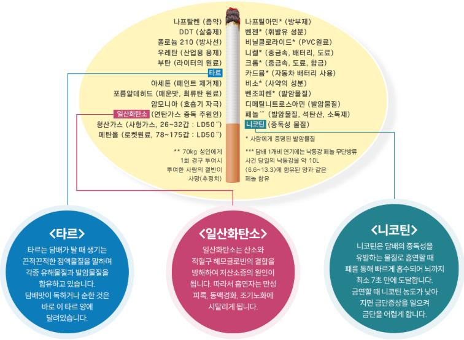
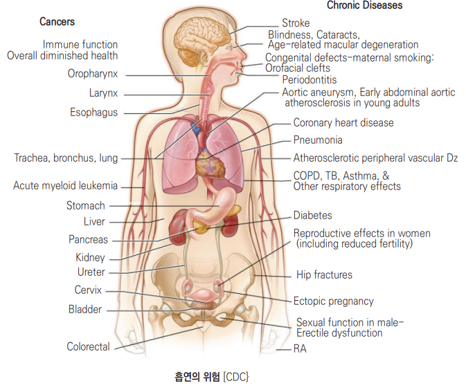

# 흡연 Smoking

## <mark style="color:green;">일반 사항</mark>

<figure><figcaption></figcaption></figure>

### <mark style="color:orange;">흡연의 영향</mark>

* 지속 흡연은 기대수명을 약 10년 단축할 수 있으며, 금연은 연령과 관계없이 조기사망 위험을 낮춘다.
* 관련 질환 : COPD, 폐결핵, 관상동맥질환, 뇌졸중, 말초동맥질환, 당뇨병, 류마티스관절염, 황반변성, 골다공증·골절, 소화성궤양, 남성 성기능 저하, 자궁외임신, 치주질환, 면역기능 저하
* 관련 암 : 폐, 구강, 인두·후두, 식도, 위, 간, 췌장, 신장·신우, 요관, 방광, 자궁경부, 대장·직장 및 급성골수성백혈병
* 담배 연기에는 7,000종 이상의 화학물질과 70종 이상의 발암물질이 포함되어 있으며, 안전한 흡연량은 없다.

**간접흡연**

* 간접흡연(수동흡연)은 흡연자가 내쉬는 담배연기와 담배에서 직접 나오는 연기에 비흡연자가 노출되는 것으로, 담배연기에 직접 노출되지 않는 3차 흡연(잔류물 노출)도 최근 주목받고 있다.
* 간접흡연 노출로도 250여 종의 발암성·독성 화학물질에 노출되며, 직접흡연과 마찬가지로 다양한 질병과 건강 위해를 유발할 수 있다.
* 성인 : 폐암·관상동맥질환·뇌졸중 등 각종 암과 심뇌혈관질환, 조기사망 위험 증가
* 소아·영아 : 영아돌연사증후군(SIDS), 급성 호흡기질환, 중이염, 천식 악화, 폐 기능 발달 저하, 신경발달장애(예 : 매일 1시간 이상 노출 시 ADHD 발생률 유의하게 증가) 위험 증가
* WHO 추산 전 세계적으로 간접흡연으로 사망하는 비흡연자는 연간 약 60만 명(여성 47%, 아동 28%)에 이른다.
* 실외에서도 흡연자로부터 약 3 m 이내에서는 초미세먼지(PM2.5) 농도가 뚜렷이 높고, 유해물질은 약 10 m까지 확산될 수 있어 최소 3 m 이상 거리두기가 권장된다.
* 액상형·궐련형 전자담배도 미세먼지, 블랙카본 등 유해물질을 배출하므로 전자담배 사용 시에도 주변인의 간접 노출 위험이 있을 수 있다.


<figure><figcaption></figcaption></figure>

### <mark style="color:orange;">담배 중독 기전</mark>

* 체내 니코틴 유입 → CNS에서 nicotinic acetylcholine receptor(nAChR)와 결합 → nAChR를 활성화시키고 도파민 분비를 자극 → 각성, 인지력↑, 기분 전환, 불안/긴장감↓, 식욕↓
* 흡입된 니코틴은 수 초 내 뇌에 도달하고 반감기가 짧다. 반복 노출로 내성과 의존이 형성되며, 이후에는 긍정적 효과보다 금단 증상 회피가 흡연 지속의 중요한 동기가 된다.
* 아침 흡연 욕구의 원인 : 수면 중 뇌 속 니코틴 농도 감소에 따른 금단 상태 해소 욕구
* 담배 흡연의 만족감이 니코틴 대체제보다 높은 이유
  1. 흡연 시 니코틴이 수 초 내 뇌에 도달하지만 니코틴 대체제는 상대적으로 천천히 흡수됨
  2. 흡연에 의한 뇌 속 니코틴 농도는 spike 형태로 증가하므로 보다 자극적임
  3. 담배 연기, 라이터 소리, 담배를 물고 있을 때의 입술에서의 느낌 등 니코틴 외 작용이 있음

### <mark style="color:orange;">금단 증상</mark>

* 초조감, 안절부절, 욕구 불만, 화냄, 우울, 불안, 집중력 저하, 불면
* 식욕 증대 또는 체중 증가
* 마지막 니코틴 사용 후 수 시간\~24시간 이내 시작하여 첫 수일\~1주에 가장 심하며, 대부분 2\~4주에 걸쳐 점차 호전한다. 흡연 갈망과 식욕 변화는 더 오래 지속될 수 있다.
* 니코틴 의존은 매일 흡연 전에도 형성될 수 있으며, 청소년은 간헐적 사용만으로도 의존 증상이 나타날 수 있다.

### <mark style="color:orange;">흡연/니코틴 중독 위험 인자</mark>

* 정신 질환 : 우울, 외상후스트레스장애, 조현병
* 낮은 사회 경제적 상태, 낮은 교육 수준
* 이른 시기의 흡연 경험(청소년은 성인에 비하여 중독에 취약함)
* 가족 또는 친구의 흡연
* 다른 약물 남용

### <mark style="color:orange;">금연 효과</mark>

* 20분 후 : 흡연 직후 상승했던 심박동수와 혈압이 낮아지기 시작
* 12시간 후 : 혈중 CO 농도 정상 회복
* 2주\~3개월 후 : 혈액 순환 및 폐 기능 개선
* 1\~9개월 후 : 기침/숨참 호전, 폐 감염 위험↓(기관지 섬모 운동 회복, 기관지 적체 가래 배출)
* 1년 후 : 심혈관 질환 위험↓(흡연자의 ½로 감소)
* 5\~10년 후 : 구강·인후·후두암 위험이 약 절반으로 감소하고 뇌졸중 위험이 지속적으로 감소
* 10\~15년 후 : 폐암 위험이 지속 흡연자의 약 절반으로 감소
* 15년 후 : 관상동맥병 위험↓(비흡연자 수준)

### <mark style="color:$danger;">🚩 Red Flags!</mark>

<mark style="color:$danger;">**즉각 조치 또는 의뢰**</mark>

* Bupropion 복용 중 경련(seizure) 발생 → 즉시 투약 중단, 재투여 금지, 응급 평가
* Varenicline·bupropion 복용 중 급성 자살사고·자해행동 또는 심한 초조·공격성·환각 등 정신상태 급변 → 즉시 중단하고 응급 정신건강 평가
* NRT 사용 중 급성 흉통, 호흡곤란, 심한 두근거림 등 심혈관 증상 → 니코틴 과다 또는 급성 관상동맥증후군 감별 위해 즉시 평가

<mark style="color:$warning;">**당일 또는 조기 의뢰**</mark>

* 최근 급성 심근경색·불안정 협심증·중증 부정맥 병력에서 NRT 시작을 고려하는 경우 → 시작 전 위험-편익 평가, 필요 시 순환기내과 협진
* 기저 우울증·양극성장애·조현병 또는 자살사고 병력이 있는 환자에서 varenicline·bupropion 시작 전 → 정신건강의학과 협진 또는 면밀한 사전 평가와 계획된 추적
* 기침·객혈·호흡곤란·원인불명 체중감소·흉통 등 증상이 동반된 흡연자 → 폐암 등 기저질환 감별을 위한 진단적 영상검사 우선

<mark style="color:$info;">**외래 추적 / 추가 평가 계획**</mark> <mark style="color:$info;">- 즉각 위험 낮으나 호전 없으면 의뢰</mark>

* 국민건강보험공단에서 국가폐암검진 대상자로 통보되었으나 검진받지 않은 경우 → 검진 연계
* 임신부·수유부 흡연 → 행동중재 우선, 약물치료 필요성은 산과와 함께 개별 검토
* 반복적 금연 실패 → 병용요법 전환 또는 치료기간 연장 재평가

## <mark style="color:green;">진단</mark>

### <mark style="color:orange;">담배사용장애 진단 기준 \[DSM-5]</mark>

* 지난 12개월 동안 아래의 임상적으로 의미 있는 장애나 고충으로 이어지는 담배 사용 패턴이 ≥2개이면 담배사용장애로 진단한다. 2\~3개는 경증, 4\~5개는 중등증, ≥6개는 중증이다.

1. 자신이 의도했던 것보다 더 많은 양의 흡연을 하고 더 오랜 시간 흡연한다.
2. 흡연을 줄이거나 끊어보려는 생각을 늘 가지고 있지만 결국 성공하지 못한다.
3. 담배를 구하거나 사용하는데 필요한 활동을 하느라 상당한 시간을 소비한다.
4. 흡연에 대한 갈망 또는 강한 욕망을 경험한다.
5. 반복되는 흡연으로 인해 직장, 학교, 가정에서 해야 할 역할을 수행하지 못한다.
6. 흡연으로 인해서 대인 관계 혹은 사회적인 문제(예: 흡연과 관련된 타인과의 갈등)가 반복적이거나 지속적으로 발생함에도 불구하고 반복해서 흡연한다.
7. 흡연 때문에 중요한 사회적, 직업적 혹은 여가 활동들을 포기하거나 줄여야 한다.
8. 물리적으로 위험한 상황에서도 흡연을 한다(예: 침대에서 흡연).
9. 흡연에 의해서 유발되거나 악화된 육체적이거나 정신적인 문제가 있다는 것을 알고 있음에도 불구하고 흡연을 한다.
10. 다음 사항 중 어느 하나에 해당하는 내성이 발생한다.
    * 원하는 효과를 느낄 때까지 흡연량을 현저하게 늘리려 한다.
    * 같은 양의 담배를 피웠는데도 효과가 현저하게 떨어진다.
11. 다음 사항에 모두 또는 어느 하나에 해당하는 금단 증상이 있다.
    * 흡연 금단에 해당되는 특징적인 증상
    * 금단 증상을 피하기 위해서 또는 해소하기 위해 흡연한다.

### <mark style="color:orange;">담배 금단 진단 기준 \[DSM-5]</mark>

A. 최소 수 주간 매일 흡연한다.

B. 갑자기 흡연을 중단하거나 흡연량을 줄이면 24시간 내 다음 중 ≥4가지의 증상이 발생한다.

1. 초조감, 욕구 불만, 화냄
2. 불안감
3. 집중 곤란
4. 식욕 증가
5. 안절부절못함
6. 우울한 기분
7. 불면

C. B항에 있는 신호와 증상으로 인해 사회적, 직업적 또는 다른 중요한 영역의 기능에서 임상적으로 유의미한 고충이나 장애가 나타난다.

D. 증상과 신체 신호들이 다른 내과적 문제에 의해서 나타난 것이 아니며 다른 정신 질환이나 다른 물질의 중독 혹은 금단에 의한 것이 아니다.

### <mark style="color:orange;">니코틴 의존도 검사 (Korean Version of Fagerstrom Test for Nicotine Dependence)</mark>

1. 아침 기상 후 첫 흡연까지의 시간 : 5분 이내=3점, 6\~30분=2점, 31\~60분=1점, 60분 초과=0점
2. 금연 구역(예: 병원, 도서관, 극장)에서 흡연을 참기 어려움 : 예=1점, 아니오=0점
3. 하루 중 담배 맛이 가장 좋은 때 : 아침 첫 담배=1점, 다른 나머지=0점
4. 하루의 평균 흡연량 : ≤10개비=0점, 11\~20개비=1점, 21\~30개비=2점, ≥31개비=3점
5. 아침 기상 후 첫 몇 시간 동안 하루의 다른 시간대보다 더 자주 흡연 : 예=1점, 아니오=0점
6. 아파서 하루 종일 누워있는 날에도 흡연 : 예=1점, 아니오=0점

▶판정 : 0\~3점=니코틴 의존도 낮음, 4\~6점=중간, 7\~10점=높음\
•1번과 4번은 흡연지표(HSI)로 두 문항 합계가 ≥4점 시 의존도 높음으로 판정

### <mark style="color:orange;">흡연력과 금연치료 전 평가</mark>

* 궐련뿐 아니라 궐련형 전자담배, 액상형 전자담배, 니코틴 파우치 등 모든 담배·니코틴 제품과 이중·다중 사용 여부를 확인한다.
* 현재·과거 사용량, 사용기간, 기상 후 첫 사용 시간, pack-year, 과거 금연 시도와 효과·부작용, 동거인의 흡연을 확인한다.
* 우울·불안·양극성장애·자살사고, 음주와 다른 물질사용, 임신 가능성·수유, 심혈관질환, 간·신장 기능, 현재 복용약을 평가한다.
* 흡연 상태는 문진이 기본이다. 호기 일산화탄소 또는 cotinine 검사는 필요한 경우 금연 상태 확인과 동기강화에 보조적으로 사용할 수 있으나 전자담배·NRT 사용 여부를 함께 해석한다. 액상형 전자담배 단독 사용자는 연소가 일어나지 않아 호기 CO가 비흡연자 수준으로 나올 수 있으므로, 정상 CO만으로 니코틴 사용을 배제하지 않는다.

### <mark style="color:orange;">폐암검진과 영상검사</mark>

* 기침, 객혈, 호흡곤란, 흉통, 체중감소 등 증상이 있으면 진단 목적의 흉부영상검사를 시행하며, 단순 흉부 X선은 무증상 폐암 선별검사가 아니다.
* 국내 국가폐암검진과 미국 USPSTF 기준은 대상 연령·흡연력·주기가 다르므로 아래 표로 구분한다.

<table><thead><tr><th width="130">구분</th><th width="150">대상 연령</th><th width="220">흡연력·조건</th><th>검진 주기</th></tr></thead><tbody><tr><td>국가폐암검진(국내)</td><td>54\~74세</td><td>30갑년 이상 현재 흡연자 및 보건복지부장관 고시 고위험군</td><td>2년마다 저선량 CT</td></tr><tr><td>USPSTF(미국)</td><td>50\~80세</td><td>20 pack-year 이상, 현재 흡연 중이거나 금연 후 15년 이내</td><td>매년 저선량 CT</td></tr></tbody></table>

* 국가폐암검진 실제 대상 여부는 국민건강보험공단 통보 기준으로 확인한다. USPSTF 기준은 국내 급여 대상이 아니며, 금연 후 15년이 경과했거나 기대여명·수술 가능성을 제한하는 건강 문제가 발생하면 중단한다.

***

## <mark style="background-color:$warning;">Management</mark>

### <mark style="color:orange;">치료 방침</mark>

* 모든 담배·니코틴 사용자를 확인하고, 짧고 명료하며 개별화된 금연 권고를 제공한다.
* 재흡연을 의지 부족이나 실패로 낙인찍지 않는다. 담배사용장애는 재발할 수 있는 만성질환이며 반복적인 금연 시도와 치료가 흔히 필요하다.
* 행동중재와 약물치료를 함께 시행할 때 금연 성공률이 가장 높다.
* 금연 준비도가 낮더라도 치료를 미루지 않고 동기와 장애요인을 탐색한다. 즉시 완전 금연이 어렵다면 바레니클린을 이용한 감량 후 금연(reduction-to-quit) 또는 유연한 금연일 설정을 함께 고려한다.

(☞ [금연길라잡이](https://www.nosmokeguide.go.kr/main), 금연상담전화 1544-9030)


**국민건강보험공단 금연치료지원사업**은 통상 8\~12주 동안 6회 이내의 진료·상담과 금연치료의약품 또는 니코틴 보조제 비용을 지원하며 연 3회 참여할 수 있다(2026년 기준). 임상적으로 ＞12주 연장치료가 필요하더라도 지원사업 범위와는 구분하여 설명한다. **본인부담·이수 기준·연간 참여 횟수는 매년 변경될 수 있으므로, 처방 시마다 국민건강보험공단 최신 공지를 확인한다.**


## <mark style="color:green;">비-약물 치료 및 예방</mark>

### <mark style="color:orange;">금연 계획</mark>

#### <mark style="color:$primary;">금연 준비하기</mark>

* 금연 개시 일자를 정한다. 준비 시작부터 2주 이내로 정하는 것이 좋다.
* 가족, 친구, 동료 등 주위에 금연을 시작할 것을 알리고 이해와 협조를 요청한다.
* 금연 시작일까지 흡연량을 줄일 수 있으나, 다른 담배·전자담배로 단순 전환하지 않는다. 감량을 선택할 때도 완전 금연일을 정하고 약물치료와 상담을 병행한다.

#### <mark style="color:$primary;">금연 전날의 행동</mark>

* 담배를 생각나게 하는 각종 물건들(예: 라이터, 재떨이, 성냥)을 모두 치운다.
* 금연을 하게 된 이유를 곰곰이 생각해 보면서 다시 결심을 굳힌다.
* 특히 초기 몇 주간은 니코틴 금단 증상을 포함, 금연을 방해하는 요인들이 많을 것을 각오한다.

#### <mark style="color:$primary;">금연 동기에 대해 생각해 보기</mark>

* 나의 건강 : 질병에 걸리고 싶은 사람은 없을 것이다.
* 나와 가족의 미래 : 내가 심각한 질병에 걸린다면 우리 가족은 어떻게 될 것인가?
* 생활의 변화 : 금연구역 확대, 담배 비용, 가족의 간접흡연 노출과 같은 사회·경제적 부담을 줄일 수 있다.

#### <mark style="color:$primary;">흡연 습관 이기기</mark>

* 커피를 마실 때마다 담배를 피웠던 사람 → 커피 대신 차를 마시거나 산책을 한다.
* 식사 후 항상 담배를 피웠던 사람 → 식사 후 양치질을 하고 산책을 한다.
* 친구들과 같이 담배를 피웠던 사람 → 친구들과 함께 금연하거나 비흡연 친구들과 어울린다.

#### <mark style="color:$primary;">호흡 이완 운동</mark>

* 어깨에서 힘을 빼고 입을 다물고 최대한 천천히 코로 숨을 들이마신다.
* 넷을 셀 때까지 숨을 참다가 천천히 숨을 입으로 내쉬면서 폐에 있는 모든 공기를 다 내뿜는다. 천천히 5회 정도 반복한다.

#### <mark style="color:$primary;">기타 행동 전략</mark>

* 과식을 피하고 기름지거나 맵거나 짠 자극성 음식을 피하고 산뜻하고 가볍게 식사한다.
* 회식 자리에서는 음주나 흡연을 하지 않는 사람들과 주로 시간을 보낸다.
* 과일과 야채를 자주 섭취하고, 주 3회 이상, 회당 30분 이상의 중강도 운동을 꾸준히 시행한다.
* 입이 심심할 때마다 칼로리가 적은 음식(예: 껌, 은단, 당근, 오이, 다시마, 미역)을 섭취한다.
* 스케일링 등 치과 치료를 받는다.
* 금연 후 체중 증가(평균 2\~4 ㎏)가 흔하다. 식이·운동 상담을 함께 제공하되 체중 증가를 이유로 금연을 미루지 않도록 안내한다. bupropion은 상대적으로 체중 증가가 적은 편이다.

### <mark style="color:orange;">금연 동기를 높여주는 전략 5 Rs</mark>

* Relevance : 왜 금연을 해야 하는지 설명함; 흡연자의 나이, 성별, 질환, 위험 인자, 가족, 사회적 상황 등에 맞추어 설명
* Risk : 흡연의 부정적 결과를 인지하도록 질문 “흡연을 하면 어떤 점들이 나쁠까요?”; 삶의 질 저하(예: 성 기능 저하, 심장/호흡 질환에 따른 활동 제한, 중풍), 각종 질병과 암에 의한 고통과 수명 단축
* Reward : 금연의 긍정적 결과를 인지하도록 질문 “금연을 하면 어떤 점들이 좋을까요?”; 건강 증진, 피로 회복, 기억력 향상, 자녀의 흡연률 감소, 성 기능 향상, 금전적 이득
* Roadblock : 금연 방해 인자들에 대해 질문 및 해결책 제시; 스트레스, 흡연의 즐거움, 주위의 흡연자, 음주, 체중 증가, 금단 증상
* Repetition : 방문할 때마다 반복적으로 동기 부여 중재

### <mark style="color:orange;">금연 의지를 높이는 전략 5 As</mark>

* Ask : 모든 환자에게 모든 담배·니코틴 제품의 사용 여부를 질문하고 의무기록에 갱신
* Advise : 명료하고 강력하며 개별화된 금연 권고
* Assess : 금연 목표와 준비도, 선호하는 치료 방법과 장애요인 확인
* Assist : 준비도와 관계없이 상담·약물치료·금연지원서비스를 제안하고 구체적인 금연 또는 감량 후 금연 계획 수립
* Arrange : 치료 시작 후 가능하면 1\~2주 이내 추적하고 이후 반복 방문 또는 전화·문자 상담 연결

진료 시간이 짧으면 **Ask-Advise-Connect** 방식으로 흡연 여부 확인과 명료한 금연 권고 후 금연상담전화·보건소·금연치료 의료기관에 능동적으로 연결한다.

## <mark style="color:green;">약물 치료</mark>

약물치료는 행동중재와 함께 시행한다. 금연치료지원사업에 등록하지 않은 진료와 약제는 일반적으로 비급여이므로 지원사업 참여 여부를 먼저 확인한다.

### <mark style="color:orange;">국내 2023 금연 임상진료지침의 핵심 권고</mark>

| 임상 상황         | 권고                                            | 효과 해석                                 |
| ------------- | --------------------------------------------- | ------------------------------------- |
| 일반 성인         | 니코틴 패치 또는 bupropion보다 varenicline 우선          | 패치 대비 RR 1.20, bupropion 대비 RR 1.30   |
| 병합요법          | varenicline 단독보다 varenicline＋니코틴 패치를 선택적으로 적용 | 장기 금연 성공률의 상대적 증가 RR 1.27; 약한 권고      |
| 치료기간          | 6\\\~12주보다 ＞12주 연장치료 권고                       | 상대적으로 약 18% 증가(RR 1.18); 절대차 18%p가 아님 |
| 금연 준비도가 낮은 성인 | 준비될 때까지 기다리기보다 varenicline 치료 시작 고려           | 유연한 금연일 또는 감량 후 금연 적용 가능              |
| 정신질환          | NRT보다 varenicline 우선 권고                       | 금기는 아니나 치료 전후 면밀한 모니터링                |
| COPD          | varenicline, bupropion 또는 NRT를 포함한 약물치료 권고    | 급성 악화 중 치료 근거는 제한적                    |

### <mark style="color:orange;">약제 선택 원칙</mark>

* 금기가 없고 환자가 수용하면 varenicline을 우선 고려한다.
* NRT는 단일제보다 지속형 패치＋속효성 껌/로젠즈 병합이 더 효과적일 수 있다. 다만 국내 일부 일반의약품 첨부문서는 다른 NRT 병용을 금지하므로 제품별 허가사항을 확인하고, 허가 외 병합이 되는 경우에는 이를 설명한 뒤 의료진 감독하에 사용한다.
* varenicline＋니코틴 패치는 지침이 인정한 선택적 병합요법이다. varenicline＋bupropion은 허가 외 병용으로 근거와 부작용을 고려하여 제한적으로 사용한다.
* 임신·수유부와 청소년은 행동중재가 기본이다. 약물치료가 필요하면 이득과 위험, 국내 허가사항을 검토하여 개별 결정한다.

### <mark style="color:orange;">니코틴 대체 요법(Nicotine Replacement Therapy, NRT)</mark>

* 평소 흡연량, 기상 후 첫 흡연 시간, 이전 금단 정도를 고려하여 초기 용량을 정한다.
* 니코틴을 담배 연기의 독성물질 없이 공급하여 금단과 갈망을 줄인다. 계속 흡연하는 것보다 위해가 훨씬 낮지만 과량 사용 시 구역, 어지럼, 두통, 두근거림, 혈압 상승 등 니코틴 과다 증상이 생길 수 있다.
* 최근 급성 심혈관 사건, 불안정 협심증, 중증 부정맥, 급성 뇌졸중, 조절되지 않는 고혈압, 임신·수유, 18세 미만에서는 제품별 금기·주의를 확인하고 전문가가 위험-편익을 평가한다.
* 국내 일반의약품 첨부문서는 NRT 사용 중 흡연을 피하도록 안내한다. 금연 전 감량이나 복합 NRT를 사용할 때는 제품별 허가 여부를 확인하고 의료진이 구체적인 계획과 니코틴 과다 증상을 교육한다.
* 치료기간은 대개 8\~12주이나 제품과 재발 위험에 따라 연장할 수 있다. 감량 일정과 최대 사용기간은 제품별 허가사항을 따른다.

#### <mark style="color:$primary;">니코틴 패치</mark>

* 국내 <mark style="color:blue;">\[니코틴엘 TTS 30·20·10]</mark>은 각각 약 21·14·7 ㎎/24시간을 방출한다.
  * ≥20개비/day : TTS 30 ×4주 → TTS 20 ×4주 → TTS 10 ×4주
  * ＜20개비/day : TTS 20 ×8주 → TTS 10 ×4주
* 국내 해당 제품의 치료기간은 3개월을 초과하지 않는다. 다른 패치 제품은 표시량·방출시간·감량 일정이 다를 수 있으므로 해당 첨부문서를 따른다.
* 매일 같은 시간에 털이 없고 상처가 없는 상완·몸통·허벅지 등에 부착하고 부위를 교대한다.
* 피부 자극이 심하면 부위를 변경하고, 불면이나 생생한 꿈이 지속되면 취침 전 제거를 고려한다.

#### <mark style="color:$primary;">니코틴 껌</mark>

* 국내 <mark style="color:blue;">\[니코틴엘껌 2 ㎎·4 ㎎]</mark> : 통상 1일 8\~12개, **1일 최대 15개**. 국내 첨부문서상 하루 20개비 이하 흡연자는 2 ㎎, 하루 20개비 초과 또는 2 ㎎ 제품으로 실패한 경우에는 4 ㎎을 권장한다. 기상 후 첫 흡연 시간과 이전 금단 정도도 임상적 의존도 평가에 참고하되, 이는 해당 제품의 직접적인 허가 선택 기준과 구분한다.
* 천천히 몇 차례 씹어 얼얼한 맛이 나면 잇몸과 볼 사이에 두고, 맛이 약해지면 다시 씹는 동작을 약 30분 반복한다(chew-and-park).
* 커피, 주스, 탄산음료 등 산성 음료는 흡수를 방해하므로 사용 15분 전부터 사용 중에는 피한다.
* 의치, 측두하악관절질환이 있으면 로젠즈 또는 패치를 고려한다.

#### <mark style="color:$primary;">니코틴 로젠즈·트로키</mark>

* 국내 <mark style="color:blue;">\[니코틴엘로젠즈민트향트로키 1 ㎎·니코맨트로키 1 ㎎]</mark> : 초기 1회 1정씩 1\~2시간 간격, 통상 1일 8\~12정, **1일 최대 25정**을 사용한다.
* 2 ㎎/4 ㎎ 로젠즈도 국내 허가 등록된 품목이 있으나 허가 등록이 현재의 실제 유통·수급을 보장하지는 않는다. 확인된 국내 2 ㎎/4 ㎎ 제품은 통상 1일 8\~12정, **1일 최대 15정**이지만, 제품마다 고함량 선택 기준이 다르므로 처방·구입 시 최신 유통 여부와 해당 첨부문서를 확인한다. 미국 2 ㎎/4 ㎎ lozenge 알고리듬이나 특정 제품의 흡연량 기준을 다른 국내 제품에 일률적으로 적용하지 않는다.
* 씹거나 통째로 삼키지 말고 약 20\~30분에 걸쳐 입안에서 천천히 녹인다. 산성 음료는 사용 15분 전부터 사용 중에는 피한다.
* 대개 3개월 후 단계적으로 감량하며 1일 1\~2정으로 감소하면 중단한다. 6개월 이상 사용은 제품설명서와 재발 위험을 검토한다.

### <mark style="color:orange;">Varenicline</mark>

* 기전 : α4β2 nicotinic acetylcholine receptor partial agonist로 금단과 갈망을 줄이고 흡연 시 보상효과를 감소시킨다.
* 현재 국내 유통 제품 예 : <mark style="color:blue;">\[니코챔스·노코틴]</mark>. <mark style="color:blue;">\[챔픽스]</mark>는 2024년 국내 품목허가가 취하되어 더 이상 유통되지 않는다. **바레니클린 시장은 제네릭 허가 반납이 이어지며 유동적이므로, 처방 시마다 해당 제품의 최신 허가·유통 상태와 첨부문서를 다시 확인한다.**
* 표준 용법 : 0.5 ㎎ qd ×3일 → 0.5 ㎎ bid ×4일 → 1 ㎎ bid, 총 12주. 식후 충분한 물과 함께 복용한다.
* 금연일은 투여 시작 1주 후로 정하거나 투여 8\~35일 사이에 유연하게 설정할 수 있다.
* 즉시 금연이 어렵다면 첫 4주에 흡연량 50% 감량 → 다음 4주에 추가 50% 감량 → 12주까지 완전 금연 후 추가 12주 치료하는 reduction-to-quit 방법을 고려한다.
* 첫 12주 치료로 금연에 성공했거나 재발 위험이 높으면 추가 12주 치료를 고려한다. ＞24주 치료는 근거, 허가 범위와 환자 상황을 확인한다.
* 흔한 부작용 : 구역, 소화불량, 불면, 생생한 꿈, 두통. 오심은 식후 충분한 물과 복용하거나 일시 감량하면 호전될 수 있다.
* 정신질환은 금기가 아니다. 다만 기저 정신질환·자살사고 병력을 확인하고, 새로운 또는 악화되는 초조·우울·이상행동·자살사고가 나타나면 즉시 중단하고 평가한다. FDA는 2016년 시판 후 대규모 정신과적 안전성 연구(EAGLES 등) 결과를 근거로 varenicline의 신경정신과 관련 boxed warning을 철회했다.
* 신장애 : CrCl ＜30 ㎖/min이면 개시 용량 0.5 ㎎ qd로 시작하고, 내약성이 좋으면 필요에 따라 최대 0.5 ㎎ bid까지 증량한다. 혈액투석 환자는 내약 시 최대 0.5 ㎎ qd. 경증\~중등도 신장애는 통상 감량이 필요하지 않으나 이상반응을 관찰한다.
* 임신·수유부와 국내 허가 연령 미만에서는 통상 사용하지 않는다.

### <mark style="color:orange;">Bupropion SR</mark>

* 기전 : dopamine·norepinephrine 재흡수를 억제하고 nicotinic receptor에 길항하여 금단과 갈망을 줄인다.
* 금연치료 적응증이 있는 **SR 제형**을 사용한다. 현재 국내 제품 예 : <mark style="color:blue;">\[니코피온서방정 150 ㎎·애드피온서방정 150 ㎎]</mark>. **주의 — 우울증에 쓰이는&#x20;**<mark style="color:blue;">**\[웰부트린 엑스엘]**</mark>**(XL, 1일 1회 서방정)은 금연 적응증이 없으며, 1일 2회(bid) 복용하는 금연용 SR 제형과 절대 바꾸어 사용하지 않는다.** 처방 전산에서 성분명이 같아 혼동되기 쉬우므로 제품명·용법을 재확인한다.
* 환자가 아직 흡연 중일 때 시작하고 첫 2주 이내에 목표 금연일을 정한다. 국내 허가 용법은 150 ㎎ qAM ×6일 → 150 ㎎ bid이며, 두 투여 간격은 최소 8시간, 1회 최대 150 ㎎, 1일 최대 300 ㎎이다.
* 불면을 줄이기 위해 두 번째 용량은 늦은 저녁을 피한다. 정제를 분할·분쇄·씹지 않는다.
* 최소 7주, 통상 7\~12주 치료한다. 7주까지 금연 방향으로 유의한 진전이 없으면 순응도·금단·진단을 재평가하고 중단 또는 변경을 고려한다.
* NRT와 병용할 수 있으나 혈압 상승 위험을 모니터링한다.
* 흔한 부작용 : 불면, 입마름, 불안, 두통, 소화불량. 발작 위험은 용량 의존적이다.


**Bupropion 금기** : 성분 과민반응, 발작장애 또는 발작 병력, 중추신경계 종양, 현재 또는 과거 신경성 식욕부진·폭식증, MAO 억제제 투여 중 또는 중단 후 14일 이내, 알코올·benzodiazepine·barbiturate·항경련제의 갑작스러운 중단, 다른 bupropion 함유 제제 병용, 국내 금연보조제 허가사항상 양극성장애 병력.



**발작 위험 증가—신중 투여** : 두부외상, 중증 간경변, insulin·경구혈당강하제로 치료 중인 당뇨병, 과도한 음주·약물사용, 항정신병약·다른 항우울제·tramadol·theophylline·전신 스테로이드·quinolone계 항생제·항말라리아약·진정성 항히스타민제 등 발작역치를 낮추는 병용약물. 발작이 발생하면 영구 중단하고 재투여하지 않는다.

중증 간경변증에서는 100 ㎎/day 또는 150 ㎎ 격일을 초과하지 않는다. 국내 150 ㎎ SR 제형을 사용하는 경우에는 150 ㎎ 격일이 된다. 경증\~중등도 간장애와 신장애에서는 국내 첨부문서상 "투여횟수 및/또는 투여량 감소를 고려"하도록 되어 있을 뿐 고정된 수치는 제시되지 않는다. 표준 bid 증량을 피하고 150 ㎎ qAM(1일 1회) 유지 또는 투여간격 연장을 환자별 간·신장 기능과 이상반응에 따라 개별적으로 고려하며, 불면·구갈·발작 등 축적 소견을 관찰한다.


### <mark style="color:orange;">2차·허가 외 약물</mark>

* **Nortriptyline**은 일부 지침에서 2차 약제로 제시되지만 국내 금연 적응증이 없는 허가 외 사용이다. 항콜린성 부작용, 기립저혈압, 심전도 이상과 과량복용 독성을 고려하여 1차 선택으로 사용하지 않는다.
* 침술, 금연초, 최면요법, 레이저치료는 위약보다 일관된 우월성이 입증되지 않았다.
* nicotine vaccine은 승인된 임상 치료가 아니므로 처방 선택지에 포함하지 않는다.
* **Cytisinicline**(시티시니클린; cytisine과 동일 성분에 사용되는 명칭)은 α4β2 nAChR partial agonist이다. 미국에서는 2026년 6월 CRL(Complete Response Letter)이 발급되어 아직 승인되지 않았으며 회사는 재제출을 준비 중이다. 회사 발표에 따르면 CRL은 제3자 제조시설과 최종 표시사항에 관한 것이며 임상적 유효성·안전성 결함은 지적되지 않았다. 국내 허가 제품이 아니므로 현재 처방 선택지가 아니다.

### <mark style="color:orange;">흡연 중단에 따른 약물상호작용</mark>


담배 연기의 다환방향족탄화수소는 CYP1A2를 유도한다. 금연하거나 흡연량을 크게 줄이면 이 유도가 수일 내 소실되어 **clozapine, olanzapine, theophylline, caffeine** 농도가 상승할 수 있다. 이는 니코틴 때문이 아니므로 NRT나 전자담배로 바꾸어도 발생할 수 있다.

금연 전 복용약을 확인하고, 금연 후 진정·혼돈·경련·빈맥·구역 등 독성을 관찰하며 필요하면 혈중농도와 용량을 조정한다. Theophylline은 혈중농도 상승과 발작역치 저하가 함께 문제가 될 수 있다. Warfarin은 근거가 상대적으로 제한적이나 흡연량 변화 시 INR 변동 가능성을 고려하여 추가 모니터링한다.


### <mark style="color:orange;">전자담배·가열담배</mark>

* 전자담배는 국내에서 승인된 금연치료제가 아니다. 일부 연구에서 니코틴 전자담배의 금연 효과가 보고되었으나 제품 간 니코틴 전달량·첨가물 변이가 크고, 장기간 사용에 따른 폐·심혈관 안전성은 아직 충분히 규명되지 않았다.
* 비흡연자·청소년에게 권하지 않는다. 국내 청소년에서는 궐련 사용률이 감소하는 가운데 액상형 전자담배 사용과 여러 담배제품의 중복사용 양상이 확인되어 별도의 주의가 필요하다(질병관리청 청소년건강행태조사, 2025년 기준). 궐련과 전자담배의 이중사용은 금연으로 간주하지 않으며, 가열담배로의 단순 전환도 완전한 담배 중단이 아니다.
* 니코틴 파우치(구강용 무연 니코틴 제품)도 금연치료제로 승인되지 않았으며 국내외 근거가 제한적이다. 전자담배와 마찬가지로 완전한 담배 중단의 대체 수단으로 권하지 않는다.
* 2026년 4월 24일부터 합성니코틴 액상형 전자담배도 「담배사업법」상 담배에 포함되어 미성년자 판매·온라인 판매 제한, 광고 제한, 건강경고 표시 및 금연구역 사용 제한 등 관련 규제를 적용받는다. 일률적인 니코틴 함량 상한으로 설명하지 않는다.

## <mark style="color:green;">금연 실패 대처</mark>

* 복용법·순응도, 충분한 용량과 기간, 금단 증상, 음주·우울·불안, 흡연 유발 상황과 사회적 지지를 확인한다.
* NRT 단일제로 갈망이 지속되면 용량을 재평가하거나 패치＋껌/로젠즈 병합을 고려한다.
* 바레니클린 단독으로 충분하지 않으면 니코틴 패치를 선택적으로 추가할 수 있다. 구역·불면·피부반응 등 이상반응을 확인한다. 처음부터 병합요법으로 시작하기보다, 단독요법으로 충분한 금연·금단 완화 효과를 거두지 못했을 때 순차적으로 병합요법을 도입하는 방식이 환자·의료진 모두에게 현실적으로 수용성이 높다.
* bupropion＋NRT는 혈압과 발작 위험을 평가한 뒤 고려한다. varenicline＋bupropion은 허가 외 병용이므로 일률적으로 사용하지 않는다.
* 4주라는 시점만으로 기계적으로 실패를 판정하지 않는다. 복약 순응도와 흡연량 감소, 금연 시도 여부를 함께 평가하여 약물 교체·추가 또는 치료기간 연장을 결정한다.

#### <mark style="color:$primary;">재흡연</mark>

* 재흡연은 ‘실패’가 아니라 치료과정에서 흔한 사건임을 설명한다. 짧은 비흡연 기간도 성과이며 즉시 치료를 다시 시작할 수 있다.
* 재흡연 직전의 상황, 갈망·금단, 음주, 약물 누락, 부작용을 구체적으로 파악한다.
* 첫 주는 재흡연 위험이 특히 높으므로 조기 추적, 가족·친구의 지지, 상담전화 등 지원자원을 집중한다.
* 스트레스, 음주, 흡연자 모임 등 유발 상황을 피하거나 대처계획을 세운다.
* 알코올사용장애, 우울증 등 금연을 방해하는 동반질환을 함께 치료한다.
* 이전에 효과가 있었던 약제를 다시 사용하거나, 금기와 부작용을 확인한 뒤 근거가 있는 병합요법을 시행한다.

***

### <mark style="color:red;">질병코드</mark>

<mark style="color:red;">Z72.0 담배사용</mark>

<mark style="color:red;">F17.2 담배흡연의 의존증후군</mark>

<mark style="color:red;">Z71.6 담배사용에 대한 상담 및 의학적 권고</mark>

***

### <mark style="color:purple;">처방례</mark>

아래 처방은 **성인 예시**이며, 국내 허가사항·금연치료지원사업 기준, 신장·간 기능, 병용약물과 이상반응에 따라 조정한다.

> **처방례 1. Varenicline 표준요법**
>
> ```
> Varenicline 0.5 ㎎  1T  qd   (1–3일)
> Varenicline 0.5 ㎎  1T  bid  (4–7일)
> Varenicline 1 ㎎    1T  bid  (8일–12주)
> ```
>
> _✽식후 충분한 물과 함께 복용. 투여 시작 1주 후 또는 8\~35일 사이에 금연일 설정. 1\~2주 이내 추적하여 오심, 수면장애, 정신상태와 금연 여부를 확인_

> **처방례 2. Bupropion SR**
>
> ```
> 니코피온서방정 150 ㎎  1T  qAM  (1–6일)
> 니코피온서방정 150 ㎎  1T  bid  (7일부터, 최소 8시간 간격, 총 7–12주)
> ```
>
> _✽첫 2주 이내 목표 금연일 설정. 늦은 저녁 복용 회피, 정제를 분할·분쇄·씹지 않음. 혈압, 불면, 정신상태와 발작 위험요인을 확인_

> **처방례 3. 복합 NRT**
>
> ```
> 니코틴엘 TTS30  1매  qd  (약 21 ㎎/24시간 방출)
> 니코틴엘껌 2 ㎎  갈망 시 필요시  (1일 최대 15개)
> ```
>
> _✽패치 용량과 속효성 제제 최대 사용량은 국내 제품설명서를 따른다. 복합 NRT는 지침상 근거가 있으나 국내 일부 제품에서는 허가 외 병용이 될 수 있으므로 제품별 병용 금기·주의를 확인하고 이를 설명한 뒤 의료진 감독하에 사용하며, 니코틴 과다 증상을 조기에 확인한다._

***

### <mark style="color:$success;">핵심 복약 지도</mark>

> **Varenicline**
>
> 식후 충분한 물과 복용합니다. 오심이 심하면 임의 중단하지 말고 감량 여부를 상담합니다. 심한 우울, 초조, 이상행동 또는 자살사고가 생기면 즉시 중단하고 진료받습니다.

> **Bupropion SR**
>
> 두 번 복용할 때 최소 8시간 간격을 두고 늦은 저녁은 피합니다. 정제를 쪼개거나 씹지 않습니다. 발작이 발생하면 다시 복용하지 않습니다.

> **니코틴 패치**
>
> 매일 다른 부위에 붙입니다. 불면이나 생생한 꿈이 지속되면 취침 전 제거를 상담합니다.

> **니코틴 껌**
>
> 계속 씹지 말고 ‘천천히 씹기 – 볼과 잇몸 사이에 두기’를 약 30분 반복합니다.

> **니코틴 로젠즈·트로키**
>
> 씹거나 삼키지 말고 천천히 녹입니다. 사용 15분 전부터 사용 중에는 커피·주스·탄산음료를 피합니다.

> **병용약물 확인**
>
> 금연 또는 큰 폭의 감량을 시작하면 clozapine, olanzapine, theophylline 등을 복용 중인 환자는 반드시 처방의에게 알립니다.

> **언제 다시 병원을 방문해야 하나요?**
>
> * 심한 우울, 초조, 이상행동 또는 자살사고가 생긴 경우 — 즉시 내원
> * Bupropion 복용 중 경련이 발생한 경우 — 즉시 내원, 약물 중단
> * 흉통, 호흡곤란, 심한 두근거림 등 심혈관 증상이 생긴 경우 — 즉시 내원
> * 정해진 금연일에 금연을 시작하지 못했거나 재흡연한 경우 — 다음 진료 전이라도 상담

***

### <mark style="color:blue;">환자 안내서</mark>


**금연은 나이와 흡연 기간에 관계없이 건강에 도움이 됩니다**

담배 의존은 의지 부족이 아니라 니코틴에 의한 만성질환입니다. 여러 번 시도하는 것이 흔하며, 다시 피웠더라도 즉시 치료를 다시 시작할 수 있습니다.


#### <mark style="color:$primary;">금연을 어떻게 준비하나요?</mark>

* 금연일을 정하고 담배·전자담배·라이터·재떨이를 치웁니다.
* 가열담배나 전자담배로 바꾸는 것은 완전한 금연이 아닙니다.

#### <mark style="color:$primary;">금단 증상과 갈망은 어떻게 넘기나요?</mark>

* 첫 며칠\~2주는 짜증, 불안, 집중 저하, 불면, 식욕 증가와 강한 갈망이 생길 수 있으나 대부분 점차 좋아집니다.
* 갈망은 보통 수 분 안에 약해집니다. 물 마시기, 천천히 심호흡하기, 산책하기, 양치하기, 무가당 껌 씹기 등으로 넘깁니다.

#### <mark style="color:$primary;">주위에 어떻게 도움을 요청하나요?</mark>

* 초기에는 음주와 흡연 모임을 피하고 가족·친구에게 도움을 요청합니다.
* 금연길라잡이와 금연상담전화 ☎ 1544-9030, 보건소 금연클리닉, 국민건강보험공단 금연치료 의료기관을 이용할 수 있습니다.

#### <mark style="color:$primary;">이럴 때는 즉시 병원을 방문하세요</mark>

* 심한 우울감, 불안, 이상행동 또는 자살 생각이 들 때
* 약을 먹고 있는데 경련이 있었을 때
* 갑자기 가슴이 아프거나 숨이 차거나 심장이 심하게 뛸 때

### <mark style="color:orange;">참고문헌</mark>

1. 서유빈 외. [금연치료지원사업을 위한 임상진료지침](https://www.jksrnt.org/journal/download_pdf.php?doi=10.25055%2FJKSRNT.2023.14.2.41). 대한금연학회지. 2023;14(2):41-48.
2. World Health Organization. [WHO clinical treatment guideline for tobacco cessation in adults](https://www.who.int/publications/i/item/9789240096431). 2024.
3. 국가암정보센터. [국가암검진사업](https://www.cancer.go.kr/lay1/S1T198C261/sublink.do).
4. 국가법령정보센터. [담배사업법](https://www.law.go.kr/LSW/lsInfoP.do?lsiSeq=280343).
5. Achieve Life Sciences. [Achieve Life Sciences Receives Complete Response Letter from FDA for Cytisinicline NDA](https://achievelifesciences.com/achieve-receives-complete-response-letter-from-fda-for-cytisinicline-nda/). 2026.6.22.
6. 식품의약품안전처 의약품통합정보시스템. [의약품등 제품정보 검색](https://nedrug.mfds.go.kr/searchDrug). 대표 품목기준코드: 니코챔스정0.5밀리그램 202002939, 노코틴정0.5밀리그램 202301090, 니코피온서방정150밀리그램 200801900, 애드피온서방정150밀리그램 201605175, 니코틴엘TTS30 199806464, 니코틴엘껌2밀리그램 200603856, 니코틴엘껌4밀리그램 200603857, 니코틴엘로젠즈민트향트로키1밀리그램 200511037.
7. US Preventive Services Task Force. [Lung Cancer: Screening](https://www.uspreventiveservicestaskforce.org/uspstf/recommendation/lung-cancer-screening). 2021.
8. Anthenelli RM, et al. Neuropsychiatric safety and efficacy of varenicline, bupropion, and nicotine patch (EAGLES trial). Lancet. 2016;387(10037):2507-2520.
9. 질병관리청. [청소년건강행태조사](https://www.kdca.go.kr/yhs/). 2025년 통계.
10. 대한폐암학회. [간접흡연의 폐해](https://lungca.or.kr/general/nosmoke/?doc=effect&dep_num=9).
11. 질병관리청. [간접흡연](https://health.kdca.go.kr/healthinfo/biz/health/gnrlzHealthInfo/gnrlzHealthInfo/gnrlzHealthInfoView.do?cntnts_sn=1281). 국가건강정보포털.
