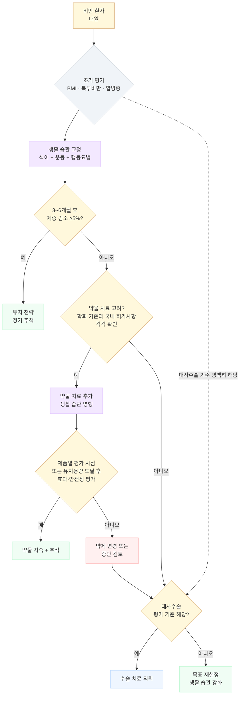

# 비만 Obesity

## <mark style="color:green;">일반 사항</mark>

* 비만의 임상적 의미 : 사망 위험이 가장 낮은 BMI 범위는 연령·성별·흡연·기저질환 등에 따라 달라 단일 수치로 단정하지 않음. 치료 전 체중의 3\~5% 감량만으로도 혈당·혈압·혈중 지질 등 대사 위험인자가 개선될 수 있고, 5\~10% 감량 시 여러 비만 관련 합병증의 임상적 개선이 더 뚜렷해짐

### <mark style="color:orange;">정의</mark>

#### <mark style="color:$primary;">체질량지수(Body Mass Index, BMI) 기준</mark>

<table><thead><tr><th width="112.2105712890625">BMI (㎏/㎡)</th><th width="118.52630615234375">대한비만학회¹⁾ (2024)</th><th width="114.26318359375">WHO (아시아/태평양)</th><th width="124.5262451171875">WHO (세계)/CDC</th><th>관련 질환 위험도, 복부비만(−) 시 ²⁾</th><th>관련 질환 위험도, 복부비만(+) 시</th></tr></thead><tbody><tr><td>&#x3C;18.5</td><td>저체중</td><td>저체중</td><td>저체중</td><td>낮음</td><td>보통</td></tr><tr><td>18.5~22.9</td><td>정상</td><td>정상</td><td>정상</td><td>보통</td><td>약간 높음</td></tr><tr><td>23~24.9</td><td>비만 전단계</td><td>과체중</td><td>정상</td><td>증가</td><td>높음</td></tr><tr><td>25~29.9</td><td>1단계 비만</td><td>비만</td><td>과체중</td><td>높음</td><td>매우 높음</td></tr><tr><td>30~34.9</td><td>2단계 비만</td><td>고도 비만</td><td>비만 (Class I)</td><td>매우 높음</td><td>매우 높음</td></tr><tr><td>35~39.9</td><td>3단계 비만</td><td>고도 비만</td><td>비만 (Class II)</td><td>극도로 높음</td><td>극도로 높음</td></tr><tr><td>≥40</td><td>3단계 비만</td><td>고도 비만</td><td>비만 (Class III)</td><td>극도로 높음</td><td>극도로 높음</td></tr></tbody></table>

¹⁾ 비만 전단계는 '과체중' 또는 '위험체중'으로, 3단계 비만은 '고도 비만'으로도 부를 수 있음; 일부 문헌에서는 BMI ≥40을 '초고도 비만'으로 별도 표기하기도 하나 국내 공식 3단계 분류에 통용되는 용어는 아님\
²⁾ 복부비만 유무에 따른 관련 질환 위험도: 복부 비만은 BMI와 독립적으로 대사증후군, 당뇨병, 관상동맥병의 이환율과 사망률을 증가시키므로 복부비만이 있는 경우에는 위험도를 한 단계 높여 관리

#### <mark style="color:$primary;">복부 비만 (허리 둘레)</mark>

<table><thead><tr><th width="276.368408203125">기관</th><th width="289.73687744140625">남성</th><th width="158.73687744140625">여성</th></tr></thead><tbody><tr><td>대한비만학회(한국인 기준)</td><td>≥90 ㎝</td><td>≥85 ㎝</td></tr><tr><td>WHO 아시아·태평양</td><td>≥90 ㎝</td><td>≥80 ㎝</td></tr><tr><td>IDF (국제당뇨병연맹) 동아시아</td><td>≥90 ㎝</td><td>≥80 ㎝</td></tr><tr><td>WHO Europid 기준</td><td>≥94 ㎝ (증가) / ≥102 ㎝ (현저히 증가)</td><td>≥80 ㎝ / ≥88 ㎝</td></tr><tr><td>미국 NIH/NHLBI</td><td>≥102 ㎝</td><td>≥88 ㎝</td></tr></tbody></table>

* 한국인(대한비만학회) 기준은 여성 ≥85 ㎝, WHO 아시아·태평양/IDF 동아시아 기준은 여성 ≥80 ㎝로 서로 다르므로 인용 시 출처를 명시
* 허리-엉덩이 둘레비 (Waist-to-hip ratio) : \[WHO-아시아] 남성 ＞ 0.9, 여성 ＞ 0.8
* BMI가 정상 범위이더라도 복부 비만이 있으면 cardiometabolic risk(인슐린 저항성, T2DM, CVD)가 유의하게 증가할 수 있음
* 아시아인과 서양인의 차이 : 동일 BMI에서 아시아인은 평균적으로 체지방률과 내장지방량이 더 높고, 상대적으로 낮은 BMI에서도 대사 위험이 나타나는 경향이 있음 — 이러한 체성분 차이를 반영하여 아시아인에게는 완화된 BMI·허리둘레 기준을 적용
  * 아시아인에서는 '마른 비만(metabolically obese normal weight)'이 서양인보다 훨씬 흔함

#### <mark style="color:$primary;">체지방률</mark>

* 임상·연구에서 흔히 사용하는 참고 절단값 : 남 ≥25%, 여 ≥35%
* 국제적으로 합의된 단일 진단 기준이 존재하지 않음; 같은 사람도 측정 방법에 따라 결과가 다름
* BMI·허리둘레를 보완하는 참고 지표로 사용

### <mark style="color:orange;">비만 관련 합병증</mark>

<table><thead><tr><th width="123.15789794921875">계통</th><th>주요 합병증</th></tr></thead><tbody><tr><td>대사</td><td>인슐린 저항성, 2형 당뇨병, 이상지질혈증, 대사증후군, MASLD/MASH (기존 NAFLD/NASH)</td></tr><tr><td>심혈관</td><td>고혈압, 관상동맥질환, 심부전, 심방세동, 뇌졸중</td></tr><tr><td>호흡기</td><td>폐쇄수면무호흡증(OSA), 비만 저환기증(OHS), 천식 악화</td></tr><tr><td>근골격</td><td>퇴행성 관절염(슬관절·고관절), 통풍, 요통</td></tr><tr><td>소화기</td><td>GERD, 담석증</td></tr><tr><td>생식/내분비</td><td>다낭성난소증후군(PCOS), 불임, 임신 합병증, 남성 성기능 장애</td></tr><tr><td>종양</td><td>자궁내막암, 유방암, 대장암, 신장암, 간암 위험 증가</td></tr><tr><td>심리/사회</td><td>우울증, 불안장애, 자존감 저하, 삶의 질 감소</td></tr></tbody></table>

### <mark style="color:orange;">고령자 유의 사항</mark>

* 일반적으로 \~65세에는 연령 증가에 따라 체중 증가가 나타나지만, 이는 주로 지방량 증가에 의한 것이며 제지방량(fat-free mass)은 오히려 감소함
* 일부 고령자 관찰연구에서는 과체중과 낮은 사망률의 연관성(이른바 obesity paradox)이 보고되지만, 역인과성, 선택 편향, 흡연 및 기저질환에 의한 체중 감소 등의 영향을 배제하기 어려워 인과관계는 확립되지 않음
* 비만 진단 시 BMI와 함께 허리둘레, 허리-엉덩이 둘레비로 복부 비만 여부를 병행 평가; 노화에 따른 체성분 변화(지방량↑, 제지방↓) 및 신장 감소로 BMI 단독 적용이 부정확할 수 있음
* 감량 여부와 목표는 비만 관련 합병증뿐 아니라 허약, 근감소증, 영양상태 및 신체 기능을 종합하여 결정
* 감량이 필요한 경우 충분한 단백질 섭취와 저항성 운동을 병행하여 근육량과 기능 보존을 우선

## <mark style="color:green;">분류 및 원인</mark>

### <mark style="color:orange;">분류</mark>

#### <mark style="color:$primary;">원인에 따라</mark>

**1차성(단순성) 비만**

* 에너지 섭취-소비 불균형으로 체내 칼로리가 지방으로 축적되어 발생
* 전체 비만의 약 90% 해당
* 생활 습관, 연령, 인종, 유전, 장내 미생물, 환경 화학 물질/독소 등 여러 인자가 복합적으로 관여
* 과식하는 사람은 섭식 조절 기능이 저하되어 있을 가능성이 높음

**2차성 비만**

* 유전자 돌연변이, 선천성 장애, 약물, 신경계 질환, 내분비계 질환(갑상선저하증, 쿠싱증후군, 다낭성난소증후군, 성장호르몬 결핍), 정신 질환 등에 의한 비만

#### <mark style="color:$primary;">장기 기능 손상 여부에 따라</mark>

* 치료 적응증 결정과 목표 설정에 실용적 근거를 제공 \[Lancet commission on obesity, 2025]

**전임상 비만** (preclinical obesity)

* 과잉 지방 축적이 있으나 현재 비만에 직접 기인한 장기 기능장애 또는 유의한 일상생활 제한이 없는 상태. 향후 임상 비만 및 다른 질환의 위험은 증가할 수 있음

**임상 비만**(clinical obesity)

* 과잉 지방 축적과 함께 비만에 직접 기인한 객관적인 장기 기능장애 및/또는 연령을 고려한 유의한 일상생활 제한이 있는 상태


**새로운 제안 체계**  
임상/전임상 비만은 Lancet Commission(2025)이 제안한 분류이며, 아직 국내 진단·허가·급여 기준이나 기존 BMI·허리둘레 평가를 대체하지 않는다.


### <mark style="color:orange;">위험 인자</mark>

* 칼로리 농축 음식 소비, 고지방 식사, 빈번한 패스트푸드 섭취
* 활동이 적은 생활 방식, 하루 2시간 이상의 TV 시청 또는 IT 기기 사용
* 하루 6시간 미만의 수면
* 낮은 사회경제적 상태
* 스트레스 (✽스트레스는 식욕 저하를 일으키기도 함)
* 정신적 장애(폭식장애, 계절정동장애), 갑상선저하증, 시상하부 이상, 쿠싱증후군
* 가족력, 임신 중 산모 흡연, 산모의 임신당뇨병, 모유 수유 기간 短, 청소년기 비만
* 빨리 먹는 습관; 포만감 발현 전 과식 유발
* 연령 증가 → 기초대사량 감소 → 체중 및 복부 지방 증가

#### <mark style="color:$primary;">비만 유발 약물</mark>

* 항정신병제 : thioridazine, risperidone, olanzapine, clozapine, quetiapine, sertindole
* 항우울제 : TCA, SSRI(paroxetine; 다른 SSRI는 상대적으로 체중 증가 위험이 낮음), MAOI
* 항경련제 : valproic acid, carbamazepine, gabapentin, pregabalin
* 항당뇨병제 : insulin, SU, TZD
* 항히스타민제 : diphenhydramine, cyproheptadine
* α-차단제 : doxazosin, prazosin, terazosin
* β-차단제 : propranolol, metoprolol, atenolol (✽3세대 β-차단제인 carvedilol, nebivolol은 상대적으로 체중 중립적)
* 기타 : 전신 glucocorticoid, lithium

※ 복합 경구피임제는 일반적으로 임상적으로 유의한 체중 증가가 일관되게 입증되지 않았으므로 일률적인 비만 유발 약물로 분류하지 않음

## <mark style="color:green;">임상 양상</mark>

* 대사 이상 : 공복혈당 장애, 인슐린 저항성, T2DM, 이상지질혈증
* 복부 지방 축적 → 내장 지방 만성 염증 → 전신 염증 상태(hs-CRP↑, IL-6↑)
* 폐쇄수면무호흡증(OSA) 및 코골이; 피로, 주간 과다 졸음
* 체중 부하 관절(슬관절·고관절) 통증, 요통
* 역류 증상(GERD), 우상복부 불편감(담석·MASLD)
* 심리적 증상 : 우울, 불안, 자존감 저하, 사회적 고립

### <mark style="color:$danger;">🚩 Red Flags!</mark>

<mark style="color:$danger;">**즉각 이송 또는 응급 조치**</mark>

* BMI와 관계없이 SpO₂ ＜90%, 심한 호흡곤란, 청색증, 의식 저하 → 급성 호흡부전(비만 저환기증 악화 등) 의심
* 급성 흉통, 발한, 심한 빈맥/서맥 → 급성심근경색/부정맥
* 혈압 ≥180/120 ㎜Hg + 두통·시야 장애·신경학적 증상 → 고혈압 응급

<mark style="color:$warning;">**당일 의뢰 또는 조기 평가**</mark>

* 수일\~수주 내 급격한 체중 증가와 전신부종·호흡곤란·소변량 감소 → 심부전, 신질환, 간질환 등에 의한 체액저류 우선 감별
* 수면 중 반복되는 호흡 정지와 주간 졸림에 더해 운전 중 졸림, 안정 시 저산소혈증 또는 심폐 불안정 동반 → 신속한 수면·호흡 평가
* 폭식 또는 섭식장애와 자살사고, 중증 탈수·전해질 이상 등 급성 위험 동반

<mark style="color:$info;">**외래 추적 / 추가 평가 계획**</mark> <mark style="color:$info;">- 즉각 위험 낮으나 호전 없으면 의뢰</mark>

* 6개월 이상 적극 치료에도 목표 체중 미달성
* 약물 치료 중 새로운 대사 합병증 발생(혈당 상승, 간기능 이상, 혈압 악화)
* 치료 과정에서 심리·정서적 문제(우울, 불안, 자존감 저하) 대두
* 대사수술 평가 기준 해당 시(하단 '시술 및 수술 치료' 참고) → 비만 전문치료 및 대사수술 평가 계획
* 목격된 무호흡, 심한 코골이, Epworth Sleepiness Scale ≥16 → 폐쇄수면무호흡증 신속 평가

## <mark style="color:green;">진단</mark>

### <mark style="color:orange;">신체 계측 방법</mark>

* **몸무게** : 8시간 금식 후 소변을 본 뒤 신발을 벗고 최소한의 복장으로 측정; 동일 시간·동일 조건으로 비교 (예: 매일 아침 기상 직후 배뇨 후 내의 차림)
* **신장** : 발뒤꿈치를 붙이고 발을 60°로 벌린 상태에서 숨을 깊이 들이쉰 상태로 측정
* **허리둘레** : 양 발을 25\~30 ㎝ 간격으로 벌리고 서서 숨을 편안히 내쉰 상태에서 늑골 하단부와 골반 장골릉 상단의 중간 부위 측정 \[WHO] 또는 양쪽 장골릉 최상단 측정 \[NIH]
* **엉덩이둘레** : 엉덩이의 가장 넓은 부위 측정

※ 허리 및 엉덩이 둘레 측정 시 바닥과 평행하게 2회 측정; 차이 ≤1 ㎝면 평균값 사용, ＞ 1 ㎝면 2회 재측정

### <mark style="color:orange;">검사</mark>

* **필수** : 혈압, FBS/HbA1c, Lipid panel, LFT(AST/ALT/γGT), RFT(Cr)
* **선택** : TSH(갑상선질환 의심 시), 요산; CRP·ferritin은 감염·염증·철대사 이상 등 별도 임상 적응증이 있을 때 시행
  * LFT 상승 시 복부 초음파 시행 (MASLD 평가)
  * ALT가 정상이어도 MASLD를 배제할 수 없음; 고위험군(T2DM, 복부 비만, 고중성지방혈증)에서는 FIB-4 score 기반 간 섬유화 위험 계층화 고려
  * 36\~64세 : FIB-4 ＜1.30은 낮은 위험; 1.30\~2.67은 VCTE(FibroScan) 또는 ELF 등 2차 평가; ＞2.67은 높은 위험 → 간전문의 평가
  * ≥65세 : 저위험 절단값 ＜2.0 적용; 2.0\~2.67은 2차 평가. ＜35세에서는 FIB-4 정확도가 낮아 임상적으로 의심되면 다른 비침습 검사를 고려

<p align="center"><span class="math">FIB\text{-}4 = \frac{\text{Age (years)} \times \text{AST (U/L)}}{\text{Platelet count } (10^9/\text{L}) \times \sqrt{\text{ALT (U/L)}}}</span></p>

* [**MASLD**](../224_/093_-nafld.md) **단계별 접근** : 대사 고위험 또는 MASLD 의심 → FIB-4 기반 1차 섬유화 위험 평가 → 중간·고위험 시 VCTE/ELF 등 2차 평가 및 필요 시 의뢰. ALT가 정상이고 초음파상 지방간이 뚜렷하지 않아도 MASLD·섬유화를 완전히 배제할 수 없음
* **기타 고려** : 체지방 분석(일률적 권고 미시행), 수면다원검사(OSA 의심 시), 쿠싱증후군/시상하부 이상 검사

#### <mark style="color:$primary;">2차성 비만 감별</mark>

* **갑상선저하증** : TSH↑, free T4↓, 서맥, 추위 불내성, 변비
* **쿠싱증후군** : 중심성 비만, 달덩이 얼굴, 자주색 피부 선조, 근력 저하, 고혈당
* **다낭성난소증후군(PCOS)** : 희발 월경, 고안드로겐혈증, 초음파상 다낭성 난소
* **시상하부 이상** : 두통, 시야 장애, 다뇨/다음증 동반

***

## <mark style="background-color:$warning;">Management</mark>

### <mark style="color:orange;">치료 방침</mark>


**치료 강도 결정 원칙 — BMI 단독 기준에서 합병증 중심으로**\
치료 강도는 BMI 수치 자체보다 **비만 관련 합병증**(T2DM, OSA, MASLD, CVD, OA 등), 기능 저하, 삶의 질 저하를 함께 고려하여 결정한다. 동일 BMI라도 복부 비만·대사 이상·심혈관 위험이 높은 경우 적극적 치료가 정당화되며, BMI가 낮더라도 합병증이 뚜렷한 경우 치료 적응증이 된다.


* 생활 습관 중재를 기본으로 하되, 비만 관련 합병증이 있으며 생활 습관 중재만으로 충분히 반응하지 않는 과체중/비만 환자에게 약물 요법을 추가

1. **동기 파악 및 교육** : 비만의 위해성과 감량의 필요성 교육; 미용 목적보다 건강 개선이 핵심임을 강조
   * 허리둘레 감소 → 내장 지방 감소 → 심혈관 위험 감소; 체중 감소 자체보다 이 변화가 더 중요함
   * 환자의 자존감 회복, 동반 질환 관리 목표 공유
2. **감량 목표 설정** : 보통 6개월간 치료 전 체중의 5\~10% 감량
   * 감량이 부적절한 경우(예: 고령, 소아, 만성 중증 질환자) → 현재 체중 유지 목표
   * 동반 질환에 따라 서서히 감량(예: 담석증, 고요산혈증) 또는 감량 금지(예: 신경성 식욕부진)
   * 동반 질환별 감량 목표(개별화) : 대사증후군 약 10%, T2DM/이상지질혈증/고혈압 5\~15%, **MASLD ≥7\~10%**(지방간염 개선), **섬유화 개선에는 ≥10% 감량이 필요할 수 있음**, 수면무호흡증 7\~11%, 천식 7\~8%, GERD ≥10%
3. **생활 습관 파악** : 식사 횟수·종류·양·폭식 습관, 활동 패턴, 과거 치료 방법·결과 파악
4. **치료 단계** : 생활 습관 치료를 기본으로 하되, 약물 치료와 대사수술을 각각의 적응증에 따라 병행·검토. 약물 치료에 반응하지 않거나 초기 평가에서 이미 수술 기준에 해당하면 대사수술 평가로 연결
5. **체중 유지** : 비만은 **만성 재발성 질환(chronic relapsing disease)**으로, 치료 중단 후 체중 재증가(weight regain)가 흔히 발생함. 이는 의지 부족이 아니라 감량 후 에너지 소비 감소·식욕 증가·호르몬 변화(ghrelin↑, leptin↓)에 의한 생물학적 적응임
   * ≥1회/주 체중 측정, 음식 섭취 제한, 200\~300분/주 중등도 신체 활동 권고
   * 체중이 빠르게 재증가하면 조기 진료 권고; 6개월간 감량 체중 유지 후 필요 시 새로운 목표 설정

#### <mark style="color:$primary;">치료 실패 위험 인자</mark>

* 단순 미용 목적의 체중 감량, 불분명한 치료 목적
* 수동적 태도(타인의 요구에 의한 시도), 약물 치료에만 의존
* 낮은 사회경제적 상태, 심리적 문제(스트레스, 불안, 우울)
* 잦은 외식·회식 등 환경적 제약

### <mark style="color:orange;">체중 재증가 예방 전략</mark>


**비만은 만성 재발성 질환 — 체중 재증가(weight regain)는 실패가 아니다**\
체중 감량 후 수년 내 상당수 환자에서 체중 재증가가 발생한다. 이는 의지 부족이 아니라 감량 후 에너지 소비 감소, 식욕 촉진 호르몬(ghrelin↑, leptin↓) 변화에 의한 생물학적 적응 반응이다. 장기 추적 관리와 유지 치료를 치료 계획에 처음부터 포함해야 한다.


<table><thead><tr><th width="200">전략</th><th>실전 적용</th></tr></thead><tbody><tr><td><strong>정기 체중 모니터링</strong></td><td>주 ≥1회 동일 조건 측정; 2~3 ㎏ 이상 재증가 시 조기 개입</td></tr><tr><td><strong>유지 칼로리 재계산</strong></td><td>체중 감소 후 basal energy expenditure 감소 → 유지 칼로리 재계산 필요</td></tr><tr><td><strong>충분한 단백질 섭취</strong></td><td>포만감과 제지방량 보존에 도움. 고도비만에서는 표준·조정체중, 고령·CKD에서는 영양상태와 신기능을 고려하여 목표량을 개별화</td></tr><tr><td><strong>저항성 운동 지속</strong></td><td>주 ≥2~3회; 제지방량(lean mass) 보존에 핵심</td></tr><tr><td><strong>활동량 유지</strong></td><td>중등도 유산소 운동 200~300분/주 지속</td></tr><tr><td><strong>야식·배달 환경 차단</strong></td><td>정크 푸드 접근 최소화; 식품 환경 재구성</td></tr><tr><td><strong>수면 최적화</strong></td><td>수면 부족은 ghrelin↑, 식욕 증가 유발</td></tr><tr><td><strong>스트레스 관리</strong></td><td>감정 섭식·폭식 예방; CBT·마음챙김(mindfulness) 도움 가능</td></tr><tr><td><strong>장기 추적</strong></td><td>비만 치료는 단기 프로젝트가 아니라 장기 관리임을 교육</td></tr><tr><td><strong>유지 약물 고려</strong></td><td>고위험군에서 GLP-1 RA / tirzepatide 유지 치료 고려 가능</td></tr></tbody></table>

**체중 재증가 조기 경고 신호** : 주간 체중 지속 상승 / 야식·간식 빈도 재증가 / 운동 중단 / 스트레스·수면 부족 증가 / 약물 중단 후 식욕 급증

***



<p align="center"><strong>비만 치료 알고리듬</strong></p>

<p align="center"><em><mark style="color:$info;">Ref. 대한비만학회 비만 진료지침 2024; AGA Clinical Practice Guideline on Pharmacological Interventions for Adults with Obesity, 2022</mark></em></p>

***

## <mark style="color:green;">비-약물 치료 및 예방</mark>

* **중재 대상** : BMI·허리둘레·비만 관련 합병증과 환자 목표를 함께 평가하여 생활 습관 중재 시행
* **효과** : 생활 습관 개선으로 체중의 5\~15% 감량 가능; 신체 이미지, 자존감, 삶의 질 향상
* 체중 감량을 위해 ≥6개월, 감량 체중 유지를 위해 ≥1년 이상 생활 습관 개선 필요
* 빠른 체중 감량은 담석 위험을 높일 수 있음(과거 VLCD 연구에서는 약 10\~25%가 보고되었으나 식이조성·감량속도·기간에 따라 차이가 크고 대부분 무증상). 의료진 감독하의 VLCD 또는 비만대사수술 후 고위험 상황에서는 기관 프로토콜에 따라 UDCA 예방요법을 고려할 수 있으나, 모든 외래 감량 환자에게 일률적으로 투여하지 않음

### <mark style="color:orange;">식이 요법</mark>

　☞ [영양지침](../231_/217_-nutritiondiet-guideline.md)

* 식이 조절을 3\~6개월 이상 지속해야 신체가 적응하며 감량된 체중을 유지할 수 있음

#### <mark style="color:$primary;">식사량</mark>

* 평소 식사량에서 1일 500\~1,000 ㎉ 감량 섭취; 1일 500 ㎉ 감량 섭취 시 약 500 g/주 체중 감소
* 다이어트용 통상 1일 섭취 칼로리 : 남 1,500\~1,800 ㎉, 여 1,200\~1,500 ㎉
* 특정 다이어트 방법보다 실천하기 쉬운 방법으로 꾸준히 제한된 칼로리를 섭취함
  * **저탄수화물 고단백 식이**(low-carbohydrate high-protein diet; 일명 황제 다이어트) : 1년간 비교에서 유의미한 성과 없음
* **초저칼로리 식이(VLCD, Very Low Calorie Diet)** : **＜ 800 ㎉/day** (✽800\~1,200 ㎉는 저칼로리 식이\[LCD]에 해당)
  * **감량 후 체중 재증가 가능성이 매우 높으며, 장기적으로 일반 저칼로리 식이와 체중 조절 효과에 차이 없음** — 장기 유지 치료 전략으로는 권장되지 않음
  * 부작용 : 탈수, 기립성 저혈압, 피로, 근육 경련, 변비, 두통, 추위 불내성
  * 철저한 의학적 관리 하에 제한적으로 시행; 충분한 단백질과 비타민·미네랄 섭취가 필요하며, 단백질 목표는 표준·조정체중, 연령, 신기능에 따라 개별화
  * 임신·수유, 활동성 섭식장애, 불안정한 심혈관질환, 중증 간·신질환 등에서는 시행하지 않거나 전문진료 하에서만 고려

#### <mark style="color:$primary;">Daily Energy Requirement</mark>

* 필요 칼로리 = 체중(㎏) × BMR(kcal/㎏/d) × PAL(physical activity level)
  * PAL 값 : 저활동 1.40\~1.69; 중등 활동(건설 노동자, 1시간/일의 달리기) 1.70\~1.99

<table><thead><tr><th width="94">[남] 체중</th><th width="94">18~29세</th><th width="94">30~59세</th><th width="94">[여] 체중</th><th width="94">18~29세</th><th width="94">30~59세</th></tr></thead><tbody><tr><td>50 ㎏</td><td>29</td><td>29</td><td>45 ㎏</td><td>26</td><td>27</td></tr><tr><td>55 ㎏</td><td>28</td><td>27</td><td>50 ㎏</td><td>25</td><td>25</td></tr><tr><td>60 ㎏</td><td>27</td><td>26</td><td>55 ㎏</td><td>24</td><td>24</td></tr><tr><td>65 ㎏</td><td>26</td><td>25</td><td>60 ㎏</td><td>23</td><td>22</td></tr><tr><td>70 ㎏</td><td>25</td><td>24</td><td>65 ㎏</td><td>22</td><td>21</td></tr><tr><td>75 ㎏</td><td>24</td><td>23</td><td>70 ㎏</td><td>22</td><td>20</td></tr><tr><td>80 ㎏</td><td>24</td><td>22</td><td>75 ㎏</td><td>21</td><td>19</td></tr><tr><td>85 ㎏</td><td>23</td><td>22</td><td>80 ㎏</td><td>21</td><td>19</td></tr><tr><td>90 ㎏</td><td>23</td><td>21</td><td>85 ㎏</td><td>21</td><td>18</td></tr></tbody></table>

<p align="center"><em><mark style="color:$info;">Ref. FAO/WHO/UNU. Human energy requirements. 2001. Table 5.4~5.9</mark></em></p>

* 1일 필요 칼로리 계산 예 : 운동을 하지 않는 70 ㎏ 사무직 40세 남성 = 70 × 24 × 1.5 = **2,520 ㎉**

#### <mark style="color:$primary;">권장 식이</mark>

* 식이 섬유
  * 권고 섭취량 : ≤50세 남 38 g, 여 25 g; ＞ 50세 남 30 g, 여 21 g
  * 전곡류, 귀리, 콩류, 렌틸, 통밀 빵, 현미, 파스타, 과일, 채소
* 저지방 육류 : 살코기 또는 기름을 제거한 고기
* 생선·해산물(2회/주)
* 우유 : 저지방 또는 무지방 제품 선택
* 순수한 물 또는 칼로리가 없는 음료
* 섭취 권고량 : 과일·채소 8\~10 servings/d, 저지방 유제품 2\~3 servings/d

#### <mark style="color:$primary;">제한 식이</mark>

* 칼로리 농축 음식(빵, 떡, 대부분의 테이크아웃·패스트푸드)
* 기름기·지방 함량이 많은 식품, 튀긴 음식, 정제된 탄수화물, 설탕, 단 음료
* 소금 ＜ 6 g/d; 현재보다 조금 싱겁게 먹는 습관
* **신호등 다이어트**

<table><thead><tr><th width="74">색상</th><th>녹색 – "진행"</th><th>노란색 – "주의"</th><th>빨간색 – "멈춤"</th></tr></thead><tbody><tr><td>특징</td><td>저지방·저칼로리, 풍부한 영양소·섬유소</td><td>지방·칼로리가 약간 많음</td><td>지방·칼로리 과다</td></tr><tr><td>제한</td><td>충분히 섭취하되 총열량에 포함</td><td>양을 조절하여 섭취</td><td>섭취 최소화</td></tr><tr><td>종류</td><td>비전분 채소, 적정량의 통과일</td><td>기름기 적은 육류, 유제품, 전분, 곡물</td><td>기름진 육류, 튀긴 음식, 설탕, 가당 음료</td></tr></tbody></table>

#### <mark style="color:$primary;">식사 요령 — 12 Tips to Help You Lose Weight \[NHS]</mark>

1. **아침 식사** : 개인의 생활 패턴에 맞게 계획하되, 결식 후 과식·간식이 반복되면 규칙적인 식사를 시도
2. **규칙적 식사** : 계획되지 않은 간식과 과식을 줄이는 데 도움; 식사 횟수 자체가 대사율을 높이는 것은 아님
3. **충분한 과일·채소** : 칼로리 낮고 섬유질·비타민 풍부; 당도 높은 과일은 칼로리 주의
4. **활발히 움직이기** : 체중 감량 및 유지의 핵심
5. **충분한 수분** : 수분 부족 시 갈증을 허기로 혼동
6. **섬유질 많은 음식** : 포만감 증가 → 식사량 감소
7. **식품 성분표 확인** : 칼로리·성분 확인 습관화
8. **작은 접시 사용** : 소량에 익숙해짐; 20분 이상 천천히 먹고 배부르기 전 중단
9. **특정 음식 금지하지 않기** : 금지 → 갈망 심화; 허용 칼로리 내에서 즐김
10. **집 안에 정크 푸드 두지 않기** : 건강한 간식(과일, 무가당 팝콘)으로 대체
11. **알코올 섭취 줄이기**
12. **1주일 식단 계획 수립** : 식사 일기로 과식 원인 파악; 칼로리 농축 음식 회피

※ 칼로리 검색 : [식품영양성분 데이터베이스](https://www.foodsafetykorea.go.kr/fcdb/index.do)

### <mark style="color:orange;">운동 요법</mark>

　☞ [운동 지침](../231_/216_-physical-activity-guideline.md)

* 신체 활동은 체중 감량에 필수적이나, 칼로리 섭취 제한 없이 운동만으로는 효과가 제한적
  * (평균치 예시, 개인의 체중·속도에 따라 차이 큼) 63 ㎏ 성인 60분 걷기 시 약 250 ㎉ 소모(≈ 피자 ½조각); 매일 1주일 시행 시 약 250 g 감소
* 생활의 일부로 즐길 수 있는 운동을 규칙적으로 시행; 신체 상태에 맞게 강도 조절
  * 일상 활동 : 계단 오르내리기, 집안일, 대중교통 이용
  * 즐거운·단체 활동 : 제기차기, 자전거, 달리기, 수영, 춤, 구기, 헬스클럽
* 비활동적 생활 줄이기 : TV 시청, 좌식 스크린 시간(screen time) 제한
* **유산소 운동** : 중등 강도(말은 가능하지만 노래하기는 어려운 정도; 예: 5\~6 ㎞/hr 빠르게 걷기)로 30\~60분/일 또는 20\~30분씩 2회, ≥5일/주, 감량 목표 시 약 300분/주
  * 감량 체중 유지 : 중등 강도 200\~300분/주 지속
* **저항성 운동 병행** : 8\~12회 반복 가능 중량으로 2\~3세트, 주 ≥2회
  * 근육량 유지로 기초대사량 보존; 유산소 운동 단독보다 체성분 개선 효과 우수
  * GLP-1 RA / tirzepatide 등 빠른 체중 감량 시 제지방량(lean mass) 손실이 동반될 수 있으므로, 약물 치료 중에도 저항성 운동 병행이 특히 중요함

### <mark style="color:orange;">행동 치료</mark>

* **인지행동 치료(CBT)** : 자기 모니터링(식사 일기, 체중 일지), 자극 조절, 인지 재구조화
  * 최근에는 **디지털 CBT 프로그램** 및 **모바일 앱 기반 자기 모니터링**(칼로리 추적, 활동량 기록)이 접근성을 높이는 보조 수단으로 활용되고 있음
* **동기부여 인터뷰** : 변화에 대한 내적 동기 강화; 치료 초기에 특히 효과적
* **집단 치료** : 동료 지지를 통한 지속적 동기 유지
* 심리적 문제(폭식, 우울, 섭식 장애)가 동반된 경우 정신건강의학과 협진

## <mark style="color:green;">약물 치료</mark>

(비급여 처방 원칙)


**학회 권고와 국내 허가사항을 구분한다**  
• **대한비만학회 2024 지침상 고려 기준** : BMI ≥25 또는 BMI ≥23이면서 비만 관련 동반질환이 있고 비약물치료만으로 충분한 감량·건강 개선을 얻지 못한 성인  
• **국내 장기 비만치료제의 일반적인 허가 기준** : 초기 BMI ≥30 또는 BMI ≥27이면서 한 가지 이상의 체중 관련 동반질환이 있는 성인  
학회 권고 기준과 개별 제품 허가사항은 다를 수 있다. 실제 처방 전 해당 제품의 최신 허가사항을 확인하며, 허가 기준 미만 사용은 허가 외 처방이 될 수 있다.


* \[AGA 2022] BMI ≥30 또는 BMI ≥27 + 체중 관련 동반 질환에서 생활 습관 중재에 약물치료 추가 고려
* 반드시 생활 습관 교정이 선행 및 병행되어야 함
* 감량 효과(약제별 대표 임상시험 평균값) : semaglutide 2.4 ㎎ 약 15%(STEP-1); tirzepatide 15 ㎎ 약 22.5%(SURMOUNT-1); 그 외 약제는 아래 '약물 효과 비교' 표 참고
* 동반 질환, 환자 선호도, 비용, 치료 접근성을 고려하여 선택
* \[AGA 2022] 장기 치료 선택지 중 semaglutide 2.4 ㎎을 우선 고려하고, liraglutide, phentermine/topiramate, naltrexone/bupropion 등은 환자 특성에 따라 선택
* **사용 금지** 비만 치료 약물 : (dex)fenfluramine, ephedrine(마황), phenylpropanolamine, sibutramine, lorcaserin
* 대한비만학회 2024 지침은 근거 부족을 이유로 체중 감량 목적의 건강기능식품 사용을 권고하지 않음; 환자가 문의할 경우 이를 안내
* 약효 평가는 제품별 허가된 평가 시점 또는 유지용량 도달 후 시행. 충분한 순응도에도 임상적으로 의미 있는 체중·합병증 개선이 없거나 안전성 문제가 있으면 용량·약제 변경 또는 중단 고려
* 약물 치료 중 정기적으로 체중, 혈당, 지질 검사 시행

### <mark style="color:orange;">비만 표현형별 치료 전략</mark>


같은 BMI라도 비만의 원인과 행동 패턴은 다르다. 식욕 조절 이상, 감정 섭식, 대사 이상, 좌식 생활, 근감소 위험 등 환자 특성을 파악하면 생활 중재와 약제 선택에 도움이 될 수 있다. 다만 아래 표현형별 약제 배정은 아직 표준화·검증된 처방 알고리듬이 아니므로 보조적 임상 틀로만 사용한다.


<table><thead><tr><th width="138.42108154296875">표현형</th><th width="179.47369384765625">특징</th><th width="181.57891845703125">고려할 접근</th><th>실전 포인트</th></tr></thead><tbody><tr><td><strong>식욕 과다형</strong><br><strong>(Hungry brain)</strong></td><td>항상 배고픔, 식후 포만감 부족, 야식·간식 빈번</td><td>포만감·식욕에 효과적인 약제와 구조화된 식사</td><td>단순 칼로리 제한만으로 실패하기 쉬움</td></tr><tr><td><strong>감정 섭식·폭식형</strong></td><td>스트레스성 폭식, 음식 craving, 감정 섭식</td><td>CBT, 섭식장애 선별, 필요 시 정신건강의학과 협진</td><td>폭식장애·신경성 폭식증을 구분하고 자살 위험 평가</td></tr><tr><td><strong>대사 이상형</strong><br><strong>(Metabolic obesity)</strong></td><td>T2DM, MASLD, 고TG혈증, 복부 비만 동반</td><td>체중 및 해당 합병증 개선 근거가 있는 약제</td><td>체중 감소 외 cardiometabolic benefit 중요</td></tr><tr><td><strong>지방식 과다형</strong></td><td>튀김·패스트푸드·야식 위주, 지방 섭취 많음</td><td>Orlistat을 포함한 약제 선택과 식이 교육</td><td>위장관 부작용을 사전 교육</td></tr><tr><td><strong>좌식 생활형</strong><br><strong>(Sedentary)</strong></td><td>활동량 부족, 좌식 스크린 시간↑, 근육량 감소</td><td>운동 처방, 활동량 증가 전략</td><td>NEAT(비운동 활동 열생성) 증가 중요</td></tr><tr><td><strong>근감소 동반형</strong><br><strong>(Sarcopenic obesity)</strong></td><td>고령, 근육량 감소, 체력 저하</td><td>개별화한 단백질 섭취 + 저항성 운동 우선</td><td>체중 수치보다 근육·기능 보존 우선</td></tr><tr><td><strong>수면무호흡 연관형</strong></td><td>OSA, 심한 코골이, 주간 졸림</td><td>체중 감량 + 수면검사 + CPAP 등 표준치료</td><td>OSA 치료를 체중 감량으로 대체하지 않음</td></tr><tr><td><strong>약물 유발형</strong></td><td>항정신병제·steroid·insulin 이후 체중 증가</td><td>원인 약물 재평가</td><td>가능 시 처방 의료진과 weight-neutral 약제로 변경 검토</td></tr></tbody></table>

### <mark style="color:orange;">단기 투여 제제 (Sympathomimetic Amine)</mark>

* 중추 교감신경계 항진을 통해 식욕을 억제
* ＜ 4주 투여로 제한; 효과 있는 경우 최대 12주까지 투여 가능
* 중단 후 식욕이 다시 증가하고 생활 중재가 유지되지 않으면 체중이 재증가할 수 있음
* **부작용** : 입마름, 불면, 어지럼, 흥분, 혈압 상승, 소화불량, 발기 부전
  * 장기 투여 시 의존성 및 (중단 시) 금단 증상 발생
* **금기** : 심혈관 질환, 조절되지 않는 고혈압, 녹내장, 갑상선항진증, 약물 남용력, ＜ 16세

<table><thead><tr><th width="240">성분명 [상품명]</th><th width="230">일반적인 성인 용법 예</th><th>비고</th></tr></thead><tbody><tr><td>Phentermine <mark style="color:blue;">\[아디펙스]</mark></td><td>제품 함량에 따라 1일 1회 아침 식전 또는 아침 식사 1~2시간 후</td><td>37.5 ㎎ 정과 18.75 ㎎ 정이 별도 제품으로 시판되므로 저용량 처방 시 제품 함량 확인</td></tr><tr><td>Phendimetrazine <mark style="color:blue;">\[아트라진]</mark></td><td>17.5~35 ㎎, 1일 2~3회 식전 1시간</td><td>제품별 최대용량 확인</td></tr><tr><td>Diethylpropion <mark style="color:blue;">\[디피온]</mark></td><td>25 ㎎ tid 식사 1시간 전</td><td></td></tr><tr><td>Mazindol <mark style="color:blue;">\[마자놀]</mark></td><td>0.5~1 ㎎ qd~tid 식사 전</td><td>최대 3 ㎎/day</td></tr></tbody></table>

### <mark style="color:orange;">장기 투여 가능 제제</mark>

#### <mark style="color:$primary;">지방 흡수 억제제 (Lipase Inhibitor)</mark>

* **작용** : 강력한 selective pancreatic lipase inhibitor → 섭취 지방 흡수를 **약 30% 억제**
* 지방 섭취가 많은 식습관에서 효과적; 이상지질혈증 또는 T2DM 동반 시 고려
* 체중 관련 합병증이 있는 과체중/비만에서는 단독 1차 선택으로 권하지 않음 \[AGA 2022]
* **부작용** : 복통, 복부 팽만, 변실금, 지용성 비타민(A/D/E/K) 결핍, 담석증, 신결석, 간기능 이상(드묾)
  * 대처 : psyllium <mark style="color:blue;">\[무타실]</mark> 병용 시 위장관 부작용 감소; 지용성 비타민 보충(약제와 ≥2시간 간격)
  * cyclosporine, 갑상선 호르몬, 항경련제 흡수 저하 주의
* **금기** : 만성 흡수 장애, 담즙 분비 장애
* Orlistat : 60\~120 ㎎ 매 식사 직전\~식사 후 1시간 이내 <mark style="color:blue;">\[제니칼]</mark>
  * 식사를 거르거나 지방이 없는 식사 시 복용 생략 가능

#### <mark style="color:$primary;">Sympathomimetic Amine / Antiepileptic Combination</mark>

**Phentermine / Topiramate ER** <mark style="color:blue;">\[큐시미아]</mark>

* Topiramate : 항경련제의 식욕 억제 부작용을 치료 목적으로 활용
* **부작용** : 변비, 감각 이상, 미각 이상, 불면, 비인두염, 입마름, 혈압 상승, 인지 장애
* **주의/금기** : sympathomimetic amine과 동일; 임신 금기(태아 구순열 위험), 급성폐쇄녹내장, MAOI 병용 금기
* 가임 여성은 투여 전 및 치료 중 매월 임신검사를 시행하고 효과적인 피임법 사용
* **용법** : 3.75/23 ㎎ qd × 2주 → 7.5/46 ㎎ qd
* 7.5/46 ㎎ 12주 후 체중 감소 ＜3%이면 중단하거나 11.25/69 ㎎ qd ×2주를 거쳐 15/92 ㎎ qd로 증량
* 15/92 ㎎ 12주 후에도 체중 감소 ＜5%이면 효과 부족으로 판단하여 점감 중단
* 최고용량 중단 시 발작 위험을 줄이기 위해 최소 1주 동안 격일 복용하며 점감

#### <mark style="color:$primary;">Opioid Antagonist / Aminoketone Antidepressant Combination</mark>

**Naltrexone / Bupropion SR** <mark style="color:blue;">\[콘트라브]</mark>

* **작용** : Naltrexone — opioid 수용체 길항; Bupropion — dopamine·norepinephrine 재흡수 억제 → 식욕 조절 중추 및 도파민 보상계 억제
* **부작용** : 변비, 구역, 두통, 입마름, 불면, 어지럼; ＜ 24세에서 자살 충동 모니터링
* **금기** : 발작 병력, 신경성 식욕부진·신경성 폭식증, 조절되지 않는 고혈압, 다른 bupropion 함유제제 병용, 만성 opioid 사용·opioid 의존 또는 급성 금단, MAOI 병용, 임신
* 알코올·benzodiazepine·barbiturate·항경련제를 갑자기 중단하는 환자에서는 발작 위험 때문에 사용하지 않음
* **용법** : 8/90 ㎎ 1T qd × 1주 → 1T bid × 1주 → 아침 2T + 저녁 1T × 1주 → 2T bid (유지)
* 유지용량 도달 후 12주(통상 치료 시작 약 16주)에도 체중 감소 ＜5%이면 효과 부족으로 판정 → 중단

#### <mark style="color:$primary;">GLP-1 Receptor Agonist (GLP-1 RA)</mark>


**GLP-1 RA의 심혈관 이득 — SELECT 시험 (2023, NEJM)**\
확증된 CVD가 있고 당뇨병이 없는 과체중·비만 성인(n=17,604)에서 semaglutide 2.4 ㎎ 주 1회 투여군이 위약군 대비 MACE(심혈관 사망·비치명적 심근경색·비치명적 뇌졸중)를 **20% 감소**시켰다(HR 0.80). 이는 해당 환자군에서 semaglutide 2.4 ㎎의 심혈관 사건 감소 효과를 입증하지만, 모든 GLP-1 RA의 class effect 또는 체중 감량과 독립된 효과로 단정하지 않는다.



**GLP-1 기반 약물의 공통 주의 사항**\
• **위 배출 지연** : 병용 경구약의 흡수 속도에 영향을 줄 수 있으므로 치료역이 좁은 약물은 임상반응·농도를 모니터링한다. 주사제 사용만을 이유로 기존 경구약을 일괄 공복 복용으로 변경하지 않는다.\
• **제지방량 감소** : 빠른 체중 감량 시 근육 손실이 동반될 수 있음 → 충분한 단백질 섭취와 저항성 운동 병행. 단백질 목표는 표준·조정체중, 연령, 신기능에 따라 개별화\
• **탈수 위험** : 심한 구역·구토·설사 시 수분 보충 및 필요 시 신기능 모니터링\
• 심한 지속성 복통이 있으면 췌장염·담낭질환을 평가하고, 급성췌장염이 확진되면 해당 약제를 재투여하지 않는다.



**임신·피임**  
체중감량 약물은 임신 중 사용하지 않는다. Semaglutide는 계획임신 최소 2개월 전에 중단한다. 가임 여성에게 phentermine/topiramate를 투여할 때는 투여 전 및 매월 임신검사와 효과적인 피임이 필요하다. Tirzepatide는 경구 호르몬피임제의 효과를 낮출 수 있으므로 투여 시작 후 4주 및 매 증량 후 4주 동안 비경구 피임법으로 변경하거나 차단피임법을 추가한다.


**Liraglutide** <mark style="color:blue;">\[삭센다 주]</mark>

* 내인성 GLP-1의 장시간 작용 유사체로, 중추 포만 신호를 강화하고 위 배출을 지연하여 식욕과 에너지 섭취를 감소시킴
* **부작용** : 구역, 설사, 변비, 주사 부위 반응
* **주의/금기** : 설치류에서 갑상선 C세포 종양(C-cell tumor) 증가 보고에 근거하여 갑상선 수질암(MTC)의 개인력·가족력 또는 MEN 2형이 있는 경우 금기; 인간에서의 위험은 확립되지 않음
* **적응증** : ① BMI ≥30 또는 ② BMI ≥27 + 체중 관련 동반 질환(T2DM, 고혈압, 이상지질혈증)
* **용법** : 0.6 ㎎ qd SC → 매주 0.6 ㎎씩 증량 → 5주차 3.0 ㎎ qd SC (목표 용량)
* **효과 평가** : 3.0 ㎎/day로 12주 투여한 후 초기 체중의 5% 이상 감량하지 못한 경우 중단

**Semaglutide** <mark style="color:blue;">\[위고비 프리필드펜]</mark>


⚠️ **상품명 주의** : 비만 치료 적응증은 **위고비(Wegovy)** 2.4 ㎎ 주 1회 SC. 오젬픽(Ozempic, 0.5/1.0/2.0 ㎎)은 T2DM 적응증이며, 비만 치료 목적 처방 시 허가 외(off-label) 사용에 해당함.


* 체중 감량 외 당 조절 효과 동반; SELECT 시험에서 심혈관 위험 감소 입증
* 체중 관련 합병증이 있는 비만/과체중 성인의 장기 투약에서 우선 권고 \[AGA 2022]
* **용법** : 0.25 ㎎ qwk SC × 4주 → 0.5 ㎎ × 4주 → 1.0 ㎎ × 4주 → 1.7 ㎎ × 4주 → **2.4 ㎎ qwk SC** (유지)
* 성인 국내 허가사항에는 일률적인 16주·5% 중단 규칙이 없음. 유지용량 도달 후 체중·허리둘레·합병증 개선, 내약성과 환자 선호를 정기적으로 평가하여 지속 여부 결정

#### <mark style="color:$primary;">GLP-1 / GIP Dual Agonist</mark>

**Tirzepatide** <mark style="color:blue;">\[마운자로 — 국내 T2DM 및 만성 체중관리 적응증]</mark>

* GLP-1·GIP 이중 수용체 작용제; GLP-1 단독 제제 대비 더 강력한 체중 감량 효과
* **임상 근거** : SURMOUNT-1 시험(2022, NEJM) — tirzepatide 15 ㎎ 투여군 72주 후 평균 체중 **22.5% 감소** (위약군 2.4%)
* **부작용** : 구역/구토, 설사, 식욕 저하, 변비, 복통; 경구 피임제 효과 감소 가능
* **주의/금기** : 갑상선 수질암 또는 MEN 2형의 개인력·가족력. 췌장염 의심 시 즉시 중단·평가하고 확진 시 재투여하지 않으며, 췌장염 병력에서는 신중히 고려
* **용법** : 2.5 ㎎ qwk SC × 4주 → 5 ㎎ qwk. 추가 효과가 필요하고 내약성이 양호하면 각 용량에서 최소 4주 투여 후 2.5 ㎎씩 증량; 효과·내약성에 따라 유지용량 선택, 최대 15 ㎎ qwk


미국에서는 비만 적응증 제품명이 Zepbound, T2DM 제품명이 Mounjaro로 구분되지만, 국내에서는 **마운자로** 단일 상품명으로 T2DM과 만성 체중관리 적응증을 허가받았다. 비급여 여부와 공급 용량은 처방 시점에 확인한다.


### <mark style="color:orange;">GLP-1/GIP 부작용 관리 및 실전 팁</mark>

<table><thead><tr><th width="180">문제 상황</th><th width="230">원인</th><th>실전 대응</th></tr></thead><tbody><tr><td><strong>구역·오심</strong></td><td>위 배출 지연, 초기 용량 적응</td><td>증량 지연, 소량 식사, 기름진 음식 회피; 심하면 한 단계 낮은 용량에서 재평가</td></tr><tr><td><strong>구토</strong></td><td>용량 상승, 과식</td><td>탈수·전해질·신기능 평가; 증량을 미루고 지속 시 약제 중단 고려</td></tr><tr><td><strong>변비</strong></td><td>위장관 운동 감소, 섭취량 감소</td><td>수분·식이섬유 증가, psyllium 등 고려, 활동량 증가</td></tr><tr><td><strong>설사</strong></td><td>초기 장 적응</td><td>지방 식이·자극적 음식 제한; 탈수 여부 확인</td></tr><tr><td><strong>식사를 거의 못함</strong></td><td>과도한 식욕 억제</td><td>영양상태와 용량 재평가; 단백질·필수영양소 섭취 확보</td></tr><tr><td><strong>근육량 감소</strong></td><td>급격한 체중 감소</td><td>개별화한 단백질 섭취 + 저항성 운동 병행</td></tr><tr><td><strong>체중 감소 plateau</strong></td><td>대사 적응</td><td>활동량·식이·수면·스트레스·복약 순응도 재평가</td></tr><tr><td><strong>약 중단 후 재증가</strong></td><td>식욕 증가, 생물학적 적응</td><td>장기 유지 전략을 시작 전부터 계획. 안전성 문제 발생 시에는 지체 없이 중단</td></tr><tr><td><strong>탈수</strong></td><td>구토·섭취 감소</td><td>수분 보충; 필요 시 신기능·전해질 모니터링</td></tr><tr><td><strong>심한 지속성 복통</strong></td><td>췌장염·담낭질환 가능성</td><td>즉시 중단 및 평가</td></tr><tr><td><strong>GERD 악화</strong></td><td>위 배출 지연</td><td>늦은 야식 제한, 소량 식사, 필요 시 표준 GERD 치료</td></tr></tbody></table>

**GLP-1/GIP Practical Pearls**

* "빨리 증량"보다 **"지속 가능한 내약성"** 이 더 중요; 초기 4\~8주 부작용이 가장 흔하며 대부분 점차 감소
* 단백질 섭취 부족 시 근감소 위험 증가 → 운동·영양 교육 병행
* 체중 plateau는 실패가 아니라 흔한 생리적 적응 과정임을 미리 교육
* 약물 중단 후 식욕 rebound 가능성을 시작 전부터 안내하는 것이 중요


**전신마취·진정 내시경·수술 전 GLP-1/GIP 계열 처방 시 고려 사항**  
위 배출 지연으로 위 잔류물에 의한 흡인 위험이 보고되어, 미국마취과학회 등 다학회는 선택 수술·상부내시경 전 처방 중단을 권고한 바 있다(2023). 이후 2024년 개정 다학회 합의문에서는 일률적 중단 대신 위장관 부작용 위험도에 따른 개별화 접근으로 전환되었으며, 고위험군에서는 시술 전 24시간 유동식 등을 대안으로 제시한다. 수술·시술을 앞둔 환자에서는 마취과·시술의와 GLP-1/GIP 계열 지속 여부를 사전에 협의하도록 안내한다.


### <mark style="color:orange;">기타</mark>

* Fluoxetine <mark style="color:blue;">\[푸로작]</mark> : 비만 치료제가 아님. 신경성 폭식증 또는 동반 우울증 등 정식 적응증이 있을 때 진단에 따라 사용하며, 폭식장애의 체중감량 목적으로 일률 처방하지 않음
* Alginic acid <mark style="color:blue;">\[알룬]</mark> (alginic acid + carboxymethylcellulose) : 포만감 유발, 일부에서 효과; 매 식전 복용
* Caffeine : 교감신경 항진, 약간의 지방 산화 촉진; 체중 감소 효과 미미 또는 불확실


⚠️ **판매 중지 약물 — Lorcaserin** : 5HT-2C 수용체 작용을 통한 식욕 억제제였으나, 췌장암·대장암·폐암 발생률 증가 우려로 2020년 FDA 요청에 의해 시판 중지됨. 처방 불가.


### <mark style="color:orange;">약물 효과 비교</mark>

<table><thead><tr><th width="230">성분명 [상품명]</th><th width="190">임상시험상 평균 체중 변화¹⁾</th><th>주요 부작용 / 주의</th></tr></thead><tbody><tr><td>Phentermine <mark style="color:blue;">\[아디펙스]</mark></td><td>15 ㎎: −6.1%<br>7.5 ㎎: −5.5%<br>위약: −1.2%</td><td>[부] 입마름, 불면, 어지럼, 흥분, 혈압·맥박 상승<br>[한] ＜12주 단기 사용 원칙</td></tr><tr><td>Orlistat <mark style="color:blue;">\[제니칼]</mark></td><td>120 ㎎: −9.6%<br>위약: −5.6%</td><td>[부] 복부 불편·지방변; Vit A/D/E/K 흡수 장애²⁾; 담석, 신결석</td></tr><tr><td>Phentermine/topiramate <mark style="color:blue;">\[큐시미아]</mark></td><td>15/92 ㎎: −9.8%<br>7.5/46 ㎎: −7.8%<br>위약: −1.2%</td><td>[부] 변비, 감각 이상, 인지 장애<br>[금] 임신, 녹내장, MAOI 병용</td></tr><tr><td>Naltrexone/bupropion <mark style="color:blue;">\[콘트라브]</mark></td><td>8/90 ㎎ 2T bid(총 32/360 ㎎/day): −5.0%<br>위약: −1.3%</td><td>[부] 변비, 구역, 두통, 불면<br>[금] 발작, 섭식장애, 조절 안 되는 고혈압, opioid 사용, MAOI</td></tr><tr><td>Liraglutide <mark style="color:blue;">\[삭센다]</mark></td><td>3.0 ㎎: −6.4%<br>1.8 ㎎: −4.7%<br>위약: −1.5%</td><td>[부] 구역, 구토, 설사<br>[주] 췌장염·담낭질환 증상 모니터링</td></tr><tr><td>Semaglutide <mark style="color:blue;">\[위고비]</mark></td><td>2.4 ㎎: −14.9%³⁾<br>위약: −2.4%</td><td>[부] 구역, 구토<br>[주] 췌장염·담낭질환·탈수; 당뇨망막병증 환자에서 주의<br>[이득] SELECT 해당군에서 MACE −20%</td></tr><tr><td>Tirzepatide <mark style="color:blue;">\[마운자로]</mark></td><td>15 ㎎: −22.5%⁴⁾<br>위약: −2.4%</td><td>[부] 구역, 설사, 변비<br>[주] 췌장염·담낭질환 증상, 경구피임제 상호작용</td></tr></tbody></table>

¹⁾ 각 대표 임상시험의 주요 평가시점에서 측정한 baseline 대비 평균 체중 변화이며, 연구 대상·기간·중재가 달라 약제 간 직접 비교는 불가. Phentermine은 단기시험 자료임\
²⁾ cyclosporine, 갑상선 호르몬, 항경련제 흡수 저하 주의\
³⁾ STEP-1 시험, 68주\
⁴⁾ SURMOUNT-1 시험, 72주

_<mark style="color:$info;">Ref. AGA Clinical Practice Guideline on Pharmacological Interventions for Adults with Obesity, 2022; STEP-1 (NEJM 2021); SURMOUNT-1 (NEJM 2022); SELECT (NEJM 2023)</mark>_


### <mark style="color:orange;">경구용 GLP-1 수용체 작용제</mark>

실제 진료에서 GLP-1 기반 치료는 비용, 위장관 부작용, 공급 문제, 주사 부담 등으로 중단되는 경우가 많다. 경구 제형은 접근성과 복용 편의성을 개선할 수 있으나, 제품별 적응증과 국내 허가 여부를 구분해야 한다.

<table><thead><tr><th width="170">성분명 [상품명]</th><th width="170">용도·계열</th><th width="180">복용 조건</th><th>허가·실전 포인트(2026년 8월 기준)</th></tr></thead><tbody><tr><td>경구 Semaglutide<br><mark style="color:blue;">\[리벨서스]</mark></td><td>경구 semaglutide 3/7/14 ㎎; T2DM 치료제</td><td>소량의 물(120 ㎖ 이하)로 공복 복용; 복용 후 30분간 음식·음료·다른 경구약 금지</td><td>국내 허가·출시. 비만치료 적응증은 없으며 체중감량 목적 사용은 허가 외</td></tr><tr><td>경구 Semaglutide 25 ㎎<br><em>(Wegovy tablet, 국내 미허가)</em></td><td>경구 semaglutide 유지용량 25 ㎎; 만성 체중관리</td><td>공복에 소량의 물로 복용 후 30분간 음식·음료·다른 경구약 금지</td><td>미국 허가·시판 중; 국내 미허가. 리벨서스와 용량·적응증을 혼용하지 않음</td></tr><tr><td>Orforglipron<br><mark style="color:blue;">\[Foundayo, 파운다요]</mark></td><td>비펩타이드 경구 GLP-1 수용체 부분 효능제; 만성 체중관리</td><td>음식·물 제한 없이 1일 1회</td><td>2026-04-01 미국 FDA 허가·시판; 국내 미허가</td></tr></tbody></table>


비펩타이드 소분자 제제는 생산·유통 및 복용 편의성 측면의 장점이 기대되지만, 국내 허가 전에는 처방 선택지가 아니다. T2DM의 1차 경구약 또는 DPP-4 억제제의 일률적인 대체제로 단정하지 않고, 적응증·심혈관 및 신장 근거·비용을 함께 평가한다.


## <mark style="color:green;">시술 및 수술 치료</mark>


**국내 임상 권고·건강보험 급여 기준·국제 권고는 동일하지 않다**  
• **대한비만학회 임상 권고** : 일반적으로 BMI ≥35 또는 BMI ≥30이면서 비만 관련 동반질환이 있는 경우 대사수술 고려  
• **국내 건강보험 기준(2019년 이후)** : BMI ≥35이거나, BMI ≥30이면서 고시에서 정한 비만 관련 동반질환이 있는 경우 건강보험 적용. BMI ≥27.5이면서 기존 내과적 치료로 혈당이 조절되지 않는 제2형 당뇨병에서는 선별급여(본인부담률 80%) 적용. 세부 질환과 조건은 의뢰·수술 전 최신 고시 확인  
• **ASMBS/IFSO 2022** : BMI ≥35에서는 동반질환 유무와 관계없이 권고하며, BMI 30\~34.9에서는 대사질환이 있거나 비수술 치료로 충분하고 지속적인 개선을 얻지 못한 경우 고려한다. 아시아인에서는 BMI ≥25를 임상적 비만으로 인식하고, BMI ≥27.5인 경우 대사수술을 제안한다(should be offered). 단, 국내 임상·급여 기준과는 구분한다



**대사 수술(Metabolic Surgery)의 관점 전환**\
현재는 체중 감량만을 위한 "비만 수술"이 아니라, T2DM·고혈압·이상지질혈증 등 대사 질환을 개선하는 효과적인 치료 수단으로서 "대사 수술(metabolic surgery)"로 개념이 확장되고 있다.


* 금연은 수술 전·후 합병증을 줄이는 데 중요
* 수술 전 폐쇄수면무호흡증 선별·검사 및 필요한 치료 고려

<table><thead><tr><th width="200">수술 종류</th><th width="180">기전</th><th>특징 / 주의</th></tr></thead><tbody><tr><td>위 소매 절제술<br>(Sleeve gastrectomy)</td><td>위 용적 축소 + 위장관 호르몬 변화</td><td>국내에서 흔히 시행; 위식도역류 악화 가능</td></tr><tr><td>루와이 위우회술<br>(RYGB)</td><td>위 축소 + 장 우회 + 호르몬 변화</td><td>T2DM·GERD 개선에 유리할 수 있음; Fe, B12, Ca 등 영양 결핍과 내탈장 위험</td></tr><tr><td>조절형 위밴드<br>(Adjustable band)</td><td>위 입구 축소</td><td>재수술·제거율이 높아 국내 사용 감소 추세</td></tr></tbody></table>

***

### <mark style="color:red;">질병코드</mark>

E66 비만\
E66.0 과식으로 인한 비만\
E66.9 상세불명의 비만

***

## <mark style="color:purple;">처방례</mark>

> **처방례 1. 지방 섭취 과다**
>
> ```
> 제니칼 120 ㎎/C　　　3C　#3
> 　　　　　　　　　　　매 식사 직전~식사 직후 1시간 이내
> ```
>
> _✽식이 지방을 ⅓ 차단. 반드시 저지방 식이와 병행해야 위장관 부작용(복통, 지방변)이 경감됨. 지용성 비타민(A/D/E/K) 보충제를 orlistat 복용 2시간 이후에 별도 복용하도록 안내._

> **처방례 2. 식욕 과다, 단기 조절 필요 — 국내 허가 적응증 확인**
>
> ```
> 아디펙스 18.75 ㎎/T　1T　아침 식전
> ```
>
> _✽제품별 국내 허가 적응증과 금기를 확인한다. 최대 12주 단기 사용 원칙. 혈압·맥박을 모니터링하고 불면, 흥분 등 부작용 시 재평가한다. 생활 습관 교정 병행 필수._

> **처방례 3. 비만 + 대사증후군 / 당뇨 위험인자 동반 (BMI ≥27)**
>
> ```
> 삭센다 주　0.6 ㎎/d SC → 매주 0.6 ㎎씩 증량
> 　　　　　　(5주차부터 3.0 ㎎/d SC 유지)
> ```
>
> _✽GLP-1 RA로 체중과 대사 위험인자의 개선을 기대할 수 있음. 처음 2\~4주간 구역이 흔하며 점진적 증량으로 내약성을 높임. 3.0 ㎎/day로 12주 투여한 후 초기 체중의 5% 이상 감량하지 못한 경우 중단._

> **처방례 4. 음식 갈망이 두드러진 비만 — 섭식장애·금기 선별 후**
>
> ```
> 콘트라브 8/90 ㎎/T　1T　qd　×1주
> 　　　　　　　　　→ 1T　bid　×1주
> 　　　　　　　　　→ 아침 2T + 저녁 1T　×1주
> 　　　　　　　　　→ 2T　bid (유지)
> ```
>
> _✽폭식장애·신경성 폭식증·우울증을 구분하여 평가한다. 신경성 폭식증, 발작 병력, 조절되지 않는 고혈압, 만성 opioid 사용 등에서는 금기이다. 기분 변화와 자살사고를 모니터링하고 고지방 식사와 함께 복용하지 않는다._

***

### <mark style="color:$success;">핵심 복약 지도</mark>

**Liraglutide — 삭센다**

* 1일 1회 복부·허벅지·상완에 피하주사하고 주사 부위를 교대
* 사용 전 냉장(2\~8°C) 보관; 사용 중 펜은 냉장 또는 30°C 이하에서 1개월 보관. 동결하지 않음
* 누락분을 보충하기 위해 추가·증량 투여하지 않음. 3일 이상 중단한 경우 위장관 부작용을 줄이기 위한 재시작 용량을 의료진과 상의
* 3.0 ㎎/day로 12주 투여 후 초기 체중의 5% 이상 감량하지 못하면 중단

**Semaglutide — 위고비**

* 주 1회 같은 요일에 복부·허벅지·상완에 피하주사하고 주사 부위를 교대
* 사용 전 냉장(2\~8°C) 보관; 최초 사용 후에는 냉장 또는 30°C 이하에서 최대 6주 보관. 동결하지 않음
* 투여를 잊은 날부터 5일 이내면 가능한 빨리 투여하고, 5일이 지났으면 건너뛰어 다음 예정일에 투여. 두 배로 투여하지 않음
* 2회 이상 연속 누락한 경우 위장관 부작용을 줄이기 위해 재증량이 필요할 수 있으므로 의료진과 상의

**Tirzepatide — 마운자로**

* 주 1회 같은 요일에 복부·허벅지·상완에 피하주사
* 냉장(2\~8°C)·차광 보관; 냉장이 불가능하면 30°C 이하에서 최대 21일 보관. 동결하지 않음
* 누락 후 4일(96시간) 이내면 가능한 빨리 투여하고, 4일이 지났으면 건너뛰어 다음 예정일에 투여
* 경구 호르몬피임제 사용자는 시작 후 4주 및 매 증량 후 4주 동안 비경구 피임법으로 변경하거나 차단피임법 추가

**GLP-1/GIP 계열 공통**

* 처음 2\~4주와 증량 후 구역·식욕 저하가 흔함. 지속 가능성을 우선하여 증량을 늦출 수 있음
* 심한 지속성 복통, 반복 구토·탈수, 황달 또는 담도산통이 있으면 투여를 중단하고 즉시 평가
* 임신 중 사용하지 않으며, semaglutide는 계획임신 최소 2개월 전에 중단

**Orlistat — 제니칼**

* 매 식사에 지방이 포함된 경우에만 복용; 지방이 없는 식사나 금식 시에는 복용 불필요
* 복용 중 기름진 음식 섭취 시 지방변·변실금 발생 가능 → 저지방 식이 필수
* 지용성 비타민(A/D/E/K) 보충제를 약제 복용 ≥2시간 후 별도 섭취
* cyclosporine, 갑상선 호르몬, 항경련제를 복용 중인 경우 의사에게 반드시 알림

**Phentermine — 아디펙스**

* 최대 12주 단기 사용 원칙; 의사 처방 없이 임의로 장기 복용 금지
* 불면 예방을 위해 오후 늦게 복용하지 않음; 고혈압 환자는 혈압을 주의 깊게 모니터링
* 임의로 증량하거나 치료기간을 연장하지 않음. 장기간 고용량 사용·오남용 후 중단 시 피로·우울 등이 나타날 수 있으므로 의사와 상의

**Naltrexone/Bupropion — 콘트라브**

* 첫 2\~4주간 구역·두통이 있을 수 있음. 음식과 함께 복용할 수 있으나 **고지방 식사와 함께 복용하지 않음**
* 서방정이므로 쪼개거나 씹거나 부수지 않음
* 자살 충동, 기분 변화, 불안이 심해지면 즉시 내원
* opioid 진통제를 복용 중이거나 발작 병력이 있는 경우 반드시 의사에게 알림

**경구용 GLP-1 수용체 작용제 — 리벨서스(세마글루티드 정, T2DM 적응증)**

* **반드시 공복**에 120 ㎖ 이하의 물로만 복용; 복용 후 최소 30분간 음식, 음료, 다른 약물 섭취 금지 (생체이용률에 직접 영향)
* 처음 2\~4주간 구역·식욕 저하 가능; 대개 수 주 내 경감
* 갑상선 종괴·경부 종창, 심한 복통(췌장염 의심) 시 즉시 내원
* 인슐린 또는 SU 병용 시 저혈당 위험 있음; 증상 발생 시 대처법 숙지
* 국내에서 비만치료 적응증은 없으며 경구 위고비와 용량·적응증이 다름

***

### <mark style="color:blue;">환자 안내서</mark>

#### <mark style="color:$primary;">비만이란?</mark>

비만은 단순한 외모 문제가 아니라, 지방이 과도하게 쌓여 **당뇨병, 고혈압, 심장병, 수면무호흡증** 등 여러 질환을 유발하는 **만성 질환**입니다. 치료 전 체중의 **5%만 줄여도** 혈당·혈압·혈중 지방 수치가 의미 있게 개선됩니다.

#### <mark style="color:$primary;">현실적인 목표 설정</mark>

* 목표 : **6개월간 현재 체중의 5\~10% 감량** (예: 80 ㎏이라면 4\~8 ㎏)
* "최대한 빨리"가 아니라 **"꾸준히"** 가 더 중요합니다
* 체중보다 **허리둘레**가 줄어드는 것이 심장 건강에 더 의미 있습니다

#### <mark style="color:$primary;">식사 수칙 5가지</mark>

1. 식사 시간을 미리 계획하고, 결식 후 과식이나 야식이 반복되지 않도록 자신에게 맞는 규칙적인 식사 패턴 만들기
2. **천천히 씹어** — 식사 시간 ≥20분, 배부르기 전 수저 내려놓기
3. 기름진 음식·튀긴 음식·단 음료는 **줄이고**, 채소·과일·생선은 **늘리기**
4. **간식은 과일·견과류** — 과자·탄산음료는 집에 두지 않기
5. **식사 일기**를 쓰면 어디서 칼로리를 더 먹는지 알 수 있습니다

#### <mark style="color:$primary;">운동 수칙</mark>

* 최소 빠른 걸음 **30분, 주 5회**를 목표로 하세요
* 한 번에 30분이 부담스러우면 **10분씩 3회**로 나눠도 됩니다
* 근력 운동(스쿼트, 탄력 밴드)을 주 2회 추가하면 근육을 지키면서 살이 빠집니다
* 계단 이용, 가까운 거리 걷기 등 **일상의 활동량**을 늘리세요

#### <mark style="color:$primary;">약을 드시는 분께</mark>

* 약은 식사·운동 노력을 **돕는 도구**이지, 대신하지 못합니다
* 의사 처방 없이 용량을 늘리거나 오래 복용하지 마세요
* 부작용(심한 구역, 가슴 두근거림, 기분 변화)이 생기면 즉시 연락하세요
* 온라인·개인 간 거래로 출처가 불분명한 비만 주사제·알약을 구매하지 마세요. 위·변조 또는 용량이 부정확한 제품일 위험이 있습니다
* 다른 병원·시술(수술, 내시경 등) 예정이 있다면 GLP-1 계열 주사제 복용 중임을 반드시 미리 알리세요

#### <mark style="color:$primary;">이런 경우 바로 오세요</mark>

* 심한 호흡곤란, 청색증, 흉통 또는 의식 저하
* 짧은 기간 체중이 급증하면서 다리가 붓거나 숨이 차고 소변량이 감소할 때
* 약 사용 후 심한 지속성 복통, 반복 구토·탈수 또는 황달
* 우울감이나 자해 충동이 생길 때
