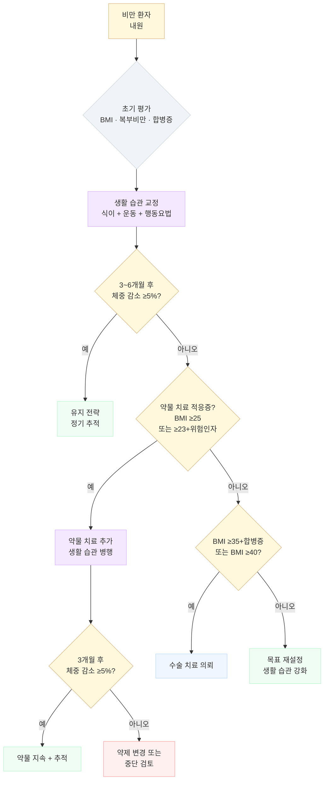

# 비만 (Obesity)

## <mark style="color:green;">일반 사항</mark>

### <mark style="color:orange;">정의</mark>

#### <mark style="color:$primary;">체질량지수(Body Mass Index, BMI) 기준</mark>

<table><thead><tr><th width="130">BMI (㎏/㎡)</th><th width="145">대한비만학회¹⁾ (2022)</th><th width="160">WHO (아시아/태평양)</th><th width="140">WHO (세계)/CDC</th><th width="140">복부비만(−) 위험도</th><th>복부비만(+) 위험도²⁾</th></tr></thead><tbody><tr><td>< 18.5</td><td>저체중</td><td>저체중</td><td>저체중</td><td>낮음</td><td>보통</td></tr><tr><td>18.5~22.9</td><td>정상</td><td>정상</td><td>정상</td><td>보통</td><td>약간 높음</td></tr><tr><td>23~24.9</td><td>비만 전단계</td><td>과체중</td><td>정상</td><td>증가</td><td>높음</td></tr><tr><td>25~29.9</td><td>1단계 비만</td><td>비만</td><td>과체중</td><td>높음</td><td>매우 높음</td></tr><tr><td>30~34.9</td><td>2단계 비만</td><td>고도 비만</td><td>비만</td><td>매우 높음</td><td>매우 높음</td></tr><tr><td>35~39.9</td><td>3단계 비만</td><td>고도 비만</td><td>비만 (Class II)</td><td>극도로 높음</td><td>극도로 높음</td></tr><tr><td>≥40</td><td>3단계 비만</td><td>고도 비만</td><td>고도 비만 (Class III)</td><td>극도로 높음</td><td>극도로 높음</td></tr></tbody></table>

¹⁾ 비만 전단계는 '과체중' 또는 '위험체중'으로, 3단계 비만은 '고도 비만'으로도 부를 수 있음\
²⁾ 복부 비만은 BMI와 독립적으로 대사증후군, 당뇨병, 관상동맥병의 이환율 및 사망률을 증가시키므로 위험도를 한 단계 높여 관리

#### <mark style="color:$primary;">복부 비만</mark>

* 허리둘레 : 남 ≥90 ㎝, 여 ≥85 ㎝ \[대한비만학회 / WHO 아시아·태평양]; WHO 유럽 기준 남 ≥94 ㎝, 여 ≥80 ㎝
* Waist-to-hip ratio \[WHO-아시아] : 남성 > 0.9, 여성 > 0.8
* BMI가 정상 범위이더라도 복부 비만이 있으면 cardiometabolic risk(인슐린 저항성, T2DM, CVD)가 유의하게 증가할 수 있음

#### <mark style="color:$primary;">체지방률</mark>

* 심혈관계 위험 요소 동반 비만 기준 (대략적 기준) : 남 ≥26%, 여 ≥36% \[일부 문헌 남 ≥25%, 여 ≥35%]


**비만의 임상적 의미**\
BMI 22에서 사망률 최저. 치료 전 체중의 **3~5% 감량**만으로도 혈당·혈압·혈중 지질 등 비만 관련 대사 질환을 의미 있게 개선할 수 있으며, **5~10% 감량** 시 심혈관 이득이 뚜렷해진다.


### <mark style="color:orange;">비만 관련 합병증</mark>

<table><thead><tr><th width="160">계통</th><th>주요 합병증</th></tr></thead><tbody><tr><td>대사</td><td>인슐린 저항성, 2형 당뇨병, 이상지질혈증, 대사증후군, MASLD/MASH (기존 NAFLD/NASH)</td></tr><tr><td>심혈관</td><td>고혈압, 관상동맥질환, 심부전, 심방세동, 뇌졸중</td></tr><tr><td>호흡기</td><td>폐쇄수면무호흡증(OSA), 비만 저환기증(OHS), 천식 악화</td></tr><tr><td>근골격</td><td>퇴행성 관절염(슬관절·고관절), 통풍, 요통</td></tr><tr><td>소화기</td><td>GERD, 담석증</td></tr><tr><td>생식/내분비</td><td>다낭성난소증후군(PCOS), 불임, 임신 합병증, 남성 성기능 장애</td></tr><tr><td>종양</td><td>자궁내막암, 유방암, 대장암, 신장암, 간암 위험 증가</td></tr><tr><td>심리/사회</td><td>우울증, 불안장애, 자존감 저하, 삶의 질 감소</td></tr></tbody></table>


**Lancet Commission on Obesity 2025 — 새로운 분류 관점**\
최신 지견에서는 비만을 단순 BMI 기반이 아닌 장기 기능 손상 여부에 따라 구분한다. **전임상 비만(preclinical obesity)**: 과잉 지방 축적, 대사·기능 이상 없음; **임상 비만(clinical obesity)**: 장기 기능 장애 또는 일상 기능 저하 동반. 이 분류는 치료 적응증 결정과 목표 설정에 실용적 근거를 제공한다.


### <mark style="color:orange;">고령자 유의 사항</mark>

* ~65세에는 연령 증가에 따른 자연적 체중 증가가 제지방량(fat-free mass) 감소를 완화하는 효과가 있음
* ≥65세에서는 비만과 사망률의 관련성이 감소; 과체중 환자가 마른 사람보다 사망률이 낮음 — 이를 **비만 역설(obesity paradox)**이라 한다. 고령에서 약간의 체지방은 근육 소모 완충, 영양 예비력 제공, 낙상 시 쿠션 역할을 할 수 있어 무조건적인 감량보다 근육량 보존이 더 중요한 치료 목표가 될 수 있음
* 비만 진단 시 BMI와 함께 허리둘레, 허리-엉덩이 둘레비로 복부 비만 여부를 병행 평가
  * 노화에 따른 체성분 변화(지방량↑, 제지방↓) 및 신장 감소로 BMI 단독 적용이 부정확할 수 있음
* 비만 관련 질환 위험보다 체중 감량의 이득이 더 큰 경우에 체중 감량을 권고
* 단백질이 풍부한 저칼로리 식사와 활동량 증가를 권고

## <mark style="color:green;">분류 및 원인</mark>

### <mark style="color:orange;">1차성(단순성) 비만</mark>

* 에너지 섭취-소비 불균형으로 체내 칼로리가 지방으로 축적되어 발생
* 전체 비만의 약 90% 해당
* 생활 습관, 연령, 인종, 유전, 장내 미생물, 환경 화학 물질/독소 등 여러 인자가 복합적으로 관여
* 과식하는 사람은 섭식 조절 기능이 저하되어 있을 가능성이 높음

### <mark style="color:orange;">2차성 비만</mark>

* 유전자 돌연변이, 선천성 장애, 약물, 신경계 질환, 내분비계 질환(갑상선저하증, 쿠싱증후군, 다낭성난소증후군, 성장호르몬 결핍), 정신 질환 등에 의한 비만

### <mark style="color:orange;">위험 인자</mark>

* 칼로리 농축 음식 소비, 고지방 식사, 빈번한 패스트푸드 섭취
* 활동이 적은 생활 방식, 하루 2시간 이상의 TV 시청 또는 IT 기기 사용
* 하루 6시간 미만의 수면
* 낮은 사회경제적 상태
* 스트레스 (✽스트레스는 식욕 저하를 일으키기도 함)
* 정신적 장애(폭식장애, 계절정동장애), 갑상선저하증, 시상하부 이상, 쿠싱증후군
* 가족력, 임신 중 산모 흡연, 산모의 임신당뇨병, 모유 수유 기간 短, 청소년기 비만
* 빨리 먹는 습관; 포만감 발현 전 과식 유발
* 연령 증가 → 기초대사량 감소 → 체중 및 복부 지방 증가

#### <mark style="color:$primary;">비만 유발 약물</mark>

* 항정신병제 : thioridazine, risperidone, olanzapine, clozapine, quetiapine, sertindole
* 항우울제 : TCA, SSRI(paroxetine; 다른 SSRI는 상대적으로 체중 증가 위험이 낮음), MAOI
* 항경련제 : valproic acid, carbamazepine, gabapentin, pregabalin
* 항당뇨병제 : insulin, SU, TZD
* 항히스타민제 : diphenhydramine, cyproheptadine
* α-차단제 : doxazosin, prazosin, terazosin
* β-차단제 : propranolol, metoprolol, atenolol
* 기타 : steroid, lithium, 경구 피임제

## <mark style="color:green;">임상 양상</mark>

* 대사 이상 : 공복혈당 장애, 인슐린 저항성, T2DM, 이상지질혈증
* 복부 지방 축적 → 내장 지방 만성 염증 → 전신 염증 상태(hs-CRP↑, IL-6↑)
* 폐쇄수면무호흡증(OSA) 및 코골이; 피로, 주간 과다 졸음
* 체중 부하 관절(슬관절·고관절) 통증, 요통
* 역류 증상(GERD), 우상복부 불편감(담석·MASLD)
* 심리적 증상 : 우울, 불안, 자존감 저하, 사회적 고립

### <mark style="color:$danger;">🚩 Red Flags!</mark>

<mark style="color:$danger;">**즉각 이송 또는 응급 조치**</mark>

* 고도비만(BMI ≥40)에서 SpO₂ < 90%, 심한 호흡곤란, 청색증 → 비만 저환기증(OHS)/급성 호흡부전
* 급성 흉통, 발한, 심한 빈맥/서맥 → 급성심근경색/부정맥
* 혈압 ≥180/120 ㎜Hg + 두통·시야 장애·신경학적 증상 → 고혈압 응급증

<mark style="color:$warning;">**당일 의뢰 또는 조기 평가**</mark>

* 수주~수개월 내 급격한 체중 증가(> 5 ㎏/월) → 2차성 원인(갑상선저하증, 쿠싱증후군, 약물 유발) 감별
* BMI ≥40 또는 BMI ≥35 + 중증 합병증(T2DM, 고혈압, OSA 등) → 비만 전문 클리닉 또는 수술 의뢰 검토
* 심한 수면무호흡 증상(야간 호흡 정지 목격, Epworth Sleepiness Scale ≥16) → 수면다원검사 의뢰
* 중증 폭식장애·야간 폭식증 + 정신과적 문제 → 정신건강의학과 협진

<mark style="color:$info;">**외래 추적 / 추가 평가 계획**</mark> <mark style="color:$info;">- 즉각 위험 낮으나 호전 없으면 의뢰</mark>

* 6개월 이상 적극 치료에도 목표 체중 미달성 → 치료 방침 재검토, 전문 의뢰 고려
* 약물 치료 중 새로운 대사 합병증 발생(혈당 상승, 간기능 이상, 혈압 악화)
* 치료 과정에서 심리·정서적 문제(우울, 불안, 자존감 저하) 대두

## <mark style="color:green;">진단</mark>

### <mark style="color:orange;">신체 계측 방법</mark>

* **몸무게** : 8시간 금식 후 소변을 본 뒤 신발을 벗고 최소한의 복장으로 측정; 동일 시간·동일 조건으로 비교 (예: 매일 아침 기상 직후 배뇨 후 내의 차림)
* **신장** : 발뒤꿈치를 붙이고 발을 60°로 벌린 상태에서 숨을 깊이 들이쉰 상태로 측정
* **허리둘레** : 양 발을 25~30 ㎝ 간격으로 벌리고 서서 숨을 편안히 내쉰 상태에서 늑골 하단부와 골반 장골릉 상단의 중간 부위 측정 \[WHO 지침] 또는 양쪽 장골릉 최상단 측정 \[NIH 지침]
  * BMI ≥25인 경우 허리둘레 측정을 적극 권고 \[캐나다의학협회]
* **엉덩이둘레** : 엉덩이의 가장 넓은 부위 측정
* 허리·엉덩이둘레 측정 시 바닥과 평행하게 2회 측정; 차이 ≤1 ㎝면 평균값 사용, > 1 ㎝면 2회 재측정

### <mark style="color:orange;">검사</mark>

* **필수** : 혈압, FBS/HbA1c, Lipid panel, LFT(AST/ALT/γGT), RFT(Cr)
* **선택** : TSH (2차성 원인 배제), hs-CRP/ferritin (염증 지표), 요산
  * LFT 상승 시 복부 초음파(MASLD 평가) 시행
  * **ALT 정상이어도 MASLD를 배제할 수 없음**; 고위험군(T2DM, 복부 비만, 고중성지방혈증)에서는 FIB-4 score 기반 간 섬유화 위험 계층화 고려

$$FIB\text{-}4 = \frac{\text{Age (years)} \times \text{AST (U/L)}}{\text{Platelet count } (10^9/\text{L}) \times \sqrt{\text{ALT (U/L)}}}$$

  * FIB-4 < 1.30 : 낮은 섬유화 위험; > 2.67 : 높은 위험 → 간전문의 의뢰
  * **MASLD 단계별 접근** : 복부 초음파(지방간 유무) → FIB-4 계산(섬유화 위험) → 고위험 시 간 전문 의뢰(FibroScan/생검 등)
* **기타 고려** : 체지방 분석(일률적 권고 미시행), 수면다원검사(OSA 의심 시), 쿠싱증후군/시상하부 이상 검사

### <mark style="color:orange;">2차성 비만 감별</mark>

* **갑상선저하증** : TSH↑, free T4↓, 서맥, 추위 불내성, 변비
* **쿠싱증후군** : 중심성 비만, 달덩이 얼굴, 자주색 피부 선조, 근력 저하, 고혈당
* **다낭성난소증후군(PCOS)** : 희발 월경, 고안드로겐혈증, 초음파상 다낭성 난소
* **시상하부 이상** : 두통, 시야 장애, 다뇨/다음증 동반

***

## <mark style="background-color:$warning;">Management</mark>

### <mark style="color:orange;">치료 방침</mark>


**치료 강도 결정 원칙 — BMI 단독 기준에서 합병증 중심으로**\
치료 강도는 BMI 수치 자체보다 **비만 관련 합병증**(T2DM, OSA, MASLD, CVD, OA 등), 기능 저하, 삶의 질 저하를 함께 고려하여 결정한다. 동일 BMI라도 복부 비만·대사 이상·심혈관 위험이 높은 경우 적극적 치료가 정당화되며, BMI가 낮더라도 합병증이 뚜렷한 경우 치료 적응증이 된다.


* 생활 습관 중재를 기본으로 하되, 비만 관련 합병증이 있으며 생활 습관 중재만으로 충분히 반응하지 않는 과체중/비만 환자에게 약물 요법을 추가

1. **동기 파악 및 교육** : 비만의 위해성과 감량의 필요성 교육; 미용 목적보다 건강 개선이 핵심임을 강조
   * 허리둘레 감소 → 내장 지방 감소 → 심혈관 위험 감소; 체중 감소 자체보다 이 변화가 더 중요함
   * 환자의 자존감 회복, 동반 질환 관리 목표 공유
2. **감량 목표 설정** : 보통 6개월간 치료 전 체중의 5~10% 감량
   * 감량이 부적절한 경우(예: 고령, 소아, 만성 중증 질환자) → 현재 체중 유지 목표
   * 동반 질환에 따라 서서히 감량(예: 담석증, 고요산혈증) 또는 감량 금지(예: 신경성 식욕부진)
   * 동반 질환별 감량 목표 : 대사증후군 10%, T2DM/이상지질혈증/고혈압 5~15%, **MASLD ≥7~10%** (steatohepatitis·섬유화 개선), 수면무호흡증 7~11%, 천식 7~8%, GERD ≥10%
3. **생활 습관 파악** : 식사 횟수·종류·양·폭식 습관, 활동 패턴, 과거 치료 방법·결과 파악
4. **치료 단계** : 생활 습관 개선/인지행동 요법 → (적응증 시) 약물 치료 → (실패 시) 수술 치료
5. **체중 유지** : 비만은 **만성 재발성 질환(chronic relapsing disease)**으로, 치료 중단 후 체중 재증가(weight regain)가 흔히 발생함. 이는 의지 부족이 아니라 감량 후 에너지 소비 감소·식욕 증가·호르몬 변화(ghrelin↑, leptin↓)에 의한 생물학적 적응임
   * ≥1회/주 체중 측정, 음식 섭취 제한, 200~300분/주 중등도 신체 활동 권고
   * 체중이 빠르게 재증가하면 조기 진료 권고; 6개월간 감량 체중 유지 후 필요 시 새로운 목표 설정

#### <mark style="color:$primary;">치료 실패 위험 인자</mark>

* 단순 미용 목적의 체중 감량, 불분명한 치료 목적
* 수동적 태도(타인의 요구에 의한 시도), 약물 치료에만 의존
* 낮은 사회경제적 상태, 심리적 문제(스트레스, 불안, 우울)
* 잦은 외식·회식 등 환경적 제약

### <mark style="color:orange;">체중 재증가 예방 전략</mark>


**비만은 만성 재발성 질환 — 체중 재증가(weight regain)는 실패가 아니다**\
체중 감량 후 수년 내 상당수 환자에서 체중 재증가가 발생한다. 이는 의지 부족이 아니라 감량 후 에너지 소비 감소, 식욕 촉진 호르몬(ghrelin↑, leptin↓) 변화에 의한 생물학적 적응 반응이다. 장기 추적 관리와 유지 치료를 치료 계획에 처음부터 포함해야 한다.


<table><thead><tr><th width="200">전략</th><th>실전 적용</th></tr></thead><tbody><tr><td><strong>정기 체중 모니터링</strong></td><td>주 ≥1회 동일 조건 측정; 2~3 ㎏ 이상 재증가 시 조기 개입</td></tr><tr><td><strong>유지 칼로리 재계산</strong></td><td>체중 감소 후 basal energy expenditure 감소 → 유지 칼로리 재계산 필요</td></tr><tr><td><strong>고단백 식이 유지</strong></td><td>단백질 1.0~1.5 g/㎏/d; 포만감 유지 + 제지방량 보존</td></tr><tr><td><strong>저항성 운동 지속</strong></td><td>주 ≥2~3회; 제지방량(lean mass) 보존에 핵심</td></tr><tr><td><strong>활동량 유지</strong></td><td>중등도 유산소 운동 200~300분/주 지속</td></tr><tr><td><strong>야식·배달 환경 차단</strong></td><td>정크 푸드 접근 최소화; 식품 환경 재구성</td></tr><tr><td><strong>수면 최적화</strong></td><td>수면 부족은 ghrelin↑, 식욕 증가 유발</td></tr><tr><td><strong>스트레스 관리</strong></td><td>감정 섭식·폭식 예방; CBT·마음챙김(mindfulness) 도움 가능</td></tr><tr><td><strong>장기 추적</strong></td><td>비만 치료는 단기 프로젝트가 아니라 장기 관리임을 교육</td></tr><tr><td><strong>유지 약물 고려</strong></td><td>고위험군에서 GLP-1 RA / tirzepatide 유지 치료 고려 가능</td></tr></tbody></table>

**체중 재증가 조기 경고 신호** : 주간 체중 지속 상승 / 야식·간식 빈도 재증가 / 운동 중단 / 스트레스·수면 부족 증가 / 약물 중단 후 식욕 급증

***



<p align="center"><strong>비만 치료 알고리듬</strong></p>

<p align="center"><em><mark style="color:$info;">Ref. 대한비만학회 비만 진료지침 2022; AGA Clinical Practice Guideline on Pharmacological Interventions for Adults with Obesity, 2022</mark></em></p>

***

## <mark style="color:green;">비-약물 치료 및 예방</mark>

* **중재 대상** : BMI ≥25; 아시아계에서는 BMI ≥23부터 중재 권고 \[ADA]
* **효과** : 생활 습관 개선으로 체중의 5~15% 감량 가능; 신체 이미지, 자존감, 삶의 질 향상
* 체중 감량을 위해 ≥6개월, 감량 체중 유지를 위해 ≥1년 이상 생활 습관 개선 필요
* 1.5 ㎏/주 이상 급속 감량 시 담석증 위험 증가 → UDCA 600 ㎎/d <mark style="color:blue;">\[우루사]</mark> 예방 복용 고려

### <mark style="color:orange;">식이 요법</mark>

　☞ [영양지침](../231_/217_-nutritiondiet-guideline.md)

* 식이 조절을 3~6개월 이상 지속해야 신체가 적응하며 감량된 체중을 유지할 수 있음

#### <mark style="color:$primary;">식사량</mark>

* 평소 식사량에서 1일 500~1,000 ㎉ 감량 섭취; 1일 500 ㎉ 감량 섭취 시 약 500 g/주 체중 감소
* 다이어트용 통상 1일 섭취 칼로리 : 남 1,500~1,800 ㎉, 여 1,200~1,500 ㎉
* 특정 다이어트 방법보다 실천하기 쉬운 방법으로 꾸준히 제한된 칼로리를 섭취함
  * **저탄수화물 고단백 식이**(low-carbohydrate high-protein diet; 일명 황제 다이어트) : 1년간 비교에서 유의미한 성과 없음
* **초저칼로리 식이(VLCD, Very Low Calorie Diet)** : **< 800 ㎉/day** (✽800~1,200 ㎉는 저칼로리 식이[LCD]에 해당)
  * **감량 후 체중 재증가 가능성이 매우 높으며, 장기적으로 일반 저칼로리 식이와 체중 조절 효과에 차이 없음** — 장기 유지 치료 전략으로는 권장되지 않음
  * 부작용 : 탈수, 기립성 저혈압, 피로, 근육 경련, 변비, 두통, 추위 불내성
  * 철저한 의학적 관리 하에 제한적으로 시행; 1일 단백질 50~80 g(1.0~1.5 g/㎏) 및 비타민·미네랄 섭취 필수
  * 금기 : 최근 심혈관 질환 발생, 신질환, 1형 당뇨병, 정신 질환, 암

#### <mark style="color:$primary;">Daily Energy Requirement</mark>

* 필요 칼로리 = 체중(㎏) × BMR(kcal/㎏/d) × PAL(physical activity level)
  * PAL 값 : 저활동 1.40~1.69; 중등 활동(건설 노동자, 1시간/일의 달리기) 1.70~1.99

<table><thead><tr><th width="94">[남] 체중</th><th width="94">18~29세</th><th width="94">30~59세</th><th width="94">[여] 체중</th><th width="94">18~29세</th><th width="94">30~59세</th></tr></thead><tbody><tr><td>50 kg</td><td>29</td><td>29</td><td>45 kg</td><td>26</td><td>27</td></tr><tr><td>55 kg</td><td>28</td><td>27</td><td>50 kg</td><td>25</td><td>25</td></tr><tr><td>60 kg</td><td>27</td><td>26</td><td>55 kg</td><td>24</td><td>24</td></tr><tr><td>65 kg</td><td>26</td><td>25</td><td>60 kg</td><td>23</td><td>22</td></tr><tr><td>70 kg</td><td>25</td><td>24</td><td>65 kg</td><td>22</td><td>21</td></tr><tr><td>75 kg</td><td>24</td><td>23</td><td>70 kg</td><td>22</td><td>20</td></tr><tr><td>80 kg</td><td>24</td><td>22</td><td>75 kg</td><td>21</td><td>19</td></tr><tr><td>85 kg</td><td>23</td><td>22</td><td>80 kg</td><td>21</td><td>19</td></tr><tr><td>90 kg</td><td>23</td><td>21</td><td>85 kg</td><td>21</td><td>18</td></tr></tbody></table>

<p align="center"><em><mark style="color:$info;">Ref. FAO/WHO/UNU. Human energy requirements. 2001. Table 5.4~5.9</mark></em></p>

* 1일 필요 칼로리 계산 예 : 운동을 하지 않는 70 ㎏ 사무직 40세 남성 = 70 × 24 × 1.5 = **2,520 ㎉**

#### <mark style="color:$primary;">권장 식이</mark>

* 식이 섬유
  * 권고 섭취량 : ≤50세 남 38 g, 여 25 g; > 50세 남 30 g, 여 21 g
  * 전곡류, 귀리, 콩류, 렌틸, 통밀 빵, 현미, 파스타, 과일, 채소
* 저지방 육류 : 살코기 또는 기름을 제거한 고기
* 생선·해산물(2회/주)
* 우유 : 저지방 또는 무지방 제품 선택
* 순수한 물 또는 칼로리가 없는 음료
* 섭취 권고량 : 과일·채소 8~10 servings/d, 저지방 유제품 2~3 servings/d

#### <mark style="color:$primary;">제한 식이</mark>

* 칼로리 농축 음식(빵, 떡, 대부분의 테이크아웃·패스트푸드)
* 기름기·지방 함량이 많은 식품, 튀긴 음식, 정제된 탄수화물, 설탕, 단 음료
* 소금 < 6 g/d; 현재보다 조금 싱겁게 먹는 습관
* **신호등 다이어트**

<table><thead><tr><th width="74">색상</th><th>녹색 – "진행"</th><th>노란색 – "주의"</th><th>빨간색 – "멈춤"</th></tr></thead><tbody><tr><td>특징</td><td>저지방·저칼로리, 풍부한 영양소·섬유소</td><td>지방·칼로리가 약간 많음</td><td>지방·칼로리 과다</td></tr><tr><td>제한</td><td>제한 없이 섭취</td><td>줄여서 섭취</td><td>섭취 회피</td></tr><tr><td>종류</td><td>채소, 과일</td><td>기름기 적은 육류, 유제품, 전분, 곡물</td><td>기름진 육류, 튀긴 음식, 설탕, 가당 음료</td></tr></tbody></table>

#### <mark style="color:$primary;">식사 요령 — 12 Tips to Help You Lose Weight \[NHS]</mark>

1. **아침 식사** : 거르면 영양소 부족 + 하루 종일 간식 증가
2. **규칙적 식사** : 칼로리 연소 속도 향상, 간식 욕구 감소
3. **충분한 과일·채소** : 칼로리 낮고 섬유질·비타민 풍부; 당도 높은 과일은 칼로리 주의
4. **활발히 움직이기** : 체중 감량 및 유지의 핵심
5. **충분한 수분** : 수분 부족 시 갈증을 허기로 혼동
6. **섬유질 많은 음식** : 포만감 증가 → 식사량 감소
7. **식품 성분표 확인** : 칼로리·성분 확인 습관화
8. **작은 접시 사용** : 소량에 익숙해짐; 20분 이상 천천히 먹고 배부르기 전 중단
9. **특정 음식 금지하지 않기** : 금지 → 갈망 심화; 허용 칼로리 내에서 즐김
10. **집 안에 정크 푸드 두지 않기** : 건강한 간식(과일, 무가당 팝콘)으로 대체
11. **알코올 섭취 줄이기**
12. **1주일 식단 계획 수립** : 식사 일기로 과식 원인 파악; 칼로리 농축 음식 회피

※ 칼로리 검색 : [식품영양성분 데이터베이스](https://www.foodsafetykorea.go.kr/fcdb/index.do), [칼로리사전](http://47kg.kr/DIET_HOME/main.php)

### <mark style="color:orange;">운동 요법</mark>

　☞ [운동 지침](../231_/216_-physical-activity-guideline.md)

* 신체 활동은 체중 감량에 필수적이나, 칼로리 섭취 제한 없이 운동만으로는 효과가 제한적
  * 63 ㎏ 성인 60분 걷기 시 약 250 ㎉ 소모(≈ 피자 ½조각); 매일 1주일 시행 시 약 250 g 감소
* 생활의 일부로 즐길 수 있는 운동을 규칙적으로 시행; 신체 상태에 맞게 강도 조절
  * 일상 활동 : 계단 오르내리기, 집안일, 대중교통 이용
  * 즐거운·단체 활동 : 제기차기, 자전거, 달리기, 수영, 춤, 구기, 헬스클럽
* 비활동적 생활 줄이기 : TV 시청, 좌식 스크린 시간(screen time) 제한
* **유산소 운동** : 중등 강도(최대 심박수\[=220−연령]의 60~70%; 5~6 ㎞/hr 조깅)로 30~60분/일 또는 20~30분씩 2회, ≥5일/주, 300분/주
  * 감량 체중 유지 : 중등 강도 200~300분/주 지속
* **저항성 운동 병행** : 8~12회 반복 가능 중량으로 2~3세트, 주 ≥2회
  * 근육량 유지로 기초대사량 보존; 유산소 운동 단독보다 체성분 개선 효과 우수
  * GLP-1 RA / tirzepatide 등 빠른 체중 감량 시 제지방량(lean mass) 손실이 동반될 수 있으므로, 약물 치료 중에도 저항성 운동 병행이 특히 중요함

### <mark style="color:orange;">행동 치료</mark>

* **인지행동 치료(CBT)** : 자기 모니터링(식사 일기, 체중 일지), 자극 조절, 인지 재구조화
  * 최근에는 **디지털 CBT 프로그램** 및 **모바일 앱 기반 자기 모니터링**(칼로리 추적, 활동량 기록)이 접근성을 높이는 보조 수단으로 활용되고 있음
* **동기부여 인터뷰** : 변화에 대한 내적 동기 강화; 치료 초기에 특히 효과적
* **집단 치료** : 동료 지지를 통한 지속적 동기 유지
* 심리적 문제(폭식, 우울, 섭식 장애)가 동반된 경우 정신건강의학과 협진

## <mark style="color:green;">약물 치료</mark>

(비보험 처방 원칙)

* **적응증**
  * \[대한비만학회] BMI ≥25 또는 위험 인자(고혈압, 이상지질혈증, T2DM, 수면무호흡증)가 있는 BMI ≥23 환자에서 3~6개월간 비-약물 치료 후 적절한 체중 감소(0.5 ㎏/주) 실패 시
  * \[AGA 2022] BMI ≥30 또는 BMI ≥27 + 체중 관련 동반 질환; 국내에서는 대한비만학회 기준 적용
* 반드시 생활 습관 교정이 선행 및 병행되어야 함
* 감량 효과 : 식이/운동 + 약물 병합 시 최대 ~16%; GLP-1/GIP 이중 작용제(tirzepatide) 최대 ~22%
* 동반 질환, 환자 선호도, 비용, 치료 접근성을 고려하여 선택
* \[AGA 2022] 1차 선택제 : **semaglutide** 우선, liraglutide, phentermine/topiramate, naltrexone/bupropion
* **사용 금지** 비만 치료 약물 : (dex)fenfluramine, ephedrine(마황), phenylpropanolamine, sibutramine, lorcaserin
* 약물 치료 개시 3개월 내에 ≥5% 체중 감량 없거나 동반 질환 개선 효과 없거나 안전성 문제 시 → 약제 변경 또는 중단 고려
* 약물 치료 중 정기적으로 체중, 혈당, 지질 검사 시행

### <mark style="color:orange;">비만 표현형별 치료 전략</mark>


같은 BMI라도 비만의 원인과 행동 패턴은 다르다. 최근 비만 치료는 단순 체중 수치보다 식욕 조절 이상, 폭식, 대사 이상, 좌식 생활, 근감소 위험 등 환자 표현형(phenotype)에 따라 치료 전략을 개별화하는 방향으로 발전하고 있다.


<table><thead><tr><th width="170">표현형</th><th width="210">특징</th><th width="230">우선 고려 치료</th><th>실전 포인트</th></tr></thead><tbody><tr><td><strong>식욕 과다형<br>(Hungry brain)</strong></td><td>항상 배고픔, 식후 포만감 부족, 야식·간식 빈번</td><td>GLP-1 RA, tirzepatide, phentermine/topiramate</td><td>포만감 회복이 핵심; 단순 칼로리 제한만으로 실패하기 쉬움</td></tr><tr><td><strong>폭식·보상형<br>(Reward eating)</strong></td><td>스트레스성 폭식, 음식 craving, 감정 섭식</td><td>CBT, naltrexone/bupropion, 정신건강의학과 협진</td><td>"의지 부족"보다 보상 회로(reward circuitry) 문제로 접근</td></tr><tr><td><strong>대사 이상형<br>(Metabolic obesity)</strong></td><td>T2DM, MASLD, 고TG혈증, 복부 비만 동반</td><td>Semaglutide, tirzepatide</td><td>체중 감소 외 cardiometabolic benefit 중요</td></tr><tr><td><strong>지방식 과다형</strong></td><td>튀김·패스트푸드·야식 위주, 지방 섭취 많음</td><td>Orlistat + 식이 교육</td><td>지방변 부작용이 dietary feedback 역할 가능</td></tr><tr><td><strong>좌식 생활형<br>(Sedentary)</strong></td><td>활동량 부족, 좌식 스크린 시간(screen time)↑, 근육량 감소</td><td>운동 처방, 활동량 증가 전략</td><td>NEAT(비운동 활동 열생성) 증가 중요</td></tr><tr><td><strong>근감소 동반형<br>(Sarcopenic obesity)</strong></td><td>고령, 근육량 감소, 체력 저하</td><td>고단백 식이 + 저항성 운동 우선</td><td>"체중 감소"보다 근육 보존(lean mass preservation) 우선</td></tr><tr><td><strong>수면무호흡 연관형</strong></td><td>OSA, 심한 코골이, 주간 졸림</td><td>체중 감량 + 수면다원검사 + CPAP 고려</td><td>수면 개선 시 식욕·인슐린 저항성도 개선 가능</td></tr><tr><td><strong>약물 유발형</strong></td><td>항정신병제·steroid·insulin 이후 체중 증가</td><td>원인 약물 재평가</td><td>가능 시 weight-neutral 약제로 변경 검토</td></tr></tbody></table>

### <mark style="color:orange;">단기 투여 제제 (Sympathomimetic Amine)</mark>

* 중추 교감신경계 항진을 통한 식욕 억제 + 기초대사량(BMR)을 소폭 높이는 thermogenic 효과; 대부분의 경구 식욕 억제제가 해당
* < 4주 투여로 제한; 효과 있는 경우 최대 12주까지 투여 가능
* 약물 중단 시 thermogenic 효과 소실과 함께 식욕 증가 → 체중 재증가가 흔히 발생하는 생리적 이유
* **부작용** : 입마름, 불면, 어지럼, 흥분, 혈압 상승, 소화불량, 발기 부전
  * 장기 투여 시 의존성 및 (중단 시) 금단 증상 발생
* **금기** : 심혈관 질환, 조절되지 않는 고혈압, 녹내장, 갑상선항진증, 약물 남용력, < 16세

<table><thead><tr><th width="240">성분명 [상품명]</th><th width="230">용법</th><th>비고</th></tr></thead><tbody><tr><td>Phentermine <mark style="color:blue;">[아디펙스]</mark></td><td>8~37.5 ㎎ #1~2 아침 식전 또는 식사 1~2시간 후</td><td>가장 많이 처방되는 단기 제제</td></tr><tr><td>Phendimetrazine <mark style="color:blue;">[아트라진]</mark></td><td>17.5~35 ㎎ tid 식전 1시간</td><td></td></tr><tr><td>Diethylpropion <mark style="color:blue;">[디피온]</mark></td><td>25 ㎎ tid 식사 1시간 전</td><td></td></tr><tr><td>Mazindol <mark style="color:blue;">[마자놀]</mark></td><td>0.5~1 ㎎ qd~tid 식사 1시간 전</td><td></td></tr></tbody></table>

### <mark style="color:orange;">장기 투여 가능 제제</mark>

#### <mark style="color:$primary;">지방 흡수 억제제 (Lipase Inhibitor)</mark>

* **작용** : 강력한 selective pancreatic lipase inhibitor → 섭취 지방 흡수를 **약 30% 억제**
* 지방 섭취가 많은 식습관에서 효과적; 이상지질혈증 또는 T2DM 동반 시 고려
* 체중 관련 합병증이 있는 과체중/비만에서는 단독 1차 선택으로 권하지 않음 \[AGA 2022]
* **부작용** : 복통, 복부 팽만, 변실금, 지용성 비타민(A/D/E/K) 결핍, 담석증, 신결석, 간기능 이상(드묾)
  * 대처 : psyllium <mark style="color:blue;">\[무타실]</mark> 병용 시 위장관 부작용 감소; 지용성 비타민 보충(약제와 ≥2시간 간격)
  * cyclosporine, 갑상선 호르몬, 항경련제 흡수 저하 주의
* **금기** : 만성 흡수 장애, 담즙 분비 장애
* Orlistat : 60~120 ㎎ 매 식사 직전~식사 후 1시간 이내 <mark style="color:blue;">\[제니칼]</mark>
  * 식사를 거르거나 지방이 없는 식사 시 복용 생략 가능

#### <mark style="color:$primary;">Sympathomimetic Amine / Antiepileptic Combination</mark>

**Phentermine / Topiramate ER** <mark style="color:blue;">\[큐시미아]</mark>

* Topiramate : 항경련제의 식욕 억제 부작용을 치료 목적으로 활용
* **부작용** : 변비, 감각 이상, 미각 이상, 불면, 비인두염, 입마름, 혈압 상승, 인지 장애
* **주의/금기** : sympathomimetic amine과 동일; 임신 금기(태아 구순열 위험), 급성폐쇄녹내장, MAOI 병용 금기
* **용법** : 3.75/23 ㎎ qd × 2주 → 7.5/46 ㎎ qd (유지량)
* 12주 치료에 체중 감소 < 3% 시 중단 또는 15/92 ㎎으로 증량
* 중단 시 tapering (최소 1주 동안 격일 복용)

#### <mark style="color:$primary;">Opioid Antagonist / Aminoketone Antidepressant Combination</mark>

**Naltrexone / Bupropion SR** <mark style="color:blue;">\[콘트라브]</mark>

* **작용** : Naltrexone — opioid 수용체 길항; Bupropion — dopamine·norepinephrine 재흡수 억제 → 식욕 조절 중추 및 도파민 보상계 억제
* **부작용** : 변비, 구역, 두통, 입마름, 불면, 어지럼; < 24세에서 자살 충동 모니터링
* **주의/금기** : 발작, 조절되지 않는 고혈압, 급성폐쇄녹내장, 만성 opioid 사용, MAOI 병용
* **용법** : 8/90 ㎎ 1T qd × 1주 → 1T bid × 1주 → 아침 2T + 저녁 1T × 1주 → 2T bid (유지)
* 12주 후 체중 감소 < 5% 시 효과 부족으로 판정 → 중단

#### <mark style="color:$primary;">GLP-1 Receptor Agonist (GLP-1 RA)</mark>


**GLP-1 RA의 심혈관 이득 — SELECT 시험 (2023, NEJM)**\
비당뇨 비만 성인 CVD 환자(n=17,604)에서 semaglutide 2.4 ㎎ 주 1회 투여군이 위약군 대비 MACE(심혈관 사망·비치명적 심근경색·비치명적 뇌졸중)를 **20% 유의하게 감소**시켰다(HR 0.80). GLP-1 RA는 체중 감량을 넘어 독립적인 심혈관 보호 효과를 가지며, 비만+CVD 환자에서 특히 적극 고려할 근거가 된다.



**GLP-1 RA Class Effect — 전체 약제에 적용되는 주의 사항**\
• **위 배출 지연(gastroparesis-like effect)** : 경구 약물(특히 levothyroxine, cyclosporine, 경구 피임제)의 흡수 시간이 변할 수 있음; 중요 약물은 식전/빈속 복용 권고\
• **제지방량(lean mass) 감소** : 빠른 체중 감량 시 근육 손실이 동반될 수 있음 → 단백질 1.2~1.5 g/㎏/d 섭취 + 저항성 운동 병행 필수\
• **탈수 위험** : 심한 구역·구토·설사 시 수분 보충 중요; 신기능 모니터링


**Liraglutide** <mark style="color:blue;">\[삭센다 주]</mark>

* 식사에 반응하여 ileum에서 분비 → 미주 신경/시상하부 작용 → 식욕↓, 위 배출 속도↓
* **부작용** : 구역, 설사, 변비, 주사 부위 반응
* **주의/금기** : 설치류에서 갑상선 C세포 종양(C-cell tumor) 증가 보고에 근거하여 갑상선 수질암(MTC) 또는 MEN 2형 가족력 있는 경우 금기; 인간에서의 위험은 확립되지 않음
* **적응증** : ① BMI ≥30 또는 ② BMI ≥27 + 체중 관련 동반 질환(T2DM, 고혈압, 이상지질혈증)
* **용법** : 0.6 ㎎ qd SC → 매주 0.6 ㎎씩 증량 → 5주차 3.0 ㎎ qd SC (목표 용량)
* 16주 치료에 체중 감소 < 4% 시 중단

**Semaglutide** <mark style="color:blue;">\[위고비 프리필드펜]</mark>


⚠️ **상품명 주의** : 비만 치료 적응증은 **위고비(Wegovy)** 2.4 ㎎ 주 1회 SC. 오젬픽(Ozempic, 0.5/1.0/2.0 ㎎)은 T2DM 적응증이며, 비만 치료 목적 처방 시 허가 외(off-label) 사용에 해당함.


* 체중 감량 외 당 조절 효과 동반; SELECT 시험에서 심혈관 위험 감소 입증
* 체중 관련 합병증이 있는 비만/과체중 성인의 장기 투약에서 우선 권고 \[AGA 2022]
* **용법** : 0.25 ㎎ qwk SC × 4주 → 0.5 ㎎ × 4주 → 1.0 ㎎ × 4주 → 1.7 ㎎ × 4주 → **2.4 ㎎ qwk SC** (유지)
* 16주 치료에 체중 감소 < 5% 시 중단 검토

#### <mark style="color:$primary;">GLP-1 / GIP Dual Agonist</mark>

**Tirzepatide** <mark style="color:blue;">\[젭바운드(비만) / 마운자로(T2DM)]</mark>

* GLP-1·GIP 이중 수용체 작용제; GLP-1 단독 제제 대비 더 강력한 체중 감량 효과
* **임상 근거** : SURMOUNT-1 시험(2022, NEJM) — tirzepatide 15 ㎎ 투여군 72주 후 평균 체중 **22.5% 감소** (위약군 2.4%)
* **부작용** : 구역/구토, 설사, 식욕 저하, 변비, 복통; 경구 피임제 흡수 저하 가능
* **주의/금기** : 갑상선 수질암 또는 MEN 2형 가족력, 급성 췌장염
* **용법** : 2.5 ㎎ qwk SC × 4주 → 5 ㎎ → 7.5 ㎎ → 10 ㎎ → 12.5 ㎎ → **15 ㎎ qwk SC** (목표, 단계별 4주 간격 증량)


Semaglutide와 마찬가지로 tirzepatide도 적응증별 상품명이 다르다 : **젭바운드(Zepbound)** = 비만 적응증, **마운자로(Mounjaro)** = T2DM 적응증. 국내 비만 적응증 허가 여부 및 보험 적용 현황은 시점에 따라 변동될 수 있으므로 처방 전 확인 필요.


### <mark style="color:orange;">GLP-1/GIP 부작용 관리 및 실전 팁</mark>

<table><thead><tr><th width="180">문제 상황</th><th width="230">원인</th><th>실전 대응</th></tr></thead><tbody><tr><td><strong>구역·오심</strong></td><td>위 배출 지연, 초기 용량 적응</td><td>천천히 증량, 소량 식사, 기름진 음식 회피; 심하면 1단계 감량 또는 증량 지연</td></tr><tr><td><strong>구토</strong></td><td>과도한 용량 상승, 과식</td><td>수분 보충; 일시 감량 또는 유지 용량에서 재증량</td></tr><tr><td><strong>변비</strong></td><td>위장관 운동 감소, 섭취량 감소</td><td>수분·식이섬유 증가, magnesium/psyllium 고려, 활동량 증가</td></tr><tr><td><strong>설사</strong></td><td>초기 장 적응</td><td>지방 식이 감소, 자극적 음식 제한</td></tr><tr><td><strong>식사를 거의 못함</strong></td><td>과도한 식욕 억제</td><td>단백질 우선 섭취로 근감소 예방; 용량 재조정 고려</td></tr><tr><td><strong>근육량 감소</strong></td><td>급격한 체중 감소</td><td>단백질 1.2~1.5 g/㎏/d + 저항성 운동 병행</td></tr><tr><td><strong>체중 감소 plateau</strong></td><td>대사 적응</td><td>활동량 증가, 식이 재평가, 수면·스트레스 점검, 용량 최적화</td></tr><tr><td><strong>약 중단 후 재증가</strong></td><td>식욕 rebound</td><td>갑작스런 중단 회피; 생활 습관 강화 및 유지 전략 병행</td></tr><tr><td><strong>탈수</strong></td><td>구토·섭취 감소</td><td>수분 보충; 신기능 모니터링</td></tr><tr><td><strong>심한 복통</strong></td><td>췌장염·담석 가능성</td><td>즉시 중단 및 평가</td></tr><tr><td><strong>GERD 악화</strong></td><td>위 배출 지연</td><td>늦은 야식 제한, 소량 식사, 필요 시 PPI 병용 고려</td></tr></tbody></table>

**GLP-1/GIP Practical Pearls**

* "빨리 증량"보다 **"지속 가능한 내약성"** 이 더 중요; 초기 4~8주 부작용이 가장 흔하며 대부분 점차 감소
* 단백질 섭취 부족 시 근감소 위험 증가 → 운동·영양 교육 병행
* 체중 plateau는 실패가 아니라 흔한 생리적 적응 과정임을 미리 교육
* 약물 중단 후 식욕 rebound 가능성을 시작 전부터 안내하는 것이 중요

### <mark style="color:orange;">기타</mark>

* Fluoxetine <mark style="color:blue;">\[푸로작]</mark> : 우울성 폭식장애에서 고려; 기전 및 비만 효과 불확실; 60 ㎎ qd 아침
* Alginic acid <mark style="color:blue;">\[알룬]</mark> (alginic acid + carboxymethylcellulose) : 포만감 유발, 일부에서 효과; 매 식전 복용
* Caffeine : 교감신경 항진, 약간의 지방 산화 촉진; 체중 감소 효과 미미 또는 불확실


⚠️ **판매 중지 약물 — Lorcaserin** : 5HT-2C 수용체 작용을 통한 식욕 억제제였으나, 췌장암·대장암·폐암 발생률 증가 우려로 2020년 FDA 요청에 의해 시판 중지됨. 처방 불가.


### <mark style="color:orange;">약물 효과 비교</mark>

<table><thead><tr><th width="230">성분명 [상품명]</th><th width="190">체중 감소¹⁾</th><th>주요 부작용 / 주의</th></tr></thead><tbody><tr><td>Phentermine <mark style="color:blue;">[아디펙스]</mark></td><td>15 ㎎: −6.1%<br>7.5 ㎎: −5.5%<br>위약: −1.2%</td><td>[부] 입마름, 불면, 어지럼, 흥분, 혈압·맥박 상승<br>[한] ＜12주 단기 사용 원칙</td></tr><tr><td>Orlistat <mark style="color:blue;">[제니칼]</mark></td><td>120 ㎎: −9.6%<br>위약: −5.6%</td><td>[부] 복부 불편·지방변; Vit A/D/E/K 흡수 장애²⁾; 담석, 신결석</td></tr><tr><td>Phentermine/topiramate <mark style="color:blue;">[큐시미아]</mark></td><td>15/92 ㎎: −9.8%<br>7.5/46 ㎎: −7.8%<br>위약: −1.2%</td><td>[부] 변비, 감각 이상, 인지 장애<br>[금] 임신, 녹내장, MAOI 병용</td></tr><tr><td>Naltrexone/bupropion <mark style="color:blue;">[콘트라브]</mark></td><td>16/180 ㎎: −5.0%<br>위약: −1.3%</td><td>[부] 변비, 구역, 두통, 불면<br>[금] 발작, 조절 안 되는 고혈압, MAOI</td></tr><tr><td>Liraglutide <mark style="color:blue;">[삭센다]</mark></td><td>3.0 ㎎: −6.4%<br>1.8 ㎎: −4.7%<br>위약: −1.5%</td><td>[부] 구역, 구토, 설사<br>[금] 갑상선 수질암 가족력, 췌장염</td></tr><tr><td>Semaglutide <mark style="color:blue;">[위고비]</mark></td><td>2.4 ㎎: −14.9%³⁾<br>위약: −2.4%</td><td>[부] 구역, 구토<br>[주] 설치류 갑상선 C세포 종양 보고; MTC·MEN2 가족력 금기<br>[이득] SELECT 시험: MACE −20%</td></tr><tr><td>Tirzepatide <mark style="color:blue;">[젭바운드/마운자로]</mark></td><td>15 ㎎: −22.5%⁴⁾<br>위약: −2.4%</td><td>[부] 구역, 설사, 변비<br>[금] 갑상선 수질암 가족력, 췌장염</td></tr></tbody></table>

¹⁾ 1년 기준 baseline 대비 체중 감소율 (phentermine 제외 RCT 데이터)\
²⁾ cyclosporine, 갑상선 호르몬, 항경련제 흡수 저하 주의\
³⁾ STEP-1 시험, 68주\
⁴⁾ SURMOUNT-1 시험, 72주

_<mark style="color:$info;">Ref. AGA Clinical Practice Guideline on Pharmacological Interventions for Adults with Obesity, 2022; STEP-1 (NEJM 2021); SURMOUNT-1 (NEJM 2022); SELECT (NEJM 2023)</mark>_

## <mark style="color:green;">시술 및 수술 치료</mark>

* **적응증** : 다른 치료로 실패한 BMI ≥35 또는 BMI ≥30 + 비만 관련 질환 보유
* \[ADA] 다른 방법으로 실패한 T2DM 아시아계 : BMI ≥27.5에서 고려
* \[ASMBS/IFSO 2022 업데이트] 아시아인의 경우 : 대사 질환 동반 시 BMI **≥27.5** 이상, 동반 질환이 없더라도 BMI **≥32.5** 이상에서 대사 수술 고려 가능 — 기존 기준보다 전반적으로 낮아짐


**대사 수술(Metabolic Surgery)의 관점 전환**\
현재는 체중 감량을 위한 "비만 수술"이 아닌, T2DM·고혈압·이상지질혈증 등 대사 질환의 근본적 치료 수단으로서 "대사 수술(metabolic surgery)"로 개념이 확장되고 있다.

* 금연이 수술 전·후 합병증을 최소화
* 수술 전 폐쇄수면무호흡증 검사 및 치료 고려

<table><thead><tr><th width="200">수술 종류</th><th width="180">기전</th><th>특징 / 주의</th></tr></thead><tbody><tr><td>위 소매 절제술<br>(Sleeve gastrectomy)</td><td>위 용적 축소</td><td>국내 가장 많이 시행; 위식도역류 악화 가능</td></tr><tr><td>루와이 위우회술<br>(RYGB)</td><td>위 축소 + 흡수 우회</td><td>T2DM 개선 효과 가장 우수; 영양 결핍 위험(Fe, B12, Ca)</td></tr><tr><td>조절형 위밴드<br>(Adjustable band)</td><td>위 입구 축소</td><td>최소 침습적; 재수술률 높음; 국내 사용 감소 추세</td></tr></tbody></table>

***

### <mark style="color:red;">질병코드</mark>

E66 비만\
E66.0 과식으로 인한 비만\
E66.9 상세불명의 비만

***

## <mark style="color:purple;">처방례</mark>

> **처방례 1. 지방 섭취 과다**
>
> ```
> 제니칼 120 ㎎/C　　　3C　#3
> 　　　　　　　　　　　매 식사 직전~식사 직후 1시간 이내
> ```
>
> _✽식이 지방을 ⅓ 차단. 반드시 저지방 식이와 병행해야 위장관 부작용(복통, 지방변)이 경감됨. 지용성 비타민(A/D/E/K) 보충제를 orlistat 복용 2시간 이후에 별도 복용하도록 안내._

> **처방례 2. 식욕 과다, 단기 조절 필요 (BMI 27~30)**
>
> ```
> 아디펙스 18.75 ㎎/T　1T　아침 식전
> ```
>
> _✽최대 12주 단기 사용 원칙. 혈압·맥박을 모니터링하고 불면, 흥분 등 부작용 시 용량 감량. 생활 습관 교정 병행 필수._

> **처방례 3. 비만 + 대사증후군 / 당뇨 위험인자 동반 (BMI ≥27)**
>
> ```
> 삭센다 주　0.6 ㎎/d SC → 매주 0.6 ㎎씩 증량
> 　　　　　　(5주차부터 3.0 ㎎/d SC 유지)
> ```
>
> _✽GLP-1 RA로 체중 감량과 혈당·혈압 개선을 동시에 기대할 수 있음. 처음 2~4주간 구역이 가장 심하며 점진적 증량으로 내약성을 높임. 16주 후 체중 감소 < 4% 시 중단._

> **처방례 4. 비만 + 우울증 / 폭식장애 동반**
>
> ```
> 콘트라브 8/90 ㎎/T　1T　qd　×1주
> 　　　　　　　　　→ 1T　bid　×1주
> 　　　　　　　　　→ 아침 2T + 저녁 1T　×1주
> 　　　　　　　　　→ 2T　bid (유지)
> ```
>
> _✽Naltrexone/bupropion은 폭식-보상 회로를 억제하여 폭식 충동 감소 효과. 자살 충동 모니터링 필요(특히 < 24세). 발작 병력이 있는 경우 금기._

***

### <mark style="color:$success;">핵심 복약 지도</mark>

**GLP-1 수용체 작용제 — 삭센다·위고비**

* 주사 부위는 복부·허벅지·상완 외측을 매회 교대하며 자가 주사; 냉장 보관(2~8°C), 개봉 후 상온 30일 이내 사용
* 처음 2~4주간 구역·식욕 저하가 나타날 수 있으나 대개 수 주 내 감소; 심한 경우 용량 증량 속도를 늦춤
* 복용 누락 시 다음 주 예정일까지 5일 이상 남아 있으면 즉시 주사, 5일 미만이면 건너뛰고 예정일 유지
* 갑상선 종괴·경부 종창, 심한 복통(췌장염 의심), 심한 구역/구토 지속 시 즉시 내원

**Orlistat — 제니칼**

* 매 식사에 지방이 포함된 경우에만 복용; 지방이 없는 식사나 금식 시에는 복용 불필요
* 복용 중 기름진 음식 섭취 시 지방변·변실금 발생 가능 → 저지방 식이 필수
* 지용성 비타민(A/D/E/K) 보충제를 약제 복용 ≥2시간 후 별도 섭취
* cyclosporine, 갑상선 호르몬, 항경련제를 복용 중인 경우 의사에게 반드시 알림

**Phentermine — 아디펙스**

* 최대 12주 단기 사용 원칙; 의사 처방 없이 임의로 장기 복용 금지
* 불면 예방을 위해 오후 늦게 복용하지 않음; 고혈압 환자는 혈압을 주의 깊게 모니터링
* 의존성이 생길 수 있으므로 갑자기 중단하지 말 것; 불편하면 의사 상담 후 감량

**Naltrexone/Bupropion — 콘트라브**

* 첫 2~4주간 구역·두통이 있을 수 있으며 음식과 함께 복용 시 증상 경감
* 자살 충동, 기분 변화, 불안이 심해지면 즉시 내원
* opioid 진통제를 복용 중이거나 발작 병력이 있는 경우 반드시 의사에게 알림

***

### <mark style="color:blue;">환자 안내서</mark>

#### <mark style="color:$primary;">비만이란?</mark>

비만은 단순한 외모 문제가 아니라, 지방이 과도하게 쌓여 **당뇨병, 고혈압, 심장병, 수면무호흡증** 등 여러 질환을 유발하는 **만성 질환**입니다. 치료 전 체중의 **5%만 줄여도** 혈당·혈압·혈중 지방 수치가 의미 있게 개선됩니다.

#### <mark style="color:$primary;">현실적인 목표 설정</mark>

* 목표 : **6개월간 현재 체중의 5~10% 감량** (예: 80 ㎏이라면 4~8 ㎏)
* "최대한 빨리"가 아니라 **"꾸준히"** 가 더 중요합니다
* 체중보다 **허리둘레**가 줄어드는 것이 심장 건강에 더 의미 있습니다

#### <mark style="color:$primary;">식사 수칙 5가지</mark>

1. **하루 세 끼 규칙적**으로 — 아침 식사 거르지 않기
2. **천천히 씹어** — 식사 시간 ≥20분, 배부르기 전 수저 내려놓기
3. 기름진 음식·튀긴 음식·단 음료는 **줄이고**, 채소·과일·생선은 **늘리기**
4. **간식은 과일·견과류** — 과자·탄산음료는 집에 두지 않기
5. **식사 일기**를 쓰면 어디서 칼로리를 더 먹는지 알 수 있습니다

#### <mark style="color:$primary;">운동 수칙</mark>

* 최소 빠른 걸음 **30분, 주 5회**를 목표로 하세요
* 한 번에 30분이 부담스러우면 **10분씩 3회**로 나눠도 됩니다
* 근력 운동(스쿼트, 탄력 밴드)을 주 2회 추가하면 근육을 지키면서 살이 빠집니다
* 계단 이용, 가까운 거리 걷기 등 **일상의 활동량**을 늘리세요

#### <mark style="color:$primary;">약을 드시는 분께</mark>

* 약은 식사·운동 노력을 **돕는 도구**이지, 대신하지 못합니다
* 의사 처방 없이 용량을 늘리거나 오래 복용하지 마세요
* 부작용(심한 구역, 가슴 두근거림, 기분 변화)이 생기면 즉시 연락하세요

#### <mark style="color:$primary;">이런 경우 바로 오세요</mark>

* 숨이 차거나, 자다가 숨이 막히는 느낌, 심한 코골이
* 몇 주 사이에 체중이 갑자기 5 ㎏ 이상 증가
* 약 복용 후 심한 복통, 황달, 근육통
* 우울감이나 자해 충동이 생길 때
