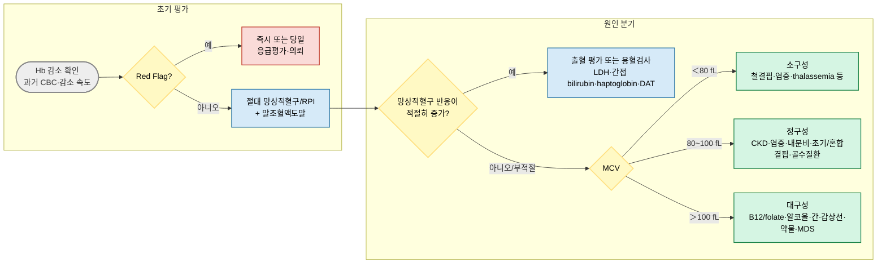

# 빈혈 Anemia

## <mark style="color:green;">일반 사항</mark>

* 빈혈은 혈액의 산소 운반 능력이 연령·성별·생리 상태에 적절한 수준보다 감소한 상태이다. Hb는 이를 판단하는 대표 지표이지만, 수분 상태와 혈장량의 영향을 받으므로 임상 맥락과 함께 해석한다.
* WHO 2024의 해수면 기준 성인 빈혈 절단값은 비임신 여성 Hb ＜12 g/㎗, 남성 Hb ＜13 g/㎗이다.
* 임신 중에는 생리적 혈액희석을 고려하여 제1삼분기 Hb ＜11 g/㎗, 제2삼분기 Hb ＜10.5 g/㎗, 제3삼분기 Hb ＜11 g/㎗를 빈혈 기준으로 사용한다.
* 검사실 참고범위, 연령, 임신, 고도, 흡연, 탈수·과수분 상태를 함께 고려한다. Hb 절단값만으로 원인이나 치료 필요성을 판단하지 않는다.


**Hb 해석의 함정**

* 임신·지구력 운동선수·과수분 상태에서는 혈장량 증가로 Hb/Hct가 낮아질 수 있다.
* 탈수에서는 혈액농축으로 실제 빈혈이 가려질 수 있다.
* 고지대 생활과 흡연에서는 Hb가 높아질 수 있다.
* 빈혈 증상은 Hb 절대값보다 감소 속도, 연령 및 심폐질환에 크게 좌우된다. 급성 빈혈이나 심혈관질환 환자는 비교적 높은 Hb에서도 증상이 나타날 수 있다.


## <mark style="color:green;">원인</mark>

### <mark style="color:orange;">적혈구 생성 감소</mark>

* 영양 결핍: 철, vitamin B12(cobalamin), 엽산(folate)
* 염증·만성질환: 만성 감염, 자가면역질환, 악성종양
* 신장질환: erythropoietin 생성 감소, 철 이용 장애 등
* 골수질환: 재생불량빈혈, 골수형성이상증후군, 백혈병, 골수섬유증, 골수침윤
* 내분비·대사질환: 갑상선기능저하증, 중증 간질환, 영양실조
* 약물·독성물질·알코올

### <mark style="color:orange;">적혈구 소실 또는 파괴 증가</mark>

* 급성·만성 출혈
* 면역성·비면역성 용혈
* 유전성 적혈구질환 및 혈색소병증: thalassemia, hereditary spherocytosis, sickle cell disease 등
* 감염: malaria 등

### <mark style="color:orange;">위험 인자</mark>

* 편식, 엄격한 채식, 영양 섭취 부족, 알코올 사용장애
* 급성장기, 임신·수유, 과다월경, 고령
* 반복 헌혈 또는 반복 채혈
* 위·소장 절제, bariatric surgery, 소화성 궤양, celiac disease, IBD
* 만성 신장·간·염증성·감염성·악성 질환
* 가족력 또는 혈색소병증 유행지역 출신
* NSAID·항혈소판제·항응고제 사용, 장기간의 metformin·PPI 사용
* 항암제, 면역억제제, 항경련제 및 기타 골수억제·용혈 유발 약물

## <mark style="color:green;">임상 양상</mark>

* 서서히 진행하면 무증상일 수 있으나, 특정 Hb 수치까지 무증상이라고 단정할 수 없다.
* 피로, 무기력, 운동능력 저하, 두통, 어지럼, 집중력 저하
* 운동 시 호흡곤란·빈맥·심계항진; 중증이면 휴식 시 호흡곤란·흉통·실신
* 결막·피부 창백: 피부색, 조명 및 말초관류에 영향을 받으므로 신체진찰만으로 Hb를 추정하거나 중증 빈혈을 배제하지 않는다.
* 황달·진한 소변: 용혈 시사
* 점상출혈·반상출혈, 반복 감염: 혈소판·백혈구 감소 동반 가능
* 설염, 감각이상, 보행불안정, 인지·정신증상: vitamin B12 결핍 고려
* 림프절병증, 간비장비대, 흉골 압통: 혈액종양·용혈·전신질환 고려

***

### <mark style="color:$danger;">🚩 Red Flags!</mark>

<mark style="color:$danger;">**즉각 조치 또는 의뢰**</mark>

* 활동성 대량출혈, 저혈압·쇼크, 의식 변화 또는 빠른 Hb 감소
* 빈혈과 함께 흉통, 실신, 휴식 시 심한 호흡곤란, 저산소증 또는 급성 심부전 소견
* 혈소판감소와 미세혈관병성 용혈빈혈이 동반되어 TTP/TMA가 의심되는 경우 — schistocyte, 신경학적 이상 또는 신장손상이 진단을 뒷받침하지만 이들 소견이 모두 있어야 하는 것은 아님
* DIC 의심, 중증 출혈 또는 장기기능장애
* 발열성 호중구감소 또는 blast와 급성 전신증상
* 급성 용혈과 함께 Hb 급감, 혈색소뇨, AKI, 흉통·실신 또는 혈역학적 불안정

<mark style="color:$warning;">**당일 또는 조기 의뢰**</mark>

* 안정적이지만 중증이거나 빠르게 진행하는 원인불명 빈혈
* 범혈구감소, 두 계열 이상의 새 혈구감소 또는 비정상 말초도말
* 안정적인 급성 용혈 의심: 황달, 혈색소뇨, LDH 상승, haptoglobin 감소 등
* 새로운 중증 신경학적 이상을 동반한 vitamin B12 결핍 의심
* 임신 중 중증 빈혈 또는 산과적 출혈 의심

<mark style="color:$info;">**외래 추적 / 추가 평가 계획**</mark> <mark style="color:$info;">- 즉각 위험 낮으나 호전 없으면 의뢰</mark>

* 초기검사 후에도 지속되는 원인불명 빈혈
* MDS, 재생불량빈혈, 혈색소병증, 골수침윤 또는 만성 용혈 의심
* 적절한 원인치료에도 Hb가 회복되지 않거나 반복 재발
* 골수검사가 필요할 가능성이 있는 경우

***

## <mark style="color:green;">진단</mark>

### <mark style="color:orange;">병력 및 진찰</mark>

* 발병 시점과 진행 속도, 과거 CBC 및 기저 Hb
* 월경·임신, 흑색변·혈변·혈뇨, 수술·외상·헌혈 등 출혈력
* 식이, 음주, 위장관 수술·질환, 체중감소
* 만성 신장·간·갑상선·염증성·감염성·악성 질환
* 처방약·건강보조제·독성물질 및 nitrous oxide 노출
* 가족력, 인종·출신 지역, 황달·담석·비장절제 병력
* 활력징후, 결막·피부, 황달, 출혈 소견, 심폐진찰, 림프절·간비장, 신경학적 진찰

### <mark style="color:orange;">초기 검사</mark>

* CBC with differential, Hb/Hct, RBC indices(MCV, MCH, MCHC), RDW, 혈소판
* 절대 망상적혈구 수와 필요 시 corrected reticulocyte count 또는 reticulocyte production index(RPI)
* 말초혈액도말
* ferritin, serum iron, TIBC 또는 transferrin, transferrin saturation: 철결핍빈혈 챕터 참조
* creatinine/eGFR, LFT, TSH, CRP/ESR
* 임상상에 따라 vitamin B12, folate, LDH, total/indirect bilirubin, haptoglobin, DAT, 소변검사


절대 망상적혈구 수와 RPI의 참고범위·절단값은 검사실과 계산법에 따라 다르다. 대략적인 계산은 RPI = (망상적혈구% × 환자 Hct／정상 Hct) ÷ 성숙보정계수(Hct에 따라 1\~3)로 하며, 자동화 장비의 절대 망상적혈구 수와 immature reticulocyte fraction을 함께 참고할 수 있다. 일반적으로 RPI ＜2이면 골수 생성 반응이 부적절함을 시사하고, RPI 약 2\~3 이상이면 출혈·용혈에 대한 적절한 반응을 시사하지만 검사실과 임상 맥락에 따라 해석한다. 단일 수치만으로 원인을 확정하지 않는다.


***



<p align="center"><strong>빈혈 진단 알고리듬</strong></p>

***

### <mark style="color:orange;">MCV에 따른 주요 감별</mark>

| 분류                             | 주요 원인                                                        | 진단 단서                                                                                                               |
| ------------------------------ | ------------------------------------------------------------ | ------------------------------------------------------------------------------------------------------------------- |
| <p>소구성<br>(MCV ＜80 fL)</p>     | 철결핍, 염증성 빈혈, thalassemia, 드물게 sideroblastic anemia·납중독       | 철검사, CRP/ESR, RBC 수·Mentzer index를 참고하되 필요 시 Hb electrophoresis 또는 유전검사                                             |
| <p>정구성<br>(MCV 80\~100 fL)</p> | 급성출혈, CKD, 염증성 빈혈, 용혈, 내분비질환, 초기 철/B12/folate 결핍, 혼합결핍, 골수질환 | 망상적혈구 반응이 가장 중요한 첫 분기                                                                                               |
| <p>대구성<br>(MCV ＞100 fL)</p>    | B12·folate 결핍, 알코올, 간질환, 갑상선기능저하증, 약물, reticulocytosis, MDS  | macro-ovalocyte와 hypersegmented neutrophil은 megaloblastic process 시사; reticulocytosis·cold agglutinin은 MCV를 높일 수 있음 |

* RDW는 혼합된 적혈구 크기를 보여주는 보조지표이며 단독으로 철결핍, thalassemia, 용혈 또는 골수질환을 확진하지 않는다.
* 철결핍과 B12/folate 결핍이 함께 있으면 MCV가 정상으로 보일 수 있다.


**Mentzer index = MCV(fL)／RBC count(10⁶/㎕)** — 소구성 빈혈에서 철결핍과 thalassemia trait 감별에 참고하는 선별 보조지표. 13 미만이면 thalassemia trait, 13 이상이면 철결핍이 상대적으로 더 시사되지만 성인, 혼합결핍 및 염증 상황에서는 정확도가 낮아질 수 있어 단독으로 확진하지 않는다. 필요 시 ferritin과 Hb electrophoresis를 확인한다. 다만 α-thalassemia trait에서는 Hb electrophoresis가 정상일 수 있고, 철결핍이 동반되면 HbA₂가 낮아져 β-thalassemia trait가 가려질 수 있다.


### <mark style="color:orange;">선택적 검사</mark>

* 출혈 또는 철결핍이 의심되면 성별·연령·월경력·위장관 증상·암 위험에 따라 상·하부위장관 평가를 결정한다. 대변잠혈검사 음성만으로 위장관 출혈을 배제하지 않는다.
* 기생충검사는 거주·여행·노출 위험 및 호산구증가 등 역학적 단서가 있을 때 시행한다.
* 골수검사는 범혈구감소, 비정상 도말, 설명되지 않는 지속적 빈혈 또는 MDS·재생불량빈혈·백혈병·골수침윤 의심 시 혈액내과와 상의하여 시행한다.

### <mark style="color:orange;">선별검사</mark>

* 무증상 일반 성인에서 일률적으로 적용할 빈혈 선별검사 간격은 확립되어 있지 않다. 증상과 위험인자 및 건강검진 결과에 따라 CBC를 시행한다.
* 임신에서는 국내 산전진료 기준에 따라 초기 CBC를 시행하고 임신 경과 중 재평가한다.
* USPSTF 2024는 무증상 임신부에서 철결핍 및 철결핍빈혈 선별 또는 일률적 철 보충이 임상결과를 개선하는지에 대해 근거 불충분(I statement)으로 판단하였다. 이는 국내 산전검사 관행을 부정하는 의미가 아니며 적용 환경을 구분한다.
* 혈색소병증(thalassemia, sickle cell trait 등) 유병률이 높은 지역 출신이거나 가족력이 있는 경우, 특히 결혼·임신을 계획 중인 부부에서는 사전 상담 시 보인자 선별(Hb electrophoresis 등)을 고려한다. 국내 다문화 가정 증가를 고려할 때 실제 진료에서 놓치기 쉬운 부분이다.

## <mark style="color:green;">철결핍빈혈 Iron Deficiency Anemia</mark>

(☞ [철결핍빈혈](193_-iron-deficiency-anemia.md))

* 가장 흔한 빈혈 원인이며 초기 또는 혼합결핍에서는 정구성일 수 있다.
* 빈혈이 없어도 철결핍 자체만으로 피로와 운동능력 저하 등이 나타날 수 있다(iron deficiency without anemia). 뚜렷한 위험인자와 증상이 있으면 Hb가 정상이어도 ferritin/TSAT 검사를 고려한다.
* 진단 기준, 출혈원 평가, 경구·정맥 철분 치료는 별도 챕터를 참조한다.

## <mark style="color:green;">염증성 빈혈 Anemia of Inflammation (만성질환빈혈)</mark>

### <mark style="color:orange;">일반 사항</mark>

* 만성 감염, 자가면역·염증성 질환, 악성종양 등에 동반되는 저증식성 빈혈이다.
* hepcidin 증가에 따른 철 이용 제한, erythropoietin 생성·반응 저하 및 적혈구 수명 단축이 복합적으로 작용한다.
* 대부분 정구성·정색소성이지만 일부는 소구성일 수 있다.
* CKD 빈혈은 erythropoietin 부족, 철 이용 장애, 염증, 출혈 등이 복합된 별도 임상 맥락으로 구분한다.

### <mark style="color:orange;">진단</mark>

* 원인질환과 염증 소견이 있으면서 빈혈 정도에 비해 망상적혈구 반응이 부적절하다.
* serum iron과 transferrin/TIBC는 흔히 감소하고 ferritin은 정상 또는 증가할 수 있다.
* ferritin은 급성기 반응물질이므로 정상·상승 소견만으로 동반 철결핍을 배제하지 않는다. ferritin, TSAT, 염증 정도와 임상 맥락을 함께 해석한다.
* Hb ＜8 g/㎗이거나 예상보다 심한 빈혈에서는 철결핍, 출혈, CKD, B12/folate 결핍, 용혈 및 골수질환 등 다른 원인을 적극적으로 찾는다.
* B12 또는 folate 감소는 염증성 빈혈의 전형적인 검사소견이 아니라 동반 결핍을 의미한다.

### <mark style="color:orange;">치료</mark>

* 원인 감염·염증·악성질환의 치료가 기본이다.
* 절대적 또는 기능적 철결핍이 동반되면 질환별 기준에 따라 철분 치료를 고려한다.
* RA·IBD 등에서 Hb 수치만을 근거로 ESA를 일률적으로 사용하지 않는다.
* 암 관련 ESA는 비근치적 항암화학요법 관련 빈혈 등 제한된 상황에서 종양·혈액 전문의가 혈전·종양 진행 및 수혈 위험을 비교하여 결정한다(ASCO/ASH 2019).
* 수혈은 Hb 수치만으로 자동 결정하지 않으며 증상, 급성 출혈, 혈역학적 상태, 심혈관질환과 치료 목표를 함께 평가한다.

## <mark style="color:green;">CKD 관련 빈혈 Anemia in Chronic Kidney Disease</mark>

### <mark style="color:orange;">진단 원칙</mark>

* Cr의 절대값으로 진단하지 않고 eGFR, CKD 단계와 경과를 평가한다.
* CKD가 있어도 철결핍, 출혈, 염증, B12/folate 결핍, 용혈, 갑상선질환 및 골수질환을 배제한다.
* CBC, 절대 망상적혈구, ferritin, TSAT를 기본으로 하고 임상상에 따라 말초도말, B12/folate, CRP, LDH·haptoglobin 등을 추가한다.

### <mark style="color:orange;">ESA</mark>

* 철 상태와 교정 가능한 원인을 먼저 평가·치료한다.
* CKD G5D에서 혈액투석 또는 복막투석 중인 환자는 ESA 개시 역치를 Hb 9.0\~10.0 g/㎗ 범위에서 정하여 시작을 고려한다(KDIGO 2026 Recommendation 3.2.1, 2D).
* 비투석 CKD에서는 빈혈 증상, 수혈 회피의 이익, ESA의 심혈관·혈전·암 관련 위해를 고려하여 시작 시점을 개별화한다. 대부분 Hb 8.5\~10.0 g/㎗ 범위에서 고려할 수 있으나 고정 역치는 아니다(KDIGO 2026 Recommendation 3.2.2, 2D).
* 심혈관·혈전색전질환 또는 활동성 암, 특히 근치 치료 중인 암에서는 더 낮은 시작 역치 또는 ESA 회피를 고려한다. 신장이식 후보자나 증상이 뚜렷한 환자에서는 수혈에 따른 동종면역 위험을 고려할 수 있다.
* 성인 ESA 치료 중 Hb는 11.5 g/㎗ 미만을 목표로 하며, 치료 목표를 달성하는 가장 낮은 Hb와 ESA 용량을 사용한다(KDIGO 2026 Recommendation 3.3.1, 1D).
* 시작 또는 용량 변경 후 Hb를 2\~4주 간격으로 확인하고, 유지기에는 적어도 3개월마다 확인한다. 2\~4주에 Hb가 1 g/㎗를 초과하여 빠르게 상승하지 않도록 한다.
* 고혈압, 뇌졸중, 혈전색전증, 혈관접근로 혈전 및 ESA 저반응을 모니터링한다.
* 신장이식 후보자에서는 수혈에 따른 HLA 동종면역 위험을 고려하여, 수혈 회피의 이익과 ESA의 위해를 개별적으로 비교한다.

## <mark style="color:green;">수혈 원칙 Red Blood Cell Transfusion</mark>

* 안정적인 비출혈 성인에서는 제한적 수혈 전략을 사용하며 Hb ＜7 g/㎗는 흔히 사용하는 고려 역치이지 자동 수혈 지시가 아니다(AABB 2023).
* 심장수술 환자에서는 7.5 g/㎗, 정형외과 수술 또는 기존 심혈관질환 환자에서는 8 g/㎗를 선택적 역치로 사용할 수 있다.
* 활동성 출혈, 혈역학적 불안정, 급성 관상동맥증후군, 중증 저산소 증상에서는 위 숫자를 기계적으로 적용하지 않는다.
* 수혈 여부는 증상, 출혈 속도, 심혈관질환, 치료 목표와 환자 선호를 함께 고려하여 결정한다.

## <mark style="color:green;">Vitamin B12 결핍 Cobalamin Deficiency</mark>

### <mark style="color:orange;">일반 사항</mark>

* 성인 1일 권장섭취량은 2.4 ㎍이며 임신 2.6 ㎍, 수유 2.8 ㎍이다. 체내 저장량이 커서 결핍 증상은 수년에 걸쳐 나타날 수 있다.
* 위산에 의해 음식에서 유리된 B12는 내인자와 결합하여 회장 말단부에서 흡수된다.
* 결핍은 megaloblastic anemia, 범혈구감소, 설염 및 신경계 손상을 유발할 수 있다.
* 빈혈이나 대구성증 없이 신경학적 증상만 나타날 수 있으므로 정상 MCV만으로 배제하지 않는다.

### <mark style="color:orange;">원인 및 위험 인자</mark>

* 섭취 부족: 엄격한 vegan diet, 영양실조; 동물성 식품 외에 B12 강화 시리얼·영양효모 등 강화식품도 공급원이 될 수 있다.
* 자가면역성 위염에 의한 내인자 결핍(악성빈혈)
* 위절제·bariatric surgery, 위축성 위염, 회장 말단 절제, Crohn disease, celiac disease, 췌장기능부전
* 장기간의 metformin, PPI 또는 H2 blocker 사용
* nitrous oxide 반복·과다 노출: 혈중 B12가 정상이어도 기능적 결핍 가능
* 고령, 광절열두조충 감염 등

### <mark style="color:orange;">임상 양상</mark>

* 피로, 허약, 창백, 설염, 식욕저하, 체중감소, 설사
* 손발 감각이상, 진동·위치감각 저하, 보행실조·낙상, 근력저하
* 인지저하, 우울, 혼돈 등 신경정신 증상
* 신경학적 회복은 수개월 이상 걸릴 수 있고 치료가 늦으면 불완전하거나 비가역적일 수 있다.

### <mark style="color:orange;">진단</mark>

* CBC, 망상적혈구, 말초도말: macro-ovalocyte, hypersegmented neutrophil, 백혈구·혈소판 감소가 나타날 수 있으나 모두 필수 소견은 아니다(NICE NG239, 2024).
* serum total B12 또는 active B12를 우선 검사하고 검사실 참고범위를 적용한다.
* 결과가 경계 또는 불명확하면서 임상적으로 의심되면 MMA를 고려한다. 신기능 저하에서는 MMA가 상승할 수 있다.
* homocysteine은 B12와 folate 결핍 모두에서 증가하므로 특이도가 낮다.
* nitrous oxide 관련 기능적 결핍은 serum B12가 정상일 수 있어 MMA 또는 homocysteine을 우선 고려한다.
* 자가면역성 위염이 의심되면 anti-intrinsic factor antibody를 검사한다. 음성이라고 완전히 배제되지 않으며 필요 시 추가 검사 또는 소화기 평가를 고려한다.
* Schilling test는 현재 임상에서 사용하지 않는다.


신경학적 이상 또는 중증 megaloblastic anemia가 의심되면 필요한 검체를 먼저 채취하되, 검사 결과를 기다리느라 B12 치료를 지연하지 않는다.


### <mark style="color:orange;">치료</mark>

#### <mark style="color:$primary;">경구 B12</mark>

* 식이성 또는 경증 결핍에서 경구 고용량 B12를 사용할 수 있다.
* 흡수장애가 의심되나 경구 치료를 선택할 경우 총 B12 용량을 적어도 1 ㎎/day로 사용한다.
* 국제 지침에서는 cyanocobalamin 등 경구 B12를 통상 1\~2 ㎎/day의 고용량으로 사용한다.
* 국내 경구 mecobalamin 0.5 ㎎ 제제 <mark style="color:blue;">\[메치코발 등]</mark>의 허가 적응증은 일반적으로 말초성 신경장애이다. B12 결핍빈혈에 사용하는 경우 허가 외 사용에 해당하며, 정확한 급여 기준은 처방 전 HIRA 고시를 확인한다.

#### <mark style="color:$primary;">주사 B12</mark>

* 중증 빈혈, 신경학적 증상, 중증 흡수장애, 복약순응도 문제 또는 빠른 교정이 필요한 경우 주사 치료를 우선 고려한다.
* 초기 집중 투여 후 혈액학적·신경학적 반응과 원인에 따라 유지 간격을 조정한다.
* 자가면역성 위염, 전위절제 또는 비가역적 회장 흡수장애에서는 장기 또는 평생 유지치료가 필요할 수 있다.
* 국내 주사제의 제품별 성분·용법과 실제 유통 여부는 처방 시 의약품안전나라 및 공급 현황을 확인한다. 유통이 확인되지 않은 특정 제품명을 표준 치료제로 고정하지 않는다.

### <mark style="color:orange;">모니터링</mark>

* 망상적혈구 반응은 대개 약 1주 이내 나타나며 Hb와 MCV는 수주에 걸쳐 회복한다.
* 치료 1\~2개월 후 CBC 반응을 확인하고, 반응이 불충분하면 진단, 복약순응도, 흡수장애, 동반 철·folate 결핍 또는 골수질환을 재평가한다.
* 신경증상은 수개월 이상 추적하며 완전 회복을 보장할 수 없다.
* 중증 빈혈에서는 치료 초기에 potassium 저하가 나타날 수 있으므로 임상적으로 필요한 경우 확인한다.
* 원인이 교정 가능하면 치료기간을 재평가하고, 비가역적 원인에서는 장기 유지계획을 세운다.

## <mark style="color:green;">엽산 결핍 Folate Deficiency, Vitamin B9</mark>

### <mark style="color:orange;">일반 사항</mark>

* 성인 권장섭취량은 400 ㎍ DFE/day이며 임신 600 ㎍ DFE/day, 수유 500 ㎍ DFE/day이다.
* 체내 저장량이 비교적 적어 섭취·흡수가 감소하면 수개월 안에 결핍이 나타날 수 있다.
* DNA 합성 장애로 megaloblastic anemia를 유발하지만 엽산결핍 자체는 전형적인 신경학적 이상을 일으키지 않는다.

### <mark style="color:orange;">원인</mark>

* 섭취 부족: 영양실조, 알코올 사용장애, 과도하게 제한된 식사
* 흡수장애: celiac disease, IBD, short bowel syndrome, bariatric surgery
* 필요량 증가·소실: 임신·수유, 만성 용혈, 광범위 건선, 악성종양, 투석
* 약물: methotrexate, trimethoprim, pyrimethamine, sulfasalazine, phenytoin 및 일부 항경련제

### <mark style="color:orange;">임상 양상</mark>

* 피로, 창백, 설염, 식욕저하, 체중감소, 설사
* 중증에서는 백혈구·혈소판 감소가 동반될 수 있다.
* 감각이상·보행장애 등 신경학적 증상이 있으면 B12 결핍 또는 다른 신경계 질환을 우선 고려한다.

### <mark style="color:orange;">진단</mark>

* CBC, 망상적혈구, 말초도말과 serum folate를 우선 평가하고 검사실 참고범위를 적용한다.
* RBC folate는 일상적인 1차 검사가 아니며, 강한 임상적 의심에도 serum folate가 명확하지 않은 제한적 상황에서 고려한다.
* homocysteine은 증가할 수 있지만 특이적이지 않으며 MMA는 순수 folate 결핍에서는 정상이다.
* 치료 전에 vitamin B12 결핍을 반드시 평가한다. 신경학적 B12 결핍이 의심되면 B12 치료를 먼저 또는 동시에 시작한다.

### <mark style="color:orange;">치료</mark>

* 원인 교정과 함께 folic acid를 투여한다.
* 예: folic acid 1 ㎎ qd <mark style="color:blue;">\[폴산]</mark> × 약 4개월 또는 혈액학적 회복과 원인 교정 시까지
* 지속적 용혈·흡수장애·투석 등에서는 더 긴 치료가 필요할 수 있으며, 중증 흡수장애에서의 고용량 치료는 전문 진료 및 국내 허가사항에 따라 결정한다.
* 확진되지 않은 상태에서 저용량 folate를 투여하고 혈액학적 반응으로 진단하는 방법은 사용하지 않는다.
* 임신 전후 신경관결손 예방을 위한 folic acid 용량은 엽산결핍빈혈 치료와 목적·용량이 다르므로 산과 지침에 따른다.

### <mark style="color:orange;">모니터링</mark>

* 망상적혈구 반응은 약 1주 내 나타날 수 있으며 CBC는 수주에 걸쳐 정상화된다.
* 반응이 없으면 복약순응도, 지속 원인, B12·철 동반결핍, 진단 오류 또는 골수질환을 재평가한다.

***

### <mark style="color:red;">질병코드</mark>

D64.9 상세불명의 빈혈

D63.1 달리 분류된 만성 신장병에서의 빈혈

D63.8 달리 분류된 기타 만성 질환에서의 빈혈

D51.0 내인자 결핍에 의한 vitamin B12 결핍빈혈

D51.9 상세불명의 vitamin B12 결핍빈혈

D52.9 상세불명의 엽산결핍빈혈

E53.8 기타 명시된 비타민 B군의 결핍증 — 빈혈이 없는 vitamin B12 결핍 등에서 고려

_✽D63.1과 D63.8은 달리 분류된 기저질환에 수반되는 빈혈 코드이므로 단독으로 사용하지 않고 기저질환 코드를 먼저 또는 함께 적용한다. 최신 KCD 코딩 지침을 확인한다._

***

## <mark style="color:purple;">처방례</mark>

> **처방례 1. 경구 고용량 vitamin B12 치료**
>
> ```
> 메치코발정 0.5 ㎎  1T tid  경구  (총 1.5 ㎎/day)
> ```
>
> _✽국내 경구 mecobalamin의 허가 적응증은 말초성 신경장애이며, vitamin B12 결핍빈혈에는 허가 외 사용이다. 정확한 급여 기준은 처방 전 HIRA 고시를 확인한다. 흡수장애가 뚜렷하지 않은 경증·식이성 결핍 또는 경구 치료를 선택한 경우 고려하고, 치료 1\~2개월 후 CBC 반응을 확인한다. 중증 빈혈·신경학적 증상·중증 흡수장애에서는 주사 치료를 우선 고려한다._

> **처방례 2. B12 결핍성 거대적아구성빈혈 (국내 주사제 허가 용법)**
>
> ```
> Mecobalamin 주사 500 ㎍  1A  IM 또는 IV  주 3회
> → 증상 소실 후 500 ㎍ IM 또는 IV, 1~3개월마다 유지
> ```
>
> _✽신경학적 증상이 있으면 필요한 검체를 먼저 채취하되 검사 결과를 기다리느라 치료를 지연하지 않는다. 실제 유통 제품과 제품별 허가사항을 처방 시 확인한다. 자가면역성 위염·전위절제·비가역적 회장 흡수장애에서는 장기 또는 평생 유지치료가 필요할 수 있다. 중증 빈혈 또는 빠른 조혈반응이 예상되는 경우 치료 초기 potassium 확인을 고려한다._

> **처방례 3. 엽산결핍빈혈**
>
> ```
> 폴산정 1 ㎎  1T qd  경구  × 약 4개월 또는 원인 교정 시까지
> ```
>
> _✽투여 전에 vitamin B12를 검사한다. B12 결핍을 배제할 수 없고 치료를 지연할 수 없는 경우에는 B12를 먼저 또는 동시에 투여한다. 지속 원인(용혈·흡수장애·투석)에서는 치료기간 연장을 고려한다._

***

### <mark style="color:$success;">핵심 복약 지도</mark>

> **Vitamin B12·엽산 치료의 순서**
>
> * Vitamin B12 결핍에 신경학적 증상이 동반되면 검사 결과를 기다리지 않고 치료를 시작합니다.
> * Folic acid 투여 전 vitamin B12 결핍 여부를 확인하고, 의심되거나 배제되지 않은 상태에서는 B12를 먼저 또는 동시에 투여합니다. Folate 단독 투여는 B12 결핍의 혈액학적 소견을 가려 신경학적 손상을 진행시킬 수 있습니다.
> * 자가면역성 위염·전위절제·비가역적 회장질환에서는 B12 장기 또는 평생 유지치료가 필요할 수 있음을 설명합니다.

> **ESA와 수혈은 Hb 수치만으로 결정하지 않습니다**
>
> * ESA는 CKD 단계, 증상, 철 상태, 수혈·혈전·심혈관·암 위험을 함께 판단하여 시작하며, 치료 중 Hb를 11.5 g/㎗ 이상으로 유지하지 않습니다.
> * Hb ＜7 g/㎗은 자동 수혈 기준이 아닙니다. 증상, 급성 출혈 여부, 혈역학적 상태, 심혈관질환을 함께 평가합니다.

> **언제 다시 병원을 방문해야 하나요?**
>
> * 치료 시작 후 1\~2개월 이내에 CBC 반응이 없는 경우
> * 신경학적 증상이 악화되거나 새로 발생하는 경우 — 즉시 내원
> * 흉통, 실신, 휴식 시 심한 호흡곤란 등 Red Flag 소견이 나타나는 경우 — 즉시 내원

***

### <mark style="color:blue;">환자 안내서</mark>


**빈혈, 원인을 알아야 제대로 치료할 수 있습니다**

빈혈은 철분 부족만이 아니라 출혈, 염증·신장 질환, 비타민 B12·엽산 부족, 용혈, 골수 질환 등 다양한 원인으로 생길 수 있습니다. 원인에 따라 치료법이 다르므로 원인이 확인되기 전에는 임의로 철분제나 영양제를 복용하지 마십시오.


#### <mark style="color:$primary;">왜 빈혈이 생기나요?</mark>

* 우리 몸이 적혈구를 충분히 만들지 못하거나, 적혈구가 너무 빨리 없어지거나 손실될 때 빈혈이 생깁니다.
* 철분, vitamin B12, 엽산과 같은 영양소 부족, 만성 신장·염증성 질환, 출혈, 용혈 등이 흔한 원인입니다.

#### <mark style="color:$primary;">B12·엽산 치료는 어떻게 하나요?</mark>

* **처방받은 용량과 기간을 지켜 복용하십시오.** 증상이 좋아졌다고 임의로 중단하면 재발하거나 신경 증상이 남을 수 있습니다.
* **채식 위주 식사를 하신다면** B12 강화식품(강화 시리얼, 영양효모 등) 섭취나 보충 방법을 의료진과 상의하십시오.
* 주사 치료가 필요한 경우 처음에는 자주, 이후에는 간격을 늘려 유지 투여합니다. 원인에 따라 평생 치료가 필요할 수 있습니다.

#### <mark style="color:$primary;">일상생활에서 어떻게 관리하나요?</mark>

* **철분이 풍부한 음식**(육류, 생선, 콩류, 진한 녹색채소)과 **vitamin B12·엽산이 풍부한 음식**(육류, 생선, 유제품, 계란, 녹색채소, 콩류)을 균형 있게 섭취하십시오.
* 검은변, 혈변, 과다월경, 혈뇨가 있거나 진통소염제·항혈소판제·항응고제를 복용 중이면 의료진에게 알리십시오.

#### <mark style="color:$primary;">이럴 때는 즉시 병원을 방문하세요</mark>

* 흉통, 실신, 가만히 있어도 숨이 찬 증상, 의식 변화가 있을 때
* 많은 양의 출혈, 검고 끈적한 타르변, 선홍색 또는 검붉은 혈변, 진한 갈색 소변, 갑작스러운 심한 황달이 있을 때
* 손발 저림, 균형장애, 보행불안정, 기억·인지 변화가 있을 때 — 빈혈이 심하지 않아도 vitamin B12 결핍 평가가 필요할 수 있습니다
