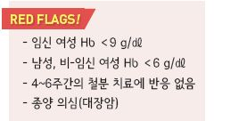
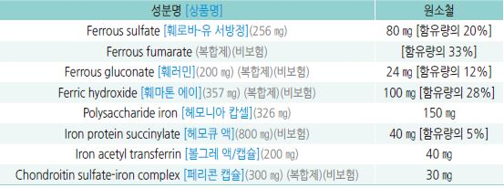
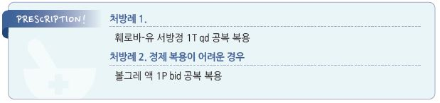

# 철결핍빈혈 Iron deficiency anemia


## 일반 사항

* 빈혈의 가장 흔한 형태; ＞50% 차지 (☞ p.1020)
* 유병률 : 남성 2\~5%, 가임기 여성 30%; 지역 및 연구에 따라 편차가 심함
* microcytic, hypochromic RBC
* transferrin 포화도가 15\~20%이면 Hb 합성에 장애 발생
* s-ferritin이 ＜15 ㎍/L이면 골수에서의 저장 철은 거의 없는 상태
* 다른 원인이 확인되지 않는 경우 소화기계 출혈 의심
* 철분 보충제 공급은 과잉 공급 시의 부작용을 감안하여 철분 결핍 여부를 확인 후 투여해야 함
* 대부분의 남성 및 폐경 후 여성에 대한 일률적인 철분 보충제 투여는 권고하지 않음

#### 철분 섭취 권고량 \[RDAs]

* 14\~18 세 : 남- 11 ㎎, 여- 15 ㎎
* 19\~50 세 : 남- 8 ㎎, 여- 18 ㎎
* ≥51 세 : 남- 8 ㎎, 여- 8 ㎎
* 임신- 27 ㎎; 수유- 9 ㎎

#### 우리나라 평균 1일 철분 섭취량

> ```
> (Ref. 2014년 국민영양통계. 한국보건산업진흥원)
> ```

* 성별 : 남- 19.56 ㎎, 여- 14.97 ㎎
* 연령대별 : 19~~29세- 15.73 ㎎, 30~~49세- 17.74 ㎎, 50\~64세- 21.28 ㎎, ＞65세- 15.99 ㎎
* 2,000 ㎉ 식단에 보통 철분 10 ㎎이 포함되어 있음

#### 철분 보충제에 의한 철분 과잉 공급의 문제

* 좋은 영양 습관의 중요성을 무시하게 됨. 음식보다 약으로 보충하려고 함
* 혈색소가 증가함에 따라서 erythropoietin의 자극이 감소되어 장에서의 철분 흡수량이 감소함
* 과량 투여 시 철 중독 또는 Yersinia 감염을 일으킬 수 있음

## 원인

* 철 요구량↑ : 급성장(소아청소년기), 임신, 수유, erythropoietin 치료
* 철 소실↑ : 기생충, 소화성 궤양, IBD, 반복되는 코피, 과다월경, 운동선수, 외상, NSAID/aspirin 복용
*   철 섭취↓/흡수↓ : 부적절한 식이, 채식주의, 위축성 위염, 제산제/PPI 복용, 위절제술, 만성 설사, 흡수 장애 질환(셀리악병,

    크론병), Zn 결핍, 낮은 사회 경제적 상태
* 검사에도 불구하고 5%에서는 원인을 찾을 수 없음



## 임상 양상

* 피로, 쇠약, 창백, 두통, 흥분, 혀의 통증, 운동 능력 저하(호흡 곤란, 빈맥)
* 부서지는 손톱, 하지불안증후군, pica, pagophagia, cheilitis, koilonychia

## 진단

* hypochromic microcytic anemia
*   혈청 ferritin : ＜15 ng/㎖

    TIBC : ＞360 ㎍/㎗

    혈청 Fe : ＜30 ㎍/㎗

    transferrin saturation rate(Fe÷TIBC) : ＜10%
*   위장관 검사 : 다른 원인이 확인되지 않을 경우 위장관 출혈을 감별해야 함

    •무증상 폐경기 여성 및 남성 IDA 환자에서 (이전에 시행하지 않았다면) 위/대장 내시경 권고

    •IDA 환자에서 위축성 위염 감별을 위한 일률적 위장 조직 검사는 권고하지 않음
*   H. pylori 검사 : 위장관 내시경 검사 후에도 다른 원인이 확인되지 않는 경우 (이전에 검사하지 않았다면) 비침습성 H. pylori

    검사 및 양성 시 치료를 고려

### 감별

```
(☞ p.1021)
```

***

## Management

## 철분 함유 식품 섭취

### 철분 종류

#### Heme iron

* 식사로 섭취한 철분 전체의 10%에 불과하지만 다른 음식의 영향을 덜 받아 흡수율이 높아(14\~18%) 전체 흡수량의 ⅓ 차지
* 함유 식품 : 육류(예: meat, 해물, 가금류) (✽육류에는 heme 및 non-heme iron이 들어 있음)

#### Non-Heme iron

* inorganic, 특히 ferric iron; 십이지장 근위부에서 2가 철(ferrous iron)로 환원되어 흡수
*   인산염, 탄닌 등 다른 식품 성분에 의한 간섭으로 흡수율은 낮지만(1\~5%) 섭취량이 많아(대부분의 식품에 함유)

    전체 흡수량의 ⅔ 차지 (✽고기 외의 식품에는 non-heme iron만 들어 있음)
* 함유 식품 : 견과류, 강낭콩, 푸른 잎채소(예: 시금치, 브로콜리), 통곡류, 철분 강화식품

### 철분 흡수율

* 1\~22%(평균 10%)
* 철분 함유 음식 및 함께 섭취한 음식의 종류에 의하여 영향을 받음
*   방해 : 유제품(생우유, 치즈), 섬유소(채소), 콩 단백질, 계란 노른자, 카페인(차, 커피), 미네랄(칼슘, 인), 약물(종합 비타민,

    제산제, H2 차단제, PPI, tetracycline)
* 도움 : Vit C 및 Vit C 함유 과일(밀감류, 딸기류), 육류(meat), 생선
* 주의 : allopurinol(간에서의 iron 저장을 증가시킴)

### 철분 함유 식품

```

```

## 철분제 섭취

### 경구제

#### 종류

* 3가염(ferric)보다 2가염(ferrous)이 용해도가 높아 보다 유용함 (보험기준 ☞ p.1196)
* heme iron polypeptide, carbonyl iron, iron amino-acid chelate, polysaccharide iron; 2가/3가염보다 위장 부작용이 적음
* 정제 : 1차 선택 (✽enteric coated 제제는 흡수가 저하될 가능성이 있음)
*   액제 : 정제 복용이 어려운 경우나 위장 수술 시 고려 (✽위장 수술 시 위장 내 정제 용해가 저하됨)

    

#### 용법

* 1일 투여량 : 원소 철로서 60\~120 ㎎/d
* 통상 3\~5일간 하루 1정/캡슐 공복(식간) 복용 후 부작용이 없으면 증량

> ✽하루걸러 복용하는 것이 매일 복용하는 것보다 흡수가 증가하고 위장 부작용이 적다는 보고가 있음

*   고령자에서는 저용량 투여(＞80세- 원소 철 15 ㎎/d); 고령자에서는 경구 철분제에 의한 독성이 더 클 수 있으며,

    저용량 투여 시 효과는 통상 용량과 유의미한 차이가 없으면서 부작용은 줄어듦
* 월경량이 많은 여성은 매일 흡수 철분 3\~4 ㎎을 요하며 흔히 철분제 복용이 필요함
* 흡수를 돕는 음식과 함께 복용 : Vit C 제제 또는 오렌지 주스와 함께 복용
*   흡수 방해 음식이나 약물을 피하여 복용 : 흡수 방해 식품 섭취 2시간 이후 및 섭취 1시간 전 철분제 복용,

    제산제 복용 4시간 이후 및 복용 1시간 전에 철분제 복용
* 병용 금지 약물 : allopurinol(간에서의 iron 저장이 증가됨)

#### 부작용

*   구역, 변비(\~¼에서 발생), 복통, 치아 착색(액제 복용 시), 쇠 맛, 검은 변

    •≥45 ㎎/d 투여 시 위장 부작용의 발생 가능성이 많음

#### 대처

* 약제 변경, 액제 선택, 원소 철 비율이 낮은 제제(예: ferrous gluconate) 선택

> ✽mucoprotease를 함유한 서방형 ferrous sulfate가 복용이 편하다는 보고가 있음

* 저용량 복용, 분할 복용, 격일 복용, 음식과 함께 복용(단, 흡수가 감소됨)
* 변비 발생 시 섬유질 섭취를 늘림
* 액제 복용에 의한 치아 착색 예방을 위하여 빨대 이용 섭취 또는 복용 후 입안을 물로 헹굼

### 주사제

#### 대상

* 심한 빈혈(Hb ＜6 g/㎗)
* 경구제 투여로 목표 달성이 되지 않는 환자
* 경구 철분제 복용 불가능(예: 부작용), 흡수 장애(예: IBD), 혈액 투석, 낮은 약물 복용 순응도

#### 약제

* 투여량 : 철 부족량을 계산식에 의해 구하여 공급
*   ferric hydroxide sucrose complex \[베노훼럼 주], ferric carboxymaltose [페린젝트 주](../%EB%B9%84%EB%B3%B4%ED%97%98/), ferric gluconate, ferric

    pyrophosphate citrate, ferumoxytol, iron dextran(✽중증 알레르기 부작용이 있음), iron isomaltoside [모노퍼 주](../%EB%B9%84%EB%B3%B4%ED%97%98/)

#### 부작용

* anaphylaxis(＜0.1%), 주사 부위 발적, 요통, 염증성 관절염 flare

#### 대처

* 천천히 주입. 소량의 test dose 주입을 고려
*   주사 전 처치 : 천식, 다제약물 알레르기, 또는 염증성 관절염이 있는 환자에 대하여 주입 전 methylprednisolone 투여

    \[솔루메드롤 주] (✽anaphylaxis 예방을 위한 steroid와 항히스타민제 투여 효과에 대하여 논란;

    AAAAI는 radiocontrast 제제의 전 처치로서 이들 투여에 반대함(2020))
* 진통제(NSAID) 투여 : 요통이나 관절통에 대하여 투여

### 임산부

* 보충

> ✽USPSTF에서는 일률적인 투여를 권고하지 않음 •임신 : 첫 번째 산전 진찰 때부터 저용량(원소 철 30 ㎎/d qd) 투여

•수유 : 신생아 월령 6개월부터 원소 철 1 ㎎/㎏/d

* 치료(Hb ＜9 g/㎗ 또는 HCT ＜27%인 경우) : 원소 철 60\~120 ㎎/d #2

## 모니터링

* 치료 목표 : 빈혈 교정 및 0.5\~1 g의 저장 철 확보
*   적절한 치료에 대한 반응 및 순서 : 2\~3일 후 대변색이 어두운색으로 변화 → 10일 내 reticulocyte 증가

    → 2주 내 Hb 1 g/㎗ 증가 → 3\~4주마다 Hb 1 g/㎗ 씩 증가
* 치료 종료 : s-ferritin ≥50 ng/㎖ 시; 보통 Hb 정상화 후 6개월간의 추가 치료가 필요

### 검사 일정

* 2주 후 reticulocyte 및 Hb : 반응이 없으면 복용 순응도 또는 진단에 문제가 있을 수 있음
* 1개월 및 2개월 째 CBC
* Hb 정상화 후 12개월간 3개월마다 모니터링

### 치료 실패 원인

* 낮은 복용 순응도
* 흡수 저하
* 지속되는 GI 출혈 : gastritis, PUD, carcinoma, varices, 셀리악병
* 만성 용혈 : paroxysmal nocturnal hemoglobinuria, malfunctioning prosthetic valve
* iron usage 결함 : thalassemia trait, sideroblastosis, G6PD deficiency
* iron reutilization 결함 : 감염, 염증, 암, 갑상선저하증, 만성 질환
* hypoproliferation : erythropoietin 감소, 신부전
* 다른 빈혈 질환 : 만성 질환, thalassemia, 납 중독

> **질병코드** D50 철결핍빈혈



### 처방례
