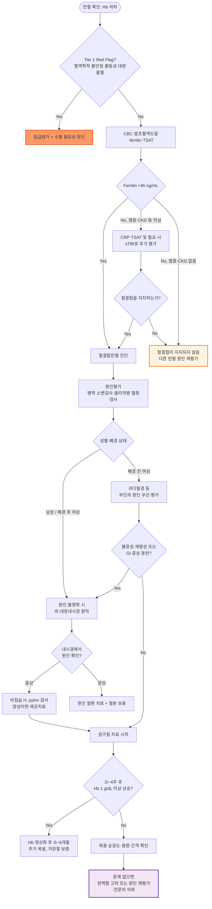

# 철결핍빈혈 (Iron Deficiency Anemia) IDA

## <mark style="color:green;">일반 사항</mark>

* 철결핍은 빈혈의 가장 흔한 원인이지만, 빈혈이 생기기 전에도 저장철 고갈과 철결핍성 조혈이 먼저 나타날 수 있음
* 철결핍빈혈은 전형적으로 소구성·저색소성이나, 초기 또는 혼합결핍(B12·엽산결핍 동반)에서는 MCV가 정상일 수 있음
* 혈청 ferritin은 저장철 평가에 가장 유용하지만 급성기 반응물질이므로 감염·염증·암·간질환·만성콩팥병에서는 정상 또는 상승해도 철결핍을 배제할 수 없음
* 중증 빈혈이 장기간 지속되면 드물게 고박출성 심부전이 발생할 수 있으며, 임신 중 철결핍빈혈은 조산·저체중출생과 연관되고 소아·청소년에서는 인지·발달에 영향을 줄 수 있음
* 철분을 보충하는 것만으로 진료를 끝내지 말고 출혈, 흡수장애, 철 요구량 증가 등 원인을 함께 확인해야 함
* 남성 및 폐경 후 여성의 새로 진단된 철결핍빈혈에서는 위장관 출혈과 악성종양 가능성을 우선 평가함
* 철분 보충제는 철결핍이 확인되었거나 강하게 의심될 때 사용하며, 비철결핍성 빈혈에 경험적으로 장기간 투여하지 않음

### <mark style="color:orange;">철 권장섭취량</mark>

2025 한국인 영양소 섭취기준의 철 권장섭취량은 다음과 같다.

<table><thead><tr><th>대상</th><th>권장섭취량</th><th>상한섭취량</th></tr></thead><tbody><tr><td>남자 19\~74세</td><td>8 ㎎/day</td><td rowspan="5">45 ㎎/day</td></tr><tr><td>남자 ≥75세</td><td>7 ㎎/day</td></tr><tr><td>여자 19\~49세</td><td>12 ㎎/day</td></tr><tr><td>여자 50\~64세</td><td>7 ㎎/day</td></tr><tr><td>여자 ≥65세</td><td>6 ㎎/day</td></tr><tr><td>임신부</td><td>해당 연령 여성 기준에 9 ㎎/day 추가</td><td>45 ㎎/day</td></tr><tr><td>수유부</td><td>추가량 없음</td><td>45 ㎎/day</td></tr></tbody></table>

_Ref. 보건복지부·한국영양학회. 2025 한국인 영양소 섭취기준._

### <mark style="color:orange;">우리나라 평균 1일 철 섭취량</mark>

* 2024년 19세 이상 성인의 연령표준화 평균 1일 철 섭취량
  * 전체 : 9.5±0.1 ㎎/day, 남자 : 10.7±0.2 ㎎/day, 여자 : 8.2±0.1 ㎎/day
* 2020 한국인 영양소 섭취기준 대비 섭취비율 : 전체 91.6±1.1%, 남자 108.4±1.7%, 여자 73.3±1.0%


위 수치는 19세 이상 인구를 2005년 추계인구로 연령표준화한 집단 평균이며, 섭취비율은 당시 적용된 **2020 한국인 영양소 섭취기준** 대비 값이다. 개인의 철결핍 여부를 판단하는 기준으로 사용할 수 없다.


_Ref. 질병관리청. 2024 국민건강통계 추이. 추이표 2-6, 2-8._

## <mark style="color:green;">원인</mark>

* **혈액 소실 증가**
  * 위장관 : 소화성 궤양, 위·대장암, IBD, 혈관이형성, 치질, 기생충, NSAID/aspirin 또는 항응고제 관련 출혈
  * 부인과 : 과다월경, 부정출혈, 자궁근종 등
  * 기타 : 반복되는 코피, 잦은 헌혈, 혈뇨, 외상·수술, 드물게 만성 혈색소뇨
* **철 요구량 증가** : 영유아·청소년기의 급성장, 임신, erythropoiesis-stimulating agent 치료
* **섭취 부족** : 제한적인 식사, 식품 불안정, 부적절한 채식 식단, 섭식장애
* **흡수 저하** : 셀리악병, 위축성 위염, H. pylori 감염, 위·소장 절제 또는 비만대사수술, 크론병, 만성 설사, 장기간의 위산분비억제제 사용
* **복합 원인** : 만성염증, 만성콩팥병, 암, 심부전에서는 철결핍과 만성질환빈혈이 함께 나타날 수 있음

## <mark style="color:green;">임상 양상</mark>

* 피로, 쇠약, 창백, 두통, 어지럼, 집중력 저하, 운동능력 감소, 호흡곤란, 빈맥
* 설염, 구각염, 부서지는 손톱, 스푼형 손톱(koilonychia)
* 이식증(pica), 특히 얼음을 찾는 빙섭증(pagophagia)
* 하지불안증후군, 탈모
* 서서히 진행하면 Hb가 상당히 낮아도 증상이 경미할 수 있으므로 증상만으로 중증도를 판단하지 않음

### <mark style="color:$danger;">🚩 Red Flags!</mark>

<mark style="color:$danger;">**즉각 조치 또는 의뢰**</mark> <mark style="color:$danger;">- 생명 위협 또는 즉각적 위해 가능성</mark>

* 혈역학적 불안정, 활동성 대량출혈 또는 빠르게 진행하는 출혈
* 실신, 의식 변화, 흉통, 휴식 시 호흡곤란, 저산소증
* 중증 빈혈에 의한 심근허혈, 심부전 또는 쇼크 의심
* 빈맥·저혈압 등 조직 저산소증 소견을 동반한 매우 낮은 Hb

_→ 정맥로 확보, CBC·교차시험 등 응급검사와 출혈원 평가를 시행하고 적혈구 수혈 필요성을 판단한다. 정맥철은 즉각적인 산소운반능 회복 치료가 아니다._

<mark style="color:$warning;">**당일 또는 조기 의뢰**</mark>

* (성인 기준) Hb 약 6\~7 g/㎗ 이하이거나 단기간에 빠르게 감소 - 소아·청소년은 연령별 정상범위가 다르므로 별도로 판단
* 임신 중 중증 빈혈 또는 임신 후기의 진행성 빈혈
* 지속되는 위장관·부인과 출혈, melena·hematochezia·혈뇨
* 연하곤란, 체중감소, 복부종괴, 배변습관 변화 등 악성종양 의심 소견

_→ Hb 수치만으로 수혈 여부를 결정하지 말고 증상, 활력징후, 출혈 지속 여부, 심혈관질환을 함께 평가한다._

<mark style="color:$info;">**외래 추적 / 추가 평가 계획**</mark> <mark style="color:$info;">- 즉각 위험 낮으나 호전 없으면 의뢰</mark>

* 남성 또는 폐경 후 여성에서 새로 확인된 철결핍빈혈
* 원인이 분명하지 않은 재발성 철결핍빈혈
* 적절한 경구철 치료 2\~4주 후에도 Hb 반응이 없거나 ferritin이 개선되지 않음
* 과다월경에 비해 빈혈이 지나치게 심하거나 치료 후 반복 재발

## <mark style="color:green;">진단</mark>

### <mark style="color:orange;">기본 검사와 해석</mark>

<table><thead><tr><th width="160">검사</th><th width="260">전형적 소견</th><th>해석 시 주의</th></tr></thead><tbody><tr><td>CBC·말초혈액도말</td><td>Hb 감소, MCV·MCH 감소, RDW 증가, 저색소성·적혈구 부등\~변형증(anisopoikilocytosis)</td><td>초기 또는 B12/엽산결핍 동반 시 MCV가 정상일 수 있음</td></tr><tr><td>Ferritin</td><td>&lt;15 ng/mL : 저장철 고갈을 강하게 시사<br>&lt;30 ng/mL : 철결핍 가능성 높음</td><td>AGA는 빈혈 환자에서 &lt;45 ng/mL를 진단 절단값으로 권고(AGA 2020, 민감도 85%·특이도 92%). 염증·감염·암·간질환·CKD에서는 거짓정상/상승 가능</td></tr><tr><td>Transferrin saturation(TSAT)</td><td>대개 &lt;20%</td><td>염증성 철 제한에서도 감소할 수 있어 ferritin·CRP와 함께 해석</td></tr><tr><td>혈청 iron·TIBC</td><td>iron 감소, TIBC 증가</td><td>일중 변동과 식사 영향이 커 단독 진단검사로 사용하지 않음</td></tr><tr><td>Reticulocyte Hb, soluble transferrin receptor</td><td>철 제한 조혈을 지지</td><td>염증 등으로 ferritin 해석이 어려운 경우 선택적으로 고려</td></tr></tbody></table>


Ferritin 단일 수치만 보지 말고 CBC, TSAT, CRP, 임상상황을 함께 해석한다. 철분제를 시작하기 전에 가능한 경우 ferritin을 채혈한다.



심부전이 동반된 경우 ESC 심부전 가이드라인의 철결핍 정의(ferritin &lt;100 ng/mL, 또는 100\~299 ng/mL이면서 TSAT&lt;20%)를 정맥철 치료 적응증 판단에 활용할 수 있다(2021 ESC HF Guidelines). 이는 심부전에 특이적인 기준이며, IDA 진단 자체나 CKD 전반의 철 평가 기준과는 다르다.


### <mark style="color:orange;">원인평가</mark>

* 병력 : 월경량·임신, 위장관 증상, 식이, 헌혈, 수술력, 약물(NSAID·aspirin·항혈소판제·항응고제·PPI), 가족력
* 기본 평가 : CBC, ferritin, TSAT, 필요 시 CRP, 소변검사
* 셀리악병 : tTG-IgA와 total IgA를 우선 고려하고 양성 또는 강한 의심 시 확진 평가
* 남성·폐경 후 여성 : 원인이 명백하지 않으면 위·대장내시경을 원칙적으로 권고
* 폐경 전 여성
  * 과다월경 등 부인과 원인을 우선 평가
  * 빈혈이 월경량에 비해 심하거나 재발성·불응성인 경우, GI 증상·체중감소·가족력·연령상 위험이 있으면 위장관 평가
  * AGA는 무증상 폐경 전 여성에서도 양방향 내시경을 철분치료 단독보다 조건부 권고하므로 환자 선호와 위험도를 반영해 결정(AGA 2020, conditional recommendation)
* 위·대장내시경 후에도 원인이 확인되지 않으면 비침습적 H. pylori 검사 및 양성 시 제균치료 고려
* 합병증 없는 무증상 환자에서 위축성 위염 확인을 위한 일률적인 위 조직검사는 권고하지 않음
* 적절한 치료에도 지속·재발하고 위·대장내시경이 음성이면 소장 출혈 평가를 단계적으로 고려

### <mark style="color:orange;">감별</mark>

* 만성질환/염증성 빈혈
* thalassemia trait
* sideroblastic anemia, 납 중독
* B12·엽산결핍이 동반된 혼합빈혈
* 용혈성 빈혈, 만성콩팥병, 골수질환

(☞ [빈혈](192_-anemia.md))

***


```mermaid
graph TD
    A([빈혈 확인: Hb 저하]) --> B{Tier 1 Red Flag?<br>혈역학적 불안정·활동성 대량출혈}
    B -->|Yes| C[응급평가 + 수혈 필요성 판단]
    B -->|No| D[CBC·말초혈액도말·ferritin·TSAT]
    D --> E{Ferritin &lt;45 ng/mL}
    E -->|Yes| F[철결핍빈혈 진단]
    E -->|No, 염증·CKD 등 의심| G[CRP·TSAT 및 필요 시<br>sTfR로 추가 평가]
    E -->|No, 염증·CKD 없음| U[철결핍이 지지되지 않음<br>다른 빈혈 원인 재평가]
    G --> T{철결핍을 지지하는가?}
    T -->|Yes| F
    T -->|No| U
    F --> V[원인평가<br>병력·소변검사·셀리악병 혈청검사]
    V --> H{성별·폐경 상태}
    H -->|남성 / 폐경 후 여성| I[원인 불명확 시<br>위·대장내시경 원칙]
    H -->|폐경 전 여성| J[과다월경 등<br>부인과 원인 우선 평가]
    J --> K{불응성·재발성 또는<br>GI 증상 동반?}
    K -->|Yes| I
    K -->|No| L[경구철 치료 시작]
    I --> M{내시경에서<br>원인 확인?}
    M -->|음성| N[비침습 H. pylori 검사<br>양성이면 제균치료]
    N --> L
    M -->|양성| O[원인 질환 치료 + 철분 보충]
    L --> P{2\~4주 후<br>Hb 1 g/dL 이상 상승?}
    P -->|Yes| Q[Hb 정상화 후 3\~6개월<br>추가 복용, 저장철 보충]
    P -->|No| R[복용 순응도·용량·간격 확인]
    R --> S[문제 없으면<br>정맥철 고려 또는 원인 재평가·전문의 의뢰]
    style C fill:#f96,stroke:#e65100,stroke-width:2px
    style U fill:#fff3e0,stroke:#ef6c00,stroke-width:2px
    style S fill:#f3e5f5,stroke:#4a148c,stroke-width:2px
```

<p align="center"><strong>철결핍빈혈 진단 및 치료 알고리듬</strong></p>

<p align="center"><em><mark style="color:$info;">Ref. AGA Clinical Practice Guidelines on GI Evaluation of IDA (2020); AGA Clinical Practice Update (2024)</mark></em></p>

***

## <mark style="background-color:$warning;">Management</mark>

### <mark style="color:orange;">치료 원칙</mark>

1. 혈역학적 불안정과 활동성 출혈이 있으면 응급처치와 수혈 필요성을 먼저 판단한다.
2. 철분치료와 동시에 출혈·흡수장애 등 원인을 교정한다.
3. 안정된 환자는 경구철을 우선 고려한다.
4. 경구철 불내성·무반응·흡수장애 또는 신속한 보충이 필요한 경우 정맥철을 고려한다.
5. 식사 개선은 중요하지만, 확립된 철결핍빈혈을 식사만으로 신속히 교정하기는 어렵다.

### <mark style="color:orange;">모니터링</mark>

* 적절한 치료 시 망상적혈구 반응은 대개 7\~10일에 나타남
* 2\~4주 이내 Hb가 약 1 g/㎗ 이상 상승하면 적절한 반응을 지지함
* 경구철 시작 후 첫 4주 이내 CBC를 확인하고 이후 중증도와 반응에 따라 간격을 조정함
* Hb 정상화 후 저장철 보충을 위해 대개 3개월 이상(문헌에 따라 최대 6개월까지) 더 투여함
* ferritin ≥50 ng/㎖은 저장철 회복의 참고 목표로 사용할 수 있으나 유일한 종료 기준으로 삼지 않으며, 원인·염증·지속 출혈·재발 위험을 함께 판단함
* 재발 위험이 높거나 원인이 교정되지 않았으면 CBC와 ferritin을 주기적으로 추적함

#### <mark style="color:$primary;">치료 반응이 없을 때</mark>

* 실제 복용 여부, 원소철 용량, 복용 간격과 약물·음식 상호작용 확인
* 지속되는 위장관·부인과·요로 출혈 또는 반복 헌혈 확인
* 셀리악병, H. pylori, 위축성 위염, 위장관 수술, IBD 등 흡수장애 평가
* 염증·감염·암, CKD에 의한 기능적 철결핍 또는 혼합빈혈 평가
* thalassemia, sideroblastic anemia, 납 중독, B12·엽산결핍, 골수질환 재검토
* 용혈이 의심되면 PNH, 기계판막, G6PD deficiency 등 별도 원인을 평가함 (✽G6PD deficiency는 iron usage 결함이 아니라 용혈성 빈혈의 원인)
* 소아기부터 지속되고 경구철에 현저히 불응하는 드문 경우 iron-refractory iron deficiency anemia(TMPRSS6 관련) 등을 전문의와 검토

## <mark style="color:green;">비-약물 치료 및 예방</mark>

### <mark style="color:orange;">식이를 통한 철분 섭취</mark>

#### <mark style="color:$primary;">Heme iron</mark>

* 육류, 가금류, 어패류에 함유되며 non-heme iron보다 생체이용률이 높고 다른 식품의 영향을 덜 받음
* 육류·어패류에는 heme iron과 non-heme iron이 모두 포함됨

#### <mark style="color:$primary;">Non-heme iron</mark>

* 식물성 식품과 철 강화식품에 함유됨
* 십이지장과 근위 공장에서 주로 흡수되며, phytate·polyphenol과 식사 구성의 영향을 받음
* 비타민 C와 육류·가금류·어패류는 non-heme iron 흡수를 높일 수 있음
* 차·커피의 polyphenol, 곡류·콩류의 phytate, 고용량 칼슘은 흡수를 감소시킬 수 있으나 균형 잡힌 식사 전체의 영향을 함께 고려함

혼합식의 철 생체이용률은 약 14\~18%, 채식 위주의 식사는 약 5\~12%로 추정된다.

### <mark style="color:orange;">철분 함유 식품 예 (미국 NIH 기준)</mark>

<table><thead><tr><th width="260">식품</th><th width="160">1회 분량</th><th>철분 함량</th></tr></thead><tbody><tr><td>철분 강화 시리얼(DV 100%)</td><td>1회 분량</td><td>18 ㎎</td></tr><tr><td>굴</td><td>익힌 것 3 oz(약 85 g)</td><td>8 ㎎</td></tr><tr><td>흰콩 통조림</td><td>1컵</td><td>8 ㎎</td></tr><tr><td>쇠고기 간</td><td>팬에 익힌 것 3 oz</td><td>5 ㎎</td></tr><tr><td>렌즈콩·삶은 시금치·단단한 두부</td><td>각 1/2컵</td><td>3 ㎎</td></tr><tr><td>다크초콜릿(45\~69%)</td><td>1 oz</td><td>2 ㎎</td></tr><tr><td>강낭콩 통조림</td><td>1/2컵</td><td>2 ㎎</td></tr><tr><td>정어리 통조림</td><td>기름을 뺀 것 3 oz</td><td>2 ㎎</td></tr><tr><td>병아리콩</td><td>삶아 물을 뺀 것 1/2컵</td><td>2 ㎎</td></tr><tr><td>구운 감자</td><td>중간 크기 1개</td><td>2 ㎎</td></tr><tr><td>캐슈넛</td><td>1 oz(약 18개)</td><td>2 ㎎</td></tr></tbody></table>

_Ref. NIH Office of Dietary Supplements. Iron: Fact Sheet for Health Professionals. (미국 기준이며 국내 식품과 차이가 있을 수 있음)_

## <mark style="color:green;">약물 치료</mark>

### <mark style="color:orange;">경구철</mark>

#### <mark style="color:$primary;">제제 선택</mark>

* 특정 경구철 제제가 모든 환자에서 우월하다는 근거는 부족하며 가격, 원소철 함량, 국내 허가용법, 내약성, 수급을 고려함(AGA 2024)
* ferrous salt는 일반적으로 용해도와 생체이용률이 높고 ferrous sulfate는 비용이 저렴하여 흔히 사용됨
* 장용정·서방형 제제는 위장관 부작용을 줄일 수 있으나 철 흡수 부위보다 원위부에서 방출되어 흡수가 감소할 가능성이 있음
* 액제는 정제 복용이 어렵거나 제형 선택이 필요한 경우 고려함

<table><thead><tr><th width="200">성분·제형</th><th width="130">국내 제품 예</th><th width="100">원소철</th><th>국내 허가용법의 핵심</th></tr></thead><tbody><tr><td>건조황산제일철 256 ㎎ 서방정</td><td><mark style="color:blue;">\[훼로바-유서방정]</mark></td><td>80 ㎎/정</td><td>성인·12세 이상 : 1회 80 ㎎, 1일 1\~2회 <strong>식후</strong>, 씹지 않고 복용</td></tr><tr><td>호박산단백철 800 ㎎/15 ㎖ 액</td><td><mark style="color:blue;">\[헤모큐액]</mark></td><td>40 ㎎/15 ㎖</td><td>제품 첨부문서에 따라 복용</td></tr><tr><td>철아세틸트랜스페린 200 ㎎/10 ㎖ 액</td><td><mark style="color:blue;">\[볼그레액]</mark></td><td>40 ㎎/포</td><td>성인 : 1회 40 ㎎, 1일 1\~2회 식사시간을 피하여 복용</td></tr></tbody></table>


<mark style="color:blue;">\[볼그레캡슐]</mark>은 생산 종료 및 공급중단 절차가 진행 중이므로 신규 처방 시 잔여 재고를 확인한다. 액제는 생산이 지속되지만 시기별 수급을 확인한다. (✽유통·급여 현황은 처방 시점에 재확인)


#### <mark style="color:$primary;">용법</mark>

* 성인에서는 원소철 약 40\~100 ㎎을 **하루 1회 이하**로 시작하는 것이 실용적임(AGA 2024 BPA)
* 매일 복용 시 위장관 부작용이 있거나 복용이 어려우면 격일 복용을 고려함 - 일부 환자에서 흡수는 유사하게 유지하면서 내약성을 개선할 수 있음(AGA 2024; Stoffel 2017, Moretti 2015)
* 하루 2회 이상 분할·증량은 hepcidin 상승 때문에 흡수를 더 늘리지 못하면서 위장관 부작용을 증가시킬 수 있음
* 일반적으로 공복 복용이 흡수에는 유리하지만, 위장관 부작용이 있으면 음식과 함께 복용할 수 있음
* 국내 허가사항(대부분 1일 1\~2회)과 국제 학회의 최신 권고(1일 1회 이하)가 다를 수 있으므로, 실제 처방에서는 해당 제품 첨부문서를 우선 확인함


<mark style="color:blue;">\[훼로바-유서방정]</mark>은 국제적인 흡수 원칙상 공복 복용이 유리할 수 있으나 **국내 허가용법은 식후 복용**이다. 처방례에는 국내 허가용법을 우선 반영하였다.


* 차·커피·우유·칼슘제·제산제와는 가능한 2시간 정도 간격을 둠
* levothyroxine은 철분제와 최소 4시간 간격을 둠
* tetracycline·quinolone 항생제, bisphosphonate 등과는 해당 약제의 첨부문서에 따라 2\~4시간 이상 간격을 둠
* 비타민 C는 철 흡수를 높일 수 있어 AGA 2024 CPU는 병용을 권고함. 다만 무작위 임상시험에서는 철분 단독요법이 비타민 C 병용요법과 Hb 및 저장철 회복에서 동등하여, 모든 환자에게 일률적으로 병용해야 하는지는 확실하지 않음(Li 2020)

#### <mark style="color:$primary;">부작용 및 대처</mark>

* 구역, 상복부 불편감, 복통, 변비 또는 설사, 금속 맛, 검은 변
* 액제는 치아를 착색시킬 수 있으므로 빨대를 이용하거나 복용 후 물로 입안을 헹굼
* 부작용 시 저용량·격일 복용, 다른 성분 또는 액제로 변경, 음식과 함께 복용을 고려함
* 검은 변은 흔한 약물 반응이지만, 끈적한 흑색변과 어지럼·복통·빈맥 등이 동반되면 위장관 출혈을 평가함
* 소아의 우발적 과량복용은 치명적일 수 있으므로 잠금장치가 있는 어린이 손이 닿지 않는 곳에 보관함

### <mark style="color:orange;">정맥철</mark>

#### <mark style="color:$primary;">대상</mark>

* 경구철을 견디지 못하거나 충분히 복용했음에도 Hb·ferritin이 개선되지 않는 경우
* 셀리악병, 활동성 IBD, 위·소장 수술 등 경구철 흡수가 어려운 경우
* 지속되는 출혈로 경구 보충량이 소실량을 따라가지 못하는 경우
* 혈액투석 또는 질환별 프로토콜에 따라 정맥철이 필요한 CKD·심부전 환자
* 수술 전, 임신 후기 등 임상적으로 빠른 철 보충이 필요하고 경구철로 목표 달성이 어려운 경우
* Hb <7 g/㎗이면서 증상이 뚜렷한 경우, 정맥철과는 별도로 적혈구 수혈 필요성을 함께 판단함(제한적 수혈 전략 참고, AABB 2023)


매우 낮은 Hb 자체를 정맥철의 단독 적응증으로 사용하지 않는다. 혈역학적 불안정, 활동성 출혈, 심근허혈·심부전 등 조직 저산소증이 있으면 응급평가와 적혈구 수혈 필요성 판단이 먼저이다.


#### <mark style="color:$primary;">제제와 투여량</mark>

* 철 부족량과 제품별 1회 최대 투여량을 기준으로 총 투여량을 결정함
* Ganzoni 공식 : 총 철 부족량(㎎) = 체중(㎏) × [목표 Hb − 현재 Hb](g/㎗) × 2.4 + 저장철
  * 체중 35 ㎏ 이상 성인은 저장철 500 ㎎을 흔히 적용하며, 35 ㎏ 미만에서는 제품별 산정법에 따라 조정함
  * 일부 고용량 정맥철 제제는 Ganzoni 공식 대신 허가사항의 Hb·체중별 투여량 표를 사용함
* 국내 사용 예
  * iron sucrose <mark style="color:blue;">\[베노훼럼주]</mark>
  * ferric carboxymaltose <mark style="color:blue;">\[페린젝트주]</mark>
  * iron isomaltoside/ferric derisomaltose <mark style="color:blue;">\[모노퍼주]</mark>
* 허가 연령, 1회 최대량, 희석·주입시간과 보험기준은 제제별로 다르므로 투여 전 최신 첨부문서와 급여기준을 확인함


<mark style="color:blue;">\[페린젝트주]</mark>는 보건복지부 고시 제2024-72호에 따라 2024년 5월 1일부터 철분주사제 급여기준에 포함되었다. 세부 인정기준 이외의 투여는 약값 전액을 환자가 부담할 수 있으므로 처방 시점의 최신 HIRA 기준(☞ [고시 제2024-72호](https://www.hira.or.kr/bbsDummy.do?brdBltNo=10859&brdScnBltNo=4&pgmid=HIRAA020002000100))을 확인한다.


#### <mark style="color:$primary;">안전한 투여</mark>

* 일률적인 test dose는 중증반응을 예측하지 못하므로 권고하지 않음(EMA)
* 과거 단순 알레르기나 천식만을 이유로 항히스타민제·스테로이드를 일률적으로 전처치하지 않음
* 아나필락시스를 평가·처치할 인력과 장비가 있는 장소에서 투여하고, 제품별 주입속도를 준수함
* 투여 중과 종료 후 최소 30분간 과민반응을 관찰함
* 주입반응이 의심되면 즉시 주입을 중단하고 활력징후와 중증도를 평가함
* 진성 아나필락시스가 의심되면 지체 없이 epinephrine을 포함한 표준 처치를 시행함

#### <mark style="color:$primary;">부작용</mark>

* 대부분의 급성 주입반응은 진성 IgE 매개 anaphylaxis가 아니며, 진성 anaphylaxis는 매우 드묾(AGA 2024 BPA)
* 일시적 홍조, 흉부·등 통증, 근육통, 오심, 혈압 변화
* 혈관 외 유출에 의한 장기간 피부 갈색 착색
* ferric carboxymaltose는 FGF-23 상승에 의한 신장의 인 재흡수 억제로 특히 반복·고용량 투여 시 저인산혈증을 일으킬 수 있으며, 드물게 골연화증·골절로 이어질 수 있음(PHOSPHARE-IDA, JAMA 2020)
  * 반복 투여, 비타민 D 결핍, 영양실조, 부갑상선기능항진증, 흡수장애 등 위험이 있으면 혈청 phosphate 모니터링 고려
* 활성 전신감염에서는 정맥철의 필요성과 투여 시점을 신중하게 판단함

### <mark style="color:orange;">임신부</mark>

#### <mark style="color:$primary;">선별 및 예방</mark>

* 임신빈혈 기준 : 1·3분기 Hb <11 g/㎗ 또는 Hct <33%; 2분기 Hb <10.5 g/㎗ 또는 Hct <32%
* ACOG는 첫 산전진찰과 임신 24\~28주에 CBC 선별을 권고함
* ACOG·CDC는 임신 초기부터 저용량 철분 보충을 권고하지만, USPSTF는 무증상 임신부의 일률적인 선별과 보충이 임상결과를 개선하는지 근거가 불충분하다고 판단함(USPSTF 2024, I statement)
* USPSTF의 I statement는 보충에 반대한다는 의미가 아니며, 국내에서는 산전관리 과정에서 임신 초기부터 예방적 철분 보충을 시행하는 경우가 흔함 - 국내 지침과 개인의 식사·철 상태·기저질환을 함께 반영함(✽정확한 국내 학회 권고 문구는 최신 지침으로 확인)

#### <mark style="color:$primary;">치료</mark>

* ferritin <30 ng/mL은 임신 중 철결핍을 지지하며, Hb <9 g/㎗일 때만 치료하는 것이 아님
* 확인된 철결핍빈혈은 경구철로 치료하고 2\~4주 이내 Hb 반응을 확인함
* 경구철 불내성·흡수장애·무반응 또는 임신 후기 신속한 교정이 필요하면 산부인과와 협의하여 보통 2분기 이후 정맥철을 고려함
* 매우 심한 빈혈과 태아 산소화 저하 우려, 출혈·혈역학적 불안정이 있으면 수혈 필요성을 별도로 판단함

### <mark style="color:orange;">영아 철분 예방 참고</mark>

* 만삭 완전모유수유아 : AAP는 생후 4개월부터 원소철 1 ㎎/㎏/day를 철분 함유 이유식을 충분히 섭취할 때까지 권고함
* CDC는 생후 약 6개월부터 모유 외 철 공급원(철분이 풍부한 이유식, 강화식품 또는 보충제)을 확보하도록 안내함
* 미숙아·저체중출생아는 시작 시점과 용량이 다르므로 소아청소년과 지침에 따름

***

### <mark style="color:red;">질병코드</mark>

D50.0 만성 실혈에 이차성 철결핍빈혈

D50.8 기타 철결핍빈혈

D50.9 상세불명의 철결핍빈혈

***

## <mark style="color:purple;">처방례</mark>

> **처방례 1. 성인 철결핍빈혈 - 국내 허가용법을 반영한 서방정**
>
> ```
> 훼로바-유서방정   1T   qd   식후 복용
> ```
>
> _✽ 1정에 원소철 80 ㎎. 씹거나 부수지 않고 삼킨다. 국내 허가용법은 1회 1정, 1일 1\~2회 식후이나, 최신 경구철 원칙(1일 1회 이하)을 반영해 1일 1회부터 시작하는 예시. 2\~4주 후 Hb 반응을 확인한다._

> **처방례 2. 정제 복용이 어려운 경우**
>
> ```
> 볼그레액   1P   qd   식사시간을 피하여 복용
> ```
>
> _✽ 1포(10 ㎖)에 원소철 40 ㎎. 국내 허가용법은 1일 1\~2회이며, 중증도와 반응에 따라 조정한다. 수급 상황을 확인한다._

> **정맥철 투여 계획의 원칙 - 페린젝트주 예**
>
> * 총 필요량은 허가사항의 Hb·체중별 투여량 표 또는 적절한 산정법으로 결정한다.
> * 1회 투여량은 철로서 1,000 ㎎ 또는 체중 1 ㎏당 20 ㎎ 중 더 낮은 용량을 초과하지 않는다.
> * 철로서 1,000 ㎎ 투여는 주 1회를 초과하지 않으며, 총 필요량이 이를 넘으면 허가된 간격에 따라 추가 투여한다.
> * 제제별 희석·주입시간과 최신 급여기준을 확인하고, 아나필락시스 처치가 가능한 장소에서 투여 후 최소 30분간 관찰한다.

## <mark style="color:$success;">핵심 복약 지도</mark>

> **복용 원칙**
>
> * 철분제는 처방된 횟수만 복용하고 임의로 증량하지 않습니다.
> * <mark style="color:blue;">\[훼로바-유서방정]</mark>은 식후에 씹거나 부수지 말고 그대로 삼킵니다.
> * 처방에 따라 1일 1회 복용하며, 위장관 부작용이 있으면 격일 복용이나 제제 변경을 상의합니다.

> **흡수를 방해하는 것들**
>
> * 차·커피·우유·칼슘제·제산제와는 가능한 2시간 정도 간격을 둡니다.
> * 갑상선호르몬제는 철분제와 최소 4시간 간격을 둡니다.

> **예상되는 반응과 대처**
>
> * 변이 검게 변할 수 있으며 흔한 현상입니다. 다만 끈적한 흑색변과 함께 어지럼, 복통, 식은땀, 심계항진이 있으면 출혈 가능성이 있으므로 즉시 진료받습니다.
> * 변비·메스꺼움·복통이 심하면 복용을 중단하기보다 의료진과 상의하여 격일 복용이나 제제 변경을 고려합니다.
> * 액제는 빨대로 복용하거나 복용 후 물로 입안을 헹구면 치아 착색을 줄일 수 있습니다.

> **안전 보관 및 추적**
>
> * 어린이가 철분제를 과량 복용하면 치명적일 수 있으므로 반드시 손이 닿지 않는 곳에 보관합니다.
> * 증상이 좋아져도 저장철을 보충하려면 일정 기간(보통 3\~6개월) 더 복용해야 하므로 예정된 혈액검사를 받습니다.

> **언제 다시 병원을 방문해야 하나요?**
>
> * 2\~4주 이상 복용해도 어지럼·피로가 나아지지 않는 경우
> * 끈적한 검은 변, 혈변 또는 혈뇨가 새로 생긴 경우 - 즉시 내원
> * 흉통, 실신, 가만히 있어도 숨이 차는 증상이 있는 경우 - 즉시 내원
> * 변비·구역이 심해 복용을 스스로 중단한 경우

## <mark style="color:blue;">환자 안내서</mark>


**철결핍빈혈, 철분을 채우면 대부분 좋아집니다**

몸 안의 철이 부족하여 혈액이 산소를 충분히 운반하지 못하는 상태입니다. 원인을 함께 찾고 철분제를 꾸준히 복용하면 대부분 서서히 회복됩니다.


#### <mark style="color:$primary;">왜 철결핍빈혈이 생기나요?</mark>

* 월경량이 많거나, 위장관에서 소리 없이 출혈이 있거나, 식사로 섭취하는 철분이 부족하거나, 몸이 철분을 잘 흡수하지 못할 때 생깁니다.
* 피로, 어지럼, 숨참, 두근거림, 얼음을 자주 찾는 증상(pica) 등이 생길 수 있습니다.
* 특히 남성이나 폐경 후 여성은 증상이 없어도 위·대장 검사가 필요할 수 있습니다. **철분제를 복용하는 것과 원인을 찾는 검사는 함께 진행해야 합니다.**

#### <mark style="color:$primary;">일상생활에서 어떻게 관리하나요?</mark>

* **철분이 풍부한 음식을 챙겨 드세요.** 붉은 고기, 굴·조개, 콩류, 시금치, 철분 강화 시리얼 등이 도움이 됩니다.
* **비타민 C가 많은 과일이나 주스와 함께 드시면** 철분 흡수에 도움이 됩니다.
* **차, 커피, 우유는 철분제·철분식품과 시간 간격을 두고 드세요.** 흡수를 방해할 수 있습니다.

#### <mark style="color:$primary;">철분제는 어떻게 복용하나요?</mark>

* 철분제를 복용하면 증상과 혈색소는 서서히 좋아집니다. 대개 2\~4주 후 혈액검사로 반응을 확인하며, 혈색소가 정상으로 돌아온 뒤에도 저장철을 채우기 위해 3\~6개월 정도 더 복용할 수 있습니다.
* 복용 중 변이 검게 변하거나 변비·메스꺼움이 생길 수 있습니다. **불편하다고 임의로 끊거나 용량을 바꾸지 마시고 의료진에게 알려 주십시오.**

#### <mark style="color:$primary;">이럴 때는 즉시 병원을 방문하세요</mark>

* 흉통, 실신, 가만히 있어도 숨이 참
* 피를 토하거나 혈변·끈적한 검은 변이 생김
* 심한 어지럼이나 식은땀이 동반됨

### <mark style="color:orange;">핵심 참고자료</mark>

1. Ko CW, Siddique SM, Patel A, et al. AGA Clinical Practice Guidelines on the Gastrointestinal Evaluation of Iron Deficiency Anemia. *Gastroenterology*. 2020.
2. DeLoughery TG, Jackson CS, Ko CW, Rockey DC. AGA Clinical Practice Update on Management of Iron Deficiency Anemia: Expert Review. *Clinical Gastroenterology and Hepatology*. 2024.
3. Snook J, Bhala N, Beales ILP, et al. British Society of Gastroenterology Guidelines for the Management of Iron Deficiency Anaemia in Adults. *Gut*. 2021.
4. Li N, Zhao G, Wu W, et al. The Efficacy and Safety of Vitamin C for Iron Supplementation in Adult Patients With Iron Deficiency Anemia. *JAMA Network Open*. 2020.
5. American College of Obstetricians and Gynecologists. Anemia in Pregnancy: ACOG Practice Bulletin, Number 233. *Obstetrics & Gynecology*. 2021.
6. US Preventive Services Task Force. Iron Deficiency Anemia in Pregnant Persons: Screening and Supplementation. 2024.
7. McDonagh TA, Metra M, Adamo M, et al. 2021 ESC Guidelines for the Diagnosis and Treatment of Acute and Chronic Heart Failure (iron deficiency definition). *European Heart Journal*. 2021.
8. Wolf M, Rubin J, Achebe M, et al. Effects of Iron Isomaltoside vs Ferric Carboxymaltose on Hypophosphatemia in Iron-Deficiency Anemia: The PHOSPHARE-IDA Randomized Clinical Trial. *JAMA*. 2020.
9. European Medicines Agency. Intravenous Iron-Containing Medicinal Products: Recommendations to Manage Hypersensitivity Reactions.
10. Carson JL, Stanworth SJ, Guyatt G, et al. Red Blood Cell Transfusion: 2023 AABB International Guidelines. *JAMA*. 2023.
11. 보건복지부·한국영양학회. 2025 한국인 영양소 섭취기준.
12. 질병관리청. 2024 국민건강통계 추이.
