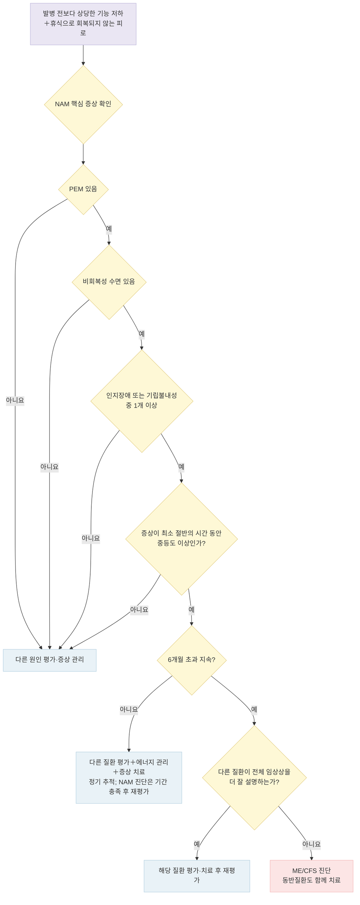

# 근육통성 뇌척수염/만성피로증후군 Myalgic Encephalomyelitis/Chronic Fatigue Syndrome (ME/CFS)

## <mark style="color:green;">일반 사항</mark>

* 근육통성 뇌척수염/만성피로증후군(myalgic encephalomyelitis/chronic fatigue syndrome, ME/CFS)은 여러 장기계통을 침범하고 일상 기능을 현저히 제한할 수 있는 만성 질환이다.
* 핵심 특징은 다음과 같다.
  * 발병 전과 비교한 직업·학업·사회·개인 활동 능력의 상당한 감소
  * 휴식으로 충분히 회복되지 않는 심한 피로
  * 경미한 신체적·인지적·정서적 활동 후에도 증상이 악화되는 활동 후 증상악화(post-exertional malaise, PEM)
  * 비회복성 수면
  * 인지장애 또는 기립불내성(orthostatic intolerance, OI)
* 전신성 활동불내성질환(systemic exertion intolerance disease, SEID)은 2015년 IOM(현 National Academy of Medicine, NAM)이 제안한 명칭이지만, 현재 표준 명칭으로 널리 정착된 것은 아니다.
* 어느 연령에서나 발생할 수 있으며 성인에서는 40\~60세에 흔하고 여성에서 더 많이 진단된다. 소아에서는 어린 소아보다 청소년에서 흔하다.
* 유병률은 적용한 진단기준과 조사방법에 따라 크게 달라진다. 국내 역학자료는 제한적이며 상당수 환자가 진단되지 않은 것으로 추정된다.
* 경과는 변동성이 크고 호전·관해·재발이 반복될 수 있다. 일부는 기능을 회복하지만 성인의 완전 회복률은 불확실하며, 호전 후에도 발병 전 기능으로 돌아가지 못하거나 활동을 제한해야 호전 상태가 유지되는 경우가 많다. 소아·청소년은 성인보다 부분 또는 완전 회복 가능성이 높은 것으로 알려져 있다.
* 일부 연구에서 자살 사망 위험 증가가 보고되었으나 사건 수가 적고 추정의 불확실성이 크다. 기능상실, 사회적 고립, 동반 우울증, 절망감이 있으면 자살사고를 적극적으로 평가한다.

## <mark style="color:green;">원인 및 위험 인자</mark>

* 확립된 단일 원인은 없다.
* 감염 후 발생하는 경우가 흔하며 면역·자율신경·신경내분비·에너지대사 이상 등이 연구되고 있으나, 임상 진단에 사용할 수 있는 단일 병태생리 표지자는 없다.
* Epstein–Barr virus, Coxiella burnetii(Q fever), Giardia, SARS-CoV-2 등 여러 감염 후 지속 증후군에서 ME/CFS와 유사하거나 진단기준을 충족하는 임상상이 발생할 수 있다. 특정 감염체 하나가 보편적 원인으로 확립된 것은 아니다.
* Long COVID(post-COVID-19 condition)와 ME/CFS는 피로, PEM, 인지장애, 수면장애 및 기립 증상 등 일부 임상 특징이 중첩된다. 그러나 SARS-CoV-2 감염 후 ME/CFS 또는 ME/CFS-유사질환의 발생 빈도는 코호트 구성, 비교군, 증례 정의 및 평가방법에 따라 다르게 보고되며, 공통 병태생리의 범위도 아직 확립되지 않았다. 두 질환은 임상적으로 상당 부분 겹치지만 **동일 질환으로 단정하지 않는다**. SARS-CoV-2 감염 후 특징적인 임상상이 지속되면 ME/CFS 진단기준 충족 여부를 별도로 평가한다.

### <mark style="color:orange;">위험 인자 및 관련 요인</mark>

* 여성
* 가족 내 집적 — 유전적 소인 또는 공통 환경요인의 가능성이 있으나 특정 유전자는 확립되지 않음
* 급성 감염 후 발병
* 일부 환자에서 수술, 외상, 고정(immobilization) 또는 심한 신체적·정서적 스트레스 후 발병 보고
* 병전 성격 특성이나 소아기 활동 양상을 독립적 원인 또는 확립된 위험인자로 보는 근거는 부족하다. 심리적 성향이 발병 원인이라는 인상을 줄 수 있으므로 상담·기록 시 이를 전제로 설명하지 않는다.

## <mark style="color:green;">임상 양상</mark>

### <mark style="color:orange;">핵심 증상</mark>

* **기능 저하와 피로**: 발병 전과 비교하여 직업·학업·사회·개인 활동 능력이 상당히 감소하고, 휴식으로 충분히 회복되지 않는 피로가 동반된다.
* **PEM**: 발병 전에는 견딜 수 있었던 경미한 신체적·인지적·정서적 활동 또는 감각 자극 후 기존 증상이 악화되거나 새로운 증상이 나타난다.
  * 흔히 활동 12\~48시간 뒤 지연되어 발생한다.
  * 피로뿐 아니라 인지장애, 통증, 수면장애, 두통, 기립 증상 등이 함께 악화될 수 있다.
  * 회복에 수일, 수주 또는 그 이상이 걸릴 수 있다.
  * 예: 학교 행사 참석, 장보기, 샤워 또는 긴 대화 후 수일간 집안일이나 기본적인 일상생활이 어려워짐
* **비회복성 수면**: 충분히 자도 개운하지 않고 피로가 회복되지 않는다. 불면, 과다수면, 수면주기 변화가 동반될 수 있다.
* **인지장애**: 처리속도 저하, 집중력·단기기억·단어회상 장애 등 이른바 brain fog. 활동, 시간 압박 또는 기립 자세에서 악화될 수 있다.
* **기립불내성**: 서 있거나 앉아 있는 자세에서 어지럼, 실신 전 느낌, 두근거림, 시야 흐림, 두통, 피로 또는 인지장애가 악화되고 누우면 호전된다.

### <mark style="color:orange;">기타 흔한 증상</mark>

* 근육통, 손상 없이 발생하는 관절통, 새로 발생하거나 양상이 변한 두통
* 인후통, 경부·액와 림프절 압통
* 오한, 야간발한, 열감
* 빛·소리·냄새·화학물질·음식·약물에 대한 과민
* 오심, 복통, 과민대장증후군과 유사한 증상
* 호흡곤란감, 불규칙하거나 빠른 맥박
* 객관적인 근력저하, 관절 종창·발적, 지속적인 발열은 ME/CFS로만 귀속하지 말고 다른 질환을 평가한다.

### <mark style="color:orange;">중증도</mark>

* **경증**: 이동과 자가관리는 가능하지만 발병 전 활동이 현저히 감소하고 여가·사회활동을 포기하는 경우가 많다.
* **중등도**: 일상생활이 제한되고 외출·근무·학업 유지가 어렵고 잦은 휴식이 필요하다.
* **중증**: 대부분 또는 항상 집에 머물며 기본적인 일상생활에도 도움이 필요하고 휠체어를 사용할 수 있다.
* **최중증**: 대부분 침상에 있고 자가관리가 거의 불가능하며 빛·소리·접촉에 극심하게 민감할 수 있다.

### <mark style="color:$danger;">🚩 Red Flags!</mark>

<mark style="color:$danger;">**즉각 조치 또는 의뢰**</mark> <mark style="color:$danger;">- 생명 위협 또는 즉각적 위해 가능성</mark>

* 흉통, 중증 호흡곤란, 청색증, 지속적 실신, 쇼크 또는 새로운 중증 부정맥
* 의식 변화, 급성 국소 신경학적 이상, 경련
* 자살 계획·의도, 위해수단 접근 또는 자신을 안전하게 유지할 수 없음 → 혼자 두지 말고 가능한 범위에서 위해수단 접근을 차단하며 119·112 또는 응급실로 연계
* 중증 탈수, 섭취 불가, 심한 영양실조 또는 빠르게 진행하는 전신상태 악화

<mark style="color:$warning;">**당일 또는 조기 의뢰**</mark>

* 지속적 발열, 야간발한, 설명되지 않는 체중감소 또는 진행하는 림프절비대
* 객관적으로 진행하는 근력저하, 관절 종창, 새로운 신경학적 이상
* 출혈, 중증 빈혈 의심, 새로 발생한 심한 두통 또는 시각 증상
* 반복 실신, 현저한 기립성 빈맥·저혈압, 탈수 또는 일상생활을 불가능하게 하는 기립 증상
* 구체적인 계획·의도가 확인되지 않은 자살사고, 중증 우울증 또는 급격한 정신상태 변화 → 당일 자살위험·안전성 평가 후 필요시 정신건강의학과 긴급 의뢰

<mark style="color:$info;">**외래 추적 / 추가 평가 계획**</mark> <mark style="color:$info;">- 즉각 위험 낮으나 호전 없으면 의뢰</mark>

* 진단 후 새로운 증상 또는 기존 양상과 다른 증상 발생
* 기능이 지속적으로 저하되거나 중증·최중증 상태가 지속됨
* 수면무호흡증, POTS, 내분비·자가면역·신경계 질환 등 동반질환 의심 → 해당 전문과 협진
* 기본적인 증상 관리에 반응하지 않거나 진단이 불확실함

***

## <mark style="color:green;">진단</mark>

* ME/CFS를 확진하는 단일 검사나 충분한 민감도·특이도를 가진 바이오마커는 없다.
* 진단은 핵심 증상과 기능 저하를 확인하고, 병력·진찰·정신건강 평가·표적검사를 통해 임상상을 더 잘 설명하는 다른 질환을 평가하는 방식으로 이루어진다.
* 검사 결과가 모두 정상이어야 하는 것은 아니다. 철결핍, 갑상샘질환, 수면장애, POTS, 우울증 등은 ME/CFS와 공존할 수 있으므로 각각 평가·치료하고 전체 임상상을 충분히 설명하는지 판단한다.
* PEM은 환자가 처음부터 인식하지 못하거나 지연되어 나타날 수 있다. 1\~2주간 활동과 활동 후 48시간 이상의 증상을 함께 기록하면 확인에 도움이 된다.

### <mark style="color:orange;">기본 평가</mark>

* 발병 전 기능과 현재 기능, 발병 시점·유발사건·증상 변동, 수면, 약물·건강기능식품, 음주·물질사용, 감염·여행·직업 노출 및 정신건강 병력
* 전신·심폐·신경·근골격계 진찰과 기립 혈압·맥박
* 환자별로 우선순위를 조정하되 다음 검사를 고려한다.
  * CBC with differential, ESR, CRP
  * 전해질, Ca, phosphate, 혈당 또는 HbA1c
  * 간기능, 신장기능, TSH/free T4
  * serum iron, transferrin saturation, ferritin
  * 소변검사, 셀리악병 선별검사
  * 병력과 식사 상태에 따라 vitamin B12, folate, vitamin D, CK

### <mark style="color:orange;">선택적 검사</mark>

* ANA, RF, cortisol, 감염 혈청검사·배양: 병력·노출·진찰 소견에서 해당 질환이 의심될 때
* 수면다원검사: 수면무호흡증, 주기성 사지운동, 기면증 등 의심 시
* 10분 능동기립검사 또는 NASA lean test: 기립불내성 의심 시 진료실에서 먼저 시행 가능한 선별 검사
* tilt-table test: 진료실 평가로 불충분하거나 POTS·신경매개성 저혈압 등의 정밀평가가 필요할 때
* MRI 등 신경영상: 국소 신경학적 이상이나 별도의 임상 적응증이 있을 때
* SPECT와 PET는 ME/CFS의 일상적 진단검사가 아니다.
* 임상적 의심 없이 광범위한 감염·자가면역검사를 시행하면 위양성과 불필요한 치료를 유발할 수 있다.
* 2-day cardiopulmonary exercise testing(2일 연속 CPET): 일부 소규모 연구에서 둘째 날 peak VO₂ 또는 ventilatory threshold 저하가 PEM의 객관적 지표로 제안되었으나, 2026년 발표된 대조군 연구를 포함해 결과가 일관되게 재현되지 않는다. 연구·장애평가 등 잠재적 이득이 위험보다 큰 제한된 상황에서 전문기관이 고려할 수 있는 도구이며, 상당한 증상 악화를 유발할 수 있어 **일상적인 임상 진단 목적으로는 권고하지 않는다**.

### <mark style="color:orange;">Chalder Fatigue Scale</mark>

* 피로의 심한 정도와 시간에 따른 변화를 평가하는 보조 도구이며 ME/CFS 진단검사 또는 회복 판정도구가 아니다. PEM, 기립불내성 및 전체 기능장애를 충분히 평가하지 못한다.
* 각 항목을 평소와 비교하여 좋음=0점, 비슷함=1점, 나쁨=2점, 훨씬 나쁨=3점으로 평가한다. Likert 총점은 0\~33점이다.
  1. 피로와 관련된 문제가 있습니까?
  2. 더 많은 휴식이 필요합니까?
  3. 졸음이나 나른함을 느낍니까?
  4. 기운이 없습니까?
  5. 일을 시작하기 어렵습니까?
  6. 근력이 떨어졌습니까?
  7. 약해졌다고 느낍니까?
  8. 집중하기 힘듭니까?
  9. 적당한 단어가 잘 떠오르지 않습니까?
  10. 말할 때 실수를 합니까?
  11. 기억력은 어떻습니까?
* PEM·기립불내성 등 핵심 임상 특징을 반영하는 DePaul Symptom Questionnaire(DSQ)는 연구에서 사용되지만, 국내 임상진료의 표준 평가도구로 확립되지 않았다.

### <mark style="color:orange;">NAM/IOM 2015 진단기준</mark>

1. 다음 세 가지가 모두 있어야 한다.
   1. 발병 전 수준의 직업·학업·사회·개인 활동 능력이 상당히 감소하거나 손상된 상태가 6개월을 초과하여 지속되고, 다음 특징의 피로가 동반됨
      * 새로 발생하거나 시작 시점이 명확함(not lifelong)
      * 지속적인 과도한 활동의 결과가 아님
      * 휴식으로 충분히 완화되지 않음
   2. PEM
   3. 비회복성 수면
2. 다음 중 한 가지 이상이 있어야 한다.
   1. 인지장애
   2. 기립불내성
3. PEM, 비회복성 수면 및 인지장애는 빈도와 중증도를 평가한다. 증상이 최소 절반의 시간 동안 중등도 이상의 강도로 나타나지 않으면 진단을 재고한다.

### <mark style="color:orange;">NAM/IOM과 NICE 진단기준의 차이</mark>

<table><thead><tr><th width="140">기준</th><th width="120">증상 지속기간</th><th>필수 증상 구성</th></tr></thead><tbody><tr><td>NAM/IOM 2015</td><td>6개월 초과</td><td>기능저하＋피로, PEM, 비회복성 수면＋인지장애 또는 기립불내성 중 1개 이상</td></tr><tr><td>NICE NG206</td><td>3개월</td><td>쇠약성 피로, PEM, 비회복성 수면/수면장애, 인지장애가 모두 지속(기립불내성은 흔한 동반 증상이나 필수항목은 아님)</td></tr></tbody></table>

* NICE는 특징적 증상이 성인에서 6주, 소아·청소년에서 4주 이상 지속되면 ME/CFS를 의심하고, 3개월간 지속되며 다른 질환으로 설명되지 않으면 진단할 수 있도록 권고한다.
* 두 기준은 기간뿐 아니라 증상 구성도 다르므로 기간만 혼합하여 적용하지 않는다. 이 챕터의 진단 알고리듬은 NAM/IOM 2015 기준을 따른다.
* NAM의 6개월을 기다리는 동안에도 다른 질환을 평가하고 PEM을 악화시키지 않는 에너지 관리와 증상 치료를 시작한다.

### <mark style="color:orange;">감별 및 동반질환</mark>

* 수면무호흡증, 불면증, 하지불안증후군, 기면증, 교대근무·수면부족 (☞ [불면증](029_-insomnia-sleep-disorder.md), [하지불안증후군](036_-restless-legs-syndrome.md))
* 주요우울장애, 양극성장애, 불안장애, 섭식장애, 알코올·물질사용장애
* 약물 부작용·금단, 건강기능식품·생약·한약, 직업성 독성물질 노출
* 빈혈, 철결핍, vitamin B12·folate 결핍, 영양실조, 셀리악병
* 갑상샘·부갑상샘·부신·뇌하수체 질환, 당뇨병, 임신, 전해질 이상
* 만성 간염, 결핵, HIV, 감염성 심내막염 및 노출에 따른 기타 감염
* SLE, 류마티스관절염, 염증성 근육병, 중증근무력증, 다발경화증, 사르코이드증
* 섬유근육통, 과민대장증후군, 편두통, Ehlers–Danlos syndrome/hypermobility spectrum disorder
* POTS, 기립성 저혈압, 신경매개성 저혈압, 부정맥·심부전 등 심혈관질환
* Mast cell activation syndrome(MCAS) — 선택적 동반질환 평가 항목이다. 비특이적인 홍조·두드러기·위장관·기립 증상의 조합만으로 진단하지 않는다. 국제 합의기준은 ①두 장기계통 이상을 침범하는 반복적·급성 전신 mast-cell mediator 증상, ②발작 시 혈청 tryptase가 `기저치×1.2＋2 ng/mL`를 초과하는 객관적 증거, ③mast-cell mediator 표적치료에 대한 임상 반응을 모두 요구한다. 의심되면 알레르기 전문의 평가를 고려한다.
* 만성콩팥병, COPD 등 만성 폐질환, 악성종양
* Long COVID와 기타 감염 후 지속 증후군
* 우울증, 비만 또는 다른 동반질환이 있다는 이유만으로 ME/CFS를 자동 배제하지 않는다. 치료되지 않은 질환이 전체 임상상을 더 잘 설명하면 이를 우선 평가·치료하고, 치료 후에도 ME/CFS의 핵심 임상상이 지속되는지 재평가한다.

***



<p align="center"><strong>ME/CFS 진단 알고리듬(NAM/IOM 2015 기준)</strong></p>

<p align="center"><em><mark style="color:$info;">Ref. National Academy of Medicine. Beyond Myalgic Encephalomyelitis/Chronic Fatigue Syndrome: Redefining an Illness. 2015.</mark></em></p>

***

## <mark style="background-color:$warning;">Management</mark>

### <mark style="color:orange;">치료 방침</mark>

* 완치시키거나 질병 경과를 일관되게 변화시키는 승인 치료제는 없다.
* 목표는 PEM 예방, 가장 불편한 증상과 동반질환의 치료, 기능 및 삶의 질 유지, 환자가 중요하게 여기는 활동의 보존이다.
* 환자와 함께 가장 파괴적인 증상의 우선순위를 정하고 치료의 잠재적 이득과 위해를 설명한다.
* 약물과 비약물 치료 모두 개인차가 크므로 한 번에 한 가지씩, 낮은 강도·낮은 용량에서 시작하여 반응을 평가한다.
* 정기적으로 새로운 질환, 기능 변화, 약물 부작용, 우울증·자살위험 및 돌봄 필요를 재평가한다.


**⚠️ 고정된 일정에 따른 활동·운동량 증량(GET) 관련 안전 경고**\
NICE NG206(2021)은 효과 근거의 확실성이 낮고 환자가 보고한 위해 사례가 있어, 고정된 일정에 따라 활동·운동량을 증가시키는 방식의 치료(graded exercise therapy, GET)를 권고하지 않는다. PEM이 있는 환자에게 일률적인 운동 증량 프로그램을 처방하지 않는다. 증상을 악화시키지 않는 범위에서만 활동을 개별적으로 조정하며, **증상이 악화되면 즉시 이전 수준으로 되돌리거나 중단한다.**


***

## <mark style="color:green;">비-약물 관리</mark>

### <mark style="color:orange;">에너지 관리(pacing)</mark>

* 초기 핵심 관리 전략이다(NICE energy management, CDC activity management/pacing). 신체·인지·정서·사회적 활동과 감각 자극을 모두 에너지 소비로 고려한다.
* 현재 증상을 악화시키지 않는 개인별 한계(energy envelope)를 파악하고 활동과 휴식을 계획한다.
* 활동·증상 일지로 당일 반응뿐 아니라 12\~48시간 이후의 PEM을 확인한다.
* 큰 활동을 작은 단계로 나누고 활동 전후에 휴식을 배치한다. 샤워 의자, 이동보조기구, 작업환경 조정 등을 활용할 수 있다.
* 좋은 날에 활동을 몰아서 한 뒤 악화되는 push-and-crash 주기를 피한다.
* 활동량을 고정된 일정에 따라 자동으로 늘리지 않는다. 안정된 기간이 지속되고 환자가 원할 때만 증상을 면밀히 관찰하며 소폭 조정하고, 악화되면 즉시 줄인다.
* 일반인을 위한 운동 프로그램이나 운동을 완치법으로 제시하지 않는다. 운동·재활이 필요하면 ME/CFS와 PEM을 이해하는 전문가가 개별화하여 시행한다.
* 웨어러블 심박모니터는 활동과 증상의 관계를 파악하는 보조수단으로 선택적으로 사용할 수 있다. 다만 실제 CPET로 측정하지 않은 개인의 anaerobic/ventilatory threshold를 소비자용 기기나 연령 공식으로 정확히 추정할 수 있다는 근거는 부족하며, 특정 심박수 이하를 유지하면 PEM을 예방할 수 있다고 보장하지 않는다. 심박수뿐 아니라 주관적 증상과 12\~48시간 뒤의 반응을 함께 기록한다.

### <mark style="color:orange;">수면</mark>

* 일정한 수면·기상 시간을 가능한 범위에서 유지하고 빛·소음·카페인·알코올 등 수면 방해요인을 조정한다.
* 낮잠은 야간 수면을 방해하지 않는 범위에서 개별화한다. 중증 환자에게 일률적으로 30분 이내를 요구하지 않는다.
* 코골이·무호흡, 하지불안, 주기성 사지운동, 기면증 등 원발성 수면장애를 평가·치료한다.
* 수면시간이 충분해져도 비회복성 수면은 지속될 수 있음을 설명한다.

### <mark style="color:orange;">식사와 영양</mark>

* 규칙적이고 균형 잡힌 식사를 권고한다. 특정 제한식이나 보충제가 ME/CFS를 치료한다는 근거는 없다.
* 오심·조기포만·기립 증상으로 섭취가 어려우면 소량씩 자주 섭취하고 필요시 항구토제, 경구수분보충 또는 영양상담을 고려한다.
* 체중감소, 연하·저작 곤란, 섭취 제한 또는 중증·최중증 환자에서는 영양실조와 재급식 위험을 평가하고 영양사·전문가에게 의뢰한다.
* 확인된 결핍만 적절히 보충한다. 불균형 식사가 지속되는 경우 일반적인 권장량 범위의 종합비타민을 고려할 수 있다.

### <mark style="color:orange;">기립불내성</mark>

* 고온 환경, 뜨거운 샤워, 장시간 기립, 탈수 및 과식을 피하고 자세대항동작, 복부·하지 압박복 등을 고려한다.
* 고혈압·심부전·신부전 등 금기가 없고 섭취가 부족한 경우 수분과 염분 증량을 고려한다.
* POTS, 기립성 저혈압, 신경매개성 저혈압 등 표현형을 평가하고 비약물 치료에 반응하지 않으면 심장내과·신경과 등과 협진하여 약물치료를 고려한다.

### <mark style="color:orange;">CBT 및 심리사회적 지원</mark>

* CBT는 ME/CFS의 원인을 교정하거나 완치하는 치료가 아니다(NICE NG206, 2021).
* 환자가 원할 때 만성질환 적응, 스트레스·불안·우울·수면 문제 및 활동 조절을 돕는 지지적 치료로 제공할 수 있다.
* 질병이 잘못된 믿음이나 활동 회피 때문에 지속된다는 전제를 사용하지 않는다.
* 직장·학교의 유연한 일정, 재택근무·수업, 휴식 공간, 학업·업무량 조정 등 합리적 편의를 지원한다.
* 소아·청소년 환자는 학업 중단 위험이 특히 크므로 등교 시간 유연화, 출석 일수 감면, 체육 수업 면제 등 학교와의 공식적인 학업 편의 조정(school accommodation)을 조기에 논의한다.

### <mark style="color:orange;">중증·최중증 환자</mark>

* 방문진료 또는 원격진료, 짧고 유연한 진료 일정, 보호자·돌봄자와의 협업을 고려한다. 국내에서는 방문진료·원격진료 모두 수가·대상자 기준 등 제도적 제약이 있으므로, 가능한 범위에서 지역사회 자원 및 돌봄체계와 연계한다.
* 빛·소리·냄새·접촉 등 감각 자극을 최소화하고 의사소통 방법과 검사 우선순위를 환자와 조정한다.
* 탈수·영양실조, 욕창, 구축, 혈전 위험, 배뇨·배변 문제 및 약물 부작용을 평가한다.

## <mark style="color:green;">약물 치료</mark>

* ME/CFS 자체를 치료하는 승인 약제는 없으며 약물은 명확한 증상 또는 동반질환을 대상으로 사용한다.
* 중추신경계 작용 약물을 포함하여 약물 민감성이 흔하므로 가능한 경우 통상 용량보다 낮게 시작하여 천천히 증량한다(start low, go slow).
* 한 번에 한 약제를 시작하고 효과·PEM·진정·인지기능·기립 증상에 미치는 영향을 확인한다.

### <mark style="color:orange;">통증</mark>

* acetaminophen <mark style="color:blue;">\[타이레놀]</mark> 또는 NSAID(예: ibuprofen <mark style="color:blue;">\[부루펜]</mark>)를 단기간 필요시 사용할 수 있다. 간·신장질환, 소화성궤양, 항응고제, 임신 등 일반적 금기와 최대 일일용량을 확인한다.
* 두통이 잦으면 약물과용두통을 평가한다.
* 신경병성 통증이나 섬유근육통이 동반되면 해당 질환의 치료 원칙에 따르되 진정과 기립성 저혈압에 주의한다.

### <mark style="color:orange;">우울증·불안장애</mark>

* 항우울제는 동반 우울증·불안장애 또는 특정 통증·수면 적응증에 사용하며 ME/CFS 자체의 피로 치료제로 사용하지 않는다.
* SSRI와 TCA의 일상적 병용은 피한다. 특히 fluoxetine <mark style="color:blue;">\[푸로작]</mark>은 CYP2D6 억제로 nortriptyline 등 TCA 농도를 높일 수 있다.
* 자살위험, 조증 병력, QT 연장 위험, 약물상호작용, 진정 및 기립성 저혈압을 평가한다.

### <mark style="color:orange;">수면제</mark>

* 수면위생과 원발성 수면장애 치료 후에도 불면이 지속될 때 최소 유효용량으로 최단기간 사용한다.
* trazodone <mark style="color:blue;">\[트리티코]</mark>, 저용량 doxepin <mark style="color:blue;">\[사일레노]</mark> 또는 hydroxyzine(국내 유통 여부는 시점에 따라 달라질 수 있으므로 처방 시점의 최신 허가·유통 현황을 확인한다)은 불면의 양상과 동반질환에 따라 제한적으로 고려할 수 있으나, 다음 날 진정, 항콜린 부작용, QT 연장 및 기립 증상 악화에 주의한다.
* 수면제가 수면시간을 늘리더라도 비회복성 수면이나 ME/CFS 자체를 치료하지는 않는다.

### <mark style="color:orange;">기립불내성 약물</mark>

* 비약물 치료에 반응하지 않고 저혈량 또는 저혈압 표현형이 확인된 기립불내성에서 전문가와 협의하여 fludrocortisone <mark style="color:blue;">\[플로리네프]</mark>을 선택적으로 고려할 수 있다. 약리학적으로 이러한 표현형에 적합하지만 POTS 전반에 대한 임상시험 근거는 제한적이며, 빈맥이 두드러진 hyperadrenergic POTS 등 모든 기립 증상에 일률적으로 사용하지 않는다.

  ✽fludrocortisone의 국내 허가 적응증은 부신피질부전·염손실성 부신성기증후군이며, 기립불내성에 대한 사용은 허가 외(off-label)이다. 시작 전 고혈압, 심부전, 신기능 저하, 부종 및 저칼륨혈증 위험을 확인하고, 투여 중 앙와위·기립 혈압, 체중·부종 및 혈청 Na·K를 모니터링한다.

* midodrine(2.5\~10 ㎎, 1일 2\~3회, 말초 α1 수용체 작용제)과 pyridostigmine(30\~60 ㎎, 1일 2\~3회, acetylcholinesterase 억제제)은 POTS 무작위 대조시험 근거가 fludrocortisone과 비슷하거나 더 확립되어 있어 함께 고려할 수 있는 대안이다. Midodrine은 저혈량·저혈압 표현형에, pyridostigmine은 자율신경 콜린성 전달 강화가 필요한 경우에 적합하나, 두 약물 모두 hyperadrenergic POTS를 악화시킬 수 있어 빈맥·교감신경 항진이 두드러진 표현형에는 신중히 사용한다.
  ✽Midodrine 사용 시 앙와위 고혈압(취침 4시간 전 이후 복용 금지), 고령 남성의 요저류 위험을 확인한다. Pyridostigmine은 복부 경련, 설사, 기관지경련(천식 환자 주의) 등 콜린성 부작용을 모니터링한다.
* 빈맥이 두드러진 표현형(hyperadrenergic POTS 등)에서는 저용량 propranolol 등 beta-blocker를 우선 고려할 수 있다. 서맥, 저혈압, 천식·기관지경련성 질환에서는 주의하거나 회피한다.

### <mark style="color:orange;">연구 단계 또는 권고되지 않는 치료</mark>

* **Agomelatine**: ME/CFS 피로 개선 근거는 소규모 예비연구 수준이다. 국내 ME/CFS 적응증으로 승인된 표준 치료가 아니며 사용 시 간기능 모니터링이 필요하다.
* **Rintatolimod(Ampligen)**: 미국 FDA가 여러 차례 승인을 거부하여 정식 승인을 받지 못했고, 국내 표준 치료로 사용할 수 없는 연구 단계 치료이다.
* **저용량 날트렉손(Low-Dose Naltrexone, LDN)**: ME/CFS 및 Long COVID의 신경염증·통증·피로 조절 목적으로 오프라벨 사용이 논의되고 있다(주로 1\~4.5 ㎎/day). 소규모 관찰연구·예비 RCT에서 피로·통증에 대한 개선이 보고되었으나 대규모 RCT 근거는 아직 없으며, 국내 ME/CFS 적응증으로 승인된 치료는 아니다.
* 항생제·항바이러스제, 면역글로불린, nystatin, 저용량 hydrocortisone, anakinra, clonidine, modafinil, vitamin B12·Mg 및 각종 보충제는 결핍이나 별도의 적응증 없이 ME/CFS 치료 목적으로 일률적으로 사용하지 않는다.
* 장기 또는 반복적인 glucocorticoid 사용은 부신억제 등 위해가 있으므로 피한다.

***

### <mark style="color:red;">질병코드</mark>

G93.3 바이러스후피로증후군 — 확립된 ME/CFS에 적용; KCD 포함 용어에 양성 근통성 뇌척수염이 제시됨 (ICD-11: 8E49 Postviral fatigue syndrome — chronic fatigue syndrome, myalgic encephalomyelitis를 포함 용어로 명시)

R53 병감 및 피로 — 원인 평가 중이거나 ME/CFS 진단기준을 충족하지 않는 피로 증상

✽F45.8, F48은 ME/CFS의 대체 코드로 사용하지 않는다. 별도의 정신질환이 진단된 경우에만 해당 정신질환 코드를 추가한다.

✽2026년 1월 1일부터 KCD 9차 개정판이 시행 중이다. 처방 시점의 최신 고시 코드를 확인한다.

***

## <mark style="color:purple;">처방례</mark>

아래 처방은 ME/CFS 자체의 치료가 아니라 동반 증상에 대한 예시이다. 환자별 금기·간신기능·병용약물·약물 민감성을 확인하고, 한 번에 한 약제를 낮은 용량으로 시작한다. 상품명은 국내 유통 예시이며 처방 시점의 최신 허가사항·급여기준을 확인한다.

> **처방례 1. 간헐적 근골격계 통증**
>
> ```
> 타이레놀정 500 ㎎ 1T 필요시, 6\~8시간 간격
> ```
>
> _✽만성적으로 복용할 때는 원칙적으로 총 3,000 ㎎/day를 넘지 않도록 하고 간질환·과음 환자에서는 더 낮은 한도를 적용한다. 복합감기약 등 acetaminophen 중복 성분을 확인한다._

또는

> **처방례 1-2. 간헐적 근골격계 통증(NSAID)**
>
> ```
> 부루펜정 200 ㎎ 1\~2T 필요시, 6\~8시간 간격, 식후
> ```
>
> _✽자가복용 기준 최대 1,200 ㎎/day. 소화성궤양, 신장질환, 심부전, 항응고제 사용 및 임신 등에서는 피하거나 별도 평가한다._

> **처방례 2. 동반 불면**
>
> ```
> 트리티코정 25 ㎎ ½\~1T 취침 시
> ```
>
> _✽다음 날 졸림, 어지럼, 기립성 저혈압에 주의한다. 다른 진정제·음주와의 병용을 피하고 저용량에서 반응을 평가한다._

> **처방례 3. 동반 주요우울장애**
>
> ```
> 폭세틴캡슐 10 ㎎ 1C 아침
> ```
>
> _✽ME/CFS 피로가 아니라 확인된 주요우울장애에 대한 저용량 시작 예시이다. 반응과 내약성을 확인하여 조절한다. 초기 불안·불면, 조증 전환 및 자살위험을 관찰하고, nortriptyline 등 TCA와 임의로 병용하지 않는다._

> **처방례 4. 저혈량·저혈압 표현형의 기립불내성**
>
> ```
> 플로리네프정 0.1 ㎎ ½T 아침
> ```
>
> _✽비약물 치료(수분·염분, 압박복, 자세대항동작)에 반응하지 않고 저혈량 또는 저혈압 표현형이 확인된 경우에 한해 전문가와 협의하여 시작한다. 허가 외 사용에 해당한다. 고혈압·심부전·신기능 저하·부종·저칼륨혈증 위험을 확인하고 앙와위 및 기립 혈압, 체중·부종, 혈청 Na·K를 정기적으로 모니터링한다._

> **처방례 5. 빈맥이 두드러진 기립불내성(hyperadrenergic POTS 등)**
>
> ```
> 인데놀정 10 ㎎ 1T bid
> ```
>
> _✽저용량 propranolol로 시작하며 서맥·저혈압·기관지경련(천식력 확인) 여부를 관찰한다. Fludrocortisone·midodrine보다 빈맥 우세 표현형에 우선 고려할 수 있으나 근거는 여전히 소규모 RCT 수준이다._

***

### <mark style="color:$success;">핵심 복약 지도</mark>

> **활동량 증량이 아니라 pacing이 원칙입니다**
>
> * 고정된 일정에 따라 운동·활동량을 매주 자동으로 늘리는 방식(GET)은 권고하지 않는다. PEM 여부를 확인하며 개별화된 속도로만 조정하고, 악화되면 즉시 이전 수준으로 되돌리거나 중단한다.
> * 안정된 기간이 지속될 때만 환자와 상의하여 소폭 조정한다.

> **약물은 낮은 용량에서 시작합니다**
>
> * ME/CFS 환자는 중추신경계 작용 약물에 대한 민감성이 흔하다. 통상 용량보다 낮은 용량에서 시작하고 천천히 증량한다.
> * 한 번에 한 약제만 시작하고 진정, 기립 증상 악화, PEM 유발 여부를 확인한 뒤 다음 단계를 결정한다.

> **SSRI와 TCA 병용은 원칙적으로 피합니다**
>
> * fluoxetine 등 CYP2D6 억제 SSRI는 nortriptyline 등 TCA의 혈중농도를 높여 세로토닌 독성, 진정, 기립성 저혈압 위험을 높일 수 있다. 명확한 적응증 없이 병용하지 않는다.

> **언제 다시 병원을 방문해야 하나요?**
>
> * 새로운 흉통, 실신, 국소 신경학적 이상 또는 급성 의식 변화 — 즉시 응급 평가
> * 지속적 발열, 설명되지 않는 체중감소, 진행하는 림프절비대 또는 근력저하
> * 자살 계획·의도, 위해수단 접근 또는 스스로 안전을 유지하기 어려움 — 혼자 두지 말고 119·112 또는 응급실로 즉시 연계
> * 구체적인 계획이 확인되지 않은 자살사고 또는 급격한 정신상태 변화 — 당일 자살위험·안전성 평가
> * 새로 시작한 약물 이후 심한 진정, 기립성 저혈압 또는 증상(특히 PEM)의 뚜렷한 악화

***

### <mark style="color:blue;">환자 안내서</mark>


**ME/CFS, 의지나 게으름의 문제가 아닙니다**

근육통성 뇌척수염/만성피로증후군(ME/CFS)은 몸의 여러 기능에 영향을 주는 만성 질환입니다. 핵심은 활동 후 며칠씩 증상이 심해지는 "활동 후 증상악화(PEM)"이며, 이는 의지로 극복할 수 있는 단순한 피로와 다릅니다.


#### <mark style="color:$primary;">왜 활동 후에 더 심해지나요?</mark>

* 발병 전에는 아무렇지 않던 정도의 활동(장보기, 샤워, 긴 대화, 화면 사용 등)도 몸에 부담이 될 수 있습니다.
* 그 부담은 바로 나타나지 않고 흔히 12\~48시간 뒤에 피로, 통증, 집중력 저하, 어지럼 등으로 나타나며 수일에서 수주간 지속될 수 있습니다. 이를 PEM이라고 합니다.

#### <mark style="color:$primary;">일상생활에서 어떻게 관리하나요?</mark>

* **좋은 날에 밀린 일을 한꺼번에 하지 마십시오.** 1\~2일 뒤 심하게 악화될 수 있습니다(push-and-crash).
* **활동을 작은 단위로 나누고, 증상이 나타나기 전에 미리 쉬십시오.** 힘들어질 때까지 기다리지 않는 것이 핵심입니다.
* **활동량을 매일 정해진 비율로 늘리지 마십시오.** 상태가 안정적으로 유지될 때 의료진과 상의하여 아주 조금씩만 조정하고, 악화되면 즉시 이전 수준으로 되돌리거나 중단하십시오. 🛏️
* **활동과 증상을 기록할 때는 당일뿐 아니라 이후 48시간의 변화까지 함께 적으십시오.** 무엇이 증상을 악화시키는지 파악하는 데 도움이 됩니다.
* 서 있을 때 어지럽거나 심장이 두근거리면 다리를 꼬거나 쪼그려 앉는 등 자세대항동작을 시도하고, 뜨거운 샤워나 장시간 기립은 피하십시오.

#### <mark style="color:$primary;">약은 어떻게 써야 하나요?</mark>

* 새로운 약은 낮은 용량부터 천천히 시작합니다. 평소보다 약에 민감하게 반응할 수 있습니다.
* 심한 졸림, 어지럼, 두근거림 또는 증상(특히 PEM)의 악화가 생기면 의료진과 상의하십시오.
* 고정된 일정에 따라 운동량을 계속 늘리는 방식(GET)은 권고하지 않습니다. 증상을 악화시키지 않는 범위의 개별화된 활동은 관절가동성·근력과 일상 기능을 가능한 수준에서 유지하기 위한 보조수단이며, ME/CFS의 완치법이 아닙니다.
* 상담(CBT)은 ME/CFS의 원인을 교정하거나 완치하는 치료가 아니라, 만성질환 적응과 스트레스·불안·수면 문제를 관리하도록 돕는 선택적 보조수단입니다.

#### <mark style="color:$primary;">이럴 때는 즉시 병원을 방문하세요</mark>

* 새로운 흉통, 실신, 마비나 감각 이상 같은 신경학적 증상
* 지속적인 발열, 설명되지 않는 체중감소
* 구체적인 자살 계획·의도가 있거나 스스로 안전을 지키기 어려울 때 — 혼자 있지 말고 즉시 119·112 또는 가까운 응급실에 도움을 요청하십시오.
* 구체적인 계획은 없지만 자살사고가 들 때 — 당일 의료진에게 알리고 자살예방상담전화 ☎ 109를 이용하십시오.
* 기존 ME/CFS 증상으로 여기고 넘기지 말고 즉시 진료를 받으십시오.

## 주요 참고문헌

1. National Academies of Sciences, Engineering, and Medicine. *Beyond Myalgic Encephalomyelitis/Chronic Fatigue Syndrome: Redefining an Illness*. 2015.
2. Centers for Disease Control and Prevention. IOM 2015 Diagnostic Criteria; Diagnosing ME/CFS; Evaluation of ME/CFS; Clinical Care and Treatment. Updated 2024\~2026.
3. National Institute for Health and Care Excellence. *Myalgic encephalomyelitis (or encephalopathy)/chronic fatigue syndrome: diagnosis and management*. NICE guideline NG206. 2021.
4. Roberts E, et al. Mortality of people with chronic fatigue syndrome: a retrospective cohort study in England and Wales from the South London and Maudsley NHS Foundation Trust Biomedical Research Centre Clinical Record Interactive Search register. *Lancet*. 2016;387:1638-1643.
5. Vernon SD, Zheng T, Do H, et al. Incidence and prevalence of post-COVID-19 myalgic encephalomyelitis: a report from the observational RECOVER-Adult study. *J Gen Intern Med*. 2025;40:1085-1094.
6. Unger ER, et al. Myalgic encephalomyelitis/chronic fatigue syndrome after SARS-CoV-2 infection. *JAMA Netw Open*. 2024;7:e2423555.
7. Mancini DM, et al. Cardiopulmonary exercise test results do not change over two sequential days in patients with chronic fatigue syndrome. *Front Physiol*. 2026;17:1816082.
8. Jason LA, Sunnquist M. The development of the DePaul Symptom Questionnaire: original, expanded, brief, and pediatric versions. *Front Pediatr*. 2018;6:330.
9. Valent P, Akin C, Bonadonna P, et al. Proposed diagnostic algorithm for patients with suspected mast cell activation syndrome. *J Allergy Clin Immunol Pract*. 2019;7:1125-1133.e1.
10. Clague-Baker N, Davenport TE, Wickens B, et al. Pacing with a heart rate monitor for people with myalgic encephalomyelitis/chronic fatigue syndrome and long COVID: a feasibility study. *Fatigue: Biomedicine, Health & Behavior*. 2025 (online); 14:74-96.
11. 국가데이터처. 제9차 한국표준질병·사인분류 개정고시. 2025; 2026년 1월 1일 시행.
12. World Health Organization. ICD-11 for Mortality and Morbidity Statistics. 8E49 Postviral fatigue syndrome.
13. Kwok CS, et al. The evidence for treatments for postural orthostatic tachycardia syndrome: a systematic review of randomized trials. *Trends Cardiovasc Med*. 2025.
14. Polo O, Pesonen P, Tuominen E. Low-dose naltrexone in the treatment of myalgic encephalomyelitis/chronic fatigue syndrome (ME/CFS). *Fatigue: Biomedicine, Health & Behavior*. 2019;7:207-217.
