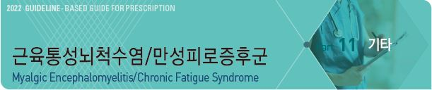
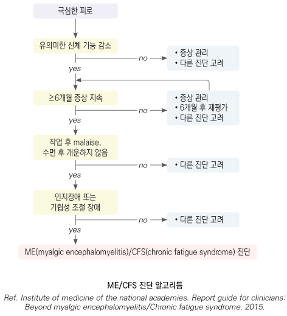
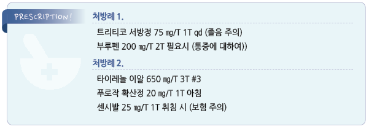

# 근육통성뇌척수염/만성피로증후군



## 일반 사항

*   동의어 : 근육통성뇌척수염(myalgic encephalomyelitis, ME),

    전신성활동불내성질환(systemic exertion intolerance disease, SEID)
*   ≥6개월 지속되는, 다른 의학적 질환으로 설명할 수 없는, 이전에는 어렵지 않거나 문제가 되지 않았던 신체 또는

    정신적 활동에 의해서도 악화되며 휴식으로 회복되지 않는 심한 피로를 특징으로 하는

    복합적 장애(complex, chronic, debilitating disease)
* 호발 : 40\~60세, 여성(남성의 2배)
* 유병률 : 0.3\~2.5%(미국); 진단 받지 않은 환자가 많아 실제 유병률은 더 높을 것으로 추정
* 예후 : 20~~60%가 1년 내 완화, ＞⅓이 2~~4년 이상 지속; 일반 인구의 6배의 자살률이 보고됨

## 원인

* 불명
* 추정 원인 : 감염, 면역 이상, 내분비/대사 이상, 뇌의 기질적 변화, 장내 미생물 불균형

### 위험 인자

* 가족력
* 과민 또는 내향적 성격
* 소아기의 비활동 또는 과잉 행동, 지속된 질병 상태, 정서적/신체적 외상
* 감염 : mononucleosis, Coxiella burnetii , herpes zoster, Q fever, Giardia lamblia
* 동반 질환 : 비만, 인슐린 저항성, 대사증후군, 우울증, 불안증, 섬유근육통, 과민대장증후군, 수면 장애, 폐쇄수면무호흡증

## 임상 양상

*   흔한 증상(환자의 ＞⅔에서 출현) : 쉽게 피로/심한 피로(post-exertional malaise(PEM)), 정신적 문제(집중력 장애,

    인지 장애, 우울, 불안, 수면 장애), 통증(두통, 인후통, 경부/액와 림프절 압통, 근육통, 관절통, 열감, 근육 약화), 호흡 곤란,

    불규칙 맥박, orthostatic intolerance

    •PEM의 예: 자녀의 학교 행사 참관 후 며칠 동안 집에서 쉬어야 하며 세탁같은 필요한 일을 할 수 없음.

    쇼핑 후 귀가를 위해 운전하기 전에 잠을 자며 쉬어야 하거나 다른 사람의 도움이 필요함.

    샤워 후에 며칠 동안 아무것도 할 수 없음

    •수면 문제 예: 밤새 푹 잠을 자고 나서도 기분이 나아지거나 피로가 풀리지 않음, 잠에서 깨어날 수가 없음

    •사고/기억력 문제 예: “아무 것도 생각할 수 없다. 머릿속이 안개에 갇힌 것 같다.”

    •자세 문제 예: 앉아 있거나 서 있으면 시야가 흐려지고 어지럽고 쓰러질 것 같거나 실신
* 비교적 흔한 증상(환자의 ＞⅓에서 나타나는 증상) : 알레르기 증상, 복통

#### Chalder Fatigue Scale

* 의의 : 증상의 심한 정도 및 회복 정도 평가에 활용
*   아래 각 항에 대하여 다음의 점수를 배점

    평소에 비해 좋음=0점, 비슷=1점, 평소보다 못함=2점, 평소에 비해 훨씬 못함=3점

    ① 피로와 관련된 문제가 있습니까?

    ② 더 많은 휴식이 필요합니까?

    ③ 졸음이나 나른함을 느낍니까?

    ④ 기운(기력, 에너지)이 없습니까?

    ⑤ 일을 시작하기 어렵습니까?

    ⑥ 근력이 떨어졌습니까?

    ⑦ 약해졌다고 느낍니까?

    ⑧ 집중하기 힘듭니까?

    ⑨ 적당한 단어가 잘 떠오르지 않습니까?

    ⑩ 말할 때 실수를 합니까?

    ⑪ 기억력은 어떻습니까?

## 진단

### 검사

* ME/CFS을 진단하는 검사법은 없음. 다른 질환 배제를 위해 시행; 검사에서 정상이어야 CFS 고려
* CBC, ESR, 전해질(인, Ca 포함), Fe, 혈당, LFT, RFT, TSH/free T4, U/A

#### 선택적 검사

* ANA, CRP, RF, cortisol, globulin
* CMV, EBV, Bartonella , Babesia , E hrlichia , Anaplasma , HIV, Tb skin test
* MRI, SPECT, PET
* Tilt table testing

### ME/CFS 진단 criteria \[NAM/IOM]

1. 다음 3가지 증상이 있음

① ≥6개월 지속되고, 피로(종종 중증)를 동반하고, 새로이 또는 명확한 시점에 시작되었고(not lifelong),

```
지속해 온 과도한 활동에 의한 것이 아니며, 휴식에 의해 충분히 완화되지 않는 직장, 학교, 사회, 또는

개인적인 활동에 있어서 능력의 상당한 감소 또는 장애가 있음
```

② post-exertional malaise(PEM)\*

③ 수면으로 피로가 풀리지 않음(unrefreshing sleep)\*

2. 또한 다음 중 ≥1개 해당

① 인지 장애\*

② 기립성 조절 장애(orthostatic intolerance)

> ```
> *증상의 빈도와 중증도를 평가해야 함. 이러한 증상이 최소한 절반의 시간 동안 보통 이상의 강도로 나타나지 않는 경우에는
> ```

> ```
> ME/CFS 진단은 재고되어야 함
> ```

### 배제 기준

* 치료되지 않은 갑상선저하증, 수면무호흡증, 약물 부작용, 기타 치료되지 않은 질환(B형/C형간염, 악성 종양)
* 다음 병력 : 주요우울증, 양극정동장애, 조현병, 망상장애, 치매, 신경성식욕부진, 신경성폭식증
* 알코올/약물 남용의 회복 후 ＜2년
* 중증 비만(BMI ≥40)

### 감별 질환

* 수면장애, 우울증, 불안증, 알코올 남용, 약물, 독성 물질(예: 생약/한약, 직업적 노출)
* 감염 : 만성 간염, 결핵, 진균/기생충 감염, 아급성 세균성 심내막염, 단핵구증, HIV, 라임병
* SLE, myasthenia gravis, 갑상선염, 류마티스 질환, 섬유근육통, 다발경화증, sarcoidosis
* 갑상선/부갑상선/부신/뇌하수체 질환, 쿠싱병, 당뇨병, 임신, 저혈당
* 만성콩팥병, COPD, 심혈관 질환, 간질환, 빈혈, 전해질 이상, 악성 종양
*   불충분한 휴식/수면/영양 섭취(비타민 부족)

    

***

## Management

### 치료 방침

* 치료 목적 : 증상 완화
* 환자 및 가족 교육 : 질병에 대하여 이해시킴; 특출환 치료 방법은 없으나 치명적이지 않으며 대부분 점차 호전됨
* 비-약물 치료 : 인지행동 요법, 물리 치료, 마사지, 이완 요법, 운동
* 약물 치료 : 인정된 치료제, 정립된 요법은 없음; 항우울제, 진통제 고려
* 동반 질환 치료 : 수면 치료, 정신 질환 치료

## 비-약물 치료

#### 수면

* 일상적, 규칙적 수면 패턴 유지
* 필요시 낮잠(30분 이내)

#### 식사, 영양

* 균형 잡힌 식사, 규칙적 식사
* 복합 비타민 영양제 : 불균형 식사를 하는 경우 권고
* 소화 장애 시 탄수화물 위주로 소량씩 자주 식사; 심한 구역 시 약물 치료(항구토제)

#### 적당한 운동 및 활동

* 지나치게 적은 활동, 장기간 휴식, 절대 안정은 약화와 우울 증상을 악화시킬 수 있음
* 점진적으로 활동과 운동량을 늘려감
* 관리 받지 않는 격렬한 운동은 피함

#### 기타

* 인지행동 요법, 이완 요법, 스트레칭, 집중력 훈련(예: 게임)

## 약물 치료

#### 진통제

* 대상 : 통증, 불편감
* 약물 유발성 두통 등 부작용 주의
* acetaminophen, aspirin, NSAID

#### 항우울제

* 대상 : 우울, 불면, 근육통
* 병용 시 SSRI는 아침, TCA는 취침 시 투여 (☞ p.1146)
* 간혹 항우울제가 증상을 악화시킬 수 있음
* fluoxetine : 저용량(20 ㎎ 아침 복용)으로 시작 → 4~~6주 후 효과가 없으면 1~~2주 간격으로 증량; 유지 20\~60 ㎎/d \[푸로작]
*   nortriptyline : 저용량(25 ㎎ 취침 시)으로 시작 → 1주 간격 증량; 유지 50\~150 ㎎/d \[센시발]

    •고령자에서는 ½ 용량으로 시작
* agomelatine : 멜라토닌 수용체 작용제. 피로감 호전에 유효 가능성; 25 ㎎ 취침 시 \[아고틴]

#### 수면제

* 필요시 투여 : hydroxyzine \[아디팜], trazodone \[트리티코], doxepin \[사일레노]
* 일상적 사용은 피함

#### 기타

* 기립성 저혈압 환자 : 소금 섭취 및 fludrocortisone 0.1 ㎎/d \[플로리네프]으로 일부에서 효과 (☞ p.500)
* rintatolimod : immune modulator; 일부 연구에서 운동 수행 개선
*   효과가 입증되지 않은 약제들 : 항생제, 항바이러스제, 저용량 hydrocortisone, 면역글로블린, nystatin, clonidine,

    peripheral IL-1 inhibition(anakinra), Vit B12, Mg, 달맞이유, 간 추출물, modafinil \[프로비질]

> **질병코드** R53 병감 및 피로

F45.8 기타 신체형장애

F48 기타 신경성 장애

G93.3 바이러스후피로증후군


