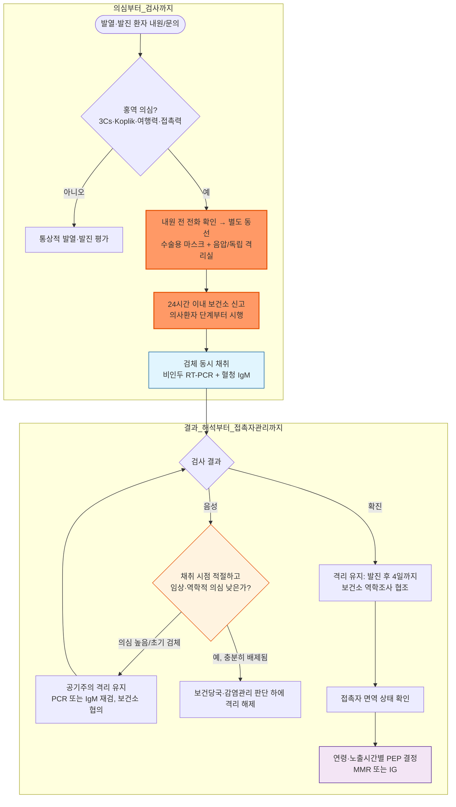

# 홍역 Measles (Rubeola)

## <mark style="color:green;">일반 사항</mark>

* 홍역바이러스(*Measles morbillivirus*)에 의한 전염력이 매우 강한 급성 열성 발진성 질환
* 우리나라는 2014년 세계보건기구(WHO)로부터 홍역 퇴치 인증을 받았으나, 해외 유입과 이에 따른 소규모 전파가 지속될 수 있음
* 잠복기 : 7\~21일(평균 10\~12일); 발진은 노출 후 평균 약 14일에 발생
* 전염 기간 : **발진 발생 4일 전부터 발진 발생 후 4일까지**(발진 발생일=0일)
  * 면역저하자는 바이러스 배출이 길어질 수 있어 격리기간을 개별적으로 연장
* 전염 경로 : **공기전파** 및 감염성 호흡기 분비물과의 직접 접촉
  * 환자가 떠난 뒤에도 밀폐 공간의 공기 중에서 최대 2시간 동안 감염성을 유지할 수 있음
  * 면역이 없는 밀접접촉자의 약 90%가 감염될 정도로 전염력이 강함
* 홍역 환자 또는 의사환자 **1명부터** 신고·격리·역학조사를 시행하며, 역학적으로 연관된 2명 이상은 유행사례로 관리
* 대부분 보존적 치료로 회복하지만 영아, 성인, 임신부, 면역저하자 및 영양결핍 환자에서는 중증 합병증 위험이 높음

### <mark style="color:orange;">합병증</mark>

* 중이염, 후두기관기관지염(croup), 기관지염, 세기관지염
* 폐렴 : 바이러스성 폐렴 또는 이차 세균성 폐렴; 홍역 관련 사망의 가장 흔한 원인
* 설사·구토와 탈수, 간염
* 각막염, 각막궤양 및 시력손상(특히 Vit A 결핍 시)
* 급성뇌염 : 약 1/1,000; 영구적인 신경학적 후유증 가능
* 아급성 경화성 범뇌염(subacute sclerosing panencephalitis, SSPE) : 감염 후 평균 7\~10년 뒤 발생할 수 있는 드물고 진행성·치명적인 중추신경계 합병증; 2세 미만, 특히 1세 미만에 감염된 경우 발병 위험이 현저히 높음
* 임신 중 감염 : 유산, 조산 및 저체중 출생 위험 증가

## <mark style="color:green;">원인</mark>

* *Measles morbillivirus* : *Paramyxoviridae*과 *Morbillivirus*속의 외피를 가진 단일가닥 RNA 바이러스
* 사람만이 자연 숙주임

### <mark style="color:orange;">위험 인자</mark>

* 감염 위험 : MMR 미접종·불완전 접종, 면역의 증거 없음, 홍역 유행지역 여행 또는 환자와의 접촉
* 중증 위험 : 5세 미만(특히 1세 미만), 성인, 임신, 면역저하, 영양결핍 및 Vit A 결핍

## <mark style="color:green;">임상 양상</mark>

### <mark style="color:orange;">전구기</mark>

* 발진 전 3\~5일간 지속
* 발열, 권태감에 이어 기침(cough), 콧물(coryza), 결막염(conjunctivitis)의 3 Cs가 나타나고 발진기까지 악화
* Koplik 반점 : 주로 하악 대구치 맞은편 볼점막에 홍반성 바탕을 가진 1\~3 ㎜ 크기의 청백색 반점
  * 발진 1\~2일 전에 나타나며 발진 후 1\~2일까지 관찰될 수 있으나 항상 확인되는 것은 아님
  * 발진이 진행되면서 빠르게 옅어져 소실되므로, 발진기 중반 이후 내원한 환자에서 관찰되지 않는 것은 정상적인 경과임

### <mark style="color:orange;">발진기</mark>

* 전구증상 시작 3\~5일 후 발진이 나타나며 발진 발생 무렵 고열이 정점에 도달할 수 있음
* 홍반성 반구진 발진이 모발선·얼굴·귀 뒤·상부 목에서 시작하여 약 3일에 걸쳐 몸통과 사지 말단으로 하행
* 병변은 서로 융합할 수 있고, 대개 4\~8일 지속된 뒤 나타난 순서대로 옅어지면서 갈색 색소침착과 미세한 낙설을 남길 수 있음
* 발진 후 3일 이상 고열이 지속되거나 호전 후 다시 발열하면 폐렴·중이염 등 합병증을 평가
* 기침은 다른 증상이 호전된 후에도 1\~2주 지속될 수 있음


예방접종을 받은 환자에서는 발열·3 Cs·발진이 경하거나 비전형적인 수정 홍역(modified measles)으로 나타날 수 있다. 중증 면역저하자에서는 발진이 없을 수도 있으므로 여행력·접촉력과 검사 결과를 함께 판단한다.


### <mark style="color:$danger;">🚩 Red Flags!</mark>

<mark style="color:$danger;">**즉각 조치 또는 의뢰**</mark> <mark style="color:$danger;">- 즉시 응급실 이송/입원 평가</mark>

* 호흡곤란, 청색증, 저산소증, 무호흡 또는 호흡부전
* 의식저하, 심한 처짐, 행동 변화, 경련 또는 국소 신경학적 이상
* 쇼크 소견 또는 중증 탈수(수분 섭취 불가, 현저한 소변량 감소, 말초순환 저하)
* 급격한 전신상태 악화

<mark style="color:$warning;">**당일 또는 조기 의뢰**</mark>

* 발진 후 3일 이상 지속되는 고열, 5일 이상 발열 또는 호전 후 재발열
* 심한 기침, 흉통, 객혈, 빈호흡, 폐렴 의심
* 지속적인 구토·설사, 경구 수분 섭취 곤란
* 안구통, 눈부심 악화 또는 시력 변화
* 1세 미만 영아, 임신부, 중증 면역저하자 또는 심한 영양결핍 환자

<mark style="color:$info;">**외래 추적 / 추가 평가 계획**</mark> <mark style="color:$info;">- 즉각 위험 낮으나 호전 없으면 의뢰</mark>

* 안정적이나 기침·설사·귀 통증 등 증상이 지속되는 경우
* 발열과 섭취량, 호흡상태, 소변량을 매일 확인하고 24\~48시간 내 재평가


홍역 의심환자를 다른 의료기관으로 의뢰할 때에는 반드시 수용기관에 먼저 연락하여 공기주의 격리를 준비하게 한다. 환자와 보호자는 마스크를 착용하고, 가능한 한 대중교통을 이용하지 않는다.


## <mark style="color:green;">진단</mark>

### <mark style="color:orange;">신고와 초기 조치</mark>

* 홍역은 **제2급 법정감염병**으로 환자와 의사환자를 진단한 경우 **24시간 이내 관할 보건소에 신고**
* 확진검사 결과를 기다리지 않고 의심 단계부터 확진환자에 준하여 선제적으로 공기주의 격리
* 발열(≥38℃), 비수포성 홍반성 발진, 3 Cs 또는 Koplik 반점과 함께 다음을 확인
  * 발진 전 7\~21일의 해외여행력
  * 홍역 확진·의심환자 또는 발열·발진 환자와의 접촉력
  * MMR 접종력 및 홍역 면역의 증거

### <mark style="color:orange;">확진검사</mark>

* 의심환자 첫 접촉 시 가능한 한 다음 검체를 동시에 채취하고 보건소·보건환경연구원과 검사 절차를 협의
  * 구인두 또는 비인두 도말 : 홍역바이러스 real-time RT-PCR
    * 발진 발생 즉시 채취할수록 민감도가 높으며, 국내 지침상 발진 후 최대 14일 이내 채취
  * 혈청 : 홍역 특이 IgM 항체
    * 발진 후 72시간 이내에는 위음성 가능
    * 초기 IgM 음성이지만 임상·역학적 의심이 높으면 발진 72시간 이후 재채혈
  * 소변 RT-PCR : 호흡기검체와 함께 채취하면 검출 가능성을 높일 수 있음
* 바이러스 배양은 확진 기준에 포함되지만 일상적인 1차 검사는 RT-PCR과 혈청 IgM임
* 홍역 퇴치국에서는 IgM 단독 양성의 양성예측도가 낮으므로 위양성, 검체 채취 시점, 최근 MMR 접종 및 역학적 연관성을 함께 평가
* IgG는 대개 발진 후 7\~10일경 검출되기 시작함
  * PCR·IgM으로 판정하기 어려운 특수 상황에서 급성기·회복기 혈청의 항체가 4배 이상 상승 또는 IgG avidity 검사를 보조적으로 고려
  * 최근 MMR 접종 후에는 혈청검사만으로 백신반응과 야생형 감염을 구별하기 어려울 수 있어 PCR·유전자형 분석을 활용

### <mark style="color:orange;">기타 검사</mark>

* 백혈구감소·림프구감소 및 간효소 상승이 나타날 수 있으나 비특이적임
* CBC, 전해질, 간기능검사, 흉부 X선 등은 탈수, 간염, 폐렴 또는 이차 세균감염이 의심될 때 선택적으로 시행

### <mark style="color:orange;">감별 진단</mark>

<table><thead><tr><th width="125">질환</th><th>주요 감별점</th></tr></thead><tbody><tr><td>풍진</td><td>비교적 경한 발열·전신증상, 후이개·후두부 림프절병증; Koplik 반점 없음</td></tr><tr><td>돌발진</td><td>주로 영유아; 수일간의 고열이 떨어진 뒤 몸통부터 발진</td></tr><tr><td>성홍열</td><td>인두염, 딸기혀, 사포 같은 미세 발진, Pastia 선</td></tr><tr><td>약물발진</td><td>새 약물 노출과의 시간적 연관성, 소양감; 3 Cs·Koplik 반점 없음</td></tr><tr><td>가와사키병</td><td>5일 이상 발열, 양측 비화농성 결막충혈, 구강·사지 변화와 경부 림프절병증</td></tr><tr><td>기타 바이러스 발진</td><td>Parvovirus B19, HHV-6, 장바이러스 등; 연령·노출력과 발진 경과를 종합</td></tr><tr><td>여행 관련 발열·발진</td><td>뎅기열 등; 여행지역, 혈소판감소, 출혈·쇼크 소견 확인</td></tr></tbody></table>

***



<p align="center"><strong>홍역 의심 시 초기 대응 알고리듬</strong></p>

<p align="center"><em><mark style="color:$info;">Ref. 질병관리청 홍역 대응 지침 (2026.5); CDC Clinical Overview of Measles</mark></em></p>

***

## <mark style="background-color:$warning;">Management</mark>


**홍역 대응의 핵심 흐름**

의심 즉시 공기주의 격리 → 24시간 이내 신고 → PCR·IgM 동시 채취 → 접촉자 확인 및 PEP 결정 순으로 진행한다.


### <mark style="color:orange;">감염관리와 격리</mark>

* 내원 전 전화로 홍역 의심 사실을 알리도록 하고 일반 대기실 이용을 피함
* 환자에게 수술용 마스크를 착용시키고 즉시 음압격리실 또는 다른 공간과 공기 흐름이 연결되지 않는 독립 진료실로 배치
* 표준주의와 공기주의를 적용하고 환자 진료영역에 들어갈 때 N95 또는 적절히 밀착된 동등 수준의 호흡보호구를 사용
  * CDC는 의료진의 홍역 면역 여부와 관계없이 호흡보호구 착용을 권고
  * 질병관리청 지침에는 면역이 확인된 의료종사자의 예외가 함께 기술되어 있으므로 국내에서는 기관 감염관리 규정을 따름
* 환자가 머물렀던 공간은 충분히 환기하고, 의료기관 접촉자 범위는 환자가 떠난 뒤 최대 2시간 동안 같은 공간을 이용한 사람까지 고려
* 환자 격리 : 발진 발생 후 4일이 경과할 때까지 출근·등교·등원 및 외부활동 제한
  * 중증 면역저하자는 질병 경과와 바이러스 배출 가능성을 고려하여 격리기간을 개별 결정

## <mark style="color:green;">비-약물 치료</mark>

* 충분한 휴식과 수분 공급
* 설사·구토가 있으면 경구수분보충액을 이용하여 탈수 예방
* 영양상태를 평가하고 정상적인 식사를 유지
* 호흡상태, 체온, 섭취량과 소변량을 관찰

## <mark style="color:green;">약물 치료</mark>

### <mark style="color:orange;">해열제</mark>

* 발열의 숫자보다 통증·불편감 완화를 목적으로 한 가지 해열제를 체중 기준으로 투여
* acetaminophen : 10\~15 ㎎/㎏/회 q4\~6hr PRN; 제품별 1일 최대용량을 초과하지 않음
  * <mark style="color:blue;">\[세토펜현탁액]</mark> 32 ㎎/㎖
* ibuprofen : 5\~10 ㎎/㎏/회 q6\~8hr PRN; 최대 40 ㎎/㎏/d
  * ≥6개월에서 사용하며 탈수, 수분 섭취 불량 또는 신장질환이 있으면 피함
  * <mark style="color:blue;">\[부루펜시럽]</mark> 20 ㎎/㎖
* acetaminophen과 ibuprofen의 routine 교차투여는 용량·간격 오류 위험 때문에 권고하지 않음
* 소아·청소년에게 aspirin을 투여하지 않음

### <mark style="color:orange;">Vit A</mark>

* WHO는 5세 미만 홍역 의심 소아에게, AAP·CDC는 홍역 소아에서 의료진 감독하에 Vit A 투여를 고려하도록 권고하며 중증·입원 환아에서는 적극적으로 투여
* 진단 즉시 1회 투여하고 다음 날 같은 용량을 반복(총 2회)
  * ＜6개월 : 50,000 IU PO qd ×2d
  * 6\~11개월 : 100,000 IU PO qd ×2d
  * ≥12개월 : 200,000 IU PO qd ×2d
* 안구 합병증을 동반한 Vit A 결핍 소견이 있으면 4\~6주 후 3차 용량 고려
* 예방 목적으로 사용하거나 MMR 백신을 대신할 수 없음
* 국내 Vit A 제제의 공급 상황이 제한적일 수 있어 사용 가능 여부를 보건소·약제부에서 사전 확인


고용량 Vit A의 반복·과량 투여는 간, 골격, 피부 및 중추신경계 독성을 일으킬 수 있다. 임신부에게 소아 홍역 치료에 사용하는 고용량 Vit A 요법을 routine으로 투여하지 않는다 — 고용량 Vit A는 태아 기형(두개안면·심혈관·중추신경계 기형 등) 위험이 있는 것으로 알려져 있으므로 임신부에서는 특히 주의한다. 환자·보호자가 임의로 고용량 보충제를 복용하지 않도록 교육한다.


### <mark style="color:orange;">항바이러스제</mark>

* 승인된 특이 항바이러스제는 없음
* ribavirin은 중증 폐렴·뇌염 또는 중증 면역저하 환자에서 사용된 증례가 있으나 유효성 근거가 부족하고 홍역 치료 적응증으로 승인되지 않았으므로 감염내과·소아감염 전문의와 상의하여 제한적으로 고려

### <mark style="color:orange;">항생제</mark>

* 홍역 자체 또는 바이러스성 폐렴에 routine으로 투여하지 않음
* 세균성 중이염, 세균성 폐렴 등 이차 세균감염이 확인되거나 강하게 의심될 때 해당 감염에 맞추어 투여

## <mark style="color:green;">예방 및 접촉자 관리</mark>

### <mark style="color:orange;">면역의 증거</mark>

* 다음 중 하나 이상이면 국내에서 홍역 면역이 있는 것으로 간주
  * 실험실 검사로 확진된 홍역 병력
  * 생후 12개월 이후, 4주 이상의 간격으로 시행한 홍역 함유 백신 2회 접종 기록
  * 혈청검사에서 홍역 IgG 항체 확인
  * 1967년 12월 31일 이전 출생자
* 의료종사자는 출생연도만으로 면역을 인정하지 않음
* 모체 항체의 지속기간은 개인과 산모의 면역 획득 방식에 따라 달라지므로 출생 후 6개월간 완전한 보호가 지속된다고 단정하지 않음
* 자연감염 후 면역은 대개 평생 지속

### <mark style="color:orange;">MMR 예방접종</mark>

* 소아 표준접종
  * 1차 : 생후 12\~15개월
  * 2차 : 만 4\~6세
* 면역의 증거가 없는 1968년 이후 출생 성인 : 최소 1회 접종
  * 의료종사자, 해외여행자, 대학생·직업교육원생 등 고위험군은 최소 4주 간격으로 2회 접종
* 생후 6\~11개월 접종은 해외여행, 유행 대응 또는 노출 후 예방과 같은 특별한 상황에서 시행
  * 생후 12개월 이전 접종은 기본접종 횟수에 포함하지 않으며, 12개월 이후 표준일정에 따라 2회 추가 접종
* 임신, 중증 면역저하 및 이전 MMR 또는 백신 성분에 대한 중증 알레르기반응은 금기
* 가임기 여성은 MMR 접종 후 4주간 임신을 피함


**계란 알레르기는 MMR 접종의 금기가 아님**\
MMR 백신은 닭 배아 섬유아세포 배양 백신으로 난백 단백질이 극미량만 포함되어 있어, 계란 알레르기(아나필락시스 병력 포함)는 MMR 접종의 금기사항이 아니다. 사전 피부시험 없이 통상적인 방법으로 접종할 수 있으며, 이를 이유로 접종을 지연하지 않는다.



**비용 및 급여**\
표준일정 접종(1차 12\~15개월, 2차 4\~6세)은 국가예방접종(NIP) 지원 대상이다. 조기접종·PEP·임시예방접종의 비용 지원 여부는 연령, 유행 상황, 보건소 시행 방식과 지자체 결정에 따라 달라질 수 있으며, 성인의 의료기관 접종은 일반적으로 본인부담이다. 접종 전 관할 보건소에서 지원 여부를 확인한다.


### <mark style="color:orange;">접촉자 조치와 노출 후 예방요법(PEP)</mark>

* 모든 접촉자에서 접종 기록, 확진 병력, 항체검사 및 국내 출생연도 기준으로 면역 여부를 확인
* 노출 후 경과시간은 **처음 노출된 시점**을 기준으로 판단하며, 보건소·역학조사관과 신속히 협의

<table><thead><tr><th width="140">접촉자</th><th width="160">처음 노출 후 ≤72시간</th><th width="160">노출 후 4\~6일</th><th>노출 후 ＞6일</th></tr></thead><tbody><tr><td>면역의 증거 있음</td><td colspan="3">PEP 불필요; 마지막 노출 후 21일까지 증상 모니터링</td></tr><tr><td>생후 ＜6개월</td><td colspan="2">IMIG 0.5 ㎖/㎏ IM(최대 15 ㎖)<sup>†</sup></td><td>PEP 권고하지 않음; 마지막 노출 후 21일까지 격리</td></tr><tr><td>생후 6\~11개월, 비면역</td><td>MMR 접종 우선<sup>‡</sup>; 접종 후 일반 환경에서는 격리 불필요</td><td>IMIG 0.5 ㎖/㎏ IM(최대 15 ㎖)<sup>†</sup></td><td>PEP 권고하지 않음; 마지막 노출 후 21일까지 격리</td></tr><tr><td>≥12개월, 비면역</td><td>MMR 접종<sup>‡</sup>; 일반 환경에서는 격리 불필요</td><td>routine PEP는 권고하지 않음. 밀접·장시간 노출과 중증 위험을 고려하여 보건당국과 IMIG<sup>†</sup> 여부 협의</td><td>마지막 노출 후 21일까지 격리; 이후 향후 노출 예방을 위해 MMR 접종</td></tr><tr><td>MMR 1회 접종(생후 12개월 이후 유효 1차 접종)</td><td colspan="3">첫 접종 후 ≥4주 간격으로 2차 MMR 접종; 일반 환경에서는 격리 불필요<sup>‡</sup></td></tr><tr><td>면역 없는 임신부</td><td colspan="2">IVIG 400 ㎎/㎏ IV<sup>†</sup></td><td>PEP 권고하지 않음; 마지막 노출 후 21일까지 격리</td></tr><tr><td>중증 면역저하자</td><td colspan="2">접종력·항체 유무와 관계없이 IVIG 400 ㎎/㎏ IV<sup>†</sup></td><td>PEP 권고하지 않음; 마지막 노출 후 21일까지 격리</td></tr></tbody></table>

<sup>†</sup> IG(IMIG/IVIG) 투여자는 잠복기가 연장될 수 있어 증상 모니터링을 마지막 노출 후 **28일까지** 연장하며, 원칙적으로 가정 내 격리도 28일까지 권고한다. 어린이집·학교·직장 복귀는 면역상태·접촉 강도·주변 고위험군을 고려하여 개별 판단하고, 의료기관 환경에서는 28일까지 업무·출입을 제한한다.\
<sup>‡</sup> 노출 후 72시간 이내 MMR을 접종하면 일반 환경(가정·어린이집·학교 등)에서는 격리하지 않을 수 있으나, **의료기관 종사자·출입자는 마지막 노출 후 21일까지 별도 업무·출입 제한 기준을 적용**한다. 생후 6\~11개월의 조기접종은 유효한 1차 접종으로 인정하지 않으며, 12개월 이후 표준일정에 따라 재접종한다.

#### <mark style="color:$primary;">면역글로불린 투여 원칙</mark>

* 홍역 노출 후 가능한 한 빨리, 늦어도 6일 이내 투여
* IMIG : 0.5 ㎖/㎏ IM, 최대 15 ㎖; 한 주사부위에 5 ㎖를 초과하지 않음
* IVIG : 400 ㎎/㎏ IV
* 중증 면역저하자가 최근 3주 이내 IVIG ≥400 ㎎/㎏를 투여받았다면 그 투여로 홍역 예방효과를 기대할 수 있음
* 체중 ≥30 ㎏만을 이유로 일률적으로 IVIG를 선택하지 않으며, 연령·임신·면역상태와 노출 위험에 따라 결정
* MMR과 IG를 같은 노출에 임의로 병용하지 않음
  * IG는 생백신 면역반응을 방해하므로 PEP 목적으로 IG를 투여받은 경우 MMR 접종은 **IMIG 투여 후 최소 6개월, IVIG(400 ㎎/㎏) 투여 후 최소 8개월**이 지난 뒤 시행
* IG 투여자는 잠복기가 연장될 수 있어 마지막 노출 후 28일까지 증상 모니터링하며, 가정 내 격리도 원칙적으로 28일까지 연장; 어린이집·학교·직장 복귀는 접촉 강도와 주변 고위험군을 고려하여 개별 판단
* 국내 사용 가능 제제와 수급 여부는 투여 전 보건소·약제부와 확인

### <mark style="color:orange;">가정 내 관리</mark>

* 가능하면 별도 방에서 생활하고 환자와 보호자는 공용 공간에서 마스크 착용
* 방을 자주 환기하고 면역의 증거가 있는 사람만 환자를 돌봄
* 영아, 임신부, 면역저하자 및 비면역자는 환자와 접촉하지 않도록 함
* 환자의 외출은 발진 발생 후 4일이 경과할 때까지 제한하되, 보건당국의 격리 지시가 있으면 그 지시를 따름

***

### <mark style="color:red;">질병코드</mark>

B05 홍역

B05.0 뇌염이 합병된 홍역

B05.1 수막염이 합병된 홍역

B05.2 폐렴이 합병된 홍역

B05.3 중이염이 합병된 홍역

B05.4 장 합병증이 있는 홍역

B05.8 기타 합병증이 있는 홍역

B05.9 합병증이 없는 홍역

***

## <mark style="color:purple;">처방례</mark>


아래 처방은 예시이다. 두 해열제를 동시에 routine 처방하지 않고, 탈수·신장질환·병용약물과 제품별 허가사항을 확인한다.


> **처방례 1. 15 ㎏ 소아 — acetaminophen 선택 시**
>
> ```
> 세토펜현탁액 32 ㎎/㎖　6 ㎖　PO　q4\~6hr　PRN 발열·통증
> ```
>
> _✽1회 192 ㎎(12.8 ㎎/㎏); 1일 최대 4회. 호전되면 중단_

> **처방례 2. 15 ㎏ 소아 — ibuprofen 선택 시**
>
> ```
> 부루펜시럽 20 ㎎/㎖　5 ㎖　PO　q6\~8hr　PRN 발열·통증
> ```
>
> _✽1회 100 ㎎(6.7 ㎎/㎏); 1일 최대 4회. ≥6개월이며 탈수·신장질환이 없는 경우에만 사용_

> **처방례 3. 성인 — 해열 및 경한 안구 자극 동반**
>
> ```
> 타이레놀정 500 ㎎　1~2정　PO　q6~8hr　PRN 발열·통증 (통상 1일 최대 3 g)
> 히알루로네이트 인공눈물　1방울　필요시 (경한 눈부심·이물감 시 고려)
> ```
>
> _✽1일 최대 3 g을 기본으로 하고, 저체중·영양불량·장기간 금식·간질환·과음이 있으면 추가 감량; 1일 최대 4 g은 의료진 감독 하에서만 적용. 인공눈물은 홍역 특이 치료가 아니며, 심한 눈부심·안구통 또는 시력저하가 있으면 인공눈물보다 안과 평가를 우선함_

***

### <mark style="color:$success;">핵심 복약 지도</mark>

> **격리 및 감염관리**
>
> * 발진 발생일을 0일로 하여 최소 4일째까지는 등교·출근·외출을 하지 않도록 안내합니다.
> * 진단 확정 전, 의심 단계부터 신고와 격리를 시작하며 검사 결과를 기다리지 않습니다.
> * 가족 중 면역이 없는 영유아·임신부·면역저하자는 환자와 접촉하지 않도록 설명합니다.

> **해열제 사용**
>
> * acetaminophen 또는 ibuprofen 중 한 가지를 체중(또는 성인 표준 용량) 기준으로 선택하도록 안내합니다.
> * 두 해열제의 routine 교차투여는 권장하지 않으며, 의료진이 별도로 지시한 경우에만 복용 시각과 용량을 기록하면서 사용하도록 설명합니다.
> * 탈수, 신장질환 또는 수분 섭취가 불량한 환자에서는 ibuprofen을 피하도록 안내합니다.

> **Vit A 및 항생제**
>
> * Vit A는 처방된 용량만큼만 투여하며, 환자·보호자가 임의로 고용량 보충제를 추가 복용하지 않도록 설명합니다.
> * 항생제는 세균성 합병증이 확인되거나 강하게 의심될 때만 사용하며, 예방적으로 투여하지 않음을 설명합니다.

> **언제 다시 병원을 방문해야 하나요?**
>
> * 호흡곤란, 청색증 또는 의식 변화가 나타나는 경우 — 즉시 응급실
> * 발진 후 3일 이상 고열이 지속되거나 호전 후 다시 열이 오르는 경우
> * 심한 기침·흉통·객혈 또는 경구 섭취가 불가능한 경우
> * 안구통이나 시력 변화가 있는 경우
> * 1세 미만 영아, 임신부, 면역저하자는 증상이 경미해 보여도 조기 재평가

***

### <mark style="color:blue;">환자 안내서</mark>


**홍역, 공기로 옮는 발열성 발진 질환입니다**

홍역은 기침이나 대화만으로도 공기를 통해 전파될 만큼 전염력이 매우 강한 바이러스 질환입니다. 대부분은 저절로 좋아지지만, 어린 영아나 임신부, 면역력이 약한 분에게는 폐렴·뇌염 같은 심한 합병증이 생길 수 있어 주의가 필요합니다.


#### <mark style="color:$primary;">왜 홍역에 걸리나요?</mark>

* 홍역 바이러스는 기침이나 재채기로 나온 미세한 입자를 통해 공기로 퍼집니다.
* 예방접종을 받지 않았거나 어릴 때 2번 다 맞지 않은 경우 감염 위험이 높습니다.
* 면역이 없는 사람은 환자와 접촉했을 때 10명 중 9명꼴로 감염될 만큼 전염력이 강합니다.

#### <mark style="color:$primary;">홍역이 의심되면 어떻게 해야 하나요?</mark>

* **병원에 가기 전 반드시 전화로 먼저 알려주세요.** 다른 환자와 마주치지 않는 별도 진료 동선을 안내해 드립니다.
* **대중교통을 이용하지 말고 가능하면 자가용을 이용하세요.** 자가용 이용이 어려우면 의료기관·보건소와 이동 방법을 상의하세요.
* **검사 결과가 나오기 전에도 등교·출근·외출을 중단하세요.** 홍역은 의심 단계부터 격리가 필요합니다.

#### <mark style="color:$primary;">집에서 어떻게 관리하나요?</mark>

* **충분히 쉬고 물을 자주 나누어 드세요.** 설사나 구토가 있으면 물과 경구수분보충액을 조금씩 자주 드세요. 탈수 위험이 있는 영유아에서는 스포츠음료보다 경구수분보충액을 우선 사용합니다.
* **방을 자주 환기하고 가능하면 별도 방에서 지내세요.** 가족 중 면역이 없는 영유아, 임신부, 면역저하자와는 접촉을 피해주세요.
* **발진 발생일로부터 4일째까지는 외출·등교·출근을 하지 마세요.** 이 기간이 지나야 전염력이 크게 줄어듭니다.

#### <mark style="color:$primary;">약은 어떻게 써야 하나요?</mark>

* 열과 몸살 기운에는 처방받은 해열제 한 가지만 사용하세요.
* 두 가지 해열제를 임의로 번갈아 사용하지 마세요.
* 항생제는 홍역 바이러스 자체에는 효과가 없으며, 세균 합병증이 있을 때만 처방됩니다.
* Vitamin A는 처방된 경우에만, 처방된 용량만 복용하세요. 임의로 추가 복용하면 오히려 해로울 수 있습니다.

#### <mark style="color:$primary;">이럴 때는 즉시 병원을 방문하세요</mark>

* 숨쉬기 힘들어하거나 입술·손끝이 파랗게 보이는 경우
* 심하게 처지거나 의식이 흐려지거나 경련이 있는 경우
* 물을 전혀 마시지 못하거나 소변량이 눈에 띄게 줄어든 경우
* 발진 후 3일 이상 고열이 지속되거나 좋아지다가 다시 열이 오르는 경우
* 눈이 아프거나 잘 안 보이는 경우

#### <mark style="color:$primary;">예방접종은 어떻게 하나요?</mark>

* 생후 12\~15개월과 만 4\~6세에 시행하는 MMR 2회 접종은 홍역을 약 97% 예방하며 장기간 보호 효과가 있습니다.
* 1968년 이후 출생한 성인 중 면역의 증거가 없으면 최소 1회, 의료종사자·해외여행자·대학생 등 고위험군은 최소 4주 간격으로 2회 접종합니다.
* 홍역 환자와 접촉했다면 즉시 의료기관이나 보건소에 문의하세요. 면역상태·연령·임신 여부와 노출 후 경과시간에 따라 72시간 이내 MMR 또는 6일 이내 면역글로불린이 발병을 예방하거나 증상을 완화할 수 있습니다. ⏰

## 참고자료

* 질병관리청. 홍역 대응 지침. 2026.5.
* 질병관리청 예방접종도우미. 홍역(Measles) 예방접종 정보.
* Centers for Disease Control and Prevention. Clinical Overview of Measles; Interim Infection Prevention and Control Recommendations for Measles in Healthcare Settings.
* Centers for Disease Control and Prevention. Manual for the Surveillance of Vaccine-Preventable Diseases, Chapter 7: Measles.
* World Health Organization. Measles fact sheet. 2026.
* American Academy of Pediatrics. Red Book: 2024–2027 Report of the Committee on Infectious Diseases.
