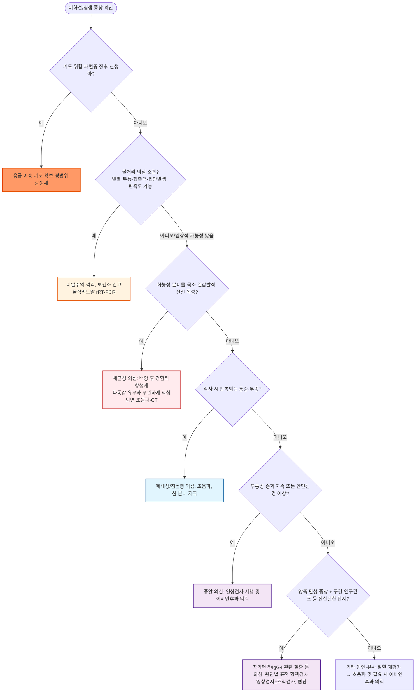

# 이하선염 (침샘염) Parotitis (Sialoadenitis)

## <mark style="color:green;">일반 사항</mark>

* 여러 가지 원인에 의한 이하선(귀밑샘)의 염증
* 다른 이름 : sialoadenitis(침샘염)는 모든 침샘의 염증을 통칭하는 용어이며, 이하선염은 그중 이하선에 국한된 형태
* 병태생리 : 탈수, 섭취 감소, 구강건조 등으로 침 분비와 세척(clearance) 작용이 감소하면 구강 상재균이 Stensen duct를 통해 역행성으로 침입할 수 있음. 이하선 타액에도 IgA, lysozyme, lactoferrin 등 항미생물 성분이 존재함
* 분류 : 감염성(바이러스성/세균성/진균성) vs 비감염성(폐쇄성, 자가면역, 약물, 대사성 등); 급성 vs 만성·재발성
* 경과 : 바이러스성은 흔히 자연 호전되지만, 세균성·폐쇄성·종양성 원인은 별도 치료 또는 평가가 필요
* 의뢰 대상 : 중증(예: 화농성 이하선염, 심경부 확산 의심), 만성, 재발성, 진단이 불명확한 편측성 종괴

### <mark style="color:orange;">위험 인자</mark>

* 침 정체 : 탈수, 쇠약, 식욕 부진, 거식증, 자가면역 질환(예: Sjögren syndrome)
* 면역 저하, 화학요법, 방사선 치료, 영양실조, 알코올 남용
* 조산아, 저체중 출산아 — 특히 NICU 입원 신생아에서 급성 화농성 이하선염 위험 ↑
* 구강 위생 불량, 침샘관의 선천적 구조 이상

## <mark style="color:green;">원인 및 임상 양상</mark>

### <mark style="color:orange;">감염성</mark>

* 갑자기 발생
* 국소 통증, 부종; 침 분비 유발 음식(매운 음식, 신 음식)이나 저작에 의해 증상 악화
* 국소 부종으로 인하여 trismus, mandible angle 둔화, 귓바퀴의 후상방 이동

#### <mark style="color:$primary;">바이러스</mark>

* 전신 감염으로 시작 → 이하선에 localize → 이하선 염증 및 부종 발생
* 볼거리(mumps)는 비말·타액·직접 접촉으로 전파되며, 다른 바이러스는 병원체에 따라 전파경로가 다를 수 있음
* 병원체 : mumps virus, parainfluenza virus types 1 & 3, influenza A, coxsackievirus, Epstein-Barr virus(EBV), cytomegalovirus(CMV), adenovirus (☞ [볼거리](197_-mumps.md))
* 소아 이하선염의 가장 흔한 원인
* 전구 증상 : malaise, 식욕 부진, 두통, 근육관절통, 발열
* 흔히 양측 이환하나, 볼거리는 약 25\~30%에서 편측으로만 나타날 수 있음 — "양측=바이러스, 편측=세균/폐쇄"로 단순화하지 않음
* 국소 열감·홍반은 대개 없음; Stensen duct 개구부에서의 고름 배출 없음


**⚠️ 유행성이하선염(볼거리) 의심 시 즉시 조치**

국내에서는 유행성이하선염 환자 및 의사환자 모두 **법정감염병으로 24시간 이내 신고 대상**이며, **이하선 또는 다른 침샘 종창이 발현한 날부터 5일째까지 격리**가 필요합니다.

* 마스크 및 비말주의, 다른 환자와 즉시 분리
* 관할 보건소 신고 및 검체 채취 — 가능한 빨리 **볼점막도말(buccal swab) rRT-PCR**을 우선 시행
* IgM은 진단에 도움이 되나 단독 확진검사가 아니며, IgG 단회 양성은 급성 감염과 기존 면역을 구분하지 못함
* 백신 접종자에서는 PCR·IgM이 모두 음성이라도 볼거리를 배제할 수 없음
* 종창 발현일부터 5일째까지 격리 (☞ [볼거리](197_-mumps.md))


#### <mark style="color:$primary;">세균</mark>

* 원인균 : S. aureus, 구강 상재균(streptococci, anaerobes 등), S. pneumoniae
* 고령자, 신생아(특히 조산아), 수술 후 호발
* 보통 편측 이환
* 국소 경결, 열감, 홍반; 간혹 Stensen duct 개구부에서의 고름 배출
* 발열이 동반될 수 있으나 고령자·면역저하자에서는 없을 수 있음
* 만성·재발성 세균 감염에서는 Actinomyces(그람양성 세균, 방선균)를 고려 — 외상력·충치 병력과 연관

#### <mark style="color:$primary;">진균</mark>

* 원인균 : Candida — 만성 질환, 입원 환자, 면역저하 환자에서 고려

### <mark style="color:orange;">비감염성</mark>

#### <mark style="color:$primary;">Juvenile recurrent parotitis</mark>

* 원인 불명
* 보통 편측 이환
* 통증, 부종; 2차 감염 시 농성 분비물 발생
* 2주 내 회복
* 재발성 : 보통 3\~6세에 첫 번째 발생하여 사춘기까지 재발

#### <mark style="color:$primary;">비감염성 전신 질환</mark>

* 양측 이환

#### <mark style="color:$primary;">물리적 폐쇄</mark>

* 원인 : 침돌증, ductal stenosis, 외상
* 편측 이환

**침돌증(Sialolithiasis)**

* 급성 부종, 통증; 식사에 의해 악화
* 재발성; submandibular gland에 보다 흔하게 발생

#### <mark style="color:$primary;">약물</mark>

* 항콜린제, 항히스타민제, 이뇨제, TCA, 요오드(조영제), 항정신병제(특히 thioridazine, clozapine), L-asparaginase, phenylbutazone 등 일부 NSAID

#### <mark style="color:$primary;">기타</mark>

* pneumoparotitis : 부는 직업(예: 유리 가공), 잠수부 등에서 이하선 duct에 air trap이 발생

### <mark style="color:orange;">만성</mark>

* 편측 또는 양측 이하선의 재발성 또는 만성 비압통성 부종
* 주로 중년(40\~60세) 이환
* 원인 : Sjögren syndrome, sarcoidosis, HIV(양성 림프상피 낭성 병변), 결핵, IgG4 관련 질환(IgG4-related disease)
  * ✽IgG4 관련 질환의 경화성 침샘염은 주로 악하선에서 기술되어 흔히 Küttner tumor로 불리나, 이하선을 포함한 침샘 전반에서도 나타날 수 있음. 혈청 IgG4 상승이나 조직에서 IgG4+ 형질세포가 관찰된다고 해서 단독으로 확진하지 않으며, storiform fibrosis도 항상 관찰되는 소견은 아님 — 임상·영상·혈청·조직 소견을 종합하고 림프종, Sjögren syndrome 등 다른 질환을 배제하는 **다학제적 평가**가 필요 → 류마티스내과 협진
* 경과 : 수 주\~수년 지속 후 완화

***

### <mark style="color:$danger;">🚩 Red Flags!</mark>

<mark style="color:$danger;">**즉각 조치 또는 의뢰**</mark>

* 급속히 진행하는 경부 부종 + 호흡곤란·연하곤란 (→ 기도 폐쇄 위험) — 응급 이송
* 심경부 감염 확산 시사 소견(종창의 급속한 확산, 흉통·종격동염 의심) — 응급 영상 및 이비인후과/응급의학과 의뢰
* 고열 지속, 빈맥, 저혈압, 의식 변화 등 패혈증 징후 동반
* 신생아(특히 조산아)의 급성 화농성 이하선염 의심 소견 — 전신 패혈증으로 빠르게 진행할 수 있어 즉시 입원 평가

<mark style="color:$warning;">**당일 또는 조기 의뢰**</mark>

* 파동성 종괴, 국소 열감·발적, Stensen duct 개구부의 화농성 분비물 (→ 화농성 이하선염·농양 의심) — 초음파/CT 및 배농 필요성 평가. ✽농양은 이하선의 피막·심부 위치로 인해 파동감이 뚜렷하지 않을 수 있어 "파동감 없음"이 농양 배제를 의미하지 않음
* 급성 안면신경마비 동반, 특히 종괴·경부 림프절·피부 고정을 동반한 경우 (→ 악성 종양 또는 침샘 심부 감염 시사) — 당일 영상 및 이비인후과 긴급 평가
* 면역저하 환자의 급성 부종 (진균 등 기회감염 가능성)
* 편측의 무통성 종괴가 수 주 이상 지속 (→ 종양 감별 필요)

<mark style="color:$info;">**외래 추적 / 추가 평가 계획**</mark> <mark style="color:$info;">- 즉각 위험 낮으나 호전 없으면 의뢰</mark>

* 경험적 항생제 투여 48\~72시간 후에도 임상 호전 없음 (→ 배양 결과·복약순응도·폐쇄/결석/농양 여부 재평가 후 영상 검사 및 항생제 변경)
* 재발성 이하선염(juvenile recurrent parotitis 등) — 이비인후과 협진, 보존치료 실패 시 sialendoscopy 고려
* 만성·양측성 무통성 종창 지속 — Sjögren, IgG4 관련 질환, sarcoidosis, HIV, 결핵, sialadenosis 등 감별을 위한 협진

## <mark style="color:green;">진단</mark>

* 이하선 종창을 확인한 뒤 감염성·폐쇄성·자가면역·종양성·비염증성 원인을 감별

### <mark style="color:orange;">검사</mark>

* 배양 검사 : 이하선 마사지 후 Stensen duct 개구부에서 배출되는 분비물을 배양; needle aspiration은 농양이나 종괴가 의심될 때 별도로 시행
* CBC : 세균성 감염에서 상승 가능
* amylase : routine 진단검사로 권장하지 않음; 복통이 동반되면 급성 췌장염 감별을 위해 lipase 검사를 함께 고려
* mumps 검사 : 볼거리 의심 시 볼점막도말 rRT-PCR을 우선 시행; IgM/IgG 혈청검사는 보조적이며 백신 접종자에서는 위음성 가능
* 영상 검사
  * 초음파 : 1차 선택; 방사선 노출 없이 농양·결석·종양 감별에 유용
  * CT : 농양 형성이 의심되거나(임상적으로 의심되면 파동감이 없어도 시행) 심경부 확산이 우려될 때 조영증강 CT
  * Sialography : 급성 감염기에는 duct 천공·감염 악화 위험으로 금기; 만성·재발성에서 ductal stricture, sialectasis 평가에 사용되어 왔으나 최근 MR sialography나 진단·치료를 겸하는 sialendoscopy로 대체되는 추세

### <mark style="color:orange;">감별 진단</mark>

* 이하선 종창의 원인 및 유사 질환 감별

<table><thead><tr><th width="140">질환</th><th width="260">이하선염과의 차이점</th><th>핵심 감별 포인트</th></tr></thead><tbody><tr><td>경부 림프절염</td><td>이하선 실질이 아닌 림프절의 종대; 하악각 부근에 결절형 종괴로 촉지</td><td>초음파에서 경계가 뚜렷한 결절형 종괴; Stensen duct 이상 없음</td></tr><tr><td>침샘 종양(양성/악성)</td><td>대개 무통성, 서서히 자라는 편측 종괴; 급성 염증 징후 없음</td><td>안면신경마비, 고정된 경결감 동반 시 악성 강력 의심 → 조직검사</td></tr><tr><td>Sialadenosis(침샘증)</td><td>염증·종양이 아닌 비염증성 대사성 종창; 무통성·양측성 침샘 비대</td><td>알코올 남용, 거식증·폭식증, 당뇨병, 영양실조 등 대사·전신 질환과 연관; 압통·발적 없음, 급성 염증 소견 없음</td></tr><tr><td>Masseter 근육 비대</td><td>저작근 비대로 인한 종창, 이갈이·과도한 저작과 연관</td><td>이악물기 시 종괴가 단단해짐; 침샘 부위와 촉진상 구분됨</td></tr><tr><td>치성 감염·농양</td><td>치아·치은 병소에서 기원, 부종이 하악 주변에 국한</td><td>구강 내 원인 치아 확인, 치과적 병력</td></tr><tr><td>유행귀밑샘염(볼거리)</td><td>이하선염의 원인이자 감별이 필요한 대상; 편측도 25~30%에서 가능, 전신 전구증상 동반, 미접종자·집단발생과 연관</td><td>볼점막도말 rRT-PCR로 확진; 접촉력·집단발생 확인 (☞ [볼거리](197_-mumps.md))</td></tr></tbody></table>

***



<p align="center"><strong>임상 양상 기반 진단·초기 대응 알고리듬</strong></p>

<p align="center"><em><mark style="color:$info;">Ref. Cummings Otolaryngology–Head and Neck Surgery; UpToDate, Overview of salivary gland disorders; 질병관리청 유행성이하선염 신고·격리 지침</mark></em></p>

***

## <mark style="background-color:$warning;">Management</mark>


**단계별 접근**

기도·패혈증·신생아 여부와 볼거리 가능성을 먼저 확인합니다. 세균성이 의심되면 가능하면 배양 후 경험적 항생제를 투여하고 48\~72시간 내 반응을 재평가합니다. 화농성 병소나 기도 위협 징후가 있으면 즉시 영상 검사와 의뢰가 필요합니다.


## <mark style="color:green;">비-약물 치료 및 예방</mark>

* 온찜질 및 마사지
* 금연, 음주 제한
* 적절한 수분 섭취
* 침 분비 유도 : 저작 운동(고형식 식사), 무설탕 신맛 사탕 빨아 먹기
* 구강 위생 관리

## <mark style="color:green;">약물 치료</mark>

### <mark style="color:orange;">항생제</mark>

* 전신상태가 안정되고 농양·심부 확산·경구섭취 장애가 없는 경증\~일부 중등도 외래 감염
  * amoxicillin/clavulanate 625 ㎎(amox 500/clav 125) tid <mark style="color:blue;">\[오구멘틴정625㎎]</mark> — MSSA·구강 streptococci·혐기성균까지 커버하는 실용적 1차 선택
  * cephalexin 500 ㎎ qid <mark style="color:blue;">\[팔렉신]</mark> — 혐기성균·치성 감염 가능성이 낮고 MSSA 중심으로 판단될 때의 좁은 스펙트럼 대안 (국내에는 250 ㎎, 500 ㎎ 제형이 모두 있으므로 처방 시 강도 확인)
  * clindamycin 300\~450 ㎎ q6h <mark style="color:blue;">\[훌그램 150 ㎎]</mark> — 즉시형 페니실린 과민반응 시; 국내 훌그램캡슐은 1캡슐 150 ㎎ 제제이므로 300\~450 ㎎ 투여 시 2\~3캡슐 필요; 지역 내 내성률 및 C. difficile 위험을 함께 고려
  * ✽소아 용량 : 연령·체중·중증도·제품의 amoxicillin:clavulanate 비율에 따라 결정. 일반적인 경증\~중등도 감염은 amoxicillin 성분 기준 25\~45 ㎎/㎏/day를 2\~3회 분복; 80\~90 ㎎/㎏/day 고용량은 해당 적응증과 저-clavulanate 제형을 확인한 경우에만 사용. 신생아 및 화농성·중증 소아는 외래 용량 대상이 아니라 입원 평가 대상
* 화농성 분비물, 전신독성, 경구 섭취 불가, 면역저하, 신생아 → 입원 및 정주 항생제 원칙
  * 경험적 선택 : ampicillin/sulbactam (구강균·혐기균 포함)
  * MRSA 위험 요인이 있는 경우 vancomycin 등을 병용 추가 — nafcillin·vancomycin 단독을 모든 화농성 이하선염의 정형화된 처방으로 두지 않음
  * 농양이 확인되면 항생제만 반복하지 않고 배농 여부를 함께 판단; 접근 가능한 국한성 농양은 영상유도 흡인을 고려할 수 있으며, 흡인 실패 또는 심부·다방성·큰 농양은 절개 배농(I\&D)
* 치료 반응 평가
  * 화농성 분비물이 있으면 가능하면 항생제 투여 전 배양을 먼저 시행
  * 투여 48\~72시간 후 임상 반응을 재평가
  * 호전이 없거나 악화되면 배양 결과·복약순응도·폐쇄/결석/농양 여부를 재평가하고 초음파·조영증강 CT 및 의뢰를 고려 — 배양 없이 항생제만 경험적으로 연속 교체하지 않음

### <mark style="color:orange;">진통제, 해열제</mark>

* ibuprofen <mark style="color:blue;">\[부루펜]</mark>, dexibuprofen <mark style="color:blue;">\[애니펜]</mark>, naproxen <mark style="color:blue;">\[아나프록스]</mark> — 필요시 단기간 사용

### <mark style="color:orange;">침 분비 자극제</mark>

* pilocarpine <mark style="color:blue;">\[살라겐]</mark>, cevimeline : 급성 감염 자체를 치료하는 약제가 아니며, 일반적인 재발성 이하선염의 예방약으로도 쓰지 않음; Sjögren syndrome, 두경부 방사선치료 후 구강건조 등 명확한 적응증이 있는 환자로 제한 (녹내장, 조절되지 않는 천식/COPD에서는 주의)

## <mark style="color:green;">시술 및 기타 처치</mark>

* Sialendoscopy 중 생리식염수 세척 ± 관내 corticosteroid 주입 : juvenile recurrent parotitis에서 보존치료 후에도 반복되는 경우 고려; 근거 수준은 연구마다 이질적
* Sialendoscopy : 협착·결석의 진단과 세척·확장 치료를 동시에 수행할 수 있어 보존치료 후에도 반복되는 재발성 이하선염·폐쇄성 질환에서 고려 — 모든 재발성 이하선염의 일률적 1차 치료로 단정하지 않음
* 침돌증 위치별 처치
  * 원위부, 유두부에 가까운 촉지 가능한 결석 : 경구강 절개(ductotomy)로 비교적 쉽게 제거
  * 이동 가능한 작은 관내 결석 : sialendoscopy를 이용한 basket extraction
  * 근위부·폐문부·실질 내 결석 또는 크기가 큰 결석 : 내시경 보조 복합 접근, 관내 쇄석술, 또는 체외충격파쇄석술(ESWL)을 위치·크기·이동성과 기관 가용성에 따라 선택 (✽국내에서는 침샘 ESWL을 시행하는 기관이 많지 않아 접근성이 제한적 — 시행 가능 기관으로 의뢰 필요)
* duct ligation, ductoplasty, parotidectomy, sclerotherapy : 만성, 재발성에서 보존적 치료 실패 시 고려
* 화농성 이하선염에서 뚜렷한 농양 형성(초음파/CT 확인) 시 절개 배농(I\&D) 또는 영상 유도 흡인

***

### <mark style="color:red;">질병코드</mark>

K11.2 침샘염(타액선염)

B26.9 유행귀밑샘염(볼거리), 합병증 없음 (☞ [볼거리](197_-mumps.md))

K11.5 타석증(침돌증)

***

## <mark style="color:purple;">처방례</mark>

> **처방례 1. 외래 경증\~중등도 세균성 이하선염 (실용적 1차)**
>
> ```
> 오구멘틴정625㎎  3T  #3  (7~10일)
> 부루펜 200 ㎎/T  4T  #4  (필요시 단기간)
> ```
>
> _✽구강 혐기성균·치성 감염 가능성을 배제하기 어려운 상황에서의 실용적 1차 선택. 48~72시간 후 반응 재평가; 화농성 분비물이 있었다면 투여 전 배양 결과를 함께 확인. 식사 시작과 함께 복용; 신기능 저하 시 투여 간격 조정 필요_
> _✽소아 : amoxicillin 성분 기준 25~45 ㎎/㎏/day, 1일 2~3회 분복(체중·중증도·제형의 amox:clav 비율에 따라 조정; 고용량 80~90 ㎎/㎏/day는 저-clavulanate 제형 확인 시에만)_

> **처방례 2. 혐기성균·치성 감염 가능성이 낮고 MSSA 중심으로 판단되는 경우**
>
> ```
> 팔렉신 500 ㎎/C  4C  #4  (7~10일)
> 부루펜 200 ㎎/T  4T  #4  (필요시 단기간)
> ```
>
> _✽좁은 스펙트럼 대안. 48~72시간 후에도 호전이 없으면 배양 결과·복약순응도·폐쇄/농양 여부를 재평가한 뒤 항생제 변경(예: amoxicillin/clavulanate)을 고려_

> **처방례 3. 즉시형 페니실린 과민반응**
>
> ```
> 훌그램 150 ㎎/C  8C  #4  (1회 2C, 7~10일)
> 부루펜 200 ㎎/T  4T  #4  (필요시 단기간)
> ```
>
> _✽clindamycin은 페니실린 계열이 아니므로 즉시형 과민반응 환자에게 사용 가능; 국내 훌그램캡슐은 150 ㎎ 제제이므로 1회 300 ㎎ 투여 시 2캡슐. 처방 전 지역 내 내성률 및 C. difficile 위험을 고려_

> **처방례 4. 바이러스성 이하선염 또는 juvenile recurrent parotitis (대증 치료)**
>
> ```
> 부루펜 200 ㎎/T  4T  #4  (필요시 통증·발열 조절)
> ```
>
> _✽항생제는 불필요; 온찜질, 무설탕 신맛 사탕 등으로 침 분비 자극, 수분 섭취 권장. 볼거리 의심 소견(접촉력, 집단발생, 편측 이환 포함)이 있으면 격리·신고 절차를 우선 적용; Stensen duct 화농성 분비물, 국소 열감·발적 등 2차 세균 감염 시사 소견이 없는지 재평가 필요_

***

### <mark style="color:$success;">핵심 복약 지도</mark>

> **항생제는 처방대로 복용**
>
> * 증상이 좋아지거나 나빠지더라도 임의로 중단·연장하지 말고, 처방된 기간과 용법대로 복용하도록 안내
> * amoxicillin/clavulanate는 위장관 부작용을 줄이기 위해 식사 시작과 함께 복용하도록 안내; 신기능 저하 환자는 투여 간격 조정이 필요할 수 있음
> * 부작용이 생기거나 치료 반응이 없으면 임의로 조절하지 말고 의료진 지시에 따르도록 설명
> * 48\~72시간 후에도 부종·통증·발열이 호전되지 않거나 악화되면 재내원하여 배양·항생제 변경 필요

> **침 분비를 자극하는 자가 관리**
>
> * 무설탕 신맛 사탕, 레몬 조각 등을 빨아 먹어 침 분비를 유도하도록 안내
> * 빨아 먹을 때 통증·부종이 오히려 심해지면 억지로 계속하지 말고 폐쇄 여부를 재평가
> * 저작 운동(고형식 식사)과 온찜질·마사지를 병행하도록 설명
> * 탈수는 침 정체와 감염 위험을 높이므로 충분한 수분 섭취 강조

> **언제 다시 병원을 방문해야 하나요?**
>
> * 항생제 복용 48\~72시간 후에도 부종·통증·발열이 호전되지 않는 경우
> * 종괴가 말랑말랑해지거나(파동감) 피부 발적·열감이 심해지는 경우 — 농양 의심, 즉시 재내원
> * 호흡곤란, 삼킴 곤란, 입 벌리기 어려움(trismus 악화)이 새로 생기는 경우 — 즉시 응급실
> * 증상이 반복되거나 2주 이상 지속되는 경우 — 이비인후과 의뢰 고려

***

### <mark style="color:blue;">환자 안내서</mark>


**이하선염, 원인에 따라 치료가 달라집니다**

이하선염은 귀 앞쪽·아래쪽에 있는 귀밑샘(이하선)에 생기는 염증입니다. 바이러스, 세균, 침샘 관 막힘, 자가면역질환 등 다양한 원인으로 생기며, 원인에 따라 치료 방법과 경과가 다릅니다.


#### <mark style="color:$primary;">왜 귀밑이 붓고 아프나요?</mark>

* 침이 줄어들고 입안이 마르면 입속 세균이 침샘관을 따라 거슬러 올라가 염증을 일으킬 수 있습니다.
* 신맛 음식이나 매운 음식을 먹거나 씹을 때 침 분비가 늘면서 통증이 심해질 수 있습니다.

#### <mark style="color:$primary;">일상생활에서 어떻게 관리하나요?</mark>

* **하루 1\~2회, 5\~10분씩 따뜻한 찜질과 마사지를 해 주십시오.** 침 배출을 돕고 통증을 줄여줍니다.
* **무설탕 신맛 사탕이나 레몬을 빨아 드십시오.** 침 분비를 늘려 막힌 부분을 씻어내는 데 도움이 됩니다. 다만 빨아 먹을 때 오히려 아프고 붓기가 심해지면 억지로 계속하지 말고 병원에서 막힌 부분이 있는지 확인받으십시오.
* **물을 충분히 마시십시오.** 탈수는 증상을 악화시킬 수 있습니다.
* **술과 담배는 피하십시오.** 흡연과 음주는 침 분비를 억제해 회복을 늦출 수 있습니다.

#### <mark style="color:$primary;">항생제는 어떻게 써야 하나요?</mark>

* 세균 감염으로 진단된 경우에만 항생제가 처방됩니다. 임의로 중단하거나 연장하지 말고 처방된 기간과 용법대로 복용하십시오.
* 복용 중 부작용이 생기거나 증상이 나아지지 않으면 임의로 조절하지 말고 의료진과 상의하십시오.

#### <mark style="color:$primary;">볼거리로 진단(의심)되었다면</mark>

* 진단 또는 검사 결과가 나올 때까지 마스크를 착용하고, 등교·출근과 다른 사람과의 밀접 접촉을 피해 주십시오.
* 의료진과 보건소의 신고·격리 안내를 따라 주십시오. 증상 발현일부터 5일째까지가 격리 기간입니다.

#### <mark style="color:$primary;">이럴 때는 즉시 병원을 방문하세요</mark>

* 🔥 열이 심해지거나 오한이 동반될 때 — 외래 재진
* 😖 부은 부위가 물렁물렁해지거나 피부가 붉고 뜨거워질 때 — 외래 재진(농양 의심)
* 😮‍💨 숨쉬기 힘들거나 음식을 삼키기 어려울 때, 입이 잘 안 벌어질 때 — **즉시 응급실**
* 🔁 증상이 반복되거나 2주 넘게 지속될 때 — 외래 재진
