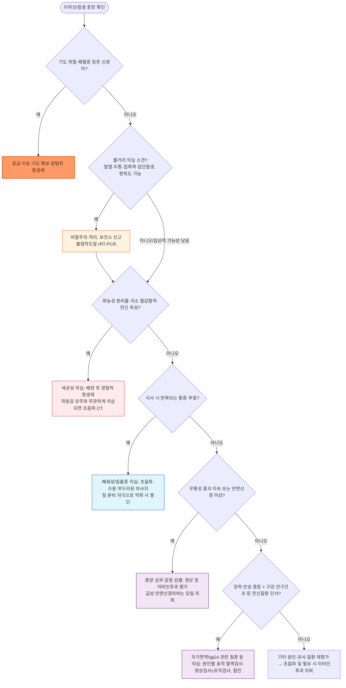

# 이하선염 (침샘염) Parotitis (Sialadenitis)

## <mark style="color:green;">일반 사항</mark>

* 여러 가지 원인에 의한 이하선(귀밑샘)의 염증
* 다른 이름 : sialadenitis(침샘염)는 모든 침샘의 염증을 통칭하는 용어이며, 이하선염은 그중 이하선에 국한된 형태
* 병태생리 : 탈수, 섭취 감소, 구강건조 등으로 침 분비와 세척(clearance) 작용이 감소하면 구강 상재균이 Stensen duct를 통해 역행성으로 침입할 수 있음. 이하선 타액에도 IgA, lysozyme, lactoferrin 등 항미생물 성분이 존재함
* 분류 : 감염성(바이러스성/세균성/진균성) vs 비감염성(폐쇄성, 자가면역, 약물, 대사성 등); 급성 vs 만성·재발성
* 경과 : 바이러스성은 흔히 자연 호전되지만, 세균성·폐쇄성·종양성 원인은 별도 치료 또는 평가가 필요
* 의뢰 대상 : 중증(예: 화농성 이하선염, 심경부 확산 의심), 만성, 재발성, 진단이 불명확한 편측성 종괴

### <mark style="color:orange;">위험 인자</mark>

* 침 정체 : 탈수, 쇠약, 식욕 부진, 거식증, 자가면역 질환(예: Sjögren syndrome)
* 면역 저하, 화학요법, 방사선 치료, 영양실조, 알코올 남용
* 조산아, 저체중 출산아 - 특히 NICU 입원 신생아에서 급성 화농성 이하선염 위험 ↑
* 구강 위생 불량, 침샘관의 선천적 구조 이상

## <mark style="color:green;">원인 및 임상 양상</mark>

### <mark style="color:orange;">감염성</mark>

* 갑자기 발생
* 국소 통증, 부종; 침 분비 유발 음식(매운 음식, 신 음식)이나 저작에 의해 증상 악화
* 국소 부종으로 인하여 trismus, mandible angle 둔화, 귓바퀴의 후상방 이동

#### <mark style="color:$primary;">바이러스</mark>

* 전신 감염으로 시작 → 이하선에 localize → 이하선 염증 및 부종 발생
* 볼거리(mumps)는 비말·타액·직접 접촉으로 전파되며, 다른 바이러스는 병원체에 따라 전파경로가 다를 수 있음
* 병원체 : mumps virus, parainfluenza virus types 1 & 3, influenza A, coxsackievirus, Epstein-Barr virus(EBV), cytomegalovirus(CMV), adenovirus (☞ [볼거리](197_-mumps.md))
* 소아 급성 이하선염에서 주요 원인이나, MMR 접종률·유행 상황과 소아 재발성 이하선염 등을 함께 고려
* 전구 증상 : malaise, 식욕 부진, 두통, 근육관절통, 발열
* 흔히 양측 이환하나, 볼거리는 약 25\~30%에서 편측으로만 나타날 수 있음 - "양측=바이러스, 편측=세균/폐쇄"로 단순화하지 않음
* 국소 열감·홍반은 대개 없음; Stensen duct 개구부에서의 고름 배출 없음


**⚠️ 유행성이하선염(볼거리) 의심 시 즉시 조치**

국내에서는 유행성이하선염 환자 및 의사환자 모두 **제2급 법정감염병으로 24시간 이내 신고 대상**이며, **이하선 또는 다른 침샘 종창이 발현한 날을 0일(D0)로 하여 5일째(D+5)까지 격리**가 필요함.

* 마스크 및 비말주의, 다른 환자와 즉시 분리
* 관할 보건소 신고 및 검체 채취 - 가능한 빨리 **볼점막도말(buccal swab) rRT-PCR**을 우선 시행
* RT-PCR이 우선 검사이며, IgM은 보조적 검사임. **국내 신고 기준에서는 합당한 임상증상과 특이 IgM 양성이 확인되면 환자로 분류**하나, CDC에서는 IgM을 단독 확진 근거로 인정하지 않으므로 기준을 구분. IgG 단회 양성은 급성 감염과 기존 면역을 구분하지 못함
* 백신 접종자에서는 PCR·IgM이 모두 음성이라도 볼거리를 배제할 수 없음
* 종창 발현일을 D0로 하여 D+5까지 격리; 상태가 호전되면 D+6부터 복귀 (☞ [볼거리](197_-mumps.md))


#### <mark style="color:$primary;">세균</mark>

* 원인균 : S. aureus, 구강 상재균(streptococci, anaerobes 등), S. pneumoniae
* 고령자, 신생아(특히 조산아), 수술 후 호발
* 보통 편측 이환
* 국소 경결, 열감, 홍반; 간혹 Stensen duct 개구부에서의 고름 배출
* 발열이 동반될 수 있으나 고령자·면역저하자에서는 없을 수 있음
* 만성·재발성 세균 감염에서는 Actinomyces(그람양성 세균, 방선균)를 고려 - 외상력·충치 병력과 연관

#### <mark style="color:$primary;">진균</mark>

* Candida 등 진균성 침샘 감염은 매우 드묾; 중증 면역저하자에서 감별하되 구강 칸디다 집락만으로 진균성 이하선염을 진단하지 않고 배양·조직 소견을 함께 평가

### <mark style="color:orange;">비감염성</mark>

#### <mark style="color:$primary;">Juvenile recurrent parotitis</mark>

* 원인 불명
* 보통 편측 이환
* 통증, 부종; 2차 감염 시 농성 분비물 발생
* 2주 내 회복
* 재발성 : 보통 3\~6세에 첫 번째 발생하여 사춘기까지 재발

#### <mark style="color:$primary;">비감염성 전신 질환</mark>

* Sjögren syndrome, IgG4 관련 질환, sarcoidosis 등은 흔히 양측성이나 편측으로도 나타날 수 있음
* 알코올 남용·섭식장애·당뇨병·영양실조와 관련된 무통성 양측 비대는 sialadenosis(비염증성 침샘증)를 감별

#### <mark style="color:$primary;">물리적 폐쇄</mark>

* 원인 : 침돌증, ductal stenosis, 외상
* 편측 이환

**침돌증(Sialolithiasis)**

* 급성 부종, 통증; 식사에 의해 악화
* 재발성; submandibular gland에 보다 흔하게 발생

#### <mark style="color:$primary;">약물</mark>

* 항콜린제, 항히스타민제, 이뇨제, TCA, 요오드(조영제), 항정신병제(특히 thioridazine, clozapine), L-asparaginase, phenylbutazone 등 일부 NSAID

#### <mark style="color:$primary;">기타</mark>

* pneumoparotid : 악기 연주·유리 불기·반복적인 볼 부풀리기 등으로 구강 내 압력이 상승하여 이하선관에 공기가 역류; 염증을 동반하면 pneumoparotitis로 부름

### <mark style="color:orange;">만성</mark>

* 편측 또는 양측 이하선의 재발성 또는 만성 비압통성 부종
* 주로 중년(40\~60세) 이환
* 원인 : Sjögren syndrome, sarcoidosis, HIV(양성 림프상피 낭성 병변), 결핵, IgG4 관련 질환(IgG4-related disease)
  * ✽IgG4 관련 질환의 경화성 침샘염은 주로 악하선에서 기술되어 흔히 Küttner tumor로 불리나, 이하선을 포함한 침샘 전반에서도 나타날 수 있음. 혈청 IgG4 상승이나 조직에서 IgG4+ 형질세포가 관찰된다고 해서 단독으로 확진하지 않으며, storiform fibrosis도 항상 관찰되는 소견은 아님 - 임상·영상·혈청·조직 소견을 종합하고 림프종, Sjögren syndrome 등 다른 질환을 배제하는 **다학제적 평가**가 필요 → 류마티스내과 협진
* 경과 : 수 주\~수년 지속 후 완화

***

### <mark style="color:$danger;">🚩 Red Flags!</mark>

<mark style="color:$danger;">**즉각 조치 또는 의뢰**</mark>

* 급속히 진행하는 경부 부종 + 호흡곤란·연하곤란 (→ 기도 폐쇄 위험) - 응급 이송
* 심경부 감염 확산 시사 소견(종창의 급속한 확산, 흉통·종격동염 의심) - 응급 영상 및 이비인후과/응급의학과 의뢰
* 고열 지속, 빈맥, 저혈압, 의식 변화 등 패혈증 징후 동반
* 신생아(특히 조산아)의 급성 화농성 이하선염 의심 소견 - 전신 패혈증으로 빠르게 진행할 수 있어 즉시 입원 평가

<mark style="color:$warning;">**당일 평가 또는 의뢰**</mark>

* 파동성 종괴, 국소 열감·발적, Stensen duct 개구부의 화농성 분비물 (→ 화농성 이하선염·농양 의심) - 초음파/CT 및 배농 필요성 평가. ✽농양은 이하선의 피막·심부 위치로 인해 파동감이 뚜렷하지 않을 수 있어 "파동감 없음"이 농양 배제를 의미하지 않음
* 급성 안면신경마비 동반, 특히 종괴·경부 림프절·피부 고정을 동반한 경우 (→ 악성 종양 또는 침샘 심부 감염 시사) - 당일 영상 및 이비인후과 긴급 평가
* 면역저하 환자의 급성 부종 (진균 등 기회감염 가능성)

<mark style="color:$info;">**외래 추적 / 추가 평가 계획**</mark> <mark style="color:$info;">- 즉각 위험 낮으나 호전 없으면 의뢰</mark>

* 편측 무통성 종괴가 수 주 이상 지속 - 종양 감별을 위해 조기 이비인후과 평가를 계획; 급성 안면신경마비·고정·빠른 성장 동반 시 당일 평가
* 경험적 항생제 투여 48시간 후에도 임상 호전 없음 - 재내원하여 배양 결과·복약순응도·폐쇄/결석/농양 여부를 확인하고 영상 검사·입원 필요성 판단; 악화하면 48시간을 기다리지 않고 당일 평가
* 재발성 이하선염(juvenile recurrent parotitis 등) - 이비인후과 협진, 보존치료 실패 시 sialendoscopy 고려
* 만성·양측성 무통성 종창 지속 - Sjögren, IgG4 관련 질환, sarcoidosis, HIV, 결핵, sialadenosis 등 감별을 위한 협진

## <mark style="color:green;">진단</mark>

* 이하선 종창을 확인한 뒤 감염성·폐쇄성·자가면역·종양성·비염증성 원인을 감별

### <mark style="color:orange;">검사</mark>

* 배양 검사 : Stensen duct에서 배출되는 농성 분비물을 가능하면 항생제 투여 전 채취; 패혈증·전신독성 시 혈액배양도 고려. 검체 채취 때문에 중증 감염의 항생제 투여를 지연하지 않음
  * 농양 흡인과 종양 의심 시 초음파 유도 세침흡인(FNA)·중심바늘생검은 목적이 다르므로 이비인후과에서 구분하여 시행
* CBC : 세균성 감염에서 상승 가능
* amylase : routine 진단검사로 권장하지 않음; 복통이 동반되면 급성 췌장염 감별을 위해 lipase 검사를 함께 고려
* mumps 검사 : 볼거리 의심 시 볼점막도말 rRT-PCR을 우선 시행; IgM/IgG 혈청검사는 보조적이며 백신 접종자에서는 위음성 가능
* 영상 검사
  * 초음파 : 1차 선택; 방사선 노출 없이 농양·결석·종양 감별에 유용
  * CT : 농양 형성이 의심되거나(임상적으로 의심되면 파동감이 없어도 시행) 심경부 확산이 우려될 때 조영증강 CT
  * Sialography : 급성 감염기에는 duct 천공·감염 악화 위험으로 금기; 만성·재발성에서 ductal stricture, sialectasis 평가에 사용되어 왔으나 최근 MR sialography나 진단·치료를 겸하는 sialendoscopy로 대체되는 추세

### <mark style="color:orange;">감별 진단</mark>

* 이하선 종창의 원인 및 유사 질환 감별

<table><thead><tr><th width="140">질환</th><th width="260">이하선염과의 차이점</th><th>핵심 감별 포인트</th></tr></thead><tbody><tr><td>경부 림프절염</td><td>이하선 실질이 아닌 림프절의 종대; 하악각 부근에 결절형 종괴로 촉지</td><td>초음파에서 경계가 뚜렷한 결절형 종괴; Stensen duct 이상 없음</td></tr><tr><td>침샘 종양(양성/악성)</td><td>대개 무통성, 서서히 자라는 편측 종괴; 급성 염증 징후 없음</td><td>안면신경마비, 고정된 경결감 동반 시 악성 강력 의심 → 조직검사</td></tr><tr><td>Sialadenosis(침샘증)</td><td>염증·종양이 아닌 비염증성 대사성 종창; 무통성·양측성 침샘 비대</td><td>알코올 남용, 거식증·폭식증, 당뇨병, 영양실조 등 대사·전신 질환과 연관; 압통·발적 없음, 급성 염증 소견 없음</td></tr><tr><td>Masseter 근육 비대</td><td>저작근 비대로 인한 종창, 이갈이·과도한 저작과 연관</td><td>이악물기 시 종괴가 단단해짐; 침샘 부위와 촉진상 구분됨</td></tr><tr><td>치성 감염·농양</td><td>치아·치은 병소에서 기원, 부종이 하악 주변에 국한</td><td>구강 내 원인 치아 확인, 치과적 병력</td></tr><tr><td>유행귀밑샘염(볼거리)</td><td>이하선염의 원인이자 감별이 필요한 대상; 편측도 25~30%에서 가능, 전신 전구증상 동반, 미접종자·집단발생과 연관</td><td>볼점막도말 rRT-PCR로 확진; 접촉력·집단발생 확인 (☞ [볼거리](197_-mumps.md))</td></tr></tbody></table>

***


```mermaid
graph TD
    A(["이하선/침샘 종창 확인"]) --> B{"기도 위협·패혈증 징후·신생아?"}
    B -->|예| B1["응급 이송·기도 확보·광범위 항생제"]
    B -->|아니오| C{"볼거리 의심 소견?<br/>발열·두통·접촉력·집단발생, 편측도 가능"}
    C -->|예| C1["비말주의·격리, 보건소 신고<br/>볼점막도말 rRT-PCR"]
    C1 --> D
    C -->|아니오/임상적 가능성 낮음| D{"화농성 분비물·국소 열감발적·전신 독성?"}
    D -->|예| D1["세균성 의심: 배양 후 경험적 항생제<br/>파동감 유무와 무관하게 의심되면 초음파·CT"]
    D -->|아니오| E{"식사 시 반복되는 통증·부종?"}
    E -->|예| E1["폐쇄성/침돌증 의심: 초음파·수분·부드러운 마사지<br/>침 분비 자극으로 악화 시 중단"]
    E -->|아니오| F{"무통성 종괴 지속 또는 안면신경 이상?"}
    F -->|예| F1["종양·심부 감염 감별: 영상 및 이비인후과 평가<br/>급성 안면신경마비는 당일 의뢰"]
    F -->|아니오| G{"양측 만성 종창 + 구강·안구건조 등 전신질환 단서?"}
    G -->|예| G1["자가면역/IgG4 관련 질환 등 의심: 원인별 표적 혈액검사·영상검사±조직검사, 협진"]
    G -->|아니오| H["기타 원인·유사 질환 재평가 → 초음파 및 필요 시 이비인후과 의뢰"]
    style B1 fill:#f96,stroke:#e65100,stroke-width:2px
    style C1 fill:#fff3e0,stroke:#e65100
    style D1 fill:#ffebee,stroke:#c62828
    style E1 fill:#e1f5fe,stroke:#01579b
    style F1 fill:#f3e5f5,stroke:#4a148c
    style G1 fill:#f3e5f5,stroke:#4a148c
```

<p align="center"><strong>임상 양상 기반 진단·초기 대응 알고리듬</strong></p>

<p align="center"><em><mark style="color:$info;">Ref. Cummings Otolaryngology–Head and Neck Surgery; UpToDate, Overview of salivary gland disorders; 질병관리청 2026년도 예방접종대상감염병 관리 지침</mark></em></p>

***

## <mark style="background-color:$warning;">Management</mark>


**단계별 접근**

기도·패혈증·신생아 여부와 볼거리 가능성을 먼저 확인합니다. 세균성이 의심되면 가능하면 배양 후 경험적 항생제를 투여하고 48시간 내 반응을 재평가합니다. 화농성 병소나 기도 위협 징후가 있으면 즉시 영상 검사와 의뢰가 필요합니다.


## <mark style="color:green;">비-약물 치료 및 예방</mark>

* 온찜질 및 부드러운 마사지 : 이하선에서 Stensen관 개구부 방향으로 압력을 가볍게 가함
* 금연, 음주 제한
* 적절한 수분 섭취
* 침 분비 유도 : 세균성·폐쇄성 질환에서 무설탕 껌·사탕을 고려하되, 통증·종창이 악화되면 중단하고 폐쇄 여부 재평가
  * 볼거리 등 급성 바이러스성 이하선염에서는 신 음식·자극적인 음식이 통증을 악화할 수 있어 피하고 부드러운 음식 섭취
  * 어린 소아에게 단단한 사탕을 주지 않으며, 저작·연하 곤란 시 고형식을 억지로 권하지 않음
* 구강 위생 관리

## <mark style="color:green;">약물 치료</mark>

### <mark style="color:orange;">항생제</mark>

* 전신상태가 안정되고 농양·심부 확산·경구섭취 장애가 없는 경증\~일부 중등도 외래 감염
  * amoxicillin/clavulanate 625 ㎎(amox 500/clav 125) tid <mark style="color:blue;">\[오구멘틴정625㎎]</mark> - MSSA·구강 streptococci·혐기성균까지 커버하는 실용적 1차 선택
  * cephalexin 500 ㎎ qid <mark style="color:blue;">\[팔렉신캡슐500㎎]</mark> - 배양·임상 소견으로 MSSA 등 감수성 균을 확인하고 혐기성균·치성 감염 가능성이 낮을 때의 좁은 스펙트럼 대안; 국내 확인 제품은 1캡슐 500 ㎎
  * clindamycin 300 ㎎ q6h <mark style="color:blue;">\[훌그램 150 ㎎]</mark> - 즉시형 페니실린 과민반응 시; 국내 훌그램캡슐은 1캡슐 150 ㎎ 제제이므로 300 ㎎ 투여 시 2캡슐 필요; 지역 내 내성률 및 C. difficile 위험을 함께 고려; erythromycin 내성·clindamycin 감수성 포도구균은 유도성 내성(D-test) 결과 확인
  * EBV 전염단핵구증에 의한 이하선염이 의심되면 amoxicillin/clavulanate를 피하고 세균성 감염 여부를 재평가
  * ✽소아(신생아 제외) : **7:1 제형인 오구멘틴듀오시럽**의 amoxicillin 성분 기준 25 ㎎/㎏/d(경증\~중등도) 또는 45 ㎎/㎏/d(중증 허가 용량)를 **bid**로 투여. 4:1 등 다른 제형은 용량·분복 횟수가 다르므로 그대로 환산하지 않음
  * 80\~90 ㎎/㎏/d는 이 챕터의 통상 용량으로 제시하지 않음; 신생아·중증 소아·농양 의심 환자는 입원 평가 대상
* 화농성 분비물은 당일 평가·배양 대상이나 그 소견만으로 모든 환자에게 입원이 필수인 것은 아님. 농양·심부 확산, 전신독성, 경구 섭취 불가, 중증 면역저하 또는 신생아에서는 입원·정주 항생제를 우선
  * 경험적 선택 : ampicillin/sulbactam (구강균·혐기균 포함)
  * 중증 면역저하·의료관련 감염·그람음성균 위험에서는 항녹농균 치료 필요성도 감염내과와 협의
  * MRSA 위험 요인이 있는 경우 vancomycin 등을 병용 추가 - nafcillin·vancomycin 단독을 모든 화농성 이하선염의 정형화된 처방으로 두지 않음
  * 농양이 확인되면 항생제만 반복하지 않고 배농 여부를 함께 판단; 접근 가능한 국한성 농양은 영상유도 흡인을 고려할 수 있으며, 흡인 실패 또는 심부·다방성·큰 농양은 절개 배농(I\&D)
* 치료 반응 평가
  * 화농성 분비물이 있으면 가능하면 항생제 투여 전 배양을 먼저 시행
  * 투여 48시간 후 임상 반응을 재평가; 악화하면 즉시 재평가
  * 외래 항생제는 초기 7\~10일을 고려하되 표준화된 단일 치료기간은 없으므로 중증도·배양 결과·배농 여부·반응에 따라 조정
  * 호전이 없거나 악화되면 배양 결과·복약순응도·폐쇄/결석/농양 여부를 재평가하고 초음파·조영증강 CT 및 의뢰를 고려 - 배양 없이 항생제만 경험적으로 연속 교체하지 않음

### <mark style="color:orange;">진통제, 해열제</mark>

* ibuprofen <mark style="color:blue;">\[부루펜]</mark>, dexibuprofen <mark style="color:blue;">\[애니펜]</mark>, naproxen <mark style="color:blue;">\[아나프록스]</mark> 중 한 가지를 필요시 단기간 사용; NSAID끼리는 병용하지 않음
* 탈수·신장질환·위장관 출혈 위험 또는 항응고제 복용 시 NSAID를 피하거나 신중히 사용; acetaminophen을 대안으로 고려
* 소아는 체중별 제형·용량을 사용하고 아래 성인 정제 처방을 그대로 적용하지 않음 (☞ [볼거리](197_-mumps.md))

### <mark style="color:orange;">침 분비 자극제</mark>

* pilocarpine <mark style="color:blue;">\[살라겐정5㎎]</mark> : 급성 감염 치료·일반 재발성 이하선염 예방 목적으로 사용하지 않음; Sjögren syndrome 또는 두경부 방사선치료 후 구강건조 등 허가 적응증에 한하여 고려
  * **조절되지 않는 천식, 급성 홍채염·폐쇄각녹내장 등 축동이 부적절한 상태는 금기**; 조절된 천식·COPD는 전문의 감독하에 신중히 사용
  * 모든 녹내장을 같은 금기로 취급하지 않음

## <mark style="color:green;">시술 및 기타 처치</mark>

* Sialendoscopy 중 생리식염수 세척 ± 관내 corticosteroid 주입 : juvenile recurrent parotitis에서 보존치료 후에도 반복되는 경우 고려; 근거 수준은 연구마다 이질적
* Sialendoscopy : 협착·결석의 진단과 세척·확장 치료를 동시에 수행할 수 있어 보존치료 후에도 반복되는 재발성 이하선염·폐쇄성 질환에서 고려 - 모든 재발성 이하선염의 일률적 1차 치료로 단정하지 않음
* 침돌증 위치별 처치
  * 원위부, 유두부에 가까운 결석 : 침샘내시경 또는 경구강 접근으로 제거 고려; 특히 이하선관은 협착·안면신경 손상 위험을 고려하여 침샘 시술 경험이 있는 이비인후과에서 시행
  * 이동 가능한 작은 관내 결석 : sialendoscopy를 이용한 basket extraction
  * 근위부·폐문부·실질 내 결석 또는 크기가 큰 결석 : 내시경 보조 복합 접근, 관내 쇄석술, 또는 체외충격파쇄석술(ESWL)을 위치·크기·이동성과 기관 가용성에 따라 선택 (✽국내에서는 침샘 ESWL을 시행하는 기관이 많지 않아 접근성이 제한적 - 시행 가능 기관으로 의뢰 필요)
* 급성 화농성 감염 중에는 elective sialendoscopy·관내 corticosteroid 주입을 피하고, 항생제·필요시 배농으로 먼저 감염을 조절
* ductoplasty 또는 내시경 보조 시술 : 확인된 협착·폐쇄에 따라 선택. Parotidectomy는 침샘 보존 치료에도 반응하지 않는 난치성 질환에서 안면신경 손상 위험을 설명한 뒤 최종적으로 고려; duct ligation·sclerotherapy를 모든 만성 이하선염의 통상 치료로 제시하지 않음
* 화농성 이하선염에서 뚜렷한 농양 형성(초음파/CT 확인) 시 절개 배농(I\&D) 또는 영상 유도 흡인

***

### <mark style="color:red;">질병코드</mark>

K11.2 침샘염(타액선염)

B26.9 유행귀밑샘염(볼거리), 합병증 없음 (☞ [볼거리](197_-mumps.md))

K11.5 타석증(침돌증)

***

## <mark style="color:purple;">처방례</mark>

> **처방례 1. 성인 외래 경증\~중등도 세균성 이하선염 (실용적 1차)**
>
> ```
> 오구멘틴정625㎎  3T  #3  (7~10일)
> 부루펜 200 ㎎/T  4T  #4  (필요시 단기간)
> ```
>
> _✽구강 혐기성균·치성 감염 가능성을 배제하기 어려운 상황에서의 실용적 1차 선택. 48시간 후 반응 재평가; 화농성 분비물이 있었다면 투여 전 배양 결과를 함께 확인. 식사 시작과 함께 복용; 신기능 저하 시 투여 간격 조정 필요_
> _✽소아에서 경구치료가 가능한 경우 : 오구멘틴듀오시럽228㎎/5㎖(amoxicillin 200 ㎎+clavulanate 약 28.5 ㎎/5㎖), 경증~중등도는 0.3125 ㎖/㎏/회 bid(하루 총 0.625 ㎖/㎏). 예: 20 ㎏ 소아 6.25 ㎖/회 bid. 중증 허가 용량은 0.5625 ㎖/㎏/회 bid이나, 화농성·중증 소아는 먼저 입원 필요성 평가_

> **처방례 2. 성인, 감수성 균 확인 후 혐기성균·치성 감염 가능성이 낮은 경우**
>
> ```
> 팔렉신캡슐500㎎/C  4C  #4  (7~10일)
> 부루펜 200 ㎎/T  4T  #4  (필요시 단기간)
> ```
>
> _✽좁은 스펙트럼 대안. 48시간 후에도 호전이 없으면 배양 결과·복약순응도·폐쇄/농양 여부를 재평가한 뒤 항생제 변경(예: amoxicillin/clavulanate)을 고려_

> **처방례 3. 성인, 즉시형 페니실린 과민반응**
>
> ```
> 훌그램 150 ㎎/C  8C  #4  (1회 2C, 7~10일)
> 부루펜 200 ㎎/T  4T  #4  (필요시 단기간)
> ```
>
> _✽clindamycin은 페니실린 계열이 아니므로 즉시형 과민반응 환자에게 사용 가능; 국내 훌그램캡슐은 150 ㎎ 제제이므로 1회 300 ㎎ 투여 시 2캡슐. 처방 전 지역 내 내성률 및 C. difficile 위험을 고려_

> **처방례 4. 성인 바이러스성 이하선염 (해열·통증 조절)**
>
> ```
> 부루펜 200 ㎎/T  4T  #4  (필요시 통증·발열 조절)
> ```
>
> _✽세균성 합병증이 없으면 항생제는 불필요; 온/냉찜질, 수분 섭취·부드러운 음식 권장. 볼거리에서는 신맛 사탕·레몬을 피함. 소아 재발성 이하선염은 소아 체중별 용량을 적용. 볼거리 의심 소견(접촉력, 집단발생, 편측 이환 포함)이 있으면 격리·신고 절차를 우선 적용; Stensen duct 화농성 분비물, 국소 열감·발적 등 2차 세균 감염 시사 소견이 없는지 재평가 필요_

***

### <mark style="color:$success;">핵심 복약 지도</mark>

> **항생제는 처방대로 복용**
>
> * 증상이 좋아지거나 나빠지더라도 임의로 중단·연장하지 말고, 처방된 기간과 용법대로 복용하도록 안내
> * amoxicillin/clavulanate는 위장관 부작용을 줄이기 위해 식사 시작과 함께 복용하도록 안내; 신기능 저하 환자는 투여 간격 조정이 필요할 수 있음
> * 부작용이 생기거나 치료 반응이 없으면 임의로 조절하지 말고 의료진 지시에 따르도록 설명
> * 48시간 후에도 부종·통증·발열이 호전되지 않거나 악화되면 재내원하여 배양 결과·농양·폐쇄 및 입원 필요성 재평가; 항생제 변경은 평가 결과에 따라 결정

> **침 분비를 자극하는 자가 관리**
>
> * 세균성·폐쇄성 질환에서는 무설탕 껌·사탕으로 침 분비를 유도; 볼거리 환자는 신맛 사탕·레몬을 피하도록 안내
> * 빨아 먹을 때 통증·부종이 오히려 심해지면 억지로 계속하지 말고 폐쇄 여부를 재평가
> * 저작·연하가 어렵다면 부드러운 음식과 온찜질·부드러운 마사지를 병행; 볼거리 환자는 신 음식·신맛 사탕을 피하고 어린 소아에게 단단한 사탕을 주지 않도록 설명
> * 탈수는 침 정체와 감염 위험을 높이므로 충분한 수분 섭취 강조

> **언제 다시 병원을 방문해야 하나요?**
>
> * 항생제 복용 48시간 후에도 부종·통증·발열이 호전되지 않는 경우
> * 종괴가 말랑말랑해지거나(파동감) 피부 발적·열감이 심해지는 경우 - 농양 의심, 즉시 재내원
> * 호흡곤란, 삼킴 곤란, 입 벌리기 어려움(trismus 악화)이 새로 생기는 경우 - 즉시 응급실
> * 증상이 반복되거나 2주 이상 지속되는 경우 - 이비인후과 의뢰 고려

***

### <mark style="color:blue;">환자 안내서</mark>


**이하선염, 원인에 따라 치료가 달라집니다**

이하선염은 귀 앞쪽·아래쪽에 있는 귀밑샘(이하선)에 생기는 염증입니다. 바이러스, 세균, 침샘 관 막힘, 자가면역질환 등 다양한 원인으로 생기며, 원인에 따라 치료 방법과 경과가 다릅니다.


#### <mark style="color:$primary;">왜 귀밑이 붓고 아프나요?</mark>

* 침이 줄어들고 입안이 마르면 입속 세균이 침샘관을 따라 거슬러 올라가 염증을 일으킬 수 있습니다.
* 신맛 음식이나 매운 음식을 먹거나 씹을 때 침 분비가 늘면서 통증이 심해질 수 있습니다.

#### <mark style="color:$primary;">일상생활에서 어떻게 관리하나요?</mark>

* **하루 1\~2회, 5\~10분씩 따뜻한 찜질과 마사지를 해 주십시오.** 침 배출을 돕고 통증을 줄여줍니다.
* **세균성·폐쇄성 질환에서는 무설탕 껌이나 사탕이 침 배출에 도움이 될 수 있습니다.** 통증·붓기가 심해지면 중단하십시오. **볼거리에서는 신맛 사탕·레몬을 피하십시오.** 어린 소아에게는 단단한 사탕을 주지 마십시오.
* **물을 충분히 마시십시오.** 탈수는 증상을 악화시킬 수 있습니다.
* **술과 담배는 피하십시오.** 흡연과 음주는 침 분비를 억제해 회복을 늦출 수 있습니다.

#### <mark style="color:$primary;">항생제는 어떻게 써야 하나요?</mark>

* 세균 감염으로 진단된 경우에만 항생제가 처방됩니다. 임의로 중단하거나 연장하지 말고 처방된 기간과 용법대로 복용하십시오.
* 복용 중 부작용이 생기거나 증상이 나아지지 않으면 임의로 조절하지 말고 의료진과 상의하십시오.

#### <mark style="color:$primary;">볼거리로 진단(의심)되었다면</mark>

* 의심 단계부터 마스크를 착용하고, 등교·출근과 다른 사람과의 밀접 접촉을 피해 주십시오. 검사 결과를 기다리거나 첫 검사 음성만으로 임의로 격리를 끝내지 마십시오.
* 의료진과 보건소의 신고·격리 안내를 따라 주십시오. 침샘이 붓기 시작한 날을 0일로 하여 5일째까지 격리하며, 상태가 좋아지면 6일째부터 복귀할 수 있습니다.

#### <mark style="color:$primary;">이럴 때는 즉시 병원을 방문하세요</mark>

* 🔥 열이 심해지거나 오한이 동반될 때 - 외래 재진
* 😖 부은 부위가 물렁물렁해지거나 피부가 붉고 뜨거워질 때 - 외래 재진(농양 의심)
* 😮‍💨 숨쉬기 힘들거나 음식을 삼키기 어려울 때, 입이 잘 안 벌어질 때 - **즉시 응급실**
* 🔁 증상이 반복되거나 2주 넘게 지속될 때 - 외래 재진


## 참고자료

* 질병관리청. 2026년도 예방접종대상감염병 관리 지침, 유행성이하선염. [원문 게시 및 첨부](https://www.krict.re.kr/bbs/BBSMSTR_000000000922/view.do?nttId=B000000110183Dv0nW1).
* Moore J, et al. [Approach to sialadenitis](https://pmc.ncbi.nlm.nih.gov/articles/PMC10426371/). Can Fam Physician. 2023;69:531–536.
* 일성아이에스. [오구멘틴정625㎎](https://ilsungis.com/sub_product/list_detail.php?idx=63), [오구멘틴듀오시럽228㎎/5㎖](https://ilsungis.com/sub_product/list_detail.php?idx=66) 제품정보.
* 동화약품. [팔렉신캡슐500㎎ 제품정보](https://m.dong-wha.co.kr/product/content.asp?t_d=09&t_idx=20&t_page=3).
* 한국에자이. [살라겐정 제품정보](https://www.eisaikorea.com/board/product/board_view.php?num=275&search_category=1&search_division=DRY).
* DailyMed. [Pilocarpine hydrochloride tablets — contraindications](https://dailymed.nlm.nih.gov/dailymed/drugInfo.cfm?setid=4b856409-ee10-455b-a0f3-69c65df69123).
