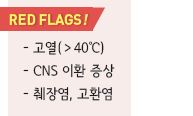
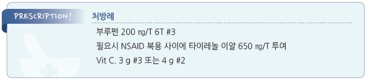

# 볼거리, 유행성이하선염 Mumps

##


## 일반 사항

* paramyxovirus 감염에 의한 편측 또는 양측 이하선의 급성 감염
* 호발 시기 : 늦겨울\~봄
* 호발 연령 : (백신 미-접종자의 경우) 5\~15세
* 잠복기 : 12~~25일(평균 16~~18일)
* 전염 기간 : 이하선염 발현 3일 전\~부종 시작 후 5일까지
* 전염 경로 : 침의 비말 감염 → 호흡기 침투 → 이하선, 췌장, 고환/난소에서 증식
* 성인은 보통 면역성이 있지만 발병하면 중증으로 나타남
* 경과 : 수 주 내 자연 치유

#### 합병증

* 이하선염 없이도 합병증이 발생할 수 있음; 백신을 접종한 경우에는 합병증 발생이 보다 적음
* 일부 합병증은 성인에서 보다 많이 발생함
*   고환염 : 사춘기 후 남자 환자의 경우 백신 미접종자는 20~~30%, 접종자는 6~~7%에서 발생

    •이하선염 증상 발생 후 8일 내 편측 고환 부종/압통(¼\~1/5에서는 양측 발생), 구역, 구토, 발열 시작

    •불임과 연관되지는 않으나 testicular atrophy, hypofertility가 발생될 수 있음
* 난소염 : 사춘기 후 여성 환자의 ≤1%에서 발생; 하복부 통증, 고열
*   기타 : 췌장염, meningitis, encephalitis, 난청; ＜1%

    •임신 중 발병 시 유산(기형 출산에 대해서는 논란)

## 원인

* 원인균 : mumps virus

### 위험 인자

* MMR 백신 미-접종 또는 불완전 접종
* 집단생활 : 학교, 기숙사, 군대
* 낮은 백신 접종률 지역 여행 : 아프리카, 서남아시아, 일본

## 임상 양상

*   전신 증상(전구 증상) : 낮은 수준의 발열(3\~4일간 지속), 두통, 근육통, 식욕 부진, malaise

    •고열 출현 시 합병증 발생을 의심
*   이하선 부종 : 전신 증상 발생 후 48시간 내 출현, 빠르게 커짐(1\~3일째에 절정; jaw angle이 사라짐), 10일 내 회복;

    처음 편측 → 양측 발생(환자의 ¼에서는 편측만 이환)

    •10%에서는 다른 침샘(submandibular, sublingual) 부종 동반
* 이하선 통증/압통 : : 신 음식을 먹을 때 심해짐
* Stensen관 개구부 발적(농 배출은 없음)
* 무증상 또는 호흡기 증상만 나타날 수 있음; 감염자의 \~⅓ 및 백신 접종자의 \~½에서 무증상
* 한 쪽 이하선이 이환-호전되고 나서 수일\~수 주 후에 다른 쪽에서 발생할 수 있음

## 진단

### 임상적 진단

* 다른 원인 없이 편측 또는 양측 이하선의 ≥2일의 부종

### 실험실 검사

* If 증상 발생 ≤3일, buccal swab specimen에 대한 RT-PCR 검사로 viral RNA 검출
* If 증상 발생 ＞3일, buccal specimen RT- PCR, serum IgM 검사
*   orchitis/oophoritis, mastitis, pancreatitis, hearing loss, meningitis, 또는 encephalitis 출현 시 날짜 관계없이

    buccal specimen RT-PCR, urine RT-PCR, serum IgM 검사
* s-IgG Ab : 발진 5일 & 2주 후 측정 비교 시 ≥4배 상승
* s-amylase↑

※ PCR 양성 시 ‘confirm’, IgM 양성 시 ‘probable’로 판정; 유행성이하선염의 유행이 확인된 때에는 검사 자원의 효율성을

```
감안하여 대체 방법을 고려함 [CDC]
```

### 영상 검사

* 고환 초음파 : 고환염 증상 시 testicular torsion 감별을 위하여 고려

### 침샘 부종 감별

#### 급성 편측

* Stone : 식사 시 부종/통증; 대부분 submandibular gland 이환
* Acute bacterial sialadenitis : 부종, 통증, 구강 내 개구부의 농성 분비물; 보통 이하선 이환

#### 급성 양측

* Viral sialadenitis : 편측에서 시작하여 양측 발생, 압통; 보통 이하선 이환

#### 만성 편측

* Tumor : 아급성, 무통성 부종
* Chronic bacterial sialadenitis : 재발성 부종/통증, 간혹 양측 발생

#### 만성 양측

* Sjögren’s syndrome : 점차 진행, 구강/안구 건조 동반
* Sarcoidosis : 점차 진행, 무통성 부종, uveitis/안면 신경 마비 동반
* Malnutrition : 간혹 편측 발생; 보통 이하선 이환

***

## Management

### 치료 방침

* 대증 치료; 항바이러스 치료제 없음

## 비-약물 치료

* 이하선에 대한 온/냉찜질
* 충분한 수분 및 영양 섭취

## 약물 치료

#### 해열진통제

* ibuprofen : 400\~800 ㎎ tid \[부루펜]
* acetaminophen : 650\~1,300 ㎎ tid \[타이레놀]

#### 기타

* Vit C 대용량법(≥3 g/d) : 일부에서 효과
* IVIG : 감염 후 뇌염, 길랭바레증후군, ITP에서 효과
* Interferon-α2b : 심한 양측 고환염에서 고려

※ steroid는 testosterone 농도를 낮추고 testicular 위축을 조장하여 고환염 위험 인자가 되므로 투여하지 않음

## 예방 및 관리

* 사회 격리(출근/등교 제한) : 이하선염(부종) 발생 후 5일간
* 면역성이 없는 사람은 집단 내에서 마지막 환자 발생 후 26일 이후 복귀
* 백신 (☞ p.1119)

※ 노출 후의 백신 접종은 노출에 대한 예방 효과가 없음

> **질병코드** B26 볼거리


