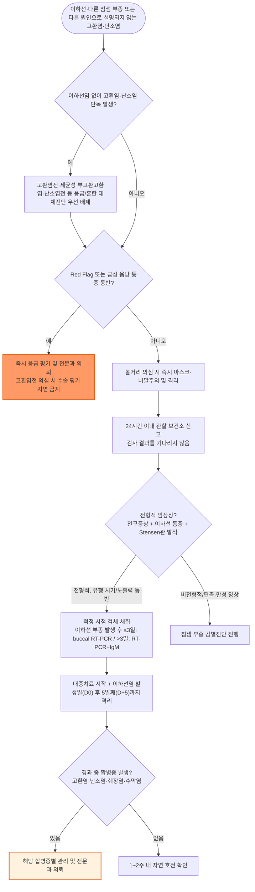

# 볼거리 (유행성이하선염) Mumps

## <mark style="color:green;">일반 사항</mark>

* paramyxovirus 감염에 의한 편측 또는 양측 이하선의 급성 바이러스 감염
* 다른 이름 : 유행성이하선염, epidemic parotitis
* 국내 역학 : 최근 4\~9세 학동전기·초등학교 저학년에서 신고 비중이 가장 높으며, 학교·보육시설 등 집단시설에서 국지적 유행이 발생할 수 있음
* 국외(고접종률 국가) 역학 : 대학, 군부대, 기숙사, 종교공동체 등 밀접·집단생활 환경을 중심으로 유행이 반복될 수 있으며, 2회 접종 완료자에서도 환자가 발생할 수 있음
* 잠복기 : 12\~25일(대개 16\~18일)
* 전염 경로 : 침의 비말 및 직접 접촉 감염 → 상기도 침투·증식 → 국소 림프절 증식 → 바이러스혈증 → 이하선, 수막, 췌장, 고환/난소 등 침범
* 자연 감염 후 대개 장기간 면역을 획득하지만, 드물게 재감염 또는 재발성 이하선염이 보고됨
* 경과 : 대개 1\~2주 내 자연 치유되는 자기 제한성 질환

#### <mark style="color:$primary;">전염기간 및 감염관리</mark>

* 전염기간 : 이하선(또는 타액선) 부종 발생 3일 전부터 발생 후 5일까지
* 환자는 이하선염 발생 후 5일까지 표준주의와 비말주의를 적용
* 외래에서는 진단 확정 전이라도 의심 단계부터 마스크 착용, 다른 환자와의 분리, 가능하면 진료 시간·공간 분리를 시행

#### <mark style="color:$primary;">유행 역학 참고</mark>

* MMR 백신 평균 예방 효과는 2회 접종 시 약 86%(연구별로 32\~95%까지 다양하게 보고), 1회 접종 시 약 72%(연구별로 49\~91%까지 다양하게 보고) \[CDC, 2025]
* 고접종률 집단에서의 유행은 시간 경과에 따른 면역 감소(waning immunity)가 주요 설명 중 하나이며, 개인별 백신 면역반응 차이, 유행 바이러스주와 백신주 사이의 항원성 차이, 자연 노출에 의한 면역 부스팅 감소 등도 가능한 기전으로 논의됨
* 유행 상황에서 미국 ACIP은 공중보건당국이 고위험군으로 지정한 집단(2회 접종 완료자 포함)에게 3차 MMR 접종을 권고함(2018년 권고, 현재도 유효한 **미국 ACIP의 유행 대응 권고**); 국내에서는 관할 보건당국의 유행 대응 지침에 따름

#### <mark style="color:$primary;">임상 양상 관련 참고 — 무증상 비율</mark>

* 미접종 감염자의 약 20%는 무증상일 수 있으며, 백신 접종자에서의 무증상 감염 비율은 명확하지 않음 \[CDC]

#### <mark style="color:$primary;">합병증</mark>

* 이하선염 없이도(또는 이하선염에 선행하여) 합병증이 발생할 수 있음; 백신 접종자에서는 합병증이 전반적으로 더 드물고 중증도가 낮음

<table><thead><tr><th width="150">합병증</th><th width="150">미접종자</th><th>접종 완료자</th></tr></thead><tbody><tr><td>고환염(사춘기 후 남성)</td><td>30%</td><td>6%</td></tr><tr><td>난소염(사춘기 후 여성)</td><td>7%</td><td>≤1%</td></tr><tr><td>유선염(mastitis)</td><td>30%</td><td>≤1%</td></tr><tr><td>췌장염</td><td>4%</td><td>&#60;1%</td></tr><tr><td>청력 저하(hearing loss)</td><td>4%</td><td>&#60;1%</td></tr><tr><td>무균성 수막염</td><td>&#60;1\~10%</td><td>≤1%</td></tr><tr><td>뇌염</td><td>≤1%</td><td>≤1%</td></tr></tbody></table>

<p align="center"><em><mark style="color:$info;">Ref. CDC Manual for the Surveillance of Vaccine-Preventable Diseases, Chapter 9: Mumps, Table 1</mark></em></p>

* 고환염 : 이하선염 증상 발생 후 8일 내 편측 고환 부종/압통(¼\~1/5에서는 양측 발생), 구역, 구토, 발열 동반 가능; testicular atrophy가 발생할 수 있고, 일시적인 정자 수 감소(oligospermia)나 정자 운동성 저하 등 생식능 저하(subfertility)가 보고될 수 있으나 **영구 불임과의 연관성은 확립되지 않음**
* 청력 저하는 일시적일 수도, 영구적일 수도 있음
* 임신 초기 감염과 자연유산 위험의 연관성이 과거 일부 연구에서 제시되었으나, 현재까지 명확한 연관성은 확인되지 않음; 선천 기형과의 연관성도 확인되지 않음

## <mark style="color:green;">원인 및 위험 인자</mark>

* 원인 바이러스 : mumps virus(MuV); 현행 ICTV 기준 species는 *Orthorubulavirus parotitidis*, genus는 Orthorubulavirus, family는 Paramyxoviridae('Mumps orthorubulavirus'는 과거 species 명칭에 가까운 동의어)

### <mark style="color:orange;">위험 인자</mark>

* MMR 백신 미접종 또는 불완전 접종(2회 미만)
* 백신 접종 완료 후 시간 경과에 따른 면역 감소 등(☞ 상기 유행 역학 참고) — 유행 상황에서는 접종 완료자도 발병 가능
* 집단생활 : 학교, 기숙사, 군대, 밀집된 직장·종교시설
* 볼거리 유행 또는 지속 발생 지역 여행

## <mark style="color:green;">임상 양상</mark>

* 전신 증상(전구 증상) : 낮은 수준의 발열(3\~4일간 지속), 두통, 근육통, 식욕 부진, malaise
  * 고열이 나타나면 합병증 발생을 의심
* 이하선 부종 : 전신 증상 발생 후 48시간 내 출현, 빠르게 커짐(1\~3일째 절정; jaw angle이 사라짐), 10일 내 회복; 처음 편측 → 양측으로 진행(환자의 ¼에서는 편측만 이환)
  * 10%에서는 다른 침샘(submandibular, sublingual) 부종 동반
* 이하선 통증/압통 : 신 음식을 먹을 때 심해짐
* Stensen관 개구부 발적(농 배출은 없음)
* 무증상 또는 호흡기 증상만 나타날 수 있음(☞ 상기 무증상 비율 참고)
* 한쪽 이하선이 이환·호전된 후 수일\~수 주 후에 다른 쪽에서 발생할 수 있음
* 이하선염 없이 고환염·난소염 등 합병증만으로 나타날 수도 있음(☞ 하단 진단 섹션 참고)

### <mark style="color:$danger;">🚩 Red Flags!</mark>

<mark style="color:$danger;">**즉각 조치 또는 의뢰**</mark>

* 고열(＞40℃) 또는 두통·구토와 함께 의식 변화, 경부 강직 등 뇌수막염·뇌염 시사 소견 → 즉시 응급 평가
* 급성으로 매우 심하거나 갑작스럽게 발생한 편측 음낭 통증·부종 → **고환염전(testicular torsion)으로 간주**하고 즉시 응급 비뇨의학과 평가; Doppler 초음파 시행이 수술적 평가를 지연시켜서는 안 됨
* 심한 상복부 통증 + 반복 구토 → 중증 췌장염 의심, 응급 평가(serum lipase 확인)

<mark style="color:$warning;">**당일 또는 조기 의뢰**</mark>

* 고환염/난소염 시사 소견(이하선염 후 편측 고환 부종·압통, 또는 하복부 통증·발열) → 당일 비뇨의학과/산부인과 평가
* 의식은 명료하나 지속적인 두통·구토·발열 등 무균성 수막염 시사 소견 → **당일 응급실 또는 입원·요추천자가 가능한 의료기관**에서 평가
* 임신부(특히 1분기)의 이하선염 발병 → 산과 상담
* 지속적인 상복부 통증 → serum lipase 확인 및 당일 평가(amylase 단독 상승은 이하선 침범만으로도 나타날 수 있어 췌장염에 특이적이지 않음)

<mark style="color:$info;">**외래 추적 / 추가 평가 계획**</mark> <mark style="color:$info;">- 즉각 위험 낮으나 호전 없으면 의뢰</mark>

* 10일 이상 지속되는 이하선 부종으로 호전이 없는 경우 → 종양, 소아 재발성 이하선염 등 다른 원인 감별 위해 이비인후과 의뢰
* 회복 후에도 지속되는 청력 저하 호소 → 이비인후과 청력 검사 의뢰
* 백신 접종력 불명확 + 집단생활 등 반복 노출 위험 → 예방접종 상담

## <mark style="color:green;">진단</mark>

### <mark style="color:orange;">신고 및 격리</mark>

* 유행성이하선염은 국내 **제2급 법정감염병**으로, 환자 또는 의사환자를 진단한 경우 **24시간 이내** 관할 보건소에 신고
* 검사 결과를 기다리지 않고 **의심 단계부터** 격리(마스크 착용, 타 환자와의 분리)와 신고 절차를 진행
* 국내 유행 기준(참고) : 3주 이내 한 학급에서 (의사)환자가 학급 전체 인원의 5% 이상 발생(학급 인원이 20명 미만인 경우 최소 2명 이상), 또는 시간적·공간적으로 연관된 환자·의사환자 2명 이상 발생; 동거가족 내 발생에 한정되는 경우에는 일반적으로 유행 역학조사 대신 환자·접촉자 관리를 시행 \[질병관리청 2025년도 예방접종대상감염병 관리지침]

### <mark style="color:orange;">임상적 진단</mark>

* 국내 신고 기준상 **의사환자**는 임상증상과 역학적 연관성을 감안하여 유행성이하선염이 의심되지만 진단검사 결과가 없는 사람을 말함
* 임상증상에는 최소 2일 이상 지속되는 급성 이하선염이나 다른 침샘염뿐 아니라, **다른 진단으로 설명되지 않는 고환염 또는 난소염**도 포함됨 \[질병관리청 2025년도 예방접종대상감염병 관리지침, 표 36]

✽이하선염 없이 고환염·난소염만으로 내원한 경우도 국내 신고 기준의 임상증상에 해당하므로 볼거리 가능성을 배제하지 않되, **고환염전·세균성 부고환고환염·난소염전 등 더 흔하거나 응급인 대체 진단을 먼저 배제**한 뒤 역학적 연관성과 검사 결과를 함께 평가

### <mark style="color:orange;">실험실 검사</mark>

* 이하선(또는 다른 침샘) 부종 발생 후 ≤3일인 경우 : buccal swab specimen에 대한 RT-PCR 검사로 viral RNA 검출
* 이하선(또는 다른 침샘) 부종 발생 후 ＞3일인 경우 : buccal specimen RT-PCR, serum IgM 검사 병행 — 백신 접종자는 IgM이 위음성일 수 있어 **RT-PCR이 진단의 핵심 검사**임
* orchitis/oophoritis, mastitis, pancreatitis, hearing loss, meningitis, encephalitis 등 합병증이 이하선염 없이도 나타난 경우, 발생 시점과 무관하게 buccal specimen RT-PCR과 serum IgM을 시행; urine RT-PCR은 특히 고환염에서 추가로 고려하며 관할 보건환경연구원 등 검사기관의 검체 기준에 따름
* RT-PCR용 검체는 가능한 한 이하선(또는 다른 침샘) 부종 발생 3일 이내 채취가 적정하며, 최대 14일까지 채취할 수 있음
* paired serum IgG : 급성기 혈청은 증상 발생 3일 이내, 회복기 혈청은 급성기 검체 채취 약 2주 후 채취하여 항체가의 ≥4배 상승 여부 평가; 다만 백신 접종자에서는 증상 발생 시 이미 IgG가 높아 4배 상승이 확인되지 않는 경우가 많아 RT-PCR이 우선
* s-amylase↑ : 이하선 침범만으로도 상승할 수 있어 췌장염에 특이적이지 않음 — 지속적인 상복부 통증·구토가 있으면 serum lipase를 우선 확인하고, 임상적으로 필요한 경우 영상검사를 시행


**국내 사례분류와 미국 CDC 사례분류의 차이**\
국내 신고 기준에서는 임상증상(급성 이하선염·다른 침샘염, 또는 다른 진단으로 설명되지 않는 고환염·난소염)과 역학적 연관성을 감안하여 '의사환자'를 규정하며, 바이러스 분리, 특이 유전자(RT-PCR) 검출, 특이 IgM 항체 검출, 또는 급성기\~회복기 IgG 항체가 4배 이상 상승 중 하나가 확인되면 '환자'로 분류함. 미국 CDC 사례분류에서는 PCR 양성 시 'confirmed', IgM 단독 양성 시 'probable'로 구분하므로 국내 신고 분류와 혼동하지 않음. 백신 접종자는 IgM 음성이 흔하므로 IgM 음성 결과만으로 볼거리를 배제하지 않음


### <mark style="color:orange;">영상 검사</mark>

* 고환 초음파 : 고환염 증상 시 testicular torsion 감별을 위해 고려(응급 상황에서는 지체 없이 시행하되, 검사가 수술적 평가를 지연시키지 않아야 함)

### <mark style="color:orange;">감별 진단</mark>

* 침샘 부종의 급성/만성, 편측/양측 양상에 따른 감별이 핵심; 경부 림프절염 등 침샘 외 구조물의 부종과의 감별도 필요

<table><thead><tr><th width="90">구분</th><th width="190">질환</th><th>핵심 특징</th></tr></thead><tbody><tr><td>급성 편측</td><td>Sialolithiasis(침샘결석)</td><td>식사 시 악화되는 부종·통증; 대부분 submandibular gland 이환</td></tr><tr><td>급성 편측</td><td>급성 세균성 이하선염</td><td>발적, 통증, Stensen관 개구부에서 농성 분비물; 보통 이하선 이환</td></tr><tr><td>급성 편측</td><td>치성 감염(치아·잇몸 농양)</td><td>구강 검진에서 원인 치아 확인, 국소 압통</td></tr><tr><td>급성 편측 또는 양측</td><td>경부 림프절염/림프절비대</td><td>침샘이 아닌 하악각 뒤·목 옆에서 촉지되는 경계가 뚜렷한 결절</td></tr><tr><td>급성 양측</td><td>바이러스성 이하선염(볼거리 외 parainfluenza, EBV, 콕사키바이러스, HIV 등)</td><td>편측에서 시작하여 양측으로 진행, 압통 동반; 보통 이하선 이환</td></tr><tr><td>만성 편측 또는 재발성</td><td>소아 재발성 이하선염(juvenile recurrent parotitis)</td><td>수개월\~수년간 반복되는 편측 이하선 부종, 세균감염 없이 자연 호전과 재발을 반복</td></tr><tr><td>만성 편측</td><td>종양(양성/악성)</td><td>아급성, 서서히 진행하는 무통성 부종</td></tr><tr><td>만성 편측</td><td>만성 세균성 이하선염</td><td>재발성 부종·통증, 간혹 양측 발생</td></tr><tr><td>만성 양측</td><td>Sjögren's syndrome</td><td>점진적 진행, 구강·안구 건조 동반</td></tr><tr><td>만성 양측</td><td>Sarcoidosis</td><td>점진적, 무통성 부종, uveitis·안면신경마비 동반 가능</td></tr><tr><td>만성 양측</td><td>영양실조(Malnutrition)</td><td>간혹 편측 발생; 보통 이하선 이환</td></tr></tbody></table>

***


```mermaid
graph TD
    A(["이하선·다른 침샘 부종 또는 다른 원인으로 설명되지 않는 고환염·난소염"]) --> M{"이하선염 없이 고환염·난소염 단독 발생?"}
    M -- 예 --> N["고환염전·세균성 부고환고환염·난소염전 등 응급/흔한 대체진단 우선 배제"]
    N --> B{"Red Flag 또는 급성 음낭 통증 동반?"}
    M -- 아니오 --> B
    B -- 예 --> F["즉시 응급 평가 및 전문과 의뢰<br/>고환염전 의심 시 수술 평가 지연 금지"]
    B -- 아니오 --> C["볼거리 의심 시 즉시 마스크·비말주의 및 격리"]
    C --> D["24시간 이내 관할 보건소 신고<br/>검사 결과를 기다리지 않음"]
    D --> E{"전형적 임상상?<br/>전구증상 + 이하선 통증 + Stensen관 발적"}
    E -- 전형적, 유행 시기/노출력 동반 --> G["적정 시점 검체 채취<br/>이하선 부종 발생 후 ≤3일: buccal RT-PCR / >3일: RT-PCR+IgM"]
    E -- 비전형적/편측·만성 양상 --> H["침샘 부종 감별진단 진행"]
    G --> I["대증치료 시작 + 이하선염 발생일(D0) 후 5일째(D+5)까지 격리"]
    I --> J{"경과 중 합병증 발생?<br/>고환염·난소염·췌장염·수막염"}
    J -- 있음 --> K["해당 합병증별 관리 및 전문과 의뢰"]
    J -- 없음 --> L["1~2주 내 자연 호전 확인"]
    style F fill:#f96,stroke:#e65100,stroke-width:2px
    style K fill:#fff3e0,stroke:#e65100,stroke-width:2px
```

<p align="center"><strong>신고·격리·진단·관리 알고리듬</strong></p>

<p align="center"><em><mark style="color:$info;">Ref. 질병관리청 2025년도 예방접종대상감염병 관리지침; CDC Mumps Clinical Overview & Public Health Strategy(2026)</mark></em></p>

***

## <mark style="background-color:$warning;">Management</mark>


**대증 치료가 원칙 — 특이적 항바이러스 치료제는 없음**


### <mark style="color:orange;">치료 방침</mark>

* 특이적 항바이러스 치료 없음; 증상 조절과 합병증 조기 인지가 관리의 핵심
* 대부분 외래에서 대증 치료로 관리 가능
* Red Flag 동반 시 해당 전문과 즉시/당일 의뢰
* 진단(의심) 즉시 신고 및 격리 조치 여부 확인

## <mark style="color:green;">비-약물 치료 및 예방</mark>

* 이하선에 대한 온/냉찜질(증상에 따라 선택)
* 충분한 수분 및 영양 섭취; 신 음식·자극적인 음식은 이하선 통증을 악화시킬 수 있어 피함
* 고환염 동반 시 : 침상 안정, 음낭 거상(scrotal support/elevation)이 통증 완화에 도움

### <mark style="color:orange;">격리 및 접촉자 관리</mark>

* 사회 격리(등교/출근 제한) : 이하선(또는 타액선) 부종 **발생일을 0일(D-day)로 하여 5일째(D+5)까지** 격리하고, 상태가 호전되면 **6일째부터** 등교·출근 가능
* 접촉자는 면역 여부와 관계없이 마지막 노출 후 **25일까지** 증상 발생 여부를 관찰; 면역의 증거가 없는 접촉자는 MMR 접종을 완료하도록 안내(노출 후 접종은 이미 진행 중인 감염은 예방하지 못함)
* 유행 시설(학교·기숙사 등)에서 미접종자를 일시적으로 배제할지 여부는 관할 보건당국의 유행 대응 지침에 따름 — 일반 접촉자를 일률적으로 배제하지 않음
* 백신 (☞ [예방접종](../231_/210_-vaccination.md#mmr-1)) — 유행 시 3차 MMR 관련 권고는 상기 '유행 역학 참고' 항목 참조


**노출 후 백신 접종의 한계**\
이미 노출되어 감염이 진행 중인 경우 백신 접종은 해당 노출에 대한 예방 효과가 없음. 다만 이번 노출로 감염되지 않았다면 접종은 향후 노출에 대한 예방 효과를 가짐


## <mark style="color:green;">약물 치료</mark>

### <mark style="color:orange;">해열진통제</mark>

* 성인 ibuprofen : 200\~400 ㎎ 필요시 우선 사용(신장·위장관 상태 고려); 800 ㎎ tid는 통증이 심한 경우 단기간 처방으로 제한 <mark style="color:blue;">\[부루펜]</mark>
* 성인 acetaminophen(속방형) : 500\~1,000 ㎎, 6\~8시간 간격 필요시 <mark style="color:blue;">\[타이레놀]</mark>
* 성인 acetaminophen(서방형, 8시간 이알) : 650 ㎎/T 2T, 8시간 간격 필요시, 1일 최대 6T <mark style="color:blue;">\[타이레놀 8시간 이알]</mark>
* 소아 acetaminophen : 10\~15 ㎎/㎏/회, 4\~6시간 간격 필요시, 1일 최대 75 ㎎/㎏(성인 최대용량 초과 금지)
* 소아 ibuprofen : 5\~10 ㎎/㎏/회, 6\~8시간 간격 필요시(생후 6개월 이상), 1일 최대 40 ㎎/㎏
* 소아에게는 두 약제 중 **하나를 우선 선택**; 일상적인 동시 또는 교차 투여는 권장하지 않으며, 필요한 경우 투여시간표를 명확히 안내
* 소아·청소년에게는 **aspirin 금기**(Reye 증후군 위험)
* 성인에서 두 약제 병용이 필요한 경우 각 성분의 투여 간격과 1일 최대 용량을 처방전에 명확히 기재; 서방형(이알) 제제는 8시간 투여 간격 준수가 필요함을 고려
* NSAID는 신장질환, 소화성궤양, 항응고제 복용, 탈수 환자에서 주의

### <mark style="color:orange;">합병증별 관리</mark>

* 고환염/난소염 : 침상 안정, 음낭 거상(고환염), 해열진통제로 통증 조절; 심한 경우 비뇨의학과/산부인과 의뢰
* 볼거리 감염 후 길랭-바레증후군, 면역혈소판감소증 등 **별도의 면역매개질환**이 진단된 경우에는 해당 질환의 적응증과 전문과 지침에 따라 IVIG를 사용할 수 있음. 이는 볼거리 자체에 대한 치료 또는 수동면역요법이 아님

### <mark style="color:orange;">권고되지 않는 치료</mark>


**근거가 불충분하거나 효과가 입증되지 않아 권고하지 않음**

* 항바이러스제 : 볼거리에 특이적인 항바이러스 치료제는 없음
* 전신 corticosteroid : 고환염에서 통증·부종을 일시 완화할 수 있으나, 임상 경과나 고환 위축을 예방하는 효과는 입증되지 않아 일상적으로 권고하지 않음
* Interferon-α2b : 과거 중증·양측 고환염에서 연구되었으나, 고환 위축이나 생식기능 저하를 예방하는 효과가 입증되지 않아 현재 일상 진료에서 권고하지 않음
* 수동면역요법(면역글로불린 등)의 볼거리 자체에 대한 예방·치료 목적 사용


***

### <mark style="color:red;">질병코드</mark>

B26 볼거리(유행성이하선염)

B26.0 볼거리 고환염

B26.1 볼거리 수막염

B26.2 볼거리 뇌염

B26.3 볼거리 췌장염

B26.8 기타 합병증을 동반한 볼거리

B26.9 합병증이 없는 볼거리

***

## <mark style="color:purple;">처방례</mark>

> **처방례 1. 성인, 경증(합병증 없는 전형적 이하선염)**
>
> ```
> 부루펜 200 ㎎/T  6T  #3
> 필요시 NSAID 복용 간격 사이에 타이레놀 500 ㎎/T  1~2T  투여, 6~8시간 간격(속방형)
> ```
>
> _✽대부분 대증 치료만으로 1\~2주 내 자연 호전; 신 음식 등 자극적 식이 회피 교육 병행_

> **처방례 2. 성인, 통증·발열이 심한 경우**
>
> ```
> 부루펜 400 ㎎/T  6T  #3
> 필요시 NSAID 복용 간격 사이에 타이레놀 8시간 이알 650 ㎎/T  2T  투여, 8시간 간격, 1일 최대 6T
> ```
>
> _✽800 ㎎ tid 등 고용량 NSAID는 단기간 처방으로 제한; 신장·위장관·항응고제 복용 여부 확인_

> **처방례 3. 소아(예시: 체중 20 ㎏ 내외), 경증**
>
> ```
> 아세트아미노펜 시럽  10~15 ㎎/㎏/회(약 200~300 ㎎/회)  4~6시간 간격 필요시  (1일 최대 75 ㎎/㎏)
> ※ 또는 이부프로펜 시럽  5~10 ㎎/㎏/회(약 100~200 ㎎/회)  6~8시간 간격 필요시(생후 6개월 이상)  (1일 최대 40 ㎎/㎏)
> ※ 두 약제 중 하나를 우선 선택; 일상적인 동시·교차 투여는 권장하지 않음
> ```
>
> _✽소아·청소년에게 aspirin은 투여하지 않음(Reye 증후군 위험); 체중에 맞추어 용량 재계산 필요_

> **처방례 4. 고환염 동반**
>
> ```
> 부루펜 400 ㎎/T  6T  #3
> 필요시 NSAID 복용 간격 사이에 타이레놀 500 ㎎/T  1~2T  투여, 6~8시간 간격
> ※ 침상 안정 및 음낭 거상(scrotal support) 병행
> ※ corticosteroid는 효과가 입증되지 않아 투여하지 않음
> ※ 편측 고환의 급성·심한 부종/압통은 testicular torsion으로 간주하고 즉시 초음파 및 비뇨의학과 의뢰(초음파가 수술 평가를 지연시키지 않도록 함)
> ```
>
> _✽고환염은 이하선염 발생 후 8일 이내 발생할 수 있으나, 이하선염 없이 고환염만 나타날 수도 있음 — 먼저 고환염전 등 응급·흔한 대체 진단을 배제한 후 통증 조절과 함께 합병증(atrophy, subfertility) 가능성을 사전에 설명_

***

### <mark style="color:$success;">핵심 복약 지도</mark>

> **신고 및 격리**
>
> * 진단(의심 포함) 즉시 24시간 이내 관할 보건소 신고 대상임을 인지
> * 이하선 부종 발생일을 0일(D-day)로 하여 5일째(D+5)까지 등교·출근을 제한하고, 6일째부터 복귀 가능함을 안내

> **해열진통제 사용**
>
> * ibuprofen과 acetaminophen은 서로 다른 기전이므로 필요시 교차 복용 가능하나, 각 약물의 1일 최대 용량과 투여 간격(속방형 6\~8시간, 서방형 8시간)을 넘기지 않도록 함
> * 소아에게는 체중별 용량을 재확인하고, 두 약제 중 하나를 우선 선택하며, aspirin은 사용하지 않음
> * 고열 지속(＞40℃) 또는 진통제로 조절되지 않는 통증은 합병증을 시사할 수 있음을 안내

> **고환염 발생 시 주의사항**
>
> * 편측 고환의 급성 부종·통증은 볼거리 고환염과 testicular torsion 감별이 필요함을 설명하고, 통증이 매우 심하거나 갑자기 발생하면 즉시 내원하도록 안내
> * corticosteroid는 고환 위축 예방 효과가 입증되지 않아 사용하지 않음을 설명
> * 양측 고환염의 경우 일시적인 정자 수 감소(oligospermia)나 생식능 저하(subfertility)가 보고될 수 있으나 영구 불임과의 연관성은 확립되지 않았음을 설명하고, 필요시 비뇨의학과 추적 관찰을 권고

> **언제 다시 병원을 방문해야 하나요?**
>
> * 고열(＞40℃)이 지속되거나 두통·구토와 함께 목이 뻣뻣해지는 경우 — 즉시 내원
> * 갑작스럽고 심한 한쪽 고환 통증·부종이 있는 경우 — 즉시 내원
> * 심한 상복부 통증과 반복 구토가 있는 경우 — 즉시 내원
> * 이하선 부종이 10일 이상 지속되며 호전이 없는 경우 — 재평가 필요

***

### <mark style="color:blue;">환자 안내서</mark>


**볼거리는 대부분 저절로 좋아지지만, 전염력이 있는 기간을 반드시 지켜주세요**

볼거리(유행성이하선염)는 바이러스가 침샘(주로 귀밑샘)을 침범해 얼굴 양쪽 또는 한쪽이 붓고 아픈 병입니다. 대부분 1\~2주 안에 저절로 좋아지지만, 침 방울을 통해 다른 사람에게 옮길 수 있어 일정 기간 사람들과의 접촉을 피해야 하고, 법정감염병으로 병원에서 보건소에 신고하게 됩니다.


#### <mark style="color:$primary;">왜 생기나요?</mark>

* 볼거리 바이러스가 침이나 기침·재채기의 작은 물방울을 통해 옮습니다.
* 감염 후 증상이 나타나기까지 보통 2\~3주(12\~25일) 정도 걸립니다.
* 예방접종(MMR)을 2번 다 맞았어도 시간이 지나면서 면역력이 줄어들어 걸릴 수 있습니다.

#### <mark style="color:$primary;">얼마나 조심해야 하나요?</mark>

* **볼이 붓기 시작한 날을 1일째로 하여 5일째까지는 학교나 직장에 가지 마시고, 6일째부터 갈 수 있습니다.** 이 기간이 다른 사람에게 옮길 위험이 가장 높습니다.
* 컵이나 수저를 같이 쓰지 말고, 기침·재채기 시 옷소매로 입을 가리십시오.
* 가족 중 예방접종을 하지 않았거나 접종 여부가 불확실한 사람이 있다면, 마지막으로 접촉한 날로부터 **최대 25일까지** 증상이 나타나는지 지켜봐 주십시오. 접종 이력이 없다면 이 기회에 MMR 접종을 받는 것이 좋습니다.

#### <mark style="color:$primary;">집에서는 어떻게 관리하나요?</mark>

* **충분히 쉬고 물을 자주 드십시오.** 열이 나면 탈수되기 쉽습니다.
* **신 과일이나 신 음료(오렌지주스 등)는 피하십시오.** 침샘을 자극해 통증이 더 심해질 수 있습니다.
* 부은 부위에 따뜻하거나 차가운 찜질을 해 주면 통증 완화에 도움이 됩니다.
* 부드러운 음식(죽, 스프 등) 위주로 드시면 씹을 때의 통증을 줄일 수 있습니다.
* 소아에게 해열진통제를 줄 때는 체중에 맞는 용량을 확인하고, **아스피린은 사용하지 마십시오.**

#### <mark style="color:$primary;">남자아이·성인 남성은 특히 주의하세요</mark>

* 사춘기 이후 남성은 볼거리 후 한쪽 고환이 붓고 아플 수 있습니다(고환염). 대부분 저절로 좋아지고 불임으로 이어지는 경우는 드물지만, **갑작스럽고 심한 통증**이 생기면 다른 응급 질환(고환염전)과 구별이 필요하므로 즉시 병원에 가야 합니다.

#### <mark style="color:$primary;">이럴 때는 즉시 병원을 방문하세요</mark>

* 심한 두통과 함께 목이 뻣뻣해지거나 정신이 혼미해지는 경우
* 갑작스럽고 심한 한쪽 고환 통증·부종
* 심한 배 통증과 반복적인 구토
* 매우 높은 열이 지속되거나 해열제를 먹어도 잘 조절되지 않는 경우
