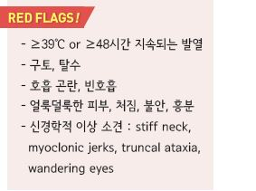
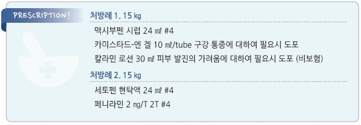

# 수족구병 Hand-Foot-Mouth Disease

## 일반 사항

* 호발 시기 : 여름~~가을(5월~~10월)
* 위험 인자 : ＜10세(특히 ＜5세); 유아원/학교
* 잠복기 : 3\~7일
*   전염 기간 : 증상 발생 첫 1주 동안 가장 높음; 무증상인 경우에도 전염력 있음, 증상 회복 후에도 대변으로 수 주간 균 배출

    및 전파 가능
* 전염 경로 : 환자의 코/목 분비물, 침(비말), 물집 진물, 분변 접촉 → 눈/코/입을 통하여 침입
* 경과 : 7\~10일 내 자연 치유
* 합병증 : 탈수, viral(aseptic) meningitis(매우 드묾)

## 원인

*   원인균 : coxsackievirus(A16이 가장 흔함), enterovirus 71

    •coxsackievirus A6에 의한 비전형적 HFMD가 증상은 보다 심함

## 임상 양상

* 전구 증상(열 등 전신 증상) 후 구강 및 피부 병변 발생

#### 전구 증상

* 미열, malaise, 복통, 식욕 부진, 호흡기 증상
* 구강 병변 발생 1\~2일전 출현

#### 구강

* 발생 부위 : 혀 측면, 볼 점막, 뒤쪽 인두, 입천장, 잇몸, 입술
* 형태 : 붉은 구진 → 수포 → 주위 홍반을 동반한 4\~8 ㎜의 얕은 궤양으로 진행
* 통증. 특히 음식물 접촉 시 심한 통증

#### 피부

*   발생 부위 : 주로 손발(특히 손발바닥); 간혹 엉덩이, 무릎, 팔꿈치 (✽Nelson Textbook에는 손발의 등 쪽에 보다 흔한 것으로

    기술되어 있으나 CDC나 NHS에는 바닥 쪽에 더 많은 것으로 기술되어 있음)
* 형태 : 압통이 있는 반구진 → 3\~7 ㎜의 수포, 농포, 궤양 형성
* 피부 병소는 2차 문제가 발생하지 않는 한 흉터를 남기지 않음

#### 전신

* 발열 : 보통 미열; 피부/점막 병변이 발생하기 1~~2일전에 출현하여 3~~4일간 지속
* 드물게 CNS 침범 : 빈맥, 빈호흡, 처짐, 불안정, 신경학적 이상(예: 근간대성 경련)
* 탈수 : 구강 섭취를 못하는 경우에 발생

## 진단

### 검사

* 일반적으로는 시행하지 않음
* 항원 검사
* PCR 검사 : throat swab, vesicle fluid로 시행할 수 있음
* 바이러스 배양 : 병소, 대변, CSF 등의 검체로 시행할 수 있음

### 감별

*   Herpetic gingivostomatitis : 주로 잇몸의 병소 및 전신 증상(예: 발열, 완연한 병색, 경부 림프절병증); 손발이나 사지의

    이환은 없음 (☞ p.959)
*   Aphthous stomatitis : 입술, 혀 및 볼 점막의 심한 통증의 큰 궤양; 보다 나이든 소아 또는 성인 발병. 재발성;

    전신 증상은 드묾 (☞ p.264)
*   옴 감염증 : 수족구와 비슷한 모양의 피부 병소. 심한 가려움; 손에서는 주로 손가락 사이에 분포하며 손발바닥에는 드묾

    (☞ p.971)
* 수두 : 수포로 시작하여 딱지 형성(수족구에서는 딱지 없이 흡수됨); 전신 분포 (☞ p.950)
* 홍역 : 기침, 콧물, 결막염 등 동반. 발진 발생 후 고열 발생 (☞ p.1036)
* 풍진 : 구심성 분포, 후두부 림프절병증

***

## Management

### 치료 방침

* 대증 치료 : 자극적 음식 회피, 진통제
* 탈수가 발생한 경우 IV fluid 치료

## 비-약물 치료

* 충분한 수분 섭취
* 시거나 매운 음식 섭취를 피함
* 구강 통증에 대하여 맵고, 짜고, 신 자극적인 음식을 피하고 찬 음식 선택. 예: 칼로리 높은 아이스크림, 시지 않은 과일 주스

## 약물 치료

* 항바이러스제(예: acyclovir) : 효과 없음; 약제의 작용 기전이 원인균 발병 기전과 다름
* acetaminophen : 10~~15 ㎎/㎏ q4~~6hr, 최대 5회/d; ≥3개월 연령 허가

\[세토펜 현탁액]\(32 ㎎/㎖. 0.4 ㎖/㎏ qid 또는 1.5\~2 ㎖/㎏/d #4)

* ibuprofen : 5~~10 ㎎/㎏ q6~~8hr, 최대 40 ㎎/㎏/d; ≥6개월 연령 허가

\[부루펜 시럽]\(20 ㎎/㎖. 0.25~~0.5 ㎖/㎏ tid~~qid 또는 1.5 ㎖/㎏/d #3\~4)

* 구강 국소 마취제(lidocaine) : 필요시, 2시간 이상 간격 도포 [카미스타드-엔](../%E2%89%A512%EC%84%B8/)

> ✽소아에서 lidocaine 함유 양치액이 위약보다 유효하지 않으며 전신 흡수 부작용 위험이 있다는 보고가 있음

### 소양증

* chlorpheniramine : 0.5 ㎎/㎏/d #4 \[페니라민]
* hydroxyzine : 25~~50 ㎎ hs or 50~~100 ㎎/d #3\~4 \[유시락스 시럽, 아디팜]

## 예방 및 관리

* 손 씻기(특히 음식물을 다룰 때, 기저귀를 교체할 때)
* 식기의 공동 사용 주의
* 수영장 주의
* 격리 : 발열 및 구강 궤양, 피부 수포가 사라질 때까지 격리(등교 제한)

> **질병코드** B08 달리 분류되지 않은 피부 및 점막병변이 특징인 기타 바이러스감염

B34 상세불명 부위의 바이러스감염

