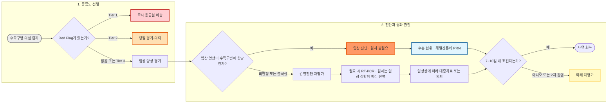

# 수족구병 Hand-Foot-Mouth Disease (HFMD)

## <mark style="color:green;">일반 사항</mark>

* 정의 : 콕사키바이러스 등 엔테로바이러스 감염에 의해 발열, 구강 내 수포·궤양 및 손·발의 수포성 발진을 주로 나타내는 급성 바이러스 질환. 모든 환자에서 세 가지 소견이 모두 나타나는 것은 아님
* 분류 : 제4급 법정감염병(표본감시 대상)
* 호발 시기 : 온대 지역에서는 주로 여름\~초가을. 국내에서는 대체로 5월부터 증가하지만 유행 시기는 해마다 달라질 수 있음
* 호발 연령 : 주로 10세 미만, 특히 5세 이하 영유아. 학생과 성인에서도 발생할 수 있음
* 위험 인자 : 어린이집·유치원·학교 등 집단생활, 감염자와의 밀접 접촉, 불충분한 손 위생
* 잠복기 : 3\~7일
* 전염 기간 : 발병 첫 1주에 전염력이 가장 높음. 무증상 감염자도 전파할 수 있으며, 증상 회복 후에도 호흡기에서는 1\~3주, 분변에서는 7\~11주까지 바이러스가 배출될 수 있음
* 전염 경로 : 감염자의 침·가래·콧물 등 호흡기 분비물, 수포액, 대변 및 오염된 물건을 통한 직접 접촉·비말·분변-경구 전파
* 경과 : 처음 2\~3일 동안 증상이 심해질 수 있으나 대개 3\~4일째부터 호전되며 7\~10일 내 자연 회복
* 서로 다른 엔테로바이러스 유전형에 의해 발생할 수 있으므로 회복 후에도 다시 감염될 수 있음

## <mark style="color:green;">원인</mark>

* 원인 바이러스 : Enterovirus genus에 속하는 coxsackievirus A16, A6, A10 및 enterovirus A71(EV-A71) 등
* 고전적 수족구병은 coxsackievirus A16과 흔히 연관되지만, 국내 유행 유전형은 해마다 달라지며 최근 감시에서 coxsackievirus A6 검출이 두드러진 해도 있음
* Coxsackievirus A6 감염은 광범위한 수포·수포성 병변, 입 주위 병변, 기존 아토피피부염 부위에 집중되는 병변(_eczema coxsackium_) 등 비전형적 피부 증상 및 회복 후 손발톱 변화와 연관될 수 있음
* EV-A71 감염은 coxsackievirus A16보다 신경계·심폐 합병증 위험이 상대적으로 높음

## <mark style="color:green;">임상 양상</mark>

* 전구 증상 후 구강 및 피부 병변이 발생하는 것이 전형적이지만, 모든 환자에서 발열·구강병변·손발 발진이 모두 나타나는 것은 아님
* 성인 감염은 무증상 또는 경증인 경우가 많지만, CV-A6 감염에서는 관절통·발열을 동반한 광범위한 통증성 발진 등 비교적 심한 피부 증상과 드문 입원 사례도 보고됨

### <mark style="color:orange;">전구 증상</mark>

* 발열, 권태감, 인후통, 식욕부진, 복통 또는 가벼운 호흡기 증상
* 보통 발열 1\~2일 후 구강과 피부 병변 발생
* 발열은 대개 24\~48시간 지속. 고열이 지속되거나 호전 후 다시 상승하면 합병증 또는 다른 진단을 평가

### <mark style="color:orange;">구강</mark>

* 발생 부위 : 혀, 볼 안쪽, 잇몸, 입천장, 인두, 입술 등
* 형태 : 작은 홍반성 반점·구진 → 수포 → 주위 홍반을 동반한 얕은 궤양
* 통증 때문에 침을 흘리거나 음식과 수분 섭취를 거부할 수 있음

### <mark style="color:orange;">피부</mark>

* 발생 부위 : 손바닥·발바닥뿐 아니라 손등·발등, 손목·발목, 엉덩이, 사타구니, 무릎·팔꿈치 등
* 형태 : 홍반성 반점·구진 또는 3\~7 ㎜ 정도의 수포·농포·미란. 통증이나 압통을 동반할 수 있음
* 엉덩이에는 비수포성 발진이 나타나기도 함
* 대개 흉터 없이 회복하나, CV-A6 등에서는 광범위한 수포성 병변 또는 병변 회복 수주 후 Beau line이나 손발톱 탈락(onychomadesis)이 나타날 수 있음

### <mark style="color:orange;">합병증</mark>

* 가장 흔한 임상적 문제는 구강 통증으로 인한 탈수
* 드물게 무균성수막염, 뇌염, 뇌간뇌척수염, 급성이완성마비·급성이완성척수염, 신경원성 폐부종, 폐출혈, 심근염, 심장막염, 쇼크 등이 발생할 수 있음
* 중증 합병증은 어린 영아와 EV-A71 감염에서 상대적으로 위험이 높음
* 분만 직전 또는 직후 산모가 감염되면 드물게 신생아에게 전파되어 패혈증 유사 질환, 심근염, 뇌수막염 등 중증 신생아 감염을 일으킬 수 있음. 분만이 임박한 임신부에서 감염이 의심되면 산과·신생아 진료진과 상의

### <mark style="color:$danger;">🚩 Red Flags!</mark>

<mark style="color:$danger;">**즉각 조치 또는 의뢰**</mark>

* 의식저하, 경련, 반복되는 근간대성 경련, 보행실조, 새로 발생한 사지 근력저하·마비
* 호흡곤란, 현저한 빈호흡, 청색증, 거품 섞인 객담 등 신경원성 폐부종·폐출혈 의심
* 얼룩덜룩한 피부, 차가운 사지, 모세혈관 재충전 지연, 저혈압 또는 쇼크 의심
* 임상상에 비해 현저한 빈맥·빈호흡, 급속한 전신상태 악화

<mark style="color:$warning;">**당일 평가 또는 의뢰**</mark>

* 반복 구토, 심한 두통, 경부강직, 처짐·심한 보챔 또는 비정상적인 졸림
* 수분을 거의 섭취하지 못하거나 소변 감소, 눈물 감소, 입안 건조 등 탈수 소견
* ≥39℃ 고열 또는 48시간 이상 지속되는 발열, 호전 후 다시 상승하는 발열
* 생후 3개월 미만 영아의 발열 — 수족구병으로 보이더라도 당일 신속 평가
* 어린 영아, 면역저하자 또는 중대한 기저질환자에서 전신증상 동반

<mark style="color:$info;">**외래 추적 / 추가 평가 계획**</mark> <mark style="color:$info;">- 즉각 위험 낮으나 호전 없으면 의뢰</mark>

* 7\~10일이 지나도 호전되지 않거나 병변이 계속 확산됨
* 수포 주위의 발적·열감·농성 분비물 등 세균성 2차 감염 의심
* 회복 수주 후 손발톱이 들뜨거나 빠짐 — 대개 일시적이나 통증·화농·손발톱바탕질 이상이 있으면 재평가

## <mark style="color:green;">진단</mark>

* 전형적인 경증 수족구병은 연령, 구강궤양 및 발진의 모양과 분포를 바탕으로 임상적으로 진단하며 검사가 필요하지 않음

### <mark style="color:orange;">검사를 고려하는 경우</mark>

* 중증 또는 비전형적 임상상
* 신경계·심폐 합병증 의심
* 다른 중대한 수포성·점막 질환과의 감별이 어려운 경우
* 집단발생이나 공중보건 목적으로 병원체 확인이 필요한 경우

### <mark style="color:orange;">검사</mark>

* RT-PCR : 대변, 직장도말, 구인두·비인두 도말, 수포액, 필요 시 CSF·혈액 등에서 엔테로바이러스 특이 유전자 검출
  * 질병관리청 지침에서는 대변을 효과적인 검체로 제시함
  * 증상 회복 후에도 분변으로 장기간 바이러스가 배출될 수 있으므로 양성 결과는 임상상과 함께 해석
* 일상진료에서 별도의 항원검사는 권고되지 않으며, 바이러스 배양은 시간이 오래 걸려 임상 활용도가 낮음
* 신경학적 합병증이 의심되면 입원 가능한 기관에서 CSF 검사와 영상검사 등을 임상상에 따라 시행

### <mark style="color:orange;">감별 진단</mark>

* 포진성 구협염(Herpangina) : 주로 연구개·편도기둥 등 구강 뒤쪽의 수포·궤양. 손발 발진은 없음
* 헤르페스 잇몸입안염(Herpetic gingivostomatitis) : 잇몸염, 고열·뚜렷한 병색, 경부 림프절병증과 넓고 깊은 통증성 구강궤양. 일반적으로 손발 발진은 없음 (☞ [단순포진](../229_/181_-herpes-simplex.md))
* 아프타구내염(Aphthous stomatitis) : 재발성 구강궤양으로 피부 발진이나 전신증상은 드묾 (☞ [구내염](../222_/054_-stomatitis.md#aphthous-ulcer))
* 수두 : 몸통·얼굴을 포함한 전신에 여러 단계의 수포·농포·가피가 동시에 존재 (☞ [수두](../229_/179_-varicella-chickenpox.md))
* 옴 : 심한 야간 소양증, 굴, 가족 내 동시 가려움이 감별점. 영유아에서는 손발바닥과 두피도 침범할 수 있음 (☞ [옴](../229_/184_-scabies.md))
* 홍역 : 고열, 기침·콧물·결막염, Koplik 반점 후 얼굴에서 아래쪽으로 퍼지는 홍반성 반구진 발진. 수포성 병변은 아님 (☞ [홍역](195_-measles.md))
* 풍진 : 얼굴에서 시작해 몸통과 사지로 빠르게 퍼지는 반구진 발진, 귀뒤·후두부 림프절병증
* Eczema herpeticum : 아토피피부염 부위에 군집성·단형성 수포와 punched-out 미란, 발열·통증 동반. 신속한 항바이러스 치료 필요
* 다형홍반, Stevens-Johnson syndrome/toxic epidermal necrolysis : 표적병변, 광범위한 점막 침범, 피부통증·표피박리 또는 뚜렷한 전신 병색
* 엠폭스 : 역학적 노출, 깊고 단단한 병변, 림프절병증 및 병변의 분포를 종합해 선택적으로 감별

***


```mermaid
flowchart LR
    subgraph Triage["1. 중증도 선별"]
        direction TB
        Start(["수족구병 의심 환자"]) --> RF{"Red Flag가 있는가?"}
        RF -->|Tier 1| ER["즉시 응급실 이송"]
        RF -->|Tier 2| Same["당일 평가·의뢰"]
        RF -->|없음 또는 Tier 3| Assess["임상 양상 평가"]
    end

    subgraph Diagnosis["2. 진단과 경과 관찰"]
        direction TB
        Assess --> Q1{"임상 양상이 수족구병에 합당한가?"}
        Q1 -->|예| Dx["임상 진단 · 검사 불필요"]
        Q1 -->|비전형 또는 불확실| Diff["감별진단 재평가"]
        Diff --> Test["필요 시 RT-PCR · 검체는 임상 상황에 따라 선택"]
        Dx --> Home["수분 섭취 · 해열진통제 PRN"]
        Test --> Plan["임상상에 따라 대증치료 또는 의뢰"]
        Home --> FU{"7~10일 내 호전되는가?"}
        Plan --> FU
        FU -->|예| Done(["자연 회복"])
        FU -->|아니오 또는 2차 감염| Recheck["외래 재평가"]
    end

    style Start fill:#eeeeee,stroke:#888888,stroke-width:2px
    style Dx fill:#f96,stroke:#e65100,stroke-width:2px
    style ER fill:#ffcdd2,stroke:#c62828,stroke-width:2px
    style Same fill:#ffe0b2,stroke:#e65100,stroke-width:2px
    style Home fill:#e1f5fe,stroke:#01579b,stroke-width:2px
    style Recheck fill:#fff9c4,stroke:#ffe082,stroke-width:2px
```

<p align="center"><strong>수족구병 진단·중증도 선별 알고리듬</strong></p>

<p align="center"><em><mark style="color:$info;">Ref. 질병관리청 엔테로바이러스감염증·수족구병 관리지침; CDC Hand, Foot, and Mouth Disease</mark></em></p>

***

## <mark style="background-color:$warning;">Management</mark>

### <mark style="color:orange;">치료 방침</mark>

* 특별한 항바이러스 치료는 없으며 수분 공급과 통증·발열 조절이 중심
* Acyclovir는 엔테로바이러스에 효과가 없으므로 수족구병 치료에 사용하지 않음
* 경구 수분 섭취가 불가능하거나 중등도 이상 탈수가 있으면 정맥 수액 치료 및 입원 평가
* 신경계 또는 심폐 합병증이 의심되면 즉시 입원 가능한 기관으로 의뢰

## <mark style="color:green;">비-약물 치료 및 예방</mark>

* 차갑거나 미지근한 물, 우유, 요구르트, 경구수분보충액 등을 한 번에 많이 주기보다 소량씩 자주 제공
* 뜨겁고 맵고 짜거나 산성인 음식·음료는 구강궤양을 자극할 수 있으므로 피함
* 부드럽고 차가운 음식(죽, 푸딩, 요구르트, 아이스크림 등)을 선택
* 물·우유·경구수분보충액을 우선함. 일반 이온음료는 경구수분보충액을 대체하지 않으며 당 함량과 전해질 조성이 달라 주된 탈수 교정 수단으로 권고하지 않음
* 수포를 고의로 터뜨리지 않고 피부를 청결하게 유지

### <mark style="color:orange;">위생 및 전파 차단</mark>

* 흐르는 물에 비누로 30초 이상 손 씻기(외출 후, 배변 후, 식사 전후, 기저귀 교체 전후, 환자의 침·콧물·수포액·대변 접촉 후)
* 기침 예절을 지키고 식기·수건 등 개인물품을 공동 사용하지 않음
* 장난감, 놀이기구, 문손잡이 및 자주 만지는 공용물품을 세척·소독하고 배설물이 묻은 옷은 철저히 세탁
* 환자의 수포액·대변으로 오염된 표면은 장갑을 착용하고 환기가 되는 곳에서 기관 지침과 소독제 제품설명서에 따라 소독
* 증상이 있는 동안 단체 물놀이와 수영장 이용을 피함
* 국내에서 사용할 수 있는 예방백신은 없음. 중국 등 일부 국가에서는 EV-A71 불활화 백신이 승인되어 사용 중이나, 국내에는 도입되어 있지 않으며 CV-A6·CV-A16 등 다른 유전형에 대해서는 교차 방어 효과가 제한적임

### <mark style="color:orange;">등원·등교 및 직장 복귀</mark>

* 수족구병은 법적 강제격리 대상이 아니라 제4급 표본감시 감염병이지만, 전파 예방을 위해 증상기에는 등원·등교와 외출을 자제
* 국내 질병관리청 지침에 따라 발열이 없고 구강병변이 호전되며 수포가 마른 뒤 복귀하도록 안내. 시설 또는 지역 보건당국의 별도 기준이 있으면 이를 따름
* 등원·등교 확인서에는 현재 발열 여부와 구강병변·수포의 호전 및 건조 상태를 기재함. 전국적으로 통일된 확인서 발급 기준은 아니므로 해당 시설이나 지역 보건당국의 요구사항을 확인
* 증상 회복 후에도 분변으로 수주간 바이러스가 배출될 수 있으므로 복귀 후에도 기저귀 교체·배변 후 손 위생을 철저히 하고 단체 물놀이는 당분간 자제

## <mark style="color:green;">약물 치료</mark>

### <mark style="color:orange;">해열·진통제</mark>

* 해열제는 체온을 정상화하기 위해 정규 투여하기보다 발열로 불편해하거나 구강 통증이 있을 때 필요 시 사용
* **제1원칙** : 경미한 섭취 저하에서 해열진통제가 필요하면 급성 신손상 위험을 피하기 위해 acetaminophen을 우선 고려하고, ibuprofen/dexibuprofen은 탈수가 없거나 교정된 이후에 고려. 중등도 이상 탈수 또는 경구 섭취 불가 시에는 해열제 선택보다 신속한 수액치료와 입원 평가가 우선
* acetaminophen : 1회 10\~15 ㎎/㎏, q4\~6hr prn. 제품별 1일 최대 투여횟수와 최대용량 준수
  * <mark style="color:blue;">\[세토펜 현탁액]</mark> 32 ㎎/㎖ : 1회 약 0.3\~0.47 ㎖/㎏
* ibuprofen : 생후 6개월 이상에서 1회 5\~10 ㎎/㎏, q6\~8hr prn, 최대 40 ㎎/㎏/d
  * <mark style="color:blue;">\[부루펜 시럽]</mark> 20 ㎎/㎖ : 1회 0.25\~0.5 ㎖/㎏
* dexibuprofen : 생후 6개월 이상에서 1회 5\~7 ㎎/㎏(0.4\~0.6 ㎖/㎏), q4\~6hr prn, 1일 최대 4회·28 ㎎/㎏
  * <mark style="color:blue;">\[맥시부펜 시럽]</mark> 12 ㎎/㎖
  * 체중 30 ㎏ 이하 소아에서는 1일 최대 25 ㎖(dexibuprofen 300 ㎎)를 초과하지 않음
* 탈수·섭취부진이 있는 소아에서는 ibuprofen/dexibuprofen을 피하거나 신기능 위험을 고려하여 신중히 사용
* 소아에서 aspirin은 사용하지 않음
* acetaminophen과 NSAID의 일률적인 교차·병용 투여는 권고하지 않음


**소아 구강 국소 lidocaine 비권고**\
Lidocaine 함유 구강 국소제는 소아 감염성 구강궤양에서 유효성이 입증되지 않았고, 과량 흡수·삼킴에 따른 경련과 심혈관계 독성 위험이 있어 수족구병에 권고하지 않는다. <mark style="color:blue;">\[카미스타드-엔 겔]</mark>은 국내 허가사항상 12세 미만 소아에게 금기이다.


### <mark style="color:orange;">소양증</mark>

* 수족구병의 피부병변은 일반적으로 소양증 우세 질환이 아니므로 항히스타민제를 일률적으로 처방하지 않음
* 소양증이 뚜렷하면 칼라민 로션 등 비약물적·국소적 완화를 우선하며, 항히스타민제가 필요할 때는 연령·체중·국내 허가사항과 진정·항콜린성·QT 연장 위험을 확인하여 제한적으로 사용

***

### <mark style="color:orange;">신고</mark>

* 수족구병은 제4급 법정감염병으로 표본감시 대상이며, 모든 의료기관이 개별 환자를 전수 신고하는 질환은 아님
* 지정 표본감시기관은 정해진 주기에 연령층별 의사환자 수를 신고
* 합병증을 동반한 수족구병은 지정된 엔테로바이러스감염증 표본감시기관에서 진단일부터 7일 이내 신고

### <mark style="color:red;">질병코드</mark>

B08.4 발진을 동반한 엔테로바이러스소수포구내염(수족구병)

***

## <mark style="color:purple;">처방례</mark>

> **처방례 1.** 15 ㎏ — 발열·구강 통증 시, dexibuprofen 선택 (탈수 없음 전제)
>
> ```
> 맥시부펜 시럽(12 ㎎/㎖) 75 ㎖/병   1병
> 1회 6 ㎖   q4\~6hr prn (1일 최대 4회)
> ※ 3일 최대 필요량은 72 ㎖. 정규 qid 투약이 아니라 발열·통증 시에만 사용
> 칼라민 로션   30 ㎖ (비보험)
> ※ 피부 소양감이 있을 때만 필요 시 얇게 도포
> ```
>
> _✽dexibuprofen 선택 시 예시. 탈수 소견이 있으면 사용을 피하거나 신중히 재평가_

> **처방례 2.** 15 ㎏ — 발열·구강 통증 시, acetaminophen 선택
>
> ```
> 세토펜 현탁액(32 ㎎/㎖)   총 90 ㎖
> 1회 6 ㎖   q4\~6hr prn (1일 최대 5회)
> ※ 3일 최대 필요량 기준. 정규 투약이 아니라 발열·통증 시에만 사용
> ```
>
> _✽acetaminophen 선택 시 예시. 경미한 섭취 저하에서는 우선 고려할 수 있으나, 중등도 이상 탈수 또는 경구 섭취 불가 시에는 해열제 처방보다 수액치료와 입원 평가가 우선이다. 처방례 1·2는 해열진통제 중 하나를 고르는 대안이며 일률적 병용·교차 투여 처방이 아니다. 구강 lidocaine 제제와 진정성 항히스타민제는 일률적으로 처방하지 않으므로 별도 처방례로 제시하지 않는다(약물 치료 항목 참고)._

***

### <mark style="color:$success;">핵심 복약 지도</mark>

> **해열·진통제는 필요할 때만**
>
> 1. acetaminophen 또는 ibuprofen/dexibuprofen 중 한 가지를 선택해 필요 시(prn)로 사용하도록 안내합니다.
> 2. 두 계열을 정기적으로 교차·병용 투여하지 않도록 설명합니다 — 과다투여 위험과 용량 관리 혼선을 피하기 위함입니다.
> 3. 제품별 1회 용량과 1일 최대 투여 횟수를 체중 기준으로 다시 확인시킵니다.

> **탈수 예방이 핵심**
>
> * 구강 통증으로 섭취가 줄어드는 것이 가장 흔한 문제이므로, 차갑고 부드러운 음식·음료를 소량씩 자주 제공하도록 안내합니다.
> * 소변량, 눈물, 입안 건조 여부로 탈수를 스스로 확인하는 방법을 알려줍니다.

> **하지 말아야 할 것**
>
> * 국소 lidocaine 겔·양치액을 소아에게 임의로 사용하지 않도록 합니다 — 카미스타드-엔 겔은 12세 미만 금기입니다.
> * 소양증이 심하지 않은 한 항히스타민제를 일률적으로 처방하지 않습니다.
> * 탈수가 의심되면 ibuprofen/dexibuprofen 사용을 신중히 하거나 피하도록 안내합니다.

> **전파 차단**
>
> * 손 씻기, 기저귀 처리, 공용 물품 소독 방법을 구체적으로 안내합니다.
> * 회복 후에도 수 주간 분변으로 바이러스가 배출될 수 있음을 설명합니다.

> **언제 다시 병원을 방문해야 하나요?**
>
> * 경련, 의식저하, 팔다리 힘 빠짐, 호흡곤란, 청색증 — 즉시 응급실
> * 반복 구토, 탈수 징후, 48시간 이상 지속되는 고열 — 당일 재평가
> * 7\~10일이 지나도 호전이 없거나 병변 부위에 발적·화농이 생기는 경우 — 외래 재평가

***

### <mark style="color:blue;">환자 안내서</mark>


**수족구병, 대부분 1\~2주 안에 저절로 좋아집니다**

콕사키바이러스 등 장바이러스에 의한 흔한 소아 감염병으로, 입 안의 물집·궤양과 손발의 발진이 특징입니다. 특별한 항바이러스 치료제는 없으며, 대부분 7\~10일 안에 자연히 회복됩니다.


#### <mark style="color:$primary;">일상생활에서 어떻게 관리하나요?</mark>

* 차갑거나 미지근한 물·우유·요구르트·경구수분보충액을 조금씩 자주 먹이십시오. 🥛
* 뜨겁고 맵고 짜거나 신 음식, 산성 과일주스는 입안 상처를 자극하므로 피하십시오.
* 죽, 푸딩, 아이스크림처럼 부드럽고 차가운 음식을 활용하십시오. 🍦
* 손발의 수포를 일부러 터뜨리지 마십시오.

#### <mark style="color:$primary;">해열제와 국소약은 어떻게 써야 하나요?</mark>

* 해열진통제는 열이나 통증으로 힘들어할 때만 처방된 용량으로 사용하고, 하루 최대 투여 횟수를 넘기지 마십시오.
* 아이가 물을 잘 못 마시고 있다면 ibuprofen·dexibuprofen 성분은 사용 전에 의료진과 상의하십시오.
* 피부 가려움이 있으면 처방받은 칼라민 로션을 필요 시 얇게 발라주십시오.
* 구강에 바르는 lidocaine 겔·양치액은 소아에게 임의로 바르거나 삼키게 하지 마십시오. 🚫

#### <mark style="color:$primary;">전파를 막으려면?</mark>

* 기저귀 교체와 배변 후, 외출 후, 식사 전후에는 흐르는 물에 비누로 30초 이상 손을 씻으십시오. 🧼
* 장난감, 문손잡이 등 자주 만지는 물건을 소독하고, 식기·수건은 따로 사용하십시오.
* 증상이 있는 동안에는 어린이집·유치원 등원과 단체 물놀이를 자제하십시오.
* 회복 후에도 수 주간 대변으로 바이러스가 나올 수 있으므로, 복귀 후에도 손 위생을 계속 신경 쓰십시오.

#### <mark style="color:$primary;">이럴 때는 병원에 가세요</mark>

**🚨 즉시 응급실로**

* 경련, 의식이 처지거나 이상해짐, 팔다리에 힘이 빠짐
* 숨쉬기 힘들어하거나 입술이 파랗게 보임
* 피부가 얼룩덜룩해지거나 손발이 차가워짐

**📞 오늘 안에 진료를 받으세요**

* 소변이 줄고 눈물이 나지 않으며 입이 마르는 등 탈수 징후, 반복적인 구토
* 열이 48시간 넘게 지속되거나 좋아지다가 다시 심해짐
* 회복 수주 후 손발톱이 들뜨거나 빠질 수 있으나 대개 저절로 새로 자랍니다. 통증·고름·심한 발적이 있으면 진료를 받으십시오.

## 참고자료

* 질병관리청. 엔테로바이러스감염증·수족구병 관리지침.
* 질병관리청 국가건강정보포털. 수족구병 및 엔테로바이러스감염증.
* CDC. Hand, Foot, and Mouth Disease.
