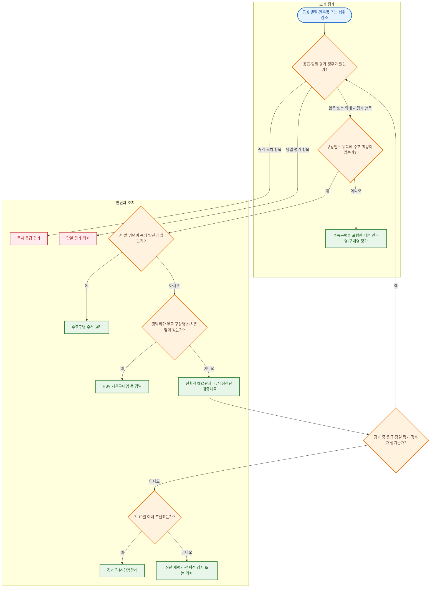

# 헤르판지나 Herpangina

## <mark style="color:green;">일반 사항</mark>

* 비폴리오 엔테로바이러스 감염으로 갑작스러운 발열·인후통과 구강인두 뒤쪽의 작은 수포 또는 궤양을 주로 나타내는 급성 감염질환
* 다른 이름 : 엔테로바이러스 소수포인두염, 포진성 구협염, 물집앙기나
* 헤르판지나(herpangina)는 **헤르페스바이러스 감염이 아님**
* 호발 시기 : 늦봄부터 가을, 특히 여름과 초가을. 열대지역에서는 연중 발생할 수 있음
* 호발 연령 : 주로 영유아와 어린이, 특히 5세 이하에서 흔하지만 청소년과 성인에서도 발생할 수 있음
* 잠복기 : 대개 수일(약 3\~7일). 원인 바이러스와 문헌에 따라 더 넓은 범위가 제시되므로 잠복기만으로 진단하거나 배제하지 않음
* 전파
  * 대변-구강 경로
  * 침·콧물 등 호흡기 분비물 및 환자와의 직접 접촉
  * 오염된 손·기저귀·장난감·식기·표면을 통한 간접 접촉
  * 증상이 호전된 뒤에도 대변 등으로 수 주간 바이러스를 배출할 수 있음
* 경과 : 대부분 7\~10일 이내에 후유증 없이 자연 회복함. 드물게 무균성 수막염, 뇌염, 급성이완마비, 심근염 또는 심폐 합병증이 발생할 수 있음
* 다른 바이러스형에 의한 재감염이 가능하며, 재발성 구강궤양을 모두 헤르판지나로 판단하지 않음
* 임신 중 엔테로바이러스 감염이 유산·사산·선천기형 위험을 높인다는 명확한 근거는 없음. 다만 분만 전후 감염은 신생아에게 전파되어 드물게 중증 감염을 일으킬 수 있으므로, 분만 직전 감염·고열·탈수 또는 산과적 이상이 있으면 산과·신생아 진료진과 상의


헤르판지나와 수족구병은 같은 계열의 엔테로바이러스가 일으킬 수 있으며 임상 양상이 겹칠 수 있음. 구강인두 뒤쪽 병변이 주된 경우 헤르판지나를 시사하고, 손·발·엉덩이 등의 발진이 동반되면 수족구병을 우선 고려함 (☞ [수족구병](198_-hand-foot-mouth-dz.md))


## <mark style="color:green;">원인</mark>

* 주로 콕사키바이러스 A군(CV-A2·A4·A5·A6·A10 등)
* CV-A16, 콕사키바이러스 B군, echovirus, EV-A71 등 다른 비폴리오 엔테로바이러스도 원인이 될 수 있음
* 우세 혈청형은 지역과 유행 시기에 따라 달라짐

## <mark style="color:green;">임상 양상</mark>

* 갑작스러운 발열과 인후통으로 시작하며, 영유아에서는 보챔·침 흘림·삼킴곤란·섭취 감소가 두드러질 수 있음
* 발열은 흔히 2\~4일 이내 호전되지만 고열이 날 수 있음. 경증 또는 무발열 감염도 가능함
* 식욕부진, 권태감, 두통, 구토, 복통 또는 설사가 동반될 수 있음
* 통증 때문에 음료나 음식을 거부하면 탈수가 가장 흔한 임상적 문제가 됨

### <mark style="color:orange;">구강 병소</mark>

* 연구개, 목젖, 전편도기둥(anterior tonsillar pillar), 편도 주위와 뒤인두벽 등 구강인두 뒤쪽에 주로 발생하며 앞쪽 구강은 대체로 보존됨
* 다만 비전형적인 분포가 있을 수 있으므로 병변 위치만으로 다른 질환을 완전히 배제하지 않음
* 작은 홍반성 구진이 1\~2 mm의 수포로 변한 뒤, 주변 홍반을 동반한 약 2\~4 mm의 얕고 통증성인 궤양으로 진행함
* 병소는 대개 여러 개이며, 보통 1주 이내에 흉터 없이 치유됨

### <mark style="color:$danger;">🚩 Red Flags!</mark>

<mark style="color:$danger;">**즉시 응급실 이송 또는 응급 평가**</mark>

* 의식저하, 경련, 반복되는 근간대성 경련, 목경직 또는 심한 두통 - 수막염·뇌염 등 의심
* 급성 근력저하, 보행 이상 또는 급성이완마비 의심
* 호흡곤란, 청색증, 쇼크·순환부전 또는 심근염·폐부종 의심
* 심한 탈수 : 거의 소변을 보지 않음, 말초순환 저하, 처짐 또는 의식 변화

<mark style="color:$warning;">**당일 평가·의뢰**</mark>

* 통증 때문에 수분을 거의 섭취하지 못하거나 경구수분보충에 실패
* 소변 감소, 구강건조, 눈물 감소 등 중등도 이상 탈수 소견
* ≥39℃ 고열 또는 3일 이상 지속되는 발열, 반복 구토, 평소와 다른 보챔·활동 저하. 급속한 악화나 잘 깨지 않는 경우는 즉각 응급 평가
* 생후 3개월 미만 영아에서 체온 ≥38.0℃ - 지체 없이 소아 응급 평가가 가능한 기관에서 평가
* 면역저하자, 신생아 또는 중대한 기저질환자에서 급성 증상 발생
* 비전형적인 피부·점막 병변으로 중증 감염질환 감별이 필요한 경우

<mark style="color:$info;">**외래 재평가**</mark> <mark style="color:$info;">- 즉각 위험 낮으나 호전 없으면 의뢰</mark>

* 7\~10일이 지나도 뚜렷하게 호전되지 않음
* 구강궤양이 반복적으로 재발하거나 병변 분포가 비전형적임
* 연쇄구균 인두염, HSV 치은구내염 등 다른 질환이 의심됨

## <mark style="color:green;">진단</mark>

### <mark style="color:orange;">진단 원칙</mark>

* 전형적인 경우 병력과 구강인두 뒤쪽의 수포·궤양을 바탕으로 임상적으로 진단하며, 일반적으로 검사가 필요하지 않음
* 손·발·엉덩이와 전신 피부를 관찰하여 수족구병 및 다른 발진성 질환을 감별함
* 구강 섭취량, 소변량, 활력징후와 탈수 소견을 평가함
* 심한 두통, 목경직, 의식 변화, 경련, 근력저하, 호흡곤란 등이 있으면 신경계·심폐 합병증을 평가함

### <mark style="color:orange;">검사</mark>

* **전형적인 헤르판지나는 병력과 진찰로 진단하며 CBC·혈액검사·바이러스 배양은 필요하지 않음. 백혈구 수치는 정상 또는 증가할 수 있으나 비특이적임**
* 탈수, 중증 감염 또는 다른 진단이 의심되면 CBC, 전해질, 신장기능검사 등을 임상 상황에 따라 시행함
* 중증·비전형 사례, 신경계 합병증 의심, 집단발생 또는 역학조사가 필요한 경우 구인두도말·대변·뇌척수액 등(피부 수포 동반 시 수포액 포함)에서 엔테로바이러스 RT-PCR을 고려함. 엔테로바이러스 RT-PCR은 바이러스 배양보다 민감도가 높고 결과 확인이 빠름 일반적인 pan-enterovirus RT-PCR은 엔테로바이러스 RNA를 검출하지만 바이러스형까지 구별하지 못할 수 있으며, 형별 확인에는 VP1 유전자 염기서열 분석 등 추가적인 분자형별 검사가 필요함
* 바이러스 배양은 검사 시간이 오래 걸리고 일부 혈청형의 분리가 어려워 일반적인 1차 검사가 아님


대변에서는 증상 소실 후에도 장기간 바이러스가 검출될 수 있음. 따라서 대변 RT-PCR 양성이 반드시 현재 구강 병변의 원인임을 뜻하지는 않음


### <mark style="color:orange;">감별진단</mark>

<table><thead><tr><th width="150">질환</th><th>주요 감별점</th></tr></thead><tbody><tr><td>수족구병</td><td>구강병변과 함께 손·발·엉덩이·사지 등에 발진 또는 수포가 동반됨. 동일한 바이러스가 두 임상형을 모두 일으킬 수 있어 완전히 배타적이지 않음</td></tr><tr><td>일차 HSV 치은구내염</td><td>앞쪽 구강, 잇몸, 혀와 입술까지 병변이 광범위하고 치은염·치은출혈이 뚜렷함</td></tr><tr><td>아프타구내염</td><td>대개 발열이나 뚜렷한 전신증상 없이 재발성 구강궤양으로 나타남</td></tr><tr><td>연쇄구균 인두염</td><td>편도 삼출, 압통성 앞목림프절 등이 나타날 수 있으나 수포성 구강병변은 비전형적임</td></tr><tr><td>구강 칸디다증</td><td>닦이거나 긁히는 백색 반점·판과 그 아래 홍반이 특징적임</td></tr><tr><td>수두·다형홍반·베체트병 등</td><td>피부, 생식기, 안구 등 구강 외 병변과 재발 양상을 확인함</td></tr></tbody></table>

***


```mermaid
flowchart TB
    subgraph A["초기 평가"]
        direction TB
        A1(["급성 발열·인후통 또는 섭취 감소"]) --> A3{"응급·당일 평가 징후가 있는가?"}
        A3 -->|없음 또는 외래 재평가 항목| A2{"구강인두 뒤쪽에 수포·궤양이 있는가?"}
        A2 -->|아니오| A4["수족구병을 포함한 다른 인두염·구내염 평가"]
    end

    subgraph B["판단과 조치"]
        direction TB
        B1["즉시 응급 평가"]
        Same["당일 평가·의뢰"]
        B2{"손·발·엉덩이 등에 발진이 있는가?"}
        B3["수족구병 우선 고려"]
        B4{"광범위한 앞쪽 구강병변·치은염이 있는가?"}
        B5["HSV 치은구내염 등 감별"]
        B6["전형적 헤르판지나 : 임상진단·대증치료"]
        B7{"7~10일 이내 호전되는가?"}
        B8["경과 관찰·감염관리"]
        B9["진단 재평가·선택적 검사 또는 의뢰"]
    end

    A3 -->|즉각 조치 항목| B1
    A3 -->|당일 평가 항목| Same
    A2 -->|예| B2
    B2 -->|예| B3
    B2 -->|아니오| B4
    B4 -->|예| B5
    B4 -->|아니오| B6
    B6 --> W{"경과 중 응급·당일 평가 징후가 생기는가?"}
    W -->|예| A3
    W -->|아니오| B7
    B7 -->|예| B8
    B7 -->|아니오| B9

    classDef start fill:#e3f2fd,stroke:#1565c0,color:#0d47a1,stroke-width:2px;
    classDef decision fill:#fff3e0,stroke:#ef6c00,color:#5d4037,stroke-width:2px;
    classDef danger fill:#ffebee,stroke:#c62828,color:#b71c1c,stroke-width:2px;
    classDef action fill:#e8f5e9,stroke:#2e7d32,color:#1b5e20,stroke-width:2px;
    class A1 start;
    class A2,A3,B2,B4,B7,W decision;
    class B1,Same danger;
    class A4,B3,B5,B6,B8,B9 action;
```

<p align="center"><strong>진단 및 치료 알고리듬</strong></p>

<p align="center"><em><mark style="color:$info;">Ref. 질병관리청 2026년도 엔테로바이러스감염증·수족구병 관리지침; CDC About Non-Polio Enteroviruses (진료용으로 재구성)</mark></em></p>

***

## <mark style="background-color:$warning;">Management</mark>

### <mark style="color:orange;">치료 방침</mark>

* 특이 항바이러스 치료 없이 수분 공급과 통증·발열 조절을 시행함
* 차갑거나 미지근한 물, 우유 또는 경구수분보충액을 소량씩 자주 섭취하게 함
* 뜨겁거나 맵고 짠 음식, 감귤주스·탄산음료 등 산성 음료, 거칠고 딱딱한 음식은 피함
* 고형식을 적게 먹는 것보다 수분을 유지하는 것이 더 중요함
* 중등도 탈수에서도 의식·순환이 안정적이면 통증 조절 후 경구 재수화를 우선 시도하고 재평가. 경구 재수화 실패 또는 심한 탈수이면 입원 가능한 기관에서 비위관·정맥 수액 치료를 평가하며, 쇼크·의식저하 시 즉각 응급 치료
* 세균감염이 확인되지 않는 한 항생제를 사용하지 않음
* 헤르페스바이러스 감염이 아니므로 acyclovir 등 항헤르페스제는 적응증이 아니며, 유효성이 확립되어 있지 않아 사용하지 않음

## <mark style="color:green;">비-약물 치료 및 예방</mark>

### <mark style="color:orange;">감염관리와 등원·등교</mark>

* 화장실 사용 또는 기저귀 교환 후, 음식을 준비하거나 먹기 전에 흐르는 물에 비누로 30초 이상 손을 씻음. 알코올 손소독제만으로 대체하지 않음
* 컵·식기·수건을 공유하지 않고, 장난감과 자주 접촉하는 표면을 청소·소독함
* 발열이 있거나 전신상태가 나쁘고 수분 섭취가 어려운 동안에는 등원·등교하지 않음
* 헤르판지나만을 위한 전국 공통의 등원·등교 복귀 기준은 없음. 해열제 없이 발열이 소실된 지 24시간 이상 지나고, 전신상태·수분 섭취가 회복되며 침을 조절할 수 있을 때 복귀를 검토하되 구강 수포·궤양의 호전과 기관·보건당국 기준을 함께 확인
* 손발 발진이 동반되어 수족구병에 해당하면 해당 챕터의 국내 복귀 기준을 적용
* 전염력은 증상 초기, 특히 발병 첫 주에 가장 높음. 회복 후에도 대변으로 수 주간 바이러스가 배출되어 전파 가능성이 남으므로 손 위생을 계속 유지해야 함. 분변 바이러스 배출이 끝날 때까지 일률적으로 등원을 중지하거나 복귀 전 음성 검사를 요구하지 않음

### <mark style="color:orange;">신고</mark>

* 엔테로바이러스 감염증은 제4급 표본감시 감염병으로, 지정 표본감시기관이 특이유전자 검출로 감염이 확인된 환자를 7일 이내 신고함
* 일반 의료기관에서 임상적으로 진단한 모든 헤르판지나 환자를 개별 신고하는 것은 아님

## <mark style="color:green;">약물 치료</mark>

### <mark style="color:orange;">해열·진통제</mark>

* 경미한 섭취 저하에서는 acetaminophen을 우선 고려. 탈수가 의심되거나 수분 섭취가 매우 불량하면 ibuprofen은 보류하고 수분 상태를 평가
* acetaminophen 10\~15 ㎎/kg/dose PO, 필요 시 4\~6시간 간격. 24시간 최대 5회, 1일 최대 75 ㎎/kg/day(체중 상관없이 4,000 ㎎/day 초과 금지) 및 제품별 최대용량을 넘지 않음. <mark style="color:blue;">\[세토펜 현탁액]</mark> 32 ㎎/㎖ : 1회 약 0.31\~0.47 ㎖/㎏. 생후 4개월 미만은 제품 용량표에 없으므로 진료 후 개별 결정
* ibuprofen 생후 6개월 이상 소아 5\~10 ㎎/kg/dose PO, 필요 시 6\~8시간 간격(최대 40 ㎎/kg/day). <mark style="color:blue;">\[어린이부루펜 시럽]</mark> 20 ㎎/㎖ : 1회 0.25\~0.5 ㎖/㎏
  * 국내 제품설명서상 체중 30 ㎏ 미만은 1일 500 ㎎(25 ㎖) 초과 금지. 40 ㎎/㎏/day와 제품별 상한 중 낮은 한도를 적용하며, 용량표에 없는 영아는 진료 후 개별 결정
* 탈수, 신장기능 저하, 위장관 출혈 위험이 있거나 수분 섭취가 매우 불량한 환자에서는 ibuprofen을 보류하고 재평가
* acetaminophen과 ibuprofen의 일률적인 교대·병용은 권하지 않음. 임상적으로 필요한 경우에만 각각의 투여 시각과 용량을 기록하여 중복·과량 투여를 방지함
* 소아·청소년에게 aspirin을 사용하지 않음 - Reye 증후군(간부전·뇌병증을 동반하는 급성 질환) 위험 때문이며, 바이러스 감염이 있는 소아·청소년에서는 특히 금기임


소아의 감염성 구강궤양에 점막용 lidocaine을 일률적으로 사용하지 않음. 경구 섭취 개선 효과가 확실하지 않고 과량 투여 또는 삼킴에 따른 경련·중추신경계 및 심혈관 독성, 구인두 감각 저하에 따른 흡인 위험이 있음. Benzocaine 함유 구강제는 메트헤모글로빈혈증을 일으킬 수 있으므로 특히 2세 미만에서는 사용하지 않음. 이른바 magic mouthwash도 효과와 안전성이 확립되지 않음


***

### <mark style="color:red;">질병코드</mark>

B08.5 엔테로바이러스소수포인두염 Enteroviral vesicular pharyngitis

***

## <mark style="color:purple;">처방례</mark>

> **처방례 1. 15 ㎏ 소아 - 발열·구강 통증, acetaminophen 선택**
>
> ```
> 세토펜 현탁액(32 ㎎/㎖)   총 90 ㎖
> 1회 6 ㎖   q4~6hr prn (24시간 최대 5회)
> ※ 1회 192 ㎎(12.8 ㎎/㎏). 3일 최대 필요량 기준이며 정규 투약이 아님
> ```
>
> _✽경미한 섭취 저하에서도 우선 고려. 항생제·항바이러스제는 일반적인 헤르판지나에 불필요_

> **처방례 2. 15 ㎏ 소아 - 생후 6개월 이상·경구 섭취 양호·탈수 없음, ibuprofen 선택**
>
> ```
> 어린이부루펜 시럽(20 ㎎/㎖)   총 72 ㎖
> 1회 6 ㎖   q6~8hr prn (24시간 최대 4회)
> ※ 1회 120 ㎎(8 ㎎/㎏), 1일 최대 480 ㎎(24 ㎖)
> ※ 체중 30 ㎏ 미만 제품 상한 500 ㎎(25 ㎖)/일 이내. 3일 최대 필요량 기준
> ※ 탈수 의심 또는 수분 섭취가 매우 불량하면 사용 보류 후 재평가
> ```
>
> _✽처방례 1·2는 한 가지 해열진통제를 선택하는 대안이며 일률적인 병용·교대 투여를 의미하지 않음_

> **처방례 3. 경구수분보충 시험 - 의식·순환이 안정적이고 삼킬 수 있는 경우**
>
> ```
> 표준 조성 경구수분보충액(ORS)  1회 5~10 ㎖씩 2~5분 간격으로 반복
> ※ 진료 환경에서 초기 목표 10~20 ㎖/kg을 약 1시간에 걸쳐 투여한 뒤 섭취 가능 여부와 탈수 상태 재평가
> ※ 통증성 구내염의 경구 재수화 원칙을 적용한 시험량이며, 헤르판지나 특이 확립 용량은 아님
> ※ 통증 조절 후(대개 해열진통제 투여 20~30분 후) 경구 투여 재시도
> ※ 이는 초기 경구수분보충 시험량이며, 확인된 탈수의 전체 교정량은 탈수 정도와 유지 필요량에 따라 별도로 산정
> ※ 경구 섭취 실패·소변량 감소는 당일 의뢰. 말초순환 저하·심한 처짐·의식 변화는 즉각 응급 평가
> ※ 심한 탈수·쇼크·의식저하에서는 이 시험으로 이송을 지연하지 않음
> ```
>
> _✽통증 조절과 조기 경구수분보충 시험으로 섭취 가능 여부를 판단하며, 실패하면 지체하지 말고 의뢰함_

***

### <mark style="color:$success;">핵심 복약 지도</mark>

> **해열진통제 사용**
>
> * 연령과 체중에 맞는 용량으로 사용하고, 같은 성분이 포함된 감기약과 중복 복용하지 않음
> * ibuprofen은 탈수가 의심되거나 수분 섭취가 매우 불량한 소아에서는 보류하고 재평가
> * 소아·청소년에게 aspirin은 사용하지 않음(Reye 증후군 위험).

> **경구 섭취 유지**
>
> * 한 번에 많이 마시게 하기보다 차가운 음료나 경구수분보충액을 소량씩 자주 제공함
> * 통증으로 섭취를 거부하면 해열진통제 투여 20\~30분 후 재시도함

> **사용하지 않아야 할 것**
>
> * lidocaine·benzocaine 함유 구강마취제를 임의로 사용하지 않음
> * 항생제와 acyclovir는 일반적인 헤르판지나 치료제가 아님

> **언제 다시 병원을 방문해야 하나요?**
>
> * 수분 섭취 불가·소변 감소·반복 구토, ≥39℃ 고열 또는 3일 이상 지속되는 발열 - 당일 평가
> * 생후 3개월 미만에서 ≥38℃ 발열 - 지체 없이 소아 응급 평가가 가능한 기관으로
> * 경련, 심한 두통·목경직, 호흡곤란, 급성 근력저하, 잘 깨지 않음 또는 심한 탈수·순환부전 - 즉시 응급 평가
> * 7\~10일이 지나도 호전이 없거나 구강궤양이 반복적으로 재발 - 외래 재평가

***

### <mark style="color:blue;">환자 안내서</mark>


**헤르판지나, 헤르페스가 아닙니다**

헤르판지나는 장바이러스(엔테로바이러스)가 일으키는 감염으로, 이름과 달리 헤르페스와는 관계가 없습니다. 대부분 7\~10일 안에 저절로 좋아집니다.


#### <mark style="color:$primary;">왜 입안이 아프고 열이 나나요?</mark>

* 장바이러스가 입안 뒤쪽의 연구개·목젖·편도 주변에 작은 물집·궤양을 만들면서 통증과 열이 함께 나타납니다.
* 침, 콧물, 오염된 손이나 물건을 통해 다른 사람에게 옮을 수 있어 어린이집·학교에서 잘 번집니다.

#### <mark style="color:$primary;">집에서 어떻게 관리하나요?</mark>

* **음식보다 수분이 먼저입니다.** 밥을 잘 못 먹더라도 물, 우유, 경구수분보충액을 조금씩 자주 마시게 하십시오.
* **차가운 음식이 도움이 될 수 있습니다.** 아이스크림, 연령에 맞는 아이스바, 찬 우유, 차갑게 식힌 요구르트 등은 통증을 줄이면서 수분·열량 섭취에도 도움이 됩니다.
* **뜨겁고 맵고 신 음식은 피하십시오.** 통증을 악화시킬 수 있습니다.
* **해열진통제는 정해진 용량과 간격을 지켜 사용하십시오.**
* 화장실 사용·기저귀 교환 후에는 비누와 물로 손을 씻고, 컵·식기·수건을 함께 사용하지 마십시오.

#### <mark style="color:$primary;">다른 아이에게 옮기나요?</mark>

* 네, 침·콧물·수포액·대변 등을 통해 쉽게 옮으며 어린이집·학교에서 잘 번집니다.
* 전염력은 증상 초기, 특히 발병 첫 주에 가장 높습니다.
* 손씻기, 장난감·문손잡이 등 자주 만지는 물건 소독, 컵·식기·수건 따로 쓰기가 가장 효과적인 예방법입니다.
* 회복 후에도 대변으로 바이러스가 몇 주간 나올 수 있어 손 위생을 계속 지키십시오. 그 기간 내내 등원을 미루거나 음성 검사를 받을 필요는 없습니다.
* 해열제 없이 열이 없어진 지 24시간 이상 지나고, 잘 마시며 활동과 침 삼키기가 회복되고 입안 물집·궤양도 호전되면 시설 기준을 확인하여 복귀하십시오. 손발 발진이 동반된 수족구병은 별도 복귀 기준을 따르십시오.

#### <mark style="color:$primary;">이럴 때는 병원에 가세요</mark>

**🚨 즉시 응급 평가**

* 경련, 심한 두통·목이 뻣뻣해짐, 숨쉬기 힘들어함 또는 팔다리에 힘이 빠짐
* 심하게 처지거나 잘 깨지 않음
* 소변을 거의 보지 않으면서 손발이 차갑고 피부가 얼룩덜룩하거나 심하게 처짐

**📞 오늘 안에 진료**

* 물을 거의 마시지 못하거나 소변이 줄고 입이 마르며 눈물이 적어짐
* 반복해서 토함, 39℃ 이상 고열 또는 발열이 3일 이상 계속됨
* 생후 3개월 미만에서 38℃ 이상 발열 - 지체 없이 소아 응급 평가가 가능한 병원으로

**외래 재평가**

* 7\~10일이 지나도 나아지지 않거나 구강궤양이 반복적으로 재발함


## 참고자료

* 질병관리청. [2026년도 엔테로바이러스감염증·수족구병 관리지침](<https://www.kdca.go.kr/kdca/2861/subview.do?enc=Zm5jdDF8QEB8JTJGYmJzJTJGa2RjYSUyRjU1JTJGMzExMjg1JTJGYXJ0Y2xWaWV3LmRvJTNG>) (2026.6.1 재안내).
* CDC. [About Non-Polio Enteroviruses](https://www.cdc.gov/non-polio-enterovirus/about/index.html).
* MSD Manual Professional Edition. [Herpangina](https://www.msdmanuals.com/professional/infectious-diseases/enteroviruses/herpangina) (2024.9).
* Singapore Communicable Diseases Agency. [Hand, foot, and mouth disease](https://www.cda.gov.sg/professionals/diseases/hand--foot-and-mouth-disease/) (2026.8.3; 헤르판지나와 수족구병의 임상형 연관성 참고).
* Royal Children’s Hospital Melbourne. [HSV Gingivostomatitis](https://www.rch.org.au/clinicalguide/guideline_index/HSV_Gingivostomatitis/) (2025.11; 통증성 구내염의 수분 보충 원칙 참고).
* 삼아제약. [세토펜현탁액 제품정보·용법용량](https://www.samapharm.co.kr/Product/goodsView.asp?idx=64).
* 삼일제약. [어린이부루펜시럽 제품설명서](https://common.health.kr/shared/images/insert_pdf/IN_A11A0500A0154_00.pdf).
* Hopper SM, et al. [Topical lidocaine to improve oral intake in children with painful infectious mouth ulcers: a blinded, randomized, placebo-controlled trial](https://pubmed.ncbi.nlm.nih.gov/24210368/). Ann Emerg Med. 2014;63:292–299.
