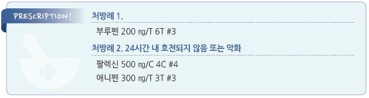

# 유방염 Mastitis


## 일반 사항

* milk duct 및 주위 조직(유방 실질 및 유두, 유륜, 피하 지방)으로의 염증 세포 침윤에 의한 유방 실질의 염증
* 유병률 : 모유 수유 산모의 3\~20%
* 유방염 상태에서도 수유 가능; 정상 면역의 아기에서는 위해 없음
* Periductal mastitis : subareolar duct의 염증(유두 주위의 염증 소견); 보통 만성 경과
* Breast abscess : inflamed duct의 2차 감염 및 duct 손상에 의함; 항생제에 반응하지 않는 감염성 유방염에서 발생

## 원인

*   원인균 : S. aureus (산욕기 감염 또는 유방 농양 시 MRSA 고려), anaerobic bacilli(bacteroides; 재발성 유방염에서 고려),

    Candida
* 사춘기 유방염 : 피부 자극(shaving, nipple stimulation), 외상, 이물(piercing), 유선 이상(ductal ectasia), epidermal cyst 감염

### 위험 인자

* 출산 2\~6주째 산모(lactational mastitis)
* 출생 1\~5주째 영아
* 사춘기 여성
* 손상된 유두
*   수유부

    •자주하지 않는 수유, 수유를 거름, 지나치게 정해진 일정에 따른 수유

    •유방을 충분히 비우지 못하는 약하거나 불충분한 수유

    •아기의 섭취에 비하여 많은 모유 생산

    •조기 수유 중단

    •산모 또는 아기의 질병 상태

    •유두 꼭지 폐쇄 : milk blister, granular material, Candida 감염
* 유방 압박 : 조이는 브래지어, 자동차 안전벨트
* 스트레스, 피로, 영양 부족, 당뇨

## 임상 양상

* 국소 증상 : 일반적인 국소 염증 소견(통증, 발적, 부종, 발열); Peau d’orange 모양의 피부
* 전신 증상 : 발열(＞38.5℃), 오한, 통증
* Candida breast duct 감염 : 수유부에서의 찌르는 듯한 유방통, 유두 피부염

## 진단

### 검사

* 대상 : 심한 증상, 항생제 투여 2일 내 호전되지 않거나 재발, 원내 발생
* 수유와 무관한 유방 농양은 종양에 대한 평가를 요함
* 2주 내 호전되지 않거나 3회 이상 같은 유방에 재발하는 경우 악성 종양 등과의 감별을 요함
* 혈액 및 유즙에 대한 WBC 및 배양 검사
* mammography : 비산욕기 유방염 여성에서 고려
* 초음파 검사 : 농양 등의 감별을 위하여 고려

### 증상/병력에 따른 유방 문제의 감별

```

```

***

## Management

### 치료 방침

* 비-중증 수유유방염 : 대증 치료; 비-약물 치료, NSAID
* 감염이 의심되는 수유유방염 : 24시간 내 증상 호전이 안 되거나 발열이 있는 경우 항생제 투여
* 유방 농양 : 배농 및 항생제 투여; 수유와 무관한 유방 농양은 혐기성 세균 해당 항생제 투여

## 비-약물 치료 및 예방

### 수유 유방염 (lactational mastitis)

* 휴식, 적절한 수분, 영양 공급
* 모유 배출을 막을 수 있는, 조이는 옷 착용 회피
* 위생적 젖꼭지 관리
* 유방을 가능한 한 자주 비움(자주 수유)
* 감염이 없는 유방을 먼저 수유 → 유방을 비우자마자 이환된 유방으로 수유 (✽이환된 유방의 모유 흐름에 도움이 됨)
* 유방염이 발생한 부위에 아기의 턱이나 코를 위치시킴 (✽유방이 자극되어 모유 배출에 도움)
* 수유 전 유방 온찜질 (✽모유 흐름에 도움)
* 수유 중 유방 마사지 : 손에 식용 oil이나 무독성 윤활제를 바르고 마사지 (✽모유 배출에 도움)
* 수유 후 남은 모유를 짜냄
* 수유 후 냉찜질 (✽통증과 부종을 줄이는 데 도움)

## 약물 치료

* 수유부 및 비수유부 동일

### 진통제

* ibuprofen : 400\~800 ㎎ tid \[부루펜]
* acetaminophen : 650\~1,300 ㎎ tid \[타이레놀]

### 항생제

```
(☞ p.901)
```

* 항생제 치료를 지지할만한 근거는 부족함
* 대상 : 중증, 다른 치료로 24시간 내 증상 호전되지 않음, 급성 악화 경과를 보임
* 투여 기간 : 10\~14d
* dicloxacillin 또는 flucloxacillin : 500 ㎎ qid
* cephalexin : 500 ㎎ qid \[팔렉신]
* amoxicillin/clav. : Amox 500 ㎎ tid or 875 ㎎ bid \[오구멘틴]
* TMP/SMX : 수유부에게는 금지; 160/800 ㎎ bid \[셉트린]
* clarithromycin : 500 ㎎ bid \[클래리시드]
* 항생제 투여 48시간 내 호전되지 않으면 MRSA 고려

#### Candida breast duct 감염

* 국소 nystatin cream, clotrimazole 0.1% cream qd ×7d (수유 중 사용 가능)
* 국소 gentian violet 0.5% qd ×7d
* 경구 fluconazole 200 ㎎ qd ×2주

## 수술

* 항생제 등 약물로 해결되지 않는 경우 고려

> **질병코드** N61 유방의 염증성 장애

O91 출산과 관련된 유방의 감염


