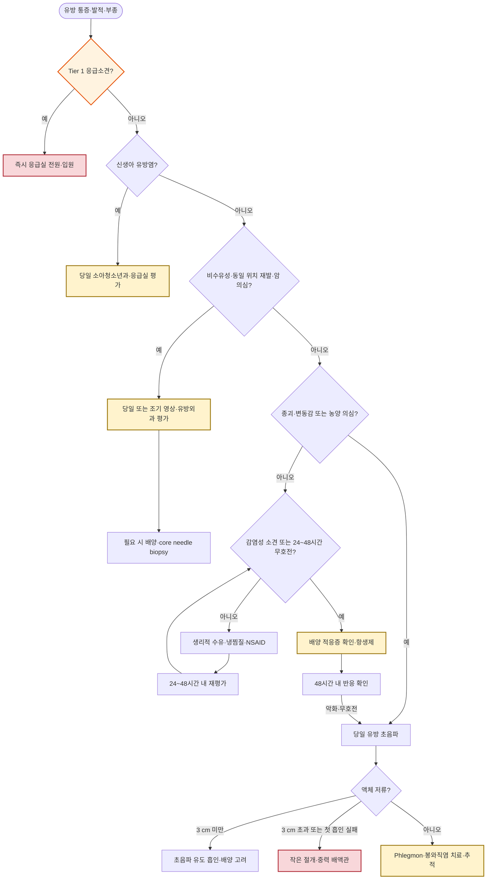

# 유방염 Mastitis

## <mark style="color:green;">일반 사항</mark>

* 유방염은 유선과 주위 간질에 발생하는 염증으로, 수유기에는 **유관 협착(ductal narrowing) → 염증성 유방염 → 세균성 유방염 → 봉와직염성 종괴(phlegmon) 또는 농양**으로 이어지는 스펙트럼으로 이해한다 (ABM Clinical Protocol #36, 2022).
* 모유 수유 여성의 약 3\~20%에서 발생하며, 출산 후 첫 6주에 흔하지만 수유 기간 중 어느 때나 발생할 수 있다.
* 염증성 유방염의 발열·오한·빈맥은 감염 없이도 나타날 수 있으므로, 발열만으로 세균성 유방염을 진단하지 않는다.
* 세균성 유방염이나 유방 농양이 있어도 일반적으로 이환된 유방에서 수유를 계속할 수 있으며, 정상 면역의 영아에게 위해를 주지 않는다. 모유를 짜서 버릴 필요도 없다.
* 다만 아기의 입이나 유축기 깔때기가 고름, 열린 감염 조직 또는 배액관 삽입부와 직접 접촉하지 않도록 하고, 해당 부위는 깨끗하고 마른 드레싱으로 덮는다. 접촉을 피할 수 없으면 감염 부위가 더 이상 전염성이 없다고 판단될 때까지 이환측 모유를 유축해 버리고 반대쪽 수유는 계속한다. 미숙아·중환자실 입원아·면역저하 영아는 별도의 감염관리 지침에 따른다(CDC MRSA and Breastfeeding).
* 비수유성 유방염에는 유관주위염(periductal mastitis), 유륜주위 농양, 육아종성 유방염(granulomatous mastitis) 등이 포함되며 수유 유방염과 원인·검사·치료가 다르다.
* 유방 농양은 배농이 필요한 감염성 액체 저류이며, 급성 수유 유방염 환자의 약 3\~11%에서 발생한다. 농양이 형성되면 발열이 일시적으로 호전될 수도 있으므로 전신증상만으로 배제하지 않는다.
* 합병증 : 재발성 유방염, phlegmon·농양, 만성 유관 누공(비수유성), 조기 이유

## <mark style="color:green;">원인 및 위험 인자</mark>

### <mark style="color:orange;">수유 유방염</mark>

* 흔한 원인균 : *Staphylococcus aureus*, coagulase-negative *Staphylococcus*, *Streptococcus* spp.
* MRSA는 과거 MRSA 감염·보균, 최근 입원 또는 의료기관 노출, 의료종사자, 반복 감염, 지역 내 높은 유병률, 1차 항생제 무반응 때 고려한다.
* 관련 요인
  * 이전 유방염 병력
  * 모유 과다생산 또는 필요량을 초과하는 반복 유축
  * 수유 간격의 갑작스러운 변화, 급격한 이유
  * 유두 손상, 부적절한 젖물림 또는 유축기 깔때기 크기·과도한 흡인으로 인한 외상
  * 유방에 지속되는 국소 압박
* 위 요인 중 상당수는 관찰연구에서 확인된 연관성이며, 개별 환자에서 직접적인 원인으로 단정하지 않는다.


**Candida 유관 감염** 또는 **mammary candidiasis**라는 진단을 뒷받침하는 과학적 근거는 부족하다(ABM Protocol #36, 2022). 찌르거나 타는 듯한 유방통만으로 칸디다 감염을 진단하거나 nystatin, gentian violet, fluconazole을 경험적으로 투여하지 않는다. 다음을 먼저 감별한다.

* 유두 외상·피부염 : 육안으로 확인되는 균열·발진·표피 손상
* 부적절한 젖물림 : 수유 자세·라치(latch) 교정으로 통증이 호전되는지 확인
* 혈관연축(Raynaud's phenomenon of the nipple) : 수유 직후 유두가 창백 → 청색 → 발적으로 변하는 3상성 색조 변화, 추위 노출 시 악화
* 세균성 유방염 : 국소 발적·부종·발열이 동반되는지 확인
* 과도한 유축 : 유축 빈도·강도가 아기가 먹는 양을 초과하는지 확인
* 신경병성 통증 : 작열감이 수유와 무관하게 지속되고 allodynia를 동반


### <mark style="color:orange;">비수유성 유방염</mark>

* 유관주위염 및 유륜주위 농양 : 흡연, 당뇨, 비만, 함몰·갈라진 유두, 유두 피어싱과 관련되며, 재발 시 혼합균과 혐기성균을 고려한다.
* 육아종성 유방염 : 감염, 특발성 염증 및 드물게 결핵·진균 등이 원인이 될 수 있다. Cystic neutrophilic granulomatous mastitis(CNGM)는 *Corynebacterium*과 연관될 수 있다.
* 사춘기 유방 감염 : 피부 외상, 면도, 유두 피어싱, 표피낭종 감염 및 유관 이상 등이 원인이 될 수 있다. 유방 발달 조직의 손상을 피하도록 초음파와 소아청소년과·유방외과 평가를 고려한다.

## <mark style="color:green;">임상 양상</mark>

<table><thead><tr><th width="150">상태</th><th>주요 임상 소견</th></tr></thead><tbody><tr><td>생리적 유방울혈<br>(engorgement)</td><td>양측성, 산후 3~5일경 흔함. 미만성 팽만·경도 압통이나 뚜렷한 발적·발열은 없음. 수유 유지와 대증 관리로 충분</td></tr><tr><td>유관 협착</td><td>국소 압통·경결, 경미한 발적. 전신증상은 없음</td></tr><tr><td>염증성 유방염</td><td>분절성 통증·발적·부종이 진행하며 발열, 오한, 빈맥이 동반될 수 있음. 감염 없이도 전신 염증반응 가능</td></tr><tr><td>세균성 유방염</td><td>경계가 비교적 뚜렷하고 진행하는 봉와직염, 경결 또는 종괴. 지속되는 전신증상 또는 보존치료 무반응</td></tr><tr><td>Phlegmon</td><td>변동감 없이 단단한 종괴처럼 만져지는 불명확한 염증성 저류. 초음파로 확인</td></tr><tr><td>유방 농양</td><td>국소 종창·압통·변동감 또는 명확한 종괴. 발열이 지속·재발하거나 농양이 벽으로 둘러싸이면서 발열이 호전될 수도 있음</td></tr><tr><td>염증성 유방암 의심</td><td>진행하는 광범위 발적·부종, peau d'orange, 유방 또는 유두 함몰·변형, 액와림프절. 적절한 치료에도 호전되지 않음</td></tr></tbody></table>

### <mark style="color:$danger;">🚩 Red Flags!</mark>

<mark style="color:$danger;">**즉각 조치 또는 의뢰**</mark>

* 저혈압, 의식 변화, 호흡곤란, 심한 빈맥 등 패혈증 또는 혈역학적 불안정
* 빠르게 확산하는 발적·부종, 피부 괴사·수포·염발음 또는 괴사성 감염 의심
* 경구 수분·약물 섭취가 불가능하거나 심한 탈수
* 중증 면역저하 환자의 진행성 유방 감염

<mark style="color:$warning;">**당일 또는 조기 의뢰**</mark>

* 변동감, 뚜렷한 종괴 또는 phlegmon·농양 의심
* 넓게 진행하는 봉와직염 또는 24\~48시간 보존치료에도 악화
* 적절한 1차 항생제 투여 48시간 후에도 호전되지 않음
* 비수유 여성의 유방염, 동일 위치 반복 재발 또는 지속되는 종괴
* 광범위 peau d'orange, 유방·유두 함몰, 유방 변형 또는 액와림프절 등 염증성 유방암 의심
* 신생아 유방염

<mark style="color:$info;">**외래 추적 / 추가 평가 계획**</mark> <mark style="color:$info;">- 즉각 위험 낮으나 호전 없으면 의뢰</mark>

* 전신상태가 안정된 경증 염증성 수유 유방염 : 대증치료 후 24\~48시간 내 재평가
* 항생제를 시작한 세균성 유방염 : 48시간 내 반응 확인
* 염증이 호전된 뒤에도 종괴가 남음 : 완전 소실될 때까지 진찰하고 필요 시 추적 초음파

## <mark style="color:green;">진단</mark>

* 전형적인 경증 수유 유방염은 임상적으로 진단하며 일률적인 혈액검사나 영상검사가 필요하지 않다.
* CBC와 CRP는 염증 표지자일 뿐 세균성 여부를 특이적으로 구별하지 못한다.
* 혈액배양은 패혈증·균혈증이 의심되는 중증 환자에서 시행한다.

### <mark style="color:orange;">모유 및 배액물 배양</mark>

* 1차 항생제 투여 후 48시간 내 뚜렷한 호전이 없음
* 반복 또는 재발성 유방염
* MRSA 또는 다제내성균 위험이 높음
* 면역저하 영아 또는 신생아중환자실 영아에게 모유를 제공함
* 농양을 흡인하거나 배액함 : 배액물의 Gram 염색, 호기성·혐기성 배양 및 감수성검사를 시행

### <mark style="color:orange;">영상검사 및 조직검사</mark>

* **유방 초음파**
  * 감염성 유방염과 함께 종괴가 만져지거나 농양·phlegmon이 의심됨
  * 봉와직염이 대증치료 또는 항생제에 반응하지 않음
  * 비수유성 유관주위염이 처음 발생함
* **유방촬영술**
  * 증상이 치료에 반응하지 않아 악성 종양을 배제해야 함
  * 연령에 따른 유방암 선별검사 대상이며 통증 때문에 검사가 불가능하지 않음
  * 비수유성 유관주위염 환자가 30세 이상이거나 유방암 위험인자가 있으면서, 초음파 소견이 임상상과 일치하지 않거나 1\~2주 치료에 반응하지 않음
* **Core needle biopsy**
  * 임상·영상 소견이 비전형적이거나 치료에 반응하지 않음
  * 동일 위치에서 반복 재발함
  * Phlegmon이 적절한 치료 후 1개월 이상 해소되지 않음
  * 육아종성 유방염 또는 악성 종양이 의심됨
* 육아종성 유방염이 의심되면 농양벽의 core needle biopsy와 배양을 시행하고, 임상 상황에 따라 호기성·혐기성균, *Corynebacterium*, 항산균·결핵, 비결핵항산균 및 진균을 평가한다.

### <mark style="color:orange;">감별 진단</mark>

* 유방염 스펙트럼과 임상상이 겹칠 수 있는 질환들의 감별. 특히 비수유 여성의 유방염이나 치료 무반응 사례에서는 염증성 유방암을 적극적으로 배제한다.

<table><thead><tr><th width="150">질환</th><th width="250">감별 포인트</th><th>비고</th></tr></thead><tbody><tr><td>Galactocele</td><td>경계가 뚜렷하고 무통성인 낭성 종괴, 발적·발열 없음</td><td>초음파로 확인; 이차 감염되면 유방염 소견 동반 가능</td></tr><tr><td>Fibroadenoma</td><td>경계가 명확하고 잘 움직이는 고형 종괴</td><td>급성 염증 소견 없음. 임신·수유 중 커지거나 처음 발견될 수 있으며, 필요 시 초음파·조직검사</td></tr><tr><td>육아종성 유방염</td><td>반복되는 비화농성 종괴·누공, 항생제 반응이 일정하지 않음</td><td>core needle biopsy로 확진; 감염·악성 종양 배제 필요</td></tr><tr><td>염증성 유방암</td><td>광범위 peau d'orange, 유두 함몰, 치료에 반응하지 않는 발적·부종</td><td>비수유 여성 또는 적절한 치료 무반응 시 강력히 의심 → 즉시 영상·조직검사</td></tr></tbody></table>

***


```mermaid
flowchart TD
    S([유방 통증·발적·부종]) --> E{"Tier 1 응급소견?"}
    E -->|예| ER["즉시 응급실 전원·입원"]
    E -->|아니오| NB{"신생아 유방염?"}
    NB -->|예| PED["당일 소아청소년과·응급실 평가"]
    NB -->|아니오| X{"비수유성·동일 위치 재발·암 의심?"}
    X -->|예| IMG["당일 또는 조기 영상·유방외과 평가"]
    IMG --> BX["필요 시 배양·core needle biopsy"]
    X -->|아니오| M{"종괴·변동감 또는 농양 의심?"}
    M -->|예| US["당일 유방 초음파"]
    US --> F{"액체 저류?"}
    F -->|3 cm 미만| ASP["초음파 유도 흡인·배양 고려"]
    F -->|3 cm 초과 또는 첫 흡인 실패| DR["작은 절개·중력 배액관"]
    F -->|아니오| PH["Phlegmon·봉와직염 치료·추적"]
    M -->|아니오| I{"감염성 소견 또는 24~48시간 무호전?"}
    I -->|아니오| C["생리적 수유·냉찜질·NSAID"]
    C --> FU["24~48시간 내 재평가"]
    FU --> I
    I -->|예| ATB["배양 적응증 확인·항생제"]
    ATB --> R["48시간 내 반응 확인"]
    R -->|악화·무호전| US
    style E fill:#fff3e0,stroke:#e65100,stroke-width:2px
    style ER fill:#f8d7da,stroke:#b02a37,stroke-width:2px
    style PED fill:#fff3cd,stroke:#997404,stroke-width:2px
    style IMG fill:#fff3cd,stroke:#997404,stroke-width:2px
    style ATB fill:#fff3cd,stroke:#997404,stroke-width:2px
    style DR fill:#f8d7da,stroke:#b02a37,stroke-width:2px
    style PH fill:#fff3cd,stroke:#997404,stroke-width:2px
```

<p align="center"><strong>진단 및 치료 알고리듬</strong></p>

<p align="center"><em><mark style="color:$info;">Ref. ABM Clinical Protocol #36 (2022); ASBrS/SBI/CAP 2025 Guidelines for the Management of Infectious and Inflammatory Lesions of the Breast (JAMA Surgery, 2026년 게재)</mark></em></p>


3 cm 기준은 ASBrS/SBI/CAP 2025 지침(2026년 *JAMA Surgery* 게재)의 전문가 합의 기준이다. 병변의 다방성, 내용물의 점도·고형화, 피부 상태, 환자의 시술 수용도 및 지역 의료 여건을 함께 고려한다.


***

## <mark style="background-color:$warning;">Management</mark>

### <mark style="color:orange;">치료 방침</mark>

* 염증성 수유 유방염 : 생리적 수유, 냉찜질, NSAID 등 대증치료를 먼저 시행한다.
* 세균성 유방염 : 경계가 뚜렷한 봉와직염·경결·종괴, 지속되는 전신증상 또는 24\~48시간 보존치료 무반응 때 항생제를 투여한다.
* Phlegmon : 초음파로 확인하고 보통 10일 이상 항생제를 투여하되, 농양으로 진행하는지 추적하면서 농양 이행 여부와 임상 반응에 따라 투여 기간을 조정한다.
* 유방 농양 : 항생제만 투여하지 말고 흡인 또는 배액으로 source control을 시행한다.
* 비수유성 유방염 : 유관주위염, 육아종성 유방염 및 악성 종양을 구분한 뒤 각각 치료한다.

## <mark style="color:green;">비-약물 치료 및 예방</mark>

### <mark style="color:orange;">수유 유방염</mark>

* 휴식, 적절한 수분과 영양을 공급한다.
* 아기가 원하는 생리적 수유를 유지한다. 수유 횟수를 일률적으로 줄이지 않는다.
* 유방을 "완전히 비우기" 위한 추가 수유·반복 유축은 하지 않는다.
* 불편감이 심하면 손으로 소량만 짜내고, 유축이 필요한 경우 아기가 먹는 빈도와 양 정도로 제한한다.
* 유륜 부종이 심해 아기가 젖을 물 수 없거나 모유가 나오지 않으면 이환측을 억지로 반복 자극하지 않는다. 반대쪽으로 수유하면서 이환측은 편안함을 위한 소량 손유축 후 부종이 가라앉으면 다시 수유한다.
* 냉찜질 또는 천으로 감싼 얼음팩을 피부 손상이 생기지 않도록 짧게 반복한다.
* 온찜질은 원하는 환자에서 수유 직전 편안함을 위한 짧은 시간으로 제한한다. 장시간 반복 가열은 부종을 악화시킬 수 있다.
* 깊은 조직 마사지, 강한 압박, 진동기·전동 마사지기 사용을 피한다. 필요한 경우 피부 표면을 가볍게 쓸어주는 정도로 하며 효과 근거가 제한적임을 설명한다.
* 잘 맞는 지지성 브래지어를 사용하되 국소 압박을 주는 조이는 의복은 피한다.
* 유두를 반복 세척하거나 유축기·가정용품을 일률적으로 멸균할 필요는 없다. 손 위생과 제조사 지침에 따른 기본적인 유축기 세척을 시행한다.
* 유두 bleb를 바늘로 터뜨리거나 짜내지 않는다.
* 급격한 이유는 피하고 필요한 경우 점진적으로 수유량을 줄인다.

## <mark style="color:green;">약물 치료</mark>

### <mark style="color:orange;">진통제</mark>

* Ibuprofen 400 ㎎ tid pc <mark style="color:blue;">\[부루펜정 200 ㎎]</mark>
  * 급성기에 필요하면 증상과 금기 여부를 확인하여 증량할 수 있으나, 최소 유효용량을 단기간 사용한다.
  * 소화성궤양, 신장기능 저하, NSAID 과민반응 환자에서는 주의한다.
* Acetaminophen 500\~1,000 ㎎ q6\~8h prn <mark style="color:blue;">\[타이레놀정 500 ㎎]</mark>
  * 일반적으로 1일 3,000 ㎎ 이내로 사용한다. 간질환·과음 환자에서는 최대용량을 낮춘다.
  * 650 ㎎ 서방정 2정(1,300 ㎎)은 해당 제형의 8시간 간격 용법이며 일반 정제 용법과 혼용하지 않는다.

### <mark style="color:orange;">수유기 세균성 유방염의 경험적 항생제</mark>

(☞ [피부감염](../229_/165_-skin-and-soft-tissue-infection.md))

* 배양검사와 지역 내 감수성 자료가 있으면 이에 따라 선택·조정한다.
* 통상 10\~14일 투여하되 임상 반응과 농양 배농 여부에 따라 개별화한다.

<table><thead><tr><th width="160">구분</th><th width="260">성인 예시 용법</th><th>주의사항</th></tr></thead><tbody><tr><td>1차 선택</td><td>Cephalexin 500 ㎎ qid ×10\~14d <mark style="color:blue;">\[팔렉신캡슐 500 ㎎]</mark></td><td>중증 즉시형 β-lactam 과민반응 병력을 확인</td></tr><tr><td>국제 지침의 1차 선택</td><td>Dicloxacillin 또는 flucloxacillin 500 ㎎ qid ×10\~14d</td><td>국내 유통·수급 여부를 확인. 국내에서 바로 사용할 수 있는 처방례로 제시하지 않음</td></tr><tr><td>MRSA 위험 또는 중증 β-lactam 알레르기</td><td>Clindamycin 300 ㎎ qid ×10\~14d <mark style="color:blue;">\[훌그램캡슐 150 ㎎ 2캡슐]</mark></td><td>국내 급여·유통 제품. 국내 첨부문서는 투여 중 수유하지 않도록 규정하지만 LactMed(2025)은 수유 중단이 반드시 필요하지 않다고 평가하여 자료가 서로 다르다. 가능한 경우 대체약을 우선하고, 사용 시 영아의 설사·아구창·기저귀발진 및 드문 혈변을 관찰한다. 지역 감수성·유도내성과 C. difficile 감염에 주의한다.</td></tr><tr><td>MRSA 위험 대안</td><td>TMP/SMX 160/800 ㎎ bid ×10\~14d <mark style="color:blue;">\[셉트린정 80/400 ㎎ 2정]</mark></td><td>건강한 만삭아에서는 신생아기 이후 수유 중 사용 가능. 미숙아, 황달·고빌리루빈혈증, 아프거나 스트레스 상태인 영아에서는 대체약 우선. G6PD 결핍 영아에게 수유 중이면 피함(LactMed)</td></tr></tbody></table>


Amoxicillin/clavulanate는 단순 수유 유방염의 일률적 1차 약제로 사용하지 않는다. 비수유성 유륜주위 감염 등 혼합균·혐기성균을 고려할 때 사용할 수 있으나 MRSA를 치료하지 못한다. 사용할 경우 `500/125 ㎎ tid` 또는 `875/125 ㎎ bid`처럼 clavulanate 용량까지 명시한다.


* 1차 항생제 투여 후 48시간 내 호전되지 않으면
  * 모유배양 및 감수성검사
  * MRSA·내성균 및 비전형 병원체 평가
  * 유방 초음파로 phlegmon·농양 확인
  * 염증성 유방암, 육아종성 유방염 등 감별

### <mark style="color:orange;">비수유성 유관주위염·유륜주위 농양</mark>

* 첫 진단 시 유방 초음파를 시행한다.
* 고름이 있으면 가능하면 항생제 투여 전에 호기성·혐기성 배양을 시행한다.
* MRSA 위험을 고려해야 하는 첫 발병 PDM-SMOLD에서는 TMP/SMX를 경험적으로 고려할 수 있다.
* 재발성 농양은 혼합균·혐기성균을 고려하여 TMP/SMX에 metronidazole 또는 clindamycin 병용을 고려하되, 배양 결과와 지역 감수성에 따라 조정한다.
* 흡연 중단을 권고하고 유두 피어싱은 영구적으로 제거한다.
* 반복 농양, 지속되는 유관 누공 또는 치료 무반응은 유방외과에 의뢰한다. 최종 유관·누공 절제는 급성 염증이 가라앉은 안정기에 시행한다.

### <mark style="color:orange;">육아종성 유방염</mark>

* Core needle biopsy로 진단하고 감염 및 악성 종양을 배제한다.
* CNGM 또는 원인균이 확인된 경우에는 배양 결과에 맞춰 치료한다. *Corynebacterium* 연관 CNGM에서는 전문의가 doxycycline 등을 고려할 수 있다.
* CNGM 소견이나 원인균이 없는 특발성 육아종성 유방염에는 경험적 항생제를 일률적으로 사용하지 않는다.
* 국소 또는 병변 내 스테로이드, 전신 스테로이드 및 면역조절 치료는 유방외과·류마티스내과 등 다학제에서 결정한다.
* 반복 절개배농이나 광범위 절제는 변형·누공 위험이 있어 일률적으로 시행하지 않는다.

## <mark style="color:green;">시술 및 기타 처치</mark>

### <mark style="color:orange;">유방 농양의 배농</mark>

* ASBrS/SBI/CAP 2025 지침(JAMA Surgery, 2026년 게재)
  * 3 ㎝ 미만 액체 저류 : 초음파 유도 흡인 및 배양을 시도할 수 있으나 반복적인 연속 흡인은 권하지 않는다.
  * 3 ㎝ 초과 또는 첫 흡인 실패 : 작은 절개와 중력 배액관 삽입을 고려하며 배액관은 통상 3\~5일 후 제거한다.
  * 심한 다방성 또는 고형화된 내용물, 외래 시술을 견딜 수 없는 경우 : 수술실 배농을 고려한다.
* 절개는 가능한 작게 하고 유두·유륜 복합체에서 떨어진 위치를 선택한다.
* 일률적인 상처 패킹과 음압상처치료는 피하고 중력 배액을 사용한다.
* 배농 후에도 절개나 배액관 위치가 수유를 방해하지 않으면 이환측 수유를 계속할 수 있다. 다만 아기의 입이나 유축기 깔때기가 고름·열린 감염 조직·배액관 삽입부에 직접 닿지 않도록 하고, 열린 부위는 깨끗하고 마른 드레싱으로 덮는다.
* 주위 봉와직염이 빠르게 해소되면 항생제 기간을 단축할 수 있으나, 일반적으로 10\~14일을 사용하며 임상 반응에 따라 결정한다.

## <mark style="color:green;">신생아 유방염</mark>

* 출생 후 생리적인 유방 비대와 구분한다. 생리적 유방 비대는 발적·열감·압통이 뚜렷하지 않다.
* 유방을 짜거나 마사지하면 조직 손상과 세균 감염 위험이 증가하므로 금지한다.
* 발적, 열감, 압통, 고름 또는 종괴가 있으면 당일 소아청소년과 또는 응급실 평가가 필요하다.
* 전신상태, 연령, 발열 및 검사 결과에 따라 혈액·소변·뇌척수액 평가와 항포도알균 정맥 항생제 여부를 결정한다. MRSA 위험과 지역 감수성을 고려한다.
* 농양이 의심되면 초음파와 배농을 고려한다.

***

### <mark style="color:red;">질병코드</mark>

N61 유방의 염증성 장애

O91.0 출산과 관련된 유두의 감염

O91.1 출산과 관련된 유방의 농양

O91.2 출산과 관련된 비화농성 유방염

P39.0 신생아의 감염성 유방염

***

## <mark style="color:purple;">처방례</mark>

✽ 처방례에서 약품 수량은 **1일 총투여량**, `#숫자`는 **총 투여일수**를 의미한다. 분복 횟수는 tid, qid 등으로 별도 표기한다.

> **처방례 1.** 전신상태가 안정된 염증성 수유 유방염
>
> ```
> 부루펜정 200 ㎎/T  6T  #3
> ※ 2T tid pc ×3일
> ※ 냉찜질과 생리적 수유 유지; 유방을 완전히 비우기 위한 추가 유축·깊은 마사지는 피함
> ※ 24~48시간 내 재평가; 악화 또는 무호전 시 세균성 유방염 여부를 재평가한 뒤 항생제 투여 고려
> ```

> **처방례 2.** 세균성 수유 유방염 - 경험적 1차 항생제
>
> ```
> 팔렉신캡슐 500 ㎎/C  4C  #10
> 부루펜정 200 ㎎/T  6T  #3
> ※ 팔렉신 1C qid ×10일, 부루펜 2T tid pc(통증 시)
> ※ 항생제 시작 48시간 내 반응 확인
> ※ 악화하거나 호전되지 않으면 모유배양·유방 초음파 시행 후 MRSA·농양 평가
> ```

> **처방례 3.** MRSA 위험 인자가 있고 TMP/SMX 사용이 가능한 수유부
>
> ```
> 셉트린정 80/400 ㎎/T  4T  #10
> ※ 2T bid ×10일
> ※ 가능하면 배양검사를 우선 시행
> ※ 영아가 신생아기이거나 미숙아·황달(고빌리루빈혈증)·아픈 상태 또는 G6PD 결핍이면 다른 약을 선택
> ```

> **처방례 4.** 첫 발병 비수유성 유관주위염·유륜주위 농양(PDM-SMOLD, MRSA 위험 고려)
>
> ```
> 셉트린정 80/400 ㎎/T  4T  #10
> ※ 2T bid ×10일
> ※ 첫 진단 시 유방 초음파 시행; 고름이 있으면 배농하고 가능하면 항생제 투여 전 호기성·혐기성 배양 시행
> ※ 재발성 농양은 배양 결과와 지역 감수성에 따라 metronidazole 또는 clindamycin 병용 고려
> ※ 흡연 중단 권고, 유두 피어싱은 영구 제거; 재발성 농양·누공은 유방외과 의뢰
> ```

***

### <mark style="color:$success;">핵심 복약 지도</mark>

> **항생제 복용과 수유**
>
> * 항생제를 시작한 뒤에도 일반적으로 수유를 계속할 수 있으며, 모유를 짜서 버릴 필요가 없습니다.
> * 다만 아기의 입이나 유축기 깔때기가 고름·열린 감염 부위·배액관 삽입부에 닿지 않도록 하고, 열린 부위는 깨끗하고 마른 드레싱으로 덮습니다. 접촉을 피할 수 없으면 이환측 수유 방법을 의료진과 상의합니다.
> * 처방받은 기간을 채워 복용하고, 증상이 좋아졌다고 임의로 중단하지 않습니다.

> **경과 관찰**
>
> * 항생제 시작 48시간 내 반응을 확인합니다. 호전이 없거나 종괴가 커지면 재진합니다.
> * 심한 설사, 전신 발진, 호흡곤란이 나타나면 즉시 복용을 중단하고 진료받도록 안내합니다.

> **TMP/SMX 처방 시**
>
> * 아기가 미숙아이거나 황달, 아픈 상태, G6PD 결핍이 있는지 미리 확인하고 처방합니다.

> **언제 다시 병원을 방문해야 하나요?**
>
> * 항생제 시작 48시간 후에도 호전이 없는 경우
> * 종괴가 커지거나 새로 변동감이 생기는 경우
> * 발열이 지속되거나 전신상태가 나빠지는 경우

### <mark style="color:blue;">환자 안내서</mark>


**유방염, 대부분 모유 수유를 계속하면서 좋아집니다**

유방염은 유방 조직의 염증으로, 세균 감염이 없어도 생길 수 있습니다. 유방염이나 고름이 생겨도 대부분 모유 수유를 중단하거나 모유를 버릴 필요가 없습니다.


#### <mark style="color:$primary;">왜 유방염이 생기나요?</mark>

* 유방 조직의 부종·염증으로 유관이 좁아질 수 있습니다. 모유 생성과 배출의 불균형 또는 필요량을 넘는 과도한 유축은 증상을 악화시킬 수 있습니다.
* 산후 유방울혈이 심하거나 수유·유축 패턴이 갑자기 바뀌면 통증과 부종이 심해질 수 있습니다.

#### <mark style="color:$primary;">일상생활에서 어떻게 관리하나요?</mark>

* **아기가 원할 때 평소처럼 수유하십시오.** 염증이 있는 유방을 "완전히 비우려고" 반복해서 수유하거나 유축하지 마십시오.
* **불편하면 손으로 소량만 짜내십시오.** 유축기로 과도하게 짜내면 증상이 오히려 악화될 수 있습니다.
* **천으로 감싼 냉찜질을 사용하십시오.** 통증과 부종을 줄이는 데 도움이 됩니다.
* **유방을 세게 누르거나 깊게 마사지하지 마십시오.** 진동기·전동 마사지기 사용도 피하십시오. 조직 손상 위험이 있습니다.
* 온찜질이 편하면 수유 직전에 짧게 사용할 수 있지만 오래 반복하지 마십시오.
* 갑자기 수유를 중단하지 말고, 이유가 필요하면 점진적으로 줄이십시오.

#### <mark style="color:$primary;">약은 어떻게 써야 하나요?</mark>

* 처방받은 소염진통제나 항생제는 지시된 용법과 기간을 지켜 복용하십시오.
* 세균성 유방염 자체는 일반적으로 수유 금기가 아니므로 항생제 복용 중에도 대부분 수유를 계속할 수 있으며, 모유를 짜서 버릴 필요가 없습니다.
* 다만 아기의 입이나 유축기 깔때기가 고름·열린 감염 조직·배액관 삽입부에 직접 닿지 않도록 하고, 열린 부위는 깨끗하고 마른 드레싱으로 덮으십시오. 직접 접촉을 피할 수 없거나 아기가 미숙아·중환자실 입원아·면역저하 상태라면 의료진의 별도 지침을 따르십시오.
* TMP/SMX 계열 항생제(예: 셉트린정)를 처방받았다면, 아기가 미숙아이거나 황달이 있는지, 태어난 지 얼마나 되었는지 미리 의료진에게 알려주십시오.

#### <mark style="color:$primary;">아기에게 유방 부종이 있다면</mark>

* 갓 태어난 아기는 호르몬의 영향으로 양쪽 유방이 잠시 부풀 수 있으며, 이는 정상이고 대개 저절로 가라앉습니다.
* 한쪽만 발적·열감이 있거나 만지면 아파하고, 고름처럼 보이는 것이 나오면 그날 바로 소아청소년과 진료를 받으십시오.
* 아기의 유방을 짜거나 마사지하지 마십시오. 조직이 손상되고 감염 위험이 높아질 수 있습니다.

#### <mark style="color:$danger;">이럴 때는 즉시 응급실로 가세요</mark>

* 어지럽거나 의식이 흐려지고, 숨이 차거나 기운이 급격히 떨어짐
* 발적과 부종이 빠르게 퍼지거나 피부가 검게 변함

#### <mark style="color:$warning;">이럴 때는 당일 또는 빠른 진료가 필요합니다</mark>

* 단단한 종괴 또는 말랑한 고름주머니가 만져짐
* 대증치료 24\~48시간 후에도 악화하거나, 항생제 시작 48시간 후에도 좋아지지 않음
* 같은 위치에서 반복되거나 염증이 가라앉은 뒤에도 종괴가 남음
* 유방 피부가 오렌지 껍질처럼 변하거나 유방·유두가 새로 함몰됨
