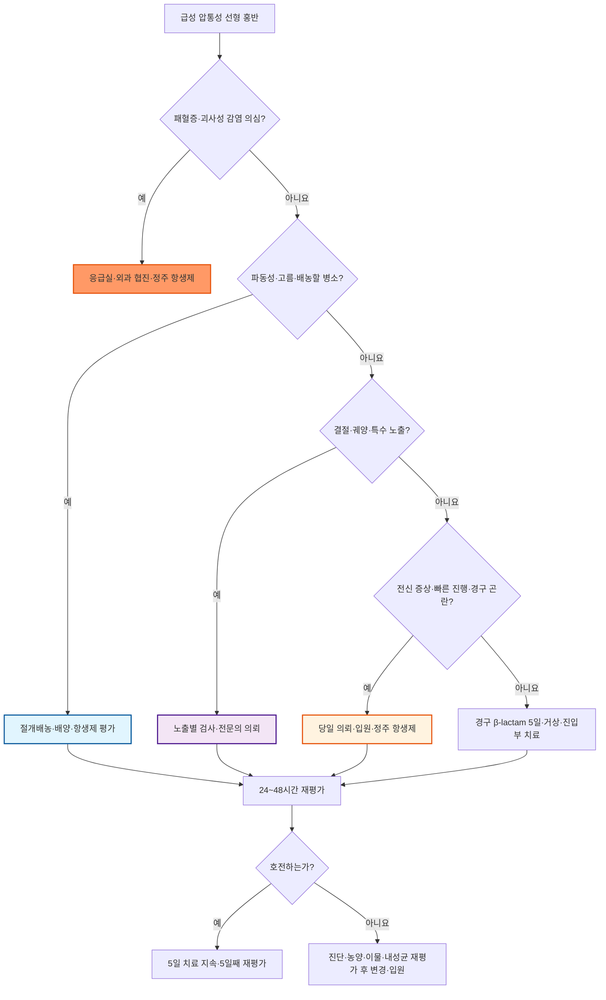

# 급성 세균성 림프관염 Acute Bacterial Lymphangitis

## <mark style="color:green;">일반 사항</mark>

* 피부 장벽 손상이나 원위부 피부·연조직 감염에서 세균이 표재 림프관을 따라 근위부로 확산하면서 발생하는 급성 염증
* 전형적으로 원발 병소에서 소속 림프절 방향으로 빠르게 진행하는 압통성 선형 홍반을 보이며, 연조직염과 동반되는 경우가 많다.
* 이 챕터는 **급성 세균성 림프관염**을 다룬다. 만성·아급성 림프관염 및 결절성 림프관염은 원인·검사·치료가 다르므로 구분한다.
* 합병증 : 국소 농양, 균혈증·패혈증, 반복 발생 후 이차성 림프부종
* 정확한 인구 기반 유병률 자료는 제한적이며, 상처 감염이나 연조직염에 동반되어 발생하는 경우가 흔하다.

## <mark style="color:green;">원인</mark>

* **Streptococcus pyogenes**(group A β-hemolytic streptococcus, GAS)가 가장 흔하다.
* **Staphylococcus aureus**는 감염된 상처, 농양 또는 화농성 원발 병소가 있을 때 고려한다.
* 전형적인 비화농성 감염에서는 MRSA가 흔하지 않다. 다만 관통상, 주사약물 사용, MRSA 감염·집락 병력, 다른 부위의 MRSA 감염, 화농성 병변 또는 전신염증반응이 있으면 MRSA 위험을 별도로 평가한다.
* 국가 감시자료는 국내 내성 추세를 파악하는 참고자료이지만 외래 피부연조직감염의 원인균 분포를 직접 나타내지는 않는다. 실제 경험적 치료에는 해당 지역·기관의 피부·연조직 검체 감수성 자료와 환자의 MRSA 위험인자를 우선 적용한다.

### <mark style="color:orange;">위험 인자 및 진입부</mark>

* 찰과상, 열상, 자상, 수술 상처, 벌레 물림 및 피부 궤양
* 발가락 사이 무좀·짓무름, 습진, 피부 균열, 수두 등 피부 장벽 손상
* 림프부종, 정맥부전, 수술 또는 방사선치료 후 림프배액 장애
* 당뇨병, 비만, 장기간의 전신 steroid 사용, 항암치료 및 기타 면역저하
* 말초혈관 카테터, 주사약물 사용
* 동물·사람 물림, 민물·해수 노출 등 특수 노출

## <mark style="color:green;">임상 양상</mark>

### <mark style="color:orange;">국소 소견</mark>

* 원발 상처나 피부감염에서 소속 림프절 방향으로 이어지는 불규칙하고 선형인 발적, 열감 및 압통
* 소속 림프절의 압통과 종대
* 주변 연조직염과 부종이 동반될 수 있다.
* **파동성 또는 화농성 분비물은 림프관염 자체의 전형적 소견이 아니라 동반 농양이나 화농성 원발 병소를 시사한다.** 이 경우 배농 가능성을 우선 평가한다.

### <mark style="color:orange;">전신 소견</mark>

* 발열, 오한, 권태감, 식욕 저하
* 두통, 근육통, 빈맥
* 피부소견이 작아 보여도 전신 증상이 더 빠르고 심하게 나타날 수 있다.

### <mark style="color:$danger;">🚩 Red Flags!</mark>

<mark style="color:$danger;">**즉각 조치 또는 의뢰**</mark>

* 저혈압, 의식 변화, 빠른 호흡 등 전신 독성 징후
* 피부소견보다 현저히 심한 통증 또는 급속한 진행 (→ 괴사성근막염 의심)
* 수포, 피부괴사, 반상출혈, 염발음(crepitus) 또는 피하기종 동반 (→ 괴사성근막염·가스괴저 의심)
* 패혈증을 시사하는 소견(저혈압, 빈맥, 빈호흡, 의식저하)\
  → 응급실 이송, 즉시 외과 협진 및 광범위 정주 항생제 고려. 영상검사 때문에 수술적 평가를 지연하지 않는다.

<mark style="color:$warning;">**당일 또는 조기 의뢰**</mark>

* 고열·오한을 동반한 빠른 근위부 진행
* 중증 면역저하 또는 호중구감소증
* 손·얼굴 등 기능적·미용적으로 중요한 부위의 병변
* 동물·사람 물림, 민물·해수 노출
* 주사약물 사용, 경구 섭취 불가
* 파동성·화농성 소견 등 배농이 필요한 병변\
  → 당일 상급의료기관 평가 또는 입원 고려

<mark style="color:$info;">**외래 추적 / 추가 평가 계획**</mark> <mark style="color:$info;">- 즉각 위험 낮으나 호전 없으면 의뢰</mark>

* 경증 외래 환자도 24\~48시간 안에 재평가한다.
* 48\~72시간에 호전이 시작되지 않거나 악화되면 진단, 순응도, 농양·이물, 결절성 림프관염 가능성, 내성균을 재평가한다.

## <mark style="color:green;">진단</mark>

* 전형적인 급성 세균성 림프관염은 병력과 진찰로 진단한다.
* 원발 병소, 진행 방향, 소속 림프절, 농양 여부와 감염 범위를 확인하고 활력징후 및 전신 상태를 평가한다.
* 하지 병변에서는 발가락 사이 균열·인설·짓무름과 무좀을 확인한다.
* 병변의 외곽을 표시하거나 사진으로 기록하면 진행 여부를 판단하는 데 도움이 된다.

### <mark style="color:orange;">검사</mark>

* **전형적인 경증 환자 :** CBC, 혈액배양 또는 피부 흡인·면봉배양을 일률적으로 시행하지 않는다.
* **CBC, CRP 등 :** 전신 증상, 중등증 이상, 면역저하 또는 입원 여부를 판단할 때 선택적으로 시행한다.
* **혈액배양 :** 고열·저혈압 등 중증 전신 소견, 항암치료·호중구감소증, 중증 세포매개면역저하, 동물 물림 또는 물 노출에서 고려한다. 가능하면 항생제 투여 전에 채취하되, 패혈증이나 중증 감염에서는 배양 때문에 항생제 투여를 지연하지 않는다.
* **창상·농 배양 :** 배농할 고름이나 임상적으로 의미 있는 삼출물이 있을 때 시행한다. 정상 피부를 면봉으로 문지른 검체는 진단 가치가 낮다.
* **초음파 :** 농양이 의심되지만 진찰만으로 불확실하거나 표재성 혈전정맥염·DVT 감별이 필요할 때 고려한다.
* **CT/MRI :** 심부 감염이나 괴사성근막염이 의심될 때 고려하되, 응급 외과 평가를 지연시키지 않는다.
* **LRINEC score**(CRP, WBC, Hb, Na, Cr, glucose 기반)는 괴사성근막염 조기 감별에 보조적으로 활용될 수 있으나 민감도가 낮아, 임상적 의심이 높으면 점수와 무관하게 외과 협진을 진행한다.
* Lymphangiography는 급성 세균성 림프관염의 통상적 진단검사가 아니다. 만성 림프부종 평가는 별도의 전문 진료 영역이다.

### <mark style="color:orange;">감별 진단</mark>

<table><thead><tr><th width="175">질환</th><th>감별 단서</th></tr></thead><tbody><tr><td>연조직염·단독</td><td>경계가 불명확하거나 비교적 선명한 면상 홍반이 중심이며, 림프관염이 동반될 수 있다.</td></tr><tr><td>피부농양</td><td>국소 파동성, 중심부 고름·배액; 절개배농이 치료의 핵심</td></tr><tr><td>표재성 혈전정맥염</td><td>표재정맥을 따라 만져지는 단단한 압통성 cord; 필요 시 혈관초음파</td></tr><tr><td>접촉피부염·절지동물 반응</td><td>가려움이 두드러지고 노출 모양과 일치; 발열·소속 림프절염은 흔하지 않음</td></tr><tr><td>결절성 림프관염</td><td>수일\~수주에 걸쳐 근위부 방향으로 불연속적인 결절이나 궤양이 발생; 특수 노출력 확인</td></tr><tr><td>고양이할큄병</td><td>고양이 접촉 후 접종 부위 구진과 아급성 소속 림프절염; 전형적 급성 선형 림프관염과 구분</td></tr><tr><td>림프관성 종양 침범</td><td>항생제에 반응하지 않는 지속성·재발성 병변, 암 병력 또는 비전형적 분포</td></tr><tr><td>괴사성근막염</td><td>피부소견보다 심한 통증, 빠른 진행, 전신 독성, 수포·괴사·반상출혈·염발음 또는 피하기종</td></tr></tbody></table>

### <mark style="color:orange;">결절성 림프관염의 노출력</mark>

<table><thead><tr><th width="195">노출</th><th>주요 병원체</th><th>접근</th></tr></thead><tbody><tr><td>장미가시·식물·흙, 감염된 고양이</td><td><em>Sporothrix</em> spp.</td><td>진균배양 또는 조직검사 고려</td></tr><tr><td>어항·물고기·기수</td><td><em>Mycobacterium marinum</em></td><td>항산균배양; 낮은 배양온도 필요 여부를 검사실에 알림</td></tr><tr><td>토양 접종</td><td><em>Nocardia</em> spp.</td><td>조직·배양검사 고려</td></tr><tr><td>중남미 등 유행지역 여행</td><td><em>Leishmania</em> spp.</td><td>감염내과·피부과 의뢰 및 특이검사</td></tr><tr><td>야생동물·진드기 노출</td><td><em>Francisella tularensis</em></td><td>의심 시 검사실과 감염내과에 미리 알림</td></tr></tbody></table>

> 결절성 림프관염은 일반적인 amoxicillin이나 cephalexin에 반응하지 않을 수 있다. 반복적인 경험적 β-lactam 투여보다 노출력에 따른 조직검사·세균·진균·항산균 검사를 우선한다.

***



<p align="center"><strong>진단 및 치료 알고리듬</strong></p>

<p align="center"><em><mark style="color:$info;">Ref. IDSA Practice Guidelines for SSTI (2014); CDC Clinical Guidance for Group A Streptococcal Cellulitis (2025)</mark></em></p>

***

## <mark style="background-color:$warning;">Management</mark>


**단계별 접근**: 응급 소견(괴사성근막염·패혈증) 배제 → 배농이 필요한 화농성 병소 확인 → 특수 노출·결절성 병변 감별 → 중증도에 따른 항생제 선택 → 24\~48시간 재평가


## <mark style="color:green;">비-약물 치료 및 예방</mark>

* 원발 상처를 세척하고 이물이나 괴사조직을 제거한다.
* 농양이 있으면 절개배농을 우선한다.
* 환부를 심장보다 높게 거상하고 무리한 사용을 줄인다.
* 발가락 사이 무좀·짓무름, 습진, 궤양, 부종 및 정맥부전 등 진입부와 재발 요인을 함께 치료한다.
* 동물·사람 물림이나 오염된 상처에서는 파상풍 예방접종 상태를 확인하고, 동물 노출에 따라 광견병 예방 필요성을 평가한다.
* 상처 관리, 피부 보습, 무좀 치료 및 림프부종 관리로 재발 위험을 줄인다.
* 고름·삼출물이 있는 상처에서는 손 위생을 철저히 하고, 수건·면도기 등 피부에 닿는 개인 물품은 다른 사람과 공유하지 않는다. 비화농성 림프관염 자체가 일상적 접촉으로 전파되는 것은 아니다.

## <mark style="color:green;">약물 치료</mark>

### <mark style="color:orange;">항생제 선택 원칙</mark>

* 전형적인 경증 비화농성 림프관염은 GAS를 표적으로 하는 경구 β-lactam으로 치료한다.
* 감염된 상처나 MSSA 동반 가능성이 있으면 1세대 cephalosporin을 고려한다.
* 단순 선형 발적만으로 MRSA 치료제를 일률적으로 추가하지 않는다.
* 물림, 물 노출, 결절성 병변은 병원체 범위가 다르므로 아래의 일반 요법만 적용하지 않는다.
* 경증 비화농성 연조직염 지침을 적용하여 **5일 치료를 기본**으로 하되, 5일째 임상적 호전이 불충분하면 7\~10일까지 연장한다.


**Cephalexin 용법 - 국내 허가 용법과 국제 임상 관행을 구분해 적용**\
국내 허가의 통상 용법은 500 ㎎ bid\~tid이나, 국제 연조직염 지침·임상에서는 500 ㎎ qid도 흔히 사용된다. 아래 표의 용법은 국내 허가 기준이며, 중증도에 따라 qid 증량 여부를 별도로 판단한다.


<table><thead><tr><th width="145">상황</th><th width="265">성인 예시 용법</th><th>주요 고려사항</th></tr></thead><tbody><tr><td>전형적 경증 비화농성<br/>GAS 중심</td><td>Amoxicillin 500 ㎎ tid × 5일<br/><mark style="color:blue;">\[파목신캡슐]</mark></td><td>국내 허가 용법은 1회 250\~500 ㎎, 1일 3회. 화농성 병소나 S. aureus 가능성이 높으면 단독 선택을 재검토한다.</td></tr><tr><td>경증, MSSA도 고려</td><td>Cephalexin 500 ㎎ tid × 5일<br/><mark style="color:blue;">\[팔렉신캡슐]</mark></td><td>국내 허가의 통상 용법은 500 ㎎ bid\~tid이다. 국제 연조직염 지침·임상에서는 500 ㎎ qid도 흔히 사용되므로 국내 허가 용법과 구분해 적용한다. 신장애에서 감량한다.</td></tr><tr><td>중등증 또는<br/>경구 투여 곤란</td><td>Ceftriaxone 1\~2 g IV/IM q24h<br/><mark style="color:blue;">\[트리악손주]</mark></td><td><strong>단회 치료가 아니다.</strong> 매일 임상반응을 재평가하고 호전 시 적절한 경구제로 전환한다. 중증 환자를 단순 외래 주사로 대체하지 않는다.</td></tr><tr><td>비중증 지연형<br/>penicillin 알레르기</td><td>Cephalexin 고려</td><td>과거 반응의 종류와 중증도를 확인한다. 즉시형 또는 중증 지연형 과민반응에서는 사용하지 않는다.</td></tr><tr><td>즉시형 중증<br/>β-lactam 알레르기</td><td>Clindamycin을 지역 감수성과<br/>국내 허가사항에 따라 제한적으로 고려</td><td>Azithromycin을 일률적인 대체약으로 사용하지 않는다. 지역 감수성을 확인할 수 없거나 중증이면 입원하여 vancomycin 또는 linezolid 등 대안을 감염내과와 결정한다.</td></tr><tr><td>MRSA 위험 또는<br/>중증 비화농성 감염</td><td>입원하여 vancomycin 등<br/>MRSA·streptococcus 활성 약제 고려</td><td>관통상, 주사약물 사용, MRSA 병력·집락, 다른 부위 MRSA 감염 또는 전신염증반응을 확인한다. 중증 면역저하나 괴사성 감염 의심 시 더 넓은 경험적 치료가 필요하다.</td></tr></tbody></table>


**Clindamycin 국내 허가사항과 국제 지침의 차이**\
국내 <mark style="color:blue;">\[훌그램캡슐 150 ㎎]</mark> 허가 용법은 중증감염 150 ㎎ q6h, 심한 중증감염 300\~450 ㎎ q6h이며, β-용혈성연쇄구균 감염은 최소 10일 투여하도록 명시한다. 국제 비화농성 cellulitis 지침의 5일 기본 원칙과 차이가 있으므로 제품 허가사항, 중증도 및 감수성 자료를 함께 고려한다. 이 문서에서는 일률적인 clindamycin 처방례를 제시하지 않는다.



**⚠️ 특수 노출 항생제 분기**

* **동물·사람 물림 :** 호기성·혐기성균을 함께 포괄하는 amoxicillin/clavulanate(경구) 또는 ampicillin/sulbactam(정주)
* **민물 노출(*Aeromonas*) :** fluoroquinolone 또는 3세대 cephalosporin 등을 중증도와 배양·감수성 결과에 따라 선택한다. 중증 감염은 감염내과와 협의한다.
* **해수 노출(*Vibrio*, 특히 *V. vulnificus*) :** doxycycline 100 ㎎ bid + ceftazidime 1\~2 g IV/IM q8h가 CDC의 대표 권고이다. 대안으로 3세대 cephalosporin + fluoroquinolone 또는 fluoroquinolone 단독을 고려한다.

간질환·면역저하 환자에서 *V. vulnificus* 감염은 급속히 진행하는 괴사성 병변과 패혈증으로 이어질 수 있어 의심 시 즉시 입원·광범위 항생제 치료가 필요하다.



**⚠️ Clindamycin 내성자료의 적용 한계**\
미국 침습성 GAS 감시자료에서는 erythromycin·clindamycin 내성이 증가하고 있으나, 이를 국내 비침습성 피부·림프관 감염의 내성률로 직접 적용할 수 없다. 이 챕터가 다루는 비화농성 GAS 중심 감염에서는 TMP-SMX 단독의 연쇄구균 활성이 불확실하다. 즉시형 중증 β-lactam 알레르기이면서 중증 감염이면 입원하여 vancomycin 또는 linezolid 등 대안을 감염내과와 결정한다.


### <mark style="color:orange;">신기능·임신·소아 고려</mark>

* **신기능 저하 :** Amoxicillin은 중등도 이상 신장애에서 감량한다(예 : CrCl 10\~30 mL/min → 250\~500 ㎎ q12h; CrCl <10 mL/min → 250 ㎎ q24h). Cephalexin도 중증 신장애(CrCl ≤10 mL/min)에서 최대 용량을 낮춘다. Ceftriaxone은 1일 2 g 이하 용량에서는 신장애 단독일 때 통상 감량하지 않지만, 중증 신장애와 간기능장애가 함께 있으면 2 g/day를 초과하지 않고 면밀히 모니터링한다.
* **임신 :** Amoxicillin, cephalexin은 임신 중 비교적 안전한 1차 선택제이다. 국내 clindamycin 제품은 임신 중 안전성이 확립되지 않았으므로 치료상 유익성이 위험을 상회할 때 신중하게 사용한다. Doxycycline 등 tetracycline 계열은 임신 중 피한다.
* **수유 :** Amoxicillin, cephalexin은 대체로 수유 중 사용할 수 있다. 국내 <mark style="color:blue;">\[훌그램캡슐]</mark> 허가사항은 clindamycin의 모유 이행과 신생아 이상반응 가능성 때문에 수유하지 않도록 규정한다. 이는 수유 지속을 허용하는 일부 국제 자료와 차이가 있다.
* **소아 :** 국내 <mark style="color:blue;">\[파목신]</mark> 허가 기준은 체중 20 ㎏ 미만에서 amoxicillin 20\~40 ㎎/㎏/day를 tid로 분할하고, 20 ㎏ 이상에서는 성인 용법인 1회 250\~500 ㎎ tid를 적용한다. <mark style="color:blue;">\[팔렉신]</mark>은 25\~50 ㎎/㎏/day를 qid로 분할하며, 중증 또는 감수성이 낮은 경우 50\~100 ㎎/㎏/day를 qid로 분할한다. 성인 최대 용량을 넘지 않는다.

### <mark style="color:orange;">해열·진통제</mark>

* **Ibuprofen :** 400 ㎎ tid 필요 시 투여; 통증이 심하면 600 ㎎ tid까지 제한적으로 고려한다. 고령자, 신장질환, 소화성궤양, 심혈관질환, 항응고제 복용 및 임신에서는 회피 또는 최소 용량을 사용한다.
* **Dexibuprofen :** 300 ㎎ bid\~tid 필요 시 투여할 수 있으며 1일 1,200 ㎎을 초과하지 않는다. Ibuprofen과 중복 투여하지 않는다.
* **Acetaminophen 일반정 :** 500\~650 ㎎ q6\~8h 필요 시 투여한다. 일반 성인은 통상 1일 3,000 ㎎ 이하로 사용하고, 저체중·간질환·과음에서는 더 낮은 한도를 적용한다.
* **Acetaminophen 650 ㎎ 서방정 :** 2정 q8h로 사용하는 제품은 1일 6정을 초과하지 않는다. 일반정 용법과 혼동하지 않는다.

***

### <mark style="color:red;">질병코드</mark>

**⚠️ I89.1은 급성 세균성 림프관염에는 사용하지 않는다.** 급성은 병변 위치에 따라 L03.- 하위 코드를 사용한다.

<table><thead><tr><th width="125">코드</th><th>분류</th></tr></thead><tbody><tr><td><mark style="color:red;">L03.-</mark></td><td>연조직염 및 급성 림프관염. 병변 위치에 따라 세부 코드를 선택한다.</td></tr><tr><td>L03.0</td><td>손가락 및 발가락의 연조직염·급성 림프관염</td></tr><tr><td>L03.1</td><td>사지 기타 부분의 연조직염·급성 림프관염</td></tr><tr><td>L03.2</td><td>얼굴의 연조직염·급성 림프관염</td></tr><tr><td>L03.3</td><td>몸통의 연조직염·급성 림프관염</td></tr><tr><td>L03.8</td><td>기타 부위의 연조직염·급성 림프관염</td></tr><tr><td>L03.9</td><td>상세불명의 연조직염·급성 림프관염</td></tr><tr><td>I89.1</td><td>만성·아급성·상세불명 림프관염. <strong>급성 세균성 림프관염에는 사용하지 않는다.</strong></td></tr></tbody></table>

***

### <mark style="color:purple;">처방례</mark>

> **처방례 1. 전형적 경증 비화농성**
>
> ```
> 파목신캡슐 500 ㎎  1C  tid × 5일
> 부루펜정  200 ㎎  2T  tid × 3일, 통증·발열 시
> ```
>
> _✽Amoxicillin 500 ㎎ tid로 GAS를 표적. 24\~48시간 내 재평가하며, 화농성 병소나 S. aureus 가능성이 높으면 약제 선택을 재검토한다._

> **처방례 2. 감염된 상처, MSSA 동반 가능성**
>
> ```
> 팔렉신캡슐 500 ㎎  1C  tid × 5일
> 애니펜정  300 ㎎  1T  tid × 3일, 통증·발열 시
> ```
>
> _✽Cephalexin 500 ㎎ tid는 국내 허가의 통상 용법이다. Dexibuprofen은 ibuprofen과 병용하지 않는다._

> **처방례 3. 경구 투여가 곤란한 중등증**
>
> ```
> 트리악손주  1~2 g  IV/IM  q24h
> ```
>
> _✽Ceftriaxone은 1일 1회 투여하며 단회 치료가 아니다. 매일 재평가하고, 호전 시 경구제로 전환한다._

***

### <mark style="color:$success;">핵심 복약 지도</mark>

> **항생제 복용 원칙**
>
> * 정해진 간격과 기간(전형적인 경증에서는 5일 기본)을 지키도록 안내한다. 5일째 호전이 불충분하면 7\~10일까지 연장할 수 있다.
> * Amoxicillin, cephalexin은 음식과 관계없이 복용할 수 있다.
> * 남은 항생제를 임의로 재사용하거나 타인과 나누지 않도록 안내한다.

> **재평가 시점**
>
> * 24\~48시간 이내 반드시 임상 경과를 확인한다. 악화 시 예정된 방문일까지 기다리지 않는다.
> * 48\~72시간에 호전이 시작되지 않으면 진단, 순응도, 농양·이물, 결절성 림프관염 가능성, 항생제 내성균을 재평가한다.
> * ⚠️ **괴사성근막염·패혈증이 의심되면 영상검사 결과를 기다리느라 외과적 평가를 지연하지 않는다.**

> **부작용 모니터링**
>
> * 항생제 복용 후 호흡곤란, 얼굴·입술 부종, 전신 두드러기 → 즉시 중단, 응급 진료
> * 심한 설사, 혈변, 지속되는 복통 → 항생제 관련 장염 가능성 평가
> * Ibuprofen과 dexibuprofen은 같은 계열의 NSAID이므로 함께 복용하지 않도록 안내한다.

> **언제 다시 병원을 방문해야 하나요?**
>
> * 24\~48시간 이내 예정된 재평가
> * 48\~72시간에 호전이 없거나 악화되는 경우 - 즉시 재방문
> * 고름, 물렁한 덩이가 만져지는 경우 - 배농 필요성 평가
> * 손·얼굴 병변, 동물·사람 물림, 경구 섭취 불가 - 당일 재평가

***

### <mark style="color:blue;">환자 안내서</mark>


**급성 림프관염, 항생제와 함께 상처·피부 관리가 중요합니다**

상처나 피부감염에서 세균이 림프관을 따라 퍼지면서 붉고 아픈 선이 생기는 질환입니다. 대부분 경구 항생제로 호전되지만, 정해진 기간을 지켜 복용하고 정해진 날짜에 다시 진료받는 것이 중요합니다.


#### <mark style="color:$primary;">왜 이런 증상이 생기나요?</mark>

* 상처나 무좀 등으로 피부 장벽이 손상되면 세균이 표재 림프관을 따라 몸 중심부 또는 소속 림프절 방향으로 퍼지면서 붉은 선, 통증, 발열이 나타납니다.

#### <mark style="color:$primary;">일상생활에서 어떻게 관리하나요?</mark>

* **팔·다리를 심장보다 높게 올리십시오.** 부기와 통증을 줄이고 회복을 돕습니다.
* **상처는 깨끗하고 건조하게 관리하십시오.**
* **번진 부위의 가장자리를 볼펜으로 표시하거나 사진을 찍어두십시오.** 다음 진료 때 퍼지는 속도를 비교하는 데 도움이 됩니다.
* **무좀, 습진 등 피부 문제를 함께 치료하십시오.** 재발을 막는 가장 중요한 방법입니다.

#### <mark style="color:$primary;">항생제는 어떻게 복용하나요?</mark>

* 처방받은 간격과 기간(전형적인 경증에서는 보통 5일)을 지켜 복용합니다. 증상이 좋아져도 임의로 중단하지 않습니다.
* 이전에 처방받고 남은 항생제를 다시 사용하지 않습니다.

#### <mark style="color:$primary;">이럴 때는 즉시 응급실을 방문하세요</mark>

* 통증이 급격히 심해지거나 붉은 부위가 빠르게 퍼지는 경우
* 고열, 심한 오한, 어지럼·의식 저하가 나타나는 경우
* 물집이나 검붉은 변색, 피부가 벗겨지는 듯한 소견이 나타나는 경우

#### <mark style="color:$primary;">이럴 때는 당일 다시 진료받으세요</mark>

* 고름이 잡히거나 물렁한 덩이가 만져지는 경우(배농이 필요할 수 있음)
* 항생제를 복용하는 동안 붉은 범위가 계속 넓어지는 경우
* 손·얼굴 병변, 동물·사람 물림 또는 경구 섭취가 어려운 경우

## 참고문헌

1. Stevens DL, et al. [Practice Guidelines for the Diagnosis and Management of Skin and Soft Tissue Infections: 2014 Update by the Infectious Diseases Society of America](https://www.idsociety.org/practice-guideline/skin-and-soft-tissue-infections/). *Clin Infect Dis*. 2014;59:e10-e52.
2. Centers for Disease Control and Prevention. [Clinical Guidance for Group A Streptococcal Cellulitis](https://www.cdc.gov/group-a-strep/hcp/clinical-guidance/cellulitis.html). Updated 2025.
3. Centers for Disease Control and Prevention. [Yellow Book: Post-Travel Dermatologic Conditions-Lymphocutaneous or Sporotrichoid Spread of Infection](https://www.cdc.gov/yellow-book/hcp/post-travel-evaluation/post-travel-dermatologic-conditions.html). 2025.
4. World Health Organization. [ICD-10 Version 2019](https://icd.who.int/browse10/2019/en): L03 Cellulitis and Acute Lymphangitis; I89.1 Lymphangitis.
5. 동화약품. [파목신캡슐 제품정보](https://www.dong-wha.co.kr/product/content.asp?b=10&s=11&t_idx=12); [팔렉신캡슐 500 mg 제품정보](https://dong-wha.co.kr/product/content.asp?b=10&s=11&t_idx=20).
6. 대화제약. [Ceftriaxone 주사제 제품정보](https://www.dhpharm.co.kr/html/dh/DH_product_detail?idx=185): 성인 및 12세 이상 소아 1\~2 g IV/IM, 1일 1회.
7. Centers for Disease Control and Prevention. [Clinical Overview of Vibriosis-Treating Wound Infection](https://www.cdc.gov/vibrio/hcp/clinical-overview/index.html).
8. [국내 훌그램캡슐 150 ㎎ 제품정보](https://www.connectdi.com/cont/drug/?dl_idx=3391&pap=detail): clindamycin 성인 용법, β-용혈성연쇄구균 감염 치료 기간 및 임신·수유 주의사항.
9. National Library of Medicine. [Clindamycin-Drugs and Lactation Database (LactMed®)](https://www.ncbi.nlm.nih.gov/books/NBK501208/).
10. 질병관리청. [제2기(2020～2022년) 국가 항균제 내성균 조사(Kor-GLASS) 운영 결과](https://kdca.go.kr/bbs/kdca/263/306528/download.do). 국가 내성 추세의 참고자료이며 외래 피부연조직감염의 원인균 분포를 직접 나타내지는 않음.
