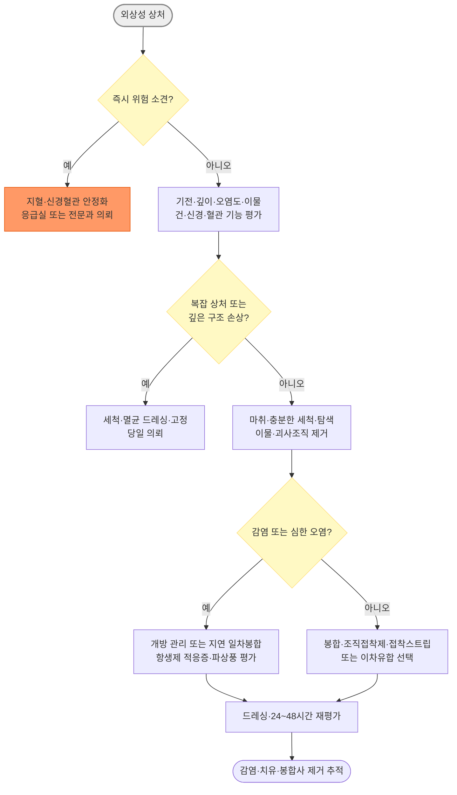

# 상처 관리 Wound Care

급성 찰과상·열상·천자상 등 외상성 상처의 초기 평가, 세척, 봉합, 드레싱과 파상풍 예방을 다룬다.

## <mark style="color:green;">일반 사항</mark>

* 급성 외상성 상처(찰과상·열상·천자상)의 평가, 세척, 봉합, 드레싱과 파상풍 예방을 다루는 처치 중심 챕터
* 물림, 화상, 욕창·당뇨발궤양, 개방골절 및 이미 감염된 상처의 **세부 치료는 해당 챕터에서 다룬다.** 이 챕터에서는 이러한 상처의 초기 인지, 세척·봉합 보류, 예방적 항생제 적응증과 의뢰 원칙만 간략히 설명한다

### <mark style="color:$danger;">🚩 Red Flags!</mark>

<mark style="color:$danger;">**즉각 조치 또는 의뢰**</mark>

* 직접 압박으로 조절되지 않는 출혈, 분출성 출혈 또는 혈역학적 불안정
* 창백·차가움, 모세혈관 재충만 지연, 원위부 맥박 소실 등 혈관 손상·사지 허혈
* 봉합 후 새로 발생하거나 악화되는 창백·청색증·차가움 또는 감각·운동 이상
* 구획증후군 의심 : 손상 정도에 비해 심한 통증, 수동 신전 시 통증, 긴장성 부종, 감각·운동 이상
* 고압분사 손상, 광범위 압궤·박리(degloving), 절단 또는 다발성 중증외상
* 개방성 흉부·복부 손상, 개방골절 또는 괴사성 연조직감염 의심

<mark style="color:$warning;">**당일 의뢰 또는 평가**</mark>

* 건·신경·혈관·관절강·골 침범 또는 깊은 이물 의심
* 감각저하, 운동 제한·특정 방향의 근력저하가 있는 손·발 상처
* 안검연·누소관, 입술 홍순 경계, 코·귀 연골, 침샘관 또는 주요 안면신경 손상 가능성
* 사람 물림, 손의 깊은 동물 물림, 관절·건초 인접 물림
* 심한 오염, 광범위 조직결손, 제거하기 어려운 이물 또는 충분한 탐색·세척이 어려운 상처
* 당뇨병·말초혈관질환·중증 면역저하 환자의 깊거나 오염된 상처
* 농성 분비물, 발열·전신증상 또는 빠르게 확대되는 발적·통증

<mark style="color:$info;">**외래 추적 / 추가 평가 계획**</mark> <mark style="color:$info;">- 즉각 위험 낮으나 호전 없으면 의뢰</mark>

* 국한된 경미한 발적·멍 또는 통증이 있으나 진행하지 않고 전신증상이 없는 경우
* 오염 상처, 지연 일차봉합 예정 상처 또는 치유 지연 위험요인이 있는 환자
* 단순 변연 벌어짐 또는 예상보다 치유가 지연되지만 급성 악화 소견이 없는 경우

## <mark style="color:green;">평가</mark>

* **병력** : 손상 시각·기전, 오염원, 물림·천자·고속 또는 고압 손상, 이물 가능성, 현장 처치, 파상풍 접종력
* **환자 요인** : 당뇨병, 말초혈관질환, 면역저하, 흡연, 영양상태, 항응고제·항혈소판제, 국소마취제·접착제 알레르기
* **상처 기록** : 해부학적 위치, 길이·깊이, 오염도, 조직결손·괴사, 출혈, 손톱·연골·골·건 노출
* **신경혈관·기능 평가** : 가능하면 마취 전에 원위부 맥박·모세혈관 재충만·감각·능동운동·건 기능을 확인하고 기록
* **탐색** : 충분한 조명과 지혈하에 관절을 움직여 상처의 전 범위를 확인한다. 보이지 않는 깊은 부위를 맹목적으로 기구로 찌르지 않는다

### <mark style="color:orange;">이물과 영상검사</mark>

* 유리·금속·자갈 등 방사선 비투과성 이물이 의심되면 단순방사선검사를 고려한다
* 목재·식물가시 등 방사선 투과성 이물은 초음파가 도움이 될 수 있다
* 관절 인접 깊은 상처, 골 압통·변형, 고속 손상에서는 골절·관절강 침범을 평가한다
* 제거가 어렵거나 신경혈관·건·관절에 인접한 이물은 무리하게 제거하지 말고 의뢰한다

***



<p align="center"><strong>외상성 상처 초기 평가·처치 알고리듬</strong></p>

***

## <mark style="background-color:$warning;">Management</mark>

### <mark style="color:orange;">지혈과 통증 조절</mark>

* 멸균 거즈로 지속적인 직접 압박을 시행한다. 자주 들어 확인하면 혈전 형성을 방해할 수 있다
* 사지의 생명을 위협하는 출혈에서만 적절한 지혈대를 고려하고 적용 시각을 기록한다
* 항응고제·항혈소판제 복용자에서도 직접 압박과 출혈점 지혈이 우선이다. 필요시 산화셀룰로오스·젤라틴 스펀지 등 국소 지혈제를 고려하되, 좁은 공간에서의 팽창과 신경혈관 압박에 주의하고 봉합 전 잔류 가능 여부를 제품 설명서로 확인한다. 항응고제·항혈소판제를 환자가 임의로 중단하지 않도록 한다
* 국소침윤마취 또는 부위신경차단 후 충분히 세척·탐색한다. 손상된 건·신경 기능은 가능하면 마취 전에 평가한다

### <mark style="color:orange;">상처 세척</mark>

* **세척량은 오염 정도가 최우선 기준이며, 상처 길이는 참고치일 뿐이다.** 육안상 이물이 제거되고 배출액이 깨끗해질 때까지 시행하며, 실무상 상처 길이 1 ㎝당 약 50\~100 ㎖를 참고할 수 있으나 절대 기준은 아니다
* 약 5\~8 psi의 압력이 흔히 사용된다. 35 ㎖ 주사기와 19 G 카테터·세척 팁으로 약 7 psi를 만들 수 있다
* 세척 시 보안경·안면보호구를 착용하여 비말 노출을 예방한다
* 과도한 고압 세척은 건강한 조직을 손상시키거나 오염을 깊은 조직으로 밀어 넣을 수 있으므로, 조직이 연약하거나 깊은 구조가 노출된 상처에서는 주의한다
* **Poloxamer-188** 등 계면활성제 기반 상처 세정제는 살균제가 아니다. 제품이 상처·점막용으로 허가된 경우에 한하여 설명서대로 사용한다

### <mark style="color:orange;">피부 소독제와 상처 내 사용</mark>


상처 내부의 기본 세척액은 생리식염수 또는 음용 가능한 수돗물이다. 알코올 및 알코올 함유 chlorhexidine 제제를 열린 상처 내부에 흘려 넣지 않는다. Chlorhexidine은 눈·중이·신경조직에 독성이 있으므로 눈 주변, 고막 손상 가능 부위와 점막에 특히 주의한다


* **70% isopropyl alcohol** : 빠른 살균효과가 있으나 잔류효과가 없고 조직자극·세포독성이 있어 정상 피부 소독에 사용한다
* **Chlorhexidine** : 광범위 항균작용과 잔류효과가 있으나 농도·제형에 따라 조직독성이 달라진다. "상피 재생을 저해하지 않는다"라고 일반화하지 않는다
* **Povidone-iodine 10%** <mark style="color:blue;">\[베타딘액]</mark> : 국내 허가사항상 찢긴 상처·화상·창상, 궤양·농양 및 감염 피부면의 살균소독 등에 환부 도포가 가능하다
  * **상처 내부의 일상적 세척액으로는 권장하지 않는다.** 응급 현장에서 관행적으로 이루어지는 '희석 베타딘 세척'도 표준 처치가 아니다
  * 문헌의 0.35% 희석액 3분 관류는 주로 관절치환술·척추수술에서 봉합 전 수술창에 적용한 별도 프로토콜이며(AAOS Intraoperative Irrigation; Meehan JP, et al. *J Am Acad Orthop Surg*. 2025), 이를 일반 외상성 열상의 표준 세척법으로 확대하거나 10% 외용액을 임의로 희석하여 사용하지 않는다
  * **국내 허가상 금기** : 성분 과민증, 갑상선기능 이상, 신부전, 신생아·6개월 미만 영아, 포진상 피부염, 방사성요오드 치료 전후
  * **주의** : 임신·수유, 갑상선·신장질환 병력, 화상·광범위 창상에서 반복·장기간 사용할 때는 제품 허가사항을 확인한다
* 과산화수소, benzalkonium chloride, 아세트산 등도 농도와 노출시간에 따라 섬유모세포·상피세포 독성 및 치유 지연을 일으킬 수 있어 단순 상처에 반복 사용하지 않는다

### <mark style="color:orange;">변연절제 Debridement</mark>

* 세척만으로 제거되지 않는 흙·기름·자갈과 명백한 괴사·비활성 조직을 제거한다
* 생존 가능한 조직, 특히 얼굴·손·발의 조직은 보존한다. 깊은 구조와 가까운 조직을 무리하게 절제하지 않는다
* 변연절제 후 다시 세척하고 지혈·신경혈관 상태를 재평가한다
* 혈류가 불량한 허혈성 상처의 건조하고 안정된 가피는 전문 평가 없이 일률적으로 제거하지 않는다

### <mark style="color:orange;">상처 봉합 선택</mark>

#### <mark style="color:$primary;">일차봉합</mark>

* 충분히 세척·탐색되고 감염 소견이 없으며 변연을 무리 없이 맞출 수 있는 상처에서 고려한다
* 발생 후 경과시간만으로 정한 절대적인 "golden period"는 없다. 부위, 오염도, 기전, 환자의 치유 위험요인을 함께 판단한다
* 깊은 열상은 필요한 경우 사강과 장력을 줄이는 층별 봉합을 고려한다

#### <mark style="color:$primary;">지연 일차봉합 또는 이차유합</mark>

* 감염 소견, 심한 유기물 오염, 광범위 압궤·괴사조직, 충분한 세척·변연절제가 어려운 경우에는 일차봉합을 보류한다
* 철저히 세척·변연절제한 뒤 느슨한 드레싱으로 관리하고, 보통 3\~5일 후 감염이 없을 때 지연 일차봉합을 고려한다
* 물림은 종류·부위·깊이에 따라 다르다. 얼굴의 일부 깨끗한 물림은 충분한 세척과 항생제 적응증 평가 후 일차봉합할 수 있으나, 손·발의 깊은 물림, 천자상, 사람 물림 또는 감염된 물림은 일차봉합을 피하는 경우가 많다

### <mark style="color:orange;">조직접착제 Tissue Adhesive</mark>

* **대상** : 깨끗한 직선형 상처, 지혈 완료, 변연이 쉽게 맞고 장력이 낮으며 깊은 구조 손상이 없는 경우
* **부적합** : 감염·오염·물림, 불규칙하거나 벌어진 상처, 점막·점막피부 경계, 습윤·마찰이 심한 부위, 고정하지 않은 관절, 지혈되지 않은 상처
* 상처 길이 2 ㎝를 절대 기준으로 사용하지 않는다. 길이보다 장력, 깊이, 변연 접합과 위치가 중요하다
* 접착제를 상처 내부에 넣지 말고 맞닿은 피부 표면에 얇게 도포한다. 눈 주변에서는 안구 유입을 차단한다
* 접착제 위에 연고·바셀린을 바르면 접착력이 저하될 수 있다. 억지로 떼지 않고 자연 탈락하도록 한다
* 조직접착제 <mark style="color:blue;">\[Dermabond]</mark>와 접착식 피부봉합 스트립 <mark style="color:blue;">\[Steri-Strip]</mark>은 별도 방법이다

### <mark style="color:orange;">드레싱</mark>

* 상처가 마르거나 거즈에 붙지 않도록 적절한 습윤 환경을 유지하되, 삼출물이 고여 주변 피부가 짓무르지 않도록 한다
* 드레싱 선택은 상처의 원인, 깊이, 감염·허혈 여부보다 우선할 수 없으며 삼출물 양과 상처 바닥 상태에 맞춘다

<table><thead><tr><th width="200">드레싱 종류 [제품 예]</th><th width="110">적합한 삼출물</th><th width="220">주요 용도</th><th>주의</th></tr></thead><tbody><tr><td>Polyurethane film <mark style="color:blue;">\[테가덤]</mark></td><td>없음\~매우 적음</td><td>표재성·재상피화 상처 보호, 관찰 용이</td><td>중등도 이상 삼출·감염 상처에는 부적합</td></tr><tr><td>Hydrogel</td><td>없음\~적음</td><td>건조한 상처에 수분 공급, 자가용해 변연절제 보조</td><td>다량 삼출·짓무름에는 부적합</td></tr><tr><td>Hydrocolloid <mark style="color:blue;">\[듀오덤]</mark></td><td>적음\~중등도</td><td>자가용해 변연절제, 밀폐·습윤 환경</td><td>감염 또는 다량 삼출 상처에는 통상 피함</td></tr><tr><td>Alginate <mark style="color:blue;">\[칼토스탯]</mark></td><td>중등도\~다량</td><td>고흡수성, 공동·출혈성 상처, 자가용해 변연절제 보조</td><td>건조한 상처·단단한 건성 가피에는 부적합</td></tr><tr><td>Polyurethane foam <mark style="color:blue;">\[메디폼]</mark></td><td>중등도\~다량</td><td>삼출물 흡수, 완충과 보호</td><td>제품별 흡수력·접착면 차이 확인</td></tr></tbody></table>

#### <mark style="color:$primary;">공동과 packing</mark>

* 깊은 공동을 packing할 때는 배액을 방해하거나 조직을 압박하지 않도록 **느슨하게 채운다**. "사강이 없도록" 빽빽하게 채우지 않는다
* 제거할 수 있도록 드레싱의 끝을 밖에 남기고, 사용한 개수와 길이를 기록한다
* 깊이나 방향을 알 수 없는 누공·천자상을 맹목적으로 packing하지 않는다
* 욕창·만성상처, 농양 배농 후 공동과 지연봉합 예정 외상성 상처는 목적과 교환 주기가 다르므로 개별 계획을 세운다

### <mark style="color:orange;">예방적 항생제</mark>

* 건강한 환자의 깨끗하고 감염되지 않은 비물림 단순 열상에는 예방적 전신 항생제를 일률적으로 투여하지 않는다
* 사람·동물 물림, 깊은 천자상, 손·발의 고위험 상처 또는 면역저하에서는 예방적 항생제 적응증을 별도로 평가한다
* 사람·동물 물림에서 예방적 항생제가 필요한 경우 amoxicillin/clavulanate가 대표적인 1차 선택이다
* 개방골절, 관절·건초·골 침범, 고압분사 또는 심한 압궤손상은 단순 외래 예방처방으로 대신하지 않고 별도 응급·수술 프로토콜에 따른다
* 항생제는 충분한 세척·이물 제거·변연절제·배농을 대신하지 않으며 파상풍 예방 목적으로 사용하지 않는다
* 불필요한 항생제 사용은 내성 위험을 높이므로, 적응증이 명확한 경우에 한하여 처방한다
* 단순 봉합 상처에는 petrolatum으로 습윤 환경을 유지할 수 있다. 국소 항생제는 접촉피부염과 내성 위험을 고려하여 일률적으로 장기간 사용하지 않는다

### <mark style="color:orange;">파상풍 예방</mark>

(☞ [예방접종](../231_/210_-vaccination.md#dtap-1))

* **깨끗하고 작은 상처** 이외의 상처에는 흙·분변·타액 오염, 천자상·물림, 화상, 압궤손상, 개방골절, 동상, 괴사·괴저 조직이 있는 상처 등이 포함된다(CDC 2025.6 개정)
* 기본접종 미상·미완료자는 상처 처치 시 1회 접종으로 끝내지 말고 이후 연령에 맞는 기본접종 일정을 완성한다

<table><thead><tr><th rowspan="2">과거 파상풍 함유 백신</th><th colspan="2">깨끗하고 작은 상처</th><th colspan="2">기타 오염되거나 큰 상처</th></tr><tr><th>백신</th><th>TIG</th><th>백신</th><th>TIG</th></tr></thead><tbody><tr><td>미상 또는 &lt;3회</td><td>필요</td><td>불필요</td><td>필요</td><td>필요 : 250 IU IM 1회</td></tr><tr><td>≥3회, 마지막 접종 &lt;5년</td><td>불필요</td><td>불필요</td><td>불필요</td><td>불필요*</td></tr><tr><td>≥3회, 마지막 접종 5\~9년</td><td>불필요</td><td>불필요</td><td>필요</td><td>불필요*</td></tr><tr><td>≥3회, 마지막 접종 ≥10년</td><td>필요</td><td>불필요</td><td>필요</td><td>불필요*</td></tr></tbody></table>

\* HIV 감염 또는 중증 면역결핍 환자의 오염 상처에서는 완료 접종력과 관계없이 TIG를 투여한다

* **백신 선택**
  * ＜7세 : 연령과 과거 접종력에 맞는 DTaP 계열 백신
  * ≥7세에서 과거 Tdap 접종이 없거나 불명확 : Tdap 우선
  * 이미 Tdap 접종력이 있는 경우 : Td 또는 Tdap 사용 가능
  * 파상풍 함유 백신 접종 적응증이 있는 임신부에서는 Tdap을 사용한다. 같은 임신 중 상처 처치로 Tdap을 이미 접종했다면 27~36주에 반복 접종하지 않는다

### <mark style="color:orange;">봉합 후 관리와 추적</mark>

* 오염·고위험 상처, 지연 일차봉합 예정 상처는 24\~48시간 내 재평가한다
* 봉합 후 24시간이 지나면 대부분 짧은 샤워는 가능하지만 문지르거나 물에 오래 담그지 않는다. 조직접착제 사용 시 제품 설명을 우선한다
* 봉합사 제거 시기는 상처 장력, 환자 요인과 치유 상태에 따라 조정한다
* 치유 지연 요인에는 고령, 흡연, 당뇨병·말초혈관질환, 빈혈·영양결핍, 부종·지속 압박, 악성종양 및 corticosteroid·면역억제제 사용 등이 있다. 교정 가능한 요인을 함께 관리한다
* 모발이 처치에 방해되지 않으면 제거할 필요가 없다. 제거가 필요하면 면도날보다 clipper로 짧게 자르며, 눈썹은 미용상 다시 자라지 않을 위험이 있어 자르지 않는다

<table><thead><tr><th>부위</th><th>통상적인 제거 시기</th></tr></thead><tbody><tr><td>얼굴</td><td>3\~5일</td></tr><tr><td>두피</td><td>7\~10일</td></tr><tr><td>몸통</td><td>10\~14일</td></tr><tr><td>팔</td><td>7\~10일</td></tr><tr><td>다리·손등·발등</td><td>10\~14일</td></tr><tr><td>손바닥·발바닥 또는 관절 위 고장력 부위</td><td>14\~21일</td></tr></tbody></table>

## <mark style="color:green;">시술 및 기타 처치</mark>

### <mark style="color:orange;">흉터와 켈로이드 관리</mark>

* 켈로이드는 피부색이 짙은 환자, 젊은 연령, 흉곽 중앙·어깨·볼·귓불 및 화상 후에 더 잘 발생한다
* 상처가 완전히 닫히고 재상피화된 뒤 자외선 차단과 silicone gel 또는 silicone gel sheet를 고려한다
* **Silicone gel/sheet** <mark style="color:blue;">\[켈로코트 겔, 시카케어 시트 등]</mark> : 비후성 흉터·켈로이드에 대한 효과가 보고되어 왔으나, 근거가 된 연구들의 질이 낮아 확실한 근거로 보기는 어렵다. Gel과 sheet는 서로 다른 제형이다
* **양파추출물·헤파린·알란토인 복합제** <mark style="color:blue;">\[콘투락투벡스 겔]</mark> : 일부 연구에서 효과가 보고되었으나 silicone보다 우월하다는 근거는 부족하다
* **Centella asiatica 제제**는 제품마다 유효성분과 함량이 다르므로 "마데카솔" 제품군 전체를 동일 제제로 취급하지 않는다. 육안적 흉터 예방효과는 불확실하다
* 빠르게 융기하거나 통증·가려움이 심한 비후성 흉터·켈로이드는 병변내 corticosteroid 주사 등 전문치료를 고려하여 의뢰한다

***

### <mark style="color:red;">질병코드</mark>

※ KCD-9(2026.1 시행) 기준. 실제 코딩은 해부학적 위치와 함께 **상처의 원인(물림·이물 등)을 반드시 반영**하여 손톱 손상·합병증 여부까지 고려한 가장 구체적인 세부코드로 최종 대조 후 확정한다

S01 머리의 열린 상처

S11 목의 열린 상처

S21 흉곽의 열린 상처

S31 복부·아래등 및 골반의 열린 상처

S41/S51/S61 어깨·위팔/아래팔/손목·손의 열린 상처

S71/S81/S91 엉덩이·넓적다리/아래다리/발목·발의 열린 상처

T14.1 상세불명의 신체부위의 열린 상처

L91.0 비후성 흉터 및 켈로이드

***

## <mark style="color:purple;">처방례</mark>

> **처방례 1. 봉합 전 국소마취**
>
> ```
> lidocaine 1~2%(± epinephrine 1:100,000)  국소 침윤 마취
> ```
>
> _✽Epinephrine 병용은 지혈 효과와 마취 지속시간 연장에 도움이 됨. 정상 혈류를 가진 건강한 손가락·발가락에서는 안전성을 지지하는 근거가 있어 일률적으로 금기시하지 않으나, 말초순환장애 환자는 관련 연구에서 대부분 제외되어 근거가 제한적임. 중증 말초혈관질환, Raynaud 현상, Buerger disease, 활동성 혈관경련 또는 이미 허혈 소견이 있는 말단부에서는 사용을 제한함. 최대 용량은 lidocaine 단독 4.5 ㎎/㎏(최대 300 ㎎), epinephrine 병용 시 7 ㎎/㎏(최대 500 ㎎)이며 1% lidocaine은 10 ㎎/㎖, 2%는 20 ㎎/㎖로 총량을 계산함. 주사 통증 완화를 위해 8.4% 중조를 약 1:10 비율로 혼합할 수 있으나 처치 직전에 조제하고 보관하지 않음_

> **처방례 2. 고위험 물림 상처 예방적 항생제**
>
> ```
> amoxicillin/clavulanate 625 ㎎  1T tid  3~5일
> ```
>
> _✽사람·개·고양이 물림, 손·얼굴의 중등도 이상 물림, 면역저하·무비증·진행성 간질환, 부종 또는 골막·관절낭 침범 가능성이 있는 물림 등 고위험군에 한함(IDSA 2014 SSTI Guideline). 국내 625 ㎎(500/125 ㎎) 제제는 1일 3회(8시간마다) 복용하며 식사 시작 시 복용하면 위장관 불편을 줄이는 데 도움이 됨. 신기능에 따라 용량을 조절함. 성인 penicillin 알레르기에서는 doxycycline + metronidazole 등이 대안이나, 임신·수유부·소아 또는 중증 즉시형 β-lactam 알레르기 환자의 대체약은 별도 지침과 환자 요인에 따라 선택함. 동물 종류, 공격의 유발 여부, 개·고양이의 포획·10일 관찰 가능 여부, 국내 발생지역·해외 노출을 확인하여 광견병 노출 후 예방 필요성을 평가하고 파상풍 접종력도 함께 확인함_

> **처방례 3. 봉합 후 통증 조절**
>
> ```
> acetaminophen 500 ㎎  1~2T tid~qid  필요시
> ```
>
> _✽1차 선택. 건강한 성인의 단기간 총 투여량은 4,000 ㎎/일을 넘지 않도록 함. 고령·저체중·영양불량에서는 통상 3,000 ㎎/일 이하를 고려하고, 간질환·만성 과음 환자에서는 2,000~3,000 ㎎/일 이하로 감량하거나 사용을 피하는 등 개별 판단함. 다른 acetaminophen 함유 복합제와의 중복을 확인함. 통증이 심하면 NSAID 병용을 고려할 수 있으나 항응고제 복용자·활동성 출혈에서는 지혈 지연 위험을 평가함. Opioid는 일률적으로 처방하지 않음_

> **처방례 4. 파상풍 예방접종**
>
> ```
> Tdap(또는 Td) 0.5 ㎖ IM  1회
> ```
>
> _✽Tdap 접종력이 없거나 불명확한 ≥7세에서는 Tdap을 우선함. 파상풍 함유 백신 접종 적응증이 있는 임신부에서는 Tdap을 사용하며, 같은 임신 중 이미 접종했다면 27~36주에 반복하지 않음. TIG 병용 시 반드시 다른 부위에 별도 주사기로 투여_

### <mark style="color:$success;">핵심 복약 지도</mark>

> **국소마취와 지혈**
>
> * 정상 혈류를 가진 건강한 손가락·발가락에서는 epinephrine 함유 국소마취제를 일률적으로 피할 필요는 없습니다. 다만 말초혈관질환, Raynaud 현상, Buerger disease, 활동성 혈관경련 또는 허혈 소견이 있으면 사용을 제한합니다
> * Lidocaine 총량은 농도와 체중으로 계산하며, 단독 최대 4.5 ㎎/㎏(300 ㎎), epinephrine 병용 최대 7 ㎎/㎏(500 ㎎)을 넘지 않습니다
> * 항응고제·항혈소판제 복용 환자에서도 직접 압박과 정확한 출혈점 지혈을 우선하며 약제를 임의로 중단하지 않습니다

> **예방적 항생제 처방 기준**
>
> * 깨끗한 단순 열상에는 항생제를 일률적으로 처방하지 않습니다
> * 사람·동물 물림 등 감염 고위험 상처에서만 선별적으로 처방하며, 개방골절·관절·건초·골 침범·심한 압궤는 별도 응급·수술 프로토콜에 따릅니다
> * 동물 물림에서는 광견병 노출 후 예방과 파상풍 접종 필요성도 함께 평가합니다
> * 항생제가 세척·변연절제·배농을 대신할 수 없으며, 불필요한 사용이 내성 위험을 높인다는 점을 환자에게 설명합니다

> **파상풍 접종 확인**
>
> * 접종력과 마지막 접종일을 반드시 확인하고 표에 따라 백신·TIG 필요 여부를 결정합니다
> * 파상풍 함유 백신 접종 적응증이 있는 임신부에서는 Tdap을 사용합니다. 같은 임신 중 이미 접종했다면 27~36주에 반복하지 않습니다

> **조직접착제·드레싱 안내**
>
> * 조직접착제는 상처 내부가 아닌 피부 표면에만 얇게 도포하며, 접착제 위에 연고·바셀린을 바르지 않도록 지도합니다
> * 삼출물 양에 맞는 드레싱을 선택하고, 교환 주기와 재평가 시점을 함께 안내합니다

> **언제 다시 병원을 방문해야 하나요?**
>
> * 발적이 확대되거나 열감·부종·통증이 심해지고 고름·악취·발열이 동반되는 경우
> * 손가락·발가락이 창백하거나 차갑고 저림·감각저하·움직임 이상이 생기는 경우 — 즉시 내원
> * 봉합 부위가 벌어지거나 조직접착제가 예상보다 일찍 떨어지는 경우

***

### <mark style="color:blue;">환자 안내서</mark>


**상처는 촉촉하게, 소독은 최소로**

상처가 잘 아물려면 마르지 않게 촉촉한 환경을 유지하고, 알코올이나 과산화수소로 반복해서 소독하지 않는 것이 오히려 도움이 됩니다.


#### <mark style="color:$primary;">집에서 상처는 어떻게 관리하나요?</mark>

* **손을 씻은 뒤 안내받은 방법으로 드레싱을 교환하십시오.** 드레싱이 젖거나 더러워지거나 삼출물이 새면 새 것으로 바꾸십시오
* **의료진이 별도로 지시하지 않은 한 상처 안쪽에는 생리식염수나 수돗물 외의 소독제를 넣지 마십시오.** 알코올이나 과산화수소로 반복 소독하면 오히려 새살이 돋는 것을 방해할 수 있습니다
* **봉합 부위를 문지르거나 물에 오래 담그지 마십시오.** 조직접착제는 뜯지 말고 자연스럽게 떨어지게 하며, 그 위에 연고·바셀린을 바르지 마십시오. 예상보다 일찍 떨어져도 가정용 순간접착제로 다시 붙이지 말고 상처가 벌어지면 진료받으십시오 🩹

#### <mark style="color:$primary;">항생제는 언제 필요한가요?</mark>

* **대부분의 깨끗한 단순 상처에는 예방적 항생제가 필요하지 않습니다.** 물림 상처나 고위험 상처가 아니라면 의사가 항생제를 처방하지 않는 것이 정상적인 진료일 수 있습니다
* 항생제를 필요 이상으로 복용하면 몸속 세균이 내성을 갖게 되어 정작 필요할 때 듣지 않을 수 있습니다

#### <mark style="color:$primary;">파상풍 예방접종도 확인하세요</mark>

* 파상풍 예방접종을 추가로 받아야 하는지 확인하고, 접종력이 불완전하면 이후 일정도 완료하십시오

#### <mark style="color:$primary;">이럴 때는 즉시 병원을 방문하세요</mark>

* 발적이 퍼지거나 열감·부종·통증이 심해지고, 고름·악취·발열이 생기면 예정일을 기다리지 말고 진료받으십시오
* 손가락·발가락이 창백하거나 차가워지거나 저림·감각저하·움직임 이상이 생기면 즉시 진료받으십시오

#### <mark style="color:$primary;">흉터를 줄이려면</mark>

* 상처가 완전히 닫힌 뒤에는 자외선 차단을 지속하면 색소침착과 흉터 변색을 줄이는 데 도움이 됩니다 ☀️
* 실리콘 겔/시트는 흉터 개선에 도움이 될 수 있으나, 효과가 확실히 입증된 것은 아니므로 기대치를 적절히 조절하십시오
