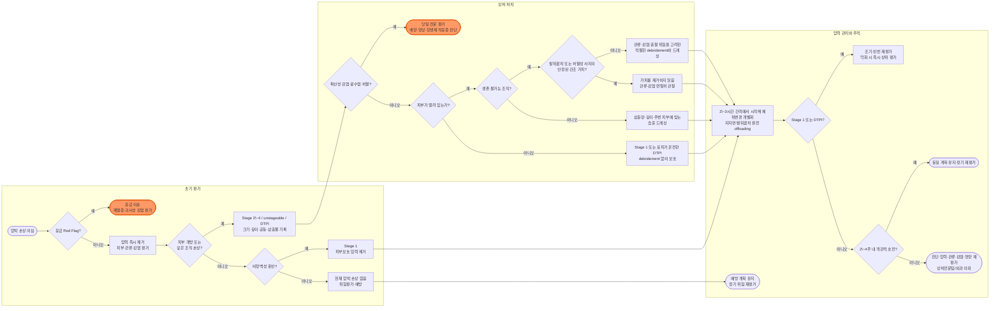

# 압박 궤양/손상 Pressure Ulcer/Injury

## <mark style="color:green;">일반 사항</mark>

* 압박 손상(pressure injury)은 주로 뼈 돌출부 또는 의료기기 아래에서 **지속적인 압력 또는 압력과 전단력(shear)이 함께 작용**하여 발생하는 국소 피부 및/또는 기저조직 손상이다 (NPIAP/EPUAP/PPPIA International Guideline, 4th ed. — Prevention chapters, 2026).
* 피부가 열리지 않은 상태부터 깊은 개방성 궤양까지 다양하게 나타나며 통증이 동반될 수 있다.
* 마찰과 습기는 피부 내성을 떨어뜨리는 위험·악화 요인이지만 압박 손상의 단독 정의 원인은 아니다. 요·변실금 관련 피부염, 피부주름간 피부염, 피부열상 및 의료용 접착제 관련 피부손상과 구분한다.
* 손상 정도는 압력의 강도와 지속시간, 전단력, 조직 관류 및 개인의 조직 내성이 함께 결정한다.

### <mark style="color:orange;">NPIAP pressure injury classification system (2016)</mark>

#### <mark style="color:$primary;">Stage 1: Non-blanchable erythema of intact skin</mark>

* 피부는 온전하지만 국소적으로 눌러도 창백해지지 않는 홍반이 있다.
* 어두운 피부색에서는 뚜렷한 홍반이 보이지 않을 수 있으므로 정상 부위와의 색 변화, 통증, 온도, 단단함 또는 부드러움, 부종을 함께 평가한다.
* 창백해지는 홍반이나 자주색·적갈색 변색은 Stage 1에 포함하지 않는다.
* **자주색·적갈색 변색이 있으면 Stage 1이 아니라 deep tissue pressure injury 가능성을 평가한다.**

#### <mark style="color:$primary;">Stage 2: Partial-thickness skin loss with exposed dermis</mark>

* 진피가 노출된 부분층 피부 손실로, 상처 바닥은 생존 가능하고 분홍색 또는 붉은색이며 습윤하다.
* 터지거나 터지지 않은 장액성 수포로 나타날 수 있다.
* 지방과 심부조직은 보이지 않으며 육아조직, slough 및 eschar가 없다.
* **요·변실금 관련 피부염, 피부주름간 피부염, 의료용 접착제 관련 피부손상, 피부열상, 화상 및 찰과상에는 Stage 2를 적용하지 않는다.**

#### <mark style="color:$primary;">Stage 3: Full-thickness skin loss</mark>

* 전층 피부 손실로 지방조직과 육아조직이 보일 수 있으며 epibole(말린 상처 가장자리)이 나타날 수 있다.
* slough 또는 eschar가 있을 수 있고 undermining 및 tunneling이 동반될 수 있다.
* 근막, 근육, 힘줄, 연골 또는 뼈는 노출되거나 직접 촉지되지 않는다.
* slough 또는 eschar가 조직 손실의 깊이를 가리면 unstageable로 분류한다.

#### <mark style="color:$primary;">Stage 4: Full-thickness skin and tissue loss</mark>

* 전층 피부·조직 손실로 근막, 근육, 힘줄, 연골 또는 뼈가 노출되거나 직접 촉지된다.
* slough 또는 eschar, epibole, undermining 및 tunneling이 동반될 수 있다.
* 골수염 위험이 높지만 뼈가 노출되었다는 사실만으로 골수염이 확진되는 것은 아니다.

#### <mark style="color:$primary;">Unstageable pressure injury: Obscured full-thickness skin and tissue loss</mark>

* 전층 피부·조직 손실이 있으나 slough 또는 eschar가 손상 범위를 가려 실제 깊이를 확인할 수 없다.
* 충분히 제거하면 Stage 3 또는 Stage 4가 드러난다.
* **발뒤꿈치 또는 허혈성 사지의 안정된 가피(건조하고 단단히 붙어 있으며 홍반·파동이 없음)는 연화하거나 제거하지 않는다.** 먼저 혈류와 감염 여부를 평가하며, **홍반·부종·배액·파동이 동반되면 즉시 재평가한다.**

#### <mark style="color:$primary;">Deep tissue pressure injury</mark>

* 지속적으로 눌러도 창백해지지 않는 짙은 적색·적갈색·자주색 변색 또는 표피 분리로 어두운 상처 바닥이나 혈액성 수포가 보인다.
* 통증과 온도 변화가 색 변화에 앞서 나타날 수 있으며, 겉으로 보이는 범위보다 깊은 조직 손상이 클 수 있다.
* 빠르게 악화하거나 반대로 조직 손실 없이 회복할 수 있으므로 압력을 즉시 완전히 제거하고 자주 재평가한다.
* **표피가 온전한 상태에서는 감염 징후(파동, 배농, 확산성 홍반, 전신 감염 징후)가 없는 한 조기에 debridement를 시행하지 않는다.** 완전한 offloading과 경과 관찰을 우선한다. 개방성 궤양으로 진행하면 보이는 조직 손실에 따라 Stage 3, Stage 4 또는 unstageable로 재분류하고, 생존 불가능 조직·관류·감염과 치료 목표를 평가하여 debridement 여부를 결정한다.
* 혈관성·외상성·신경병성 또는 피부질환성 손상에는 이 용어를 사용하지 않는다.

#### <mark style="color:$primary;">의료기기 관련 및 점막 압박 손상</mark>

* 산소 마스크·비강 캐뉼라, 비위관, 부목·보조기, 석고, 각종 튜브와 고정구 아래 또는 주변에 기기 모양과 유사한 손상이 생길 수 있다.
* 피부·연조직 손상은 위 병기를 적용한다. 점막 압박 손상은 해부학적 조직 특성상 병기화하지 않는다.

### <mark style="color:orange;">호발 부위</mark>

* 앙와위: 뒤통수, 견갑골, 팔꿈치, 천골·꼬리뼈, 발뒤꿈치
* 복와위: 이마·턱·광대, 귀, 가슴, 생식기, 무릎, 발등·발가락
* 측와위: 귀, 어깨, 갈비뼈, 대전자, 무릎 내·외측, 복사뼈
* 앉은 자세: 견갑골, 천골·꼬리뼈, 좌골결절, 발뒤꿈치
* 의료기기 접촉부: 코·귀·입술, 목, 사지와 튜브·고정구 아래 피부

## <mark style="color:green;">원인 및 위험 인자</mark>

### <mark style="color:orange;">주요 발생기전</mark>

* 지속적인 압력 또는 압력과 전단력
* 조직 변형, 미세순환 장애와 허혈-재관류 손상
* 의료기기 또는 침상 주변 물체에 의한 국소 기계적 하중

### <mark style="color:orange;">위험 인자</mark>

* 이동성·활동 제한, 스스로 체위를 바꾸지 못함
* 감각 저하, 의식 저하, 인지기능 저하 또는 통증을 표현하지 못함
* 말초동맥질환, 저혈압·쇼크, 당뇨병, 빈혈, 흡연, 탈수 등 관류 저하
* 요·변실금, 발한, 삼출물 등 지속적인 습기와 피부 침윤
* 고령, 피부 취약성, 부종, 발열, 중환자 상태, 장시간 수술
* 영양불량 또는 영양불량 위험, 최근의 비의도적 체중 감소
* 과거 압박 손상, 의료기기 사용, 부적절한 지지면 또는 돌봄 자원 부족


저알부민혈증은 염증, 질병 중증도와 수분 상태의 영향을 받으므로 영양결핍의 단독 진단검사로 사용하지 않는다. 체중 변화, 실제 섭취량, 근육량, 삼킴·저작 능력과 영양평가 도구를 함께 사용한다.


#### <mark style="color:$primary;">특수 상황별 추가 위험 인자</mark> \[NPIAP/EPUAP/PPPIA 4th ed., 2026]

* **수술(수술실) 환자** : 수술 전 부동 시간, 수술 시간, ASA(American Society of Anesthesiologist) 신체상태분류, 다발 동반질환(호흡기질환, 심혈관질환, 당뇨병)
* **중환자실 성인** : 중환자실 재실 기간, 기계환기, 부적절한 산소화, 관류 저하, 쇼크 상태, 승압제 사용 여부·종류·용량·기간, APACHE(II/III/IV), SAPS, SOFA 점수
* **의료기기 관련 압박 손상(DRPI)** : 부종, 승압제 사용, 수술, 인공호흡기 사용, 복와위 환기, 높은 APACHE II/III·SOFA 점수, 기기 사용 기간과 개수가 독립 위험 인자; 연령·세팅과 무관하게 기기가 적용된 순간부터 위험군으로 간주

## <mark style="color:green;">임상 양상</mark>

* 초기에는 눌러도 창백해지지 않는 색 변화, 국소 열감 또는 냉감, 통증, 단단함·물렁함, 부종이 나타난다.
* 진행하면 수포, 부분층 또는 전층 피부 손실, 괴사조직, 공동, undermining 및 tunneling이 나타날 수 있다.
* 감염이 동반되면 통증과 삼출물 증가, 악취, friable granulation tissue, 상처 가장자리 붕괴, 주변 열감·경결·확산성 홍반이 나타날 수 있다.
* 고령자나 면역저하자에서는 발열 없이 섬망, 무기력, 식욕저하 또는 기능저하로 감염이 나타날 수 있다.

### <mark style="color:$danger;">🚩 Red Flags!</mark>

<mark style="color:$danger;">**즉각 조치 또는 이송**</mark>

* 패혈증 또는 쇼크 의심 : 저혈압, 빈호흡, 의식 변화, 차고 얼룩덜룩한 피부, 소변량 감소
* 수시간\~수일 내 빠르게 확산되는 홍반·부종·괴사, 피부 소견에 비해 심한 통증, crepitus(피하 기종; 피부 밑에서 공기 방울이 만져지는 소견) → 괴사성 연조직감염 의심
* 급성 사지 허혈 또는 조절되지 않는 출혈

<mark style="color:$warning;">**당일 또는 조기 의뢰**</mark>

* 확산성 연조직염, 농양, 광범위 괴사 또는 긴급한 sharp debridement 필요
* Stage 4 또는 골 노출·직접 촉지, 깊은 통증·발열·지속적인 염증수치 상승 등 골수염 의심 → 정형외과/감염내과 의뢰
* 힘줄·관절·혈관 등 심부구조 노출, 심한 하지 허혈, 감염된 발뒤꿈치 가피 또는 빠르게 악화하는 unstageable/DTPI → 상처전문팀·외과 의뢰 및 필요시 혈관외과 협진 고려
* 면역저하자에서 새로 발생한 전신상태 악화 또는 국소 감염 소견

<mark style="color:$info;">**외래 추적 / 추가 평가 계획**</mark> <mark style="color:$info;">- 즉각 위험 낮으나 호전 없으면 의뢰</mark>

* 응급·당일 의뢰 소견이 없는 안정된 Stage 3, unstageable 또는 deep tissue pressure injury → 상처전문팀 의뢰 또는 협진 계획
* 반복 재발, 복잡한 공동·undermining·tunneling, 수술적 폐쇄 또는 혈류개선 평가 필요 → 상처전문팀/성형외과 의뢰
* 적절한 offloading과 상처 관리에도 2\~4주간 객관적 호전이 없거나 영양·돌봄 문제가 지속

## <mark style="color:green;">진단</mark>

### <mark style="color:orange;">병력 및 신체검사</mark>

* 발생 시점과 진행속도, 체위·이동성, 의료기기, 실금, 통증과 기존 치료를 확인한다.
* 전신 피부를 관찰하고 특히 뼈 돌출부, 피부주름 및 의료기기 아래를 확인한다.
* 위치와 병기, 가장 긴 길이×직각 너비×깊이, undermining·tunneling의 방향과 깊이를 기록한다.
* 상처 바닥 조직, 삼출물 양·성상, 냄새, 가장자리, 주변 피부, 통증, 온도, 경결·파동을 기록한다.
* 같은 자세와 척도를 사용한 사진 기록을 고려한다. 병기를 낮춰 기록하지 않고 치유 상태는 별도로 기술한다(☞ 아래 PUSH 참조).
* Braden scale(6\~23점) 등 위험도 도구는 구조화된 임상평가를 보조할 뿐 이를 대체하지 않는다. 참고 절단값 : 19\~23점 위험 없음, 15\~18점 경도위험, 13\~14점 중등도위험, 10\~12점 고위험, ≤9점 최고위험. 절단값은 기관과 환자군에 따라 조정하며 개별 위험요인과 임상 판단을 함께 적용한다.

### <mark style="color:orange;">감별 진단</mark>

* 압박 손상이 뼈 돌출부 또는 의료기기 접촉부에 주로 발생한다는 점은 다른 원인의 피부 손상과 감별하는 중요한 단서이다.

<table><thead><tr><th width="150">질환</th><th>감별 단서</th></tr></thead><tbody><tr><td>요·변실금 관련 피부염</td><td>회음부·둔부의 넓고 경계가 불규칙한 표재성 염증, 지속적인 습기; 뼈 돌출부에 국한되지 않음</td></tr><tr><td>피부열상/접착제 관련 손상</td><td>외상 또는 접착제 제거 직후 발생, flap 또는 선형 경계</td></tr><tr><td>동맥성 궤양</td><td>말단부의 punched-out 궤양, 차가운 피부, 맥박 저하, ABI/TBI 이상</td></tr><tr><td>정맥성 궤양</td><td>종아리 gaiter area, 부종·정맥성 피부변화, 불규칙하고 얕은 궤양</td></tr><tr><td>당뇨병성 신경병성 궤양</td><td>족저 압력점, 굳은살, 감각 소실; 압박 손상과 병존 가능</td></tr><tr><td>말기 피부부전</td><td>말기 장기부전·임종기에 급속히 발생; 예방 가능성을 단정하지 말고 치료 목표와 전신상태 평가</td></tr></tbody></table>

### <mark style="color:orange;">검사</mark>

* 감염이 의심되지 않는 상처를 일률적으로 배양하지 않는다. 모든 만성 상처의 집락화는 감염을 의미하지 않는다.
* 임상 감염이 의심되면 상처를 세척하고 괴사조직을 제거한 뒤 심부조직 배양 또는 검증된 정량 면봉검사를 고려한다. **표면 삼출물 면봉배양 결과만으로 항생제를 선택하지 않는다.**
* 전신 감염 시 CBC, CRP/ESR, 신·간기능, lactate 및 혈액배양 등을 임상상황에 따라 시행한다.
* 골수염 의심 시 단순 X선과 MRI를 고려한다. MRI는 민감하지만 비특이적일 수 있으며, 가능한 경우 골 생검의 조직검사와 배양이 확진 및 원인균 규명의 기준이다(WHS 2023 update).
* 하지·발뒤꿈치 병변은 맥박, 피부온도와 모세혈관 재충만을 평가하고 ABI, TBI 또는 도플러 초음파를 고려한다. 혈관 석회화가 있으면 ABI가 거짓으로 높을 수 있다.
* 영양평가는 체중 변화, 섭취량, 삼킴·저작 능력, 질병상태와 영양평가 도구를 중심으로 시행한다.

### <mark style="color:orange;">치유 평가: Pressure Ulcer Scale for Healing(PUSH)</mark>

* 면적, 삼출물과 상처 바닥 조직을 같은 방법으로 반복 평가한다.
* 면적은 가장 긴 길이(cm) × 직각의 가장 긴 너비(cm)로 산출한다.
* 면적 점수 (cm²) : 0=0, ＜0.3=1, 0.3\~0.6=2, 0.7\~1.0=3, 1.1\~2.0=4, 2.1\~3.0=5, 3.1\~4.0=6, 4.1\~8.0=7, 8.1\~12.0=8, 12.1\~24.0=9, ＞24=10
* 삼출물 : 없음=0, 소량=1, 중등도=2, 다량=3
* 조직 형태 : 폐쇄=0, 상피조직=1, 육아조직=2, slough=3, 괴사조직=4
* 총점 감소는 치유, 증가는 악화를 시사하지만 감염·허혈·영양 및 실제 측정치를 함께 판단하며, 병기를 하향 조정하는 용도로 사용하지 않는다(National Pressure Injury Advisory Panel, PUSH Tool 3.0).

***



<p align="center"><strong>압박 손상 평가 및 치료 알고리듬</strong></p>

<p align="center"><em><mark style="color:$info;">Ref. NPIAP/EPUAP/PPPIA International Guideline, 4th ed. — Prevention chapters (2026); WHS Guidelines for the Treatment of Pressure Ulcers, 2023 update</mark></em></p>

***

## <mark style="background-color:$warning;">Management</mark>

### <mark style="color:orange;">치료 방침</mark>

1. 손상 부위의 압력을 즉시 제거하고 압력 재분산 지지면을 사용한다.
2. 체위변경 계획을 개별화하고 발뒤꿈치 등 특정 부위를 완전히 offloading한다.
3. 통증을 평가하고 안정 시 통증과 드레싱 교환·debridement 시 통증을 따로 관리한다.
4. 상처를 세척하고 생존 불가능 조직을 적절히 제거한다.
5. 상처 바닥은 지나치게 마르거나 젖지 않도록 moisture balance를 유지하고 주변 피부는 습기로부터 보호한다.
6. 감염, 허혈, 실금, 혈당, 영양 및 돌봄 환경을 함께 교정한다.
7. 동일한 방법으로 경과를 기록한다. Stage 1과 DTPI는 조기·빈번하게 재평가하고, 개방성 상처는 2\~4주 내 객관적 호전이 없으면 원인과 치료계획을 재평가하여 **상처전문팀 또는 외과 의뢰를 고려한다.**

## <mark style="color:green;">비-약물 치료 및 예방</mark>

### <mark style="color:orange;">체위변경과 압력 최소화</mark>

#### <mark style="color:$primary;">자세와 체위변경</mark>

* 적절한 압력 재분산 전신 지지면을 사용하면서 **2\~3시간 간격에서 시작**하되 피부 반응, 자가 움직임, 전신상태·관류, 통증, 수면과 치료 목표에 따라 개별화한다.
* 4\~6시간 간격으로 일률적으로 연장하지 않는다. 새 색 변화·통증·온도 변화·부종이 생기면 더 자주 체위를 바꾸고 해당 부위를 완전히 offloading한다.
* 30도 측와위 기울임을 고려하고 90도 측와위에서 대전자에 직접 압력이 집중되지 않도록 한다.
* 침상 머리는 의학적으로 허용되는 범위에서 낮게 유지하되 흡인 예방, 호흡곤란 및 경관영양 등 임상적 필요를 우선한다. 앞으로 미끄러짐과 전단력을 줄인다.
* 들어올리기·슬라이딩 시트 등 이동 보조기구를 사용하고 피부를 끌지 않는다.
* 의자·휠체어에서는 발을 지지하고 자세가 무너지지 않도록 하며, 스스로 가능한 환자에게 자주 체중 이동을 교육한다. **스스로 체중 이동이 불가능하면 앉아 있는 시간을 최대한 제한**한다 — 급성기에는 더 제한적으로 시작하고, 재활이 진행되어 조직 내성과 자가 체위변경 능력이 향상되면 점차 연장하며, 장기 휠체어 사용자는 조직 내성·삶의 질을 함께 고려하여 개별화한다. 좌석 전문가 평가를 고려한다.
* 정규 체위변경 일정을 견디지 못할 만큼 불안정한 중환자는 잦고 작은 체위 미세이동(micromovement)으로 정규 체위변경을 보완한다.
* 활동 내약성에 맞춘 조기 이동(early mobilization) 프로그램을 고려한다.
* 의학적 필요(예: ARDS 저산소증 개선)로 복와위가 필요하면 시행하되, 임상적으로 가능해지는 즉시 중단한다.

#### <mark style="color:$primary;">지지면과 발뒤꿈치 offloading</mark>

* 위험도와 기존 손상에 맞는 압력 재분산 고사양 폼 매트리스 또는 교대압·저공기손실 지지면을 선택한다.
* 쿠션과 매트리스는 체위변경을 대체하지 않는다. 도넛형 방석과 단단한 링은 가장자리에 압력을 집중시키므로 사용하지 않는다.
* 발뒤꿈치는 종아리 전체에 체중을 분산시키는 베개·쿠션 또는 heel offloading device로 침상에서 완전히 띄운다. 아킬레스건, 오금혈관 및 비골신경에 압력이 집중되지 않도록 한다.
* 기기와 피부 사이, 침상 위 튜브·리모컨 등 주변 물체를 정기적으로 확인한다.
* 뼈 돌출부나 홍반 부위를 마사지하거나 세게 문지르지 않는다.
* 검사·시술·이송 중에도 압력재분산 지지면을 사용한다.
* 외상으로 척추 하드보드/백보드에 고정된 환자는 입원 후 의학적으로 가능한 즉시(관련 전문의와 협의하여) 보드에서 옮긴다.

### <mark style="color:orange;">피부와 실금 관리</mark>

* 순한 pH 균형 세정제로 피부를 부드럽게 세정하고 문지르지 말고 말린다.
* 요·변실금 발생 후 신속히 세정하고 zinc oxide 또는 polymer barrier film 등 피부보호제를 적용한다.
* 지나치게 건조한 피부에는 무향 보습제를 사용한다.
* 천골·발뒤꿈치 고위험군에서 다층 연성 실리콘 폼 드레싱을 예방의 보조수단으로 고려할 수 있으나, 피부를 정기적으로 확인하고 체위변경·offloading을 계속한다.
* 스스로 체위변경이 불가능한 고위험군에서는 침구·의류의 마찰을 줄이는 저마찰 원단(low friction fabric) 사용을 고려할 수 있다.

### <mark style="color:orange;">영양과 수분</mark>

* 모든 압박 손상 환자에서 영양불량 위험을 선별하고 위험이 있거나 섭취가 부족하면 영양사 평가를 고려한다.
* 영양불량 또는 위험이 있는 성인에서 참고 목표:
  * 에너지 30\~35 ㎉/㎏/d
  * 단백질 1.25\~1.5 g/㎏/d
  * 수분 약 30 ㎖/㎏/d
* 신장질환, 심부전, 간질환, 비만, 중환자 상태에 따라 목표를 개별화한다.
* 비타민 C·아연 등 미량영양소는 결핍이 확인되거나 섭취가 불충분한 경우 보충한다. 충분히 섭취하는 환자에게 고용량을 일률적으로 투여하지 않는다.
* 당뇨병에서는 저혈당을 피하면서 개인별 목표에 따라 혈당을 최적화한다.


**압박 손상 예방만을 목적으로 한 경관영양(튜브 피딩)은 권장하지 않는다** [Strong recommendation, NPIAP/EPUAP/PPPIA 4th ed., 2026]. 단, 통상 진료의 일환으로 이미 경관영양을 받고 있는 환자, 중환자, 경관영양이 필요한 소아·신생아에게는 해당하지 않는다.


### <mark style="color:orange;">예방을 위한 선별과 교육</mark>

* 입원·돌봄 시작 시와 임상상태 변화 시 이동성, 감각, 관류, 피부, 습기, 영양 및 의료기기를 포함한 위험을 재평가한다.
* 전신 피부와 의료기기 아래를 정기적으로 관찰한다. 어두운 피부색에서는 색 변화만이 아니라 온도, 통증, 단단함·물렁함과 부종을 확인한다.
* 의료기기를 올바른 크기로 적용하고 불필요한 기기는 제거한다. 기기 아래 피부를 확인하고 가능한 범위에서 접촉 위치를 바꾼다.
* 예방용 폼 드레싱은 고위험 부위의 보조수단이며 체위변경과 피부관찰을 대체하지 않는다.
* 환자·가족·돌봄 제공자에게 피부 확인, 체위변경, offloading, 실금 관리와 감염 경고 증상을 교육한다.


**국내 재가 돌봄 환자의 복지용구 급여 (2026년 기준)**\
장기요양등급을 받은 재가급여 이용자는 노인장기요양보험 복지용구 급여로 욕창예방매트리스(구입 또는 대여)와 자세변환용구·욕창예방방석(구입 품목)을 연간 160만 원 한도 내에서 이용할 수 있다(본인부담 일반 15%, 감경대상 6\~9%, 기초생활수급자 0%). 전동침대는 대여 품목에 해당한다. 시설급여 이용자는 복지용구 급여 대상이 아니며, 입원 중에는 전동·수동침대 등 일부 대여품목의 급여가 제한될 수 있다.\
✽정확한 대상자 기준·한도·품목과 구입·대여 가능 여부는 국민건강보험공단 노인장기요양보험 고시를 확인하고, 국민건강보험공단 또는 복지용구사업소에 문의할 것(기준 변경 가능)


## <mark style="color:green;">약물 치료</mark>

### <mark style="color:orange;">통증 관리</mark>

* 압력 제거, 비접착성 드레싱, 교체 횟수 최소화와 충분한 사전 설명을 우선한다.
* 경증 통증에는 금기가 없으면 acetaminophen을 우선 고려한다.
  * acetaminophen 500\~1,000 ㎎ q6\~8h 필요시; 일반적으로 최대 3,000 ㎎/d. 고령·저체중·간질환·과음에서는 감량한다.
* NSAID는 신장애, 심부전, 위장관 출혈 위험, 항응고제·항혈소판제 복용이 흔한 환자군에서 신중히 사용한다.
  * ibuprofen 200\~400 ㎎ q6\~8h 필요시
  * naproxen 250\~500 ㎎ bid 필요시
* debridement나 통증이 심한 드레싱 교환 전 국소마취 또는 추가 진통이 필요하면 시술 환경과 환자 상태에 맞게 계획한다.

### <mark style="color:orange;">감염 관리: 항균제 원칙</mark>

#### <mark style="color:$primary;">감염 의심 소견</mark>

* 새로 생기거나 증가하는 통증, 국소 열감·경결·부종 또는 확산성 홍반
* 삼출물 양·성상 변화, 상처 가장자리 붕괴, 악취, 괴사조직, friable granulation tissue
* 적절한 offloading과 상처 관리에도 치유 정체 또는 악화
* 발열, 오한, 저혈압, 섬망, 무기력, 식욕저하 등 전신 소견

#### <mark style="color:$primary;">전신 및 국소 항균제 원칙</mark>

* 상처의 집락화나 배양 양성만으로 항생제를 사용하지 않는다.
* 국소 소독제·항균제를 모든 압박 손상에 일률적으로 적용하지 않는다. Chlorhexidine은 항생제가 아니라 소독제이다. 국소 소독제·항균제의 일상적 사용을 권고하지 않는다(NICE CG179).
* 국소 감염 또는 높은 세균부하가 의심되는 선택된 상처에서는 debridement와 세척을 우선하고, 항균 드레싱을 제한된 기간 사용할 수 있다.
* **전신 항생제는 확산성 연조직염, 패혈증 또는 골수염 등 임상 적응증이 있을 때 사용한다.** 가능하면 적절한 배양 검체를 먼저 채취하되 중증 감염에서 치료를 지연하지 않는다.
* 깊은 감염은 다균성일 수 있으므로 단순 amoxicillin 또는 cephalexin 단독을 모든 감염성 압박 손상의 표준 처방으로 제시하지 않는다. 중증도, 배양, 최근 항생제, 기관 감수성, 신·간기능과 국내 피부연조직감염 지침에 따라 선택한다(☞ [피부감염](../229_/165_-skin-and-soft-tissue-infection.md#undefined-14)).

#### <mark style="color:$primary;">Biofilm</mark>

* 반복적인 치유 정체, 재발성 국소 염증과 치료 반응 부족에서 biofilm 가능성을 고려할 수 있으나 임상 소견만으로 확진할 수 없다.
* 적절하고 반복적인 debridement, 세척, moisture balance와 압력 제거가 관리의 중심이다. 전신 항생제를 biofilm 자체의 치료 목적으로 사용하지 않는다.

## <mark style="color:green;">시술 및 기타 처치</mark>

### <mark style="color:orange;">상처 세척</mark>

* 드레싱 교환 시 생리식염수 또는 음용 가능한 깨끗한 물로 부드럽게 세척한다. 세척 횟수는 삼출물과 드레싱 교환주기에 맞춘다.
* 생존조직을 손상시킬 수 있는 과산화수소, benzalkonium chloride, 고농도 povidone-iodine 또는 chlorhexidine을 만성 상처에 일률적으로 사용하지 않는다.
* 소독·항균 세정제가 필요한 경우 감염 또는 높은 세균부하 가능성, 약제의 세포독성 및 사용기간을 고려하여 제한적으로 사용하고 재평가한다.

### <mark style="color:orange;">괴사조직 제거</mark>

* 괴사조직의 양·상처 깊이, 통증, 감염, 관류, 출혈 위험과 치료 목표에 따라 자가용해, 효소적, 보존적 sharp 또는 외과적 debridement를 선택한다.
* 자가용해법은 수분을 유지하는 드레싱을 이용하여 devitalized tissue를 연화한다. 피부가 온전한 Stage 1에는 적용하지 않으며 감염이 빠르게 진행할 때 단독으로 사용하지 않는다.
* 효소적 debridement는 허가된 제품과 사용법을 확인하고 주변 정상 피부를 보호한다.
* 보존적 sharp 또는 외과적 debridement는 숙련된 의료진이 관류·출혈 위험을 확인한 뒤 시행한다.
* **Wet-to-dry 드레싱은 비선택적으로 육아조직을 손상시키고 통증·출혈·건조를 유발하므로 일상적인 debridement 방법으로 사용하지 않는다.**
* 공동 수조·whirlpool은 교차감염과 피부 침윤 위험 때문에 일상적으로 사용하지 않는다.
* 발뒤꿈치 또는 허혈성 사지의 안정된 건조 가피는 제거하지 않는다. 홍반, 부종, 배액, 파동 또는 전신 감염이 생기면 즉시 재평가한다.

### <mark style="color:orange;">습윤 드레싱</mark>

* 드레싱은 병기만으로 정하지 않고 삼출물, 깊이·공동, 괴사조직, 감염, 주변 피부, 통증과 교체 가능성에 따라 선택한다.
* 깊은 공동은 느슨하게 채워 dead space를 줄이되 과도하게 packing하지 않는다. 제거 가능한 연속형 재료를 사용하고 남은 재료가 없는지 확인한다.

<table><thead><tr><th width="190">드레싱 종류(예)</th><th width="110">흡수력</th><th width="220">주요 용도</th><th>주의사항</th></tr></thead><tbody><tr><td>Polyurethane film <mark style="color:blue;">\[테가덤]</mark></td><td>없음</td><td>온전한 피부 보호, 삼출물이 거의 없는 얕은 상처</td><td>삼출물이 있거나 감염된 상처, 취약한 주변 피부에는 부적절</td></tr><tr><td>Hydrogel</td><td>낮음; 수분 공급</td><td>건조한 상처·괴사조직의 자가용해 보조</td><td>삼출물이 많은 상처에는 부적절; 2차 드레싱 필요 가능</td></tr><tr><td>Hydrocolloid <mark style="color:blue;">\[듀오덤]</mark></td><td>낮음\~중등도</td><td>감염되지 않은 얕은 상처, 소량\~중등도 삼출물</td><td>깊은 공동·노출 구조·많은 삼출물·감염 시 일률 적용하지 않음</td></tr><tr><td>Calcium alginate</td><td>높음</td><td>중등도\~많은 삼출물, 경미한 출혈, 공동</td><td>건조한 상처에는 부적절; 공동 내 잔류 방지</td></tr><tr><td>Hydrofiber</td><td>높음</td><td>중등도\~많은 삼출물, 공동</td><td>주변 피부 침윤과 잔류 여부 확인</td></tr><tr><td>Polyurethane foam <mark style="color:blue;">\[메디폼]</mark></td><td>중등도\~높음</td><td>중등도 이상의 삼출물, 완충과 보호</td><td>건조한 상처에는 부적절; 피부 접착 손상 주의</td></tr><tr><td>항균 드레싱(은·요오드 등)</td><td>제품별 차이</td><td>국소 감염 또는 높은 세균부하가 의심되는 선택된 상처</td><td>기간을 정해 사용하고 <strong>1\~2주 내 필요성 재평가</strong>; 일상적 사용 금지</td></tr></tbody></table>


드레싱 교체주기는 "1주 이내"처럼 일률적으로 정하지 않는다. 삼출량, 누출·오염, 접착 유지, 상처와 주변 피부 상태 및 제품 설명서에 따라 조정한다.


### <mark style="color:orange;">의료기기 관련 압박 손상 예방</mark>

* 기기의 위치나 기능을 방해하지 않는 범위에서, 고위험 의료기기(비침습 환기 마스크, 부목·보조기, 튜브 고정부 등) 아래에 예방적 드레싱 적용을 권장한다 [Strong recommendation, NPIAP/EPUAP/PPPIA 4th ed., 2026].
* 기관내관 고정에는 전용 고정장치(ET tube fixation device) 사용을 고려한다 (단, 복와위 환기 중에는 사용하지 않음).

### <mark style="color:orange;">전문 치료와 수술</mark>

* 전기자극 치료는 적절한 표준치료에도 반응하지 않는 Stage 2\~4에서 전문적으로 고려할 수 있다.
* Negative pressure wound therapy는 괴사조직 제거와 관류·감염 평가 후 선택된 Stage 3\~4 만성 상처에서 고려한다. 치료되지 않은 괴사조직·골수염, 악성 상처, 보호되지 않은 혈관·장기 및 불명확한 누공 등 금기를 확인한다.
* 수술적 폐쇄(피판술: 근육피판·근막피판 등)는 Stage 3\~4 중 보존치료로 치유가 어렵고 압력 제거, 영양, 관류, 감염과 재발 방지 계획이 최적화된 경우 성형외과·외과 평가 후 고려한다.
  * 피판술 등 수술적 재건 직후에는 이식 부위 압력을 최소화하기 위해 air-fluidized 지지면을 일시적으로 고려할 수 있다 (일상적 사용은 권장하지 않으며, 매우 고위험군이나 광범위 화상에서도 고려 가능).
* 완치가 현실적이지 않은 말기 환자에서는 환자의 목표에 따라 통증·냄새·삼출물과 돌봄 부담을 줄이는 완화적 상처 관리를 우선할 수 있다.

***

### <mark style="color:red;">질병코드</mark>

L89.0 욕창궤양 및 압박부위, 제1단계

L89.1 욕창궤양 및 압박부위, 제2단계

L89.2 욕창궤양 및 압박부위, 제3단계

L89.3 욕창궤양 및 압박부위, 제4단계

L89.9 상세불명의 욕창궤양 및 압박부위


국내 L89 세부코드는 NPIAP의 unstageable 및 deep tissue pressure injury와 일대일로 대응하지 않는다. 병기를 임의로 Stage 3 또는 4로 확정하지 말고 임상 소견을 구체적으로 기록하며, 단계가 확정되지 않은 경우 **기관의 청구·코딩 원칙을 확인한다.**


***

## <mark style="color:purple;">처방례</mark>

> **처방례 1.** 감염 없는 Stage 1\~2, 경증 통증
>
> ```
> 아세트아미노펜정 500 ㎎/T 3T #3  1회 1정 1일 3회 필요시
> ※ 진통제보다 압력 제거와 상처 상태에 맞는 드레싱이 치료의 핵심
> ※ 1일 최대 3,000 ㎎ 이내; 고령·저체중·간질환·과음 시 감량
> ```

> **처방례 2.** 감염·허혈·깊은 공동이 없고 중등도 삼출물이 있는 압박 손상, 경증 통증
>
> ```
> 메디폼 폼 드레싱  상처 가장자리까지 삼출물이 차거나 누출·오염·들뜸 시 교체
> 아세트아미노펜정 500 ㎎/T 3T #3  1회 1정 1일 3회 필요시
> ※ 드레싱은 병기가 아니라 삼출량·깊이·주변 피부 상태에 따라 선택
> ※ 삼출물이 많아지면 흡수력이 높은 alginate/hydrofiber로 변경 고려
> ```

> **처방례 3.** 확산성 연조직염·골수염·패혈증 의심
>
> _✽압박 손상 자체나 창상 배양 양성만을 이유로 항생제를 처방하지 않는다. 제한적인 비화농성 주변 연조직염은 피부연조직감염 챕터의 국내 처방례를 따르고, 광범위 감염·패혈증·골수염이 의심되면 외래 경험적 경구 항생제만으로 치료하지 말고 당일 의뢰 또는 입원 평가한다._

### <mark style="color:$success;">핵심 복약 지도</mark>

> **압력 제거와 자세 변경이 최우선입니다**
>
> * 진통제나 소독약보다 압력을 없애는 것이 치료의 핵심입니다.
> * 체위변경은 2\~3시간 간격에서 시작하되 피부 상태와 지지면에 따라 개별화합니다.

> **진통제 복용 시 주의하세요**
>
> * 아세트아미노펜이 포함된 감기약·다른 진통제를 함께 복용하면 1일 최대 용량(3,000 ㎎)을 넘을 수 있습니다.
> * 이부프로펜 등 NSAID는 고령, 신장질환, 항응고제 복용자에서 위장관 출혈·신기능 악화 위험이 있어 신중히 사용합니다.

> **항생제·소독제는 모든 상처에 필요하지 않습니다**
>
> * 상처 배양에서 세균이 검출되었다는 이유만으로 전신 항생제를 사용하지 않습니다. 확산성 감염, 패혈증, 골수염이 의심될 때만 사용합니다.
> * 과산화수소, 고농도 포비돈, chlorhexidine 등은 세포독성으로 치유를 방해할 수 있어 일률적으로 사용하지 않습니다. 필요한 경우 의료진이 약제·농도·기간을 정해 단기간 사용하고 상처 상태를 재평가합니다.

> **드레싱 교체는 상태에 따라 다릅니다**
>
> * "1주일마다"처럼 일률적으로 정하지 말고 삼출물 양, 누출·오염 여부, 제품 설명서에 따라 조정합니다.

> **언제 다시 병원을 방문해야 하나요?**
>
> * 고열, 오한, 의식 변화 등 전신 상태 악화가 있는 경우 — 즉시 내원
> * 상처 주변 홍반이 빠르게 번지거나 피부가 검게 변하는 경우 — 즉시 내원
> * 통증이 갑자기 심해지거나 악취·고름이 늘어나는 경우
> * 2\~4주간 적절한 관리에도 객관적 호전이 없는 경우

***

### <mark style="color:blue;">환자 안내서</mark>


**압박 손상(욕창), 압력을 없애는 것이 치료의 시작입니다**

오랫동안 같은 부위가 눌리거나 몸이 미끄러지면서 피부 아래 조직이 손상되어 생깁니다. 피부가 벗겨지지 않아도 통증, 색 변화, 열감 또는 단단함이 먼저 나타날 수 있습니다.


#### <mark style="color:$primary;">왜 압박 손상이 생기나요?</mark>

* 오래 눌린 부위의 혈액순환이 나빠지면서 피부와 그 아래 조직이 상합니다. 뼈가 튀어나온 부위(엉덩이, 발뒤꿈치, 어깨뼈 등)에 특히 잘 생깁니다.
* 영양 부족, 습기(소변·대변·땀), 움직이지 못하는 상태가 겹치면 더 쉽게 생기고 빨리 나빠질 수 있습니다.

#### <mark style="color:$primary;">집에서 어떻게 관리하나요?</mark>

* **붉거나 검붉게 변한 부위가 다시 눌리지 않도록 자세를 바꾸십시오.** 환자를 침대에서 끌지 말고 가능하면 들어 옮기거나 이동 보조도구를 사용하십시오.
* **자세 변경은 보통 2\~3시간 간격에서 시작하지만** 피부 상태와 매트리스, 환자의 움직임에 따라 달라집니다. 의료진이 정한 계획을 따르십시오.
* **발뒤꿈치가 침대에 닿지 않도록** 종아리 아래를 넓게 받치십시오. 도넛 모양 방석은 사용하지 마십시오.
* 상처에 과산화수소나 강한 소독제를 반복해서 붓지 말고 처방받은 방법으로 세척·드레싱하십시오.
* 소변이나 대변으로 피부가 젖으면 즉시 부드럽게 닦아 말리고 피부보호제를 사용하십시오.
* 단백질과 열량을 충분히 섭취하되 신장·심장질환이 있으면 영양·수분 섭취량을 의료진과 상의하십시오.
* 장기요양등급이 있다면 욕창예방매트리스, 자세변환용구 등을 품목에 따라 복지용구 급여(연간 160만 원 한도, 2026년 기준)로 구입하거나 대여할 수 있습니다. 시설급여 이용 여부와 입원 상태에 따라 이용이 제한될 수 있으므로 국민건강보험공단 또는 복지용구사업소에 문의하십시오.

#### <mark style="color:$primary;">이럴 때는 즉시 병원을 방문하세요</mark>

* 고열, 오한, 숨이 차거나 멍해짐, 혈압 저하 등 전신상태 악화
* 붉은 부위가 빠르게 번지거나 피부가 검게 변함
* 상처에 비해 통증이 매우 심하거나 만질 때 바스락거리는 느낌이 남
* 고름·악취·삼출물 또는 통증이 갑자기 증가함
* 뼈·힘줄이 보이거나 출혈이 멎지 않음
