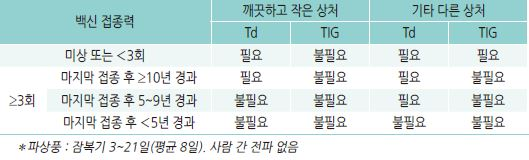
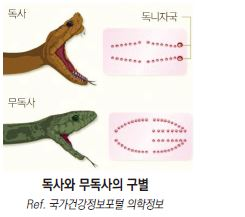
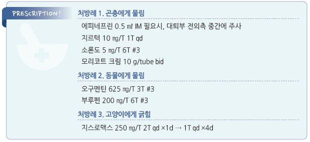

# 물림 Bites


## ￭ 곤충 Insect

* 대부분 합병증 없이 수 시간 내 진정되는 국소 염증 반응이 발생
* 간혹 심한 국소 증상, 구진성 두드러기, 드물게 전신 알레르기 반응 등이 발생

### 벌레 물림

* 곤충의 타액에 의한 작용
* 국소 반응 : 혈관 활성 또는 자극 물질에 의한 반응
* 전신 반응 : IgE 매개; 흔하지 않음

### 벌독

* 벌독의 독성 및 약리 작용, 알레르겐 작용
*   국소 반응 : 혈관 활성 물질(histamine, acetylcholine, kinin), 효소(phospholipase, hyaluronidase), apamin, melittin,

    formic acid 등에 의함
* 전신 반응 : IgE 매개

## 임상 양상

### 국소

* 가려움, 구진, 수포, 홍반, 부종, 통증
*   경과 : 보통 수 분 내 발생하여 24시간 내 소실

    •＞10 ㎝ 크기의 병소는 감염이 되었을 가능성이 높으며 수일 동안 증상이 지속될 수 있음

### 전신

* anaphylaxis, 두드러기, 혈관부종 : 호흡 곤란, 지속적 기침, 흉통, 구역, 저혈압, 어지럼, 실신
* 2차 감염 : 발열, 통증, 림프절염

#### 전신 증상 발생 위험 인자

* 과거 감작 병력
* 소아, 고령, 면역 저하, 불안정한 심장, 폐질환

***

## Management

## 비-약물 치료

* 침 제거(핀셋 등으로 집어 내거나 카드 등으로 scraping)
* 비누 세척
* 냉찜질 : 국소 부종 감소 효과
* 사지 자상 시 발생 부위의 근위부를 압박대로 묶음

## 약물 치료

### Epinephrine

* 병소 내 주입 : 물린 부위에 0.1 ㎎ SC; 알레르겐 흡수 지연 효과; 손발가락에는 금지
*   anaphylaxis : 1:1,000(1 ㎎/㎖) 제제 0.01 ㎖/㎏(최대 성인 0.5 ㎖, 소아 0.3 ㎖) 대퇴부 전외측 중간 부위 IM; 필요한 경우

    5\~15분 간격으로 재투여 (☞ p.991)

### 경구 H1-항히스타민제

* 2세대 : cetirizine 10 ㎎ \[지르텍]
* 1세대 : chlorpheniramine 4 ㎎ qid \[페니라민], hydroxyzine 25\~50 ㎎ qid \[아디팜]
* H2-항히스타민제 : H1-항히스타민제에 추가 시 효과 상승 기대; cimetidine \[에취투비]

> ✽국소 항히스타민제는 벌레 물림에 효과가 없으며 피부를 과민하게 만들 수 있으므로 권고하지 않음

### Steroid

#### 국소제

* 중간 역가 이상 제제로 환부에 3\~5일간 적용 (☞ p.1139)
* desoximetasone \[데메타손 겔], diflucortolone \[디푸코 연고], mometasone \[모리코트 크림]
* 항생제 복합제 : betamethasone/gentamicin \[실크론 지 크림]

#### 경구제

* 대상 : 넓은 범위 또는 심한 부종(특히 눈 주위, 손/발), 가려움
* prednisolone : 30~~60 ㎎/d ×5~~7d \[소론도]

### 기타

* 진통제 : ibuprofen 400~~800 ㎎ tid \[부루펜], acetaminophen 650~~1,300 ㎎ tid \[타이레놀]
* 항생제 : 감염 발생 시 고려 (☞ p.901)
* 대체 요법 : 벌독에 대하여 베이킹 소다 3 숟가락을 물 1 숟가락에 개어 도포(증거 불충분)

## 예방

* 향수, 밝은색 옷 착용을 피함
* 풀/숲 활동 시 장갑, 긴 바지, 장화 착용
* 집 근처의 벌집 제거
* 취침 시 모기장 사용
* 곤충 기피제 사용; 일반적인 곤충 기피제는 벌에 대해서는 효과 없음

##

## ￭ 동물 Animal

* 주로 사지가 손상됨(75%)
* 손상 후 경과 시간, 가해 동물 공수병 감염 가능성, 피해자의 기저 질환(예: 당뇨) 등 파악
* 가능한 한 가해 동물 확보, 손상 상태 기록/촬영, 필요시 경찰 등에 신고

### 가해 요인에 따른 특성

* 고양이 : 감염 확률이 높음(30\~50%); 상처가 깊을 가능성이 있음
* 사람 : 감염 확률 15\~30%
* 개 : 감염 확률이 낮음(5%), 압궤 손상 가능성이 있음(압궤 손상이 크면 골절 위험이 큼)

### 주요 원인균

*   사람 : H. influenzae , E. corrodens , S. aureus , α-hemolytic Streptococcus , β-lactamase-producing aerobes(\~50%)

    •주먹 손상(clenched-fist injury) : Eikenella spp.(25%), 혐기성 균(50%)
*   개 : S. aureus (20~~30%), P. multocida (20~~30%), S. intermedius (25%), C. canimorsus

    •50%에서 혐기성 균 포함
*   고양이 : Pasteurella multocida (＞50%); 다른 균주들은 개에서와 비슷

    •고양이 긁힘 : Bartonella henselae
*   설치류 (rat, mouse, guinea pig, hamster) : Spirillum minus , Streptobacillus moniliformis , include Staphylococcus ,

    Leptospira , Pasteurella , Corynebacterium and Fusobacterium spp

    •10%에서 감염 발생

### 합병증

* 합병증 : 감염, 피하 농양, 골수염, 화농성 관절염, 건염, 세균혈증
* 감염 고위험 부위 : 손, 발, 외음부, 골, 건, clenched-fist injury
* 감염 고위험 상태 : 고양이/사람에게 물림; deep or puncture wound, 압궤 손상; 치료 지연(손상 후 ＞8시간); 면역저하자
* 국소 감염 소견 : 발열, 발적, 부종, 통증, 압통, 화농성 분비물, 림프절염

## 진단

* 검사는 선택적으로 시행

### 실험실 검사

#### 그람염색 검사, 배양 검사

* 대상 : 물린지 8시간 이후 진료 받는 상처(동물 종류 무관), 사람이나 고양이에게 물린 상처(경과 시간 무관)
* 배제 : 환자가 면역저하자가 아니며 개에 물린 상처로서 깊거나 넓지 않고 감염 징후가 없고 8시간 이내 치료 받는 경우
* 검사물 : 상처 분비물, 절제 조직 • 세척 전, 표면 이물질 제거 후 표본 채취
* fungus, Nocardia, mycobacteria 포함하여 검사
* 지연 성장하는 균주를 감안하여 7\~10일간 배양

#### 혈액 배양 검사

* bacteremia가 의심되는 경우 항생제를 투여하기 전에 호기성 및 혐기성 균에 대하여 시행
* 고양이 긁힘 질환에 대해서는 B. henselae 검사

### 영상 검사

* 대상 : 골/관절 손상 의심(골/관절 근처 손상, 주먹 손상), 이물 잔류 의심, 합병증 우려
* X선, CT(심한 머리 물림), MRI(골수염 의심), 초음파(농양)

***

## Management

### 치료 방침

1. 환자 병력 : 손상 과정, 발생 장소, 알레르기 병력, 복용 중인 약물
2. 출혈/혈행 상태, 신경/건/운동 기능, 골/관절 손상 가능성 파악 (특히 가격 관련 손 손상)
3. 손상 기록. 필요시 사진 촬영
4. (필요시) 연조직 염증 범위 표시
5. (필요시) 배양 검사, 영상 검사
6. 충분한 세척(예외: punctured wound), 괴사 조직 제거, 배농
7. (필요시) 봉합
8. (필요시) 손상 부위 거상, 고정(손은 3일)
9. (필요시) 파상풍, 공수병, 간염 예방 조치
10. (필요시) 항생제, 진통제 투여
11. 추적 관찰 : 24\~48시간 후 감염 징후 확인; 감염 의심 시 매일 관찰

※ 얼굴 상처 : 충분한 세척 및 빠른 조치(6시간 이내), 1차 봉합, 선제적 항생제 투여

## 상처 관리

### 세척

* 이물질 제거
* 높은 압력으로 세척. 예: 18-G needle or catheter로 상처 위 2\~3 ㎝에서 분사

•blunt probing은 감염 위험을 높일 수 있으므로 피함

•천공 상처는 카테터나 끝이 뭉툭한 기구로 부드럽고 철저히 세척; 고압을 사용하지 않음

* 세척액 : 식염수, 비눗물, povidone 1% \[베타딘]\(7\~8배 희석), benzalkonium 1% \[염화벤잘코늄 액]\(10배 희석)

> ```
> ✽항생제 함유 용액 세척은 식염수 세척에 비하여 이득이 없음
> ```

* 필요시 마취하에 시행
*   공수병 의심 상처는 국소 마취제를 상처 가장자리에 침윤시키고 1% benzalkonium 액이나 비누 면봉이나 거즈로 강하게

    닦아 내고 생리 식염수로 헹굼

### 변연 절제

* 표면의 괴사 조직 제거; 선택적 시행
*   수술적 변연 절제 대상 : 과도한 손상, metacarpophalangeal joint 이환 (✽보통 주먹으로 가격하다가 상대 치아에 손상 받음),

    큰 동물에 의한 두부 손상
* 천공 상처는 변연 절제하지 않음

### 상처 봉합

* 논란
* 1차 봉합 : 물린지 8(\~12)시간 이내에 치료하는 천공되지 않은 깨끗한 상처에서 고려
*   봉합하지 않는 상처 : 압궤/천공 손상, 얼굴/손/발 상처, 감염 소견, 사람/고양이에게 물림, 면역저하자(예: 당뇨병, venous stasis),

    치료 지연(손상 12\~24시간 이후 치료 시작); 다만 얼굴 상처는 미용 문제를 감안하여 신중한 상처 관리 및 예방적 항균제를

    투여하면서 1차 봉합 고려
* 지연 봉합 : 감염된 상처에 대하여 3\~5일 후 봉합 고려
* 넓은 간격 봉합 or 피부 봉합 반창고(예: Steri-Strip) : 크거나 벌어진 상처에 대하여 고려

### 고정

* 사지 손상 시 부목 등으로 고정, 부종 시 거상

## 진통제

* ibuprofen : 400\~800 ㎎ tid \[부루펜]
* naproxen : 275 ㎎ tid \[아나프록스]

## 항생제

* 대상 : 얼굴, 감염 고위험 부위 또는 상태, 감염 소견
*   투여 기간 :

    • 예방적 투여- 3\~5일, 필요시 연장

    • 농양 또는 연조직염- 5\~10일

    • bacteremia- 10\~14일

    • 관절/골 침범- 3주 이상

### 경험적 항생제

#### 1차 선택

* 호기균 및 혐기균 모두에 작용하는 항생제 선택 (☞ p.901)
* 경구제 : amoxicillin/clav. \[오구멘틴]
* 비경구제 : ticarcillin-clav, ampicillin-sulbactam \[유나신 주]

> ✽1세대 세파는 P. multocida 및 E. corrodens 에 효과가 적으므로 제외

#### 대체제 (Pc 알레르기 환자)

* clindamycin(300 ㎎ tid) \[훌그램] + TMP-SMX(160/800 ㎎ bid) \[셉트린]
* tetracycline(doxycycline) : 지속되는 고양이 물림 상처
* azithromycin : 임신 시; 500 ㎎ qd ×1d → 250 ㎎ qd ×4d \[지스로맥스]

### 사람에게 물림

```

```

### 동물에게 물림

```

```

### 고양이 긁힘 질환 (Cat-scratch disease = Cat-scratch fever)

* 고양이가 긁거나 물어 뜯거나 핥은 후 발생한 감염 질환
* 오염 경로 : 긁힘, 물림, 피부 또는 점막(예: 눈, 구강) 손상 부위에 고양이 침 접촉, 고양이에게 기생하는 벼룩에 물림
* 증상 : 손상 후 3\~10일 후 감염 부위 red bump, 통증, 물집, 림프절병; 미열(환자 대부분), malaise/두통(＜⅓), 식욕 부진
*   경과 : 국소 증상은 대개 자연 치유(2\~6개월); 보통 건강한 사람에게는 문제가 되지 않지만 소아나 면역저하자(예: 암,

    당뇨병)에서 문제가 될 수 있음; ＜15%에서 장기(예: 눈, 간, 비장)의 granulomatous lesion, CNS lesion, 골수염
*   진단 : 최근 고양이 접촉 후 발열 및 림프절염 발생; ESR↑, CRP↑, IFA Bartonella serology(＞1:256), 혈액/조직 PCR/배양,

    림프절 생검, 조직 Warthin-Starry silver stain,
* 검사 결과가 나오기 전 경험적 치료(항생제, 진통제) 시작
* azithromycin : 500 ㎎ qd ×1d → 250 ㎎ qd ×4d \[지스로맥스]
*   대체제 : 7\~10일간 투여

    • clarithromycin : 500 ㎎ bid \[클래리시드]

    • rifampin : 300 ㎎ bid \[리팜핀]

    • TMP/SMX : 160/800 ㎎ bid \[셉트린]

    • ciprofloxacin : 500 ㎎ bid \[씨프로바이]

### Rat bite fever

* 증상 : 발열, 발진, 관절염
* 심각한 합병증 : endocarditis (주로 rat bite에 의함)
* 치료 : Pc, doxycycline

## 백신

### 파상풍 백신

*   대상 : 파상풍 접종력이 없는 경우 또는 최종 접종 후 ≥5년인 경우 (☞ p.1113)

    

### 공수병 백신

* 가해 동물의 백신 접종 여부 및 지역 유행 여부에 따라 결정
* 상해 부위가 머리 또는 목인 경우 즉시 조치를 고려
*   개, 고양이

    •관찰이 가능한 경우 : 10일간 관찰; 10일 내 공수병 징후를 보이면 노출된 사람에 대하여 조치

    •관찰이 불가능한 경우 : 주변 환경 및 지역 보건 당국의 권고에 따라 결정 또는 의뢰
* 야생 동물(예: 박쥐, 여우, 너구리)에 의한 물림 상처 또는 공수병 유행 지역에서는 공수병에 대한 조치가 필요할 수 있음

#### 방법

```

```

### B형간염 백신

```
(☞ p.1109)
```

* 사람에게 물렸을 때 고려
* 항체가 없는 사람이 HBsAg 양성자에게 물린 경우 HBIG 및 B형간염 백신 모두 접종

## 예방

```
[미국가정의학회 권고안]
```

* 애완동물을 주의 깊게 선택한다(공격적 성향, 야생성이 있는 종은 선택하지 않는다).
* 어린이를 혼자 동물과 함께 있게 하지 않는다. 어린이가 동물과 놀 때 어른이 항상 같이 있는다.
* 개를 만지기 전에 사람의 냄새를 맡게 한다.
* 동물을 귀찮게 하지 않는다. 동물이 놀랄 수 있는 빠르고 갑작스런 움직임을 하지 않는다.
* 식사 중인 동물, 잠을 자는 동물, 새끼를 데리고 있는 어미 동물은 만지지 않는다.
* 동물에게 몸을 기대지 않는다. 동물과 공격적인 놀이(예: 레슬링)를 하지 않는다.
* 동물에게 키스하지 않는다.
* 필요한 경우 중성화 수술을 시행한다.
* 다투고 있는 동물들을 보호 장구 없이 떼어놓으려고 하지 않는다.
* 동물을 데리고 집밖으로 나갈 때는 끈으로 묶는다. 필요시 입마개를 사용한다.
* 낯선 동물의 근처에 가지 않는다. 묶여 있거나 갇혀 있는 낯선 동물에게 접근하지 않는다.
* 낯설고 병든 동물을 피한다.
* 야생 고양이가 침입하였을 때는 두꺼운 옷과 장갑을 끼고 다루거나 구조단체에 연락한다.
* 동물이 공격적 모습 또는 이전과 다른 행동을 하면 전문가와 의논한다.
*   동물의 공격 신호를 알아 챈다. 예: 꼬리를 세움, 드러난 이빨, 삐죽 솓은 털, 으르렁거림, 다리 사이에 꼬리를 말아 넣음,

    웅크리고 경직되어 있음
* 정기적으로 아이들에게 동물에 대한 주의를 환기시킨다.

#### 개가 가까이 올 때의 조치

* 소리를 지르거나 도망가지 말고 조용히 나무처럼 서 있는다.
* 개와 눈이 마주치지 않도록 시선을 피한다.
* 넘어졌거나 엎어졌다면 통나무처럼 움직이지 않고 엎드려 있는다.

##

## ￭ 뱀 Snake

* 독사 종류 : 살모사(까치독사), 쇠살모사(불독사), 까치살모사(칠점사), 유혈목이(너불대, 꽃뱀)
* 호발 기간 : 4\~10월
*   물림 후 8\~12시간 내 유의미한 증상이 발생하지 않으면 독이 주입되지 않았음을 의미

    •소아 및 하지 물림의 경우에는 8시간 이후에도 증상이 나타날 수 있음
* 뱀의 종류에 따라 다소 다른 전신 증상을 보임

## 임상 양상

### 국소 증상

* 통증, 부종, 반상 출혈 : 물린 후 수 분 내 발생 → 수 시간\~수일간 진행
* 근육 괴사

### 전신 증상

* 응고 장애(출혈)
* 구역, 구토, 설사, 차갑고 축축한 피부, 저혈압, 빈맥, 호흡 곤란, 실신
* 뇌신경 마비 : 안검 하수, 연하 곤란, 미각 이상(예: 쇠 맛), 구음 장애, 호흡 부전, 마비

## 진단

### 뱀의 모양 및 물린 부위 모양

*   독사 : 삼각형 머리, 타원형 눈, 눈/코 중간 지점의 소와(pit)

    •물린 부위 : 독니 자국(fang mark)
*   무독사 : 둥근 모양 머리

    •물린 부위 : U자형 흔적 독사와 무독사의 구별

### 검사

* 선택적 시행
* CBC, PT, fibrinogen, fibrin degradation product

***

## Management

* 응급 이송
* 물린 부위를 최대한 움직이지 않게 함; 움직임이 뱀독의 흡수를 증가시킬 수 있음
* 사지가 물린 경우 물린 부위를 심장보다 낮은 위치에 있게 함
* 상처 부위의 부종 발생에 대비하여 신체를 조이게 할 수 있는 물건 제거. 예) 반지, 팔찌, 신체 장신구, 부착물, 꽉 끼는 옷
* 식사 중지 : 구토, 복통 또는 의식 저하가 발생할 수 있으므로 입을 축이는 정도 이상으로 먹거나 마시지 않음
* 냉찜질 : 동상의 위험이 있으므로 권장 안 함
*   흡인 : 절개 또는 입으로의 흡입은 금지하며 가능하다면 진공 흡입 장치를 이용하여 독을 흡인함;

    절개 또는 입으로의 흡입은 독의 제거 효과는 거의 없고 감염 및 2차 중독 위험이 있음
*   압박대 적용 : 물린 부위의 5 ㎝ 상부를 압박대와 피부 사이에 손가락이 들어갈 정도로 느슨하게 묶음

    •압박 압력 : 상지- 40~~70 ㎜Hg, 하지- 55~~70 ㎜Hg
* 30분마다 부종의 범위를 환부에 표시하여 부종 진행 여부를 확인
* 예방적 항생제 : 필요 없음
* 파상풍 백신 : 접종 여부를 확인하고 필요시 접종
*   항뱀독소 : 물린 부위를 피하여 IM/IV/SC; anaphylaxis가 발생할 수 있음; 물림 후 1\~2시간이 경과하여도 국소 통증,

    발적, 종창, 출혈 등이 나타나지 않는 경우에는 투여를 보류 \[코박스 건조 살무사 항독소 주]

## 예방

```
[미국가정의학회 권고안]
```

* 우거진 수풀, 물이 있는 곳 등 뱀이 많은 지역에 있을 때에는 항상 주의한다.
* 잡초가 무성한 곳에서 놀지 않는다.
* 풀밭, 폐허가 된 건물, 나무나 바위가 쌓인 곳 등에서 머무는 것은 피하고 풀, 나무를 베어낸 곳이나 도로에서 지낸다.
* 뱀이 만연하는 곳에서는 야영을 하지 않는다. 불가피한 경우에는 간이침대에서 잔다.
* 구멍이나 갈라진 곳, 야적되어 있는 물체 밑에 손을 넣지 않는다.
* 장작, 덤불, 목재 등을 옮길 때는 집게를 사용한다.
* 나뭇더미나 울타리 등을 뛰어넘지 않는다.
* 나무나 바위 더미 등을 조사할 때는 그것들을 조사자 쪽으로 모으면서 살핀다.
* 뱀이 한 마리라도 관찰되었다면 그 주위에 여러 마리가 있을 수 있다는 것을 명심한다.
* 만약 뱀을 보았으면 그냥 지나가도록 둔다. 뱀으로부터 천천히 뒤로 자리를 피한다.
* 죽어 있는 것처럼 보이는 뱀도 절대로 맨손으로 만지지 않는다.
* 키가 큰 풀과 잡초가 난 지역을 지나갈 때에는 긴 막대기나 장대로 바로 앞의 땅을 쿡쿡 찔러 뱀들을 쫓는다.
* 야외에서 활동할 때는 헐렁한 긴 바지와 긴 장화 또는 두꺼운 신발(예: 등산화)을 신는다.
* 야간에 움직일 때에는 손전등을 비춘다.
* 규칙적으로 울타리를 손질하고 풀을 깎으며 뜰과 빈터에 있는 덤불을 제거한다.

> **질병코드** W50 타인에 의해 맞음, 부딪힘, 차임, 비틀림, 물림 또는 찰과

W54 개에 물림 또는 부딪힘

W57 무독액성 곤충 및 기타 무독액성 절지동물에 물림 또는 쏘임

T63.8 기타 독액성 동물과의 접촉의 독성효과


