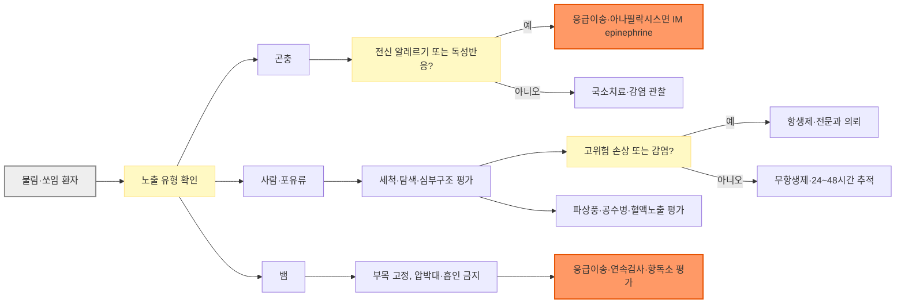

# 물림 Bites

## <mark style="color:green;">일반 사항</mark>

* 이 챕터는 곤충 물림·쏘임, 사람·동물 물림 및 뱀 교상을 다룬다.
* 진료 시 손상 시각과 기전, 가해 동물, 발생 지역, 상처 깊이와 오염, 신경·혈관·힘줄·관절 손상, 기저질환, 파상풍 접종력 및 공수병 노출 가능성을 함께 평가한다.
* 진드기·진드기매개감염 및 거미·해양동물 독성 손상은 해당 챕터의 원칙을 따른다.

### <mark style="color:$danger;">🚩 Red Flags!</mark>

<mark style="color:$danger;">**즉각 조치 또는 이송**</mark>

* 아나필락시스: 기도부종, 천명·지속적 기침, 호흡곤란, 저혈압·실신, 급속히 진행하는 전신반응
* 조절되지 않는 출혈, 쇼크, 패혈증 또는 빠르게 진행하는 감염
* 신경혈관 손상, 힘줄 파열, 관절·골 관통, 개방골절, 구획증후군 의심
* 안구·두개·기도를 침범한 물림 또는 심한 얼굴·목 손상
* 주먹가격 손상(clenched-fist injury)으로 중수지관절·힘줄·관절낭 침범 의심
* 공수병 고위험 노출로 즉각적인 노출 후 예방(PEP) 평가가 필요한 경우
* <mark style="color:red;">모든 독사 가능 교상 또는 뱀의 종류를 확실히 배제할 수 없는 교상</mark>

<mark style="color:$warning;">**당일 의뢰 또는 긴급 평가**</mark>

* 손·발·얼굴·외음부, 골·관절·힘줄 인접 부위의 물림
* 고양이·사람 물림, 깊은 천공·열상, 압궤·괴사조직, 이물 또는 치아 조각 의심
* 일차 봉합이 필요한 상처 또는 손상 후 8시간 이상 경과한 고위험 상처
* 면역저하, 무비증·비장기능저하, 알코올사용장애·간경변, 조절되지 않는 당뇨병
* 눈·입 주위의 매우 큰 국소반응 또는 이차 세균감염이 의심되는 곤충 물림

<mark style="color:$info;">**외래 추적 / 추가 평가 계획**</mark> <mark style="color:$info;">- 즉각 위험 낮으나 호전 없으면 의뢰</mark>

* 저위험 물림 상처도 24\~48시간 내 감염·신경혈관 기능을 재평가
* 항생제 시작 후 24\~48시간 내 호전이 없거나 악화하면 재평가·배양 및 의뢰
* 뱀 교상 퇴원 후 출혈, 멍, 혈뇨, 부종·통증 재진행, 발열이 발생하면 즉시 재내원

***

## <mark style="color:green;">곤충 물림·쏘임 Insect Bites and Stings</mark>

### <mark style="color:orange;">임상 양상</mark>

* 일반적인 국소반응 : 가려움, 구진, 홍반, 부종, 통증 또는 작은 수포가 수분 내 발생하며 대개 수시간\~수일 내 호전
* 큰 국소반응(large local reaction) : 쏘이거나 물린 부위 주위의 부종이 10 ㎝를 초과하며 수시간에 걸쳐 확대되어 수일간 지속될 수 있는 알레르기성 국소반응
  * <mark style="color:red;">병변 크기만으로 세균감염으로 판단하지 않는다.</mark>
  * 점차 심해지는 열감·통증, 화농, 발열, 림프관염 등이 있으면 이차 세균감염을 평가
* 전신 알레르기반응 : 전신 두드러기·혈관부종, 복통·구토, 호흡곤란, 저혈압·실신 등
* 다수의 벌에 집단으로 쏘인 경우에는 알레르기 병력이 없어도 독액 자체에 의한 용혈, 횡문근융해, 급성 신손상 및 응고장애 등 전신 독성반응(toxic reaction)이 발생할 수 있다. 횟수만으로 안전 여부를 판단하지 않으며, 소아·노인·기저질환자는 비교적 적은 횟수에서도 전신 독성이 발생할 수 있으므로 응급 평가를 고려한다.

#### <mark style="color:$primary;">벌침 제거</mark>

* 벌침이 보이면 가능한 한 빨리 제거한다. 카드로 긁어내거나 핀셋으로 뽑는 방법보다 제거 속도가 중요하다.
* 비누와 물로 씻고 천으로 감싼 냉찜질을 10\~20분씩 시행한다.
* <mark style="color:red;">압박대, 절개·흡인 및 물린 병소 내 epinephrine 주입은 시행하지 않는다.</mark>

### <mark style="color:orange;">약물 치료</mark>

* 가려움 : cetirizine 10 ㎎ qd <mark style="color:blue;">\[지르텍]</mark> 등 비진정성 2세대 H1-항히스타민제
* 국소 염증 : 중간 역가 외용 corticosteroid를 얇게 1일 1\~2회, 보통 3\~5일
  * mometasone furoate 0.1% <mark style="color:blue;">\[모리코트 크림]</mark>
  * desoximetasone <mark style="color:blue;">\[데메타손 겔]</mark>
* 매우 큰 국소반응으로 기능장애가 있거나 눈·손·발의 심한 부종이 있는 경우에 한해 prednisolone 30\~40 ㎎ qd를 3\~5일 고려
* 통증 : acetaminophen 또는 금기가 없으면 ibuprofen을 최소 유효용량으로 단기간 사용
* 국소 항히스타민제와 steroid/항생제 복합제는 비감염성 반응에 일률적으로 사용하지 않는다.
* 항생제는 임상적으로 이차 세균감염이 확인되거나 강하게 의심될 때만 사용한다.

#### <mark style="color:$primary;">아나필락시스</mark>

* Epinephrine 1 ㎎/㎖(1:1,000) 제제를 체중별로 대퇴부 전외측 IM 투여하고, 반응이 없으면 지침에 따라 반복한다.
* 항히스타민제와 corticosteroid는 기도·호흡·순환 이상을 치료하지 못하며 epinephrine을 대체하지 않는다.
* 세부 용량·재투여·관찰은 (☞ [아나필락시스](188_-anaphylaxis.md)) 챕터를 따른다.

### <mark style="color:orange;">벌독 알레르기 사후관리</mark>

* 벌독에 의한 아나필락시스 또는 피부 이외 전신반응 병력이 있으면 epinephrine 자가주사기 처방·사용교육 및 알레르기내과 의뢰를 고려한다.
* 벌독 특이 IgE/피부검사와 venom immunotherapy 적응증을 평가한다.
* 큰 국소반응만 있었던 환자에게는 자가주사기·면역치료를 일률적으로 권하지 않는다.

### <mark style="color:orange;">예방</mark>

* 향수·향이 강한 제품과 밝은 꽃무늬 옷을 피하고, 풀·숲 활동 시 장갑·긴 바지·장화를 착용한다.
* 벌집은 직접 제거하지 말고 전문가에게 의뢰한다.
* 모기장을 사용한다. 일반적인 곤충기피제는 벌·말벌을 막지 못하며, 모기·진드기 등 흡혈성 절지동물 기피에 주로 사용한다.
  * DEET : 농도가 높을수록 지속시간이 길어질 뿐 효과 자체가 비례해 강해지지는 않는다. 국내 허가사항에 따라 DEET 10% 이하 제품은 생후 6개월 이상, 10% 초과\~30% 제품은 만 12세 이상에서 사용하며, 생후 6개월 미만에는 사용하지 않는다. 제품별 연령 제한과 사용 횟수를 확인한다.
  * Permethrin : 기피제가 아닌 접촉살충제로, 피부가 아닌 의류·모기장·텐트 등에 처리하여 사용한다. 피부에 직접 도포하지 않는다.
  * DEET 제품과 자외선차단제를 함께 사용할 때는 자외선차단제를 먼저 바르고 DEET를 나중에 도포한다.

***

## <mark style="color:green;">사람·동물 물림 Human and Animal Bites</mark>

### <mark style="color:orange;">주요 특성</mark>

* 고양이 물림 : 좁고 깊은 천공 상처가 흔하며 감염 위험이 높다. _Pasteurella multocida_가 빠르게 연조직염을 일으킬 수 있다.
* 사람 물림 : _Eikenella corrodens_, streptococci, _S. aureus_ 및 구강 혐기성균의 혼합감염이 흔하다.
* 개 물림 : 압궤·열상 및 골절 위험이 있으며 _Pasteurella_, streptococci, staphylococci, 혐기성균을 고려한다.
* _Capnocytophaga canimorsus_ : 특히 무비증·비장기능저하, 알코올사용장애·간경변 및 면역저하 환자에서 전격성 패혈증 위험이 있다.
* 설치류 : _Streptobacillus moniliformis_ 또는 _Spirillum minus_에 의한 rat-bite fever를 고려한다.

### <mark style="color:orange;">초기 평가</mark>

1. 손상 시각·기전·장소, 가해 동물의 종류·상태·예방접종 여부와 관찰 가능성, 해외 노출 여부를 확인한다.
2. 출혈, 말초혈행, 감각·운동 기능, 힘줄·관절·골 손상 및 이물을 평가한다.
3. 손가락 관절 위 상처는 크기가 작아도 주먹가격 손상 가능성을 확인한다. 손을 편 자세와 주먹 쥔 자세에서 상처와 힘줄·관절의 관계를 평가한다.
4. 면역저하, 무비증, 간질환·알코올사용장애, 당뇨병 및 약물 알레르기를 확인한다.
5. 파상풍 접종력, 공수병 위험 및 사람 물림의 혈액매개감염 노출을 평가한다.
6. 상처 위치·크기·깊이와 신경혈관 상태를 기록하고 필요하면 동의하에 촬영한다.
7. 환자나 보호자에게 동물을 잡거나 죽여 가져오도록 지시하지 않는다. 필요하면 보건당국·동물방역기관·경찰에 신고한다.

### <mark style="color:orange;">검사</mark>

#### <mark style="color:$primary;">미생물 검사</mark>

* 감염 소견이 없는 상처는 경과 시간이나 동물 종류만을 이유로 배양하지 않는다.
* 화농성 또는 비화농성 분비물, 농양·괴사, 중증 감염, 면역저하자의 비전형적 감염 또는 경험적 치료 실패 시 배양한다.
* 가능하면 세척과 항생제 투여 전에 농·흡인물 또는 깊은 조직을 채취한다. 표면 면봉은 해석에 주의한다.
* 진균·Nocardia·비결핵항산균 검사는 만성·비전형·치료 불응 사례에서 임상 소견에 따라 선택한다.
* 패혈증·균혈증이 의심되면 항생제 투여 전 혈액배양을 시행하되 치료를 지연하지 않는다.

#### <mark style="color:$primary;">영상검사</mark>

* X선 : 골·관절 인접 손상, 주먹가격 손상, 골절 또는 치아·이물 의심
* 초음파 : 농양·액체저류
* CT : 심한 두부·안면 손상 또는 깊은 구조 침범
* MRI : 골수염·건초염·심부감염 의심

### <mark style="color:orange;">상처 관리</mark>

#### <mark style="color:$primary;">세척·탐색·변연절제</mark>

* 모든 물림 상처를 비누와 물로 씻고 충분한 양의 생리식염수 또는 깨끗한 물로 세척한다.
* 천공 상처도 세척 대상이다. 다만 좁고 깊은 천공에 카테터를 삽입해 강한 압력으로 주입하거나 맹목적으로 probing하지 않는다.
* 국소마취 후 깊이와 방향, 힘줄·관절·신경혈관 손상 및 이물을 확인한다.
* 오염물·치아 조각과 명백한 괴사조직은 제거하되, 생존 가능한 안면·손 조직은 과도하게 절제하지 않는다.
* 농양은 배농하고, 관절·건초·골 침범이나 광범위 압궤는 수술적 세척·변연절제를 의뢰한다.

#### <mark style="color:$primary;">공수병 가능 상처</mark>

* 즉시 비누와 흐르는 물로 최소 15분간 충분히 세척하고, 가능하면 포비돈요오드 등 공수병 바이러스에 효과가 있는 소독제를 사용한다.
* 불필요한 봉합은 피한다. 봉합이 꼭 필요하면 공수병 면역글로불린의 상처 내·주위 침윤을 먼저 고려하고 느슨하게 최소한으로 봉합한다.
* 공수병 면역글로불린은 가능한 한 상처 전체에 침윤한다. 잔여 용량의 투여 방법은 국내 최신 지침과 제품 허가사항을 따른다. CDC/ACIP는 잔여 용량을 백신 접종 부위와 다른 근육에 IM 투여하도록 하지만, WHO 2018은 계산된 최대 용량 중 상처 침윤에 필요한 양만 투여하는 용량절감 전략을 제시한다. 어느 방법에서도 첫 백신과 같은 부위·주사기로 투여하지 않는다.

#### <mark style="color:$primary;">봉합</mark>

* 감염된 상처, 깊은 천공·압궤, 손·발·관절 부위 및 대부분의 사람·고양이 물림은 개방하여 이차유합을 고려한다.
* 얼굴·두피의 신선하고 감염되지 않은 상처는 충분한 세척·탐색·변연절제 후 예방적 항생제와 함께 1차 봉합을 고려할 수 있다.
* 감염 징후가 없고 손상 후 8\~12시간 이내(안면부는 24시간 이내)에 내원한 저위험 개 물림은 충분한 세척·변연절제 후 1차 봉합을 고려할 수 있다. 이 시간 범위는 절대적 컷오프가 아닌 참고 기준이며, 오염도, 세척·변연절제의 적절성, 조직 생존도와 추적 가능성을 종합해 결정한다. 고양이·사람 물림, 손·발 등 고위험 부위에는 이 예외를 적용하지 않는다.
* 힘줄·신경·혈관·관절·골 침범 또는 주먹가격 손상은 전문과에 의뢰한다.
* 감염 상처는 감염이 조절된 뒤 임상 상태에 따라 지연봉합 여부를 결정한다. 정해진 날짜에 자동으로 봉합하지 않는다.

#### <mark style="color:$primary;">고정·추적</mark>

* 부종이 있는 사지는 거상하고 필요하면 기능적 자세로 단기간 고정한다.
* 저위험 상처도 24\~48시간 내 재평가한다. 감염 의심 또는 손 상처는 더 짧은 간격으로 추적한다.

### <mark style="color:orange;">항생제</mark>

#### <mark style="color:$primary;">예방적 항생제 적응증</mark>

* 사람 물림으로 피부가 뚫리고 출혈이 발생한 경우
* 고양이 물림으로 피부가 뚫린 경우, 특히 깊은 천공
* 손·발·얼굴·외음부, 골·관절·힘줄 인접 부위
* 깊은 천공·열상, 압궤·부종·괴사조직, 개방골절, 일차 봉합 예정
* 손상 후 8시간 이상 지연된 고위험 상처
* 면역저하, 무비증·비장기능저하, 간경변·알코올사용장애, 조절되지 않는 당뇨병
* 인공심장판막 등 감염성 심내막염 고위험 상태 또는 물림 부위에 인접한 인공관절 등 중증 감염 위험을 높이는 상태
* 얕고 오염이 적은 저위험 개 물림에는 일률적으로 투여하지 않는다.

#### <mark style="color:$primary;">경험적 치료</mark>

<table><thead><tr><th width="150">상황</th><th width="270">성인 예시</th><th>비고</th></tr></thead><tbody><tr><td>1차 경구</td><td>amoxicillin/clavulanate 500/125 ㎎ tid 또는 875/125 ㎎ bid</td><td><em>Pasteurella</em>, <em>Eikenella</em>, streptococci, MSSA 및 혐기성균 포괄; 국내 오구멘틴정 625 ㎎(500/125 ㎎)이 500/125 ㎎ tid에 해당</td></tr><tr><td>중증·입원 1차 IV</td><td>ampicillin/sulbactam 3 g IV q6h</td><td>패혈증, 심부구조 침범 또는 수술적 세척 필요 시</td></tr><tr><td>중증 즉시형 penicillin 알레르기</td><td>doxycycline 100 ㎎ bid + metronidazole 500 ㎎ tid</td><td>임신·수유, 연령, 상호작용 및 지역 감수성 고려. 전문가 상의 권장</td></tr><tr><td>MRSA 위험·확인</td><td>기본 bite-flora 치료에 TMP-SMX 또는 doxycycline 병용 추가; 중증·입원 시 vancomycin/linezolid 고려</td><td>TMP-SMX·doxycycline 등은 혐기성균·연쇄구균 포괄이 불완전하므로 단독 사용하지 않음</td></tr></tbody></table>

* 예방 : 보통 3일, 임상 상황에 따라 3\~5일
* 감염 치료 : 기본 5일, 조직손상·부종이 심하거나 반응이 느리면 7일 이상 연장
* 농양은 배농이 우선이다. 건초염·화농성 관절염·골수염·균혈증은 배양과 전문과 판단에 따라 장기 치료한다.
* 신·간기능과 병용약물에 따라 용량을 조절한다.
* <mark style="color:red;">1세대 cephalosporin, macrolide, clindamycin 또는 metronidazole 단독요법은 물림 상처의 혼합균을 충분히 포괄하지 못한다.</mark>
* ticarcillin/clavulanate 및 dicloxacillin은 <mark style="color:red;">국내 미유통(2026.8 기준)</mark>이므로 실무 처방 선택지에서 제외한다.
* 임신부의 중증 즉시형 β-lactam 알레르기는 azithromycin 단독요법으로 일반화하지 말고 감염내과·산부인과와 상의한다.

### <mark style="color:orange;">고양이긁힘병 Cat-scratch Disease</mark>

* _Bartonella henselae_ 감염으로, 단순한 고양이 긁힘 상처와 구별한다.
* 접촉 부위 구진·농포가 먼저 생긴 뒤 보통 1\~3주 이내 구역 림프절병과 미열·권태가 나타날 수 있다.
* 면역정상자의 전형적인 국소 림프절형은 대부분 자연 호전한다. 단순 긁힘 직후 azithromycin을 예방적으로 투여하지 않는다.
* 진단은 접촉력과 임상양상을 중심으로 하며, 혈청검사 역가 기준은 검사실마다 다르다. 비전형·중증 사례에서는 혈청검사, PCR, 영상 또는 림프절 생검을 선택한다.
* 증상이 뚜렷해 치료를 선택한 면역정상 성인 : azithromycin 500 ㎎ qd 1일 → 250 ㎎ qd 4일
* Macrolide를 사용할 수 없는 전형적 국소 림프절형은 대증치료와 관찰이 가능하다. 항생제 치료가 필요하거나 비전형적 질환이 의심되면 감염내과와 상의하여 증후군별 치료제를 선택한다.
* 면역저하 또는 신경계·안과·간비장·골·심내막 침범은 감염내과에 의뢰하며, 중증·비전형 사례는 doxycycline+rifampin 등 병합·장기 치료를 증후군별로 결정한다.

### <mark style="color:orange;">Rat-bite Fever</mark>

* 설치류 접촉 후 발열, 오한, 구토, 반구진성·점상출혈성 발진, 이동성 관절통·관절염이 발생하면 의심한다.
* 심내막염·수막염·폐렴 등 합병증이 가능하므로 의심 시 혈액배양과 감염내과 평가를 고려한다.
* penicillin 계열이 표준 치료이며, 알레르기 시 doxycycline 등은 감수성과 임상 상황에 따라 선택한다.

### <mark style="color:orange;">파상풍 예방</mark>

* 사람·동물 물림은 타액에 오염된 dirty/major wound로 분류한다.

<table><thead><tr><th width="180">기본접종 상태</th><th width="120">마지막 접종</th><th width="110">Td/Tdap</th><th>TIG</th></tr></thead><tbody><tr><td>완료</td><td>5년 미만</td><td>불필요</td><td>불필요</td></tr><tr><td>완료</td><td>5년 이상</td><td>추가 접종</td><td>불필요</td></tr><tr><td>미접종·불완전·불명</td><td>해당 없음</td><td>접종 시작·완료</td><td>250 IU IM</td></tr></tbody></table>

* 예방 목적의 TIG 용량은 250 IU IM을 적용하며, 국내 최신 지침과 제품 허가사항을 따른다.

* HIV 감염 또는 중증 면역결핍의 dirty/major wound에서는 기본접종 완료 여부와 별도로 TIG 적응 여부를 평가한다.
* 자세한 접종 일정은 (☞ [예방접종](210_-vaccination.md)) 챕터를 따른다.

### <mark style="color:orange;">공수병 노출 후 예방</mark>

* 국내에서는 2004년 이후 사람 공수병, 2013년 이후 동물 광견병 보고가 없지만 해외 유행지역 노출과 야생동물·박쥐 노출을 포함하여 평가한다.
* 상처를 즉시 비누와 흐르는 물로 최소 15분간 씻고 포비돈요오드 등으로 소독한다.
* 동물의 종, 건강상태·행동, 예방접종력, 노출 지역, 물림의 유발 여부, 관찰·검사 가능성을 보건당국과 함께 평가한다.
* 건강한 개·고양이를 신뢰성 있게 관찰할 수 있으면 통상 10일간 관찰한다. 관찰 중 이상행동·질병·폐사가 발생하면 즉시 보건당국에 알리고 PEP를 재평가한다.
* 박쥐·너구리·여우 등 야생 포유류, 관찰할 수 없는 의심 동물, 해외 유행지역 노출, 머리·목의 중증 노출은 결과를 기다리며 PEP를 임의로 지연하지 않는다.
* PEP가 필요하면 상처처치, 공수병 백신 및 미접종자의 공수병 면역글로불린을 포함한다. 자세한 방법은 최신 질병관리청 지침과 (☞ [예방접종](210_-vaccination.md)) 챕터를 따른다.

### <mark style="color:orange;">사람 물림과 혈액매개감염</mark>

* 물린 사람과 문 사람 모두 상대방 혈액에 노출되었는지 양방향으로 평가한다.
* 혈액이 보이지 않는 타액 노출은 통상 HIV PEP 적응증이 아니다.
* 육안적으로 혈액이 섞인 타액이 손상된 피부·점막에 노출되고 감염원이 HIV 양성 또는 고위험이면 가능한 한 빨리 HIV PEP를 평가한다.
* HBV는 감염원의 HBsAg와 노출자의 백신·anti-HBs 상태에 따라 백신 및 HBIG를 결정한다.
* HCV 예방약은 없으며 감염원과 노출자의 기저검사 및 추적검사를 시행한다.

***

## <mark style="color:green;">뱀 교상 Snakebite</mark>

### <mark style="color:orange;">국내 주요 독사</mark>

* 살모사(_Gloydius brevicaudus_), 쇠살모사(_G. ussuriensis_), 까치살모사(_G. saxatilis_) 및 유혈목이(_Rhabdophis tigrinus_)
* 살모사류는 통증·부종·출혈·조직손상 및 응고장애를 일으킬 수 있다.
* 유혈목이는 후방 독니를 가지며 초기 국소 소견이 경미해도 수시간\~수일 뒤 심한 소모성 응고장애와 출혈이 나타날 수 있다.
* <mark style="color:red;">국내 코박스 살무사 항독소를 유혈목이 교상에 적용하지 않는다.</mark> 유혈목이 의심 또는 원인불명의 중증 응고장애는 즉시 중독 전문가와 상의한다.

### <mark style="color:orange;">진단 원칙</mark>

* 삼각형 머리, 동공 모양, 독니 자국 또는 U자형 치흔만으로 독사·무독사를 판정하지 않는다.
* 뱀을 잡거나 죽여 가져오게 하지 않는다. 안전한 거리에서 이미 촬영한 사진은 참고할 수 있으나 치료를 지연하지 않는다.
* 8\~12시간 동안 증상이 없다는 사실만으로 dry bite를 확정하지 않는다. 국소 진행, 전신증상 및 연속 혈액검사를 함께 평가한다.

### <mark style="color:orange;">임상 양상</mark>

* 국소 : 통증, 부종, 반상출혈, 수포, 림프관을 따른 진행, 근육·연조직 괴사
* 혈액학적 : 교상부 지속출혈, 잇몸출혈, 비출혈, 혈뇨·위장관출혈, 혈소판감소, 저fibrinogen혈증, 응고시간 연장
* 전신 : 구역·구토·복통, 저혈압·쇼크, 급성 신손상, 횡문근융해
* 신경독성 : 안검하수, 복시, 구음·연하장애, 근력저하, 호흡부전

### <mark style="color:orange;">현장·이송 전 처치</mark>

1. 환자를 뱀에게서 안전하게 이동시키고 119에 연락한다.
2. 환자를 안정시키고 걷거나 뛰지 않게 한다. 물린 사지를 부목으로 고정하고 이동을 최소화한다.
3. 반지·시계·팔찌·조이는 신발과 의복을 제거한다.
4. 사지는 고정된 중립 또는 심장 높이 정도로 유지한다. 의도적으로 심장보다 낮추거나 과도하게 올리지 않는다.
5. 구토·의식저하에 대비하여 기도·호흡을 관찰한다.
6. <mark style="color:red;">절개, 입 또는 기계적 흡인기, 냉찜질·얼음, 전기자극, 압박대·동맥성 지혈대 및 민간요법은 시행하지 않는다.</mark>
7. 증상이 없더라도 항독소와 응급소생이 가능한 의료기관으로 이송한다.

### <mark style="color:orange;">의료기관 평가</mark>

* 기저치 및 임상 경과에 따른 연속검사 : CBC·혈소판, PT/INR, aPTT, fibrinogen, D-dimer/FDP, 전해질, BUN/creatinine, AST/ALT, CK, 요검사
* 중증·출혈 위험 시 혈액형·교차시험을 시행한다.
* 물린 시각, 국소 부종의 경계를 표시하고 둘레·진행속도, 통증, 감각·운동·말초혈행을 반복 평가한다.
* 사지 부종이 심해 보여도 임상 인상만으로 구획증후군을 진단하지 않는다. 구획압 측정 등 객관적 근거 없이 시행한 근막절개술은 오히려 예후를 악화시킬 수 있다.
* NSAID와 aspirin은 응고장애·출혈 위험 때문에 피한다. 통증에는 acetaminophen 또는 필요 시 의료진 감시하 opioid를 사용한다.
* 예방적 항생제는 일률적으로 투여하지 않는다. 괴사·감염이 확인되면 배양 후 치료한다.
* 파상풍 예방을 평가한다.

### <mark style="color:orange;">항뱀독소</mark>

* 적응증은 단순 경과시간이 아니라 다음을 종합해 결정한다.
  * 빠르게 진행하거나 사지를 따라 확장되는 부종·조직손상
  * 자발출혈 또는 임상적으로 의미 있는 응고장애
  * 혈소판감소, fibrinogen 감소 등 진행하는 혈액학적 이상
  * 저혈압·쇼크, 신경독성·호흡장애, 급성 신손상 등 전신 중독
* 항독소는 가능한 한 조기에 투여하지만, 24시간 이상 경과했다는 이유만으로 임상적으로 필요한 치료를 배제하지 않는다.
* 국내 <mark style="color:blue;">\[코박스 건조 살무사 항독소주]</mark> 첨부문서에는 첨부용제 20 ㎖에 용해한 약 6,000단위를 교상 국소부위를 피하여 IM/SC 또는 IV로 천천히 투여하고, 투여 전 혈청 과민반응시험을 시행하도록 기재되어 있다.
* 한편 WHO는 피부·결막 과민반응시험이 초기·후기 항독소 이상반응을 신뢰성 있게 예측하지 못하므로 권고하지 않는다.
* <mark style="color:red;">중증 중독에서는 피부시험 결과만으로 필요한 항독소를 보류하거나 투여를 지연하지 않는다.</mark> 국내 첨부문서, 기관 프로토콜 및 응급의학·중독 전문가 판단을 함께 적용한다.
* Epinephrine, 기도관리·소생장비 및 지속감시를 준비하고 아나필락시스·혈청병 발생 가능성을 설명한다.

***


```mermaid
flowchart LR
    A[물림·쏘임 환자] --> B[노출 유형 확인]
    B --> I[곤충]
    B --> M[사람·포유류]
    B --> S[뱀]

    I --> IA[전신 알레르기 또는 독성반응?]
    IA -->|예| IE["응급이송·아나필락시스면 IM epinephrine"]
    IA -->|아니오| IL["국소치료·감염 관찰"]

    M --> MD["세척·탐색·심부구조 평가"]
    MD --> MH[고위험 손상 또는 감염?]
    MH -->|예| MA["항생제·전문과 의뢰"]
    MH -->|아니오| MF["무항생제·24~48시간 추적"]
    MD --> MP["파상풍·공수병·혈액노출 평가"]

    S --> SE["부목 고정, 압박대·흡인 금지"]
    SE --> SH["응급이송·연속검사·항독소 평가"]

    classDef startNode fill:#eeeeee,stroke:#888888,stroke-width:2px
    classDef question fill:#fff9c4,stroke:#ffe082
    classDef action fill:#f96,stroke:#e65100,stroke-width:2px
    class A startNode
    class B,IA,MH question
    class IE,SH action
```

<p align="center"><strong>물림·쏘임 초기 평가 알고리듬</strong></p>

<p align="center"><em><mark style="color:$info;">Ref. NICE NG182/NG184; WHO Snakebite Envenoming Treatment; 질병관리청 2025년도 인수공통감염병 관리지침</mark></em></p>

***

### <mark style="color:red;">질병코드</mark>

<mark style="color:red;">W50</mark> 타인에 의해 맞음, 부딪힘, 차임, 비틀림, 물림 또는 찰과

<mark style="color:red;">W54</mark> 개에 물림 또는 부딪힘

<mark style="color:red;">W55</mark> 기타 포유류에 물림 또는 부딪힘

<mark style="color:red;">W57</mark> 무독액성 곤충 및 기타 무독액성 절지동물에 물림 또는 쏘임

<mark style="color:red;">X20</mark> 독사 및 독도마뱀과의 접촉

<mark style="color:red;">T63.0</mark> 뱀독의 독성효과

<mark style="color:red;">T63.4</mark> 기타 절지동물 독액의 독성효과

<mark style="color:red;">T63.8</mark> 기타 독액성 동물과의 접촉의 독성효과

* 해부학적 손상은 부위·깊이에 맞는 S-code를 함께 검토한다.

***

## <mark style="color:purple;">처방례</mark>

> **처방례 1. 곤충 쏘임의 큰 국소반응 — 아나필락시스·감염 없음**
>
> ```
> 지르텍정 10 ㎎  1T  qd ×5일
> 모리코트 크림 0.1%  환부에 얇게  bid ×3~5일
> ```
>
> _✽ 기능장애를 유발하는 매우 심한 부종에서만 prednisolone 30\~40 ㎎ qd ×3\~5일을 추가 고려한다._\
> _✽ 아나필락시스는 이 처방례가 아니라 즉시 IM epinephrine과 응급처치가 필요하다._

> **처방례 2. 고위험 동물 물림의 예방 — 감염 소견 없음**
>
> ```
> 오구멘틴정 625 ㎎  1T  tid ×3일
> ```
>
> _✽ 손·발·얼굴, 깊은 천공·압궤, 고양이·사람 물림, 봉합 예정 또는 고위험 기저질환 등 예방 적응증을 확인한다._\
> _✽ 파상풍·공수병 예방 필요성을 별도로 평가한다._

> **처방례 3. 감염된 동물 물림 — 경증 외래**
>
> ```
> 오구멘틴정 625 ㎎  1T  tid ×5일
> 타이레놀정 500 ㎎  1T  tid  prn
> ```
>
> _✽ 농양은 배농하고 분비물이 있으면 가능하면 항생제 투여 전 배양한다._\
> _✽ 24\~48시간 내 호전이 없거나 심부구조 침범·전신증상이 있으면 재평가·의뢰한다._

> **처방례 4. 전형적 고양이긁힘병 — 면역정상 성인, 치료를 선택한 경우**
>
> ```
> 지스로맥스정 250 ㎎  2T  qd ×1일 → 1T  qd ×4일
> ```
>
> _✽ 단순 고양이 긁힘 상처의 예방 처방이 아니다. 국소 구진 후 구역 림프절병 등 전형적 임상소견이 있고 증상이 뚜렷하여 치료를 선택한 경우에 한한다._

***

### <mark style="color:$success;">핵심 복약 지도</mark>

* 벌침 제거는 방법보다 속도가 중요함을 설명하고, 압박대·절개흡인·병소 내 epinephrine 주입을 하지 않도록 안내한다.
* 큰 국소반응(10 ㎝ 초과)은 알레르기성 반응이며 그 자체로 항생제 적응증이 아님을 설명하고, 열감 증가·화농·발열 등 감염 징후가 나타나면 재진하도록 안내한다.
* 벌독 아나필락시스 병력이 있는 환자에게는 epinephrine 자가주사기 사용법을 교육하고 항상 휴대하도록 권고한다.
* 동물 물림 항생제는 예방 3일·치료 5일을 기본으로 하되, 24\~48시간 내 반응을 반드시 확인하도록 안내한다.
* 고양이긁힘병 치료는 전형적 국소 림프절형 중 증상이 뚜렷한 경우에 한하며, 단순 긁힘에 예방적으로 처방하지 않는다.
* 뱀 교상 환자에게는 절개·흡인·압박대·냉찜질·전기자극 등 민간요법이 모두 무효하거나 유해함을 설명하고, 증상이 없어도 반드시 의료기관에서 평가받도록 강조한다.
* 항독소는 피부시험 결과만으로 필요한 투여를 보류하지 않으며, 아나필락시스 대비가 된 상태에서 지속 감시하에 투여함을 원칙으로 한다.

***

### <mark style="color:blue;">환자 안내서</mark>

#### <mark style="color:$primary;">곤충 물림·쏘임</mark>

* 벌침이 보이면 방법에 관계없이 가능한 한 빨리 제거하고 비누와 물로 씻으십시오.
* 얼음은 천으로 감싸 10\~20분씩 대십시오. 압박대를 묶거나 상처를 째고 빨아내지 마십시오.
* 부종이 10 ㎝보다 크더라도 알레르기성 큰 국소반응일 수 있으며, 크기만으로 세균감염을 의미하지는 않습니다. 다만 점점 더 뜨겁고 아프거나 고름·발열이 생기면 진료를 받으십시오.
* 숨이 차거나 목이 조이고, 혀가 붓거나 어지럽고 쓰러질 것 같으면 즉시 epinephrine을 사용하고 119를 부르십시오.
* 곤충기피제는 농도가 높다고 효과가 비례해서 강해지지 않으며 지속시간만 길어집니다. 국내에서는 DEET 10% 이하 제품은 생후 6개월 이상, 10% 초과\~30% 제품은 만 12세 이상에서 사용할 수 있습니다. 제품의 연령 제한과 사용 횟수를 확인하십시오.

#### <mark style="color:$primary;">사람·동물 물림</mark>

* 즉시 비누와 흐르는 물로 충분히 씻으십시오. 공수병 가능성이 있으면 최소 15분간 세척하십시오.
* 상처가 작아도 손가락 관절·손·발·얼굴의 상처, 고양이·사람 물림, 깊은 천공은 당일 진료를 받으십시오.
* 고름이 고인 상처는 항생제보다 의료진의 절개·배농이 우선일 수 있습니다. 집에서 직접 짜거나 찌르지 말고 진료를 받으십시오.
* 처방받은 항생제는 정해진 기간 복용하십시오. 진통제는 통증이 있을 때만 필요한 만큼 복용하면 됩니다. 24\~48시간 내 호전이 없거나 발적·부종·통증이 퍼지면 다시 진료받으십시오.
* 동물을 직접 잡거나 죽이려 하지 말고, 관찰·신고 및 공수병 예방 필요성을 의료진·보건당국과 상의하십시오. 국내에서는 사람 공수병 발생이 드물지만, 해외 여행 중 노출되었거나 박쥐·너구리 등 야생동물에게 물렸다면 반드시 평가받으십시오.
* 사람에게 물렸거나 사람을 문 경우, 서로의 혈액에 노출되었을 가능성이 있으면 감염 검사가 필요할 수 있으니 진료 시 상황을 정확히 말씀해 주십시오.
* 얕은 고양이 긁힘만으로 고양이긁힘병 치료 항생제가 항상 필요한 것은 아닙니다. 그러나 피부를 뚫은 고양이 물림, 특히 깊은 천공 상처는 감염 위험이 높아 예방적 항생제가 필요할 수 있으므로 당일 진료를 받으십시오.

#### <mark style="color:$primary;">뱀 교상</mark>

* 걷거나 뛰지 말고 물린 사지를 움직이지 않게 고정한 뒤 즉시 119를 부르십시오.
* 반지·시계·조이는 의복을 제거하십시오.
* 상처를 째거나 빨아내지 말고, 흡인기·얼음·압박대·전기자극·민간요법을 사용하지 마십시오.
* 뱀을 잡으려 하지 마십시오. 어떤 뱀에게 물렸는지 확실하지 않아도, 증상이 없어도 반드시 응급실에서 항독소 필요 여부를 평가받아야 합니다.
* 진통제는 반드시 의료진의 지시에 따라 사용하십시오. 임의로 복용하지 마십시오.

## 참고자료

* 질병관리청. 2025년도 인수공통감염병 관리지침.
* NICE. Human and animal bites: antimicrobial prescribing (NG184).
* NICE. Insect bites and stings: antimicrobial prescribing (NG182).
* WHO. Rabies vaccines and immunization; Snakebite envenoming treatment.
* CDC. Clinical Guidance for Wound Management to Prevent Tetanus; nPEP Recommendations.
* ASCIA. Large Local Reactions to Insect Stings or Bites.
