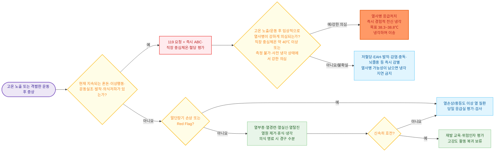

# 열 질환 Heat Illness

## <mark style="color:green;">일반 사항</mark>

* 환경 열 노출 및/또는 운동으로 발생한 열 축적이 정상적인 체온 조절 능력을 넘어설 때 나타나는 질환군
* 다른 이름 : heat-related illness
* 분류 : 열부종, 열경련, 과호흡 관련 손발연축, 열실신, 열탈진, 열손상(heat injury), 열사병(heat stroke)
  * 운동성 열사병(exertional heat stroke) : 격렬한 운동·작업 중 급격히 발생하며 젊고 건강한 사람에게도 발생 가능
  * 비운동성/고전적 열사병(nonexertional/classic heat stroke) : 고령자·영유아·만성질환자에서 폭염에 장시간 노출된 뒤 서서히 발생; 기저질환 동반이 많아 사망률이 운동성보다 높을 수 있음
* 탈수가 없어도 열사병이 발생할 수 있으며, 수분 섭취만으로 모든 열 질환을 예방할 수 있는 것은 아님
* 일사병(sunstroke)은 의미가 불명확한 과거 용어이므로 임상 문서에서는 열사병·열탈진 등 표준 진단명을 사용
* 국내에서는 질병관리청이 5\~9월 온열질환 응급실감시체계를 운영하며 폭염특보 단계에 따라 예방수칙을 안내(질병관리청, 2025)

### <mark style="color:orange;">중심체온 측정 원칙</mark>

* 현장에서는 (측정이 가능한 경우) 직장 체온이 중심체온 평가의 표준 방법이며, 구강·고막·액와·이마 체온은 중심체온을 과소평가할 수 있음(WMS 2024)
* 의료기관에서는 식도 또는 방광 체온 등 검증된 중심체온 측정법을 사용할 수 있음
* 열사병은 통상 직장 중심체온 약 40℃ 이상과 중추신경계 기능 이상으로 진단함
* 다만 사전 냉각, 측정 지연 또는 부정확한 말초체온 측정으로 40℃ 미만으로 나타날 수 있음. 고온 노출과 중추신경계 이상으로 열사병이 임상적으로 의심되면 **진단 확정을 기다리지 않고 경험적 적극 냉각을 시작**함 \[WMS 2024 Strong recommendation, B]
* 정확한 직장 중심체온이 40℃ 미만이고 사전 냉각이나 측정 지연이 없다면 다른 원인을 적극적으로 감별함. 다만 임상적으로 열사병이 강하게 의심되면 감별 과정 때문에 경험적 냉각을 지연하지 않음

## <mark style="color:green;">원인 및 위험 인자</mark>

* 고온·고습·강한 복사열·공기 순환 저하 환경
* 격렬하거나 장시간 지속되는 운동·작업, 불충분한 휴식
* 열 발산을 제한하는 두꺼운 의복, 방호복, 헬멧 또는 보호 장비
* 열 순화 부족, 최근 휴가·질병 후 복귀, 과거 열 질환 병력
* 고령, 영유아, 임신, 비만, 낮은 심폐체력
* 탈수, 염분 소실, 급성 감염 또는 최근 발열성 질환
* 심혈관질환, 신장질환, 당뇨병, 신경계질환, 땀 분비 저하 질환
* 약물·물질
  * 체온조절·발한 저해 : 항콜린제, 1세대 항히스타민제, 항정신병제, TCA, topiramate
  * 열 생성 증가 : amphetamine, methylphenidate, cocaine, MDMA, 마황(ephedra), 갑상선호르몬 과량
  * 탈수·저혈압·신손상 위험 : 이뇨제, ACE 억제제/ARB, 하제, NSAIDs
  * 탈수 시 독성 증가 또는 인지·갈증 저하 : lithium, benzodiazepine, opioid
  * 알코올 남용

<mark style="color:blue;">**약물 카운슬링**</mark> - 폭염 시 위 약물을 임의로 중단하지 않는다. 고령자, 다약제 복용자, 심부전·신장질환자는 복약 및 수분 섭취 계획을 의료진과 개별적으로 조정하며, 조정 시에는 약물별 위험과 이득을 함께 검토한다(CDC, Heat and Medications-Guidance for Clinicians, 2025).

***

### <mark style="color:$danger;">🚩 Red Flags!</mark>

<mark style="color:$danger;">**즉시 119 요청 및 질환별 응급처치**</mark> <mark style="color:$danger;">- 아래 상황은 동시에 나타날 수 있으며 서로 배타적이지 않음</mark>

* **열사병 의심** : 혼돈·이상행동·운동실조·발작·의식저하 등 지속적인 CNS 기능 이상과 고온 노출/임상적 고체온이 함께 있으면 즉시 전신 냉각
  * 직장 중심체온이 약 40℃ 이상인 경우
  * 중심체온을 측정할 수 없거나 사전 냉각·측정 지연이 있어도 임상적으로 열사병이 강하게 의심되는 경우
* **기도·호흡·순환 이상** : 쇼크·지속되는 저혈압·심각한 부정맥 등이 있으면 필요한 냉각과 동시에 ABC 안정화
* **중증 운동연관 저나트륨혈증 의심** : 신속한 혈청 Na 확인과 고장성 식염수 프로토콜 적용; 열사병이 함께 의심되면 냉각도 병행
* **위장관 출혈, DIC 또는 다기관부전 의심** : 열사병에 의한 경우 냉각을 계속하면서 장기 지지치료

<mark style="color:$warning;">**당일 응급실 평가**</mark>

* 냉각·휴식·경구 수분 보충 후에도 증상이 신속히 호전되지 않거나 악화
* 반복되는 구토·설사로 경구 섭취가 불가능
* 운동 중 실신, 반복 실신, 흉통, 호흡곤란 또는 심계항진 동반
* 심한 근육통·근력저하, 갈색뇨 또는 핍뇨가 있거나, 검사에서 급성 신손상·횡문근융해·간손상·유의한 전해질 이상 또는 응고 이상이 확인된 경우
* 고령자·영유아·임신부·심혈관질환·신장질환 등 고위험군의 중등도 이상 증상

<mark style="color:$info;">**외래 추적 / 추가 평가 계획**</mark> <mark style="color:$info;">- 즉각 위험 낮으나 호전 없으면 의뢰</mark>

* 경증 열 질환이 반복되는 경우
* 열 노출과 상관없이 발생하거나 비전형적인 열실신 → 심장성 실신 평가
* 복용약, 수분 제한, 땀 분비 장애 또는 기저질환이 재발에 관여할 가능성이 있는 경우
* 열탈진·열손상·열사병 후 운동 또는 작업 복귀 평가가 필요한 경우

## <mark style="color:green;">진단</mark>

* 대부분 병력(고온·고습 환경 노출, 운동·작업 강도, 수분 섭취, 복용 약물)과 신체진찰로 진단하며, 확진을 위한 단일 검사는 없음
* 핵심은 **CNS 기능 이상 유무**와 **중심체온**으로 중증도를 분류하고, 즉시 감별해야 할 유사 질환(저혈당, 운동연관 저나트륨혈증 등)을 배제하는 것

### <mark style="color:orange;">아형 감별</mark>

<table><thead><tr><th width="140">아형</th><th width="110">중심체온</th><th width="130">CNS 이상</th><th width="220">핵심 소견</th><th>치료 방향</th></tr></thead><tbody><tr><td>열부종</td><td>정상</td><td>없음</td><td>손·발목 등 의존 부위의 경미한 부종</td><td>거상·압박스타킹; 특별한 치료 불필요</td></tr><tr><td>열경련</td><td>정상~경도 상승</td><td>없음</td><td>큰 근육(종아리·허벅지·복부)의 통증성 경련</td><td>안정·스트레칭·경구 전해질</td></tr><tr><td>과호흡 관련 손발연축</td><td>정상~경도 상승</td><td>없음(과호흡에 의한 저림)</td><td>입 주위·손발 저림 또는 연축</td><td>안심시키고 느린 호흡 유도; 봉지 재호흡 금지</td></tr><tr><td>열실신</td><td>정상~경도 상승</td><td>짧은 실신 후 완전 회복; 평가 시 정신상태 정상</td><td>장시간 기립 또는 자세 변화 후 실신</td><td>눕히고 다리 거상; 심장성 실신 감별</td></tr><tr><td>열탈진</td><td>흔히 ≤40℃</td><td>없음(정신상태 정상)</td><td>쇠약·구역·다량 발한·빈맥·두통</td><td>적극적 냉각 + 경구 또는 필요시 IV 수분</td></tr><tr><td>열손상</td><td>가변적</td><td>없음(단, 말단장기 손상 동반)</td><td>횡문근융해·급성 신손상·간손상 소견</td><td>응급실 평가 및 추적검사</td></tr><tr><td>열사병</td><td>흔히 약 40℃ 이상 (측정 불가·사전 냉각 시 예외)</td><td>있음(혼돈~혼수)</td><td>다기관부전 가능; 발한이 있을 수도 있음</td><td>119 요청과 동시에 즉시 전신 냉각</td></tr></tbody></table>

### <mark style="color:orange;">검사</mark>

* 경증(열부종·열경련·열실신)이 신속히 호전되면 추가 검사가 필요하지 않을 수 있음
* 열탈진 이상, 열손상, 열사병이 의심되면 다음을 시행
  * 현장 또는 내원 즉시 혈당
  * CBC, Na, K, Cl, HCO3, Ca, Mg, phosphate, BUN/creatinine
  * AST/ALT, bilirubin, CK; 필요 시 LDH
  * U/A 및 소변현미경검사 - 갈색뇨·근육통이 있으면 횡문근융해 평가
  * PT/INR, aPTT; 중증에서는 fibrinogen, D-dimer 등 DIC 평가
  * ECG; 흉통·부정맥·고위험군에서는 troponin 고려
  * 중증에서는 필요에 따라 혈액가스, lactate, 혈청 삼투질농도, 혈액·소변 배양 등 추가
* CK, creatinine, 간효소, 응고 이상은 초기보다 뒤늦게 악화될 수 있어 중증도와 경과에 따라 추적검사

### <mark style="color:orange;">감별 진단</mark>

* 의식변화를 동반한 고체온 환자에서는 아래 질환을 열사병과 동시에, 또는 열사병 치료를 지연하지 않으면서 감별함

<table><thead><tr><th width="140">질환</th><th width="220">열 질환과의 공통점</th><th>핵심 감별 포인트</th></tr></thead><tbody><tr><td>저혈당</td><td>의식변화, 발한, 빈맥</td><td>즉시 혈당 확인; 포도당 투여로 신속히 호전</td></tr><tr><td>운동연관 저나트륨혈증(EAH)</td><td>장시간 운동 후 의식변화·구토</td><td>과다 음수/체중 증가 병력; 혈청 Na 확인; 무분별한 수액 부하 회피</td></tr><tr><td>발작후 상태, 뇌졸중, 두부외상</td><td>의식저하, 이상행동</td><td>국소 신경학적 결손, 외상력, 필요시 영상검사</td></tr><tr><td>패혈증, 뇌수막염·뇌염</td><td>발열, 의식저하</td><td>발열 양상, 수막자극징후, 감염원 확인</td></tr><tr><td>Serotonin syndrome, NMS, malignant hyperthermia</td><td>고체온, 의식변화, 근강직</td><td>약물력(항정신병제·마취제·세로토닌계 약물); NMS = 납관상 강직(lead-pipe rigidity) + CK 급상승, serotonin syndrome = clonus·반사항진이 특징적</td></tr><tr><td>갑상선중독위기</td><td>고체온, 빈맥, 초조</td><td>갑상선질환 병력, 갑상선기능검사</td></tr><tr><td>항콜린성/교감신경흥분성 중독</td><td>고체온, 빈맥, 의식변화</td><td>약물·독성물질 노출력; 피부 소견(항콜린성=건조, 교감신경흥분성=발한)</td></tr><tr><td>고소뇌부종</td><td>두통, 의식변화</td><td>고지대 노출력, 운동실조</td></tr></tbody></table>

#### <mark style="color:$primary;">운동연관 저나트륨혈증 Exercise-associated hyponatremia (EAH)</mark>

* 장시간 운동 중 수분을 배설 능력 이상으로 과다 섭취하면 발생할 수 있으며, 열탈진 또는 열사병과 증상이 겹침
* 단서 : 운동 중 체중 증가, 과도한 물 섭취, 복부 팽만, 두통, 구토, 혼돈 또는 발작
* 의식장애가 있는데 중심체온이 40℃ 미만이거나 과수분 병력이 있으면 신속히 혈당과 혈청 Na를 확인
* 열사병이 임상적으로 의심되면 감별검사 때문에 경험적 냉각을 지연하지 않음
* 중증 EAH의 고장성 식염수 치료는 응급의학 프로토콜에 따름

***

<strong>열 질환 진단 및 초기 치료 알고리듬</strong>

<em><mark style="color:$info;">Ref. Eifling KP, et al. WMS Clinical Practice Guidelines for the Prevention and Treatment of Heat Illness: 2024 Update. Wilderness Environ Med. 2024;35(1 Suppl):112S-127S.</mark></em>

***

## <mark style="background-color:$warning;">Management</mark>


**중증도별 치료 전략**


| 중증도 | 핵심 치료 | 배치 |
| --- | --- | --- |
| 경증 (열부종·열경련·과호흡성 손발연축·열실신) | 열원 제거, 휴식, 경구 수분 | 현장 관리; 신속 호전 시 귀가 |
| 중등도 (열탈진) | 적극적 냉각 + 경구/필요시 IV 수분 | 신속 호전 없으면 응급실 |
| 열손상 | 열탈진 치료 + 말단장기 손상 평가 | 응급실 평가·검사 |
| 중증 (열사병) | 즉시 전신 냉각 + 119 + ABC | 응급실/중환자 치료; cool first, transport second |

### <mark style="color:orange;">열부종</mark>

* 시원한 환경에서 휴식하고 부종 부위를 심장보다 높게 둠
* 필요하면 압박 스타킹 고려
* 이뇨제는 효과가 없고 탈수를 악화시킬 수 있으므로 사용하지 않음
* 편측 부종, 통증·발적, 호흡곤란 또는 지속되는 부종은 DVT·감염·심장·신장질환 등을 감별

### <mark style="color:orange;">열경련</mark>

* 운동을 중단하고 시원한 곳에서 휴식; 경련 근육을 천천히 수동 스트레칭
* 의식이 명료하고 구토가 없으면 전해질 함유 음료 또는 물과 짠 음식으로 경구 보충
* 소금 정제는 일률적으로 투여하지 않음
* 증상이 완전히 소실되고 수분·전해질 상태가 회복된 뒤 단계적으로 활동 복귀
* 1시간 이상 지속, 반복 재발, 심장질환·신장질환 또는 저염식 환자는 의료기관에서 평가

### <mark style="color:orange;">과호흡 관련 손발연축 (수족연축, Carpopedal Spasm)</mark>

* 시원한 환경으로 이동하고 안심시키면서 천천히 규칙적으로 호흡하도록 유도
* 산소포화도와 활력징후를 확인하고 폐색전증, 천식, 심근허혈, 감염, 대사성 산증 등 빈호흡의 다른 원인을 평가
* **봉지 재호흡은 시행하지 않음** - 저산소혈증 등 다른 원인의 빈호흡을 과호흡증후군으로 오인할 위험

### <mark style="color:orange;">열실신</mark>

* 시원한 곳으로 옮겨 평평하게 눕히고 다리를 올림
* 낙상에 따른 외상을 확인하고 혈당을 측정
* 의식이 완전히 회복되고 구토가 없으면 경구 수분을 보충
* 운동 중 실신, 반복 실신, 흉통·심계항진 동반 또는 비전형적 양상은 부정맥 등 심장성 실신을 평가

### <mark style="color:orange;">열탈진</mark>

* 활동을 즉시 중단하고 에어컨이 있는 장소 또는 그늘로 이동
* 불필요한 의복과 장비를 제거하고 전신에 시원한 물을 적시면서 선풍기 등으로 송풍
* 의식이 명료하고 기도 보호가 가능하며 구토가 없으면 경구 등장성 수분 보충을 우선
* 경구 섭취가 불가능하거나 중증 탈수가 의심되면 등장성 결정질액 정주를 고려
* 직장 중심체온, 정신상태, 혈압 및 열사병으로의 진행 여부를 반복 평가
* 신속히 회복되지 않거나 Red Flag가 있으면 응급실로 이송
* 중등도 이상 열탈진 후에는 당일 고강도 활동으로 복귀하지 않음

### <mark style="color:orange;">열손상</mark>

* 일부 운동성 열질환 분류에서는 열탈진과 열사병 사이에 다음과 같은 중간 범주를 둠
* 열탈진과 유사한 임상 양상에 횡문근융해, 급성 신손상, 간손상 또는 응고 이상 등 말단장기 손상이 동반되지만 CNS 기능 이상은 없는 상태
* 단순 열탈진으로 관리하지 말고 응급실 평가와 추적검사를 시행

### <mark style="color:orange;">열사병 - 즉시 신고하고 지체 없이 냉각</mark>

* 피부는 뜨겁고 건조할 수도 있으나, 특히 운동성 열사병에서는 다량의 발한이 지속될 수 있음. 고전적(비운동성) 열사병은 무한증(anhidrosis)으로 hot & dry 소견이 두드러지는 경향이 있으나, **발한 유무만으로 열사병을 배제하지 않음**
* 119에 즉시 신고하고 ABC를 평가; 119 신고와 냉각은 가능한 동시에 진행
* **Cool first, transport second** 원칙은 특히 젊고 건강한 환자에서 발생하는 운동성 열사병에서 근거가 가장 강함. 비운동성/고전적 열사병은 고령·심혈관질환 동반이 많아 현장 냉각을 즉시 시작하되 이송과 소생술 접근성을 지연시키지 않음
* 생명을 위협하는 ABC 문제가 없다면 현장에서 지체 없이 전신 냉각을 시작 - 이송 준비나 정맥로 확보 때문에 냉각을 늦추지 않음
* 운동성 열사병의 1차 냉각법은 (가능한 경우) 의복·장비를 제거한 뒤 목 아래 몸통과 사지를 얼음물 또는 가능한 가장 찬물에 담그는 **전신 침수**임. 머리가 물에 잠기지 않게 하고 환자를 혼자 두지 않음
* 현장에서 전신 침수가 안전하고 신속하게 가능하면 즉시 시행함. 불가능하면 물 분무·전신 적심과 강한 송풍 등 가장 효과적인 가용 냉각을 즉시 시작하고 이송 중에도 지속함. 의료기관 도착 후에도 중심체온이 높으면 모니터링과 소생술 접근성을 확보한 상태에서 전신 침수 또는 가장 신속한 가용 냉각법을 계속함
* 침수가 불가능하면 전신 피부를 지속적으로 찬물에 적시고 강하게 송풍
* 생명을 위협하는 고체온에서는 가능하면 **중심체온 하강 속도 0.15℃/분 이상**을 목표로 함(AHA 2025 Special Circumstances of Resuscitation, COR 2a, LOE C-LD). 전신 침수가 가장 빠른 냉각법임
* 얼음을 사용할 때에는 목·겨드랑이·서혜부 등 소수 부위에 국한하지 말고 가능한 넓은 체표면(전신)에 적용. 화학 냉각팩을 쓸 경우 대혈관을 덮는 피부보다 뺨·손바닥·발바닥에 적용하는 것이 효과적이라는 보고도 있음
* 목·겨드랑이·서혜부의 소수 얼음주머니는 전신 침수나 전신 증발·대류 냉각보다 효과가 낮은 보조 수단이며, 이를 적용하느라 전신 냉각을 지연하지 않음
* 직장 중심체온을 연속 측정할 수 있으면 **38.3\~38.8℃**에서 적극적 냉각을 중단하여 과도한 냉각(overshoot hypothermia)을 예방 \[WMS 2024]
* 직장 중심체온을 측정할 수 없더라도 고온 노출과 CNS 이상으로 열사병이 의심되면 측정을 기다리지 않고 냉각; 떨림만을 냉각 종료 기준으로 사용하지 않음
* 일반 응급처치 환경에서 정확한 중심체온 측정이 불가능하면 약 15분간 또는 신경학적 증상이 해소될 때까지 전신 침수를 시행할 수 있으며, 119의 지시에 따라 냉각을 계속함
* 냉각 방법, 시작 시각, 가능한 경우 최초·추적 중심체온을 구조대에 전달하고 이송 중에도 가능한 냉각을 지속(AHA/Red Cross 2024)
* 의식장애가 있으면 경구 수분을 금함
* 등장성 결정질액을 사용할 수 있으나 저혈압, 말초관류, 소변량, 폐울혈과 동반질환을 반복 평가하여 투여량을 개별화 - 수액 투여는 전신 냉각을 대신하지 못함
* 4℃ 냉각 등장성 수액은 보조적으로 사용할 수 있으나 전신 침수보다 냉각 효과가 제한적이므로 일차 냉각법을 대체하지 않음. 투여량은 혈역학적 상태와 심장·신장질환을 고려하여 개별화하고 과도한 수액에 의한 폐부종을 피함
* 저나트륨혈증이 의심되는 경우 무분별한 수액 부하를 피하고 신속히 혈청 Na를 확인
* 발작이나 심한 초조가 냉각을 방해하면 모니터링하에 benzodiazepine을 고려할 수 있음


**⚠️ 해열제는 열사병 치료에 사용하지 않음**\
열사병은 체온 설정점이 상승하는 감염성 발열과 기전이 다르므로 acetaminophen, ibuprofen, aspirin 등 해열제는 체온을 낮추지 못한다. 오히려 간손상·신손상·응고장애를 악화시킬 수 있어 치료 목적으로 사용하지 않는다. Dantrolene 역시 열사병의 일상적 치료제로 권고되지 않는다.


## <mark style="color:green;">비-약물 치료 및 예방</mark>

### <mark style="color:orange;">환경과 활동 조절</mark>

* 폭염특보, 체감온도 및 가능한 경우 습구흑구온도지수(WBGT)를 확인
* 하루 중 가장 더운 시간과 높은 열지수·WBGT에서는 고강도 야외 활동을 피하거나 강도와 시간을 줄임
* 그늘 또는 냉방 공간에서 작업강도와 환경 위험에 비례하여 자주 휴식
* 밝은색의 헐렁하고 통기성 좋은 옷을 입고, 필요한 보호구는 휴식 중 안전하게 벗어 열 발산을 도움
* 모자·양산과 자외선 차단제를 사용하되, 안전상 필요한 헬멧은 임의로 벗지 말고 정해진 휴식 공간에서 환기
* 혼자 작업하거나 운동하지 않도록 buddy system을 활용하고 초기 증상을 서로 확인
* 영유아·인지저하자·거동이 불편한 사람을 차량이나 냉방되지 않는 밀폐 공간에 **단 한순간도** 혼자 두지 않음 - 실외 기온이 높지 않아도 밀폐된 차량 내부 온도는 짧은 시간 내에 치명적 수준까지 상승할 수 있음

### <mark style="color:orange;">열 순화 Heat acclimatization</mark>

* 새로운 고온 환경 또는 휴가·질병 후 복귀 시 첫날부터 평소 강도로 활동하지 않음
* 최소 7일, 보통 7\~14일에 걸쳐 열 노출 시간과 운동·작업 강도를 단계적으로 증가
* 신규 작업자와 순화가 소실된 복귀 작업자는 더 짧은 작업시간과 더 잦은 휴식이 필요

### <mark style="color:orange;">수분과 전해질</mark>

* 운동·레저 활동에서는 갈증과 개인별 발한량에 맞추어 마시고, 운동 전후 체중 증가가 생길 정도의 과도한 음수는 피함
* 가능하면 운동 전후 체중을 확인하여 체중 감소가 2%를 넘지 않도록 개별 수분 계획을 조정
* 소변색은 수분 상태의 한 가지 참고 지표일 뿐이며, 소변이 맑아질 때까지 계속 마시는 것을 목표로 하지 않음
* 장시간 고강도 활동 또는 다량 발한 시에는 전해질 함유 음료와 정상적인 식사로 염분을 함께 보충
* 산업현장에서는 작업자가 시원한 물을 쉽게 이용할 수 있게 하고, 고온작업 중에는 정기적으로 수분 섭취와 휴식을 권고 - 2시간 이상 지속되는 작업에서는 전해질 함유 음료를 제공(OSHA, Heat-Water, Rest, Shade)
* 소금 정제는 위장관 자극과 과도한 나트륨 섭취 위험이 있으므로 일률적으로 사용하지 않음
* 심부전·신장질환 또는 수분 제한 환자에게 일반적인 다량 음수 지침을 적용하지 말고 개별 계획을 세움
* 음주와 고카페인 에너지음료·자극성 보충제는 피함. 중등도 카페인을 일률적으로 금지할 근거는 부족함

### <mark style="color:orange;">WBGT</mark>

* WBGT는 기온뿐 아니라 습도와 복사열을 반영하는 작업·운동 환경의 열 스트레스 지표
* 옥외 일사 환경에서는 자연습구온도·흑구온도·건구온도를 조합하고, 일사가 없는 실내·그늘에서는 자연습구온도와 흑구온도를 조합
* 일반 기상정보의 체감온도·열지수와 WBGT는 동일한 지표가 아님
* 실제 활동 제한과 작업·휴식 비율은 WBGT뿐 아니라 작업강도, 의복·보호구 및 열 순화 여부를 함께 고려

### <mark style="color:orange;">운동·작업 복귀</mark>

* 경증 열부종·열경련·열실신은 증상이 완전히 소실되고 원인이 교정된 뒤 단계적으로 복귀
* 중등도 이상 열탈진은 당일 고강도 활동에 복귀하지 않으며, 재발 시 기저질환과 약물을 평가
* 열손상 또는 열사병 후에는 증상이 없고 신체진찰과 CK, 신기능, 간기능, 전해질, 응고검사 등이 정상화된 뒤 의료진 감독하에 단계적으로 복귀
* 회복 중 증상이 재발하거나 4\~6주 내 열 적응 활동으로 진행하지 못하면 스포츠의학·직업환경의학 등 관련 전문가 평가를 고려

***

### <mark style="color:red;">질병코드</mark>

T67 열 및 빛의 영향

T67.0 열사병 및 일사병

T67.1 열실신

T67.2 열경련

T67.3 탈수성 열탈진

T67.4 염분상실에 의한 열탈진

T67.5 상세불명의 열탈진

T67.6 일과성 열피로

T67.7 열성 부종

T67.8 열 및 빛의 기타 영향

T67.9 열 및 빛의 상세불명의 영향

***

### <mark style="color:$success;">핵심 복약 지도</mark>

> **폭염 시 복용 약물 조정**
>
> * 이뇨제, 혈압약(ACE 억제제/ARB), 항콜린제, 1세대 항히스타민제, 항정신병제 등을 복용 중인 환자는 폭염 시 임의로 중단하지 않고 의료진과 상의하여 수분 섭취·활동량·용량 조정 계획을 세운다.
> * 다약제 복용 고령자는 열 발산·갈증 인지·신장 배설 능력이 함께 저하될 수 있어 특히 주의가 필요하다.

> **해열제는 열사병에 사용하지 않는다**
>
> * 열사병은 감염성 발열과 기전이 달라 acetaminophen, ibuprofen, aspirin이 체온을 낮추지 못하며 간·신 손상과 응고장애를 악화시킬 수 있다.
> * 고체온 환자에게 해열제 대신 전신 냉각(전신 침수, 물 분무 + 송풍)을 우선한다.

> **수분·전해질 섭취 지도**
>
> * "소변이 맑아질 때까지" 강박적으로 마시게 하지 말고 갈증과 발한량에 맞추어 섭취하도록 안내한다.
> * 장시간·고강도 활동 시에는 전해질 함유 음료와 식사로 염분을 함께 보충하도록 지도한다.
> * 갈증 없이 과도하게 마셔 체중이 늘어난 병력이 있으면 운동연관 저나트륨혈증(EAH) 가능성을 고려하고, 의식장애가 동반된 경우 무분별한 수액 부하보다 신속한 혈청 Na 확인을 우선한다.

> **언제 다시 병원을 방문해야 하나요?**
>
> * 냉각·휴식·수분 보충 후에도 신속히 호전되지 않거나 증상이 악화되는 경우
> * 혼돈, 이상행동, 경련, 의식저하가 나타나는 경우 - 즉시 119
> * 갈색뇨, 심한 근육통, 소변량 감소가 나타나는 경우
> * 열탈진·열손상·열사병을 겪은 뒤 활동 복귀 시점을 확인하고 싶은 경우

***

### <mark style="color:blue;">환자 안내서</mark>


**열 질환에서는 의식·행동 변화가 가장 중요한 응급 신호입니다**

더위 속에서 몸이 뜨거워지면 손발이 붓거나 쥐가 나는 가벼운 증상부터, 의식이 흐려지는 열사병까지 다양하게 나타날 수 있습니다. 가장 중요한 응급 신호는 **말이 어눌해지거나 행동이 이상해지는 것**입니다. 이마·귀·겨드랑이 체온은 실제 중심체온보다 낮게 측정될 수 있습니다. 이러한 체온이 40℃ 미만이거나 이미 몸을 식힌 뒤라도, 말이 어눌해지거나 행동이 이상하고 비틀거리면 열사병 가능성을 배제하지 말고 즉시 119에 신고하십시오.


#### <mark style="color:$primary;">왜 열 질환이 생기나요?</mark>

* 더운 환경에서 운동하거나 일하면 몸에서 만들어지는 열이 몸이 식힐 수 있는 능력보다 많아집니다.
* 고령, 영유아, 심장·신장질환, 특정 약물(이뇨제, 항히스타민제, 정신과 약물 등)은 몸이 열을 식히는 능력을 떨어뜨립니다.
* 땀을 많이 흘리는 사람도 열사병에 걸릴 수 있어, 땀이 난다고 안심할 수 없습니다.

#### <mark style="color:$primary;">일상생활에서 어떻게 관리하나요?</mark>

* **가장 더운 시간대의 고강도 실외 활동을 피하십시오.** 폭염특보가 있는 날은 특히 활동을 줄이거나 시원한 시간대로 옮기십시오. 🌡️
* **밝은색의 헐렁하고 통풍이 잘 되는 옷을 입으십시오.**
* **갈증에 맞추어 물을 마시십시오.** 소변이 맑아질 때까지 억지로 마실 필요는 없으며, 땀을 많이 흘렸다면 전해질 음료나 짠 음식을 함께 드십시오.
* **목마르지 않은데 운동 중 물을 억지로 많이 마시지 마십시오.** 체중이 늘어날 정도로 과도하게 마시면 오히려 위험한 저나트륨혈증(물중독)이 생길 수 있습니다.
* **혼자 운동하거나 일하지 마십시오.** 함께 있는 사람이 초기 증상을 알아채 줄 수 있습니다.
* **영유아나 거동이 불편한 가족을 차 안에 단 몇 분이라도 혼자 두지 마십시오.** 창문을 열어 두어도 차 안 온도는 매우 빠르게 위험한 수준까지 올라갈 수 있습니다. 🚗

#### <mark style="color:$primary;">약은 어떻게 써야 하나요?</mark>

* 열사병에는 타이레놀(acetaminophen), ibuprofen, aspirin 같은 해열제가 효과가 없으며 오히려 장기 손상을 악화시킬 수 있습니다.
* 폭염 때 복용약을 임의로 중단하지 마십시오. 이뇨제·혈압약·정신신경계 약물을 복용 중이면 의료진과 수분 및 복약 계획을 상의하십시오.

#### <mark style="color:$primary;">이럴 때는 즉시 병원을 방문하세요</mark>

* 더위 속에서 말이 어눌해지거나 행동이 이상하고, 비틀거리거나 의식이 떨어지면 **체온 수치와 관계없이 즉시 119에 신고**하고 몸을 식히십시오.
* 가능하면 옷과 장비를 벗기고 목 아래 전신을 찬물에 담그십시오. 불가능하면 몸 전체를 물로 적시면서 선풍기나 부채로 강하게 바람을 보내십시오.
* 의식이 흐리거나 구토하는 사람에게 물이나 약을 먹이지 마십시오.
* **소변 색이 콜라처럼 진해지거나(갈색뇨) 소변량이 크게 줄고, 근육통이 심하면** 신장·근육 손상 가능성이 있으므로 반드시 병원에서 확인해야 합니다.
