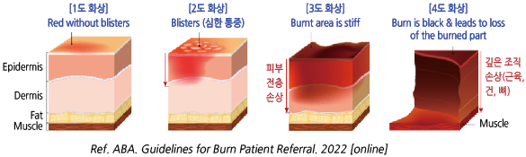

# 화상 Burn

## 일반 사항

* 열, 전기, 화학 물질 등에 의한 조직 손상
* ＞50℃ 수온에서 ＞3초 노출되면 화상이 발생할 수 있음
* 낮은 온도에서도 지속적인 노출 또는 압력이 가해지면 열에 의한 화상이 발생할 수 있음
* 초진료에서 바로 이송을 하는 경우에는 체온 유지에 유의하면서 마른 거즈 드레싱만 시행(국소제 도포 또는 습윤 드레싱은 하지 않음)
* 화상 면적 측정&#x20;
  * Rule of 9’s : 머리/얼굴/목 9%, 몸통 앞뒤 각각 18%, 팔 좌우 각각 9%, 다리는 좌우 각각 18%, 생식기 부위 1% (☞ [계산기](https://www.mdcalc.com/calc/10568/rule-nines))
  * palmar method : 한 손바닥 전체 크기를 전체 체표면적의 약 1%로 간주

### 합병증

* 감염 : 연조직염, 상처 패혈증
* 신경병증성 통증
* 관절 구축(특히 손)
* 흉터

## 분류 및 특징

| **분류**                        | **이환 조직**  | **외형**                                      | **통증** | **치유 기간**               |
| ----------------------------- | ---------- | ------------------------------------------- | ------ | ----------------------- |
| **Superficial 1도 화상**         | 표피층        | 건조, 물집(-), red, blanchable, 부종 거의 없음        | 매우 심함  | 3\~6일; 홍터(-)            |
| **Superficial partial 2도 화상** | 진피 상층부     | 물집(수 시간 이후 출현), 삼출, red, blanchable         | 매우 심함  | 7\~21일; 홍터(+); 피부 색조 변화 |
| **Deep partial 3도 화상**        | 진피 전체      | 물집(즉시), 삼출, no blanching, 탄성(-); 붉은색\~흰색 기저 | 압박만 지각 | >21일; 홍터(+)             |
| **Full 4도 화상**                | 피하 ± 이하 조직 | 건조, 가피, 가죽 같음, 출혈; no blanching; 흰색\~검은색 기저 | 무감각    | 중첩적 치유 안 됨; 피부 이식 필요    |

### 감염 의심 소견

* Staphylococcus : 재상피화되었던 병변이 다시 악화됨(melting away)
* Pseudomonas : 청록색, 형광 황록색, 향긋한(과일 향) 냄새의 분비물
* Candida : 피부의 흰색 작은 농포
* Herpes simplex-1 : 치유된 피부의 2\~3 ㎜ 천공성 구멍

### Red Flags!

* 3도 화상 또는 화상 면적이 체표 면적의 ＞10%
* 얼굴, 손, 발, 회음부, 주요 관절 화상
* 신체 부위를 둘러싸는 화상(팔, 다리, 몸통 등에서 원주형으로 둘러싼 화상)
* 흡입 화상 : 기침, 호흡 곤란, 안면 화상, 쌕쌕거림, 검댕이 섞인 가래, 후두 부종, 목소리 변화
* 고압 전기 화상, 화학 화상
* 외상(예: 골절) 또는 기저 질환(예: 당뇨) 동반
* 전신 증상 : ＞39℃, ＜36.5℃, 빈맥, 빈호흡, 저혈압
* 어린 소아(＜5세), 고령(＞70세)
* 치유 지연 : 경증 화상에서 1주 후에도 상피화가 시작되지 않음

<table data-header-hidden><thead><tr><th width="244"></th><th width="263"></th><th></th></tr></thead><tbody><tr><td><strong>구분</strong></td><td><strong>즉각적인 협진(이송 고려)</strong></td><td><strong>협진 고려</strong></td></tr><tr><td><strong>Thermal Burns (열상)</strong></td><td>• Full thickness burns  • Partial thickness ≥10% TBSA  • 얼굴, 손, 발, 생식기, 회음부, 관절부 화상  • 다른 질환 동반  • 외상성 손상 동반  • 조절되지 않는 통증</td><td>• Partial thickness burns &#x3C;10% TBSA • All potentially deep burns</td></tr><tr><td><strong>Inhalation Injury (흡입 손상)</strong></td><td>• 흡입 손상 의심</td><td>• 안면 화상, 연기 노출 등 흡입 가능성 있음</td></tr><tr><td><strong>소아 (Pediatric)</strong></td><td>• 모든 소아 화상</td><td>—</td></tr><tr><td><strong>Chemical Injuries (화학 손상)</strong></td><td>• 모든 chemical injuries</td><td>—</td></tr><tr><td><strong>Electrical Injuries (전기 손상)</strong></td><td>• 모든 고압 전류(≥1,000V) 손상 • 낙뢰 손상</td><td>• 저압 전류(&#x3C;1,000V) 손상</td></tr></tbody></table>

TBSA = total burn surface area. _소아: ≤14세 또는 <30 kg_\
Ref. _ABA. Guidelines for Burn Patient Referral. 2022 \[online]_

***

## Management

### 첫 치료

1. 의복 제거, 부종 발생에 대비하여 반지, 팔찌, 신체 장신구, 부착물 등 조이는 물건 제거
2. 냉각 : 미지근한(12~~25℃) 생리 식염수로 15~~30분간(저체온증 주의); 차가운 물(＜8℃)은 피함
3. 세척 : 미지근한 물 또는 식염수, 중성 비누 사용
4. 수포 : 작은 수포(＜6 ㎜)는 보존; 터질 가능성이 많은 큰 수포나 관절 부위 수포는 제거나 흡인을 고려
5. 국소 항균제 도포
6. 드레싱; 수포가 터지면 괴사 조직 제거
7. 진통제, 항생제, 항히스타민제 등 전신 치료제 및 백신 접종 고려

### 물 세척 시 유의 사항

* 건조한 석회가 묻은 병변 : 물과 Ca oxide가 반응하여 강한 알칼리 물질인 Ca hydroxide를 형성하므로 물 세척 전에 충분히 털어 내며, 흐르는 물로 세척
* elemental metal : 일부 금속 성분(예: Na, K, Mg, P, Li, Ce, Ti)은 물에 닿으면 열을 만들거나 위해 성분을 발산하므로 dry forcep으로 제거 후 mineral oil로 덮음
* phenol : 50% polyethylene glycol에 적신 스폰지로 제거; 페놀은 물에 녹지 않으며 희석된 페놀은 피부를 통하여 빠르게 흡수되므로 물로 씻는 경우에는 흐르는 대량의 물을 사용해야 함

### 국소 항균제

* 2도 이상 화상에서 적용; 1도 화상에서는 필요 없음
* re-epithelialization 징후가 나타날 때는 chlorhexidine 외에는 적용 중지
* 눈 주위에는 안연고 적용

**Silver sulfadiazine**

* 장점 : broad-spectrum, 통증 감소, 습윤 유지, colonization 감소 \[실마진]
* 단점 : 매일 드레싱 교체 및 교체 시 통증, eschar 침투 못함, 상피 재생 저해; 상처 치유 또는 세균 감염 감소에 대한 증거 부족
* 금기 : 눈 주위, 임신/수유, 신생아, sulfonamide 과민 환자

\*\*Povidone-iodine \*\*

* 장점 : 살균 작용 \[베타딘 액]
* 단점 : 혈액 또는 혈청 단백이 존재하는 상처에서는 효과 저하; 세포 독성, 세포 증식 저해, 화학적 화상, 통증
* 금기 : 넓은 범위 사용, ＜2세, 임신/수유, 갑상선 질환

**Mupirocin, Bacitracin**

* 장점 : 그람양성균(MRSA 포함)에 유효
* 단점 : 매일 드레싱 교체 및 교체 시 통증
* 세균 감염 의심 시 고려; 습윤 유지를 목적으로 할 때는 크림 제제보다 연고제 선택 \[에스로반]

**Mafenide**

* 장점 : broad-spectrum, Pseudomonas를 포함한 그람음성균에 유효, eschar 및 연골 침투
* 단점 : 2\~3도 화상 도포 시 통증, 매일 드레싱 교체 및 교체 시 통증, 대사성 산증 가능성, 상피 재싱 저해
* 중증 감염에서 고려 \[메페드]
* 금기 : sulfonamide 과민 환자

**Chlorhexidine**

* 장점 : 약한 항균 작용; 상피 재생을 저해하지 않음 \[헥시딘 액]

### 드레싱

* 물과 중성 비누를 이용하여 이전 드레싱 시 도포한 치료제 및 분비물을 제거한 후 시행
* 드레싱 빈도 : 병소의 상태 및 드레싱 소재에 따라 1일 2회\~1주 1회
  * 지나치게 빈번한 드레싱 교체는 상처의 재상피화를 방해할 수 있음
  * 습윤성 non-adherent 드레싱 제재 사용 시 상처의 깊이 및 흡습성에 따라 드레싱 교체 없이 7\~10일간 유지할 수 있음 (필요시 주 2회 병소 확인)
* 손/발가락은 피부끼리 닿지 않도록 분리하여 감쌈
* 작은 표재성 화상(특히 얼굴 병소)은 bacitracin을 도포하면서 개방하여 치료할 수 있음(보통 드레싱이 필요 없음)
* 표재성 화상 또는 물집이 유지되고 있는 경우에 피부에 닿는 면은 달라붙지 않는 소재를 선택
* 초기에는 삼출물을 흡수하는 제제를 적용하고 \[메디터치], 삼출물이 줄어들면 비흡수성 제재를 적용 \[듀오덤, 테가덤/옵사이트 필름]

<table data-header-hidden><thead><tr><th width="387"></th><th></th></tr></thead><tbody><tr><td><strong>소재 [상품명]</strong></td><td><strong>흡수력</strong></td></tr><tr><td>polyurethane foam [메디터치]</td><td>moderate</td></tr><tr><td>hydrogel [Dermagauze] hydrocolloid [듀오덤] alginate [Sorbsan]</td><td>minimal</td></tr><tr><td>polyurethane film [테가덤, 옵사이트플렉시픽스]</td><td>none</td></tr></tbody></table>

### 전신 치료제

#### 항생제

* 초기에는 상처 조직에 세균이 정착/증식하지 않기 때문에 필요 없음; 예방적 투여는 하지 않음
* 국소 감염, 연조직염 소견이 나타나는 경우 고려 (☞ p.901)

#### 진통제

* ibuprofen : 400\~800 ㎎ tid \[부루펜]
* acetaminophen : 650\~1,300 ㎎ tid \[타이레놀]

#### H1-항히스타민제

* 가려움 발생 시 고려; 수면 효과가 있는 1세대 제제가 보다 유효 (☞ p.1144)
* chlorpheniramine : 4 ㎎ q4\~6hr, 최대 24 ㎎/d \[페니라민]
* hydroxyzine : 25~~50 ㎎ hs or 50~~100 ㎎/d #3\~4 \[아디팜]
* diphenhydramine : 25~~50 ㎎ q4~~6hr, 최대 300 ㎎/d [디펙타민](../%EB%B9%84%EB%B3%B4%ED%97%98/)

#### 위산 분비 억제제

* stress ulcer 예방을 위하여 고려
* H2 blocker, PPI (☞ [소화기계약제](../224_/073_.md#proton-pump-inhibitor-ppi))

### 기타

* 파상풍 백신 : 기본 접종 일정을 완료하지 않았으면 시행 (☞ p.1113)
* 보습제 : 피부의 윤활 기능이 완전히 회복될 때까지 도포 (☞ p.867)
* 자외선 차단제 : 정상 피부색이 돌아올 때까지 도포. 가급적 SPF ≥30 선택 (☞ p.1084)
* 식이 : 고단백, 고칼로리
* 추적 관찰 : 완전한 재상피화 이후 4주마다 hypertrophic scar 형성 및 기능 장애 여부 관찰
* 손가락 구축 대처 : 손의 2도 이상의 화상 시 손가락을 신전시키는 드레싱, 손 신전 운동
* 가려움 : 날씨가 덥거나 활동을 많이 하거나 스트레스를 받으면 심해짐
  * 항히스타민제 투여, 보습제 도포, 헐렁하고 부드러운 면 소재 옷 착용

## 가정에서의 화상 예방법

\[미국가정의학회 권고안]

* 햇빛에 노출될 때 피부 노출을 줄인다(예: 모자, 긴팔 옷, 긴 바지).
* 아이들이 만질 수 있는 콘센트에는 보호 덮개를 한다.
*   샤워하기 전에 목욕물 온도를 점검하고 목욕하는 동안 아이가 온수 수도꼭지를 만지지 않도록 한다.

    수온을 조절할 수 있다면 50℃ 이상으로 올라가지 않도록 설정한다.
* 조리 시 프라이팬이나 포트의 손잡이는 벽 쪽으로 돌려놓고 여러 개의 버너가 있는 레인지라면 뒤쪽 버너를 사용한다.
* 아이가 화기 근처에서 놀거나 화기 위에서 조리하는 것을 돕지 않게 한다.
* 열 가습기 사용을 삼가거나 아이의 손에 닿지 않는 곳에 설치한다.
* 햇빛 아래 주차할 때는 수건으로 카시트를 덮어 놓으며 햇빛에 노출되었던 차량에 아기를 앉힐 때는 시트나 안전벨트 등이 뜨겁지 않은 지 확인한다.
* 화학 물질은 아이들의 손이 닿지 않는 곳에 보관한다.

### **질병코드**&#x20;

T20\~T32 화상 및 부식

## 처방례


\
애니펜 300 ㎎/T 3T #3
\
아디팜 10 ㎎/T 3T #3 가려움에 대하여
\
파목신 500 ㎎/C 3C #3 감염 소견이 있는 경우

