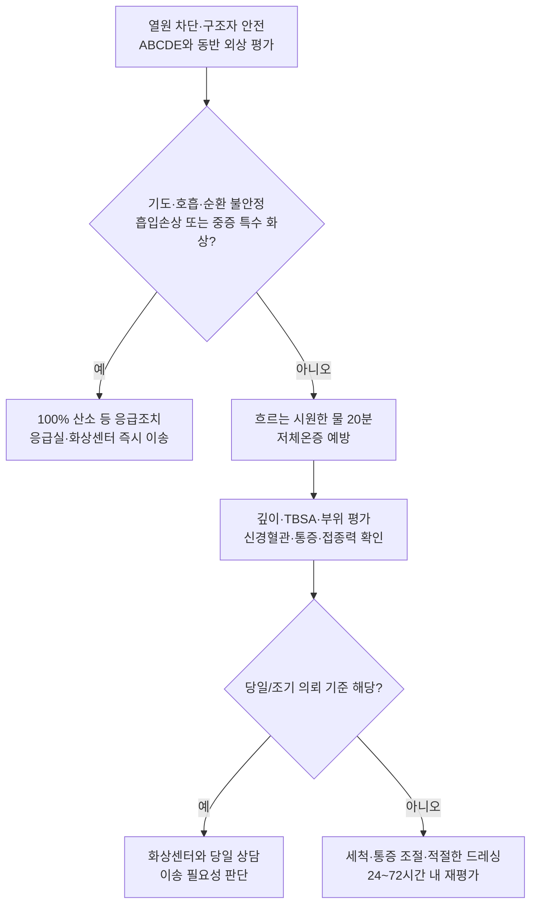

# 화상 Burn

## <mark style="color:green;">일반 사항</mark>

* 열, 화학물질, 전기, 방사선, 마찰 등에 의한 피부 또는 심부조직 손상
* 열손상 정도는 온도와 접촉시간, 피부 두께, 압력 및 열원의 성질에 따라 달라진다. 비교적 낮은 온도도 장시간 접촉하면 저온화상을 일으킬 수 있다.
* 화상은 초기 48\~72시간 동안 깊이가 진행하거나 재평가 결과가 달라질 수 있는 동적 손상이다.
* 화상센터 또는 응급실로 바로 이송하는 경우에는 저체온증을 예방하면서 깨끗하고 마른 비점착성 거즈나 천으로 느슨하게 덮는다. 국소제 도포나 습윤 드레싱 때문에 이송을 지연하지 않는다.

### <mark style="color:orange;">화상 면적 측정</mark>

* **TBSA(total body surface area)**에는 물집이 생긴 부분층 화상과 전층 화상만 포함하며, 홍반만 있는 표재성 화상은 포함하지 않는다.
* **Rule of Nines**: 성인에서 머리·얼굴·목 9%, 몸통 앞뒤 각각 18%, 양팔 각각 9%, 양다리 각각 18%, 회음부 1%로 계산한다(☞ [계산기](https://www.mdcalc.com/calc/10568/rule-nines)).
* **소아**: 신체 비율이 성인과 다르므로 Lund-Browder chart를 우선 사용한다.
* **Palmar method**: 작거나 산재한 화상은 환자 자신의 손을 이용한다. 손가락을 포함한 전체 손바닥면은 약 0.8\~1%, 손바닥만은 약 0.5%이므로 어느 기준을 사용했는지 명시한다.

### <mark style="color:orange;">합병증</mark>

* 감염: 화상 주변 연조직염, 화상 상처 감염, 패혈증
* 저체온증, 저혈량성 쇼크, 급성 신손상 및 전해질 이상(광범위·전기 화상)
* 신경병증성 통증과 만성 가려움
* 관절 구축과 기능 장애(특히 손·관절 부위)
* 색소 변화, 비후성 반흔 및 켈로이드

## <mark style="color:green;">분류 및 특징</mark>


<table><thead><tr><th>분류</th><th>이환 조직</th><th>외형·감각</th><th>일반적인 경과</th></tr></thead><tbody><tr><td><strong>표재성 화상<br>Superficial(1도)</strong></td><td>표피</td><td>건조하고 붉으며 압박 시 창백해짐; 물집 없음; 통증 있음</td><td>대개 3\~7일 이내 치유; 반흔 없음<br><strong>TBSA에서 제외</strong></td></tr><tr><td><strong>표재성 부분층 화상<br>Superficial partial-thickness(얕은 2도)</strong></td><td>표피와 진피 상층</td><td>습윤하고 붉으며 압박 시 창백해짐; 물집과 심한 통증</td><td>대개 1\~3주 이내 재상피화; 2주 이내 치유되면 뚜렷한 반흔 위험은 낮으나 색소 변화 가능</td></tr><tr><td><strong>심부 부분층 화상<br>Deep partial-thickness(깊은 2도)</strong></td><td>진피 심층</td><td>창백하거나 얼룩진 적색·백색; 창백반응 감소 또는 소실; 통증·감각 감소</td><td>대개 3주 이상; 비후성 반흔과 구축 위험이 높아 조기 화상 전문진료 및 피부이식 고려</td></tr><tr><td><strong>전층 화상<br>Full-thickness(3도)</strong></td><td>표피와 진피 전층, 피하조직까지 침범 가능</td><td>건조하고 가죽 같으며 흰색·갈색·검은색; 창백반응과 통각 소실</td><td>자발적 재상피화가 어렵고 대부분 절제·피부이식 필요</td></tr><tr><td><strong>4도 화상</strong></td><td>피부 전층을 넘어 근막·근육·힘줄·뼈</td><td>탄화, 깊은 조직 노출 또는 괴사</td><td>응급 수술·재건 치료 필요</td></tr></tbody></table>


화상의 깊이는 초기 외형만으로 확정하기 어려우며 특히 처음 48\~72시간 동안 반복 평가한다. 피부색이 짙은 환자는 홍반보다 온도, 습윤도, 모세혈관 재충혈과 감각을 함께 평가한다.


### <mark style="color:$danger;">🚩 Red Flags!</mark>

<mark style="color:$danger;">**즉각 조치 또는 응급실 이송**</mark>

* 흡입손상 또는 기도 화상 의심: 밀폐공간 화재, 호흡곤란, stridor, 쉰 목소리, 구강 내 그을음·부종, 검댕이 섞인 가래, 의식 변화
* 쇼크 또는 중증 전신상태: 저혈압, 의식저하, 청색증, 심한 호흡곤란, 차고 축축한 피부
* 원주형 심부 화상과 원위부 혈류 저하 또는 흉곽 팽창 제한
* 고전압(≥1,000 V) 전기 화상, 낙뢰, 부정맥·실신·흉통을 동반한 전기 손상
* 불산(hydrofluoric acid), 백린 등 전신독성 위험 물질, 중증 화학 화상 또는 안구 화학손상
* 4도 화상, 광범위 전층 화상 또는 빠르게 진행하는 괴사
* 감염 의심 소견과 함께 발열·저체온, 빈맥, 저혈압, 의식 변화 등 전신증상이 나타남
* 중증 동반 외상, 비우발성 손상 또는 학대가 의심되는 소아

<mark style="color:$warning;">**당일 또는 조기 의뢰**</mark>

* Tier 1 기준에 해당하지 않는 모든 전층 화상
* 부분층 화상 ≥10% TBSA
* 얼굴·손·발·생식기·회음부 또는 주요 관절의 심부 부분층·전층 화상
* 화상 면적과 관계없이 깊이가 불확실하거나 잠재적 심부 화상이 의심되는 경우
* 흡입손상 가능성: 안면 섬광화상, 코털이 그을림, 밀폐공간 연기 노출 등
* Tier 1 기준에 해당하지 않는 모든 화학 화상
* 저전압(＜1,000 V) 전기 화상
* 치료에 영향을 주는 기저질환, 동반 외상 또는 외래 관리가 어려운 사회적 상황
* 진통제로 조절되지 않는 통증
* 진행하는 발적·열감·부종, 새로 심해지는 통증, 농성 분비물·악취 또는 치유 정체 등 감염 의심 소견
* 새로 발생하거나 지속되는 감각·운동 이상
* 24\~72시간 재평가에서 화상 깊이 또는 범위가 증가함
* 소아(≤14세 또는 ＜30 ㎏)의 모든 화상은 통증 조절, 드레싱, 재활, 보호자의 관리 능력 및 비우발성 손상 가능성을 고려하여 화상센터와 조기 상담하고 이송 필요성을 판단한다. 모든 소아 화상이 자동 이송 대상이라는 의미는 아니다.

<mark style="color:$info;">**외래 추적 / 추가 평가 계획**</mark> <mark style="color:$info;">- 즉각 위험 낮으나 호전 없으면 의뢰</mark>

* Tier 1·2에 해당하지 않는 소범위 표재성 부분층 화상
* 전신상태가 안정적이고 당일 의뢰 기준에는 해당하지 않지만 고령·쇠약 또는 자가관리 어려움 등으로 면밀한 관찰이 필요한 경우
* 10\~14일에도 재상피화가 충분하지 않거나 2\~3주 이상 치유가 지연될 것으로 예상됨
* 치유 후 관절 운동 제한, 비후성 반흔 또는 구축 발생

***



<p align="center"><strong>초기 평가 알고리듬</strong></p>

<p align="center"><em><mark style="color:$info;">Ref. American Burn Association. Guidelines for Burn Patient Referral (2022); Royal Children's Hospital Melbourne. Burns—Acute Management CPG (2026)</mark></em></p>

***

## <mark style="background-color:$warning;">Management</mark>

### <mark style="color:orange;">첫 치료</mark>

1. 구조자와 환자의 안전을 확보하고 열원·전원·화학물질 노출을 차단한다.
2. ABCDE 순서로 기도·호흡·순환과 동반 외상을 먼저 평가한다.
3. 화상 부위에 닿은 의복, 기저귀, 반지, 시계와 장신구를 제거한다. 피부에 붙은 의복이나 물질은 무리하게 떼지 않는다.
4. 가능한 한 빨리, 화상 후 3시간 이내라면 화상 부위에 시원한 흐르는 수돗물을 총 20분간 적용한다. 얼음·얼음물은 사용하지 않는다.
5. 소아·고령자·광범위 화상은 화상 부위만 냉각하고 나머지 신체를 덮어 저체온증을 예방한다.
6. 깨끗한 물이나 생리식염수와 순한 비누로 부드럽게 세척하고, 명확히 느슨한 괴사조직과 오염물만 제거한다.
7. 깊이·TBSA·특수 부위·원주형 여부와 원위부 신경혈관 상태를 기록하고, 동의를 얻어 드레싱 전 사진을 남긴다.
8. 적절한 진통 후 수포와 드레싱을 처치하고 파상풍 예방 필요성을 평가한다.
9. 광범위 화상에서는 화상센터와 즉시 상의하여 균형정질액으로 수액소생을 시작한다. 성인 ≥20% TBSA에서는 초기 계산량으로 2 ㎖/㎏/%TBSA를 고려한다. 소아 ≥10% TBSA에서는 연령별 화상센터 프로토콜을 따르며 별도의 포도당 함유 유지수액이 필요할 수 있다. 계산량은 시작점일 뿐이며 활력징후·관류·시간당 소변량에 따라 1\~2시간마다 조정한다. 첫 8시간은 병원 도착 시점이 아니라 화상 발생 시점부터 계산하며, 수액 처치 때문에 이송을 지연하지 않는다. 성인 20% 미만이라도 동반질환과 전신상태에 따라 화상센터 판단으로 수액소생을 시작할 수 있다.

<mark style="color:red;">얼음, 버터·기름, 치약, 된장 등 민간요법을 바르지 않는다. 광범위 화상에서는 장시간 냉각보다 기도·순환 안정과 신속한 이송이 우선이다.</mark>

### <mark style="color:orange;">흡입손상</mark>

* 밀폐공간 화재, 안면·목 화상, 쉰 목소리, stridor, 검은 가래, 구강 내 그을음·부종 또는 의식저하가 있으면 조기 기도 확보가 필요할 수 있으므로 즉시 응급실로 이송한다.
* 일산화탄소 중독이 의심되면 검사 결과를 기다리지 말고 100% 산소를 투여한다.
* 일반 2파장 맥박산소측정기는 carboxyhemoglobin이 있을 때 정상처럼 보일 수 있으므로 CO 중독 배제에 사용할 수 없다. 일부 다파장 pulse CO-oximeter는 비침습적으로 COHb를 추정할 수 있으나 정확도에 한계가 있어 확진은 동맥 또는 정맥혈 CO-oximetry로 한다.
* 밀폐공간 화재 후 심한 젖산산증, 지속성 저혈압, 의식저하 또는 심혈관 허탈이 있으면 cyanide 중독 가능성을 고려한다. 해독제(hydroxocobalamin) 사용 가능 여부를 포함해 중독전문가·응급의학과와 즉시 상의한다.

### <mark style="color:orange;">수포</mark>

* 작고 팽팽하지 않으며 관절 운동을 방해하지 않는 온전한 수포는 보존할 수 있다.
* 크거나 이미 파열되었고, 파열 가능성이 높거나 관절을 가로지르며, 드레싱·운동 또는 깊이 평가를 방해하는 수포는 충분한 진통 후 흡인 또는 제거를 고려한다.
* 수포 처치 방법에 대한 근거가 일관되지 않으므로 크기 하나만으로 결정하지 않고 위치, 긴장도, 오염, 환자의 관리 능력을 함께 고려한다.

### <mark style="color:orange;">화학 화상</mark>

* 구조자는 장갑·가운·보안경 등 적절한 개인보호구를 착용한다.
* 오염 의복과 장신구를 제거하고, 분말 물질은 물을 대기 전에 충분히 털어낸다.
* 대부분의 화학물질은 즉시 다량의 흐르는 물로 지속 세척한다. 임의로 산과 알칼리를 중화하지 않는다.
* 물질명·농도·노출시간을 확인하고 물질안전보건자료(SDS)와 중독정보센터·화상센터 지침을 따른다.
* **건조 석회**: 분말을 먼저 충분히 털어낸 뒤 흐르는 물로 세척한다.
* **Phenol**: polyethylene glycol 등 적절한 제독제가 즉시 준비되어 있으면 사용할 수 있으나 이를 구하느라 제독을 지연하지 않는다. 사용할 수 없으면 소량의 물이 아니라 다량의 고유량 물로 세척한다.
* **불산(hydrofluoric acid)**: 즉시 충분히 세척한 뒤 calcium gluconate gel 등 특이 치료가 필요할 수 있으므로 응급실·중독전문가에 즉시 의뢰한다. 저칼슘혈증에 의한 심실 부정맥 위험이 있으므로 유의한 노출에서는 ECG와 Ca·Mg·K를 감시한다.
* **백린(white phosphorus)**: 찬물에 침수하거나 젖은 드레싱으로 공기 접촉을 차단하면서 입자를 제거한다. 지방·기름·mineral oil은 사용하지 않는다.
* **물 반응성 금속**: 일률적인 물 세척법을 적용하지 말고 마른 기구로 제거한 뒤 물질별 SDS와 중독정보센터 지침을 따른다.
* **안구 노출**: 즉시 다량의 물이나 생리식염수로 세척하며, 결막낭 pH가 7.0\~7.2가 될 때까지 반복 확인하고 긴급 안과진료를 시행한다.

### <mark style="color:orange;">전기 화상</mark>

* 전원이 차단되기 전에는 환자에게 접촉하지 않는다.
* 전압, 교류·직류, 접촉시간, 통전 경로, 실신·낙상 여부와 입구·출구 상처를 확인한다.
* 피부 상처가 작아도 심부 근육·신경·혈관 손상이 클 수 있다.
* ECG를 시행한다. 고전압, 낙뢰, 실신, 흉통, 부정맥 또는 비정상 ECG가 있으면 응급실에서 심전도 감시가 필요하다.
* 유의한 손상에서는 CK, 전해질, 크레아티닌, 요검사를 시행하여 횡문근융해·고칼륨혈증·급성 신손상을 감시한다.

### <mark style="color:orange;">국소 항균제</mark>

* 깨끗하고 작은 표재성 부분층 화상은 petrolatum 또는 비점착성 습윤 드레싱만으로 관리할 수 있으며 국소 항균제를 일률적으로 사용하지 않는다.
* 감염 위험, 화상 깊이, 삼출량, 부위, 알레르기와 드레싱 교체 여건을 고려해 선택한다.
* 재상피화가 진행되면 불필요한 국소 항균제는 중단한다.

#### <mark style="color:$primary;">silver sulfadiazine</mark>

* 광범위 항균작용과 습윤 유지 효과가 있다. <mark style="color:blue;">\[실마진크림]</mark>
* 매일 드레싱 교체가 필요하고 가피 침투가 제한적이며 재상피화를 지연할 수 있어, 작고 깨끗한 표재성 부분층 외래 화상에서는 일상적인 1차 선택으로 권하지 않는다.
* 안구 주변과 얼굴 전체 도포는 피한다. 안면부는 petrolatum 또는 화상센터 프로토콜에 따른 비점착성 드레싱을 우선한다.
* 임신·수유, 신생아, G6PD 결핍, 신·간기능장애 및 sulfonamide 과민 병력에서는 국내 제품 허가사항과 위험·편익을 확인한다.

#### <mark style="color:$primary;">povidone-iodine</mark>

* 살균작용이 있으나 혈액·삼출물이 많은 상처에서는 효과가 저하되고 세포독성으로 치유를 방해할 수 있어 화상 상처에 반복적으로 일률 사용하지 않는다. <mark style="color:blue;">\[베타딘액]</mark>
* 넓은 범위, 장기간 사용, 영유아, 임신·수유 또는 갑상선질환에서는 흡수와 갑상선 영향 가능성을 고려하고 제품 허가사항을 확인한다.

#### <mark style="color:$primary;">mupirocin</mark>

* 감수성 황색포도알균과 일부 MRSA에 활성이 있으나, 예방적 또는 단순 습윤 유지 목적으로 사용하지 않는다. 세균 감염이 의심되거나 확인된 제한적 병변에서 선택적으로 고려한다. <mark style="color:blue;">\[에스로반연고]</mark>

#### <mark style="color:$primary;">bacitracin</mark>

* 주로 그람양성균에 활성이 있지만 MRSA 활성을 신뢰할 수 없고 접촉피부염을 일으킬 수 있다. mupirocin과 동일한 항균범위로 묶지 않는다.

#### <mark style="color:$primary;">mafenide acetate</mark>

* 가피와 연골 침투력이 있고 Pseudomonas를 포함한 그람음성균에 활성이 있으나 도포 시 통증·작열감과 carbonic anhydrase 억제에 따른 대사성 산증이 발생할 수 있다.
* 국내 허가상 2\~3도 국소화상 치료의 보조요법이다. 괴사조직 제거 후 약 1.6 ㎜ 두께로 1일 1\~2회 도포한다. <mark style="color:blue;">\[메페드크림]</mark>
* 광범위 화상이나 폐·신기능장애 환자에서는 산-염기 상태를 감시한다. 이 약에 과민증이 있는 환자에게 사용하지 않으며 실제 수급 여부를 확인한다.

#### <mark style="color:$primary;">chlorhexidine</mark>

* 제형·농도에 따라 상피세포 손상 가능성이 있다. 화상 상처에 사용할 때는 해당 제형의 적응증·희석법과 화상센터 프로토콜을 확인한다. <mark style="color:blue;">\[헥시딘액]</mark>

### <mark style="color:orange;">드레싱</mark>

* 물이나 생리식염수와 순한 비누로 이전 치료제와 분비물을 부드럽게 제거한 후 시행한다.
* 상처와 맞닿는 면은 비점착성 재료를 사용하고 적절한 습윤 환경을 유지하되 주변 피부의 침윤을 피한다.
* 드레싱 교체 간격은 상처의 깊이·삼출량·감염 여부와 제품 설명서에 따른다. 지나치게 잦은 교체는 통증을 늘리고 재상피화를 방해할 수 있다.
* 장기 유지 드레싱도 통증 증가, 누출, 악취, 발열 또는 신경혈관 이상이 있으면 즉시 열어 평가한다.
* 손·발가락은 피부끼리 맞닿지 않도록 각각 분리하고, 원주형으로 조이지 않는다.
* 초기에는 삼출량에 맞는 흡수성 제제를 선택하고 삼출물이 감소하면 저흡수성·비점착성 제제로 변경한다.

<table><thead><tr><th>소재</th><th>일반적인 흡수력</th><th>주요 고려사항</th></tr></thead><tbody><tr><td>Polyurethane film<br><mark style="color:blue;">\[테가덤·옵사이트 계열]</mark></td><td>없음</td><td>표재성·저삼출 상처; 감염 또는 삼출이 많은 상처에는 부적합</td></tr><tr><td>Hydrogel</td><td>낮음</td><td>건조하거나 통증이 있는 상처에 수분 공급; 주변 피부 침윤 주의</td></tr><tr><td>Hydrocolloid<br><mark style="color:blue;">\[듀오덤 계열]</mark></td><td>낮음\~중등도</td><td>저\~중등도 삼출의 깨끗한 표재성 상처; 감염 의심 시 일률 사용하지 않음</td></tr><tr><td>Polyurethane foam<br><mark style="color:blue;">\[메디터치 계열 중 해당 제품]</mark></td><td>중등도\~높음</td><td>중등도 이상 삼출; 브랜드 안에서도 재질과 흡수력이 달라 개별 제품 확인</td></tr><tr><td>Alginate<br><mark style="color:blue;">\[Sorbsan 계열]</mark></td><td>높음</td><td>삼출이 많은 상처; 건조한 상처에는 부적합하고 2차 드레싱 필요</td></tr></tbody></table>

### <mark style="color:orange;">감염 평가와 전신 항생제</mark>

* 초기 화상에 예방적 전신 항생제를 투여하지 않는다.
* 진행하는 화상 주변 발적·열감·부종, 새로 심해지는 통증, 농성 분비물·악취, 예상 밖의 괴사·깊이 진행, 치유 정체 또는 전신증상이 있으면 감염을 의심한다.
* Pseudomonas의 청록색 분비물·과일향, Candida의 백색 농포, HSV의 작은 천공성 병변 또는 Staphylococcus와 관련된 상피 소실은 특정 병원체를 시사할 수 있으나 진단 기준이 아니다. 외형만으로 항균제를 선택하지 않는다.
* 배양은 농성 분비물, 치료 실패, 중증·재발 감염 또는 내성균 위험이 있을 때 고려한다.
* 제한적인 경증 연조직염은 지역 감수성·알레르기를 고려해 황색포도알균과 연쇄구균 활성이 있는 약제(예: cephalexin q6\~8hr)를 선택한다. 괴사, 빠른 진행, 전신증상, 광범위 화상 또는 면역저하에서는 외래 경구치료보다 응급실·화상 전문진료가 우선이다.
* Amoxicillin 단독은 penicillinase 생성 황색포도알균을 충분히 치료하지 못하므로 화상 상처 감염의 일반적 경험적 치료제로 사용하지 않는다.
* 화상 상처 감염의 경험적 항생제는 감염 양상, 노출원, 배양 결과와 지역 감수성 자료에 따라 선택한다. 동물·사람 물림이 동반된 경우에는 물림 상처 지침에 따라 amoxicillin-clavulanate를 고려한다. 물·토양 노출, 이물, 괴사 또는 중증 감염에서는 배양과 전문진료를 우선하며 amoxicillin-clavulanate를 일률적인 대안으로 사용하지 않는다.

### <mark style="color:orange;">진통제</mark>

* 진통은 화상 평가, 세척, 수포 처치와 드레싱 교체 전에 충분히 시행한다.
* acetaminophen : 500\~1,000 ㎎ q6\~8hr. 통상 최대 3,000 ㎎/d로 사용하며, 건강한 성인에서는 의료진 감독 아래 절대 최대 4,000 ㎎/d를 넘지 않는다. 간질환·과음·저체중·고령에서는 감량하고, 복합감기약 등 모든 병용제의 acetaminophen 함량을 합산한다. <mark style="color:blue;">\[타이레놀]</mark>
* ibuprofen : 200\~400 ㎎ q6\~8hr 또는 처방에 따라 투여한다. 위장관 출혈, 신기능 저하, 탈수, 심혈관질환 및 임신에서는 주의한다. <mark style="color:blue;">\[부루펜]</mark>
* dexibuprofen : 성인 300 ㎎ tid 등을 고려하며 1일 최대 1,200 ㎎을 넘지 않는다. ibuprofen 등 다른 NSAID와 병용하지 않는다. <mark style="color:blue;">\[애니펜]</mark>
* 심한 통증이나 드레싱·괴사조직 제거가 필요한 경우에는 적절한 모니터링 아래 opioid 또는 시술 진정을 고려하고 전문기관에 의뢰한다.

### <mark style="color:orange;">가려움</mark>

* 재상피화 후 보습, 과열 회피, 부드러운 면 소재 의복과 냉감요법을 우선한다.
* 항히스타민제는 일부 환자에서 도움이 될 수 있으나 화상 후 가려움이 모두 histamine 매개인 것은 아니다.
* hydroxyzine 등 진정성 1세대 항히스타민제는 졸림·낙상·항콜린 부작용과 QT 연장 가능성을 고려하며, 특히 고령자에서는 가급적 피하거나 최소 용량을 단기간 사용한다. <mark style="color:blue;">\[아디팜]</mark>
* 보습과 항히스타민제로 조절되지 않는 중등도\~중증 또는 신경병증성 화상 후 가려움에서는 gabapentin이나 pregabalin을 제한적으로 고려할 수 있다. 신기능에 따라 감량하고 저용량부터 시작하며, 졸림·어지럼·낙상·오남용 가능성과 갑작스러운 중단에 따른 금단 위험을 설명한다.

### <mark style="color:orange;">스트레스궤양 예방</mark>

* 소범위 외래 화상에는 H2 blocker나 PPI를 예방적으로 투여하지 않는다.
* 중환자실 환자 중 쇼크, 응고장애 또는 만성 간질환 등 임상적으로 중요한 위장관 출혈 위험인자가 있는 경우 기관 프로토콜에 따라 PPI 또는 H2 blocker를 고려한다. 기계환기 또는 화상 면적만으로 일률적으로 시작하지 않으며, 위험인자가 사라지면 중단한다.

### <mark style="color:orange;">파상풍 예방</mark>

화상은 괴사조직을 포함할 수 있는 오염·중증 상처로 평가한다.

<table><thead><tr><th>접종력</th><th>파상풍 함유 백신</th><th>TIG</th></tr></thead><tbody><tr><td>기본접종 완료, 마지막 접종 ＜5년</td><td>불필요</td><td>불필요</td></tr><tr><td>기본접종 완료, 마지막 접종 ≥5년</td><td>Td 또는 Tdap 추가접종</td><td>불필요</td></tr><tr><td>접종력 불명, 미접종 또는 기본접종 불완전</td><td>연령에 맞는 백신 접종 또는 따라잡기 접종 시작·계속</td><td>250 IU IM</td></tr><tr><td>HIV 감염 또는 중증 면역결핍</td><td>접종력에 따라 시행</td><td>오염·중증 상처에서는 접종력과 관계없이 고려</td></tr></tbody></table>

### <mark style="color:orange;">추적관찰과 재활</mark>

* 외래 화상은 24\~72시간 내 깊이, 범위, 통증, 감염과 드레싱 상태를 재평가한다.
* 이후 상처와 드레싱 종류에 따라 수일\~1주 간격으로 관찰한다.
* 10\~14일에도 재상피화가 충분하지 않거나 2\~3주 이상 치유가 지연될 것으로 예상되면 화상 전문진료를 의뢰한다.
* 재상피화 후 향료가 적은 보습제를 충분히 바르고, 색소 변화가 안정될 때까지 SPF ≥30의 광범위 자외선차단제와 의복으로 보호한다.
* 손·관절 화상은 조기에 운동범위를 평가하고 작업치료·재활 또는 수부 전문진료를 고려한다.
* 손 화상 부목은 일반적으로 손목 신전, MCP 굴곡, IP 신전, 엄지 외전의 기능적 자세를 기본으로 하되 화상 위치와 수술 여부에 따라 개별화한다.
* 완전 재상피화 이후에도 비후성 반흔, 구축, 만성통증과 기능 장애를 정기적으로 평가한다.

## <mark style="color:green;">가정에서의 화상 예방법</mark>

* 온수기 온도는 어린이·고령자의 열상 위험을 줄일 수 있도록 약 49\~50℃ 이하로 설정하고 목욕 전 물 온도를 확인한다.
* 소아를 욕조·목욕물이나 뜨거운 음식·음료 주변에 혼자 두지 않는다.
* 조리기구 손잡이는 안쪽으로 돌리고 가능하면 뒤쪽 버너를 사용한다.
* 콘센트 보호 덮개를 사용하고 손상된 전선·전열기구를 교체한다.
* 화학물질은 원래 용기에 라벨을 유지해 보관하고 어린이의 손이 닿지 않게 잠근다.
* 주택에는 연기감지기를 설치해 정기적으로 시험하고 가족 대피계획을 마련한다.
* 햇빛 노출 시 모자·의복과 자외선차단제를 사용한다.
* 주차된 차량의 카시트·안전벨트와 금속 부품 온도를 확인한다.

***

### <mark style="color:red;">질병코드</mark>

T20\~T25 신체 외표면의 부위별 화상 및 부식

T26\~T28 눈 및 내부기관의 화상 및 부식

T29 여러 신체부위를 침범하는 화상 및 부식

T30 상세불명 신체부위의 화상 및 부식

T31 화상 범위에 따라 분류된 화상

T32 부식 범위에 따라 분류된 부식

***

## <mark style="color:purple;">처방례</mark>

> 아래 처방은 성인 소범위 화상의 예시이다. 화상 깊이·면적, 신·간기능, 임신, 알레르기, 병용약물과 국내 허가·급여 기준을 확인한다.

> **처방례 1.** 감염 소견이 없는 소범위 표재성 부분층 화상
>
> ```
> 애니펜정 300 ㎎/T  3T  #3 pc
> ※ 통증 시 단기간 복용
> ※ ibuprofen·naproxen 등 다른 NSAID와 병용하지 않음
> ※ 탈수, 신질환, 위장관 출혈 병력 또는 임신이 있으면 처방 전 확인
> ```
>
> _✽비점착성 습윤 드레싱을 상처의 삼출량과 제품 설명서에 따라 교체_

> **처방례 2.** 재상피화 후 야간 가려움
>
> ```
> 아디팜정 10 ㎎/T  1T  hs
> ※ 단기간, 필요 시에만 복용
> ※ 졸릴 수 있으므로 복용 후 운전·음주를 피함
> ※ 고령자, 낙상 위험, QT 연장 또는 항콜린 부작용 위험이 있으면 다른 방법을 우선
> ```
>
> _✽보습제를 하루 여러 차례 함께 도포_

> **처방례 3.** 제한적인 경증 화상 주변 연조직염
>
> ```
> cephalexin 500 ㎎/C  1C  #3\~4 (q6\~8hr)  ×5일
> ※ 48\~72시간 내 재평가
> ※ β-lactam 알레르기, MRSA 위험, 신기능과 지역 감수성 자료에 따라 조정
> ```
>
> _✽농양, 괴사, 빠른 진행, 전신증상, 면역저하, 광범위 화상 또는 치료 실패 시 배양과 응급실·화상 전문진료를 우선한다_

***

### <mark style="color:$success;">핵심 복약 지도</mark>

> **진통제**
>
> * acetaminophen과 NSAID(ibuprofen, dexibuprofen 등)는 각각의 최대 용량을 넘지 않도록 확인합니다.
> * 같은 계열의 NSAID를 중복 복용하지 않도록 처방을 확인합니다.
> * 드레싱 교체나 세척 30\~60분 전에 미리 복용하면 통증을 줄이는 데 도움이 됩니다.

> **국소 항균제·드레싱**
>
> * 처방된 국소 항균제는 지시된 두께와 빈도로만 도포하고, 재상피화가 시작되면 계속 사용할지 문의하도록 안내합니다.
> * 드레싱 교체 전에는 물이나 생리식염수로 이전 도포물과 분비물을 부드럽게 제거하도록 설명합니다.
> * 손·발가락 화상은 각 손가락이 서로 닿지 않게 분리해서 감싸도록 안내합니다.

> **가려움·보습**
>
> * 보습제는 재상피화 이후 피부 윤활 기능이 회복될 때까지 하루 여러 차례 바르도록 합니다.
> * 항히스타민제는 졸릴 수 있어 취침 전 복용을 우선하고, 복용 후 운전·기계 조작을 피하도록 안내합니다.

> **파상풍 예방**
>
> * 접종력을 확인하고 접종력별 기준에 따라 추가접종 또는 TIG 필요 여부를 안내합니다.

> **언제 다시 병원을 방문해야 하나요?**
>
> * 발적이 넓어지거나 새로운 통증, 고름, 악취, 발열이 생기는 경우
> * 처방된 진통제로 통증이 조절되지 않는 경우
> * 10\~14일 이내에 상처가 충분히 아물지 않는 경우

***

### <mark style="color:blue;">환자 안내서</mark>


**화상, 첫 20분의 냉각이 통증과 조직손상을 줄이는 데 도움이 됩니다**

화상을 입으면 최대한 빨리 시원한 흐르는 물로 부위를 식히는 것이 통증과 조직손상을 줄이는 데 도움이 되는 중요한 첫 치료입니다.


#### <mark style="color:$primary;">화상을 입었을 때 응급처치는 어떻게 하나요?</mark>

* 즉시 열원을 제거하고, 화상 후 3시간 이내라면 시원한 흐르는 물을 총 20분간 댑니다.
* 얼음·얼음물, 치약, 된장, 버터나 기름 같은 민간요법은 사용하지 마십시오.
* 반지·시계·조이는 옷은 붓기 전에 제거하되 피부에 붙은 옷은 억지로 떼지 마십시오.
* 깨끗한 비점착성 거즈나 천으로 느슨하게 덮고, 물집을 임의로 터뜨리지 마십시오.

#### <mark style="color:$primary;">언제 즉시 응급실에 가야 하나요?</mark>

* 얼굴·손·발·생식기·큰 관절의 깊은 화상, 흰색·검은색으로 감각이 둔한 화상
* 전기·화학 화상, 몸을 둘러싸는 화상(원주형)
* 호흡곤란, 쉰 목소리, 검은 가래 등 흡입손상 의심 증상

#### <mark style="color:$primary;">집에서 상처는 어떻게 관리하나요?</mark>

* 처방된 드레싱의 교체 시기와 방법을 지키고, 젖거나 빠졌거나 지나치게 조이면 병원에 문의하십시오.
* 진통제는 정해진 용량만 복용하고 같은 계열 NSAID를 중복 복용하지 마십시오.
* 재상피화 후에는 보습제를 충분히 바르고, 색이 돌아올 때까지 자외선차단제(SPF ≥30)와 의복으로 햇빛을 가리십시오.

#### <mark style="color:$primary;">이럴 때는 다시 병원을 방문하세요</mark>

* 발적이 넓어지거나 통증이 새로 심해지고, 고름·악취·발열이 생기면 당일 진료를 받으십시오.
* 외래 치료 중이라도 24\~72시간 내 재평가가 필요하며, 10\~14일에도 잘 아물지 않으면 화상 전문진료가 필요할 수 있습니다.

## 참고자료

* American Burn Association. Guidelines for Burn Patient Referral. 2022; current online version.
* American Burn Association. Clinical Practice Guidelines on Burn Shock Resuscitation. 2024.
* Royal Children's Hospital Melbourne. Clinical Practice Guidelines: Burns—Acute Management. Updated 2026.
* World Health Organization. Burns: Fact Sheet.
* CDC. Clinical Guidance for Carbon Monoxide Poisoning.
* CDC/NIOSH. Medical Management Guidelines for Hydrogen Fluoride, Phenol, and White Phosphorus.
* CDC. Clinical Guidance for Wound Management to Prevent Tetanus.
* SCCM/ASHP. Guideline for the Prevention of Stress-Related Upper Gastrointestinal Bleeding in Critically Ill Adults. 2024.
* Arko-Boham E, et al. Effectiveness of Postburn Pruritus Treatment and Improvement of Insomnia—A Randomized Trial. J Burn Care Res. 2024.
