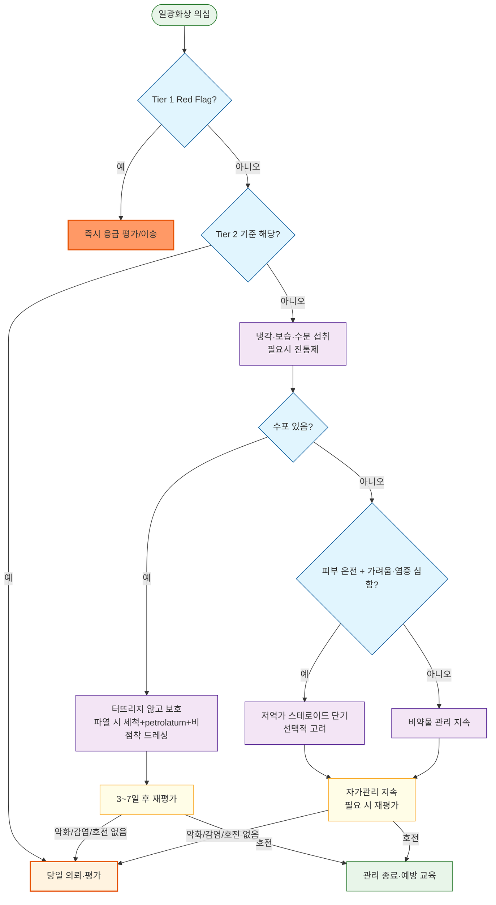

# 일광화상 Sunburn

## <mark style="color:green;">일반 사항</mark>

* 자연광 또는 태닝기기 등 인공 자외선에 과도하게 노출되어 발생하는 급성 피부 손상 및 염증 반응
* 기전 : 자외선에 의한 각질형성세포의 DNA 손상과 이에 따른 염증매개물질 방출
* 분류 : 표재성 화상(홍반 위주) - 표재성 부분층 화상(수포 동반)
* 경과 : 대부분 경증은 자연 치유되며, 치료 목적은 통증·열감·가려움 완화와 탈수·감염 등 합병증 예방이다. 이미 발생한 자외선 DNA 손상을 되돌리거나 치유기간을 확실히 단축하는 치료는 없다.
* 합병증 : 반복·누적된 자외선 노출은 광노화, 일광탄력섬유증(solar elastosis), 광선각화증, 편평세포암·기저세포암 및 흑색종 위험 증가와 관련된다.
* 모든 피부색에서 발생할 수 있다. 피부색이 짙으면 홍반이 뚜렷하지 않을 수 있으므로 열감·압통·부종·수포를 함께 평가한다.

#### <mark style="color:$primary;">자외선의 종류와 특성</mark>

* UVB(290\~320 nm) : 지표면 자외선의 약 5%를 차지하며 일반 유리창에 대부분 차단된다. 비타민 D 합성에 관여하며 **일광화상의 주된 원인**이고, 색소침착과 피부암에도 관여한다.
* UVA(320\~400 nm) : 지표면 자외선의 약 95%를 차지하며 구름과 일반 유리창을 상당 부분 통과한다. 즉시형 색소침착, 광노화, 광과민반응 및 피부암에 주로 관여하며, 일광화상에 대한 기여는 UVB보다 작고 주로 고용량 노출에서만 나타난다.
  * UVA2(320\~340 nm)는 UVA의 약 1/4을 차지하며 UVB와 일부 생물학적 작용이 겹친다.
* UVC(100\~290 nm) : 대기와 오존층에 대부분 흡수되어 자연 상태에서는 지표면에 거의 도달하지 않는다.

## <mark style="color:green;">원인 및 위험 인자</mark>

* 밝은 피부색, 쉽게 타는 피부, 밝은 머리색·눈동자색
* 정오 무렵, 낮은 위도, 높은 고도, 봄·여름철, 장시간 야외 활동
* 눈·물·모래·밝은 건물 표면 등에 의한 자외선 반사
* 태닝기기 등 인공 자외선 노출
* 광과민 약물 사용
  * 예 : tetracycline계(특히 doxycycline), fluoroquinolone계, sulfonamide계, thiazide·loop 이뇨제, amiodarone, phenothiazine계, 일부 NSAID, voriconazole, retinoid 및 일부 항암제
  * 약물별 광과민 위험은 다르다. 새로 시작한 약물과 증상 발생 시점, 햇빛 노출 부위의 분포를 확인하며 환자가 임의로 약을 중단하지 않도록 한다.

## <mark style="color:green;">임상 양상</mark>

### <mark style="color:orange;">국소 증상</mark>

* 경증 : 노출 부위의 경계가 비교적 명확한 홍반, 열감, 압통·통증, 건조감
* 심한 표재성 부분층 화상 : 현저한 부종과 수포
* 보통 노출 수 시간 후 증상이 나타나 12\~24시간에 가장 심하고, 3\~5일에 걸쳐 완화되면서 인설과 피부 벗겨짐이 나타날 수 있다.
* 경증은 대개 흉터 없이 회복한다. 광범위한 수포, 이차감염 또는 반복적인 피부 손상이 있으면 색소침착이 오래 지속되거나 드물게 흉터가 남을 수 있다.

### <mark style="color:orange;">전신 증상</mark>

* 광범위하거나 심한 일광화상에서는 오한, 발열, 두통, 피로, 구역·구토, 어지럼 및 탈수가 동반될 수 있다.
* 의식 변화, 실신, 경련, 고체온, 저혈압 등이 있으면 일광화상 자체로만 판단하지 말고 열사병 등 열질환을 즉시 평가한다.

### <mark style="color:orange;">지연 멜라닌 형성 Delayed melanogenesis</mark>

* 자외선 노출 후 멜라닌 생성과 표피 내 이동이 증가하면서 보통 2\~3일 후 피부색이 짙어지고 수 주간 지속될 수 있다.
* 이는 자외선 손상 후 나타나는 방어반응이다. 후속 자외선에 대한 보호 효과는 제한적이며, 탄 피부를 건강하거나 안전한 자외선 노출의 지표로 해석해서는 안 된다.

### <mark style="color:$danger;">🚩 Red Flags!</mark>

<mark style="color:$danger;">**즉각 조치 또는 의뢰**</mark> <mark style="color:$danger;">(Tier 1)</mark>

* 의식 변화, 실신, 경련, 심한 혼돈
* 열사병 의심 : 고체온과 중추신경계 이상 동반
* 저혈압·쇼크 징후, 심한 탈수, 핍뇨 또는 지속되는 구토로 수분 섭취 불가
* 시력저하 또는 심한 안구통 동반(각막 손상·중증 광각막염 등 안과 응급 의심) - 긴급 안과 평가
* 호흡곤란, 얼굴·기도의 현저한 부종 등 다른 응급질환 동반 의심

<mark style="color:$warning;">**당일 또는 조기 의뢰**</mark> <mark style="color:$warning;">(Tier 2)</mark>

* 수포를 동반한 부분층 화상이 총체표면적(TBSA) ≥10% (단순 홍반만 있는 표재성 화상은 TBSA 산정에서 제외)
* 영유아 및 소아의 광범위한 일광화상 : 체온조절 미숙, 빠른 탈수 진행, 국소 처치의 어려움 등으로 TBSA 수치와 무관하게 의뢰 역치를 낮게 적용
* 얼굴·눈 주위, 손, 발, 생식기·회음부 또는 주요 관절을 침범한 심한 화상
* 광각막염 의심(눈 통증·이물감·눈부심·눈물) - 당일 안과 평가
* 조절되지 않는 심한 통증, 광범위한 부종·수포
* 발열·오한, 반복되는 구토, 현저한 두통·어지럼 등 유의한 전신 증상
* 고령자, 임신부, 면역저하자 또는 중증 심장·신장질환 환자의 광범위한 일광화상

<mark style="color:$info;">**외래 추적 / 추가 평가 계획**</mark> <mark style="color:$info;">- 즉각 위험 낮으나 호전 없으면 의뢰 (Tier 3)</mark>

* 통증·홍반·수포가 1주 이상 뚜렷하게 호전되지 않거나 악화되는 경우
* 색소침착이 수개월간 감소하지 않거나 비전형적인 색소·피부 병변이 지속되는 경우
* 농성 삼출, 악취, 국소 열감 증가 등 제한된 이차감염이 의심되면 기다리지 말고 신속히 외래 재평가한다. 주변 홍반 확대·심한 통증 증가·발열 등 진행성 또는 전신 감염 소견이 동반되면 Tier 2에 따라 당일 평가한다.

## <mark style="color:green;">진단</mark>

* 대부분 노출력과 임상 양상으로 진단한다.
* 노출 시간·시간대, 자외선지수, 태닝기기 사용, 고도·반사면, 자외선 차단 방법 및 광과민 약물을 확인한다.
* 수포가 있으면 표재성 부분층 화상으로 보고 범위와 부위를 평가한다. TBSA 산정에는 단순 홍반만 있는 표재성 화상을 포함하지 않는다.
* 광범위한 병변이나 전신 증상이 있으면 활력징후, 수분 상태, 소변량과 열질환 동반 여부를 평가한다. 임상적으로 필요하면 전해질·신기능·간기능·CK 등을 검사한다.
* 강한 자외선 노출 후 눈 통증·이물감·심한 눈부심·눈물 또는 시력저하가 있으면 광각막염(photokeratitis)을 의심하고 당일 안과 평가를 시행한다. 시력저하나 심한 통증이 있으면 긴급 평가한다.

### <mark style="color:orange;">감별 진단</mark>

<table><thead><tr><th width="170">질환</th><th>감별 단서</th></tr></thead><tbody><tr><td>광독성 약물반응</td><td>평소보다 적은 노출 후 심한 일광화상 유사 병변, 새 약물과의 시간적 연관, 노출 부위에 국한</td></tr><tr><td>광알레르기성 접촉피부염</td><td>가려움이 두드러지는 습진성 병변, 자외선 차단제·향료·외용제 사용력, 노출 경계를 넘어 퍼질 수 있음</td></tr><tr><td>다형광발진</td><td>봄·초여름 반복, 노출 수 시간\~수일 후 구진·판·소수포, 일광화상보다 가려움이 현저</td></tr><tr><td>피부홍반루푸스</td><td>지속되는 광과민성 발진, 원반모양 병변·관절통·구강궤양 등 동반 가능</td></tr><tr><td>접촉피부염</td><td>접촉 물질의 분포와 일치, 자외선 노출과 무관한 부위에도 발생 가능</td></tr><tr><td>열질환</td><td>고체온, 의식 변화, 실신, 저혈압, 심한 무력감·구토·근육증상; 피부 병변의 정도와 무관하게 응급 평가</td></tr></tbody></table>

***



<p align="center"><strong>일광화상 중증도 평가 및 치료 알고리듬</strong></p>

<p align="center"><em><mark style="color:$info;">Ref. American Burn Association 화상 의뢰 기준과 American Academy of Dermatology 환자 자가관리 자료를 참고하여 저자 정리</mark></em></p>

***

## <mark style="background-color:$warning;">Management</mark>

### <mark style="color:orange;">치료 방침</mark>

* 즉시 추가 자외선 노출을 중단하고 서늘한 장소로 이동한다.
* 통증·열감·가려움 완화, 수분 보충과 상처 보호를 중심으로 치료한다.
* 이미 발생한 피부 손상을 되돌리거나 치유기간을 확실히 단축하는 약물은 없다.
* 광범위한 수포, 탈수, 열질환 또는 이차감염이 있으면 각각의 중증도에 따라 치료·의뢰한다. (☞ [화상](206_-burn.md#management))

## <mark style="color:green;">비-약물 치료 및 예방</mark>

### <mark style="color:orange;">급성기 관리</mark>

* 시원한 물로 샤워하거나 차갑고 젖은 천을 10\~15분씩 반복 적용한다. 얼음을 피부에 직접 대지 않는다.
* 피부가 약간 젖어 있을 때 무향 보습제, 알로에 함유 보습제 또는 칼라민 로션을 바를 수 있다.
* 충분히 수분을 섭취한다. 심장·신장질환 등으로 수분 제한 중인 환자는 기존 지침을 따른다.
* 벗겨지는 피부를 억지로 뜯지 않는다.
* 온전한 수포는 터뜨리지 않는다.
* 수포가 저절로 파열되면 물과 순한 세정제로 부드럽게 씻고, 냉각 후 얇은 petrolatum과 비점착성 드레싱으로 보호한다.
* benzocaine·lidocaine 등 국소마취제는 자극성 또는 알레르기성 접촉피부염을 일으킬 수 있어 일률적으로 사용하지 않는다.

### <mark style="color:orange;">자외선 노출 예방</mark>

* 기상정보의 자외선지수(UVI)를 확인하고 UVI ≥3이면 복합적인 자외선 보호조치를 시행한다.
* 태양 정오 전후에는 노출을 줄이고 그늘을 이용한다. 구름이나 그늘도 산란·반사 자외선을 완전히 차단하지 못한다.
* 촘촘히 짜인 건조한 옷 또는 UPF 표시 의류, 얼굴·귀·목을 가리는 챙 넓은 모자, UV400 또는 UVA·UVB 99\~100% 차단 선글라스를 사용한다.
* 눈·물·모래 주변이나 높은 고도에서는 반사 자외선에 특히 주의한다.
* 태닝기기 사용을 피한다.
* 광과민 약물 복용 중이거나 광선각화증·피부암 병력이 있는 고위험 환자는 위 조치를 더 엄격히 적용한다.
* 자외선 차단제는 그늘·의복을 대신하는 수단이 아니라 노출된 피부를 보완하는 수단으로 사용하며, 더 오래 햇빛에 머물기 위한 목적으로 사용하지 않는다.

### <mark style="color:orange;">자외선 차단제 Sunscreen</mark>

#### <mark style="color:$primary;">SPF와 PA</mark>

* SPF(sun protection factor)는 자외선 차단제를 표준량인 2 ㎎/cm²로 도포한 피부와 도포하지 않은 피부에서 최소홍반을 유발하는 자외선 조사량(MED)의 비이며 주로 UVB 차단 성능을 나타낸다.
* SPF는 햇빛에 노출될 수 있는 안전한 시간의 배수를 뜻하지 않는다.
* PA(protection grade of UVA)는 UVA 차단 성능을 나타내며 국내에서는 PA+부터 PA++++까지 표시한다.
* 일반적으로 SPF ≥30이면서 PA+++ 이상인 광범위 자외선 차단제를 선택하고, 광과민질환·광과민 약물 사용 또는 강한 노출이 예상되면 PA++++ 제품을 우선 고려한다.

#### <mark style="color:$primary;">자외선 필터</mark>

* 유기 자외선 필터와 무기 자외선 필터 모두 주로 자외선을 흡수하고 일부는 반사·산란한다. 단순히 '화학적 흡수제'와 '물리적 반사제'로 이분하는 것은 실제 작용을 충분히 설명하지 못한다.
* 무기 필터에는 zinc oxide와 titanium dioxide가 있다. 대체로 자극·알레르기 위험이 낮지만 백탁이 생길 수 있다.
* 유기 필터는 성분별로 흡수 파장과 광안정성이 달라 여러 성분을 조합한다. PABA는 과거 사용되었으나 피부반응 등의 문제로 현재는 거의 사용하지 않는다.
* 개별 성분보다 국내 제품에 표시된 SPF·PA·내수성, 피부유형과 사용 목적을 기준으로 선택한다.

#### <mark style="color:$primary;">영유아</mark>

* 생후 6개월 미만은 직사광선을 피하고 그늘, 긴 옷과 챙 넓은 모자를 우선한다.
* 불가피하게 노출되는 작은 부위에 사용할 필요가 있으면 의사와 상의하고, 자외선 차단제로 표시된 제품을 소량 사용한다.
* 기저귀 발진 보호제 등 zinc oxide 함유 일반 외용제를 자외선 차단제 대신 사용하지 않는다.

#### <mark style="color:$primary;">도포량</mark>

* 표시된 차단 성능은 2 ㎎/cm²를 기준으로 한다. 적게 바르면 실제 차단 효과가 표시 SPF보다 현저히 낮아질 수 있다.
* 수영복을 입은 일반 성인의 전신에는 약 30\~35 ㎖가 필요하다.
* 7-teaspoon rule : 얼굴·목·귀 1 teaspoon, 각 팔 1 teaspoon, 각 다리 1 teaspoon, 몸통 앞·뒤 각 1 teaspoon

#### <mark style="color:$primary;">도포 방법</mark>

* 제품 표시사항에 따라 대개 외출 15\~30분 전에 노출 피부에 충분히 균일하게 바른다. 이는 진피까지 흡수되기 위한 시간이 아니라 피부 표면에 균일한 도포막이 형성되고 정착되도록 하기 위한 것이다.
* 야외에서는 약 2시간마다 다시 바르고, 수영·다량의 발한·수건 사용 후에는 즉시 다시 바른다.
* '내수성 40분 또는 80분'은 정해진 시험조건에서 해당 시간의 수중 노출 후 차단 성능을 평가했다는 뜻이며 waterproof를 의미하지 않는다.
* 귀, 코, 입술, 목 뒤, 손등, 발등, 머리숱이 적은 두피 등 빠뜨리기 쉬운 부위를 확인한다.
* 자극이나 습진성 발진이 생기면 사용을 중단하고 성분을 확인한다. 반복되거나 심하면 광알레르기성 접촉피부염을 평가한다.

## <mark style="color:green;">약물 치료</mark>

### <mark style="color:orange;">진통제</mark>

* 통증과 부종 완화를 위해 단기간 사용할 수 있으나 일광화상의 치유기간을 단축하지 않는다.
* ibuprofen 200\~400 ㎎ q6\~8hr PRN ; 자가복용 최대 1,200 ㎎/day, 처방 시에도 일광화상에는 가급적 2,400 ㎎/day를 넘지 않고 최소 유효 용량을 단기간 사용한다.
  * 탈수, 신장기능 저하, 소화성궤양·위장관 출혈, 항응고제 사용, 고령 및 임신 후기에는 피하거나 주의한다. 탈수·핍뇨가 있으면 NSAID 사용보다 수분 상태와 신기능 평가를 우선한다.
* dexibuprofen 300 ㎎ 정제 : 1회 300 ㎎, 1일 2\~4회, 최대 1,200 ㎎/day(성인 허가 용법). Dexibuprofen은 ibuprofen의 약리활성 S(+)-enantiomer이나 두 성분을 일정 비율로 단순 환산하지 않으며 제품별 허가 용량을 따른다.
* NSAID가 부적합하면 acetaminophen 500\~1,000 ㎎ q6\~8hr PRN을 고려한다. 일반 성인은 최대 3,000 ㎎/day를 원칙으로 하며, 간질환·과음·고령·저체중에서는 감량한다.
* 소아는 성분별로 용량 체계가 다르므로 구분하여 적용한다.
  * ibuprofen : 제품·제형별 허가연령과 체중별 용량을 확인하며, 통상 5\~10 ㎎/㎏/dose q6\~8hr를 기준으로 한다. 생후 6개월 미만, 탈수·구토·신장기능 저하가 의심되는 소아에서는 사용하지 않는다.
  * dexibuprofen 150 ㎎ 정제 : 6세 이상, 약 15 ㎎/㎏/day를 2\~4회 분할 투여하며, 체중 30 ㎏ 미만은 최대 300 ㎎/day. (300 ㎎ 정제는 성인 허가 용법만 제시되어 있어 소아에게 확대 적용하지 않는다.)
  * acetaminophen : 10\~15 ㎎/㎏ q4\~6hr(1일 최대 5회)를 기준으로 한다.
* 자외선 노출 전 NSAID를 예방적으로 복용하는 것은 홍반 감소 효과가 입증되지 않았고 부작용 위험만 더할 수 있어 권장하지 않는다.

### <mark style="color:orange;">국소 스테로이드</mark>

(☞ [국소스테로이드](../231_/211_-topical-corticosteroids.md))

* 자외선 노출 후 국소 스테로이드가 홍반이나 통증을 임상적으로 의미 있게 줄이거나 치유기간을 단축한다는 근거는 부족하므로 일광화상의 표준 치료제로 일반적으로 사용하지 않는다.
* 피부가 온전한 제한된 병변에서 가려움·염증이 심하면 저역가 제제를 짧게 고려할 수 있으나, 수포·미란·감염 부위에는 사용하지 않는다.

### <mark style="color:orange;">H1-항히스타민제</mark>

(☞ [항히스타민제](../231_/212_-antihistamines.md))

* 가려움이 심할 때 선택적으로 고려할 수 있으나 일광화상 자체의 경과를 단축하지 않는다.
* 주간에는 비진정성 제제를 우선 고려한다.
  * cetirizine 10 ㎎ qd <mark style="color:blue;">\[지르텍]</mark>
* 야간 수면을 방해하는 가려움에는 진정성 제제를 단기간 고려할 수 있다.
  * hydroxyzine 10\~25 ㎎ hs <mark style="color:blue;">\[아디팜]</mark>
* 1세대 항히스타민제는 졸림, 인지저하, 구갈·요폐 및 낙상 위험이 있으므로 운전·음주를 피하고 고령자에서는 가급적 사용하지 않는다.

### <mark style="color:orange;">수포 및 이차감염</mark>

(☞ [화상](206_-burn.md#management))

* 단순 수포 또는 수포 파열만으로 국소 항생제를 예방적으로 사용하지 않는다.
* 국소 농성 삼출 등 제한된 표재성 세균감염이 확인되면 임상 평가 후 mupirocin 2% bid\~tid를 5일 정도 고려할 수 있다. <mark style="color:blue;">\[에스로반]</mark>
* 주변 홍반 확대, 심한 통증 증가, 발열 등 연조직염이 의심되면 국소제만 사용하지 말고 전신 항생제와 당일 의뢰 필요성을 평가한다.
* silver sulfadiazine은 단순 일광화상이나 작은 표재성 수포의 기본 치료로 사용하지 않는다.

***

### <mark style="color:red;">질병코드</mark>

L55.0 1도 일광화상

L55.1 2도 일광화상

L55.2 3도 일광화상

L55.9 상세불명의 일광화상

* 표피와 진피 전층을 침범하는 전층(3도) 일광화상은 극히 드물다. 전층화상이 의심되면 면적과 관계없이 화상 전문진료를 의뢰한다.

***

## <mark style="color:purple;">처방례</mark>


다음은 성인의 예시 처방이다. 연령, 임신 여부, 간·신장 기능, 탈수, 위장관 출혈 위험과 병용약물을 확인하여 조정한다. 대부분의 경증 일광화상은 약물 없이 냉각·보습·수분 섭취만으로 관리할 수 있다.


> **처방례 1. 통증이 있는 경증 일광화상**
>
> ```
> 애니펜정 300 ㎎/T   9T   1T q8hr PRN, 1일 최대 3회, 최대 3일간
> ```
>
> _✽dexibuprofen 300 ㎎ 정제의 성인 허가 용법은 1회 300 ㎎, 1일 2\~4회(최대 1,200 ㎎/day)이며, 본 처방은 최대 복용 시 900 ㎎/day로 그 범위 내이다. Dexibuprofen은 ibuprofen의 약리활성 S(+)-enantiomer이나 두 성분을 일정 비율로 단순 환산하지 않는다. 탈수, 신장질환, 소화성궤양·위장관 출혈, 항응고제 사용 또는 임신 후기이면 피하고 acetaminophen 등 다른 진통제를 고려한다._

> **처방례 2. 가려움이 동반된 경우(선택적 처방)**
>
> ```
> 지르텍정 10 ㎎/T   3T   #1 qd, 3일간, 가려움 심할 때
> ```
>
> _✽항히스타민제는 모든 환자에게 필요하지 않으며 일광화상의 경과를 단축하지 않는다. 야간 가려움에는 hydroxyzine 10\~25 ㎎ hs로 대체할 수 있다._

> **처방례 3. 제한된 파열 수포에 표재성 세균감염이 확인된 경우**
>
> ```
> 에스로반연고 10 g/tube   환부에 bid\~tid, 5일간
> ```
>
> _✽생리식염수와 순한 세정제로 세척 후 도포하며, 단순 수포 파열만으로는 사용하지 않는다. 주변 홍반 확대·발열·통증 증가가 있으면 연조직염을 의심하고 전신 항생제 필요성과 당일 의뢰를 평가한다._

***

### <mark style="color:$success;">핵심 복약 지도</mark>

> **진통제 복용 시**
>
> * 통증이 있을 때만 필요한 기간 동안 복용하며, 탈수 상태에서 NSAID를 과량 복용하지 않습니다.
> * 신장질환, 위장관 출혈 위험, 임신 후기에는 NSAID 대신 acetaminophen 등 대체 진통제를 사용합니다.

> **항히스타민제 복용 시**
>
> * 복용 후 졸리면 운전하거나 술을 마시지 않습니다.
> * 모든 환자에게 필요한 약은 아니며 가려움이 심할 때만 사용하고, 일광화상 자체의 치유기간을 단축하지는 않습니다.

> **수포와 상처 관리**
>
> * 물집을 일부러 터뜨리지 말고, 저절로 터지면 물과 순한 세정제로 씻은 뒤 보호 드레싱을 유지합니다.
> * 항생제 연고는 감염 징후가 있을 때만 사용하며 임의로 반복 사용하지 않습니다.

> **국소 스테로이드 사용 시**
>
> * 모든 일광화상에 필요한 약이 아니며, 처방받은 부위와 기간(보통 며칠 이내)만 사용합니다.
> * 수포가 터졌거나 감염이 의심되는 부위에는 사용하지 않습니다.

> **언제 다시 병원을 방문해야 하나요?**
>
> * 의식이 흐려지거나, 고열·반복 구토·소변량 감소가 있는 경우 - 즉시 응급실
> * 물집이 넓게 생기거나 얼굴·눈·손·발·생식기 부위가 심하게 탄 경우 - 당일 진료
> * 강한 햇빛 노출 후 눈이 심하게 아프거나 잘 안 보이면 즉시, 이물감·눈부심·눈물이 있으면 당일 안과 진료
> * 호전되던 통증·발적이 다시 심해지거나 고름·악취가 생기는 경우 - 감염 가능성, 진료 필요
> * 통증·홍반·수포가 1주 이상 뚜렷하게 호전되지 않는 경우 - 재평가 필요

***

### <mark style="color:blue;">환자 안내서</mark>


**일광화상, 햇빛에 탄 피부를 식히고 보호하는 것이 우선입니다**

일광화상은 자외선에 오래 노출되어 피부가 붉어지거나 화끈거리고 아픈 상태입니다. 피부색이 짙으면 붉은 기운이 뚜렷하지 않을 수 있습니다. 대부분 며칠 안에 저절로 좋아지지만, 심하면 물집이 생기고 회복까지 1주 이상 걸릴 수 있습니다.


#### <mark style="color:$primary;">왜 일광화상이 생기나요?</mark>

* 햇빛(자외선)에 오래 노출되면 피부 세포가 손상되어 염증 반응이 일어납니다.
* 피부색이 밝을수록, 특정 약을 복용 중일수록 더 쉽게 발생합니다.

#### <mark style="color:$primary;">일상생활에서 어떻게 관리하나요?</mark>

* **시원한 샤워나 젖은 수건으로 피부를 식히십시오.** 얼음을 피부에 직접 대지 마십시오.
* **샤워 후 피부가 약간 젖어 있을 때 무향 보습제를 바르십시오.**
* **물을 충분히 드십시오.** 특히 넓은 부위가 탄 경우 탈수되기 쉽습니다.
* **물집은 터뜨리지 말고, 벗겨지는 피부를 억지로 떼지 마십시오.**
* 며칠간 추가 햇빛 노출을 피하고 외출 시 옷·모자로 가리십시오.

#### <mark style="color:$primary;">약은 어떻게 써야 하나요?</mark>

* 통증이 심하면 진통제를 필요한 기간만 복용합니다.
* 가려움이 심할 때만 항히스타민제를 고려하며, 졸릴 수 있는 약은 운전 전에 피합니다. 항히스타민제는 가려움을 줄일 뿐 일광화상이 낫는 기간 자체를 단축하지는 않습니다.
* 스테로이드나 항생제 연고는 의사가 처방한 경우에만, 처방받은 기간만 사용합니다.

#### <mark style="color:$primary;">즉시 또는 당일 진료가 필요한 경우</mark>

* 의식이 흐려짐, 실신, 고열, 반복되는 구토, 소변 감소 - 열사병 등 다른 응급 질환과의 감별이 필요할 수 있습니다.
* 물집이 넓게 생기거나 얼굴·눈·손·발·생식기 부위가 심하게 탄 경우 - 당일 진료
* 강한 햇빛에 노출된 후 눈이 심하게 아프거나 잘 안 보이면 즉시, 이물감·눈부심·눈물이 있으면 당일 안과 진료를 받으십시오.
* 호전되던 통증·붉은 기운이 다시 심해지거나 고름·악취가 생기는 경우

#### <mark style="color:$primary;">다음 외출부터는 이렇게 예방하세요</mark>

* 외출할 때는 그늘·긴 옷·모자·선글라스를 함께 이용하십시오.
* 노출된 피부에는 SPF 30 이상, PA+++ 이상의 자외선 차단제를 충분히 바르고 약 2시간마다 다시 바르십시오. SPF 숫자가 높다고 해서 그만큼 오래 햇빛에 있어도 된다는 뜻은 아닙니다.
* 자외선지수(UVI)가 3 이상이면 보호조치를 하십시오. 특히 태양이 가장 강한 정오 전후(대략 오전 10시\~오후 4시)에는 노출을 더욱 줄이십시오.
