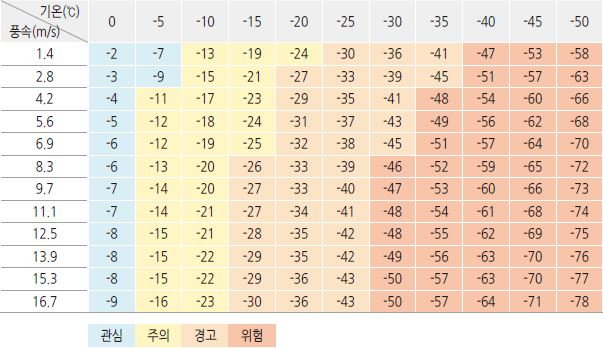

```mermaid
flowchart LR
    ROOT["동상 의심"] --> SYS["저체온증 또는<br/>중증 외상?"]
    SYS -->|예| SYS_TX["전신 응급상태를<br/>먼저 치료"]
    SYS -->|아니요| FROZEN["조직이 아직<br/>얼어 있는가?"]
    SYS_TX --> FROZEN

    FROZEN -->|아니요| PROTECT["재동결·외상 방지<br/>관류 및 깊이 평가"]
    FROZEN -->|예| REFREEZE["해동 후 재동결을<br/>막을 수 있는가?"]
    REFREEZE -->|아니요| TRANSFER["보호·고정 후<br/>신속히 이송"]
    REFREEZE -->|예| REWARM["37~39℃ 물에서<br/>신속 재가온"]
    TRANSFER --> PROTECT
    REWARM --> PROTECT

    PROTECT --> COMP["구획증후군<br/>의심 소견?"]
    COMP -->|아니요| SEV["해동 후 깊이"]
    COMP -->|예| PRESSURE["응급 외과평가·구획압 측정<br/>상승 시 즉시 감압술"]
    PRESSURE --> ADMIT["응급 입원·후속 관류평가"]
    SEV -->|표재성| SUPER["창상관리·진통<br/>24~48시간 내 재평가"]
    SEV -->|심재성| DEEP["즉시 전문센터 협의·신속 이송<br/>재관류 시간 창 확인"]
    DEEP --> PERF["관류영상 및<br/>tPA·iloprost 검토"]
    PERF --> FOLLOW["추적 관류평가<br/>지연 수술 계획"]

    classDef purple fill:#ECE6F2,stroke:#B8A7D4,stroke-width:1px;
    classDef yellow fill:#FBF6D9,stroke:#D6C785,stroke-width:1px;
    classDef blue fill:#E1ECF4,stroke:#A9C4D6,stroke-width:1px;
    classDef pink fill:#F5D6D6,stroke:#D99B9B,stroke-width:1px;
    classDef red fill:#FCE8E8,stroke:#E09E9E,stroke-width:1px;
    classDef cyan fill:#E1F2F7,stroke:#96C9D8,stroke-width:1px;

    class ROOT purple;
    class SYS,FROZEN,REFREEZE,SEV,COMP yellow;
    class SYS_TX,TRANSFER,REWARM,PROTECT,SUPER blue;
    class DEEP pink;
    class PRESSURE,ADMIT red;
    class PERF,FOLLOW cyan;
```

# 동상과 동창 Frostbite and Chilblains

이 챕터는 국소 냉손상 중 **동결성 냉손상인 동상(frostbite)**과 **비동결성 염증성 병변인 동창(pernio, chilblains)**을 다룬다. 저체온증이 동반되면 국소 병변보다 저체온증과 중증 외상을 먼저 평가·치료한다.

## ￭ 동상 Frostbite

## <mark style="color:green;">일반 사항</mark>

* 동상은 조직이 어는점 이하로 냉각되어 얼음 결정이 형성되고, 혈관수축·미세혈전·재관류 손상으로 조직손상이 발생하는 동결성 냉손상이다.
* Frostnip은 조직 내 얼음 결정이 형성되지 않는 가역적인 초기 냉손상이다. 무감각·이상감각·창백이 나타날 수 있으나 가온하면 빠르게 회복하며 영구적인 조직손실은 발생하지 않는다.
* 호발 부위 : 손가락, 발가락, 코, 귀, 뺨 등 말단부와 노출 부위
* 동상 깊이는 동결된 상태에서는 정확히 판단하기 어렵고, 원칙적으로 **해동 후 임상 소견과 필요시 관류영상**을 함께 평가한다.

### <mark style="color:orange;">동상 깊이 분류 [Wilderness Medical Society, 2024]</mark>

* 1도 : 무감각, 홍반, 창백하거나 황색의 단단하고 약간 융기된 판, 경한 부종; 표피 박리가 발생할 수 있으나 명백한 조직경색은 없음
* 2도 : 홍반과 부종으로 둘러싸인 투명하거나 유백색의 표재성 수포
* 3도 : 출혈성 수포; 손상이 망상진피와 진피 혈관총 아래까지 침범
* 4도 : 피부 전층과 피하조직을 지나 근육·힘줄·뼈까지 침범하는 괴사
* 현장에서는 다음과 같이 이분하여 판단할 수 있다.
  * 표재성 동상 : 1·2도; 예상 조직손실이 없거나 적음
  * 심재성 동상 : 3·4도; 조직손실이 예상되며 전문센터 평가가 필요함
* 같은 사지 안에서도 부위별 깊이가 다를 수 있다.

## <mark style="color:green;">원인 및 위험 인자</mark>

* 낮은 기온, 강한 바람, 높은 고도, 습기 및 젖은 의복·신발
* 장시간 노출, 부적절한 방한 장비, 움직임 제한, 조이는 의복·신발
* 탈진, 탈수, 영양 부족, 저산소증
* 음주, 흡연·nicotine, opioids·benzodiazepines 등 판단력이나 체온조절을 저해하는 물질
* 영아, 고령자, 노숙인, 인지·정신질환 또는 의사소통 장애가 있는 사람
* 레이노현상, 말초혈관질환, 당뇨병, 갑상선기능저하증, 말초신경병증
* 이전 동상 병력

## <mark style="color:green;">임상 양상</mark>

* 동결 중 : 차갑고 창백하거나 회백색이며 단단하고 무감각한 피부
* 해동 중 : 심한 통증, 발적 또는 자주색 변화, 부종
* 해동 후 : 투명·유백색 또는 출혈성 수포, 지속되는 감각저하, 청색증·검은 변색, 운동 제한
* 투명·유백색 수포는 주로 표재성 손상을, 출혈성 수포는 심재성 손상을 시사한다.
* 해동 후에도 지속되는 창백·청색증, Doppler 신호 감소 또는 맥박 소실은 심한 관류장애를 시사하므로 응급 혈관평가가 필요하다.

### <mark style="color:$danger;">🚩 Red Flags!</mark>

<mark style="color:$danger;">**즉각 조치 또는 응급실 이송**</mark>

* 저체온증 의심과 함께 의식저하, 저혈압, 호흡저하, 서맥 또는 부정맥이 있는 경우
* 중증 외상, 대량 출혈 또는 다른 생명 위협 손상이 동반된 경우
* 긴장된 구획, 심한 통증 또는 수동 신전 시 통증, 진행하는 감각·운동장애 등 구획증후군이 의심되는 경우
* 해동 후에도 심한 창백·청색증이 지속되거나 Doppler 신호 또는 맥박이 소실된 경우
* 감염된 괴사조직과 함께 저혈압·의식저하·빈호흡 등 패혈증이 의심되는 경우

<mark style="color:$warning;">**당일 응급실·화상/혈관 전문센터 평가**</mark>

* 출혈성 수포, 검은 변색 또는 근위부까지 침범한 심재성 동상
* 여러 손가락·발가락이 침범되었거나 손·발 전체에 가까운 손상
* tPA 또는 iloprost 치료 시간 창에 해당할 가능성이 있는 심재성 동상
* 심한 부종, 지속되는 감각·운동장애, 조절되지 않는 통증
* 개방창, 봉와직염, 농성 분비물 또는 전신 불안정이 없는 발열

<mark style="color:$info;">**외래 추적 / 추가 평가 계획**</mark> <mark style="color:$info;">- 즉각 위험 낮으나 호전 없으면 의뢰</mark>

* 해동 후 관류와 감각이 회복되고 조직손실 가능성이 낮은 표재성 동상
* 작은 투명 수포 또는 표피 박리만 있으면서 감염·진행성 허혈 소견이 없는 경우
* 초기에는 깊이가 과소평가될 수 있으므로 24\~48시간 내 재평가하고, 새 출혈성 수포·청색증·검은 변색·감각저하가 나타나면 즉시 상향 의뢰

## <mark style="color:green;">진단</mark>

* 병력 : 노출 시간, 기온·바람·습기, 고도, 의복·신발, 젖은 상태, 현장 가온 여부와 재동결 가능성, 음주·약물, 동반 외상
* 진찰 : 중심체온과 전신상태, 피부색·온도·경도·수포, 감각·운동기능, 모세혈관 재충만, Doppler를 포함한 관류 평가
* 경증 표재성 동상은 대개 별도 검사가 필요하지 않다.
* 중증·심재성 동상 또는 저체온증 동반 시 임상 상황에 따라 CBC, 전해질, 혈당, 신·간기능, CK, 요검사, 응고검사를 시행한다.
* tPA 고려 시 CBC, PT/INR, aPTT, fibrinogen, 혈액형검사와 출혈 위험평가가 필요하다.
* ECG : 저체온증, 흉통, 서맥·부정맥 또는 중증 전신상태에서 시행

### <mark style="color:orange;">영상검사</mark>

* 모든 수포나 청색증에 일률적으로 영상검사를 시행하지 않는다.
* 절단 위험이 있는 심재성 동상에서 재관류 치료를 고려할 때 가능하면 혈관조영술 등으로 관류장애를 확인하고 치료 경과를 감시한다. 혈관조영술이 불가능하면 기관별 프로토콜에 따라 정맥 tPA를 우선 고려하면서 다른 관류영상으로 보완할 수 있다.
* Tc-99m 골스캔, SPECT/CT 또는 MRA는 심재성 동상의 조직 생존성·예후 및 수술 범위를 평가하는 데 선택적으로 사용한다. 골스캔은 흔히 해동 후 Day 2 전후 시행하며, 반복검사의 필요성과 시점은 임상 경과와 기관 프로토콜에 따른다. Cauchy 원 연구에서는 1차 검사가 비정상인 경우 Day 8에 반복하였다.

#### <mark style="color:$primary;">Cauchy 4단계 임상 중증도 분류 (참고)</mark>

<table><thead><tr><th width="70" align="center">Grade</th><th width="220">해동 후 소견</th><th>예상 절단 위험</th></tr></thead><tbody><tr><td align="center">1</td><td>청색증 없음</td><td>없음</td></tr><tr><td align="center">2</td><td>원위지골(distal phalanx)까지 청색증</td><td>낮음(&lt;1%), 연부조직 손실 가능</td></tr><tr><td align="center">3</td><td>중간·근위지골까지 청색증</td><td>높음(23\~83%), 골 절단 가능</td></tr><tr><td align="center">4</td><td>수근골·족근골까지 청색증</td><td>매우 높음(약 99%), 광범위 절단</td></tr></tbody></table>

✽Cauchy 임상 등급은 신속 재가온 후 지속되는 병변·청색증의 근위부 범위를 기준으로 우선 판정한다. Day 2 전후의 Tc-99m 골스캔은 조직 생존성·예후와 수술 범위를 보완하는 검사이며, tPA·iloprost 결정을 위해 골스캔까지 기다리지 않는다. 절단위험 수치는 1985\~1999년 중증 동상 환자 70명을 대상으로 한 역사적 후향 코호트에서 산출된 범위로, 현대 재관류 치료 후 개인별 예후를 직접 나타내지는 않는다.

***



<p align="center"><strong>동상 초기 평가 및 치료 알고리듬</strong></p>

<p align="center"><em><mark style="color:$info;">Ref. Wilderness Medical Society Clinical Practice Guidelines for the Prevention and Treatment of Frostbite: 2024 Update</mark></em></p>

***

## <mark style="background-color:$warning;">Management</mark>

### <mark style="color:orange;">치료 방침</mark>

1. 저체온증과 중증 외상을 먼저 치료한다.
2. 따뜻하고 안전한 장소로 이동하고 젖은 의복·신발, 반지·시계 등 압박 물품을 제거한다.
3. 해동 후 다시 얼 가능성이 있으면 현장에서 적극적으로 해동하지 않는다. 이미 녹았다면 재동결과 추가 외상을 철저히 방지한다.
4. 재동결을 막을 수 있고 조직이 아직 얼어 있다면 37\~39℃의 순환하는 물에서 신속히 재가온한다.
5. 진통하고, 금기가 없으면 ibuprofen을 투여한다.
6. 문지르지 말고 공기 중에서 말리거나 가볍게 눌러 건조한다.
7. 수포를 평가하고 느슨하고 두꺼운 건조 드레싱을 적용한다. 알로에 겔·크림은 사용 가능한 경우 표재성 손상에서 보조적으로 고려한다.
8. 환부를 심장보다 높이고, 해동된 하지의 보행과 추가 압박·외상을 피한다.
9. 정상 혈액량을 유지하고 파상풍 예방접종 필요성을 평가한다.
10. 심재성 동상은 즉시 전문센터와 상의하여 관류영상, tPA 또는 iloprost 가능성을 검토한다.
11. 구획증후군·감염성 패혈증을 제외한 괴사조직 절제나 절단은 경계가 명확해질 때까지 지연한다.

## <mark style="color:green;">비-약물 치료 및 예방</mark>

### <mark style="color:orange;">가온·해동</mark>

* 조직이 이미 완전히 녹았다면 추가 온수 재가온은 도움이 되지 않는다. 이 경우 추가 외상·압박을 피하고 관류와 감염 징후를 감시하며, 수포 평가·거상·필요시 전문센터 의뢰 등 다음 단계로 진행한다.
* 아직 얼어 있고 재동결을 방지할 수 있다면 37\~39℃를 유지하는 물에 담가 피부가 붉거나 자주색으로 변하고 부드럽고 유연해질 때까지 재가온한다. 대개 약 30분이지만 깊이와 범위에 따라 달라질 수 있다.
* 물의 온도는 온도계로 지속적으로 확인하고 순환시킨다. 환부가 용기 바닥이나 벽, 열원에 직접 닿지 않게 한다.
* 온도계가 없으면 치료자의 정상 손을 30초 이상 담가 화상을 일으키지 않을 정도로 따뜻한지 확인한다.
* 귀·코처럼 담그기 어려운 부위는 같은 온도의 물에 적신 거즈를 반복 적용한다.
* 온수 재가온이 불가능하면 따뜻한 장소나 겨드랑이 등 인접 체온을 이용해 수동적으로 해동할 수 있다.
* 재가온수에 povidone-iodine 또는 chlorhexidine을 첨가하는 것은 이론적 이득만 있고 직접 근거가 없으므로 필수 조치로 권하지 않는다.

### <mark style="color:orange;">수포와 드레싱</mark>

* 현장에서는 수포를 일률적으로 제거하지 않는다.
* 이송 중 터질 위험이 큰 긴장성 투명 수포는 무균적으로 흡인할 수 있으나 근거는 제한적이다.
* 출혈성 수포는 심재성 손상을 시사하므로 현장에서 흡인하거나 제거하지 않는다.
* 병원에서는 투명·혼탁하거나 긴장된 수포를 선택적으로 흡인 또는 제거할 수 있다. 이미 벗겨진 수포에는 알로에와 무균 드레싱을 적용한다.
* 알로에 겔·크림은 표재성 손상에 보조적으로 고려하며, 드레싱 교환 시 또는 6시간마다 적용할 수 있으나 근거 수준은 낮다.
* 건조하고 두꺼운 거즈를 손가락·발가락 사이에도 대고, 부종을 고려하여 압박되지 않도록 느슨하게 감는다.

### <mark style="color:orange;">거상·보행 및 회피 사항</mark>

* 해동된 환부를 가능한 한 심장보다 높게 둔다.
* 최근 해동된 발은 가능한 한 딛지 않는다. 대피를 위해 보행이 불가피하면 충분히 패딩하고 부목으로 보호한다.
* 환부를 마사지하거나 문지르지 않는다.
* 난로, 불, 헤어드라이어, 뜨거운 핫팩 등 직접 열원을 사용하지 않는다.
* 차가운 피부에 얼음이나 냉찜질을 적용하지 않는다.

### <mark style="color:orange;">예방</mark>

* 적절한 수분과 영양을 섭취하고 몸통과 말단부를 함께 보온한다.
* 젖은 의복·양말은 즉시 갈아입고 바람과 외부 습기를 차단한다.
* 벙어리장갑, 방수 신발, 여러 겹의 헐렁한 옷을 착용하며 혈류를 방해하는 조이는 의복·신발은 피한다.
* 안쪽에는 땀을 배출하는 합성섬유, 중간층에는 보온 소재, 바깥층에는 방풍·방수 소재를 사용한다.
* 차가운 금속이나 ice pack을 피부에 직접 대지 않는다.
* 음주·흡연을 피하고 혈관질환·당뇨병 등 기저질환을 관리한다.
* 무감각, 동작 둔화, 창백은 경고증상이므로 즉시 따뜻한 장소로 이동한다.
* 추위에 노출되는 시간을 줄이고 규칙적으로 따뜻하고 건조한 장소에서 휴식한다. 과도한 운동으로 탈진하거나 땀에 젖지 않도록 한다.

#### <mark style="color:$primary;">체감온도 산출표 Wind chill chart</mark>

(Ref. 기상청)



## <mark style="color:green;">약물 치료</mark>

### <mark style="color:orange;">Ibuprofen</mark>

* Arachidonic acid 경로를 억제하여 손상성 prostaglandin과 thromboxane 생성을 줄일 것으로 기대하지만, 조직 보존 효과를 직접 입증한 임상 근거는 제한적이다.
* 총 12 ㎎/㎏/day를 2회로 나누어 복용하며, 최대 2,400 ㎎/day를 넘지 않는다.
* 상처가 치유되거나 수술할 때까지 사용하며 흔히 4\~6주가 소요될 수 있으나, 기간은 상처 상태와 위장관·신장·출혈 위험에 따라 개별화한다.
* 탈수, 신기능저하, 소화성궤양·위장관 출혈, 항응고제 병용 등 NSAID 금기·주의사항을 확인한다.

### <mark style="color:orange;">진통제</mark>

* 재가온 중 통증이 심할 수 있으므로 필요에 따라 acetaminophen 또는 opioid 진통제를 추가한다.
* Opioid 사용 시 호흡저하, 의식수준 및 동반 저체온증을 면밀히 감시한다.

### <mark style="color:orange;">파상풍 예방</mark>

* 예방접종력과 상처 상태에 따라 표준 파상풍 예방지침을 적용한다. (☞ [상처관리](202_-wound-care.md))

### <mark style="color:orange;">항생제</mark>

* 동상 자체에 예방적 항생제를 투여하지 않는다.
* 유의한 외상·오염된 개방창, 봉와직염, 농양, 감염된 괴사조직 또는 패혈증이 있을 때만 감염 형태와 중증도에 따라 치료한다. 가능하면 배양검사를 시행하고 (☞ [연조직염/봉와직염](169_-soft-tissue-infection-cellulitis.md)) 지침을 따른다.

### <mark style="color:orange;">재관류 치료</mark>

* **tPA** : 절단 위험이 있는 심재성 동상, 주로 Cauchy grade 3\~4에서 해동 후 24시간 이내, 가능하면 12시간 이내 전문센터에서 고려한다. 중증 외상, 최근 수술·뇌졸중 및 기타 출혈 위험을 평가하고 집중감시가 가능한 기관에서 시행한다.
* **Iloprost** : Cauchy grade 3\~4 심재성 동상에서는 해동 후 48시간 이내 가능한 한 빨리 1차 요법으로 고려하며, 최대 72시간까지 고려할 수 있다. Grade 2의 직접 근거는 불명확하지만, WMS 2024 최종 권고는 원위지절관절(DIP joint) 또는 그보다 근위부까지 침범한 심재성 동상(Cauchy grade 2\~4)에서 해동 후 최대 72시간 이내 사용을 제안한다(강한 권고, 낮은 근거 수준). 국내에서 동상 적응증으로 허가된 iloprost 제제는 없으며, 공개적으로 확인되는 국내 허가 품목은 폐동맥고혈압용 흡입제이다. 동상 치료에 필요한 정맥제의 국내 공급·희귀의약품 또는 개별 수입 가능성은 해당 기관과 관련 공급기관에 확인한다.
* Heparin을 동상 단독치료로 사용하지 않는다. tPA 프로토콜의 보조요법으로만 기관 지침에 따라 사용할 수 있다.

### <mark style="color:orange;">수술</mark>

* 구획증후군은 긴장된 구획, 진행하는 신경학적 이상 등을 평가하고 구획압 상승이 확인되면 즉시 근막절개술을 시행한다.
* 감염된 동상 조직으로 패혈증이 발생하면 긴급 절제·절단이 필요할 수 있다.
* 그 밖의 괴사조직 절제나 절단은 임상적 경계가 명확해질 때까지 지연한다. 완전한 경계 형성에는 1\~3개월이 걸릴 수 있으며, 임상 소견과 관류영상을 함께 이용해 수술 시기와 범위를 정한다.

### <mark style="color:orange;">장기 합병증</mark>

* 만성 통증·신경병성 통증, 감각저하 또는 과민, 한랭 과민, 발한 이상, 관절 구축·관절염, 손발톱 변형이 지속될 수 있다.
* 조기에 재활의학·수부외과·족부외과·통증의학 등 다학제 평가를 고려한다.

## ￭ 동창 Pernio, Chilblains

## <mark style="color:green;">일반 사항</mark>

* 동창은 습하고 얼지 않는 저온에 노출된 뒤 발생하는 말단부의 염증성·적청색 피부병변이다. 조직 동결이 발생하는 동상과 구별한다.
* 추위 노출 수시간 후 시작하여 24시간 이상 지속하며, 대개 따뜻하고 건조한 환경에서 1\~3주 내 자연 호전한다.
* 추운 계절이나 재노출 시 재발할 수 있다.
* 호발 부위 : 손가락·발가락, 귀, 코; 때로 종아리, 허벅지, 엉덩이 등 만성 노출 부위

## <mark style="color:green;">원인 및 위험 인자</mark>

* 추위에 대한 비정상적인 소혈관 반응으로 국소 조직 저산소증과 염증이 발생하는 것으로 추정한다.
* 습하고 추운 환경, 낮은 BMI, 젊은 여성, 흡연
* 2차성 동창 : SLE를 비롯한 결합조직질환, 항인지질증후군, cryoglobulinemia·한랭응집소, 혈액질환·단클론감마병증, 일부 감염·악성종양 또는 약물

## <mark style="color:green;">임상 양상</mark>

* 보통 양측성·대칭적으로 발생
* 가려움, 작열감, 통증 또는 압통
* 붉은색\~보라색의 부종성 반점, 구진, 판 또는 결절
* 심하면 수포, 미란 또는 궤양이 발생할 수 있다.

### <mark style="color:$danger;">🚩 Red Flags!</mark>

<mark style="color:$danger;">**즉각 응급평가**</mark>

* 급격히 진행하는 괴사·광범위 자반, 심한 허혈성 통증 또는 맥박 소실
* 발열·저혈압·의식저하 등 중증 감염이나 전신 혈관염이 의심되는 경우

<mark style="color:$warning;">**당일 또는 조기 전문의 평가**</mark>

* 궤양·출혈성 수포·반흔, 비대칭 또는 광범위 병변
* 따뜻한 계절에도 지속되거나 반복적·만성적이고 보온에 반응하지 않는 병변
* 고령에서 새로 발생하거나 전신 증상, 결합조직질환·혈액질환 소견이 동반된 경우

<mark style="color:$info;">**외래 치료 및 추적**</mark> <mark style="color:$info;">- 즉각 위험 낮으나 호전 없으면 의뢰</mark>

* 전형적인 계절성·대칭성 말단 병변으로 보온·건조 후 호전되는 경우
* 1\~3주 내 호전되지 않거나 재발이 잦으면 2차성 원인을 재평가

## <mark style="color:green;">진단</mark>

* 필수 기준 : 말단부의 국소 홍반과 부종이 24시간 이상 지속
* 다음 보조 기준 중 하나 이상이 진단을 지지한다.
  * 추운 계절에 발생하거나 악화
  * 조직학적으로 동창에 합당
  * 보온·건조 후 호전
* 전형적인 원발성 동창은 임상적으로 진단하며 모든 환자에게 일률적인 검사를 시행하지 않는다.
* 계절과 무관한 지속, 만성·불응성, 비대칭·광범위 병변, 궤양·괴사·반흔, 고령의 신규 발생 또는 전신 증상이 있으면 2차성 원인을 평가한다.
* 필요에 따라 CBC, ANA, complement, RF, antiphospholipid antibodies, serum protein electrophoresis, cold agglutinin, cryoglobulin 등을 선택한다. Chilblain lupus 등이 의심되면 피부 조직검사를 고려한다.

### <mark style="color:orange;">감별진단</mark>

<table><thead><tr><th width="110">질환</th><th width="160">병태생리</th><th width="180">전형적 노출 패턴</th><th>초기 치료 원칙</th></tr></thead><tbody><tr><td>동상</td><td>조직 동결(freezing)</td><td>조직이 어는 온도에 노출; 바람·습기·노출시간과 말초관류 상태에 따라 위험 증가</td><td>37\~39℃ 온수로 신속 재가온</td></tr><tr><td>동창</td><td>비동결성 염증(non-freezing)</td><td>습하고 얼지 않는 저온(&lt;15℃)에 반복 노출</td><td>서서히 부드럽게 보온·건조하고 직접 고열 회피</td></tr><tr><td>침수족·참호족</td><td>비동결성 허혈·신경손상</td><td>습하고 얼지 않는 저온에 장시간(수시간\~수일) 노출, 부동자세</td><td>실온에서 수동적 재가온·거상; 온수·forced air·heating pad를 이용한 적극적 재가온 금지</td></tr></tbody></table>

#### <mark style="color:$primary;">레이노현상 Raynaud phenomenon</mark>

* 추위 또는 감정 자극 후 경계가 분명한 창백·청색·발적이 발작적으로 나타나며 대개 수분\~수십 분 내 회복한다.
* 동창에서 보이는 24시간 이상 지속되는 부종성 구진·판·결절은 없다.

#### <mark style="color:$primary;">Acrocyanosis</mark>

* 대칭적이고 지속적인 청색 변색과 차가움이 특징이며 대개 통증이 없다.

#### <mark style="color:$primary;">Cold panniculitis</mark>

* 직접적인 추위 노출 후 피하지방이 많은 부위에 홍반성·경결성 판이 생기며 수주 내 호전할 수 있다.
* 영아·어린 소아의 뺨과 턱에 흔하며, 진단이 불명확하면 조직검사를 고려한다. 얼음 조각을 직접 접촉시키는 유발검사는 시행하지 않는다.

#### <mark style="color:$primary;">한랭두드러기 Cold urticaria</mark>

* 한랭 노출 직후 팽진과 가려움이 발생하고 비교적 빠르게 소실된다.
* 병력이 합당하면 적절한 감독하에 표준화된 냉자극검사를 고려하되, 광범위 냉노출은 전신반응을 유발할 수 있다.

#### <mark style="color:$primary;">Chilblain lupus 및 기타 혈관질환</mark>

* 따뜻한 계절에도 지속되는 병변, 궤양·반흔, 광과민·관절통 등은 chilblain lupus를 시사한다.
* Cryoglobulinemia, cryofibrinogenemia, 항인지질증후군, 혈관염은 자반·livedo·궤양·괴사를 유발할 수 있다.

#### <mark style="color:$primary;">침수족·참호족 Nonfreezing cold injury</mark>

* 습하고 얼지 않는 저온에 발이 장시간 노출된 뒤 무감각·부종이 발생하고, 노출 후 재가온 과정에서 심한 통증과 감각과민이 나타날 수 있다.
* 동상과 달리 따뜻한 물, forced air 또는 heating pad로 급속 재가온하지 않는다. 젖은 의복·신발을 제거한 뒤 실온에서 수동적으로 재가온하면서 건조·거상한다.

## <mark style="background-color:$warning;">Management</mark>

### <mark style="color:orange;">치료 방침</mark>

* 대부분 자연 호전하는 양성 경과이므로 예방·보온이 치료의 중심이며, 약물은 중증·지속성·재발성 사례에서 보조적으로만 고려한다.
* 2차성 원인이 확인되면 원인 질환 평가·치료를 병행한다.

## <mark style="color:green;">비-약물 치료 및 예방</mark>

* 차갑고 습한 환경을 피하고 피부를 따뜻하고 건조하게 유지한다.
* 직접적인 고열이나 급격한 국소 가열은 불편감과 혈관 반응을 악화시킬 수 있으므로 피하고, 피부를 서서히 부드럽게 가온한다. 마사지하거나 문지르지 않는다.
* 따뜻하고 건조한 의복·장갑·양말을 착용하고 실내도 따뜻하고 건조하게 유지한다.
* 금연하고 다른 혈관수축 물질을 줄인다.
* 긁지 않도록 교육하고, 수포·미란·궤양은 깨끗하게 유지하며 느슨한 드레싱을 적용한다.

### <mark style="color:orange;">예방</mark>

* 추위와 습기에 노출되지 않도록 하고 손·발·귀를 따뜻하고 건조하게 유지한다.
* 젖은 장갑·양말·신발은 즉시 교체하고 조이는 의복과 신발을 피한다.
* 규칙적인 활동으로 체온과 말초혈류를 유지하되 과도하게 땀을 흘리지 않는다.
* 금연하고 혈관수축 약물의 필요성을 검토한다.

## <mark style="color:green;">약물 치료</mark>

* 대부분 자연 호전하므로 예방·보온이 치료의 중심이다.
* 약물 효과에 대한 근거는 제한적이며, 중증·지속성 또는 재발성 특발성 동창에서만 고려한다.

### <mark style="color:orange;">Nifedipine</mark>

* 20\~60 ㎎/day 범위가 연구되었으나 결과가 일관되지는 않는다. 중증·지속성 또는 재발성 특발성 동창에서 선택적으로 고려한다.
* 동창 치료는 국내 허가 외 사용이다.
* 저혈압, 어지럼, 두통, 안면홍조, 빈맥 및 말초부종에 주의하고 치료 전후 혈압을 확인한다.

### <mark style="color:orange;">Pentoxifylline</mark>

* 일부 비교연구와 체계적 문헌고찰에서 효과가 보고되었으며 nifedipine이 부적합하거나 반응이 불충분한 중증·불응성 특발성 동창에서 고려할 수 있다.
* 동창 치료는 국내 허가 외 사용이며 위장관 불편, 어지럼, 두통과 출혈 위험을 확인한다.

### <mark style="color:orange;">국소치료와 가려움 관리</mark>

* 국소 스테로이드는 온전한 피부의 염증성 가려움을 단기간 완화할 목적으로 저\~중등도 역가 제제를 고려할 수 있다. 병변 치유를 촉진한다는 근거는 부족하며, 수포·미란·궤양 또는 감염 의심 부위에는 일률적으로 사용하지 않는다.
* 항히스타민제는 가려움 완화를 위해 필요할 때 사용할 수 있으나 병변의 자연경과를 단축하지 않는다.
* 2차 감염이 확인된 경우에만 감염 형태에 맞추어 항생제를 투여한다.

***

### <mark style="color:red;">질병코드</mark>

T33 표재성 동상

T34 조직괴사를 동반한 동상

T35 여러 신체 부위를 침범한 동상 및 상세불명의 동상

T69.1 동창

✽참고 : 습하고 얼지 않는 저온에 장시간 노출된 침수족·참호족은 T69.0으로 분류한다.

***

## <mark style="color:purple;">처방례</mark>

> **처방례 1.** 해동 후 표재성 동상 — 성인 약 60\~70 ㎏ 예시
>
> ```
> 부루펜정 400 ㎎/T  1T  bid
> ```
>
> _✽Ibuprofen 총 12 ㎎/㎏/day를 2회로 나누어(1회 400 ㎎ 기준 bid) 복용하는 원칙에 맞추어 체중별로 조정; 최대 2,400 ㎎/day. NSAID 금기와 신기능·탈수·출혈 위험 확인_\
> _✽수포·상처에는 느슨한 건조 드레싱을 적용하고, 항생제·국소 스테로이드는 일률적으로 처방하지 않음_\
> _✽24\~48시간 내 재평가; 심재성 동상 소견이 나타나면 즉시 전문센터 의뢰_

> **처방례 2.** 중증·지속성 또는 재발성 특발성 동창
>
> ```
> 아달라트오로스정 30 ㎎/T  1T  qd
> ```
>
> _✽동창에는 국내 허가 외 사용; 치료 전후 혈압, 어지럼·두통·안면홍조·말초부종 확인_\
> _✽보온·건조·금연이 우선이며, 병변 경과에 따라 지속 필요성을 재평가_

***

### <mark style="color:$success;">핵심 복약 지도</mark>

> **Ibuprofen 복용 (동상)**
>
> * 식후 정해진 용량으로 복용하고 임의로 증량하지 않는다.
> * 검은변·토혈, 심한 속쓰림, 소변량 감소가 생기면 즉시 중단하고 진료받는다.

> **Nifedipine 복용 (동창)**
>
> * 어지럼·실신감·심계항진 또는 심한 발목부종이 생기면 혈압을 확인하고 진료받는다.
> * 동창 적응증은 국내 허가 외 사용임을 설명한다.

> **항생제·국소 스테로이드**
>
> * 동상·동창 상처에 항생제나 국소 스테로이드를 임의로 사용하지 않는다.

> **언제 다시 병원을 방문해야 하나요?**
>
> * 해동 후 출혈성 수포, 검은 변색, 지속되는 감각저하나 청색증이 나타나는 경우
> * ibuprofen 복용 중 위장관 출혈 징후, 또는 nifedipine 복용 중 심한 저혈압·부종이 생기는 경우
> * 동창 병변이 따뜻한 계절에도 지속되거나 궤양·괴사로 진행하는 경우

***

### <mark style="color:blue;">환자 안내서</mark>


**동상, 언 손발은 조심히 녹여야 합니다**

동상은 추위에 피부와 조직이 얼어서 손상되는 것입니다. 다시 얼 가능성이 있으면 현장에서 억지로 녹이지 마십시오.


#### <mark style="color:$primary;">동상 응급처치는 어떻게 하나요?</mark>

* 반지·시계·젖은 장갑·신발을 제거하고 **환부를 문지르거나 마사지하지 마십시오.**
* 난로, 불, 헤어드라이어, 핫팩을 피부에 직접 대지 마십시오.
* 안전하게 계속 따뜻하게 유지할 수 있다면 37\~39℃의 물에서 피부가 부드러워질 때까지 가온하십시오.
* 해동된 발로 걷지 말고 수포를 집에서 터뜨리지 마십시오.

#### <mark style="color:$primary;">이럴 때는 즉시 병원을 방문하세요</mark>

* 출혈성 수포, 검은 변색, 지속되는 무감각·청색증
* 심한 부종 또는 통증
* 여러 손발가락 또는 넓은 부위가 이환된 경우


**동창, 서서히 따뜻하게 하는 것이 중요합니다**

동창은 춥고 습한 환경에 오래 노출된 뒤 손발이 붉게 붓고 가려운 염증성 병변으로, 대부분 보온만으로 저절로 좋아집니다.


#### <mark style="color:$primary;">동창은 어떻게 관리하나요?</mark>

* 손발을 따뜻하고 건조하게 유지하되 **뜨거운 열원으로 급격히 가열하지 마십시오.**
* 젖은 양말·장갑을 즉시 갈아입고 금연하십시오.
* 가려워도 긁지 말고 수포·궤양 부위는 깨끗하게 유지하십시오.

#### <mark style="color:$primary;">이럴 때는 즉시 병원을 방문하세요</mark>

* 괴사, 심한 허혈성 통증·청색증이 생긴 경우
* 발열, 관절통 등 전신 증상이 동반되는 경우

#### <mark style="color:$primary;">당일 또는 가까운 시일 내 진료가 필요합니다</mark>

* 수포·궤양이 생긴 경우
* 한쪽에만 심하게 나타나거나 따뜻한 계절에도 지속되는 병변
