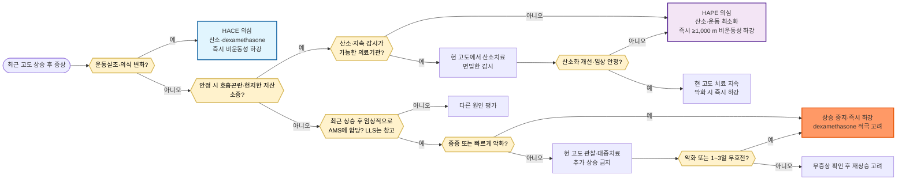

# 고소증 High Altitude Sickness (AMS/HACE/HAPE)

## <mark style="color:green;">일반 사항</mark>

* 고소증은 고도 상승에 따른 저산소성 환경에 충분히 순응하지 못해 발생하는 급성 고도질환이다.
* 급성 고산병(acute mountain sickness, AMS), 고소뇌부종(high-altitude cerebral edema, HACE), 고소폐부종(high-altitude pulmonary edema, HAPE)을 포함한다.
* 일반적으로 해발 2,500 m 이상에서 발생하지만 개인차가 크며 더 낮은 고도에서도 발생할 수 있다.
* 약 3,050 m에서 흡입 산소분압은 해수면의 약 69%이고, 급성 노출 시 산소포화도는 약 88\~91%까지 낮아질 수 있다.
* 저산소 스트레스는 도달 고도, 상승 속도, 수면 고도, 노출 기간 및 개인의 감수성에 영향을 받는다.
* 운동능력이나 평소 체력이 좋다고 고소증이 예방되는 것은 아니다. (WMS 2024)


조절된 고혈압·당뇨병·경증 만성폐질환 등이 AMS 자체의 독립 위험인자는 아닐 수 있지만, 고지대 여행의 안전성과는 별도 문제이다. 중증 폐질환, 비대상성 심부전, 불안정 협심증, 중증 폐고혈압, 고위험 임신 등은 여행 전 전문 평가가 필요하거나 고지대 여행을 피해야 한다.


## <mark style="color:green;">원인 및 위험 인자</mark>

### <mark style="color:orange;">주요 위험 결정요인</mark>

* 과거 고도질환의 종류와 중증도
* 첫날 수면 고도
* 해발 3,000 m 이상에서의 수면 고도 상승 속도
* 이전 고도 노출과 순응 상태
* 빠른 상승과 고지대 도착 직후의 격렬한 활동

낮은 고도 거주, 젊은 연령 및 과거 고소증 병력은 위험 증가와 연관될 수 있으나, 성별과 평소 체력은 예측력이 낮다. 기저 심폐질환은 AMS 위험인자 목록에 단순히 포함하기보다 고지대 여행의 안전성을 별도로 평가한다.

### <mark style="color:orange;">WMS 2024 위험도</mark>

다음 표는 해발 1,200 m 미만에서 출발하는 비순응 여행자를 가정한다(WMS 2024, Figure 1). 여러 항목이 해당하면 가장 오른쪽(가장 높은) 위험 범주를 적용한다. 과거 AMS 병력이 있어도 이번 여행에서 상승 속도를 늦추면 반드시 고위험은 아니며, 반대로 과거 문제가 없었어도 빠른 상승·고고도 목표는 위험을 높일 수 있다.

<table><thead><tr><th>평가 항목</th><th>낮은 위험</th><th>중등도 위험</th><th>높은 위험</th></tr></thead><tbody><tr><td>과거 고도질환</td><td>없음 또는 경증 AMS</td><td>중등도\~중증 AMS</td><td>HACE 또는 HAPE</td></tr><tr><td>첫날 수면 고도</td><td>&lt;2,800 m</td><td>2,800\~3,500 m</td><td>&gt;3,500 m</td></tr><tr><td>3,000 m 이상에서 수면 고도 상승</td><td>하루 ≤500 m이고 1,000 m 상승마다 적응일</td><td>하루 &gt;500 m이지만 1,000 m 상승마다 적응일</td><td>하루 &gt;500 m이고 적응일 없음</td></tr></tbody></table>

* 낮은 위험: acetazolamide 예방투여는 일반적으로 필요하지 않다.
* 중등도 위험: acetazolamide 예방투여를 고려한다.
* 높은 위험: acetazolamide 예방투여를 적극 권고하고, 응급용 dexamethasone 휴대를 고려한다.
* 매우 빠른 상승(예: 킬리만자로를 7일 미만에 등정)은 높은 위험으로 본다.

## <mark style="color:green;">임상 양상</mark>

### <mark style="color:orange;">정상 순응 반응</mark>

고도 상승 초기에는 호흡수 증가, 운동 시 호흡곤란, 다뇨, 수면 중 주기호흡 등이 나타날 수 있다. 수면장애와 말초부종은 고지대에서 흔하지만 그 자체만으로 AMS를 진단하지 않는다.

### <mark style="color:orange;">고소두통 High-altitude Headache</mark>

2,500 m 이상으로 상승한 뒤 새로 발생한 두통으로, 고도 상승과 시간적으로 관련되고 하강하면 호전된다. 흔히 다음 특징 중 2개 이상을 보인다.

* 양측성
* 경증\~중등도
* 활동, 움직임, 힘주기, 기침 또는 몸을 굽힐 때 악화

고소두통만 있고 AMS를 구성하는 다른 증상이 없을 수 있다.

### <mark style="color:orange;">급성 고산병 Acute Mountain Sickness, AMS</mark>

* 비순응 여행자가 일반적으로 2,500 m 이상으로 상승한 뒤 수시간\~3일 이내에 발생한다.
* 두통이 핵심 증상이며 식욕 저하, 구역·구토, 피로·쇠약, 어지럼이 동반된다.
* 전형적인 발현은 도착 또는 추가 상승 2\~12시간 후이며 첫날 밤이나 다음 날 아침에 흔하다.
* 추가 상승을 중지하면 대개 1\~3일 이내에 호전된다.
* 같은 고도에 3일 이상 머물렀고 추가 상승도 없는데 새로 시작한 증상은 AMS로 단정하지 않는다.

### <mark style="color:orange;">고소뇌부종 High-altitude Cerebral Edema, HACE</mark>

* HACE는 중증 AMS의 극단적인 형태로 볼 수 있으며 생명을 위협한다.
* 운동실조가 가장 이른 소견인 경우가 많다. 일직선 발꿈치-발가락 보행으로 확인할 수 있다.
* 심한 무기력, 무관심, 과민성, 판단력 저하, 혼돈, 졸림, 자기관리 불능 및 의식 저하가 나타날 수 있다.
* 국소 신경학적 결손이나 경련은 흔하지 않으므로 뇌졸중, 두개내 병변, 저나트륨혈증 등 다른 원인을 우선 감별한다.

### <mark style="color:orange;">고소폐부종 High-altitude Pulmonary Edema, HAPE</mark>

* 저산소성 폐혈관수축과 불균등한 폐동맥압 상승으로 발생하는 비심인성 폐부종이다.
* 초기에는 같은 고도의 다른 사람보다 심한 운동 시 호흡곤란, 운동능력 저하, 마른기침, 피로, 흉부 울혈감이 나타난다.
* 진행하면 가벼운 활동 또는 안정 시 호흡곤란, 수포음, 빈호흡, 빈맥, 청색증 및 분홍색 거품가래가 발생할 수 있다.
* 산소포화도가 같은 고도에서 예상되는 범위보다 현저히 낮으면 진단에 도움이 되지만, 저온·말초관류 저하와 80% 미만에서의 기기 정확도 저하를 고려한다.

### <mark style="color:$danger;">🚩 Red Flags!</mark>

<mark style="color:$danger;">**즉각 이송/응급 평가**</mark>

* 운동실조, 혼돈, 졸림, 자기관리 불능 또는 의식 저하 등 HACE 의심
* 안정 시 호흡곤란, 청색증, 현저한 저산소증, 분홍색 거품가래 등 HAPE 의심
* 중증 AMS 또는 빠르게 악화되는 AMS
* 환자가 스스로 안전하게 하강할 수 없는 상태

해당 소견이 있으면 산소를 투여하고 환자의 운동을 최소화하여 구조·이송을 요청한다. HACE나 중증 AMS 환자는 혼자 하강시키지 않는다.

<mark style="color:$warning;">**당일 의뢰 또는 긴급 평가**</mark>

* 중등도 증상, 반복 구토 또는 유의한 기능 저하
* 관찰 중 증상이 악화하거나 일상활동이 현저히 제한되는 경우
* 국소 신경학적 결손, 발열, 흉통 또는 편측성 폐소견 등 다른 중증 질환 가능성
* 중요한 심폐질환, 중증 OSA, 임신 또는 기타 고위험 기저질환 동반

<mark style="color:$info;">**외래 추적 / 추가 평가 계획**</mark> <mark style="color:$info;">- 즉각 위험 낮으나 호전 없으면 의뢰</mark>

* 중증 소견이나 HACE·HAPE가 없는 경증\~중등도 AMS
* 추가 상승을 중지하고 동행자가 면밀히 관찰할 수 있으며 하강 계획이 확보된 경우

관찰 중 언제든 악화하면 즉시 하강하며, 적절한 치료에도 1\~3일 이내 호전되지 않으면 하강한다.

## <mark style="color:green;">진단</mark>

### <mark style="color:orange;">2018 Lake Louise AMS Score</mark>

최근 고도 상승 후 두통을 포함한 4개 자가보고 증상을 각각 0\~3점으로 평가한다. **총점 ≥3점이면서 두통 점수 ≥1점**이면 AMS에 합당하다. 임상 기능점수는 증상이 활동에 미치는 영향을 평가하는 별도 항목이며 0\~12점 총점에 포함하지 않는다.

<table><thead><tr><th>점수</th><th>두통</th><th>위장관 증상</th><th>피로·쇠약</th><th>어지럼</th></tr></thead><tbody><tr><td>0</td><td>없음</td><td>식욕 정상</td><td>없음</td><td>없음</td></tr><tr><td>1</td><td>경증</td><td>식욕 저하 또는 구역</td><td>경증</td><td>경증</td></tr><tr><td>2</td><td>중등도</td><td>중등도 구역 또는 구토</td><td>중등도</td><td>중등도</td></tr><tr><td>3</td><td>중증</td><td>중증 구역·구토로 활동 불가</td><td>중증으로 활동 불가</td><td>중증으로 활동 불가</td></tr></tbody></table>

<table><thead><tr><th>분류</th><th>Lake Louise 점수</th><th>임상 소견</th></tr></thead><tbody><tr><td>경증 AMS</td><td>3\~5점</td><td>두통과 하나 이상의 동반 증상이 모두 경증</td></tr><tr><td>중등도\~중증 AMS</td><td>6\~12점</td><td>두통과 하나 이상의 동반 증상이 중등도\~중증</td></tr><tr><td>HACE</td><td>적용하지 않음</td><td>운동실조, 중증 무기력, 의식·정신상태 변화 또는 뇌병증</td></tr></tbody></table>


Lake Louise 점수는 원래 연구용으로 표준화된 자가보고 도구이다. 실제 임상에서 하강 여부는 점수만으로 정하지 않고 증상 강도, 기능 저하, 진행 양상, 하강 가능성 및 동반 HACE·HAPE 여부를 함께 판단한다.


### <mark style="color:orange;">감별 진단</mark>

<table><thead><tr><th width="130">주요 증상</th><th width="260">감별질환</th><th>감별 단서</th></tr></thead><tbody><tr><td>두통·구역·피로</td><td>편두통, 숙취, 탈수, 저나트륨혈증, 저혈당, 일산화탄소 중독, 약물중독, 감염</td><td>발열·근육통·콧물, 노출력, 수분 과다섭취, 혈당, 동행자의 동시 증상</td></tr><tr><td>운동실조·의식 변화</td><td>뇌졸중, 두부외상, 저체온증, 저혈당, 저나트륨혈증, 일산화탄소·약물중독</td><td>국소 신경학적 결손, 외상력, 체온, 혈당</td></tr><tr><td>호흡곤란·저산소증</td><td>폐렴, 천식·기관지연축, 폐색전증, 기흉, 심부전, 심근경색</td><td>발열, 국소 폐소견, 흉통, 심전도·영상검사, 기저질환</td></tr></tbody></table>

***



<p align="center"><strong>진단 및 치료 알고리듬</strong></p>

<p align="center"><em><mark style="color:$info;">Ref. Luks AM, et al. WMS Clinical Practice Guidelines for Acute Altitude Illness: 2024 Update. Wilderness Environ Med. 2024;35(1S):2S-19S.</mark></em></p>

***

## <mark style="background-color:$warning;">Management</mark>

### <mark style="color:orange;">공통 원칙</mark>

* 증상이 있는 동안 수면 고도를 더 높이지 않는다.
* HACE·HAPE 또는 중증 AMS에서는 약물 때문에 하강을 지연하지 않는다.
* 하강은 AMS/HACE의 가장 효과적인 치료이다. 증상이 소실될 때까지 하강하며, 대개 300\~1,000 m 하강하면 호전되지만 개인차가 있다.
* 산소는 고정 유량보다 증상 완화 또는 SpO₂ &gt;90%를 목표로 적정한다.
* 휴대용 고압백은 하강이 불가능하거나 지연되고 산소를 사용할 수 없을 때 고려하되, 필요한 하강을 지연시키지 않는다.
* 알코올, 오피오이드 및 호흡을 억제할 수 있는 진정제 사용을 피한다.

### <mark style="color:orange;">고소두통</mark>

* 추가 상승 중지, 휴식 및 수분 상태 평가
* Ibuprofen 400\~600 ㎎ q8h 필요시. 국내 제품별 함량과 최대 용량을 확인한다.
* Acetaminophen 500\~1,000 ㎎ q8h <mark style="color:blue;">\[타이레놀]</mark>
* 다른 AMS 증상이 동반되면 AMS로 평가한다.

### <mark style="color:orange;">급성 고산병 AMS</mark>

#### <mark style="color:$primary;">경증\~중등도이며 중증 소견이 없는 경우</mark>

* 추가 상승을 중지하고 현재 고도에서 휴식하며 면밀히 관찰한다.
* 두통에는 비오피오이드 진통제, 구역·구토에는 항구토제를 사용한다.
* 경증 AMS에는 acetazolamide와 dexamethasone이 일반적으로 필요하지 않다.
* 관찰 중 언제든 악화하거나 적절한 치료에도 1\~3일 이내 호전되지 않으면 하강한다.

#### <mark style="color:$primary;">중등도\~중증 AMS</mark>

* 하강을 적극 고려하며, 중증 AMS는 대기 없이 즉시 하강한다.
* Dexamethasone 4 ㎎ PO/IM/IV q6h <mark style="color:blue;">\[덱사메타손]</mark>
* Acetazolamide 250 ㎎ PO q12h <mark style="color:blue;">\[아세타졸]</mark>: dexamethasone과 함께 또는 dexamethasone을 사용할 수 없을 때 고려한다.
* 산소를 사용할 수 있으면 SpO₂ &gt;90% 또는 증상 완화를 목표로 투여한다.
* Dexamethasone은 순응을 촉진하지 않는다. 약을 중단한 상태에서도 무증상일 때만 재상승한다.

### <mark style="color:orange;">고소뇌부종 HACE</mark>

* 산소를 투여하고 환자의 운동을 최소화하여 즉시 하강한다. 혼자 하강시키지 않는다.
* Dexamethasone 8 ㎎ PO/IM/IV 1회 후 4 ㎎ q6h
* Acetazolamide 250 ㎎ q12h는 dexamethasone의 보조요법으로 고려할 수 있으나, dexamethasone이 주 치료약이다.
* 하강이 불가능하거나 지연되면 산소 또는 휴대용 고압백을 사용한다.

### <mark style="color:orange;">고소폐부종 HAPE</mark>

#### <mark style="color:$primary;">원격·야외 환경</mark>

* 산소를 투여하면서 운동을 최소화하여 즉시 최소 1,000 m 또는 증상이 소실되는 고도까지 하강한다.
* 환자가 짐을 지거나 걸어서 무리하게 하강하지 않도록 차량, 헬기 또는 동물 운송 등을 활용한다.
* 하강이 불가능하거나 지연되면 산소 또는 휴대용 고압백을 지속한다.

#### <mark style="color:$primary;">산소와 면밀한 감시가 가능한 의료기관</mark>

* 현재 고도에서 산소만으로 치료할 수 있다.
* 산소화가 개선되지 않거나, SpO₂ &gt;90%를 달성했음에도 임상 상태가 악화되거나, 적절한 치료에 반응하지 않으면 하강한다.

#### <mark style="color:$primary;">제한적 약물치료</mark>

* Nifedipine ER 30 ㎎ q12h 또는 ER 20 ㎎ q8h: 하강이 불가능하거나 지연되고, 신뢰할 수 있는 산소 또는 휴대용 고압백도 사용할 수 없을 때 사용한다.
* Tadalafil 10 ㎎ q12h 또는 sildenafil 50 ㎎ q8h: 위 조건에 더해 nifedipine도 사용할 수 없을 때만 고려한다.
* <mark style="color:red;">Nifedipine과 tadalafil 또는 sildenafil을 병용하지 않는다. 저혈압 위험이 있다.</mark>
* 즉시방출 nifedipine 10 ㎎ 부하용량은 전신 저혈압 위험 때문에 사용하지 않는다.
* 이뇨제와 acetazolamide는 HAPE 치료에 사용하지 않는다.
* 단독 HAPE 치료에서 dexamethasone의 효과는 확립되지 않았다.

### <mark style="color:orange;">HAPE와 HACE 병발</mark>

* 산소를 투여하고 즉시 하강한다.
* 산소화가 개선된 뒤에도 신경학적 기능 이상이 빠르게 해소되지 않으면 HACE로 보고 dexamethasone 8 ㎎ 1회 후 4 ㎎ q6h를 추가한다.
* 폐혈관확장제를 사용하면 전신 저혈압에 주의한다. 저혈압으로 인한 뇌관류압 저하 우려가 있으면 nifedipine보다 sildenafil·tadalafil을 우선 고려할 수 있다.
* 이 선택을 뒷받침하는 nifedipine과 PDE-5 억제제의 직접 비교 임상시험은 없다.

### <mark style="color:orange;">재상승 기준</mark>

* AMS: 무증상일 때만 재상승한다. 재상승 시에는 예방 용량의 acetazolamide 사용을 고려한다.
* HACE: 같은 여행에서의 재상승에 관한 자료가 부족하므로 피하는 것이 신중하다.
* HAPE: 안정 시·경도 운동 시 산소포화도가 산소·혈관확장제 없이도 안정적으로 유지되고 완전히 무증상일 때만 재상승을 고려한다. 재상승 시 nifedipine 등 혈관확장제 재개를 고려할 수 있다.

## <mark style="color:green;">비-약물 치료 및 예방</mark>

* 가능하면 낮은 고도에서 하루 만에 2,800 m 이상의 수면 고도로 직접 이동하지 않는다.
* 3,000 m 이상에서는 수면 고도를 하루 500 m 이하로 올리고 3\~4일마다, 또는 약 1,000 m 상승할 때마다 수면 고도를 높이지 않는 적응일을 둔다.
* 지형상 하루 상승 폭이 클 수밖에 없으면 그 전후에 적응일을 추가한다.
* 여행 전 14일 이내에 2,750 m 이상의 고도에서 2박 이상 노출되면 도움이 될 수 있으며, 여행 시점과 가까울수록 좋다.
* 고지대 도착 후 처음 48시간은 가벼운 활동만 하고 과도한 음주를 피한다.
* 평소 카페인을 규칙적으로 섭취한 사람은 갑작스럽게 중단하지 않는다. 금단 두통이 고소두통과 혼동될 수 있다.
* 강제적인 과다수분 섭취는 AMS를 예방하지 않으며 저나트륨혈증을 유발할 수 있다. 갈증과 활동량에 맞춰 섭취한다.
* 증상이 나타나면 즉시 추가 상승을 중지한다.

## <mark style="color:green;">약물 치료</mark>


아래 고도질환 관련 약물 용법 중 일부는 국내 허가사항에 포함되지 않는 허가 외 사용이다. 특히 acetazolamide의 AMS/HACE 예방·치료, nifedipine·tadalafil·sildenafil의 HAPE 예방·치료 및 dexamethasone의 고도질환 관련 용법은 처방 전 최신 국내 허가사항, 금기, 제품 제형 및 급여 여부를 별도로 확인한다. WMS 근거 용법과 국내 허가·급여 기준은 같은 개념이 아니다.


### <mark style="color:orange;">AMS/HACE 예방 약물</mark>

<table><thead><tr><th width="140">약물</th><th width="230">용량</th><th>위치와 주의사항</th></tr></thead><tbody><tr><td>Acetazolamide</td><td>125 ㎎ q12h<br>고위험 상승 일정에서는 250 ㎎ q12h 고려<br>소아 1.25 ㎎/㎏ q12h, 1회 최대 125 ㎎</td><td>1차 선택. 상승 전날 밤부터 시작하며 당일 시작해도 효과가 있다. 순응을 촉진한다.</td></tr><tr><td>Dexamethasone</td><td>2 ㎎ q6h 또는 4 ㎎ q12h</td><td>Acetazolamide를 사용할 수 없는 중등도\~고위험 성인의 대안. 순응을 촉진하지 않으며 소아 예방에는 권고하지 않는다.</td></tr><tr><td>Ibuprofen</td><td>600 ㎎ q8h</td><td>Acetazolamide·dexamethasone을 원하지 않거나 사용할 수 없는 경우의 2차 대안. 장기간 사용의 신장·위장관 안전성은 불명확하다.</td></tr></tbody></table>

* 목표 고도에 머무는 경우 권장 속도로 상승했다면 도착 후 2일, 더 빠르게 상승했다면 2\~4일간 지속한다. 계속 상승하면 투여를 연장한다.
* 목표 고도에 도달한 뒤 즉시 하강을 시작하면 하강 시점에 중단할 수 있다.
* Acetazolamide 125 ㎎ 취침 전 1회는 표준 예방요법이 아니므로 125 ㎎ q12h로 처방한다.
* Dexamethasone을 5\~7일 이내 사용하면 일반적으로 감량이 필요하지 않지만, 더 오래 사용하면 부신억제 위험을 고려해 감량할 수 있다.

### <mark style="color:orange;">HAPE 예방 약물</mark>

약물 예방은 HAPE 병력이 있는 감수성 환자, 특히 반복 병력자에게 제한한다. 점진적 상승이 우선이다.

<table><thead><tr><th width="80">우선순위</th><th width="120">약물</th><th>용량과 조건</th></tr></thead><tbody><tr><td>1차</td><td>Nifedipine</td><td>ER 30 ㎎ q12h 또는 ER 20 ㎎ q8h</td></tr><tr><td>2차</td><td>Tadalafil</td><td>10 ㎎ q12h. Nifedipine을 사용할 수 없는 경우</td></tr><tr><td>대안</td><td>Sildenafil</td><td>50 ㎎ q8h. WMS 용량표에 제시된 대안이지만 독립적인 예방 권고와 직접 근거가 제한적이며, tadalafil과 동등한 우선순위로 보지 않는다.</td></tr><tr><td>3차</td><td>Dexamethasone</td><td>8 ㎎ q12h. Nifedipine과 tadalafil을 모두 사용할 수 없는 HAPE 감수성 성인에게 제한적으로 고려</td></tr></tbody></table>

* 등반 전날 시작한다. 목표 고도에 머물면 권장 속도 상승 시 도착 후 4일, 더 빠른 상승 시 4\~7일간 지속한다. 하강을 시작하면 중단할 수 있다.
* HAPE 예방에서 dexamethasone 8 ㎎ q12h는 단일 소규모 연구에서 사용된 용량이다. 기전이 불명확하고 임상 경험이 매우 제한적이며 근거 수준이 낮다.
* 소아의 dexamethasone 예방투여는 권고되지 않으며 HAPE 예방 용량도 확립되지 않았다.
* 일반 HAPE 병력자에게 acetazolamide를 HAPE 예방 목적으로 사용하지 않는다.
* Re-entry HAPE, 즉 고지대 거주자가 저지대에 체류한 뒤 거주지로 빠르게 재상승할 때 HAPE가 발생한 병력이 있는 경우에만 acetazolamide 예방을 고려할 수 있다.
* Salmeterol과 흡입 budesonide는 고도질환 예방에 사용하지 않는다.

### <mark style="color:orange;">Acetazolamide 복약 주의</mark>

* 작용: 중탄산뇨와 대사성 산증을 유발하여 환기를 촉진하고 특히 수면 중 산소화를 개선한다.
* 흔한 이상반응: 손발·입 주위 감각이상, 빈뇨, 탄산음료 미각 변화, 구역, 졸림
* 중증 신·간기능장애, 간경변, 저나트륨혈증·저칼륨혈증, 고염소성 산증에서는 금기 또는 사용을 피한다.
* 고용량 aspirin 병용 시 중증 대사성 산증과 중추신경계 독성 위험이 있어 주의한다.
* Penicillin 알레르기는 acetazolamide 금기와 무관하다.
* 비항균 sulfonamide인 acetazolamide와 sulfonamide 항균제 사이의 교차과민반응 위험은 매우 낮다. 다만 sulfonamide에 의한 아나필락시스 또는 Stevens–Johnson syndrome 병력이 있으면 사용하지 않는다. 국내 제품 첨부문서가 더 보수적일 수 있으므로 허가사항을 함께 확인한다.

## <mark style="color:green;">특수 상황</mark>

* 소아: 성인과 유사하게 고소증이 발생한다. 말을 못 하는 영유아에서는 식욕 저하, 보챔, 창백 및 활동 감소를 관찰한다. Acetazolamide 예방 1.25 ㎎/㎏ q12h(1회 최대 125 ㎎), AMS 치료 2.5 ㎎/㎏ q12h(1회 최대 250 ㎎); Dexamethasone은 예방 목적으로 사용하지 않으며 치료 시 0.15 ㎎/㎏ q6h(1회 최대 4 ㎎)를 사용한다. Nifedipine의 소아 용량은 확립되어 있지 않다.
* 임신: 저위험 임신이라도 여행 전 산과 평가가 필요하다. 일반적으로 임신 중 수면 고도 3,050 m 초과 체류는 피하도록 권고할 수 있다.
* 당뇨병: 혈당을 자주 측정하고 케톤산증과 AMS를 감별한다. 일부 혈당측정기는 고도에서 정확도가 낮아질 수 있다.
* OSA: 중증 OSA는 CPAP만으로 부족할 수 있으며 추가 산소가 필요할 수 있으므로 여행 전 평가한다.
* 심폐질환: 불안정 협심증, 비대상성 심부전, 중증 폐질환, 중증 폐고혈압 등은 고지대 여행을 피하거나 전문 평가 후 결정한다.
* 고령자: 나이 자체가 AMS 위험을 높이는 것은 아니지만, 동반 심폐질환·다약제 복용·낙상 위험 때문에 여행 전 평가가 특히 중요하다. 이뇨제·베타차단제 등이 탈수·기립성 저혈압과 겹치지 않는지 확인한다.
* COVID-19 병력자: 감염 또는 퇴원 후 2주 이상 지속되는 증상이 있거나 중환자실 치료·심근염·혈전색전증 병력이 있으면 여행 전 평가(안정 시·활동 시 산소포화도, 폐기능검사, 흉부 X선, 심전도, BNP, 고감도 트로포닌, 심초음파)를 고려한다. 저산소혈증과 흉부 X선 이상이 함께 있으면 흉부 CT를, 고감도 트로포닌 상승 또는 심초음파 이상이 있으면 심장 MRI를 고려한다. 현저한 운동 제한이 있거나 격렬한 활동을 계획하면 심폐운동부하검사를 추가할 수 있다. (WMS 2024)
* 항공여행: 상용 항공기 객실 고도(대개 1,500\~2,400 m 상당)는 등반·트레킹의 고지대 노출과 원인·양상이 다르다. 심혈관질환자의 비행 가능 시점 등은 별도의 최신 항공의학 기준에 따라 평가한다.

***

### <mark style="color:red;">질병코드</mark>

T70.2 고지의 기타 및 상세불명의 영향

***

## <mark style="color:purple;">처방례</mark>


아래 처방은 성인 예시이다. 고도질환 관련 acetazolamide, nifedipine, tadalafil, sildenafil 및 dexamethasone 용법 중 일부는 국내 허가사항에 포함되지 않는 허가 외 사용이다. 실제 처방은 고도 상승 일정, 중증도, 체중, 신·간기능, 전해질, 병용약물, 제품 제형, 최신 국내 허가사항 및 보험 기준을 확인하여 조정한다. 약물은 필요한 하강을 대신하지 않는다.


> **처방례 1.** 고소두통
>
> ```
> 부루펜정 400 ㎎/T  1T tid  필요시, 단기간
> ※ 또는 타이레놀 500 ㎎/T  1~2T tid  필요시
> ※ 다른 AMS 증상이 동반되면 처방례 2로 전환
> ```

> **처방례 2.** 중등도\~중증 AMS
>
> ```
> 아세타졸 250 ㎎/T  1T bid
> 덱사메타손 정 0.5 ㎎/T  8T qid
> ※ 덱사메타손 1회 용량은 정제 8정(0.5 ㎎ × 8 = 4 ㎎)을 한 번에 복용합니다.
> ※ 정제 복용이 어려운 경우 의료진에 의한 표준 IM/IV 주사(덱타손 주 등)로 대체 가능; 주사제의 경구 음용은 권장하지 않음
> ※ 중증 AMS는 처방 후 관찰하지 말고 즉시 하강
> ```

> **처방례 3.** AMS 예방 - 일반적인 중등도 위험
>
> ```
> 아세타졸 250 ㎎/T  0.5T bid
> ※ 상승 전날 밤부터 시작; 목표 고도 도착 후 2일까지 지속(빠른 상승 시 2~4일)
> ```

> **처방례 4.** AMS 예방 - 높은 위험
>
> ```
> 아세타졸 250 ㎎/T  1T bid
> ※ 고위험 상승 일정(예: 과거 HACE/HAPE 병력, 첫날 수면고도 &gt;3,500 m, 적응일 없는 급격한 상승)에서 고려
> ※ 목표 고도 도착 후 2일까지 지속(빠른 상승 시 2~4일); 하강을 시작하면 중단 가능
> ※ HAPE 병력자에서 이 처방은 AMS 예방용이며 HAPE 예방을 대신하지 않음
> ※ 응급용 덱사메타손을 별도 처방하는 경우 사용 시점과 하강 원칙을 함께 교육
> ```

> **처방례 5.** HAPE 예방 - 과거 HAPE 병력
>
> ```
> 아달라트 오로스(니페디핀 서방정) 30 ㎎/T  1T bid
> ※ 등반 전날부터 시작; 혈압·기립성 저혈압 증상 확인
> ※ 목표 고도 도착 후 4일간 지속(빠른 상승 시 4~7일); 하강을 시작하면 중단 가능
> ※ Nifedipine 사용 불가 시 시알리스 10 ㎎/T 1T bid로 대체(두 약 병용 금지)
> ```

***

### <mark style="color:$success;">핵심 복약 지도</mark>

> **Acetazolamide, 이렇게 복용하세요**
>
> * 등반 시작 전날 밤부터 복용을 시작하는 것이 원칙이나, 당일 아침부터 시작해도 일부 효과가 있습니다.
> * 목표 고도에 도착한 뒤 2일(빠르게 상승했다면 2\~4일)까지 유지한 뒤 중단합니다.
> * 손발 저림, 소변량 증가, 탄산음료 맛 변화는 흔하며 대개 경미하고 일시적입니다. 증상이 심하거나 지속되거나, 심한 무력감·의식 변화·발진·호흡곤란이 동반되면 복용을 중단하고 진료받으십시오.
> * Sulfonamide 항생제 알레르기가 있다고 해서 무조건 금기는 아니지만, 아나필락시스나 Stevens–Johnson 증후군 병력이 있으면 사용하지 않습니다.

> **Dexamethasone, 주의해서 사용하세요**
>
> * Dexamethasone은 순응을 돕지 않으므로 복용 중에는 증상이 가려져 있을 수 있습니다. 약을 중단한 뒤에도 무증상일 때만 재상승하도록 안내합니다.
> * 5\~7일 이내 사용은 대개 감량이 필요하지 않지만, 더 길어지면 감량을 고려합니다.
> * HACE 치료 후 같은 여행에서의 재상승은 자료가 부족하므로 권장하지 않습니다.

> **Nifedipine, 병용 약물을 확인하세요**
>
> * 서방형 제제만 사용하며, 즉시방출형 부하용량은 저혈압 위험 때문에 사용하지 않습니다.
> * 서방정(CR/ER)은 절대 쪼개거나 씹어서 복용하지 않습니다. 씹으면 즉시방출형처럼 흡수되어 급격한 저혈압을 유발할 수 있습니다.
> * 복용 후 어지럼·기립성 저혈압 증상이 있는지 혈압 반응을 확인합니다.
> * Tadalafil, sildenafil과 병용하지 않습니다. 저혈압 위험이 커집니다.

> **언제 다시 병원을 방문해야 하나요?**
>
> * 적절한 대증치료에도 1\~3일 이내 증상이 호전되지 않는 경우
> * 걸음이 휘청거리거나 의식이 흐려지는 경우 - 즉시 하강 및 응급 평가
> * 안정 시에도 숨이 차거나 입술이 파래지는 경우 - 즉시 하강 및 응급 평가
> * 고지대 여행 전 중증 심폐질환, 고위험 임신 또는 HAPE/HACE 병력이 있는 경우 - 사전 전문과 평가 고려

***

### <mark style="color:blue;">환자 안내서</mark>


**고소증, 높은 곳에 너무 빨리 올라가서 생기는 병입니다**

해발 2,500 m 이상에서는 공기 중 산소가 부족해 누구나 어느 정도 적응 기간이 필요합니다. 너무 빨리 올라가면 두통, 메스꺼움, 어지럼 같은 고소증 증상이 생길 수 있고, 드물게는 뇌나 폐에 물이 차는 위험한 상태로 진행할 수 있습니다.


#### <mark style="color:$primary;">왜 고소증이 생기나요?</mark>

* 높이 올라갈수록 공기가 희박해져 들이마시는 산소의 양이 줄어듭니다.
* 몸이 여기에 적응하는 데는 시간이 걸리는데, 며칠 만에 너무 높이 올라가면 적응할 시간이 부족합니다.
* 평소 체력이 좋다고 고소증을 피할 수 있는 것은 아닙니다.

#### <mark style="color:$primary;">일상생활에서 어떻게 예방하나요?</mark>

* **3,000 m 이상에서는 잠자는 고도를 하루 500 m 이하로 높이고, 3\~4일마다 적응일을 두십시오.**
* 낮에 더 높은 곳에 다녀온 뒤 낮은 수면 고도로 돌아오는 "높이 오르고 낮게 자기"도 순응에 도움이 될 수 있습니다. 가장 중요한 원칙은 잠자는 고도를 서서히 높이는 것입니다.
* 도착 후 첫 이틀은 무리한 운동을 피하십시오.
* 평소 커피를 마시던 분은 여행 중에도 끊지 마십시오. 갑자기 끊으면 금단 두통이 고소두통과 헷갈릴 수 있습니다.
* 술, 수면제, 마약성 진통제는 호흡을 억제할 수 있으므로 적응이 끝나기 전에는 피하십시오.
* 물을 억지로 많이 마신다고 고소증이 예방되지는 않습니다. 갈증에 맞게 드십시오.

#### <mark style="color:$primary;">약은 어떻게 써야 하나요?</mark>

* 처방받은 예방약(Acetazolamide 등)은 증상이 없어도 상승 전날 밤부터 복용을 시작합니다.
* 증상이 생기면 그 자리에서 더 높이 올라가지 말고 쉬십시오.
* 약을 먹고 증상이 좋아졌다고 해서 곧바로 더 높이 올라가면 안 됩니다.

#### <mark style="color:$primary;">이럴 때는 즉시 하강하고 도움을 요청하세요</mark>

* 걸음이 휘청거리거나 술 취한 사람처럼 걷습니다.
* 말이나 행동이 평소와 다르고 판단력이 흐려집니다.
* 가만히 있어도 숨이 차거나 입술·손톱이 파랗게 보입니다.
* 분홍빛 거품 섞인 가래가 나옵니다.
* 위 증상이 있으면 혼자 내려가지 말고, 가능하면 동행자와 함께, 짐을 지지 않고 내려가십시오.

🧭 **간단 자가 확인**: 일직선 위를 발꿈치와 발가락이 닿게 걸어보세요. 술 취한 듯 휘청거리면 즉시 하강하고 도움을 요청해야 합니다.

***

### <mark style="color:orange;">참고문헌 및 국내 제품정보</mark>

* Luks AM, et al. Wilderness Medical Society Clinical Practice Guidelines for the Prevention, Diagnosis, and Treatment of Acute Altitude Illness: 2024 Update. *Wilderness Environ Med.* 2024;35(1S):2S-19S.
* Roach RC, et al. The 2018 Lake Louise Acute Mountain Sickness Score. *High Alt Med Biol.* 2018;19(1):4-6.
* CDC. High-Altitude Travel and Altitude Illness. *CDC Yellow Book 2026*.
* 국내 처방 시 의약품안전나라와 각 제조사의 최신 acetazolamide·nifedipine·tadalafil·sildenafil·dexamethasone 제품 허가사항 및 급여 기준을 별도로 확인한다.
