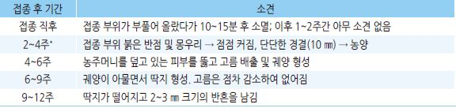
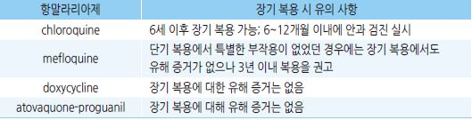
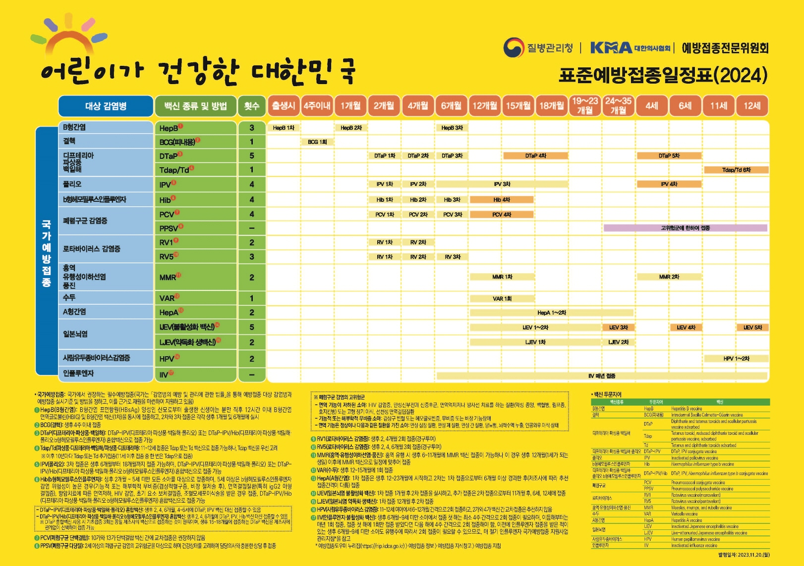
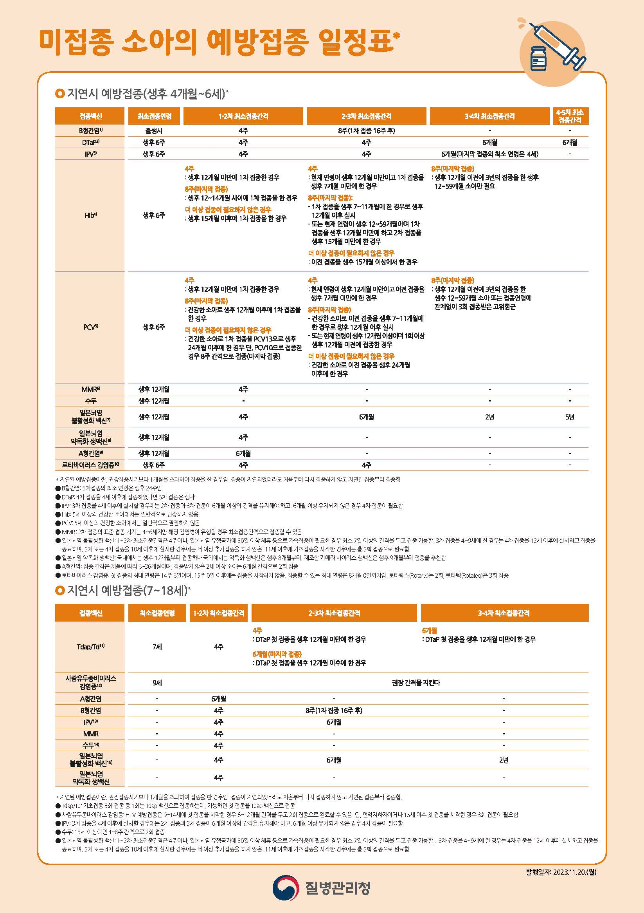
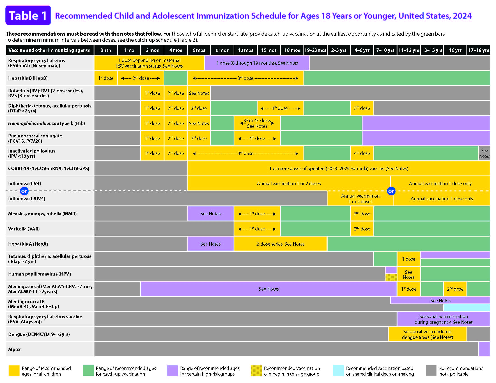
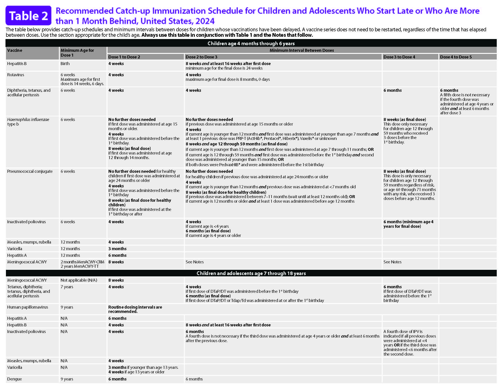
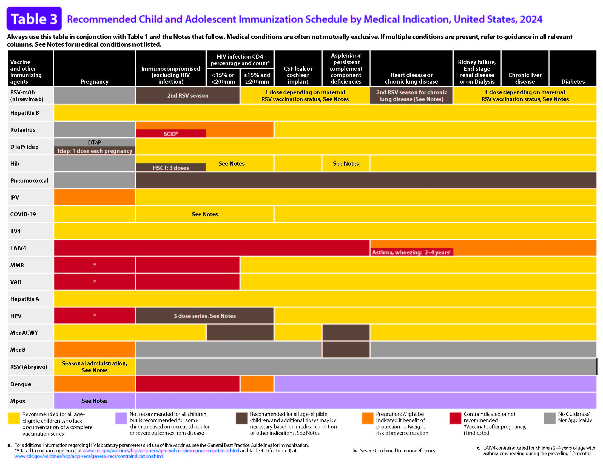
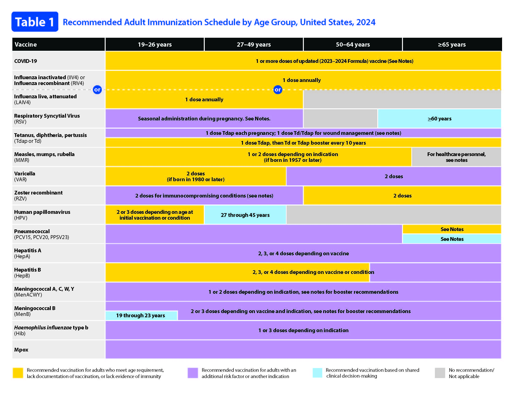
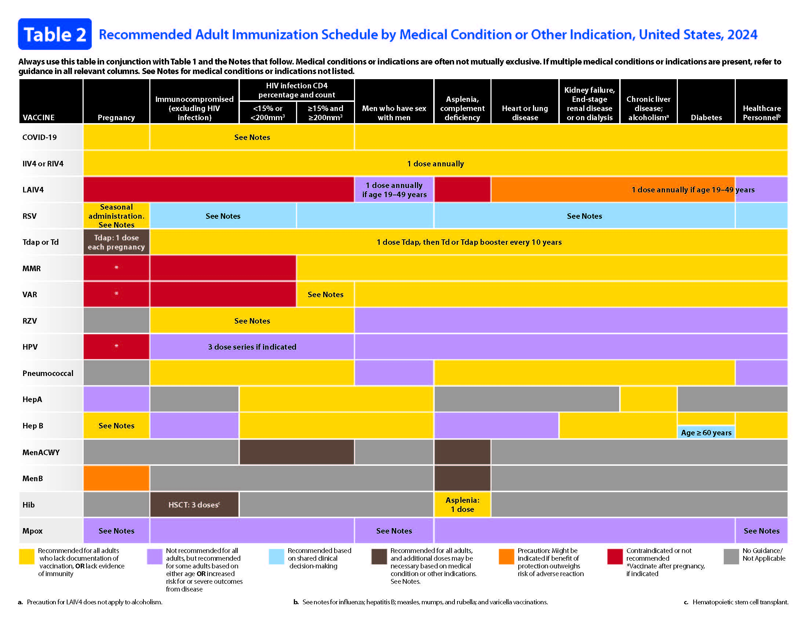

# 예방접종 Vaccination

> **적용 원칙** : 국내 진료와 국가예방접종 비용지원은 질병관리청의 「2026년 국가예방접종 지침」과 해당 절기 사업지침을 우선 참조. CDC 일정은 국내 지침에 세부 권고가 없거나 해외여행·국외 접종력 평가가 필요한 경우의 참조(국내 허가사항·유통 백신·급여/지원 범위와 다를 수 있음). 절기 백신(인플루엔자·코로나19)과 국가사업 대상은 매년 바뀔 수 있으므로 접종 당일 예방접종도우미에서 다시 확인할것을 권장함. (본 내용은2026년 8월 기준임)

#### 예방접종 종합 일정표

* \[질병관리청] 예방접종도우미 [Home](https://nip.kdca.go.kr/irhp/index.jsp) > 예방접종 정보 > 예방접종 알아보기 > [표준 예방접종 일정표](https://nip.kdca.go.kr/irhp/infm/goVcntInfo.do?menuLv=1\&menuCd=115)
* \[CDC] [≥19세](https://www.cdc.gov/vaccines/hcp/imz-schedules/adult-age.html) / [≤18세](https://www.cdc.gov/vaccines/hcp/imz-schedules/child-adolescent-age.html)

#### 2026년 국가예방접종 핵심 변경·확인 사항

<table><thead><tr><th width="192">항목</th><th>국내 기준</th><th>실무 주의</th></tr></thead><tbody><tr><td>어린이 기본접종</td><td>DTaP-IPV-Hib-HepB 6가 혼합백신을 포함한 국가사업 백신 사용 가능</td><td>혼합백신의 최소연령·최소간격은 각 성분 중 가장 엄격한 기준 적용</td></tr><tr><td>소아 폐렴구균</td><td>PCV15·PCV20을 국가사업 백신으로 사용</td><td>PCV20을 기본접종에 1회 이상 포함한 고위험 소아는 통상 PPSV23 보강접종 불필요</td></tr><tr><td>HPV 국가사업</td><td>2026년 5월 6일부터 2014년생 남아 포함. 12~17세 여성 및 18~26세 저소득층 여성 지원</td><td>국가사업 대상과 의학적 접종 권고 연령은 동일하지 않음</td></tr><tr><td>인플루엔자 2026~2027절기</td><td>불활성화 3가 백신. 어린이 지원이 생후 6개월~14세로 확대</td><td>임신부는 임신 주수와 관계없이 접종 가능</td></tr><tr><td>성인 폐렴구균 국가사업</td><td>65세 이상 PPSV23 1회 지원</td><td>PCV20 등을 포함한 CDC 임상 권고와 국내 무료지원 범위를 구분</td></tr><tr><td>코로나19</td><td>2026~2027절기 XFG 균주 백신 도입 예정</td><td>대상·횟수·간격은 해당 절기 사업지침을 접종 당일 확인</td></tr></tbody></table>

#### 질병코드

* Z23 단일 세균성 질환에 대한 예방접종의 필요
* Z24 특정한 단일 바이러스질환에 대한 예방접종의 필요
* Z25 기타 단일 바이러스질환에 대한 예방접종의 필요
* Z27 감염성 질환의 복합에 대한 예방접종의 필요

- [ ] 일반 비급여 접종 : 심평원으로 진료비 명세서를 보내지 않으므로 공단 청구 의무는 없지만, 병원 내부 진료 기록 관리, 수수가격 작성을 위해 EMR에 해당 Z코드를 등록하여 사용할 수 있음
- [ ] 건강보험 급여 접종 (치료 목적): 심평원 비용 청구가 수반되므로 해당 Z코드를 반드시 명세서에 입력함

***

## **■ 일반 사항**

## 제조 방법에 따른 백신의 분류

### 약독화 생백신 (Live attenuated vaccine)

* 제조 방식 : 병원체를 실험실에서 변형-‘약독화’; 접종 후 체내에서 증식되고 면역력이 생성됨
* 장점 : 소량 접종으로 불활성화 백신보다 강한 효과
* 단점 : 드물게 감염을 일으킬 수 있음(면역저하자); 병원체를 손상시킬 수 있는 조건(예: 백신의 햇빛, 열 노출), 병원체의 체내 증식에 영향을 주는 상태(예: 모체로부터 받은 항체, 면역 글로불린 투여) 등에 영향을 받음
* 종류 : BCG, MMR, 수두, 황열, 일본뇌염 생백신, 인플루엔자 약독화 생백신(비강), 경구용 로타바이러스, 경구용 장티푸스 생백신
* 대상포진 백신은 제품별로 다르다. ZVL은 생백신이지만 RZV(싱그릭스)는 재조합 불활성화 백신이다.

### 불활성화 백신 (Inactivated vaccine)

* 제조 방식 : 병원체를 배양하여 열이나 화학 약품(주로 포르말린)으로 ‘불활성화’ 시키거나, 병원체에서 백신에 포함시킬 성분만을 ‘분획화’하여 제조
* 장점 : 감염증을 유발하지 않음, 혈중 항체에 의한 영향을 적게 받음
* 단점 : 면역력이 생백신보다 약함, 시간 경과에 따라 효과 감소, 재접종이 필요
* 종류 : 디프테리아, 백일해, 파상풍, 폴리오(IPV), A형간염, B형간염, 폐렴구균, 수막구균, b형 헤모필루스 인플루엔자(Hib), 인플루엔자, 사람유두종바이러스, 공수병, 탄저균, 주사용 장티푸스균

### 증강 백신

* 백신의 면역원성이 증가하도록 도와주는 ‘면역증강제(adjuvant)’를 첨가한 백신
* 항체 형성률이 낮고 유지 기간이 짧은 고령자에서 보다 강한 백신 효과를 얻기 위하여, 또는 단기간에 보다 많은 양의 백신을 생산하기 위하여 사용
* 면역증강제가 근육 밖으로 주입되면 통증, 부종, 발적 등 국소 반응이 증가함

## 접종 부위 및 방법

#### 근육 주사

* 방법 : 22\~25 G 주사바늘 사용, 90o 각도로 삽입
* 연령별 주사 부위 및 주사바늘 선택
  * 생후 ＜12개월 : 대퇴부 전외측에 주사, ⅝ inch(16 ㎜) 바늘
  * 생후 12개월\~2세 : 대퇴부 전외측, 1 inch(25 ㎜) 또는 삼각근, ⅝ inch(16 ㎜)
  * 3\~18세 : 삼각근, ⅝\~1 inch(16\~25 ㎜)
  * ≥19세 : 삼각근, ＜60 ㎏ ⅝ inch(16 ㎜), 60\~70 ㎏ 1 inch(25 ㎜), ＞70 ㎏ 1\~1.5 inch(25\~38 ㎜)
* 긴 길이의 바늘을 사용해서 근육의 깊은 부위에 주사하면 국소 발적 및 부종이 줄어 듦
* 흡인 : 권고 접종 부위에는 큰 혈관이 없으므로 접종 시 흡인이 필요 없음
* 예방접종 후 문지르지 않으며 마른 솜이나 거즈로 수 초 동안 가볍게 누름. 반창고 사용 가능

#### 피하주사

* 부위 : ＜12개월 연령- 대퇴부 외측(또는 삼두근); ≥12개월 연령- 상완 외측 삼두근 상부
* 방법 : 23\~25 G, ⅝ inch(16 ㎜), 45° 각도로 삽입

#### 피내주사

* 부위 : 상완 삼각근 진피층 내 접종
* 방법 : 25\~27 G 주사바늘 사용, 전완의 장축과 평행하게 표피에 삽입; 주사액이 5\~7 ㎜의 피부 융기를 만들도록 하며 접종 후 접종 부위를 덮거나 싸지 않음


![예방접종의 실기 기준과 방법 \[질병관리청\]](../.gitbook/assets/6b0ad944-1830-4e0d-a0af-0984c7aa4ddb.png)

이상 반응

```
✽이상 반응 보고 : [예방접종도우미](https://nip.kdca.go.kr/irgd/information.do?MnLv1=2&MnLv2=5) 
```

### 국소 이상 반응

* 빈도 : \~80%
*   증상 : 주사 부위의 경미한 통증, 부종, 발적

    •중증은 주로 고농도 항체에 기인하는 과민 반응임(예: 파상풍 및 디프테리아 톡소이드)
* 호발 : 불활성화 백신, 면역증강제 포함 백신
* 경과 : 접종 후 수 시간 내에 발생, 대부분 자연 호전
* 치료법 : 접종 부위 냉찜질, 진통제, 항소양제

### 전신 이상 반응

* 증상 : 보통 경미한 비특이적 발열, malaise, 근육통, 두통, 식욕 감소
* 호발 : 생백신
* 경과 : 접종 7\~21일(백신 바이러스 잠복기에 해당) 후 발생
* 치료법 : 충분한 수분 공급, 시원하게 옷 입히기, 미지근한 물 목욕, 진통제

### 중증 알레르기 반응(anaphylaxis)

```
(☞ p.990)
```

* 빈도 : 백신 전체로는 대략 100만 회당 1건 수준이나 백신·연령에 따라 다름
* 기전 : IgE 매개; 백신 접종 후 수 분 또는 수 시간 이내 발생
* 증상 : 전신 두드러기, 입/인후 부종, 호흡 곤란, 쌕쌕거림, 저혈압, 쇼크
* 모든 접종기관은 아나필락시스에 즉시 사용할 에피네프린과 기도·순환 처치 장비를 갖춘다. 일반적으로 접종 후 최소 15분 관찰하고, 아나필락시스 또는 즉시형 알레르기 병력이 있으면 30분 관찰을 고려한다.

### 백신 종류별 예방접종 후 드문 이상 반응 및 출현까지의 기간

```

```

## 접종 금기 및 주의 사항

### 영구적 금기 또는 주의

* 백신 성분 또는 이전 백신 접종 후 anaphylaxis 발생 : 해당 백신 금지
* 계란 알레르기는 인플루엔자 백신의 금기가 아니다. 중증도를 불문하고 연령·건강상태에 맞는 유정란 또는 비유정란 인플루엔자 백신을 접종할 수 있다. 황열 백신은 계란 단백을 포함하므로 중증 계란 알레르기에서 전문기관 평가가 필요하다.
* 백일해 백신 투여 7일 이내에 원인 불명의 뇌증 발생 : 백일해 백신 금지
* 중증복합면역결핍 또는 장중첩증 병력 : 로타바이러스 백신 금지
* 이전 인플루엔자 백신 또는 파상풍 톡소이드 함유 백신 접종 6주 이내 길랭-바레증후군이 발생한 경우에는 해당 백신 접종의 주의사항이다. 단순 과거력만으로 모든 백신을 일률적으로 금기하지 않는다.

### 일시적 금기

```
(☞ p.1106)
```

* 임신부 : MMR·수두 등 임신 중 금기인 생백신. 불활성화 백신을 일률적으로 금기하지 않는다.
* 중증 면역저하자 : 생백신은 원인·정도·치료시점에 따라 금기 또는 연기한다. 수두 백신을 포함한 예외 적용은 감염내과/예방접종 전문가와 개별 판단한다.

### 일시적 주의 사항

* 중등증\~중증 급성 질환 : 백신 효과 감소나 이상 반응 증가에 대한 증거는 없으나 처치에 혼선을 줄 수 있으므로 접종 연기
*   최근에 항체 함유 혈액 제제를 투여 받은 경우 : 주사용 생백신 접종(예: MMR, 수두)과 간격 필요: 불활성화 백신,

    경구용/비강 투여 생백신, 대상포진 백신은 영향을 받지 않음

### 금기 사항이 아닌 경우

* 경미한 급성 질환 : 설사, 상기도 감염, 중이염, 미열(백신 접종이 금기인 특정 체온은 없음)
* 과거 동일 백신 접종 후 중등증 이하의 국소 이상 반응이나 발열이 있었던 경우
* 감염성 질환 노출, 질병 회복기
*   가족 내에 임신부 혹은 면역저하자가 있는 경우. 예외) 두창, 심한 면역 저하 환자와 접촉하는 사람에 대한 인플루엔자

    약독화 생백신 접종은 금지
* 미숙아, 모유 수유(단, 두창 제외, 황열은 선택적)
* 백신 외의 물질에 알레르기 반응이 있는 경우

## 기타

### 보관

* 일반적 백신 보관 온도 : 2\~8℃
* 재구성 백신은 혼합 후 즉시 사용하는 것이 원칙이다. 허용 보관온도와 사용 가능 시간은 제품마다 다르므로 첨부문서와 질병관리청 백신 보관 지침을 따르며, 일률적으로 “냉장 8시간”을 적용하지 않는다.

### 지연 또는 조기 접종

*   권고 접종 간격 이후 접종 : 영향 없음

    •지연된 예방접종 : 권장 접종 시기보다 1개월을 초과하여 접종을 한 경우를 의미하며 접종이 지연 되었더라도 처음부터

    다시 접종하지 않고 지연된 접종부터 접종 함
*   최소 연령 이전 접종, 최소 간격 이내 접종 : 항체 생성이 저하됨; 최소 접종 간격 또는 최소 접종 연령보다 ≥5일 앞당겨서

    접종하면 무효 처리하며 잘못된 접종일로부터 최소 접종 간격 이후 재접종 시행

    •조기 접종 시 용납되는 기간(grace period) : ≤4일

### 동시 접종

* 동시 접종은 항체 반응을 감소시키거나 이상 반응의 빈도를 증가시키지 않음
* 대부분의 백신은 다른 백신과 동시 접종할 수 있다. 각 백신을 별도 주사기에 준비하여 서로 다른 해부학적 부위에 접종한다. 특정 제품 조합의 예외는 현재 사용하는 제품의 첨부문서와 최신 지침을 확인한다.
* 같은 팔이나 다리에 두 가지 이상의 백신을 동시에 접종할 때는 ≥2.5 ㎝ 간격으로 주사
* 반응성이 강한 백신(예: 파상풍, PCV)들은 가능한 한 같은 부위에 주사하지 않음

### 백신들 간의 접종 간격

* 불활성화 백신끼리 또는 생백신과 불활성화 백신 사이에는 일반적으로 접종 간격 제한이 없다. 다만 서로 다른 날 투여하는 비경구용 생백신은 아래 원칙을 적용하고, 특정 제품 예외는 최신 첨부문서를 확인한다.
* 비경구용 생백신들은 서로 다른 날 접종하는 경우에는 최소 4주 간격을 요함
* 경구용-비경구용 생백신 또는 BCG-다른 생백신 사이에는 접종 간격의 제한 없음
*   4주 이상의 간격을 요하는 생백신들을 4주 미만의 간격으로 접종한 경우에는 나중에 접종한 백신을 최종 접종 4주 후에

    재접종하거나 혈청학적 검사를 통해서 효과가 있다는 것을 확인해야 함(단 인플루엔자, 수두, 대상포진 백신은 접종 후의

    혈청학적 검사는 추천하지 않음)

### 조산아, 저체중아

* 출생일을 기준으로 접종 일자를 결정함
* BCG : 미숙아에서는 연기(가급적 1개월 이내 접종), 입원 상태의 심한 질환 시 퇴원 후 접종
* B형간염 백신: 출생체중 ＜2.0 kg이고 산모 HBsAg 음성이면 생후 1개월 또는 퇴원 시(먼저 도래하는 시점) 시작할 수 있다. 산모 HBsAg 양성 또는 미상인 경우에는 체중과 무관하게 출생 12시간 이내 백신을 접종하고, 양성이면 HBIG도 다른 부위에 투여한다. 출생체중 ＜2.0 kg에서 출생 직후 접종분은 기본접종 횟수에 포함하지 않아 총 4회가 된다.

### 임신

* 금기: MMR·수두·ZVL·인플루엔자 약독화 생백신·일본뇌염 생백신 등 대부분의 생백신. 접종 후 4주간 임신을 피한다.
* HPV 백신은 생백신이 아니며 임신의 “금기”라기보다 임신 중에는 권고하지 않아 남은 접종을 출산 후로 연기한다. 임신 전에 검사는 필요 없고, 모르고 접종했더라도 임신중절 등 별도 조치는 필요 없다.
* IPV는 임신 중 일률적 금기가 아니며 노출 위험이 있으면 접종할 수 있다. RZV는 생백신은 아니지만 임신 중 자료가 제한되어 통상 출산 후로 미룬다.
*   접종 가능 백신 : 대부분의 불활성화 백신. 특히 인플루엔자 불활성화 백신 접종 권고

    •Tdap 백신 : 임신 중 어느 시기에나 접종이 가능하나 효과 극대화를 위하여 27\~36주째 접종 권고
* 임신부의 가족 내 접촉자 : 홍역, 유행성이하선염, 풍진 및 수두에 대하여 감수성이 있는 사람은 MMR, 수두 백신 접종 권고

### 결핵 검사 (TST, IGRA)

```
(☞ p.321)
```

* 불활성화 백신은 무관
*   생백신(예: MMR, 수두)은 동시에 하는 경우 접종과 검사 함께 시행 가능; 따로 시행 하는 경우 결핵 검사 반응이 억제될 수

    있기 때문에 접종 4주 이후에 결핵 검사 시행
*   결핵 감염이 의심되는 환자에서 MMR 백신 접종이 필요할 경우에는 결핵 검사 전에 MMR 백신 접종을 하지 않으며,

    활동성 결핵 환자에서는 결핵 치료 개시까지 MMR 접종을 보류

### 면역 저하 상태

* 다음은 면역 저하 상태로 간주 : 항암 치료 중, 방사선 치료 중, 고형 장기 이식자
* 생백신: 면역저하의 원인·정도와 사용 중인 약제에 따라 금기 또는 접종시점 조정이 필요하다. “B세포 결핍만 있으면 수두 백신 가능”처럼 일률적으로 예외를 적용하지 않는다.
*   불활성화 백신 : 접종 가능. 면역 저하 자체가 질환에 대한 위험 인자이므로 접종을 권고

    •단, 백신에 대한 면역 반응이 저하될 수 있으므로 면역 저하 상태 동안 접종한 불활성화 백신은 면역 기능 회복 후 재접종이

    필요할 수 있음
* 면역 글로불린, 혈액 제제 치료 : 치료 종료 3개월 이후(종류마다 다름)로 생백신 접종 연기
* 백신을 먼저 접종한 경우 2주가 경과한 후에 면역 글로불린이나 혈액 제제 투여

### 약물

*   steroid 투여 관련

    •고용량 steroid 투여(예: prednisone ≥20 ㎎/d 또는 ≥2 ㎎/㎏/d ×≥14d) 시 생백신은 steroid 투여 중단 최소 1개월 이후 접종,

    불활성화 백신은 접종 가능

    •다음의 경우에는 접종 가능(생백신 포함) : 저용량 steroid(예: prednisone ＜20 ㎎/d) 투여, 고용량이지만 짧은 기간(＜14d)

    투여, 장기간이지만 단기 작용 제제로 격일 투여, 생리적 보충 요법, 국소 도포(피부, 눈), 흡입, 국소 주사(관절, 윤활낭)
* 항바이러스제: 대부분의 불활성화 백신에는 영향이 없다. Acyclovir·valacyclovir·famciclovir는 수두 또는 ZVL 접종 최소 24시간 전부터 피하고 접종 후 14일간 가능하면 사용하지 않는다. RZV에는 적용하지 않는다. LAIV는 oseltamivir·zanamivir 투여 후 48시간, peramivir 후 5일, baloxavir 후 17일이 지난 뒤 접종하며 접종 후 2주 이내 항바이러스제를 사용했다면 재접종 필요성을 평가한다.
* 생물학적 제제·면역조절제(예: rituximab, JAK 억제제, 항TNF 제제) 사용 전후의 생백신 간격은 약제별로 크게 다르다. “접종 2주 전부터 6주 후까지 중단”을 일률 적용하지 말고, 약제 첨부문서와 전문학회 지침에 따라 처방 전문의와 조정한다.

### 직업군에 따른 예방접종

* 사스·조류인플루엔자 대응기관 종사자, 닭·오리·돼지농장 및 관련업계 종사자 : 인플루엔자
* 보육시설 종사자 : 인플루엔자, 수두, Tdap, MMR, A형간염
* 외식업 종사자 : A형간염
* 수용시설의 수용자 및 근무자 : 인플루엔자, B형간염
* 지체장애인과 이들을 보호하는 직원 : 인플루엔자, B형간염
* 학교 및 유치원 교사 등 소아들과 함께 생활하는 직종 : 수두, 인플루엔자, Tdap, MMR
* 논 농사 종사자 : 신증후군출혈열, 일본뇌염
* 돼지 사육 종사자 : 일본뇌염, 인플루엔자
*   공수병 감염 고위험 직업군(수의사, 동물병원 근무자, 사냥터 관리인, 사냥꾼, 삼림감시원, 도살자, 동물탐험가, 박제사 등) :

    공수병
* 실험실 요원 : 공수병, 수막구균, 신증후군출혈열, 일본뇌염, 장티푸스, 콜레라, 폴리오, 황열

#### 보건의료인 예방접종

| 백신      | 대상                               | 접종·검사 원칙                                                                                                                     |
| ------- | -------------------------------- | ---------------------------------------------------------------------------------------------------------------------------- |
| B형간염    | 혈액·체액 노출 위험이 있고 면역의 증거가 없는 보건의료인 | 기본접종 완료 1\~2개월 후 anti-HBs 검사. <10 mIU/mL이면 추가접종 또는 재접종 일정을 시행하고 다시 검사한다. 두 차례 완전 접종 후에도 <10이면 비반응자로 교육하고 노출 시 HBIG 지침을 적용한다. |
| 인플루엔자   | 모든 보건의료인                         | 매 절기 1회                                                                                                                      |
| Tdap/Td | 모든 보건의료인                         | Tdap 미접종자는 1회 접종 후 Td 또는 Tdap을 10년마다 접종한다. 임신 때마다 임신 27\~36주에 Tdap 1회                                                        |
| MMR     | 홍역·유행성이하선염·풍진 면역의 증거가 없는 보건의료인   | MMR 2회(최소 4주 간격). 풍진만의 면역 확보 목적이면 최소 1회가 필요하지만 의료기관 노출 위험 때문에 통상 2회 접종력을 확인한다.                                               |
| 수두      | 수두 면역의 증거가 없는 보건의료인              | 4\~8주 간격 2회                                                                                                                  |
| 코로나19   | 해당 절기 권고·기관 감염관리 기준에 해당하는 보건의료인  | 해당 절기 제품·횟수·간격 적용                                                                                                            |

> 면역의 증거와 접종 후 항체검사 필요성은 백신마다 다르다. MMR·수두 백신을 적절히 완료한 뒤 일률적으로 항체검사를 반복하지 않는다.

### 기타

* 4주=28일이며, '개월(month)'은 달력 월(calendar month)에 따름
* 접종력이 불확실한 경우 ; 재접종 시행(재접종이 이상 반응 발생을 증가시키지 않음)
*   충분한 용량을 접종하지 못한 경우 : 재접종 시행. 생백신은 4주 이상의 간격을 두고 재접종;

    적정량의 ½이 투여된 경우에는 같은 날 적정량의 ½을 다시 접종하였다면 접종으로 인정
* 비표준접종(권고하는 방법 이외의 접종) : 무효인 것으로 간주하고 재접종 시행
*   교차 접종 : 보통 허용하지 않지만 이전에 접종받았던 백신의 종류를 모르거나 국내에 유통되지 않는 경우 등 불가피한 경우에는

    이용 가능한 백신으로 접종
* 이주, 이민 : 장기간 거주할 국가 권고 기준으로 시행
* 출혈성 질환을 가진 사람 : 23 G 이하의 가는 바늘을 사용하고 최소 2분 이상 지그시 접종 부위를 누름(문지르지 않음)
* 효과 발현 기간 : 일반적으로 백신 접종 1\~2주 후부터 효과가 발현되며, 불활화 백신은 추가 접종 후 충분한 효과에 도달
*   혼합 백신 투여 시 최소 연령은 각 성분 백신의 투여 최소 연령 중 가장 높은 연령이며, 최소 접종간격은 각 성분 백신의

    최소 접종 간격 중 가장 긴 기간으로 함

-프리필드시린지의 소량의 공기는 제거하지 않고 접종함(이 공기가 투약 후 잔여 약물을 줄여줌)

* 마비가 있는 부위를 피하여 접종하는 것을 권고 하지만 불가피한 경우에는 접종할 수 있음
* A형간염 or 수막구균 백신 피하 주사, MMR or 수두 백신 근육 주사 시에는 재접종 하지 않음

### ￭ 결핵 BCG

* 생백신 \[엑세스파마 피내용 건조BCG, 한국백신 경피용 건조BCG]

### 접종 대상 및 방법

* 대상 : 모든 신생아
* 시기 : 생후 4주 이내 1회

#### 피내 주사형

*   용법 : 0.05 ㎖(≥1세- 0.1 ㎖)를 삼각근 부위에 지름 5\~7 ㎜의 팽진이 생기도록 피내 주사(팽진이 생기지 않더라도 재접종은

    필요 없음) (☞ p.1103)
* 장점 : 접종량이 일정하고 정확하며 효과를 신뢰할 수 있음; WHO 및 NIP에서는 피내용만 권고

#### 경피 천자형

* 용법 : 상박 중간 외측 피부에 부위를 달리하여 백신을 2번 바른 후 관침으로 각각 펀칭
* 주의 : 적정 용량이 적정 깊이에 투여되지 않을 가능성이 있음, 깊은 펀칭 시 흉터가 발생함

### 금기

* 면역 결핍 : 선천 면역 결핍, HIV 감염, 백혈병, 림프종, 기타 악성 종양
* 면역 억제 치료 : steroid, 항대사 물질, 항암제 치료, 방사선 치료
* BCG를 접종할 부위에 심한 피부 질환, 화상 등이 있는 경우

### 이상 반응

* 국소 : 국소 림프절염, 농양, 궤양, 켈로이드, 비후성 반흔
* 전신 : 매우 드물게 골염/골수염, 파종성 BCG 감염증 (☞ p.1104)

### 백신 효과 : 피내 주사형

* 논란(방어율 0\~80%); 중증 결핵(예: 결핵 수막염, 좁쌀 결핵)에 대해서는 높은 효과를 기대
* 효과 지속 기간 : 10\~20년

※ 경피 천자형은 연구 부족

### 접종 후 관리

* 접종 후 수일 내에는 특별한 현상이 없으며 목욕 가능
*   정상 반응

    

> ```
> *목/겨드랑이의 림프절이 비대해 질 수 있으나(림프절염) 치료하지 않으며 보통 수개월(~1년) 내에 소멸 됨
> ```

*   농양, 궤양 : 자연 치유됨; 짜거나 약 도포 또는 드레싱을 하지 않으며 고름이 많으면 소독 솜으로 닦고 통풍시킴; 불필요한

    조치로 상처가 더 커지거나 오래 지속될 수 있음
* 국소 농양 : 피하로 잘못 주사 시 발생 가능; 2차 세균 감염 시(주로 S. aureus ) 치료 (☞ p.901)
* 화농 림프절염 : 림프절이 ＞3 ㎝ 시 터질 가능성이 높음; 터지기 전에 굵은 바늘로 배액
* 무통성 궤양 : 정상 반응으로 주사 후 4개월 이상 궤양이 지속될 수 있음
* 켈로이드 반흔 : 일상생활에 큰 불편이 없는 한 치료 안 함; 필요시 국소 주사, 절제 등 고려

### 특기 사항

* 미숙아 : 영양 상태를 고려하여 연기 가능. 가급적 1개월 이내 접종
* 입원이 필요한 중증 질환 : 퇴원 후 접종
* 지연 접종 : 생후 ＜3개월에서는 TST 없이 접종, ≥3개월에서는 TST 검사 후 음성 시 접종; ≥5세에서는 접종을 권고하지 않음
* 충분한 치료를 받고 있지 않는 결핵 환자와 접촉한 경우 접종하지 않음
* 재접종 : 하지 않음

### ￭ B형간염 HepB

* 불활성화 백신 \[SK 헤파뮨, LG 유박스비]

### 접종 대상 및 방법

* 대상 : ①모든 신생아, ②면역의 증거1)가 없는 성인2)

> ```
> 1) 면역의 증거 : B형간염 진단, 항체 양성, B형간염 백신 접종력 중 1가지 이상
> ```

```
2) ≥60세의 경우 다음에서 특히 권장 : 만성 간질환(간염, 알코올간질환, 간효소 2배 초과 상승 등), 혈액투석, HIV 감염, 혈액제재를
```

> ```
> 자주 투여 받는 환자, 과거 B형간염의 감염증거와 예방접종력이 없는 성인 중 B형간염 바이러스에 노출될 위험이 높은 환경에 있는
> ```

> ```
> 사람(의료기관 종사자, 수용시설의 수용자 및 근무자, 단체 생활을 하는 지체장애인과 이들을 보호하는 직원, B형간염 바이러스
> ```

> ```
> 보유자의 가족, 주사용 약물 중독자, 성매개질환의 노출위험이 큰 집단
> ```

| 차수 | 권장 시기    | 최소 연령  | 이전 접종과 최소간격           |
| -- | -------- | ------ | --------------------- |
| 1차 | 출생 시     | 출생     | -                     |
| 2차 | 1차 후 1개월 | 생후 4주  | 4주                    |
| 3차 | 1차 후 6개월 | 생후 24주 | 2차 후 8주이며 1차 후 16주 이상 |

* 시기 : 0, 1, 6개월 (총 3회); 출생 24시간 이내 1차 접종 권고
* 6가 혼합백신(DTaP-IPV-Hib-HepB)을 생후 2, 4, 6개월에 사용하는 경우에도 출생 시 HepB 단독접종은 시행한다. 이때 B형간염 성분은 총 4회가 되며, 최종 접종은 생후 24주 이후이고 1차와 16주 이상, 직전 접종과 8주 이상 간격이어야 한다.
* 용량 : ＜11세- 0.5 ㎖, ≥11세- 1.0 ㎖
* 용법 : ＜1세- 대퇴부 전외측, ≥1세- 삼각근 IM (☞ p.1103)
* ≥11세 혈액 투석 환자 : 40 ㎍(1 ㎖ 씩 같은 부위에 동시에 2회 접종); 0, 1, 2, 6개월 (총 4회)

### 금기 및 주의 사항

* 백신 접종의 일반적 금기 사항 (☞ p.1104)

### 이상 반응

* 국소 : 접종 부위의 통증, 부종, 경결
* 전신 : 발열, malaise, 구토, 관절통, 발진

### 백신 효과

* HbsAb 양전율 : 소아- ＞95%, ＜40세- ＞90%, 40세~~60세- 75%, 성인 투석 환자- 50~~75%
* 양전율 저하 인자 : 접종 시 연령(가장 중요), 흡연, 비만, 만성 질환, 혈액 투석, 면역 저하

### 특기 사항

#### 지연 접종

* 차기 접종이 지연된 경우에 새로 시작하지 않고 나머지 횟수만 접종(총 3회)

#### 저체중

* ＜2.0 ㎏ : 출생 1개월 또는 퇴원 시 1차 접종(체중 무관)

#### 산모가 HBsAg(+)인 경우

*   출생 직후(12시간 이내) B형간염 면역 글로불린(HBIG, 0.5 ㎖) 및 B형간염 백신 1차 접종을 서로 다른 부위에 주사(체중

    무관); 2, 3차 백신 접종은 일반 일정과 같이 생후 1, 6개월에 시행

    •＜2.0 ㎏ 아기는 출생 직후 1차 접종하고 1, 2, 6\~7개월에 추가 3회 접종하여 총 4회 접종
* 생후 9\~12개월에 HBsAg와 anti-HBs를 검사한다. 접종이 지연되었으면 최종 접종 1\~2개월 후 검사하되 생후 9개월 이전에는 검사하지 않는다.

#### 임신, 수유부

* 접종 가능

#### 항체 검사 및 추가 접종

* 항체 검사 : 백신 접종 전이나 후의 HBsAb 확인을 위한 일률적인 검사는 권하지 않으며 B형간염의 고위험군1)에만 적용함
* 추가 접종 : 고위험군을 제외하고는 추가 접종은 권하지 않음2)

> ```
> 1) B형간염 고위험군 : HBV 만성 감염자의 가족, 면역저하자(예: HIV 감염자), 혈액 투석 환자, 혈액 제제를 자주 수혈 받아야 하는
> ```

> ```
> 환자, sAg 양성 산모로부터 출생한 신생아, sAg 양성자와의 성 접촉자, 의료기관 종사자(B형간염 환자나 바이러스가 오염된 체액에
> ```

> ```
> 노출되는 상황이 반복되는 경우)
> ```

```
2) 백신에 대한 면역 기억(immunologic memory)과 B형간염의 긴 잠복기로 인해 스스로 항체가가 상승되는 자가증폭(autoboosting)
```

> ```
> 현상이 나타남
> ```

#### 고위험군에 대한 접종 후 검사 및 추가 접종

* 항체 검사 : 3차 접종 1\~2개월 후에 항체 검사를 시행하며 그 결과에 따라 다음 조치

⑴ ≥10 mIU/㎖인 경우 : 면역정상자는 종료한다. 혈액투석 환자처럼 지속적인 고위험군은 정기적으로 anti-HBs를 확인하고 ＜10 mIU/㎖이면 추가 접종한다.

⑵ 음성 또는 ＜10 mIU/㎖인 경우 : 추가 1회(4차) 접종 및 1개월 후 sAb 검사 →

① ≥10 mIU/㎖ 시 종료(⇨ ⑴).

② ＜10 mIU/㎖ 시 5차, 6차 접종 및 마지막 접종 1\~2개월 후 (만성 감염자 여부 확인을 위하여) sAb 및 sAg 검사 →

```
    a. ≥10 mIU/㎖ 시 종료(⇨ ⑴)

    b. 음성 또는 ＜10 mIU/㎖ 시 더 이상 접종하지 않으며 감염 가능성, 예방법 및 노출 시 HBIG를 투여받도록 교육
```

#### 교차 접종

* 허용

### ￭ A형간염 HepA

* 불활성화 백신 \[GSK 하브릭스, MSD 박타, 보령 A형간염, 사노피 아박심]

### 접종 대상 및 방법

*   대상 : 모든 12\~23개월아 및 아래 중 A형간염 병력이나 백신 접종력이 없는 경우

    • A형간염 바이러스 감염 고위험: A형간염의 유행 지역 여행자나 장기 체류자, 남성 동성애자, 불법 약물 님용자,

    직업적 노출 위험(실험실 종사자, 의료인, 군인)

    • A형간염 바이러스 감염 시 중증 발병 위험 : 면역저하자, 만성 신질환, 장기 이식, B형/C형간염 감염, 만성 간질환, 지방간,

    간 효소 수치 상승(≥2배, ≥6개월), 자가면역 간염, ≥41세

    • 기타 : A형간염 감염 고위험/중증 위험의 임신부, A형간염 유형 중 A형간염 면역력 없음, A형간염 감염자와와 접촉할

    기회가 많은 직업
* 권장 접종 일정 : 생후 12\~23개월 1차, 1차 접종 6개월 후 2차(총 2회); 최소 접종 간격- 6개월
* 접종 대상자 중 ＜40세는 항체 검사 없이 접종, ≥40세에서는 항체 검사 후 음성 시 접종

| 대상             | 일정                                        | 최소간격         |
| -------------- | ----------------------------------------- | ------------ |
| 소아             | 생후 12\~23개월에 1차, 제품별 권장시기에 2차             | 6개월          |
| 미접종 성인         | 제품에 따라 0, 6\~12개월 또는 0, 6\~18개월의 2회       | 6개월          |
| 출국이 임박한 고위험 성인 | 백신 1회와 면역글로불린 병용 여부를 연령·면역저하·만성간질환에 따라 결정 | 서로 다른 부위에 투여 |

### 금기 및 주의 사항

* 백신 접종의 일반적 금기 사항 (☞ p.1104)

### 이상 반응

* 국소 : 통증, 발적, 부종; 20\~50%
* 전신 : malaise, 피로, 미열; ＜10%

### 백신 효과

* 항체 양전율 : \~100%

### 특기 사항

#### 교차 접종

* 허용

#### 지연 접종

* 1차 접종 후 지연된 경우 새로 시작하지 않고 나머지 1회만 접종

#### 백신 접종 전/후의 항체 검사

*   접종 전 검사 : ≥40세에서 시행하며 음성이면 접종(2010년 기준 40세 이상의 항체 양성율 ＞80%);

    ＜40세에서는 항체 검사 없이 접종
* 접종 후 검사 : 필요 없음(항체 양전율이 거의 100%에 달함)

#### 임신부

* A형간염 발생 가능성이 높은 경우에 간염 및 백신으로 인한 위험도를 고려하여 결정

#### 위험 지역 여행 예정

* 6~~11개월아 : 출발 전 1회; 12~~23개월에 최소 6개월 간격으로 2회 재접종
*   미접종 ≥12개월 : 여행을 계획하는 즉시 1회 접종; ≥40세, 면역저하, 만성 간질환 등이 14일 이내 출발하는 경우백신과

    면역글로불린을 각각 다른 팔다리 근주

### ￭ 디프테리아 DTaP

* 불활성화 백신 \[보령 DTaP]

•DTaP-IPV \[사노피 테트락심, GSK 인판릭스 IPV, 보령DTaP IPV]

•DTaP-IPV/Hib \[사노피 펜탁심, GSK 인판릭스 IPV Hib]

•DTaP-IPV-Hib-HepB \[사노피 헥사심]

### 접종 대상 및 방법

* 대상 : ①모든 소아, ②성인(Tdap or Td)
* 기초: 생후 2, 4, 6개월; DTaP, DTaP-IPV, DTaP-IPV/Hib 또는 DTaP-IPV-Hib-HepB. 6가 혼합백신을 사용해도 출생 시 B형간염 백신은 생략하지 않는다.
*   추가 : 생후 15~~18개월(DTaP), 4~~6세(DTaP), 11\~12세 및 이후 10년마다(Tdap or Td)

    •7세 이후 접종 중 한 번은 Tdap으로 시행하며 가능한 한 11\~12세에 Tdap으로 접종
*   한 번도 접종하지 않은 ≥7세 및 성인\* : 0, 4~~8주, 및 2차 접종 후 6~~12개월 (총 3회); Td로 접종하되

    일정 중 1회(가급적 1차)는 Tdap으로 접종

> \*DTP 백신이 1958년에 도입되었으므로 그 이전 출생자는 영아기 접종력이 없을 가능성이 있음

* 용법 : 0.5 ㎖; 영아- 대퇴부 전외측, 소아/성인- 삼각근 IM (☞ p.1103)

| 차수 | 권장 시기       | 최소 연령   | 이전 접종과 최소간격                            |
| -- | ----------- | ------- | -------------------------------------- |
| 1차 | 생후 2개월      | 생후 6주   | -                                      |
| 2차 | 생후 4개월      | 생후 10주  | 4주                                     |
| 3차 | 생후 6개월      | 생후 14주  | 4주                                     |
| 4차 | 생후 15\~18개월 | 생후 12개월 | 3차 후 6개월(생후 12개월 이후 4개월 간격 접종도 유효)     |
| 5차 | 4\~6세       | 4세      | 4차 후 6개월. 4차가 4세 이후이며 3차 후 6개월 이상이면 생략 |

### 금기

* 백신 접종의 일반적 금기 사항 (☞ p.1104)
* 백일해 포함 백신 접종 7일 내에 다른 이유가 밝혀지지 않은 뇌증 발생 시 이들 백신 금기

### 주의 사항

* 진행성·불안정 신경계 질환(예: 조절되지 않는 뇌전증, 영아연축, 진행성 뇌증)은 상태와 치료가 안정될 때까지 백일해 함유 백신을 연기하는 주의사항이다. 안정된 신경계 질환이나 열성 경련 가족력은 금기가 아니다.
*   DTaP 접종 후 48시간 내에 다음 증상 발생 : 원인 미상의 고열(≥40.5℃), 저긴장성 저반응(저혈압, 호흡 곤란, 심한 두드러기),

    탈진, 쇼크, 3시간 이상 달래지지 않고 지속되는 울음
* DTaP 접종 후 3일 내에 경련성 발작

### 이상 반응

*   국소 : 발적, 부종, 통증, 접종 부위 농양, 심한 국소 반응(Arthus reaction\*); 3회 접종에서 20\~40% 발생, 4차 및 5차 접종 시

    빈도 증가 (✽국소 부작용 병력은 접종 금기 사항이 아님)

> ```
> *Arthus reaction : 디프테리아 항독소에 대한 과도한 면역 반응; 어깨부터 팔꿈치에 통증이 동반된 넓은 부위의 종창이
> ```

> ```
> 접종 2~8시간 후 발생하는 현상; 이 경우 10년 내 Td 백신 추가 접종 금지
> ```

*   전신 : 두드러기, anaphylaxis, 식욕 상실, 고열, 1시간 이상 울기, 졸림, 구토, 신경학적 이상(뇌증, 상완신경총 말초신경병증,

    저긴장 저반응 포함), 길랭-바레증후군(파상풍 포함 백신에서 주의)

### 백신 효과

* 임상 효능 : ＞97%

### 특기 사항

#### 지연 접종

* 기초 접종의 접종 간격이 벌어진 경우 : 남은 횟수만 접종
* 3차 접종을 생후 15개월\~＜4세에 시행한 경우 : 3차 접종 6개월 후 4차 접종 → 4차 접종 6개월 후 5차 접종
* 4차 접종을 ≥4세에 시행한 경우 : 5차 접종은 생략

#### 교차 접종

*   기초 접종 3회에 대하여 허용하지 않음. 예외) 이전에 접종받았던 백신의 종류를 모르거나 국내에 유통되지 않는 경우 등

    불가피한 경우
*   동일 원액을 사용한 제품들은 동일한 것으로 봄 : LG 디티에피, SK 디피티 트리, SK 가케츠켄디 티에이피; GSK 인판릭스,

    인판릭스-IPV; 사노피 테트락심, 펜탁심
* 교차 접종을 한 경우 : 재접종 하지 않음 (✽안전성과 면역원성에 영향을 미치지 않는다는 제한적인 보고가 있음)
* 추가 접종은 교차 접종 허용

#### 열성 경련 병력

* 열성 경련 병력만으로 DTaP 접종을 피하지 않는다. 국내 2026 지침은 본인 또는 가족의 경련 과거력이 있으면 접종 후 24시간 동안 acetaminophen 등을 4\~6시간 간격으로 투여할 수 있다고 제시한다. 다만 예방적 해열제의 경련 예방 효과는 확립되지 않았고 일부 백신의 항체반응을 낮출 수 있으므로 일률적 투여보다는 개별 판단하며, 접종 후 발열·통증이 생기면 연령과 체중에 맞추어 사용한다.

#### 임신부

* 매 임신 27\~36주 중 가급적 이른 시기에 Tdap 1회 접종을 권고
*   이전에 Tdap을 접종한 적이 없고 최근 임신 중 Tdap을 접종하지 않은 new mother는 분만 후 즉시 Tdap 접종;

    이전 Tdap 접종력이 있다면 산후 접종은 필요 없음

#### ＜12개월 영아와 밀접히 접촉하는 자

*   영아와 밀접한 접촉이 예상되는 Tdap 접종력이 없는 청소년과 성인(예: 부모, 형제, 조부모, 도우미, 의료인)은 영아와

    밀접하게 접촉하기 2주전까지 Tdap 1회 접종을 권고

### ￭ 파상풍 DTaP

* 불활성화 백신; Tdap \[GSK 부스트릭스, 사노피 아다셀], Td \[녹십자 Td, 엑세스파마 Td부스터]

### 접종 대상, 시기 및 방법, 금기 사항 및 주의 사항, 이상 반응

* 디프테리아 백신과 동일 (☞ p.1112)
* 종류 : DTaP, Tdap, Td

### 백신 효과

* 파상풍 톡소이드에 대한 방어 면역 : 74\~90%

### 상처 치료 시 파상풍 예방

| 상처                                | 과거 파상풍 함유 백신         | Tdap/Td·DTaP | TIG |
| --------------------------------- | -------------------- | ------------ | --- |
| 깨끗하고 경미한 상처                       | 불명확 또는 3회 미만         | 접종           | 불필요 |
| 깨끗하고 경미한 상처                       | 3회 이상, 마지막 접종 10년 미만 | 불필요          | 불필요 |
| 깨끗하고 경미한 상처                       | 3회 이상, 마지막 접종 10년 이상 | 접종           | 불필요 |
| 오염·깊은 천자·압궤·화상·동상·괴사조직·동물/사람 교상 등 | 불명확 또는 3회 미만         | 접종           | 투여  |
| 오염·고위험 상처                         | 3회 이상, 마지막 접종 5년 미만  | 불필요          | 불필요 |
| 오염·고위험 상처                         | 3회 이상, 마지막 접종 5년 이상  | 접종           | 불필요 |

* 7세 미만은 DTaP, 7세 이상은 Tdap 미접종 시 Tdap을 우선 사용한다.
* HIV 감염 또는 중증 면역저하자가 오염·고위험 상처를 입으면 접종력과 관계없이 TIG를 고려한다. TIG와 백신은 서로 다른 부위에 투여한다.

### ￭ 백일해 DTaP

* 불활성화 백신

### 접종 대상, 시기 및 방법, 금기 사항 및 주의 사항, 이상 반응

* 디프테리아 백신과 동일 (☞ p.1112)
* 종류 : DTaP, Tdap
*   성인 Tdap 접종 권장군 : 생후 ＜12개월 영아와 밀접한 접촉자(부모, 형제, 조부모, 영아 도우미, 의료인, 산후조리업자 및

    종사자), 보육시설 종사자, 가임기 여성 및 임신부

### 백신 효과

* 75\~90%

### 특기 사항

#### 백일해 유행 시기

* 영아 : 생후 6주부터 DTaP 접종 → 4주 간격 접종 권고
* 생후 ＜12개월의 영아 보호자 : Tdap 접종 권고(이전 Td 접종과의 간격 유지 필요 없음)
* 백일해 집단 발생 학교 교직원 : Tdap 접종력이 없는 경우 접종 권고

### ￭ 로타바이러스 Rotavirus

* 생백신; 5가(G1\~4, G9) \[MSD 로타텍], 1가(G1; 5가 백신 대상의 90% 해당) \[GSK 로타릭스]

### 접종 대상 및 방법

* 1가 \[로타릭스]: 생후 2, 4개월 (총 2회); 1.5 ㎖ 경구
* 5가 \[로타텍]: 생후 2, 4, 6개월 (총 3회); 2 ㎖ 경구
* 1차 접종 허용 기간 : 최소 생후 6주\~최대 14주 6일
* 최종 접종 허용 기간 : 최대 8개월 0일
* 최소 접종 간격 : 4주

### 금기 및 주의 사항

* 백신 접종의 일반적 금기 사항 (☞ p.1104)
* 중증복합면역결핍, 장중첩증 병력
* 주의 : 선천성 복부 질환 병력, 면역 기능 저하, 기존의 만성 위장관 질환, 급성 위장염

### 이상 반응

* 발열, 설사, 구토, 혈변
* 장중첩증: 1·2차 접종 후 약 1주 이내 매우 작은 위험 증가가 확인되어 있다. 접종 후 심한 보챔, 주기적 복통, 반복 구토, 혈변, 복부팽만이 있으면 즉시 응급평가한다.

### 백신 효과

* 백신 접종 후 1년 내에 발생하는 심한 로타바이러스 질환에 대한 방어력 : 85\~98%
* 백신 접종 후 1년 내에 발생하는 모든 로타바이러스 질환에 대한 예방 : 74\~87%

#### 백신의 한계

* 현재 백신은 중증 로타바이러스 위장관염과 입원을 효과적으로 줄인다. 백신 바이러스가 대변으로 일시 배출될 수 있으므로 기저귀 교환 후 손 위생이 중요하며, 이것만으로 접종을 피하지 않는다.

### 특기 사항

*   지연 접종(1차 접종을 15주 이후에 시행한 경우) : 나머지를 일정대로 완료함(이 경우에도 생후 8개월 0일 이후에는

    접종하지 않음)
* 조산아 : 임상적으로 안정된 상태라면 일반 일정 수행 가능
*   교차접종 : 허용하지 않음; 불가피한 경우 5가 백신이 한 번이라도 사용되었거나 이전에 접종한 백신을 알 수 없을 경우는

    총 횟수가 3회가 되도록 접종
*   면역 기능 저하 환자와 접촉하는 영아에 대한 접종 : 예방접종을 받은 영아의 대변으로 바이러스가 배출되므로 전파를

    방지하기 위해 모든 가족들은 이에 노출 시(예: 기저귀 갈기) 손 등의 관리에 유의
* 접종 기간 중 장염(로타 감염 포함) 발생 : 증상 회복 후 일정대로 예방접종을 완료함
* 접종 후 백신 구토 : 백신을 뱉거나 구토한 경우 재투여 하지 않음

### ￭ 폴리오 (주사용) IPV

* 불활성화 백신 \[보령 아이피박스] •DTaP-IPV \[사노피 테트락심, GSK 인판릭스 IPV, 보령DTaP IPV]

### 접종 대상 및 방법

1. 소아 : 모든 소아

* 기초 : 생후 2, 4, 6개월; IPV, DTaP-IPV, 또는 DTaP-IPV/Hib (☞ p.1112)
* 추가 : 4\~6세; IPV 또는 DTaP-IPV
* 용법 : 0.5 ㎖; 영아- 대퇴부 전외측 IM, 큰 소아- 삼각근 IM or SC (☞ p.1103)

| 차수 | 권장 시기      | 최소 연령  | 이전 접종과 최소간격 |
| -- | ---------- | ------ | ----------- |
| 1차 | 생후 2개월     | 생후 6주  | -           |
| 2차 | 생후 4개월     | 생후 10주 | 4주          |
| 3차 | 생후 6\~18개월 | 생후 14주 | 4주          |
| 4차 | 4\~6세      | 4세     | 3차 후 6개월    |

2.  성인: 기본접종을 완료하지 않았거나 접종력이 불명확하면 3회 일정을 완료한다. 기본접종을 완료한 성인 중 폴리오바이러스 노출 위험이 증가한 여행자·실험실 종사자·의료인은 평생 1회 IPV 추가접종을 고려한다.

    이 균을 다루는 실험실 요원, 이 균을 배출하는 환자와 밀접한 접촉을 한 의료인

* 방법 : 이전 접종 완료 시 1회 추가 접종; 이전 접종력이 없는 경우 0, 4~~8주, 2차 접종 후 6~~12개월 (총 3회)

> 폴리오 발생국과 출국요건은 수시로 바뀌므로 WHO·CDC의 여행 시점 국가별 정보를 확인한다.

### 금기 및 주의 사항

* 백신 접종의 일반적 금기 사항 (☞ p.1104)
* 임신은 IPV의 절대 금기가 아니다. 즉각적인 노출 위험이 없으면 자료가 제한되어 연기할 수 있으나, 위험이 있으면 접종한다.

### 이상 반응

* 국소 : 주사 부위 발적, 경결, 압통
*   소량의 streptomycin, neomycin과 polymyxin B를 함유하고 있으므로 이들 항생제에 과민 반응이 있는 경우에는 접종 후

    과민 반응을 보일 수 있음

### 백신 효과

* 장 점막 항체 생성률 : ＞90%

### 특기 사항

#### 교차 접종

* IPV 또는 IPV와 경구용 생백신 간의 교차 접종 : 허용
* 혼합 백신(DTaP-IPV 혹은 DTaP-IPV/Hib) : 기초 접종에서는 허용하지 않음

#### 지연 접종

* 지연 접종 시 지연된 차수부터 접종
* 3차 접종을 ＜4세에 한 경우 : 최소 접종 간격을 감안하여 4\~6세에 4차 접종 시행
* 3차 접종을 ≥4세에 한 경우 : 4차 접종은 하지 않음

### ￭ b형 헤모필루스 인플루엔자 Haemophilus influenzae type b

* 불활성화 백신 \[LG 유히브];

복합제 : DTaP/IPV/Hib \[사노피 펜탁심, GSK 인판릭스 IPV Hib], DTaP-IPV/Hib-hepB \[사노피 헥사심]

### 접종 대상 및 방법

* 대상 : ①생후 2개월(최저 6주)\~＜5세, ②고위험 성인\*

> ```
> *겸상적혈구 빈혈증, 무비증, 보체 및 면역 결핍 환자(특히 IgG2 계열 결핍 환자), 조혈모세포 이식 환자
> ```

* 시기 : 생후 2, 4, 6개월 및 12\~15개월 (총 4회)
* 용법 : 0.5 ㎖; 영유아- 대퇴부 전외측, 소아 또는 성인- 삼각근 IM (☞ p.1103)

| 차수 | 권장 시기             | 최소 연령   | 이전 접종과 최소간격 |
| -- | ----------------- | ------- | ----------- |
| 1차 | 생후 2개월            | 생후 6주   | -           |
| 2차 | 생후 4개월            | 생후 10주  | 4주          |
| 3차 | 생후 6개월(제품별 생략 가능) | 생후 14주  | 4주          |
| 4차 | 생후 12\~15개월       | 생후 12개월 | 3차 후 8주     |

\* 성인

```
•접종력이 없는 경우 1회 접종

•비장 적출술이 계획된 경우 : 수술 2주 이상 전에 1회 접종

•조혈모 세포 이식 환자 : 이식 6\~12개월 이후부터 최소 4주 간격으로 3회 접종
```

### 금기 및 주의 사항

* 백신 접종의 일반적 금기 사항 (☞ p.1103)
* 생후 ＜6주

### 이상 반응

* 국소 : 부종, 발적, 통증(5~~30%); 대부분 12~~24시간 내 소실
* 전신 : 흔하지 않으며 심각한 이상 반응은 보고된 바 없음

### 백신 효과

* 질병 예방 효능 : 95\~100%

### 교차 접종

* 기초/추가 접종 모두 가능

#### 지연 접종

* 7~~11개월에 1차 접종 시 : 1차 접종 최소 4주 후 2차 시행, 3차(최종)를 12~~15개월에 시행(2차와 최소 간격 8주)
* 12\~14개월에 1차 접종 시 : 1차 접종 최소 8주 후 2차(최종) 시행
* 12개월 이전에 1차 및 15개월 이전에 2차 접종 시 : 2차 접종 최소 8주 후 3차(최종) 시행
* ≥15개월에 1차 접종 : 추가 접종 필요 없음
* 접종력이 없는 15\~59개월 : 1회(최종)
* 접종력이 없는 ≥60개월 : 접종하지 않음 (✽≥5세에서는 대부분 무증상 감염에 의해 면역력이 있음)
* 고위험군에서는 별도 일정에 따름

### ￭ 홍역 MMR

* 생백신 \[MSD 엠엠알Ⅱ, GSK 프리오릭스]

### 접종 대상 및 방법

1. 소아 : 모든 소아에서 1차- 생후 12~~15개월, 2차- 4~~6세 (최소 간격 4주; 총 2회)
2.  성인 : 면역의 증거1)가 없는 1968년 1월 1일 이후 출생자2)는 적어도 1회, 다음의 경우에는 2회(최소 간격 4주) 접종- 면역의

    증거가 없는 의료 종사자3), 해외여행자, 대학생, 직업교육원생

_1) 면역의 증거 : 확인된 백신 2회 접종력, 실험실 검사를 통해 확진된 병력, 혈청 검사로 확인된 항체_

\*　2) 1967년 이전 출생자는 홍역에 면역력이 있다고 간주함\*

\*　3) 의료기관 종사자는 출생 연도로 면역 획득 여부를 추정 하지 않음\*

* 0.5 ㎖; 상완 외측면 SC (☞ p.1103)

### 금기 및 주의 사항

* 백신 접종의 일반적 금기 사항 (☞ p.1104)
* 젤라틴, neomycin에 심한 알레르기 반응(anaphylaxis) 병력(계란 알레르기와는 관계없음)
* 임신부(접종 후 4주간 피임), 중증 면역 결핍, 중증 급성 질환, 백혈병, 림프종, 기타 악성 종양
* 면역 글로불린 또는 혈액 제제 투여 후 3\~11개월(제제에 따라 결정)
* 면역 억제 치료 : steroid, 알킬화제, 항대사 물질, 방사선 조사 (☞ p.1106)

### 이상 반응

* 발열 : 접종 후 6~~12일에 5~~15%에서 발생, 1\~2(\~5)일간 지속
* 발진 : 접종 후 7~~10일에 5%에서 발생, 1~~3일간 지속
* 림프절 부종, 관절통, 이하선염, 알레르기 반응, 열성 경련, 드물게 혈소판 감소증, 무균성 수막염

### 백신 효과

* 2회 접종 항체 양전율 : ＞99%

### 특기 사항

#### 조기 접종

* 1세 이전에 접종한 경우 : 이 접종은 무시하고, 일반적인 일정대로 접종 진행

#### 지연 접종

* 소아 : 최소 4주 간격으로 2회 접종

#### 홍역 유행 시

* 생후 6\~11개월 : 홍역 단독 또는 MMR 백신 접종
* 4세 이전이라도 1차 접종과 최소 4주 간격을 두고 2차 접종 가능

#### 임신

(☞ p.1119)

### ￭ 유행성이하선염(볼거리) MMR

### 접종 대상, 접종 시기 및 방법, 금기 및 주의 사항, 이상 반응

* 홍역 백신과 동일 (☞ p.1118)
* 유행성이하선염 면역의 증거 : 유행성이하선염 진단, 항체 양성, 생후 12개월 이후에 MMR 백신 2회 접종력 중 1가지 이상

### 백신 효과

* 항체 양전율 : ＞90% (✽항체 지속력이 홍역과 풍진에 비해서 낮다는 보고가 있음)

### 특기 사항

#### 유행성이하선염 유행 시

* 4세 이전이라도 1차 접종과 최소 4주 간격을 두고 2차 접종 가능
* 공식적으로 유행 위험이 발표되는 경우 접종력이 ≤2회인 성인에서 1회 추가 접종 고려

#### 노출 후 접종

* 현재 감염에 대한 효과는 없으나 차후 노출에 대비하여 시행할 수 있음

### ￭ 풍진 MMR

### 접종 대상, 접종 시기 및 방법

* ①모든 소아, ②풍진에 대한 면역의 증거\*가 없는 가임기 여성; 기타 홍역 백신과 동일

> ```
> *풍진 면역의 증거 : 풍진 진단, 항체 양성, 생후 12개월 이후에 MMR 백신 접종력 중 1가지 이상
> ```

### 금기 및 주의 사항, 이상 반응

* 홍역 백신과 동일 (☞ p.1118)

### 백신 효과

* 풍진에 대한 면역 획득률 : ＞95%

### 특기 사항

#### 임신부

* 임신 중 접종 금기 및 접종 후 4주간 피임 (✽풍진 예방접종으로 인한 태아 손상의 명백한 증거는 없음)
* 임신부 가족들은 접종 가능
* 풍진에 대한 면역의 증거가 없는 산모는 출산 후 퇴원 전 접종
*   가임기 여성이 MMR 백신을 과거에 1회 또는 2회 접종받았더라도 풍진에 대한 항체 검사가 음성이면 1회 추가 접종 시행,

    이후 풍진 항체 검사는 하지 않음; 접종 횟수 한도- 총 3회

### ￭ 수두 Varicella

* 생백신 \[녹십자 배리셀라, 보란파마 바리-엘, SK 스카이바리셀라]

### 접종 대상 및 방법

1. 소아: 국내 국가예방접종은 생후 12\~15개월 1회이다. CDC는 생후 12\~15개월과 4\~6세에 총 2회를 권고하므로, 국외 일정 적용 또는 해외 체류 시 두 기준을 혼동하지 않는다.
2. 성인 : 면역의 증거1)가 없는 1970년 이후 출생자2)에 대하여 4\~8주(최소 4주) 간격 총 2회

> ```
> 1) 면역의 증거 : 수두 진단, 항체 양성, 수두 백신 접종력 중 1가지 이상
> ```

```
2) 미국은 1980년 이후 출생자는 2회, 그 이전 출생자는 위험군 또는 적응증이 있는 경우 2회 접종 권고
```

•성인 접종 권장군 : ① 학생, 의료인, 학교 및 유치원 교사, 해외여행자 등 수두 유행 가능성이 있는 환경에 있는 사람,

```
② 수두 이환 시 심각한 합병증을 유발할 수 있는 면역저하자의 가족 및 자주 접촉하는 의료인, ③ 가임기 여성
```

* 용법 : 0.5 ㎖; 상완 외측면 SC (☞ p.1103)

### 금기 및 주의 사항

* 백신 접종의 일반적 금기 사항 (☞ p.1104)
* 중등증 이상의 급성 질환
* 악성 종양, 중증 면역 결핍, 면역 억제 치료(예: 고용량 steroid) (☞ p.1106)
* 면역 글로불린, 혈액 제제 투여 후 3\~11개월(제제에 따라 결정)
* 임신(접종 후 4주간 피임)

### 이상 반응

* 국소 : 통증, 발적, 부종; 20%
*   전신 : 발열, 상기도염, 두통, 피곤증, 기침, 근육통, 불면증, 구역, malaise, 대상포진, 수두양 반응(5%; 평균 5개의

    수두 유사 발진. 이때 약간의 전염 가능성이 있음)

### 백신 효과

* 수두 예방: 80\~85%; 중증 질환 예방 약 95%

### 특기 사항

#### 지연 접종

* 감염된 적이 없는 경우 : ＜13세- 1회; ≥13세- 4\~8주(최소 4주) 간격 2회

#### 수두 노출 시 관리

* 접종 경력이 없는 경우 노출 후 가능한 한 빨리 예방접종을 시행(3일 내, 최대 5일 내); 발병 예방 및 증상 경감 효과가 있음

#### Aspirin 투여 금지

* 수두 감염 및 백신 접종 후 6주간은 aspirin을 투여를 회피(라이증후군 관련)

### ￭ 대상포진 Herpes zoster

* ZVL은 약독화 생백신 \[MSD 조스타박스, SK 스카이조스터], RZV는 재조합 불활성화 백신 \[GSK 싱그릭스]

### 접종 대상 및 방법

*   Zoster vaccine live(ZVL ) \[MSD 조스타박스, SK 스카이조스터] : ≥50세

    • 1회; 0.65 ㎖, 상완 외측면 SC
*   Recombinant zoster vaccine(RZV)1) \[GSK 싱그릭스] : ≥50세, ≥18세의 면역 저하자2)

    • 2\~6개월(최소 4주) 간격 2회; 0.5 ㎖, 상완 외측면 IM

1. CDC에서는 이전 대상포진 감염 또는 ZVL 접종력에 관계 없이 RZV 2회 접종을 권고함
2. 자가조혈모세포이식, 고형암, 혈액암 환자, 고형 장기 이식

### 금기 및 주의 사항

* RZV: 이전 접종 또는 성분에 중증 알레르기 반응이 있었으면 금기이다. 생백신이 아니므로 면역저하자에게 사용할 수 있고 acyclovir 계열 항바이러스제의 영향을 받지 않는다. 임신 중에는 자료가 제한되어 통상 출산 후로 연기한다.
* ZVL: 수두 생백신과 같은 생백신 금기(임신, 중증 면역저하 등)를 적용한다. Acyclovir·valacyclovir·famciclovir는 접종 최소 24시간 전부터 피하고 접종 후 14일간 가능하면 사용하지 않는다.

### 이상 반응

* 국소 : 발적, 통증, 부종; 30%
* RZV 접종 후 길랭-바레증후군의 매우 작은 위험 증가 신호가 보고되었으나, 접종 이득과 개별 위험을 함께 판단한다.

### 백신 효과

* 고령자에서 낮음
* 장기 효과에 대해서는 연구 부족
*   대상포진 예방 • ZVL : 60~~69세- 64%, ≥80세- 18% •RZV : 50~~59세- 96.6%, ≥70세-91% (≥50세에서 접종 5\~7년 후에도

    84% 효과 유지)
* 대상포진후신경통 감소 •ZVL : 66% •RZV : ≥70세- 88.8%
* 대상포진 발생 전 백신을 접종하면 뇌졸중의 위험이 감소한다는 보고가 있음

### 특기 사항

#### 대상포진 발병 후 접종

* 수두 또는 대상포진의 병력과 무관하게 접종 가능
* 대상포진을 앓은 뒤에도 RZV를 접종한다. 국내에서는 통상 급성기 회복 후 6\~12개월 간격을 고려할 수 있으나, 면역저하자처럼 재발 위험이 높으면 더 이른 접종을 개별 판단한다. CDC는 정해진 최소 대기기간 없이 급성기 증상과 발진이 호전된 뒤 접종한다.

#### 동시 접종

* ZVL은 다른 백신과 서로 다른 부위에 동시 접종할 수 있다. 다른 비경구용 생백신과 같은 날 접종하지 않으면 최소 4주 간격을 둔다.
* RZV는 인플루엔자, 코로나19, 폐렴구균 등 다른 성인 백신과 서로 다른 부위에 동시 접종할 수 있다.

#### 교차 접종

* ZVL 접종 후 RZV 접종 가능(최소 2개월 간격)

#### 접종 후 전파 가능성

* 대상포진 백신 접종 후 다른 사람들에게 전파시켰다는 보고는 없음
* 단 주사 부위 근처에 수두양 발진이 발생한 경우 발진에 딱지가 생길 때까지 가려두는 것을 권고

### ￭ 인플루엔자 Influenza

* 생백신 또는 불활성화 백신

### 접종 권고 대상

* 생후 6개월 이상 모든 사람에게 매년 접종을 권고한다. 특히 영유아, 65세 이상, 임신부, 만성질환자, 면역저하자, 장기요양시설 입소자, 보건의료인 및 고위험군의 동거인은 우선 접종한다.
* 2026\~2027절기 국내 국가사업: 생후 6개월\~14세 어린이(2012.1.1.\~2026.8.31. 출생), 임신부, 65세 이상(1961.12.31. 이전 출생)에게 불활성화 3가 백신을 지원한다. 사업기간과 출생일 기준은 매 절기 확인한다.

### 접종 시기 및 방법

* 시기: 가능하면 9\~10월에 접종하되 유행이 지속되는 동안 미접종자는 늦게라도 접종한다. 너무 이른 접종은 절기 후반 면역 감소를 고려한다. 임신부는 임신 주수와 관계없이 해당 절기 백신을 접종할 수 있다.

#### 불활성화 백신(2026\~2027절기 국내 국가사업: 3가)

*   ≥6개월, ＜9세 : 접종력이 없거나 모름- 최소 4주 간격으로 2회; 접종력 있음- 1회

    • 접종 첫 해에 1회만 접종한 경우에는 다음해에 4주 간격으로 2회 접종 권고
* ≥9세 : 1회 접종
* 방법 : 0.5 ㎖; 영유아- 대퇴부 전외측 IM; ≥36개월아 및 성인- 삼각근 IM (☞ p.1103)

#### 생백신

| 연령     | 과거 인플루엔자 접종력               | 접종 횟수       | 용법                                   |
| ------ | -------------------------- | ----------- | ------------------------------------ |
| 2\~8세  | 해당 절기 기준일까지 총 2회 미만 또는 불명확 | 최소 4주 간격 2회 | <p>총 0.2 ㎖ 비강 분무<br>(각 비공 0.1 ㎖)</p> |
| 2\~8세  | 해당 절기 기준일까지 총 2회 이상        | 매 절기 1회     |                                      |
| 9\~49세 | 접종력과 무관                    | 매 절기 1회     |                                      |

※ 2회 접종력은 같은 절기에 받은 접종일 필요가 없다. 절기별 판정 기준일은 해당 절기 지침에서 확인한다. 약독화 생백신(LAIV)은 접종 당일 국내 허가·유통 여부와 제품설명서를 확인한다. 국내 2026\~2027절기 국가예방접종사업은 불활성화 3가 백신을 사용한다.

### 금기 및 주의 사항

* 일반적 금기 사항 (☞ p.1104)

#### 불활성화 백신

* 이전 인플루엔자 백신 접종 6주 이내 길랭-바레증후군이 발생했다면 주의사항으로 접종 이득과 위험을 평가한다.
* 계란 알레르기는 중증도와 관계없이 금기가 아니며, 연령·건강상태에 맞는 유정란 또는 비유정란 백신을 사용할 수 있다. 일반 예방접종과 다른 별도 관찰 장소나 추가 안전조치는 필요하지 않다.

#### 생백신

* ＜2세, ≥50세
* 이전 인플루엔자 백신 접종 또는 백신 성분에 중증 알레르기 반응 병력
* aspirin 또는 salicylate 함유 약제 투여 중인 2\~7세
* 면역 저하, 천식, 만성 폐/심혈관 질환(고혈압 제외), 당뇨병, 신경/근육 질환, 신/간질환
* 최근 12개월 동안 천식 또는 wheezing episode가 있었던 2\~4세
* 입원 격리가 필요할 정도의 심한 면역 저하 환자와 밀접하게 접촉하는 사람
* 임신부 또는 임신 가능성이 있는 경우(접종 후 4주간 피임)
* 인플루엔자 항바이러스제 투약 후 48시간, peramivir 투여 후 5일, baloxavir 투여 후 17일 내

### 이상 반응

#### 불활성화 백신

* 국소 : 발적, 통증
* 전신 : 발열, 무력감, 근육통, 두통; 첫 백신 접종자에서 보다 흔함
* 계란 단백 알레르기 반응, 길랭-바레증후군(✽인플루엔자 감염에 의한 것보다는 적게 발생함)

#### 생백신

* 소아 : 콧물, 코 막힘, 발열, 두통, 근육통, 쌕쌕거림, 복통, 구토
* 성인 : 콧물, 코 막힘, 인두통, 기침, 오한, 피로감, 두통

### 백신 효과

* 불활성화 백신 : 일치하는 아형에 대하여 70\~90% 유효; 소아와 고령에서는 효과가 보다 적음

•고령 독감의사환자 예방 효과 30\~40%, 사망 예방 80%

* 생백신 : 일치하는 아형에 대하여 50\~80%; 적용 방법/상태(특히 코 상태)에 따라 효과 감소

### 특기 사항

#### 3가 및 4가 불활성화 백신

* 2025\~2026절기부터 국내 국가사업은 3가 백신을 사용한다. 해당 절기의 WHO 권고 균주와 국내 사업 백신을 확인하며, 과거의 4가 우월성 논의를 현재 제품 선택에 그대로 적용하지 않는다.

#### 교차 접종

* 허용 : 생백신-불활성화 백신, 3가-4가, 또는 다른 제조사 백신 간 교차 접종 허용

#### 증강 백신 (Adjuvanted vaccine, 3가)

*   항체 형성률이 낮고 유지 기간이 짧은 고령자에서 예방 효과를 높이거나 많은 양의 백신을 단기간에 생산하기 위해

    면역원성을 증가시키는 첨가제를 사용; 효과 등에 대하여 추가 연구 필요

#### 고역가 백신 (High dose)

*   일반 백신의 4배 항원 함유; 항체 형성 증가, 국소 부작용 증가 \[Fluzone]

    •고위험 심혈관 환자에 대한 고역가 3가 백신 vs 표준 용량 4가 백신 비교 연구에서 심폐 입원 또는 사망률에 유의미한

    차이가 없었다는 보고가 있음

#### 고령자

*   \[CDC] 65세 이상은 고용량 백신 또는 증강 백신 접종을 권고

    • 고령자는 면역 저하로 인하여 인플루엔자 감염에 취약한 반면, 백신 접종에 의한 면역 생성 효과는 떨어지므로

    더 강력한 백신 접종을 권고함

### ￭ 일본뇌염 Japanese Encephalitis

* 생백신 또는 불활성화 백신

### 접종 대상 및 방법

\[소아] ≥1세.

\[성인] 면역의 증거가 없는 다음의 성인- 위험 지역(예: 논, 돼지 축사 인근) 거주, 전파 시기에 위험 지역에서 활동 예정, 비유행

```
지역에서 이주하여 국내에 장기 거주할 외국인, 일본뇌염 유행 국가* 여행자, 일본뇌염 바이러스를 다루는 실험실 근무자

**일본뇌염 유행 국가 : 방글라데시, 미얀마, 캄보디아, 중국, 인도, 인도네시아, 일본, 라오스, 말레이시아, 네팔, 파키스탄, *
```

* 파푸아뉴기니, 필리핀, 싱가포르, 스리랑카, 대만, 태국, 베트남 등 아시아, 서태평양 일부\*

#### 베로세포 배양 불활화 백신

```
[녹십자/보령 세포배양일본뇌염]
```

1.  소아 : \[기초 접종] 생후 12~~23개월에 (7일~~)1개월 간격 접종(총 2회); \[추가 접종] 2차 접종 (6개월\~)11개월 후 및

    만 6세(최소 5세; 최소 2년 후), 12세(최소 11세; 최소 5년 후)(총 3회)
2. 성인 : (7일\~)1개월 간격으로 2회 및 2차 접종 11개월 후 3차(총 3회)

* 용법 : ＜3세- 0.25 ㎖, ≥3세- 0.5 ㎖; 상완 외측면 SC (☞ p.1103)

#### 생백신

```
(햄스터 유래 [한국백신 씨디제박스], 베로세포 유래 재조합 키메라 백신 [사노피 이모젭])
```

1. 소아 : 생후 12~~23개월에 1차\[최소 연령: 햄스터-8개월, 키메라-9개월], (4주~~)12개월 후 2차(총 2회)
2. 성인(≥18세) : 1회(키메라 백신만 사용)

* 용법 : 0.5 ㎖; 상완 외측면 SC (☞ p.1103)

### 금기 및 주의 사항

* 백신 접종의 일반적 금기 사항 (☞ p.1104)
* 쥐 뇌조직 유래 불활성화 백신 : 티메로살, 젤라틴, MBP에 과민 반응이 있었던 경우
* 임신부

### 이상 반응

#### 불활성화 백신

* 국소 : 발적, 부종, 통증, 감각 과민; 20%
* 전신 : 발열, 두통, malaise, 발적, 오한, 어지러움, 근육통, 구토, 복통; 10\~30%

#### 약독화 생백신

* 국소 : 발적, 부종, 통증; 25%
* 전신 : 발열, 보챔, 발진, 구토; 25%

### 백신 효과

* 불활성화 백신의 3회 접종 후 항체 양전율 : \~100%
* 생백신 1회 접종 후 항체 양전율 : 키메라 백신 99%, 햄스터 백신 \~100%

### 특기 사항

#### 교차 접종

*   허용하지 않음; 불가피한 경우 2회 이상의 쥐 뇌조직 불활성화 백신 접종 후 베로세포 불활성화 백신 접종 가능

    → 이후에는 베로세포 불활성화 백신 접종

#### 지연 접종 (불활성화 백신)

* 남은 횟수만 접종
* 4세\~9세에 3차 접종을 한 경우 : 12세에 1회만 추가 접종
* 10세 이후에 3차 또는 4차 접종 한 경우 : 더 이상 추가 접종하지 않음
* 11세 이후에 처음 접종하는 경우 : 나이 무관, 기초 3회만 접종

### ￭ 폐렴구균 Pneumococcal Pneumonia

* 국내 국가사업과 CDC 임상 권고의 백신 종류·대상·지원 범위가 다르므로 반드시 구분한다.

### 소아·청소년(국내 2026)

* 국가사업 기본접종은 PCV15 또는 PCV20으로 생후 2, 4, 6개월 및 12\~15개월에 총 4회 접종한다. 같은 계열 백신 간 교차접종이 불가피한 경우 이전 유효 접종을 반복하지 않고 사용 가능한 백신으로 완료한다.
* 첫 접종이 늦었거나 접종이 누락된 경우 시작 연령·기저질환·이전 PCV 종류에 따라 횟수가 달라지므로 질병관리청 따라잡기 일정을 적용한다.
* 2세 이상 침습 폐렴구균 감염 고위험군은 추가 접종이 필요할 수 있다. 다만 기본접종에 PCV20이 1회 이상 포함되었다면 2026년 국내 지침상 통상 PPSV23 보강접종은 필요하지 않다.

| 첫 PCV 접종 연령                 | 총 접종 횟수 | 기초접종                 | 추가접종                    |
| --------------------------- | ------- | -------------------- | ----------------------- |
| 생후 2\~6개월                   | 4회      | 생후 2·4·6개월(최소 4주 간격) | 생후 12\~15개월, 3차 후 최소 8주 |
| 생후 7\~11개월                  | 3회      | 2회(최소 4주 간격)         | 생후 12\~15개월, 2차 후 최소 8주 |
| 생후 12\~23개월                 | 2회      | 최소 8주 간격으로 2회        |                         |
| 생후 24\~59개월, 건강한 소아         | 1회      | 1회                   |                         |
| 생후 24\~71개월, 침습 폐렴구균질환 고위험군 | 2회      | 최소 8주 간격으로 2회        |                         |

※ 최소 접종 연령은 생후 6주이다. 고위험군의 보강접종은 과거 PCV 접종력과 기저질환에 따라 달라지며, 기본접종에 PCV20이 포함되지 않은 경우 마지막 PCV 접종 최소 8주 후 PCV20 1회 또는 PPSV23 접종을 고려한다.

### 성인(국내 국가사업)

* 65세 이상은 PPSV23 1회를 국가에서 지원한다. 과거 접종력이 불명확하면 예방접종도우미 기록을 확인하고, 국가사업의 재접종 인정 기준을 따른다.
* PCV15·PCV20 접종은 국내 허가·유통 여부, 개인 위험도와 비용을 고려한 임상 선택이며, 국가 무료지원과 동일한 개념이 아니다.

| 65세 이상 PPSV23 국가사업 | 접종 일정                                                                   |
| ------------------ | ----------------------------------------------------------------------- |
| 폐렴구균 백신 접종력 없음     | PPSV23 1회                                                               |
| 과거 PCV 접종력 있음      | 마지막 PCV 접종 후 1년 이상 간격으로 PPSV23 1회. 과거 PPSV23도 접종했다면 그 접종 후 5년 이상 간격도 충족 |
| 과거 PPSV23 접종력 있음   | 이전 PPSV23 접종 후 5년 이상 간격 및 국가사업 재접종 인정 기준 확인                             |

### 성인(CDC 참고)

* 폐렴구균 결합백신 접종력이 없거나 불명확한 50세 이상, 또는 위험요인이 있는 19\~49세 성인은 PCV20/PCV21 1회 또는 PCV15 후 PPSV23을 권고한다.
* PCV15를 먼저 접종하면 원칙적으로 1년 후 PPSV23을 접종한다. 면역저하, 인공와우, 뇌척수액 누출에서는 최소 8주 간격을 고려할 수 있다. PCV20/PCV21을 접종하면 PPSV23은 필요하지 않다.
* PPSV23만 과거에 접종했다면 최소 1년 후 PCV15·PCV20·PCV21 중 하나를 접종할 수 있으며, 이때 PCV15를 선택해도 추가 PPSV23은 필요하지 않다.
* 과거 PCV13 또는 여러 종류를 접종한 경우는 연령·접종 순서·간격에 따라 달라지므로 CDC PneumoRecs 또는 최신 성인 일정표를 확인한다.

### 접종 방법·주의

* PCV와 PPSV23은 같은 날 투여하지 않는다. 둘 다 필요하면 권고 순서와 간격을 지킨다. 다른 백신과는 서로 다른 부위에 동시 접종할 수 있다.
* 임신 자체는 불활성화 폐렴구균 백신의 절대 금기가 아니지만 임신 중 일률적 접종 자료는 제한적이므로 명확한 적응증이 있을 때 개별 판단한다.

### ￭ 사람유두종바이러스 HPV

* 불활성화 백신; 2가 \[GSK 서바릭스], 4가 \[MSD 가다실], 9가 \[가다실9]

### 접종 대상

* 의학적 권고: 남녀 모두 11\~12세에 정기접종하며 9세부터 시작할 수 있다. 미접종자는 26세까지 따라잡기 접종을 권고하고, 27\~45세 남녀는 새 HPV 노출 가능성·이전 성생활·면역상태 등을 고려하여 공유의사결정으로 접종할 수 있다.
* 2026년 국내 국가사업: 2014년생 남아(2026.5.6. 시행), 12\~17세 여성, 18\~26세 저소득층 여성에게 HPV4를 지원한다. 의학적 권고 대상과 무료지원 대상은 동일하지 않다.

### 접종 시기 및 방법

* 9~~14세에 초회 접종 시 0, 6~~12개월(최소 간격 5개월); 총 2회
* 면역저하자 또는 ≥15세에 초회 접종 시 0, 1개월 \[서바릭스]\~2개월 \[가다실], 6개월(최소 간격

1~~2차-4주, 2~~3차-12주, 1\~3차-5개월); 총 3회

* 용법 : 0.5 ㎖ 삼각근 IM (☞ p.1103)

### 금기 및 주의 사항

* 백신 접종의 일반적 금기 사항 (☞ p.1104)
* 라텍스 알레르기(2가 백신), 효모 알레르기(4가, 9가 백신)
* 임신 중에는 접종을 시작하거나 계속하지 않고 남은 접종을 출산 후로 연기한다. 이는 생백신 금기가 아니라 자료와 편익을 고려한 비권고이다. 접종 전 임신검사는 필요 없고, 모르고 접종했더라도 별도 의학적 조치는 필요하지 않다.
* 수유 중에는 접종할 수 있다. 면역저하자는 9\~14세에 시작하더라도 3회 일정으로 접종한다.

### 이상 반응

* 국소 : 통증, 부종, 발적; 80%
* 전신: 발열, 메스꺼움, 근육통. 청소년·젊은 성인은 접종 전후 실신할 수 있으므로 앉거나 누워서 접종하고 최소 15분간 관찰한다.

### 백신 효과

* 백신 유형의 CIN2 이상 병변에 대한 효능 : 4가 백신 97~~100%, 2가 백신 92~~100%
* 백신 유형의 생식기 사마귀 : 4가 96%
* HPV 관련 전암병변과 자궁경부암 등 HPV 관련 암의 예방 효과가 확인되어 있다. 다만 기존 감염이나 이미 발생한 병변을 치료하는 백신은 아니다.

### 특기 사항

* 접종 전 HPV 검사 : 필요 없음
* 접종 전 검사에서 HPV(+)인 경우 : 다양한 HPV 아형이 있으므로 접종할 수 있음
* 교차 접종 : 권장 안 함
* 종류에 관계없이 권장 일정으로 접종을 완료한 경우에 추가 접종은 권고하지 않음
* 9\~14세 때 초회 접종 후 5개월 이내에 1 or 2 doses 접종한 경우 : 1회 추가 접종
* 9\~14세 때 초회 접종 후 5개월 이상의 간격으로 2 doses 접종한 경우 : 추가 접종 필요 없음

> ✽9~~14세에서는 1회 접종과 2~~3회 접종이 비슷한 수준의 예방력을 보인다는 연구가 있음

* 지연 접종 : 남은 횟수만 접종. 과거에 접종받은 횟수를 포함하여 총 3회 접종
*   접종 진행 중 임신 : 나머지 접종 일정은 연기하며 그 외의 조치는 필요 없음

    •접종 전 임신 검사는 필요 없음

### ￭ 수막구균 감염증 Meningococcal disease

* 국내에서는 모든 청소년에게 일률적으로 국가예방접종을 시행하지 않는다. 무비증·지속성 보체결핍 또는 보체억제제 사용, HIV 감염, 수막구균 취급 미생물 검사실 종사자, 유행지역 여행·거주, 군 입대·기숙사 등 노출 위험과 국내 허가 백신을 고려한다.
* CDC 참고: 모든 청소년에게 MenACWY를 11\~12세에 1회, 16세에 추가 1회 권고한다. 지속 고위험군은 연령별 기본접종 후 위험이 계속되는 동안 주기적 추가접종이 필요하다. MenB는 16\~23세(선호 16\~18세)에서 공유의사결정 또는 고위험 적응증으로 별도 접종한다.
* MenACWY와 MenB는 예방 혈청군과 일정이 다르며 서로 대체하지 않는다. 제품별 허가연령·횟수·교차접종 가능 여부가 다르므로 접종 당일 첨부문서와 최신 지침을 확인한다.
* 금기: 이전 동일 백신 또는 성분에 중증 알레르기 반응. 길랭-바레증후군 과거력만으로 일률적 금기 또는 주의 대상으로 분류하지 않는다.

### ￭ 장티푸스 (주사용) Typhoid

* 불활성화 백신 \[보령 지로티프]; 생백신 \[대웅 비보티프]

### 접종 대상

* 장티푸스 보균자와 밀접 접촉자(예: 가족)
* 장티푸스 유행 지역\* 여행자 또는 체류자

\*남아시아(인도, 파키스탄, 방글라데시, 네팔 등), 동남아시아, 아프리카, 중남미 등. 유행지역은 여행 시점의 질병관리청·CDC 정보를 확인한다.

* 장티푸스균 취급 실험실 요원

### 접종 시기 및 방법

*   주사용 Vi 다당 불활화 백신 : ≥2세에서 1회, 위험이 지속되는 경우 3년마다 1회; 0.5 ㎖, 대퇴부 전외측 또는 삼각근/대퇴부

    외측 또는 상완 외측면 IM 또는 SC (☞ p.1103)
*   경구용 Ty21a 약독화 생백신 : ≥5세에서 1캡슐/2일 간격 3회, 위험이 지속되는 경우 3년마다 3회씩 반복; 공복 또는 식사1시간

    전 찬물(＜37℃)로 복용
* 노출 예상일로부터 주사용은 최소 2주전, 경구용은 1주전 접종 완료

### 금기 및 주의 사항

* 일반적 금기 사항 (☞ p.1104)
* 주의 : 임신
* 생백신 접종 1주 전후로 항생제 복용 회피(항생제 복용 시 면역원성이 저하됨)

### 이상 반응

**주사용 불활성화 백신**

* 주사용 불활화 백신 : 접종 부위 통증, 발적, 경화; 피로, 두통, 근육통, 구역, 설사, 복통, 발열
* 경구용 생백신 : 식욕부진, 소화불량, 무력감, 구역, 발열, 두통, 발진, 두드러기, 오한, 관절통

### 백신 효과

* 발병 감소 : 접종 21개월 후 64%, 3년 후 55%

### ￭ RSV Respiratory syncytial virus

* 영유아용 nirsevimab은 백신이 아니라 장기지속 단클론항체이다. 성인·임신부용 RSV 백신과 구분한다. 국내 허가·유통·비용지원 여부를 접종 시점에 확인한다.

### 영유아

* RSV monoclonal antibody \[nirsevimab]
* CDC 참고: 첫 RSV 유행철을 맞는 생후 8개월 미만 영아에서 산모가 임신 중 RSV 백신을 접종하지 않았거나 접종 여부를 모르거나, 접종 후 14일 이내 출생했다면 유행철 직전 또는 유행철 중 nirsevimab 1회를 투여한다. 산모가 분만 14일 이상 전에 접종했다면 대부분의 영아에게 nirsevimab은 필요하지 않다.
* 생후 8\~19개월 중 두 번째 유행철에 중증 위험이 높은 일부 소아는 1회 투여를 고려한다. 국내 계절성과 허가사항은 CDC의 미국 계절 기준을 그대로 대입하지 않는다.

### 성인(CDC 참고)

* 75세 이상 모든 성인, 50\~74세 중 중증 RSV 위험이 높은 성인에게 1회 접종한다. 현재 정기적인 매년 추가접종은 권고하지 않는다.
* 위험요인에는 만성 심혈관·폐질환, 말기 신질환/투석, 복잡한 당뇨병, 신경근육질환, 만성 간질환, 중등도·중증 면역저하, 요양시설 거주, 허약 등이 포함된다.

### 임신부

* CDC 참고: 미국에서는 RSV 유행철에 임신 32주 0일\~36주 6일에 임신부용 백신(Abrysvo) 1회를 권고한다. Arexvy·mResvia는 임신부용으로 사용하지 않는다. 국내에서는 허가사항과 국내 계절 지침을 우선한다.

### ￭ 코로나19 COVID-19

* 2026\~2027절기 국내에는 XFG 균주 mRNA 백신이 도입될 예정이다. 국가사업 대상·제품별 연령·면역저하자 추가접종 간격은 별도 절기 지침이 공표되면 그 지침을 우선 적용한다.
* 이전 코로나19 감염력이 있어도 접종할 수 있다. 최근 감염 후에는 재감염 위험과 면역반응을 고려하여 접종을 약 3개월 연기할 수 있으나, 고위험 상황에서는 더 일찍 접종할 수 있다.
* 다른 백신과 특별한 간격 없이 동시 접종할 수 있다. 각 백신은 서로 다른 부위에 접종한다.
* 백신 성분 또는 이전 동일 백신 접종 후 중증 알레르기 반응은 금기이다. 이전 접종 후 심근염·심낭염이 발생했다면 후속 접종은 최신 절기 지침에 따라 개별 평가한다.
* 임신·수유 중에도 접종할 수 있다. 면역저하자는 면역반응이 낮을 수 있으므로 해당 절기의 추가접종 일정을 적용한다.

### ￭ 말라리아 Malaria

* 여행 지역의 말라리아 유행 및 항말라리아제 내성 해당 여부의 확인을 요함

(☞ \[CDC] 국가별 말라리아 권고 http://www.cdc.gov/malaria/travelers/country\_table/a.html )

* 단기 여행자는 여행 전 및 여행 후 복용 기간이 짧은 약제가 유리하며, 장기 여행자는 주 1회 복용 약제가 유리함
* 여행 후 4주간 투여가 필요한 약제 : chloroquine, mefloquine, doxycycline

> ✽아래 내용의 투여 기간은 CDC 또는 질병관리본부 권고안을 따름

### Hydroxychloroquine sulfate

* 대상 지역 : chloroquine 감수성 지역
*   예방 용량

    ① 성인 : 400 ㎎ (310 ㎎ base) 주 1회(같은 요일) 식사 또는 우유와 함께 복용 \[할록신]\(200 ㎎/T)

    ② 소아 : 6.5 ㎎/㎏ (5 ㎎/㎏ base)
* 복용 기간: 출발 1\~2주 전부터 위험 지역 이탈 후 4주까지 주 1회. 출발 전 시작하지 못했더라도 치료용 부하요법을 임의로 사용하지 말고 여행의학 전문가와 대체약을 검토한다.
* 부작용 : 위장관 장애, 두통, 어지럼, 시각 이상, 불면증, 소양증, 건선 악화
* 임신부 및 심하지 않은 신 손상 환자에게 투여 가능

### Mefloquine

* 대상 지역 : mefloquine 감수성 지역, chloroquine 내성 지역
*   예방 용량

    ① 성인 : 250 ㎎ (228 ㎎ base) 주 1회(같은 요일 복용) \[라리암]\(250 ㎎ salt/T)

    ② 소아 : ≤9 ㎏ 5 ㎎/㎏ salt, 10~~19 ㎏ ¼T, 20~~30 ㎏ ½T, 31\~45 ㎏ ¾T, ＞45 ㎏ 1T
* 복용 기간: 출발 최소 2주 전부터 위험 지역 이탈 후 4주까지 주 1회. 출발 전 시작하지 못한 경우 250 ㎎ 1일 1회 3일 같은 비표준 부하요법을 사용하지 않는다.
* 부작용 : 위장관 장애, 두통, 어지럼, 불면증, 정신병 악화
* 금기 : 신부전, 심한 간질환, 심한 우울, 불안, 정신병증, 생후 ＜3개월, 체중 ＜5 ㎏

### Doxycycline

* 대상 지역 : 다제 내성 원충 출현 지역
* 예방 용량 : 성인 100 ㎎, ≥8세 2.2 ㎎/㎏ qd(같은 시간 복용) \[독시사이클린]\(100 ㎎/C)
* 복용 기간 : 출발 1~~2일전~~위험 지역 이탈 후 4주간
* 금기 : 8세 미만(우리나라12세), 임신부, 신부전 환자, 중증 간질환, 중증 근무력증, 뇌전증

### Atovaquone-Proguanil

* 대상 지역 : 다제 내성 원충 출현 지역; chlorquine, mefloquine 내성 지역 사용 가능
*   예방 용량

    ① 성인 또는 ＞40 ㎏ : 250/100 ㎎ qd(같은 시간 복용) \[말라론]\(250/100 ㎎/T)

    ② 소아 : 5~~10 ㎏ ⅛T, 11~~20 ㎏ ¼T, 21~~30 ㎏ ½T, 31~~40 ㎏ ¾T
* 복용 기간 : 출발 1~~2일전~~위험 지역 이탈 후 7일간; 음식/우유와 함께 복용
* 부작용 : 복통, 구역, 구토, 두통
* 금기 : 심한 신장애(GFR ≤30), 임산부, ＜5 ㎏ 및 그 유아의 수유부, 뇌전증

### Primaquine

* 대상 : P. vivax 유병 지역 단기 여행
*   예방 용량

    ① 성인 : 52.6 ㎎ (30 ㎎ base) qd(같은 시간 복용) \[비바퀸]\(26.3 ㎎ salt/T)

    ② 소아 : 0.8 ㎎/㎏ (0.5 ㎎/㎏ base)
* 복용 기간 : 출발 1~~2일전~~위험 지역 이탈 후 7일간
* 금기 : G6PD deficiency, 임신, 수유

### Tafenoquine

* 대상 : 대부분의 지역
* 예방 용량 : 성인 200 ㎎ qd ×3d, 이후 200 ㎎ qwk
* 복용 기간 : 출발 3일전\~ 위험 지역 이탈 후 1주간
* 금기 : G6PD deficiency, 소아, 임신, 수유, 정신 질환

## 장기 체류자 처방

* 말리리아 발생 국가에 3\~6개월 이상 체류하는 경우
*   장기 투여로 인해 발생하는 부작용에 대한 자료 부족; 현지 전문가 진료에 따라 결정

    

### ￭ 황열 Yellow Fever

* 생백신
* 접종 장소 : 공항검역소, 각 지역 국립검역소, 대학병원 등에서 시행 (☞ 질병관리청 국립검역소-[국제공인예방접종기관](https://nqs.kdca.go.kr/nqs/vaccination.do?gubun=org))

### 접종 대상

* 9개월\~59세1) 중 황열 위험 지역2) 여행 또는 거주, 균 노출 직업

1. 60세 이상에서는 심각한 부작용이 증가하는 것으로 알려져 있음
2. 발생 지역 : 아프리카, 중남미 (☞ \[질병관리본부] 국가별 질병정보 http://travelinfo.cdc.go.kr/ )

### 접종 방법

* 접종 시기 : 최소 출국 10일 전
* 용법 : 0.5 ㎖ SC or IM, 1회 (☞ p.1103)
* 국제예방접종증명서의 유효기간은 접종 10일 후부터 평생이다. 대부분 재접종은 필요 없지만 일부 고위험 상황에서는 추가접종을 고려할 수 있다.

### 금기 및 주의 사항

* 일반적 금기 사항 (☞ p.1104), 심한 계란 알레르기, 면역 저하, 흉선 질환, 임신/수유부, ＜6개월아, ≥60세

### 이상 반응

* 국소: 접종 부위 통증, 발적, 종창
* 전신: 발열, 근육통, 위약감, 위장관 증상

### ￭ 콜레라 Cholera

* 경구용 불활성화 백신

### 접종 대상 및 방법

* 콜레라 유행 지역\* 여행 또는 거주, 균 노출 직업

\*\*콜레라 유행 국가 : 인도, 예멘, 필리핀, 소말리아, 나이지리아, 남수단, 콩고민주공화국, 탄자니아, 수단, 우간다, 케냐, \*

* 앙골라, 모잠비크, 아이티\*
* 유행 지역 방문 최소 1주 전 투여 완료

#### ≥6세

* 기초 : 1주 간격 2회; 접종 간격이 6주가 경과한 경우 처음부터 다시 접종
* 추가 : 기초 접종 2년 이내 1회; 기초 접종 후 2년 이상 경과 시 다시 기초 접종
* 방법 : 발포 과립을 냉수 150 ㎖에 녹인 후 백신을 혼합하여 2시간 내로 경구 복용

#### 2세\~＜6세

* 기초 : 1주 간격 3회; 접종 간격이 6주가 경과한 경우 처음부터 다시 접종
* 추가; 기초 접종 6개월 이내 1 회; 기초 접종 후 6개월 이상 경과 시 다시 기초 접종
* 방법 : 발포 과립을 냉수 150 ㎖에 녹여 절반을 버리고 백신을 혼합하여 2시간 내 경구 복용

※ 콜레라에 지속적으로 노출되는 경우 성인은 2년마다, 소아는 6개월마다 추가 복용

※ 백신 투여 1시간 전후로 음식물이나 음료 섭취를 삼가

### 금기 및 주의 사항

* 일반적 금기 사항 (☞ p.1104), 포름알데하이드나 백신 성분에 과민 반응을 나타낸 경우

### 이상 반응

* \[위장관] 복통, 설사, 구역, 구토. \[전신] 매우 드물게 인플루엔자 유사 증상, 피부 발진, 관절통, 이상 감각

### ￭ 신증후군출혈열 Hantavirus

* 불활화 백신 \[한타박스]

### 접종 대상

*   성인 중 다음 위험 요인 및 환경을 고려하여 제한적으로 접종

    • 군인 및 농부 등 직업적으로 신증후군출혈열 바이러스에 노출될 위험이 높은 집단

    • 신증후군출혈열 바이러스를 다루거나 쥐 실험을 하는 실험실 요원

    • 야외 활동이 빈번한 사람 등 개별적 노출 위험이 크다고 판단되는 자

### 접종 방법

* 기초- 1개월 간격 2회; 추가- 기초 접종 완료 1년 후 1회
* 0.5㎖, 삼각근 IM 또는 상완 외측면 SC

### 금기 및 주의 사항

* 일반적 금기 사항 (☞ p.1104)
* 젤라틴 함유제에 아나필락시스 병력, 임신부, 접종 전 1 년 이내에 경련
* 주의: 발열, 현저한 영양장애, 급성기 또는 악화기의 심혈관·신장·간 질환자

### 이상 반응

* 국소 : 가려움, 색소 침착, 발적, 통증, 부종
* 전신: 발열, 권태감, 근육통, 구역

### 특기 사항

* 접종 전 신증후군출혈열 항체 검사는 필요 없음
* 접종 장소 : 황열과 동일(콜레라 예방접종을 공식적으로 요구하는 국가는 없음)

### ￭ 공수병 Rabies

* 불활화 백신 \[베로랍]

### 접종 대상

* 노출 전 : 고위험군에 동물 접촉 직업, 삼림 감시원, 공수병 환자 접촉, 유행 지역 여행
* 노출 후 : 공수병 의심 동물에 물림 또는 심한 non-bite 상처

### 접종 방법

* 용법 : 0.5 ㎖(1 vial); 유아- 대퇴부 전외측, 성인- 삼각근 IM (☞ p.1103)

#### 노출 전·후 예방 조치

| 상황                          | 백신 일정              | HRI            | 추가 조치                                    |
| --------------------------- | ------------------ | -------------- | ---------------------------------------- |
| 노출 전 예방접종                   | 0일, 7일(총 2회)       | 투여하지 않음        | 지속 노출 위험도에 따라 항체검사 또는 추가접종 판단            |
| 노출 후: 과거 완전 접종력 없음, 면역기능 정상 | 0·3·7·14일(총 4회)    | 0일에 20 IU/㎏ 1회 | 가능한 양을 상처 주위에 침윤하고 남은 양은 백신과 다른 부위에 근육주사 |
| 노출 후: 과거 완전 접종력 없음, 면역기능 저하 | 0·3·7·14·28일(총 5회) | 0일에 20 IU/㎏ 1회 | 접종 완료 후 항체반응 확인 고려                       |
| 노출 후: 과거 WHO 인정 일정 완전 접종    | 0일, 3일(총 2회)       | 투여하지 않음        | 불완전하거나 확인되지 않는 접종력은 미접종자로 관리             |

* 상처는 즉시 비누와 충분한 물로 세척하고, 노출 동물의 상태와 지역 역학을 바탕으로 보건당국 또는 공수병 전문기관과 상의한다.

### 이상 반응

* 국소 : 주사 부위 통종, 발적, 부종, 가려움
* 전신 : 두통, 구역, 복통, 근육통, 어지럼, 두드러기, 관절통, 발열

### 금기 및 주의 사항

* 백신 접종의 일반적 금기 사항 (☞ p.1104)

[\[소아 예방접종 일정표\] (질병관리청)](https://nip.kdca.go.kr/irhp/infm/goVcntInfo.do?menuLv=1\&menuCd=115)\*\* \*\*





**\[**[**CDC 예방접종 일정표**](https://www.cdc.gov/vaccines/schedules/index.html)**]**











### 환자 안내서/복약지도

* 예방접종 기록을 확인한 뒤 필요한 백신과 접종 횟수를 정합니다. 접종이 오래 지연되었더라도 대부분 처음부터 다시 맞지 않습니다.
* 감기·가벼운 설사·미열은 대개 접종 금기가 아닙니다. 중등도 이상의 급성 질환이나 고열이 있으면 회복 후 접종 시기를 상의합니다.
* 임신 중에는 인플루엔자 불활성화 백신과 Tdap 등 필요한 백신을 접종할 수 있지만, MMR·수두 같은 생백신은 접종하지 않습니다. 임신 가능성, 면역억제 치료, 최근 면역글로불린·수혈 여부를 접종 전에 알려주십시오.
* 계란 알레르기가 있어도 인플루엔자 백신을 접종할 수 있습니다. 다만 이전 백신이나 백신 성분으로 아나필락시스가 있었다면 반드시 의료진에게 알리십시오.
* 접종 후 15분 정도 의료기관에서 관찰합니다. 접종 부위 통증·미열은 흔하며 대부분 1\~3일 내 좋아집니다. 호흡곤란, 얼굴·목 부종, 전신 두드러기, 의식저하가 생기면 즉시 119 또는 응급실을 이용하십시오.
* 예방접종 후에는 접종명·제조번호·접종일을 예방접종도우미에서 확인하고 다음 접종일을 기록해 두십시오.

### 참고 자료

* [질병관리청 예방접종도우미](https://nip.kdca.go.kr/irhp/index.jsp)
* [질병관리청 2026년 국가예방접종 지침](https://nip.kdca.go.kr/irhp/infm/goVcntInfo.do?menuCd=162\&menuLv=1)
* [질병관리청 2026\~2027절기 인플루엔자 국가예방접종](https://nip.kdca.go.kr/irhp/infm/goVcntInfo.do?menuCd=134\&menuLv=1)
* [CDC 성인 예방접종 일정](https://www.cdc.gov/vaccines/hcp/imz-schedules/adult-age.html)
* [CDC 소아·청소년 예방접종 일정](https://www.cdc.gov/vaccines/hcp/imz-schedules/child-adolescent-age.html)
