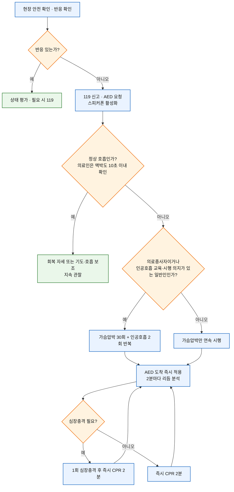
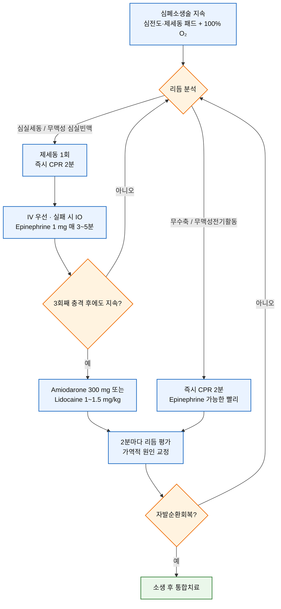

# 심폐소생술 CPR

## <mark style="color:green;">일반 사항</mark>

* 심장정지는 반응이 없고 정상 호흡이 없거나 심장정지 호흡(헐떡임)만 있는 상태로 임상적으로 인지한다. 심전도·맥박산소측정·검사 결과를 기다리느라 가슴압박을 지연하지 않는다.
* 생존사슬은 **심장정지 인지·구조요청 → 목격자 심폐소생술 → 제세동(심장충격) → 전문소생술·소생 후 치료 → 재활·회복**으로 이어진다.
* 치료의 핵심은 신속한 119 신고와 도움 요청, 고품질 가슴압박, 조기 제세동, 가역적 원인의 교정 및 체계적인 소생 후 치료이다.
* 이 챕터에서 **성인**은 사춘기 징후가 나타난 이후, **소아**는 1세부터 사춘기 징후가 나타나기 전, **영아**는 출생 후 1세 미만으로 구분한다. 출생 직후의 소생술은 신생아소생술 원칙을 따른다.


**이 챕터의 근거 틀** : 질병관리청·대한심폐소생협회의 **2025년 한국 심폐소생술 가이드라인**, **2025년 한국 심폐소생술 가이드라인 주요 개정 사항**, \*\*정오표 1차(2026.2.9.)\*\*를 반영하였음. 정오표에 따라 성인 전문소생술 알고리듬의 충격불필요리듬 분기를 **무수축/무맥성전기활동**으로 교정하였음


## <mark style="color:green;">원인</mark>

* 심장성 : 급성관상동맥증후군, 심실세동·심실빈맥, 심근병증, 심부전, 심근염, 유전성 부정맥 증후군
* 호흡·저산소성 : 기도폐쇄, 익수, 호흡부전, 중증 천식, 아나필락시스, 질식
* 순환성 : 출혈·저혈량, 폐색전증, 심장눌림증, 긴장성 기흉
* 대사·환경·중독 : 저체온, 저혈당, 산증, 저·고칼륨혈증, 약물·독성물질
* 외상, 감전, 임신 관련 원인 등

### <mark style="color:orange;">가역적 원인</mark>

| 6H                         | 5T                          |
| -------------------------- | --------------------------- |
| Hypovolemia 저혈량혈증          | Thrombosis 폐·관상동맥 혈전증       |
| Hypoxia 저산소증               | Tension pneumothorax 긴장성 기흉 |
| Hydrogen ion 산증            | Tamponade 심장눌림증             |
| Hypo-/hyperkalemia 저·고칼륨혈증 | Toxin 약물·독성물질               |
| Hypoglycemia 저혈당           | Trauma 외상                   |
| Hypothermia 저체온            |                             |

## <mark style="color:green;">임상 양상 및 심장정지 인지</mark>

* 환자의 어깨를 가볍게 두드리며 큰 소리로 반응을 확인한다.
* 반응이 없으면 즉시 주변에 도움을 요청하고 119 신고 및 자동제세동기를 요청한다. 휴대전화가 있으면 환자 곁에서 스피커폰으로 신고하고 구급상황요원의 지시를 따른다.
* 호흡이 없거나 헐떡임만 있으면 심장정지로 판단한다. 경련 직후 무반응·비정상 호흡도 심장정지일 수 있다.
* 의료종사자는 호흡과 목동맥 맥박을 **동시에 10초 이내** 확인한다. 맥박이 확실하지 않으면 가슴압박을 시작한다.

### <mark style="color:$danger;">🚩 Red Flags!</mark>

<mark style="color:$danger;">**즉각 조치 또는 의뢰**</mark>

* 반응이 없고 정상 호흡이 없거나 헐떡임만 있음
* 맥박이 없거나 10초 이내 확실히 확인되지 않음
* 무맥성 심실빈맥·심실세동, 무수축 또는 무맥성전기활동
* 심한 기도폐쇄 후 의식 소실
* 자발순환회복 후에도 저혈압, 저산소혈증, 의식저하, 재발성 부정맥 또는 경련

<mark style="color:$warning;">**당일 응급실 평가**</mark>

* 일시적 의식 소실 후 회복했으나 심장성 실신, 부정맥 또는 경련과의 감별이 필요한 경우
* 기도폐쇄 이물이 제거된 뒤에도 지속되는 기침·천명·호흡곤란, 연하통 또는 흉통
* 자발순환이 회복된 모든 심장정지 환자

<mark style="color:$info;">**외래 추적 / 추가 평가 계획**</mark>

* 심장정지 생존자의 심장·신경학적 원인평가, 인지·정서·피로·기능 평가와 재활
* 가족 심폐소생술·자동제세동기 교육, 유전성 부정맥 또는 돌연사 가족력 평가

심장정지 의심 단계는 외래에서 관찰할 상황이 아니다. 즉시 가슴압박과 제세동 준비를 시작하고, 119 및 의료기관 내 소생팀 호출을 동시에 시행한다.

***

## <mark style="background-color:$warning;">Management</mark>

### <mark style="color:orange;">1. 성인 기본소생술</mark>

<strong>성인 기본소생술 순서</strong>

#### <mark style="color:$primary;">고품질 가슴압박</mark>

| 항목     | 성인 기준                                                  |
| ------ | ------------------------------------------------------ |
| **위치** | 가슴 정중앙, 복장뼈 아래쪽 1/2. 주로 사용하는 손을 아래에 두고 다른 손을 포개어 깍지를 낌 |
| **깊이** | 약 5 cm, 6 cm를 넘지 않도록 함                                 |
| **속도** | 분당 100\~120회                                           |
| **이완** | 매 압박 후 가슴이 완전히 이완되게 하고 기대지 않음                          |
| **중단** | 최소화. 리듬·맥박 확인은 10초 이내, 가슴압박 분율은 최소 60% 이상으로 가능한 높게 유지  |
| **교대** | 2분마다 또는 30:2 다섯 주기마다 교대                                |
| **표면** | 가능하면 단단한 표면. 환자를 바닥으로 옮기느라 가슴압박을 지연하지 않음               |

* **인공호흡을 포함한 표준 심폐소생술을 시행할 때는** 전문기도기 삽입 전까지 **가슴압박 30회 : 인공호흡 2회**를 반복한다. 119구급대원을 포함한 의료종사자는 원칙적으로 이 표준 심폐소생술을 시행한다.
* 인공호흡은 1회마다 약 1초에 걸쳐 가슴이 올라오는 정도로 시행한다. 과환기는 정맥환류와 심박출량을 감소시키므로 피한다.
* 인공호흡 교육을 받았고 시행할 의지가 있는 일반인은 표준 심폐소생술을 한다. 교육받지 않았거나 시행하기 어려우면 가슴압박소생술만이라도 즉시 시행한다.
* 소아, 익수, 약물중독, 질식성 심장정지 또는 심장정지 시간이 오래된 경우에는 인공호흡을 포함한 표준 심폐소생술이 특히 중요하다.
* 맥박은 있으나 호흡이 없거나 부적절하면 **6초마다 1회(분당 10회)** 인공호흡하고 약 2분마다 맥박을 재평가한다.
* 2인 백마스크 환기는 한 명이 양손으로 기도·마스크 밀폐를 유지하고 다른 한 명이 가슴 상승이 보일 정도로 백을 누르는 방법이 가장 효과적이다.

### <mark style="color:orange;">2. 자동제세동기 사용</mark>

1. 전원을 켜고 음성지시를 따른다.
2. 환자의 맨가슴을 노출하고 물기·땀을 닦는다. 약물 패치는 제거하고 피부를 닦으며, 삽입형 심박동기·제세동기 바로 위는 피한다.
3. 한 패드는 오른쪽 빗장뼈 아래, 다른 패드는 왼쪽 젖꼭지 아래 중간겨드랑이선에 부착한다. 패드가 서로 닿을 정도로 작은 소아는 앞뒤 위치를 사용한다.
4. 여성은 브래지어를 일률적으로 풀거나 제거하지 않고 위치를 조정하여 가슴조직을 피한 맨가슴에 패드를 부착한다.
5. 리듬 분석 중 누구도 환자에게 닿지 않게 한다.
6. 충격이 필요하면 모두 떨어졌는지 확인한 뒤 충격 버튼을 누른다.
7. 충격 시행 여부와 관계없이 즉시 가슴압박부터 심폐소생술을 2분간 재개한다.


**⚠️ 자동제세동기 안전** : 산소가 환자의 가슴 위로 직접 흐르지 않게 하고, 분석·충격 순간에는 환자와 접촉하지 않는다. 물웅덩이 안에서는 시행하지 않지만 젖은 환자를 안전한 곳으로 옮겨 가슴을 닦은 뒤에는 사용할 수 있다.


### <mark style="color:orange;">3. 성인 전문소생술</mark>

<strong>성인 심장정지 전문소생술 알고리듬</strong>

<em><mark style="color:$info;">정오표 1차(2026.2.9.)에 따라 충격불필요리듬을 무수축/무맥성전기활동으로 교정</mark></em>

#### <mark style="color:$primary;">공통 처치</mark>

* 고품질 심폐소생술을 지속하면서 심전도·제세동 패드를 부착하고 리듬을 **2분마다** 평가한다.
* 전문기도기 삽입 전에는 30:2로 시행하고 100% 산소를 투여한다. 전문기도기 삽입 후에는 가슴압박을 중단하지 않고 분당 100\~120회, 인공호흡은 **6초마다 1회** 시행한다.
* 기관내삽관 시 파형 호기말이산화탄소분압으로 위치를 확인하고 심폐소생술의 질과 자발순환회복을 감시한다. 갑작스럽고 지속적인 ETCO₂ 상승은 자발순환회복을 시사할 수 있다.
* 약물 경로는 **정맥로를 먼저 시도**하고 실패하면 골내주사를 고려한다. 말초정맥 약물 투여 뒤 NaCl 0.9% 20 mL를 추가 주입한다.
* 기도 확보 시 가슴압박 중단을 최소화한다. 기관내삽관 경험이 부족하면 백마스크 또는 성문상기도기를 사용한다.

#### <mark style="color:$primary;">충격필요리듬 : 심실세동·무맥성 심실빈맥</mark>

* 양방향 파형 제세동기 **120\~200 J** 또는 제조사 권장 에너지로 1회 제세동한다. 권장량을 모르면 200 J를 사용한다. 일방향 파형은 360 J이다.
* 제세동 후 리듬·맥박을 즉시 확인하지 말고 바로 2분간 심폐소생술을 한다. 이후 충격은 이전과 같거나 더 높은 에너지로 시행하며 최대에너지까지 사용할 수 있다.
* Epinephrine은 제세동을 지연시키지 않으면서 제세동 후 투여한다. 2025 한국 알고리듬은 첫 충격 후 CPR 주기 중 IV/IO 확보 및 epinephrine 투여를 제시한다.
* **3회 이상 연속 제세동 후에도** 심실세동·무맥성 심실빈맥이 지속되고, 훈련된 인력과 여분의 패드·제세동기가 즉시 준비되면 경험 많은 의사의 판단으로 벡터변화제세동 또는 이중연속제세동을 고려할 수 있다. 이중연속제세동은 한 명이 두 제세동기를 순서대로 작동한다.

#### <mark style="color:$primary;">충격불필요리듬 : 무수축·무맥성전기활동</mark>

* 즉시 심폐소생술을 시작하고 epinephrine을 가능한 빨리 투여한다.
* 2분마다 리듬을 재평가하되 가슴압박 중단을 최소화하고, 6H·5T를 적극적으로 찾아 교정한다.
* 충격필요리듬으로 바뀌면 즉시 해당 경로로 전환한다. 무수축 자체에는 제세동하지 않는다.

### <mark style="color:orange;">4. 심장정지 약물</mark>

| 약물                    | 성인 심장정지 용법                                                      | 주요 사항                                                      |
| --------------------- | --------------------------------------------------------------- | ---------------------------------------------------------- |
| **Epinephrine**       | 1 mg IV/IO, 3\~5분마다 반복                                          | 충격불필요리듬에서는 가능한 빨리. 충격필요리듬에서는 신속한 제세동 우선. 고용량 routine 투여 금지 |
| **Amiodarone**        | 불응성 VF/pVT에 300 mg IV/IO, 필요 시 150 mg 1회 추가                     | Lidocaine과 동시에 사용하지 않음                                     |
| **Lidocaine**         | 1\~1.5 mg/kg IV/IO, 필요 시 5\~10분마다 0.5\~0.75 mg/kg; 총 최대 3 mg/kg | Amiodarone 대안                                              |
| **Magnesium sulfate** | Routine 사용하지 않음                                                 | 비틀림심실빈맥 또는 저마그네슘혈증 등 특정 적응증에서 고려                           |


**⚠️ 농도 오류 예방** : 심장정지 성인 epinephrine 용량은 **1 mg IV/IO**이다. 아나필락시스의 **1 mg/mL 대퇴부 IM 0.01 mg/kg(최대 0.5 mg)** 용법과 혼동하지 않는다. 심정지용 주사제의 농도와 총량을 투여 전 독립적으로 재확인한다.


#### <mark style="color:$primary;">Routine 투여하지 않는 약물·처치</mark>

* Vasopressin 단독 또는 epinephrine과의 병용
* 표준 치료에 vasopressin·corticosteroid 추가
* 특별한 적응증이 없는 sodium bicarbonate 등 완충제
* 특별한 적응증이 없는 calcium
* 심장정지 중 magnesium의 일상적 사용
* 현장초음파·기계 심폐소생술의 일상적 사용

현장초음파는 숙련자가 가슴압박을 방해하지 않으면서 임상적으로 의심되는 가역적 원인을 확인할 때만 보조적으로 사용한다. 고품질 수동 압박이 어렵거나 구조자 안전이 위협되는 환경에서는 기계 심폐소생술을 대안으로 고려할 수 있다. 표준 심폐소생술에 반응하지 않는 선택된 환자는 가능한 기관에서 ECPR을 고려한다.

### <mark style="color:orange;">5. 소아·영아 기본소생술</mark>

| 항목             | 영아                                                         | 소아                                           |
| -------------- | ---------------------------------------------------------- | -------------------------------------------- |
| **압박 위치**      | 젖꼭지 연결선 바로 아래 흉골                                           | 흉골 아래쪽 1/2                                   |
| **압박법**        | 양손 감싼 두 엄지 압박법 우선                                          | 한 손 또는 두 손 손꿈치                               |
| **깊이**         | 가슴 전후 두께 최소 1/3, 약 4 cm                                    | 가슴 전후 두께 최소 1/3, 약 4\~5 cm                   |
| **속도**         | 분당 100\~120회, 완전한 이완, 중단 최소화                               |                                              |
| **1인 구조자**     | 인공호흡이 가능한 구조자는 30:2; 인공호흡을 할 수 없거나 꺼리는 일반인은 가슴압박만이라도 즉시 시작 |                                              |
| **2인 의료종사자**   | 15:2                                                       |                                              |
| **전문기도기 후 환기** | 30회/분                                                      | 1\~8세 20\~30회/분; 8\~18세는 임상 판단에 따라 10\~20회/분 |

* 소아·영아는 질식성 심장정지가 흔하므로 인공호흡을 포함한 심폐소생술이 특히 중요하다. 인공호흡이 불가능하면 가슴압박만이라도 시작하고 가능한 즉시 인공호흡을 병행한다.
* 의료종사자는 호흡과 맥박을 동시에 10초 이내 확인한다. 맥박이 없거나, 적절한 산소화·환기에도 맥박이 분당 60회 미만이고 관류불량 징후가 지속되면 가슴압박을 시작한다.
* 구조자가 혼자이고 휴대전화가 없으며 갑작스러운 목격성 허탈이 아니라면 2분간 심폐소생술 후 119 신고와 자동제세동기 확보를 위해 이동한다. 갑작스러운 목격성 허탈이면 조기 제세동을 우선할 수 있다.
* **1세 이상 비외상성 병원 밖 심장정지**에는 일반인도 자동제세동기를 적극 사용한다. 1세 미만도 가능하면 조기에 적용하며, 소아용 감쇠기·패드가 없으면 성인용을 사용하되 패드가 서로 닿지 않게 앞뒤로 부착한다.

### <mark style="color:orange;">6. 소아 전문소생술</mark>

| 치료                    | 소아 용법                                                           |
| --------------------- | --------------------------------------------------------------- |
| **제세동**               | 첫 2 J/kg → 두 번째 4 J/kg → 이후 단계적 증량; 10 J/kg 미만 또는 성인 최대용량 이하    |
| **Epinephrine**       | 0.01 mg/kg IV/IO(0.1 mg/mL 용액 0.1 mL/kg), 최대 1 mg; 3\~5분마다 반복   |
| **Amiodarone**        | 불응성 VF/pVT에 5 mg/kg IV/IO, 최대 300 mg; 필요 시 총 3회, 1일 최대 15 mg/kg |
| **Lidocaine**         | 1 mg/kg IV/IO; amiodarone과 병용하지 않음                              |
| **Magnesium sulfate** | 비틀림심실빈맥·저마그네슘혈증에 25\~50 mg/kg IV/IO, 최대 2 g                     |

* 충격불필요리듬이면 epinephrine을 가능한 빨리 투여하고 2분마다 리듬을 재평가한다.
* 충격필요리듬이면 제세동 후 즉시 2분간 심폐소생술을 재개한다. 불응성 VF/pVT에는 amiodarone 또는 lidocaine 중 하나를 선택한다.
* 혈관로 확보는 전문기도기보다 우선하며, 정맥로 또는 골내주사를 사용한다.
* 소아 서맥은 대개 저산소증의 결과이므로 먼저 기도·산소화·환기를 교정한다. 적절한 환기·산소화에도 맥박 <60회/분과 관류불량이 지속되면 가슴압박과 epinephrine을 시행한다.

### <mark style="color:orange;">7. 이물에 의한 기도폐쇄</mark>

| 상태                                                   | 처치                                                 |
| ---------------------------------------------------- | -------------------------------------------------- |
| 
<strong>가벼운 폐쇄</strong> 큰 기침·말·호흡 가능
       | 자발 기침을 격려하고 방해하지 않으며 악화를 관찰                        |
| 
<strong>심한 폐쇄</strong> 효과적 기침·말·호흡 불가, 청색증
 | 성인·1세 이상 소아: 등 두드리기 5회 → 효과 없으면 복부 밀어내기 5회, 반복     |
| **임신부·고도비만**                                         | 등 두드리기 5회 → 효과 없으면 복부 대신 가슴 밀어내기 5회                |
| **1세 미만 영아**                                         | 등 두드리기 5회와 가슴 밀어내기 5회를 반복; 복부 밀어내기 금지              |
| **의식 소실**                                            | 바닥에 눕히고 119·AED 요청 후 가슴압박부터 CPR. 입을 열 때 보이는 이물만 제거 |

* 보이지 않는 이물을 손가락으로 맹목적으로 훑어내지 않는다.
* 흡인식 기도폐쇄 제거장치는 근거와 안전성이 충분하지 않아 일상적으로 사용하지 않는다.
* 이물 제거 후에도 증상이 남거나 복부·가슴 밀어내기를 시행했다면 손상 및 잔류 이물 가능성을 평가한다.

### <mark style="color:orange;">8. 특수상황</mark>

#### <mark style="color:$primary;">익수</mark>

* 구조자 안전을 우선하고 가능한 빨리 물 밖의 단단한 표면으로 이동한다.
* 교육받은 일차반응자·의료종사자는 **인공호흡부터** 시작하고 이후 가슴압박과 인공호흡을 함께 시행한다. 고농도 산소를 가능한 빨리 투여한다.
* 인공호흡이 불가능한 일반인은 가슴압박만이라도 시행한다. 환자의 가슴을 닦은 뒤 가능한 한 빨리 자동제세동기를 적용한다.
* 물을 빼기 위한 복부 압박은 시행하지 않는다.

#### <mark style="color:$primary;">아나필락시스</mark>

* 심정지 전에는 대퇴부 IM epinephrine, 산소, 기도관리와 신속한 수액이 우선이다. 심정지가 발생하면 표준 CPR로 전환하고 **심장정지 epinephrine 용량**을 사용한다.
* 진행성 기도부종에는 조기 기도 전문가를 호출하고, 난치성 심정지는 ECPR 가능 기관과 조기 협의한다.

#### <mark style="color:$primary;">임신</mark>

* 표준 깊이·속도로 바로누운 자세에서 가슴압박하고, 임신 20주 이상 또는 자궁저가 배꼽 위에서 만져지면 자궁을 수동으로 왼쪽 이동시킨다.
* 표준 에너지로 제세동하며 태아 모니터 장치는 제거한다. 산소화·기도 확보를 조기에 시행한다.
* 초기 4분간 심폐소생술에도 자발순환이 회복되지 않으면 가능한 빨리 소생 목적 자궁절개분만을 시작하도록 산과·마취·신생아팀을 즉시 호출한다.

#### <mark style="color:$primary;">고위험 병원체 감염 의심</mark>

* 의료종사자는 N95급 호흡보호구, 장갑, 방수성 긴팔 가운, 고글 또는 안면보호구 등 공기전파 차단 개인보호구를 착용한다.
* 보호구 착용과 팀 호출을 병행하되 가능한 빨리 제세동하고, 헤파필터가 연결된 백마스크·전문기도기를 사용한다. 인원은 필요한 최소한으로 제한한다.

### <mark style="color:orange;">9. 자발순환회복 후 치료</mark>

1. 기도·호흡을 안정화한다. 산소포화도 또는 PaO₂를 정확히 측정할 때까지 100% 산소를 투여한 뒤 \*\*SpO₂ 94\~98%\*\*가 되도록 FiO₂를 낮춘다.
2. PaCO₂는 **35\~45 mmHg**로 유지한다.
3. 저혈압을 교정하고 **평균동맥압 최소 60\~65 mmHg**를 유지한다. 원인과 심기능에 따라 수액·vasopressor·inotrope를 개별화한다.
4. 12유도 심전도, 심초음파 및 원인에 따른 검사를 시행한다. ST 분절 상승 또는 심인성 쇼크가 있으면 응급 관상동맥조영술을 시행한다. ST 상승이 없는 안정된 무반응 환자에게 일률적인 조기 관상동맥조영술은 권고하지 않는다.
5. 자발순환회복 후 혼수이면 **33\~37.5℃** 중 목표온도를 정해 최소 24시간 일정하게 유지한다. 충격불필요리듬인 병원 밖 심장정지는 33℃를 고려할 수 있다. 혼수가 지속되면 36\~72시간 발열을 적극 예방한다.
6. 병원 전 대량의 차가운 수액을 빠르게 주입하는 냉각은 시행하지 않는다.
7. 혈당은 **144\~180 mg/dL** 범위를 고려하고 저혈당은 즉시 교정한다.
8. 임상 발작 또는 뇌파발작은 치료하되 예방적 항발작약, 예방적 항생제 또는 steroid를 일상적으로 투여하지 않는다.
9. 신경학적 예후는 진정제·체온·대사 이상 등의 교란요인을 배제하고 임상진찰, 뇌파, SSEP, 생체표지자, CT/MRI를 결합하여 다중양식으로 평가한다. 단일 소견만으로 조기에 치료 제한을 결정하지 않는다.

### <mark style="color:orange;">10. 신생아소생술 연결 원칙</mark>

출생 직후 신생아는 성인·소아 CPR과 다른 알고리듬을 적용한다.

* 만삭인가, 근긴장도가 양호한가, 호흡하거나 우는가를 신속히 평가한다. 모두 충족하면 통상적 처치와 관찰을 한다.
* 무호흡·헐떡임 또는 심박수 <100회/분이면 보온, 자세·기도 확보, 건조·자극 후 **출생 60초 이내 효과적인 양압환기**를 시작한다.
* 30초간 효과적인 양압환기 후 심박수 <60회/분이면 기도를 확보하고 **가슴압박 3 : 환기 1**로 시행하며 100% 산소를 사용한다.
* 60초간 조화된 압박·환기 후에도 심박수 <60회/분이면 epinephrine과 저혈량 평가·치료를 고려한다.

## <mark style="color:green;">비-약물 치료 및 사후 관리</mark>

### <mark style="color:orange;">팀 기반 소생술</mark>

* 팀리더는 역할을 가슴압박, 기도·환기, 제세동·모니터, IV/IO·약물, 기록으로 명확히 배정한다.
* 지시는 이름을 지정해 폐쇄형 의사소통으로 전달하고, 투여 약물·용량·시간과 제세동 횟수·에너지를 소리 내어 재확인한다.
* 가능한 경우 압박 깊이·속도·이완을 보여주는 실시간 피드백 장치를 사용한다.
* 소생술 후 짧은 팀 디브리핑으로 시작 지연, 압박 중단, 제세동·약물 오류 및 장비 문제를 검토한다.

### <mark style="color:orange;">의원급 응급카트 점검</mark>

| 영역           | 필수 점검 항목                                                                 |
| ------------ | ------------------------------------------------------------------------ |
| **호출·기록**    | 119 연락수단, 역할카드, 시간기록지                                                    |
| **가슴압박·제세동** | AED 또는 수동제세동기, 성인·소아 패드, 면도기·수건, 피드백 장치 가능 시                             |
| **기도·호흡**    | 산소, 성인·소아 백마스크, 마스크 크기별 세트, OPA/NPA, 흡인기, 성문상기도기, 헤파필터                   |
| **순환·약물**    | IV 세트, NaCl 0.9%, epinephrine, amiodarone 또는 lidocaine, glucose, 원인별 응급약 |
| **보호구**      | N95급 마스크, 장갑, 방수 가운, 안면보호구                                               |

* 제세동기 배터리·패드 유효기간, 산소 잔량, 흡인기 작동, 약물 농도·유효기간을 정기적으로 확인한다.
* 아나필락시스용 epinephrine 1 mg/mL와 심장정지용 제제를 물리적으로 구분하고 용량표를 부착한다.
* 성인·소아 심정지 모의훈련을 정기적으로 시행하고, 자동제세동기 위치와 119 신고 주소·출입동선을 전 직원이 숙지한다.

### <mark style="color:orange;">심장정지 생존자 추적</mark>

* 퇴원 전과 추적 시 인지기능, 운동·일상생활 기능, 피로, 불안·우울·외상후 스트레스, 수면 및 가족 부담을 평가한다.
* 원인에 따라 심장재활, 신경재활, 정신건강 지원과 직업·운전 복귀 상담을 연계한다.
* 가족에게 심폐소생술·자동제세동기 사용법, 재발 시 행동계획 및 유전상담 필요성을 교육한다.

## <mark style="color:green;">환자 안내서/복약지도</mark>


**심정지가 의심될 때**

1. 쓰러진 사람 주변이 안전한지 확인합니다.
2. 어깨를 두드리며 큰 소리로 반응을 확인합니다.
3. 반응이 없으면 즉시 119에 신고하고 주변 사람에게 자동심장충격기를 가져오도록 요청합니다. 휴대전화를 스피커폰으로 켜고 상담원의 지시를 따릅니다.
4. 정상적으로 숨 쉬지 않거나 헐떡이기만 하면 가슴 중앙을 **분당 100\~120회, 약 5 cm 깊이**로 강하고 빠르게 누릅니다.
5. 인공호흡 교육을 받았다면 가슴압박 30회와 인공호흡 2회를 반복합니다. 어렵다면 가슴압박만 계속합니다.
6. 자동심장충격기가 도착하면 전원을 켜고 음성지시를 따릅니다. 심장충격 직후에는 즉시 가슴압박을 다시 시작합니다.
7. 구급대가 인계받거나 환자가 정상적으로 호흡하고 움직일 때까지 계속합니다.



헐떡이는 숨은 정상 호흡이 아닙니다. 맥박을 찾느라 시간을 보내거나, 물·약을 먹이거나, 환자를 세워 걷게 하지 마십시오. 자동심장충격기는 심장충격이 필요하지 않으면 충격하지 않으므로 두려워하지 말고 가능한 빨리 부착하십시오.


## <mark style="color:green;">예방</mark>

* 고혈압, 당뇨병, 이상지질혈증, 흡연, 비만과 수면무호흡을 관리하고 급성관상동맥증후군 경고증상을 교육한다.
* 심계항진·운동 중 실신·원인불명 실신, 돌연사 가족력은 부정맥·구조적 심질환을 평가한다.
* 공공장소·직장의 자동제세동기 위치를 확인하고 가족·직원에게 정기적으로 심폐소생술 교육을 제공한다.
* 영유아 기도폐쇄 예방을 위해 작은 음식·부품·풍선 등을 연령에 맞게 관리하고 앉은 자세에서 천천히 먹게 한다.
* 익수 예방을 위해 보호자 직접 감시, 구명조끼, 수영장 차단시설과 음주 후 수영 금지를 교육한다.

### 질병코드

<mark style="color:red;">I46.0</mark> 성공적으로 소생된 심장정지(Cardiac arrest with successful resuscitation)

<mark style="color:red;">I46.1</mark> 급성 심장사로 기술된 것(Sudden cardiac death, so described)

<mark style="color:red;">I46.9</mark> 상세불명의 심장정지(Cardiac arrest, unspecified)

## <mark style="color:green;">Reference</mark>

* 질병관리청·대한심폐소생협회. **2025년 한국 심폐소생술 가이드라인**. 2026.
* 질병관리청·대한심폐소생협회. **2025년 한국 심폐소생술 가이드라인 정오표 1차**. 2026.2.9.
* 황성오 외. **2025년 한국 심폐소생술 가이드라인의 주요 개정 사항**. 주간 건강과 질병. 2026;19(6):304-319.
