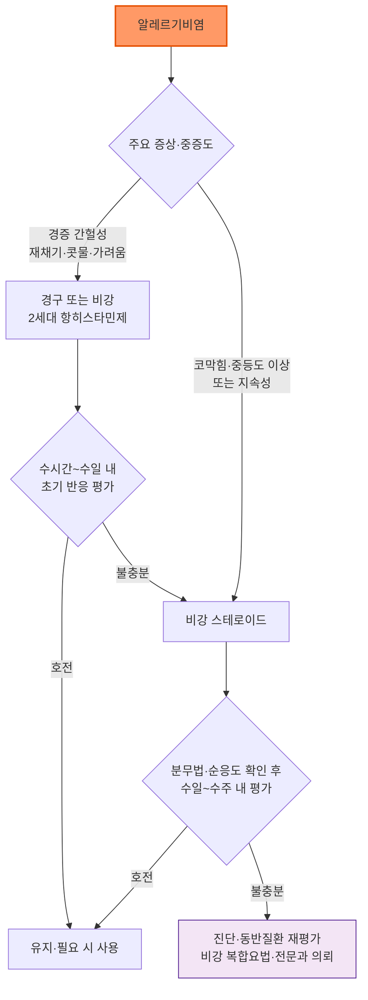
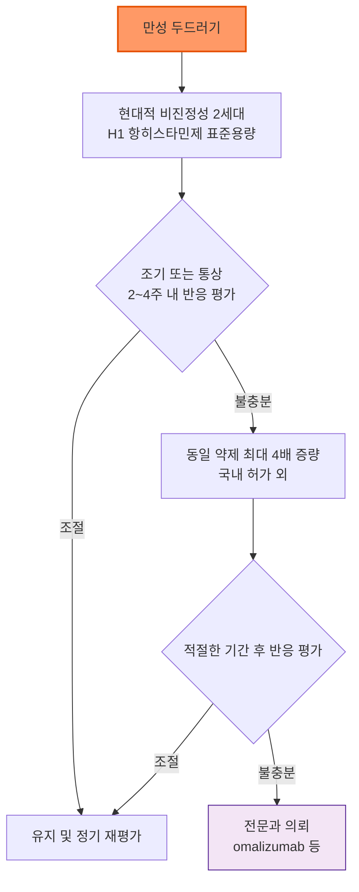

# 항히스타민제 Antihistamines

## <mark style="color:green;">일반 사항</mark>

* histamine H1 수용체 길항 작용으로 재채기, 콧물, 코·눈 가려움, 팽진(wheal) 및 소양증을 완화하는 약물군
* 분류 : 1세대(진정성) — 혈액뇌장벽 통과, 항콜린 작용 큼 / 2세대(비진정성 또는 저진정성) — 혈액뇌장벽 통과 적음, 항콜린 작용 적음
* 주요 적응증 : 알레르기비염, 알레르기결막염, 급성·만성 두드러기, 아나필락시스의 피부·점막 증상 보조 치료
* 일부 성분은 항히스타민제 본래 목적이 아닌 멀미·현훈(dimenhydrinate, meclizine), 수면유도(doxylamine), 수면유지 불면증(저용량 doxepin) 목적으로도 사용됨 — 이 챕터에서는 이를 알레르기 치료제와 구분하여 별도 표로 제시함
* 항히스타민제는 코막힘에 대한 효과가 제한적이며, 천식성 기관지수축 및 아나필락시스의 기도폐쇄·저혈압·쇼크를 치료하지 못함 (☞ Red Flags, Management 참고)

***

### <mark style="color:$danger;">🚩 Red Flags!</mark>

<mark style="color:$danger;">**즉각 조치 또는 의뢰**</mark>

* 아나필락시스 의심(기도폐쇄, 천명, 저혈압, 의식 저하) — 항히스타민제로 대체하지 말고 **즉시 IM epinephrine** 투여 후 응급 이송
* 항히스타민제 복용 후 실신, 심한 심계항진 또는 다형성 심실빈맥(torsades de pointes) 의심 소견 — 즉시 원인 약물 중단 및 응급 평가

<mark style="color:$warning;">**당일 또는 조기 의뢰**</mark>

* QT 연장 위험인자(선천성·후천성 QT 연장, 전해질 이상, 구조적 심질환, 서맥, QT 연장 약물 병용)가 있는 환자에서 hydroxyzine·mizolastine 사용을 고려하는 경우 → 가급적 회피·대체하고, 투여가 불가피하면 심전도·전해질 평가. Ebastine·rupatadine 등은 고용량, 전해질 이상 및 CYP3A4 억제제 병용 등 제품별 조건부 위험을 확인
* 2세 미만 소아에게 promethazine이 투여된 경우, 소아에게 진정성 항히스타민제를 수면 유도 목적으로 임의 사용한 경우, 또는 호흡억제·과도한 진정·역설적 흥분이 나타난 경우 → 즉시 중단 및 재평가
* 두드러기와 함께 발열, 관절통, 개별 병변이 24시간 이상 지속되거나 소실 후 색소침착을 남기는 경우 → 두드러기혈관염 등 감별 위해 의뢰

<mark style="color:$info;">**외래 추적 / 추가 평가 계획**</mark> <mark style="color:$info;">- 즉각 위험 낮으나 호전 없으면 의뢰</mark>

* 적절한 비강 스테로이드 치료 후에도 중등도·중증 비염 증상이 지속되는 경우 → 진단, 유발인자, 순응도·분무법, 비중격만곡·비용종·만성부비동염 및 천식 동반 여부를 재평가하고, 면역치료 또는 전문적 평가가 필요하면 의뢰
* 만성 두드러기가 표준용량 4배 증량에도 반응하지 않는 경우 → 알레르기내과·피부과 의뢰(omalizumab 등 차기 치료 고려)

***

## <mark style="background-color:$warning;">Management</mark>

### <mark style="color:orange;">알레르기비염</mark>

<table><thead><tr><th width="90">단계</th><th width="280">핵심 치료</th><th>대상·재평가</th></tr></thead><tbody><tr><td>Step 1</td><td>재채기·콧물·가려움이 주된 경증 간헐성 비염: 경구 또는 비강 2세대 H1 항히스타민제</td><td>증상 발생 양상과 환자 선호에 따라 선택. 수시간\~수일 내 초기 반응 확인</td></tr><tr><td>Step 2</td><td>비강 스테로이드</td><td>코막힘이 뚜렷하거나 중등도·중증 또는 지속성 비염. 정확한 분무법과 순응도 확인 후 수일\~수주 내 평가</td></tr><tr><td>Step 3</td><td>비강 스테로이드/비강 항히스타민제 복합요법 또는 전문과 의뢰</td><td>적절한 비강 스테로이드에도 불충분하면 진단·동반질환을 재평가하고 복합요법, 면역치료 등을 고려</td></tr></tbody></table>

### <mark style="color:orange;">만성 두드러기</mark>

<table><thead><tr><th width="90">단계</th><th width="280">핵심 치료</th><th>대상·재평가</th></tr></thead><tbody><tr><td>Step 1</td><td>현대적 비진정성 2세대 H1 항히스타민제 표준용량</td><td>1차 치료. 증상 중증도에 따라 조기에 또는 통상 2\~4주 내 평가</td></tr><tr><td>Step 2</td><td>동일 약제를 최대 표준용량의 4배까지 증량</td><td>Step 1 반응 불충분. 국내 허가사항을 벗어난 용법</td></tr><tr><td>Step 3</td><td>omalizumab 등 다음 단계 치료 — 전문과 의뢰</td><td>충분한 증량에도 조절되지 않는 경우</td></tr></tbody></table>


**두드러기 4배 증량 요법은 국내 허가사항을 벗어난 용법**\
최신 국제 지침(EAACI/GA²LEN/EuroGuiDerm/APAAACI, 2026)은 만성 자발성 두드러기에서 표준용량의 현대적 비진정성 2세대 H1 항히스타민제에 반응하지 않으면 동일 성분을 최대 4배까지 증량할 것을 권고하지만, 이는 국내 허가사항을 벗어난 용법이다. 약제별 고용량 유효성·안전성 근거는 서로 다르므로 국내 허가사항, 신·간기능, 진정 가능성, 상호작용 및 성분별 심장 위험을 평가한다. 서로 다른 항히스타민제를 임의로 병용하기보다 한 약제를 단계적으로 증량하며, 4배를 초과하지 않는다. Hydroxyzine·ketotifen 등은 이 증량 원칙의 대상이 아니다.


***



<p align="center"><strong>알레르기비염 치료 알고리듬</strong></p>



<p align="center"><strong>만성 두드러기 치료 알고리듬</strong></p>

<p align="center"><em><mark style="color:$info;">Ref. EAACI/GA²LEN/EuroGuiDerm/APAAACI Urticaria Guideline. Allergy. 2026. doi:10.1111/all.70210</mark></em></p>

***

## <mark style="color:green;">약물 치료</mark>

성인 대표 용량을 기준으로 하였다. 소아의 허가연령·용량은 성분만으로 결정하지 말고 **제품·제형·적응증별 국내 허가사항**을 반드시 확인한다. 정제·시럽·점적액의 허가연령이 서로 다를 수 있다.

### <mark style="color:orange;">경구 2세대 H1 항히스타민제(일부 저진정성·진정성 성분 포함)</mark>

<table><thead><tr><th width="190">성분명 [대표 상품명]</th><th width="60">진정</th><th width="140">성인 대표 용량</th><th>주요 복약지도·주의</th></tr></thead><tbody>
<tr><td>cetirizine <mark style="color:blue;">\[지르텍]</mark></td><td>+</td><td>10 ㎎ qd</td><td>졸음 가능. 주로 신배설 — 신기능에 따라 감량. 소아 대표 허가연령 2세\~(제형에 따라 다를 수 있음)</td></tr>
<tr><td>levocetirizine <mark style="color:blue;">\[씨잘]</mark></td><td>+</td><td>5 ㎎ qd</td><td>졸음 가능. 신기능 저하 시 감량. <span style="color:red">말기 신질환(CrCl 10 mL/min 미만) 및 투석 환자 금기</span></td></tr>
<tr><td>loratadine <mark style="color:blue;">\[클라리틴]</mark></td><td>-</td><td>10 ㎎ qd</td><td>진정 적음. 중증 간기능 저하 시 투여간격 조절 고려. 소아 대표 허가연령 2세\~(제형에 따라 다를 수 있음)</td></tr>
<tr><td>desloratadine <mark style="color:blue;">\[에리우스]</mark></td><td>-</td><td>5 ㎎ qd</td><td>진정 적음. 중증 간·신기능 저하 시 제품 허가사항 확인. 소아 대표 허가연령 1세\~(제형에 따라 다를 수 있음)</td></tr>
<tr><td>fexofenadine <mark style="color:blue;">\[알레그라]</mark></td><td>-</td><td>120 ㎎ qd 또는 180 ㎎ qd<sup>1)</sup></td><td>진정 매우 적음. 물과 함께 공복 복용 (☞ 복약지도 참고)</td></tr>
<tr><td>bilastine</td><td>-</td><td>20 ㎎ qd</td><td>공복 복용(식전 1시간 또는 식후 2시간). 과일주스와 함께 복용하지 않음. 국내 상품명은 유통 시점 확인</td></tr>
<tr><td>ebastine <mark style="color:blue;">\[에바스텔]</mark></td><td>±</td><td>10 ㎎ qd</td><td>일부 환자에서 졸음. 간기능 및 QT 위험 약물 확인</td></tr>
<tr><td>epinastine <mark style="color:blue;">\[알레지온]</mark></td><td>+</td><td>20 ㎎ qd</td><td>졸음 가능. 국내 10 ㎎·20 ㎎ 제제가 있어 제품별 용법 확인</td></tr>
<tr><td>rupatadine <mark style="color:blue;">\[루파핀]</mark></td><td>±</td><td>10 ㎎ qd</td><td>CYP3A4 기질 — 자몽주스·강력한 CYP3A4 억제제 병용 주의. 심장 위험을 hydroxyzine과 같은 수준으로 간주하지 않으며 제품별 허가사항 확인</td></tr>
<tr><td>olopatadine <mark style="color:blue;">\[알레락]</mark></td><td>±</td><td>5 ㎎ bid</td><td>졸음 가능. 경구제와 점안·비강 제제는 용량·근거가 다르므로 구분</td></tr>
<tr><td>bepotastine</td><td>±</td><td>10 ㎎ bid</td><td>졸음 가능. 신기능 저하 시 제품 허가사항 확인. 국내 다수 상품 유통(대표 브랜드 특정하지 않음)</td></tr>
<tr><td>mizolastine <mark style="color:blue;">\[미졸렌]</mark></td><td>±</td><td>10 ㎎ qd</td><td><span style="color:red">QT 연장 위험</span> — 기존 QT 연장, 심질환, 전해질 이상 및 QT 연장 약물 병용 여부 확인. 12세 미만 자료 제한적</td></tr>
<tr><td>ketotifen <mark style="color:blue;">\[자디텐]</mark></td><td>+</td><td>1 ㎎ bid</td><td>mast-cell stabilizing 작용 동반. 현대적 비진정성 2세대 약제와 성격이 다르며 만성 두드러기의 4배 증량 원칙에 포함하지 않음. 증량은 해당 제품 허가사항 확인</td></tr>
<tr><td>azelastine 경구 <mark style="color:blue;">\[아젭틴]</mark></td><td>+</td><td>1\~2 ㎎ bid</td><td>졸음 가능. **경구 정제이며 azelastine 비강분무제와는 용량·근거가 다름** — 혼동 주의</td></tr>
<tr><td>acrivastine</td><td>±</td><td>8 ㎎ tid</td><td>작용시간이 짧아 1일 3회 필요(qid 아님). 해외에서는 주로 pseudoephedrine 복합제로 유통되며 단일제가 드묾 — 국내 유통 여부·제품명은 처방 전 확인</td></tr>
</tbody></table>

<sup>1)</sup> fexofenadine은 국내 함량별 허가 적응증이 다를 수 있다. 대표적으로 120 ㎎은 알레르기비염, 180 ㎎은 알레르기성 피부질환(만성 특발성 두드러기) 관련 증상에 사용되므로 처방 전 해당 제품 허가사항을 확인한다.

> **Fexofenadine 복약지도**
>
> * 자몽·오렌지·사과주스는 흡수를 감소시키므로 물과 함께 복용한다.
> * 알루미늄·마그네슘 함유 제산제와는 최소 2시간 간격을 둔다.

### <mark style="color:orange;">1세대 및 진정성 H1 항히스타민제</mark>


**⚠️ 고령자 원칙적 회피**\
2023 AGS Beers Criteria는 아래 표의 대부분 성분을 고령자에서 피해야 할 강한 항콜린성 약물로 분류한다. 급성 중증 알레르기 반응 등 제한된 상황의 단기 사용 외에는, 고령자의 일상적 알레르기 치료에 1세대 항히스타민제를 사용하지 않는다.


<table><thead><tr><th width="190">성분명 [대표 상품명]</th><th width="200">성인 대표 용량</th><th>주요 주의사항</th></tr></thead><tbody>
<tr><td>brompheniramine</td><td>속방형 4 ㎎ q4\~6h; 서방형 12 ㎎ bid</td><td>제형 구분 필요. 졸음·항콜린 부작용</td></tr>
<tr><td>chlorpheniramine <mark style="color:blue;">\[페니라민]</mark></td><td>2\~4 ㎎, 1일 2\~4회</td><td>제품별 1일 최대용량 확인. 소아는 제형별 용량 사용, 감기 복합제 중복 성분 확인</td></tr>
<tr><td>clemastine <mark style="color:blue;">\[마스질]</mark></td><td>1 ㎎ bid</td><td>졸음·항콜린 부작용</td></tr>
<tr><td>cyproheptadine</td><td>4 ㎎ tid</td><td>졸음, 식욕·체중 증가, 항콜린 부작용</td></tr>
<tr><td>diphenhydramine</td><td>적응증·제형별 용법 확인</td><td>강한 진정·항콜린 작용. 소아 수면 유도 목적 사용 금지</td></tr>
<tr><td>hydroxyzine <mark style="color:blue;">\[아디팜]</mark></td><td>피부과 영역 30\~60 ㎎/day, 2\~3회 분할<sup>2)</sup></td><td><span style="color:red">QT 연장</span>. 가능한 최단 기간·최소 유효용량 (☞ 심장 안전성 참고)</td></tr>
<tr><td>mequitazine <mark style="color:blue;">\[프리마란]</mark></td><td>5 ㎎ bid</td><td>페노티아진 유도체 — 진정·항콜린 작용 및 QT 위험인자 확인</td></tr>
<tr><td>piprinhydrinate <mark style="color:blue;">\[푸라콩]</mark></td><td>3 ㎎, 1일 1\~3회</td><td>졸음·항콜린 부작용. 현재 공급 여부 확인</td></tr>
<tr><td>promethazine</td><td>적응증·제형별 용법 확인</td><td><span style="color:red">2세 미만 금기</span> — 치명적 호흡억제 위험</td></tr>
<tr><td>triprolidine</td><td>성인 2.5 ㎎, 1일 3\~4회</td><td>국내에서는 복합 감기약이 많으므로 중복 성분 확인</td></tr>
</tbody></table>

<sup>2)</sup> 국내 아디팜정 허가사항 : 정신과 영역은 50 ㎎/day를 3회 분할하며 성인 최대 100 ㎎/day이다. 피부과 영역은 30\~60 ㎎/day를 2\~3회 분할한다. 고령자에게는 권장하지 않으며, 투여가 불가피하면 성인 권장량의 절반으로 시작하고 최대 50 ㎎/day로 제한한다. 간장애는 1일 용량의 2/3, 중등도 신장애는 1/2, 중증 신장애는 1/4로 감량한다. 아디팜정에는 소아 용법이 제시되어 있지 않으므로 "전 연령"으로 간주하지 않는다.

#### <mark style="color:$primary;">Hydroxyzine의 심장 안전성</mark>

다음에 해당하면 hydroxyzine을 투여하지 않는다.

* 선천성 또는 후천성 QT 간격 연장
* 심혈관질환, 유의한 저칼륨혈증·저마그네슘혈증, 유의한 서맥
* 급성 심장사 가족력
* QT 연장 또는 torsades de pointes를 유발할 수 있는 약물과의 병용

심계항진, 실신 또는 부정맥 의심 증상이 발생하면 즉시 투여를 중단하고 평가한다. EMA PRAC(2015)은 유사한 근거로 hydroxyzine의 1일 최대용량을 성인 100 ㎎, 고령자(불가피한 경우) 50 ㎎으로 제한할 것을 권고한 바 있다 — 국내 제품 허가사항(위 각주 2 참고)이 우선한다. Ebastine·rupatadine 등의 조건부 주의를 hydroxyzine의 명확한 금기·용량 제한과 같은 수준의 위험으로 해석하지 않는다.

### <mark style="color:orange;">다른 목적으로 사용하는 H1 차단제</mark>

다음 약물은 H1 차단 작용이 있으나 일반적인 알레르기비염·만성 두드러기의 장기 치료제와는 목적이 다르므로 구분한다.

<table><thead><tr><th width="190">성분명 [대표 상품명]</th><th width="220">주된 용도·용법</th><th>비고</th></tr></thead><tbody>
<tr><td>dimenhydrinate <mark style="color:blue;">\[보나링에이]</mark></td><td>멀미·구역·구토 : 제품 허가 용법에 따라 투여</td><td>진정·항콜린 부작용. 일반 알레르기 치료와 분리</td></tr>
<tr><td>meclizine</td><td>멀미 예방과 현훈은 용법이 다르므로 적응증별 확인</td><td>작용시간이 길며 졸음·항콜린 부작용</td></tr>
<tr><td>doxylamine</td><td>단일제 수면유도제 : 통상 25 ㎎, 취침 30분 전</td><td>단기간 사용. doxylamine/pyridoxine 임신오조 복합제와 구분</td></tr>
<tr><td>doxepin <mark style="color:blue;">\[사일레노]</mark></td><td>수면유지 불면증 : 성인 6 ㎎ qhs; 고령자 3 ㎎ qhs로 시작</td><td><span style="color:red">최대 6 ㎎/day</span>. TCA 항우울제 용량(25\~300 ㎎/day)과 절대 혼동하지 않음</td></tr>
</tbody></table>


**⚠️ Doxepin 용량 오류 주의**\
doxepin은 TCA이며 H1 차단 작용이 있으나 일반적인 알레르기 치료용 H1 항히스타민제로 분류하지 않는다. 저용량 <mark style="color:blue;">\[사일레노]</mark> 3\~6 ㎎은 수면유지 불면증 치료 용량이며, 항우울제 용량 범위(25\~300 ㎎/day)와 자릿수가 다르다. 처방 시 적응증(불면증 vs 우울증)과 제품(저용량 정제 vs 일반 doxepin)을 반드시 확인한다.


***

## <mark style="color:green;">특수 환자</mark>

### <mark style="color:orange;">소아</mark>

* 소아 용량은 반드시 성분·제품·제형·적응증별 국내 허가사항을 확인한다. 성인 용량 옆의 최저연령만으로 투여량을 결정하지 않는다.
* 영유아의 감기·기침 또는 수면 유도 목적으로 진정성 항히스타민제를 임의 사용하지 않는다.
* 소아에서는 졸음뿐 아니라 역설적 흥분, 불면, 초조, 환각 또는 경련이 나타날 수 있다.
* promethazine은 치명적 호흡억제 위험 때문에 2세 미만에서 금기이다.

### <mark style="color:orange;">고령자</mark>

2023 AGS Beers Criteria는 brompheniramine, chlorpheniramine, cyproheptadine, dimenhydrinate, diphenhydramine, doxylamine, hydroxyzine, meclizine, promethazine 등 1세대 항히스타민제를 강한 항콜린성 약물로 분류한다. 고령자에서는 섬망, 인지저하, 변비, 요폐 및 낙상 위험 때문에 원칙적으로 피하고 비진정성 2세대 약제를 우선한다. 2세대 중에서도 cetirizine·levocetirizine은 loratadine·desloratadine·fexofenadine 등에 비해 상대적으로 진정 위험이 있으나, 실제 임상에서는 고령자에서도 비교적 안전하게 사용되는 경우가 많다. 성분을 획일적으로 배제하기보다 환자 개별 평가(낙상력, 인지기능, 병용약물) 후 사용한다.

### <mark style="color:orange;">신장·간기능 저하</mark>

* cetirizine·levocetirizine은 주로 신배설 — 신기능에 따라 감량 또는 투여간격 조절이 필요하다. **levocetirizine은 말기 신질환(CrCl 10 mL/min 미만) 및 투석 환자에서 금기**이다.
* fexofenadine은 신기능 저하 시 낮은 시작용량을 고려한다.
* loratadine·desloratadine은 중증 간·신기능 저하에서 제품별 투여간격을 확인한다.
* hydroxyzine은 간장애에서 1일 용량의 2/3, 중등도 신장애에서 1/2, 중증 신장애에서 1/4로 감량한다.
* 일부 성분은 투석으로 충분히 제거되지 않을 수 있으므로 개별 제품 허가사항을 확인한다.

### <mark style="color:orange;">임신·수유</mark>

* 과거 FDA 임신 알파벳 등급(A/B/C/D/X)은 2015년 Pregnancy and Lactation Labeling Rule 시행으로 폐지되었다. 필요하면 "구 FDA B등급(현재 폐지)"처럼 역사적 정보로만 표시하고, 현행 안전성 평가를 대신하는 분류로 사용하지 않는다.
* 임신 중 치료가 필요하면 비교적 사용 경험이 많은 cetirizine 또는 loratadine 등을 우선 고려할 수 있다.
* 수유 중에는 loratadine, cetirizine 또는 fexofenadine 등이 흔히 선호되지만 국내 첨부문서와 국제 수유자료가 다를 수 있으므로 개별 제품을 확인한다.
* 1세대 제제는 영아 진정, 수유량 감소 및 산모의 각성도 저하 가능성에 주의한다.
* 국내 아디팜정(hydroxyzine)은 임신부·수유부 금기이며, 투여가 불가피하면 수유를 중단하도록 허가되어 있다. 국내 허가사항은 금기이나, 해외 자료에서는 제한적 사용 경험이 보고되어 있다 — 국내 처방은 국내 허가사항을 우선한다.
* doxylamine/pyridoxine 복합제의 임신오조 적응증을 doxylamine 단일 수면유도제와 혼동하지 않는다.

***

## <mark style="color:green;">부작용 및 상호작용</mark>

* **진정·인지 및 정신운동 기능 저하** : 주로 1세대에서 발생하지만 cetirizine·levocetirizine·ketotifen 등 일부 2세대에서도 가능하다. 최초 복용 후 개인 반응을 확인하기 전에는 운전·위험한 기계조작을 피한다.
* **항콜린 작용** : 입마름, 안구건조, 흐린 시야, 변비, 배뇨곤란·요폐, 녹내장 악화, 인지저하 — 주로 1세대에서 발생한다.
* **역설적 중추신경 자극** : 특히 소아와 고령자에서 초조, 불면, 착란, 환각 또는 경련이 나타날 수 있다.
* **식욕·체중 증가** : cyproheptadine, ketotifen 등에서 상대적으로 중요하다.
* **QT 연장·심실부정맥** : 모든 항히스타민제의 동일한 계열효과가 아니다. Hydroxyzine·mizolastine은 QT 연장 위험과 금기·병용약물을 적극 확인한다. Ebastine·rupatadine 등은 고용량, 기존 QT 연장, 전해질 이상 및 CYP3A4 억제제 병용 등 제품별 조건부 위험을 확인한다.
* **중추신경 억제 증가** : 알코올, 수면제, benzodiazepine, opioid, 항정신병약 등과 병용하면 졸음과 호흡·정신운동 기능 저하가 증가할 수 있다.
* **알레르기 피부시험 간섭** : 항히스타민제는 피부반응을 억제할 수 있으므로 검사 전 약물의 작용시간에 따라 미리 중단한다. 국내 아디팜정 허가사항은 알레르기 피부시험 또는 methacholine 기관지유발검사 전 최소 5일 중단하도록 규정한다.

***

### <mark style="color:red;">질병코드</mark>

J30.1 꽃가루에 의한 알레르기비염

J30.2 기타 계절성 알레르기비염

J30.3 기타 알레르기비염

J30.4 상세불명의 알레르기비염

L50.0 알레르기두드러기

L50.1 특발성두드러기

L50.8 기타두드러기

T78.2 상세불명의 아나필락시스 쇼크

✽아나필락시스는 원인과 임상 상황에 따라 다른 코드가 우선 적용될 수 있으므로 T78.2를 모든 경우에 일률적으로 사용하지 않는다.

***

## <mark style="color:purple;">처방례</mark>

> **처방례 1. 계절성 알레르기비염, 경증\~중등도**
>
> ```
> 지르텍정 10 mg  1T  qd
> ```
>
> _✽재채기·콧물·가려움이 주 증상인 경우 2세대 항히스타민제 단독으로 충분한 경우가 많음. 코막힘이 동반되면 비강 스테로이드 병용을 고려_

> **처방례 2. 만성 두드러기, 표준용량 무반응**
>
> ```
> 지르텍정 10 mg  1T  bid（1일 총 20 mg, 표준용량의 2배）
> ※ 국내 허가사항을 벗어난 용법 — 환자에게 설명하고 졸음·운전, 신기능, 고령·낙상 위험 및 알코올·진정제 병용 여부 평가
> ※ 2주 후에도 무반응 시 최대 4배(1일 40 mg)까지 단계적 증량 고려
> ```
>
> _✽서로 다른 항히스타민제를 임의로 병용하기보다 동일 약제를 단계적으로 증량 (EAACI/GA²LEN/EuroGuiDerm/APAAACI 2026)_

> **처방례 3. 고령 환자의 소양증 — 1세대 대신 2세대로 대체**
>
> ```
> 클라리틴정 10 mg  1T  qd
> ※ 기존 hydroxyzine·chlorpheniramine 등 1세대 항히스타민제 복용 중이었다면 낙상·섬망 위험 설명 후 대체
> ```
>
> _✽2023 AGS Beers Criteria — 고령자에서 1세대 항히스타민제 회피 원칙_

> **처방례 4. 수면유지 불면증**
>
> ```
> 사일레노정 6 mg  1T  취침 30분 전
> ※ 고령자는 3 mg으로 시작
> ※ 1일 최대 6 mg. 취침 30분 이내 복용하며, 다음날 잔류 진정 위험을 줄이기 위해 식후 3시간 이내에는 복용하지 않음
> ```
>
> _✽항히스타민제가 아닌 저용량 TCA 계열 수면제로 별도 관리. 일반 doxepin 항우울제 용량과 혼동 금지_

> **처방례 5. 멀미 예방**
>
> ```
> 보나링에이정 50 mg  1T  출발 30분\~1시간 전
> ※ 필요시 4\~6시간 간격으로 추가 가능, 1일 4회 초과 금지
> ```
>
> _✽알레르기 치료 목적이 아니므로 장기·정기 복용 대상이 아님을 설명_

***

### <mark style="color:$success;">핵심 복약 지도</mark>

> **항히스타민제 복용 원칙**
>
> 1. 2세대 항히스타민제라도 처음 복용하거나 용량을 늘린 뒤에는 개인별 진정 반응을 확인하기 전까지 운전이나 위험한 기계 조작을 피하도록 안내한다.
> 2. 알코올, 수면제, benzodiazepine 등 중추신경억제제와 병용하면 진정·호흡억제 위험이 증가함을 설명한다.
> 3. 감기약·멀미약·수면유도제에 동일 계열 성분이 중복 포함될 수 있으므로 중복 복용 여부를 확인한다.

> **소아에게 1세대 항히스타민제 처방 시**
>
> * 항콜린 부작용 외에도 역설적 중추신경 자극(초조, 불면, 비정상적 보챔, 드물게 환각·경련)이 나타날 수 있음을 보호자에게 미리 설명한다.
> * 이런 반응이 나타나면 즉시 복용을 중단하고 내원하도록 안내한다.
> * 감기·수면 목적의 임의 사용은 권장하지 않는다.

> **QT 연장 위험 약물 처방 시**
>
> * hydroxyzine·mizolastine은 심질환, 전해질 이상 병력 및 QT 연장 병용약물 여부를 적극 확인하고, 위험인자가 있으면 회피·대체한다.
> * ebastine·rupatadine 등은 고용량, 기존 QT 연장, 전해질 이상 및 CYP3A4 억제제 병용 등 제품별 조건부 위험을 확인한다.
> * 심계항진, 실신, 어지럼 발생 시 즉시 복용을 중단하고 내원하도록 설명한다.
> * hydroxyzine은 고령자에게 권장하지 않으며, 불가피한 경우 최소 유효용량으로 제한한다.

> **언제 다시 병원을 방문해야 하나요?**
>
> * 적절한 기간 동안 복용해도 증상이 조절되지 않는 경우 — 비염은 진단·분무법·동반질환을, 두드러기는 통상 2\~4주 내 치료 단계를 재평가
> * 두근거림, 실신 또는 심한 어지럼이 나타나는 경우 — 즉시 내원
> * 숨이 차거나 목이 붓고 혈압이 떨어지는 등 아나필락시스가 의심되는 경우 — 처방받은 epinephrine 자가주사기가 있으면 즉시 사용하고 119 신고; 없으면 항히스타민제만 복용하고 기다리지 말고 즉시 119 신고 및 응급진료
> * 두드러기와 함께 발열, 관절통 또는 병변이 24시간 이상 지속되는 경우

***

### <mark style="color:blue;">환자 안내서</mark>


**항히스타민제, 알레르기 증상을 가라앉히는 약입니다**

콧물, 재채기, 눈·피부 가려움은 우리 몸이 알레르기 물질에 반응해 히스타민이라는 물질을 내보내면서 생깁니다. 항히스타민제는 이 히스타민의 작용을 막아 증상을 가라앉힙니다.


#### <mark style="color:$primary;">왜 콧물·가려움이 생기나요?</mark>

* 꽃가루, 집먼지진드기 등 알레르기 물질에 노출되면 우리 몸의 비만세포에서 히스타민이 분비됩니다.
* 히스타민이 코·눈·피부의 수용체에 작용하면 재채기, 콧물, 가려움, 두드러기가 나타납니다.

#### <mark style="color:$primary;">일상생활에서 어떻게 관리하나요?</mark>

* **알레르기 유발 물질을 파악하고 피하세요.** 꽃가루가 많은 날은 외출을 줄이고, 귀가 후 세안·샤워를 합니다.
* **실내 환경을 청결하게 유지하세요.** 침구류를 자주 세탁하고 집먼지진드기·반려동물 털 노출을 줄입니다.

#### <mark style="color:$primary;">약은 어떻게 써야 하나요?</mark>

* **처방받은 용법·용량을 지켜 복용하세요.** 두드러기가 심해 용량을 늘려야 할 때는 반드시 의료진과 상의 후 조정합니다.
* **졸릴 수 있는 약(1세대 항히스타민제, 일부 2세대)은 운전·기계 조작 전 반응을 먼저 확인하세요.**
* **술이나 다른 수면제·진정제와 함께 복용하지 마세요.** 심하게 졸리거나 위험할 수 있습니다.
* **fexofenadine을 복용 중이라면 과일주스 대신 물로 복용하세요.** 흡수가 줄어들 수 있습니다.

#### <mark style="color:$primary;">이럴 때는 즉시 병원을 방문하세요</mark>

* 숨이 차거나 목이 붓고 어지러우며 혈압이 떨어지는 느낌이 들면 항히스타민제만 먹고 기다리지 마세요. 처방받은 epinephrine 자가주사기가 있으면 즉시 사용하고 119에 신고하세요. 자가주사기가 없으면 즉시 119에 신고하고 응급진료를 받으세요.
* 입이 심하게 마르거나 시야가 흐리거나 소변을 보기 어렵거나, 두근거림·실신이 나타나면 진료를 받으세요.
* 임신·수유 중이거나 심장질환, 녹내장, 전립선비대, 간·신장질환이 있으면 복용 전에 반드시 의료진에게 알리세요.

***

## 참고문헌

1. SILENOR (doxepin) Prescribing Information. FDA/DailyMed, 최종개정 반영.
2. PRAC recommends new measures to minimise known heart risks of hydroxyzine-containing medicines. European Medicines Agency, 2015.
3. American Geriatrics Society 2023 updated AGS Beers Criteria® for potentially inappropriate medication use in older adults. *J Am Geriatr Soc*. 2023.
4. Zuberbier T, et al. The international EAACI/GA²LEN/EuroGuiDerm/APAAACI guideline for the definition, classification, diagnosis, and management of urticaria. *Allergy*. 2026. doi:10.1111/all.70210.
5. 아디팜정(hydroxyzine hydrochloride) 국내 제품설명서.
6. 알레그라정(fexofenadine) 국내 제품정보.
7. Intranasal versus oral treatments for allergic rhinitis: a systematic review with meta-analysis. *J Allergy Clin Immunol Pract*. 2024.
