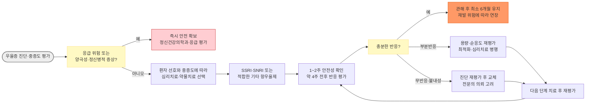
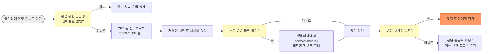

# 항우울제, 항불안제 Antidepressants & Anxiolytics

> 이 장은 성인 외래 진료의 약물 선택과 안전한 처방을 위한 요약이다. 실제 처방 시 해당 제품의 최신 국내 허가사항·급여기준, 환자의 진단·동반질환·병용약·간신기능을 확인한다. 소아·청소년, 임신·수유, 양극성장애, 정신병적 우울증 및 치료저항성 우울증은 정신건강의학과와 협진한다.

### <mark style="color:$danger;">🚩 Red Flags!</mark>

<mark style="color:$danger;">**즉시 응급조치·응급실 의뢰**</mark>

* 구체적인 자살 계획·수단·의도가 있거나 최근 자살시도, 타해 위험, 안전 확보 불가
* 심한 초조·공격성, 정신병적 증상, 긴장증, 음식·수분 섭취 불가 또는 중증 자기방임
* 조증·혼재성 상태가 의심되면서 판단력 저하, 위험행동 또는 수면이 거의 필요하지 않은 상태
* serotonin syndrome 의심 : serotonergic 약물 노출 후 clonus·hyperreflexia·떨림과 초조, 발한, 고체온 등이 발생
* 항우울제 과량복용, 발작, 실신·중증 부정맥, 의식저하 또는 호흡억제
* 지속발기증, 중증 출혈, 증상성 중증 저나트륨혈증 의심
* benzodiazepine 급중단 후 발작·섬망 또는 중증 자율신경 항진

<mark style="color:$warning;">**당일 정신건강의학과 또는 응급 평가**</mark>

* 자살사고가 새로 생기거나 악화되었으나 즉각적인 계획은 불명확한 경우
* 항우울제 시작·증량 후 현저한 activation, akathisia, 충동성 또는 경조증 의심
* 정신병적 증상, 양극성장애, 산후우울증 또는 물질사용장애가 의심되는 경우
* 중증 우울증, 빠른 기능 저하, 반복적인 치료 실패 또는 복잡한 약물 병용이 필요한 경우
* 임신·수유 중 중등도 이상 우울·불안 또는 약물 선택이 불명확한 경우

<mark style="color:$info;">**외래 추적 / 추가 평가 계획**</mark> <mark style="color:$info;">- 즉각 위험 낮으나 호전 없으면 의뢰</mark>

* 치료 시작·증량·교체·감량 후 부작용 또는 중단 증상 모니터링이 필요한 경우
* 고령, 낙상 위험, 심혈관질환, 간·신장애, 다약제 복용
* 부분반응, 잔류 증상, 복약 순응도 저하 또는 성기능·체중·수면 부작용


**⚠️ 항우울제 자살위험 경고(FDA Boxed Warning 및 국내외 안전성 경고)**\
FDA는 항우울제 라벨에 소아·청소년 및 18~24세 젊은 성인에서 치료 초기·증량 시 자살사고·행동 위험이 증가할 수 있다는 Boxed Warning을 요구한다. NICE는 18~25세 또는 자살위험이 있는 환자에게 치료 시작·증량 1주 후 검토를 권고한다. 이들 환자에서는 이후에도 activation·자살사고를 면밀히 관찰한다.


***

## <mark style="color:green;">처방 전 평가</mark>

* 진단, 증상 지속기간, 기능 손상 및 중증도를 평가한다. PHQ-9, GAD-7 등은 보조 도구이며 임상 진단을 대신하지 않는다.
* 자살·자해·타해 위험, 정신병적 증상, 긴장증 및 안전하게 지낼 수 있는 환경인지 확인한다.
* 과거 조증·경조증, 항우울제 유발 활성화, 양극성장애 가족력을 확인한다.
* 음주, stimulant·opioid·benzodiazepine 및 기타 물질 사용을 확인한다.
* 기존 약물, 건강기능식품, 임신 가능성·수유, 체중·혈압, 간·신장질환 및 출혈 위험을 확인한다.
* 필요에 따라 CBC, 전해질(특히 Na), 간·신기능, TSH 등을 시행한다. 고령자·이뇨제 복용자는 저나트륨혈증 위험이 높다.
* TCA 또는 QT 연장 위험 약물을 고려하거나 심질환·실신·전도장애·QT 연장 가족력·전해질 이상이 있으면 ECG를 고려한다.

## <mark style="color:green;">약물 선택 원칙</mark>

* 대부분의 성인 주요우울장애에서는 SSRI, SNRI, bupropion, mirtazapine, vortioxetine 등이 1차 선택지가 될 수 있다. 약제 간 평균 효능 차이보다 과거 반응, 부작용, 동반 증상, 상호작용 및 환자 선호를 우선한다.
* 불안장애에서는 SSRI 또는 SNRI가 주된 약물치료이다. 초기 불안·초조가 악화될 수 있어 낮은 용량에서 시작한다.
* TCA는 항콜린성 부작용, 심독성 및 과량복용 위험 때문에 일반 외래의 1차 선택이 아니다.
* Benzodiazepine은 우울증 치료제가 아니다. 불안·불면이 심한 일부 환자에서 항우울제 효과가 나타날 때까지 단기간 보조적으로 고려한다.
* 항우울제는 처방한 약물의 치료용량에 도달한 후 충분한 기간 사용하고, 반응이 없으면 진단·복약 순응도·물질사용·양극성장애·동반질환을 재평가한다.

## <mark style="color:green;">치료 알고리듬</mark>

### <mark style="color:orange;">주요우울장애</mark>

***



<p align="center"><strong>주요우울장애 치료 알고리듬</strong></p>

***

### <mark style="color:orange;">불안장애</mark>

***



<p align="center"><strong>불안장애 치료 알고리듬</strong></p>

***

> 이 알고리듬은 주요우울장애·범불안장애·공황장애의 일반적인 외래 치료를 중심으로 한다. 강박장애·외상후 스트레스장애는 권장 심리치료, 치료용량과 치료기간이 다르므로 별도로 평가하고 필요 시 정신건강의학과와 협진한다.

## <mark style="color:green;">항우울제</mark>

### <mark style="color:orange;">SSRI</mark>

* 구역·설사, 두통, 불면 또는 졸림, 성기능 장애, 발한이 흔하다. 치료 초기에는 불안·초조가 일시적으로 악화될 수 있다.
* 항혈소판제, NSAID 및 항응고제 병용 시 위장관 및 기타 출혈 위험이 증가할 수 있다. 출혈 증상을 관찰하고 warfarin 병용 시 필요에 따라 INR을 확인한다.
* 고령자, 이뇨제 복용자 및 저체중 환자에서는 SIADH·저나트륨혈증에 주의한다.
* 보통 1일 1회 투여한다. 활성화가 두드러지면 아침, 진정이 두드러지면 저녁 투여를 고려하되 환자 반응에 맞춘다.

<table><thead><tr><th>성분명 [대표 제품]</th><th>일반 성인 시작용량</th><th>통상 치료용량</th><th>일반 최대용량</th><th>주요 특징·주의</th></tr></thead><tbody>
<tr><td>citalopram <mark style="color:blue;">\[시탈로프람]</mark></td><td>20 ㎎ 1일 1회<br>고령·간장애 등 10 ㎎</td><td>20\~40 ㎎/day</td><td>40 ㎎/day<br>위험군 20 ㎎/day</td><td>용량 의존 QT 연장. 고령(>60세), 간장애, CYP2C19 poor metabolizer 또는 강한 CYP2C19 억제제 병용 시 20 ㎎/day 이하</td></tr>
<tr><td>escitalopram <mark style="color:blue;">\[렉사프로]</mark></td><td>10 ㎎ 1일 1회<br>민감한 환자 5 ㎎</td><td>10\~20 ㎎/day</td><td>20 ㎎/day</td><td>상호작용이 비교적 적음. QT 위험요인 확인</td></tr>
<tr><td>fluoxetine <mark style="color:blue;">\[푸로작]</mark></td><td>20 ㎎ 1일 1회<br>불안장애에서는 더 낮게 시작 가능</td><td>20\~60 ㎎/day</td><td>80 ㎎/day</td><td>활성화·불면, 긴 반감기, 강한 CYP2D6 억제. 중단 증상은 상대적으로 적음</td></tr>
<tr><td>fluvoxamine <mark style="color:blue;">\[듀미록스]</mark></td><td>50 ㎎/day</td><td>적응증·제형별 조절</td><td>300 ㎎/day</td><td>CYP1A2·2C19 상호작용이 많음. 국내 허가 적응증과 용법 확인</td></tr>
<tr><td>paroxetine <mark style="color:blue;">\[세로자트]</mark></td><td>20 ㎎/day<br>공황장애·고령자는 더 낮게 시작</td><td>20\~40 ㎎/day</td><td>주요우울장애 최대 50 ㎎/day, 공황장애·강박장애 최대 60 ㎎/day; 그 밖의 적응증과 CR 제형은 국내 허가사항 확인</td><td>진정, 체중 증가, 성기능 장애, 항콜린성 부담과 중단 증상이 비교적 큼. 강한 CYP2D6 억제</td></tr>
<tr><td>sertraline <mark style="color:blue;">\[졸로푸트]</mark></td><td>50 ㎎/day<br>공황·PTSD·사회불안은 25 ㎎/day 가능</td><td>50\~200 ㎎/day</td><td>200 ㎎/day</td><td>설사·위장관 부작용이 비교적 흔함. 간장애 시 감량</td></tr>
</tbody></table>

> 용량은 성인 교육용 범위이다. 국내 제품별 허가 적응증·제형, 고령자 및 간·신장애 용량을 별도로 확인한다. 표의 대표 제품명은 예시이며, 실제 유통 여부·정확한 상품명은 최신 허가사항으로 재확인한다.

### <mark style="color:orange;">SNRI</mark>

* SSRI와 유사한 부작용에 더해 혈압·맥박 상승, 발한, 입마름, 배뇨장애가 나타날 수 있다.
* Venlafaxine·desvenlafaxine은 갑작스러운 중단이나 복용 누락 때 중단 증상이 비교적 흔하다.
* Duloxetine은 일부 신경병증성 통증과 섬유근육통 등에서 유용할 수 있으나 간질환·상당한 음주, 신기능 저하 및 국내 허가 적응증을 확인한다.

<table><thead><tr><th>성분명 [대표 제품]</th><th>시작용량</th><th>통상용량</th><th>주요 특징·주의</th></tr></thead><tbody>
<tr><td>desvenlafaxine <mark style="color:blue;">\[프리스틱]</mark></td><td>50 ㎎ 1일 1회</td><td>통상 50 ㎎/day; 일부 환자에서 100 ㎎/day 고려</td><td>50 ㎎ 초과 시 추가 효과는 제한적이고 부작용이 증가할 수 있음. 서방정을 통째로 복용</td></tr>
<tr><td>duloxetine <mark style="color:blue;">\[심발타]</mark></td><td>30 ㎎/day 후 60 ㎎/day</td><td>60 ㎎/day; 적응증에 따라 최대 120 ㎎/day</td><td>혈압, 간기능·신기능, 요폐 주의. 60 ㎎ 초과의 추가 이득은 적응증별로 제한적. eGFR &lt;30 ㎖/min 또는 말기 신질환(ESRD)에서는 투여를 피함</td></tr>
<tr><td>venlafaxine <mark style="color:blue;">\[이팩사]</mark></td><td>XR 37.5\~75 ㎎/day</td><td>대개 75\~225 ㎎/day</td><td>용량 의존 혈압 상승과 중단 증상. 국내 유통 제형(IR/XR) 및 적응증별 허가 최대용량 확인</td></tr>
<tr><td>milnacipran <mark style="color:blue;">\[익셀]</mark></td><td colspan="2">국내 허가 적응증·용법에 따라 사용</td><td>우울증·불안장애 및 통증 적응증을 국가별 자료와 혼용하지 않음</td></tr>
</tbody></table>

> Levomilnacipran은 국내 허가·유통 여부를 확인하기 전 처방용 표에서 제외한다. Milnacipran은 국내(익셀)에서 주요우울장애 위주로 허가되어 있는 반면, 미국 제품(Savella)은 섬유근육통 전용으로 우울증 적응증이 없어 정반대이므로 해외 자료를 그대로 인용하지 않는다. 정확한 국내 적응증·보험기준은 최신 허가사항으로 확인한다.

### <mark style="color:orange;">기타 항우울제</mark>

<table><thead><tr><th>성분명 [대표 제품]</th><th>통상 시작용량</th><th>주요 특징</th><th>중요 주의사항</th></tr></thead><tbody>
<tr><td>bupropion <mark style="color:blue;">\[웰부트린]</mark></td><td>제형별 국내 허가 용법에 따라 시작</td><td>NDRI. 성기능 장애와 체중 증가가 상대적으로 적고 금연치료에도 사용</td><td>불면·불안·혈압 상승·발작 위험. 발작장애, 현재 또는 과거 신경성 식욕부진증·폭식증, MAOI 병용 및 alcohol·benzodiazepine·항경련제 급중단 상황에서 금기 또는 회피. 국내 우울증 치료용 XL 제제와 금연치료용 SR 제제의 용법을 혼용하지 않으며, 제형별 1회 용량·투여 간격·1일 최대용량은 해당 제품 허가사항을 확인</td></tr>
<tr><td>mirtazapine <mark style="color:blue;">\[레메론]</mark></td><td>15 ㎎ 취침 전</td><td>불면·식욕저하가 동반된 경우 고려. 성기능·위장관 부작용은 SSRI보다 적은 편</td><td>졸림, 식욕·체중 증가, 지질 이상. 진정은 저용량에서 더 뚜렷할 수 있음</td></tr>
<tr><td>vortioxetine <mark style="color:blue;">\[브린텔릭스]</mark></td><td>10 ㎎ 1일 1회<br>민감한 환자 5 ㎎</td><td>주요우울장애 치료. 일부 인지 증상에 이점 가능</td><td>구역이 흔함. 강한 CYP2D6 억제제 또는 유도제 병용 시 조절 필요</td></tr>
<tr><td>trazodone <mark style="color:blue;">\[트리티코]</mark></td><td>우울증 치료와 저용량 수면 목적을 구분</td><td>진정·수면 효과</td><td>기립저혈압, 낙상, 지속발기증, QT 연장·부정맥. 저용량 수면 사용이 항우울 치료용량을 의미하지 않음</td></tr>
<tr><td>agomelatine <mark style="color:blue;">\[아고틴]</mark></td><td>국내 허가 용법 확인</td><td>수면-각성 리듬 관련 증상에 이점 가능</td><td>간기능검사를 치료 시작 전, 치료 3·6·12·24주 시점 및 임상적 필요 시(증량 시 포함) 시행. 간질환·유의한 transaminase 상승 및 강한 CYP1A2 억제제 병용 금기 여부 확인</td></tr>
</tbody></table>

> Vilazodone, nefazodone 및 doxepin은 국내 허가 제품의 함량·적응증·유통 상태를 확인하기 전 국내 처방용 표에서 제외한다. 특히 저용량 불면증용 doxepin 제품과 고용량 항우울 용법을 혼용하지 않는다.

### <mark style="color:orange;">TCA 및 사환계 항우울제</mark>

* 일부 중증 우울증에서 효과적일 수 있으나 항콜린성 부작용, 기립저혈압, 낙상, 심장 전도장애 및 과량복용 시 치명적 심독성 때문에 일반 외래의 1차 선택이 아니다.
* Nortriptyline 등 secondary amine이 일부 tertiary amine보다 항콜린성 부담이 낮을 수 있지만 고령자에서 안전한 약물로 간주해서는 안 된다.
* 녹내장, 요폐·전립선비대, 변비·장폐색 위험, 인지장애, 심장 전도장애, 발작 위험 및 자살·과량복용 위험을 평가한다.
* 저용량에서 시작해 서서히 증량한다. 적응증과 환자에 따라 혈압·맥박 및 혈중농도 모니터링을 고려한다. 심질환·실신·전도장애 병력, QT 연장 가족력, 고령, 전해질 이상 또는 여러 QT 연장약 병용 등 위험요인이 있으면 투여 전 ECG를 시행하고, 증량 후 또는 임상적으로 필요할 때 반복한다.

<table><thead><tr><th>성분명 [대표 제품]</th><th>특징</th><th>주요 주의사항</th></tr></thead><tbody>
<tr><td>amitriptyline <mark style="color:blue;">\[에트라빌]</mark></td><td>진정·항콜린 작용이 강함; 일부 통증 질환에 저용량 사용</td><td>낙상, 인지저하, 체중 증가, 심독성</td></tr>
<tr><td>clomipramine <mark style="color:blue;">\[그로민]</mark></td><td>serotonergic 작용이 강하며 OCD 등에 사용</td><td>serotonin syndrome, 발작, QT·전도장애, 항콜린 부작용</td></tr>
<tr><td>imipramine <mark style="color:blue;">\[이미프라민]</mark></td><td>항우울·항불안 효과</td><td>기립저혈압, 항콜린 부작용, 심독성</td></tr>
<tr><td>nortriptyline <mark style="color:blue;">\[센시발]</mark></td><td>상대적으로 항콜린·진정 부담이 적을 수 있음</td><td>여전히 낙상·부정맥·과량복용 위험 존재</td></tr>
<tr><td>amoxapine <mark style="color:blue;">\[아디센]</mark></td><td>dopamine 차단 관련 효과 가능</td><td>추체외로 증상, 지연성 운동장애, 발작</td></tr>
</tbody></table>

> 국내 미유통 또는 사용이 드문 desipramine, protriptyline, trimipramine, maprotiline 등은 국내 허가·공급을 확인한 경우에만 처방표에 포함한다. 표의 대표 제품명 역시 실제 유통 여부를 재확인한다.

## <mark style="color:green;">항불안제</mark>

### <mark style="color:orange;">Benzodiazepine</mark>


**⚠️ Benzodiazepine Boxed Warning (FDA 2020)**\
모든 benzodiazepine 계열 약물은 오남용, 중독, 신체의존 및 중단 시 금단반응의 위험을 강조하는 Boxed Warning을 포함한다. 최소 유효용량·최단기간 사용을 원칙으로 하며, opioid 등 다른 중추신경억제제와의 병용은 특히 위험하다.


* 우울증 치료제가 아니며 장기 불안장애 치료의 기본 약제도 아니다. 선택된 환자에서 급성 불안·초조·불면 또는 공황 증상을 단기간 완화하는 보조약으로 사용한다.
* 가능한 최소 유효용량·최단기간을 사용하고, 시작할 때부터 종료 계획을 설명한다. 2\~4주를 넘길 경우 지속 필요성과 위해를 재평가한다.
* 졸림, 기억·인지 저하, 운동실조, 낙상·골절, 교통사고, 역설적 흥분, 내성·신체의존과 금단이 발생할 수 있다.
* Alcohol, opioid, gabapentinoid 및 다른 진정제와 병용하면 심한 진정·호흡억제·사망 위험이 증가한다.
* 고령자는 더 낮은 용량을 사용하며 긴 반감기·활성 대사체 약물을 피하는 것이 유리하다. 간기능 저하에서는 glucuronidation으로 대사되는 lorazepam·oxazepam 등이 상대적으로 예측 가능할 수 있다.

<table><thead><tr><th>성분명 [대표 제품]</th><th>작용 특성</th><th>주요 비고</th></tr></thead><tbody>
<tr><td>diazepam <mark style="color:blue;">\[디아제팜]</mark></td><td>장시간; 활성 대사체 있음</td><td>고령·간장애에서 축적과 낙상 위험. 일부 감량 과정에 사용할 수 있으나 일률적 전환은 하지 않음</td></tr>
<tr><td>clorazepate</td><td>장시간; 활성 대사체</td><td>축적 주의</td></tr>
<tr><td>alprazolam <mark style="color:blue;">\[자낙스]</mark></td><td>중간\~짧은 작용</td><td>반동성 불안·금단과 오남용 위험. 급중단 금지</td></tr>
<tr><td>lorazepam <mark style="color:blue;">\[아티반]</mark></td><td>중간 작용; glucuronidation</td><td>활성 대사체는 없으나 진정·의존·낙상 위험은 동일</td></tr>
<tr><td>oxazepam</td><td>중간\~짧은 작용; glucuronidation</td><td>작용 발현이 비교적 느림. 국내 유통 여부 확인</td></tr>
<tr><td>clonazepam <mark style="color:blue;">\[리보트릴]</mark></td><td>중간\~장시간</td><td>국내 허가 적응증(뇌전증·공황장애 등)과 용법 확인</td></tr>
<tr><td>triazolam <mark style="color:blue;">\[할시온]</mark></td><td>단시간 수면제</td><td>기억장애·반동성 불면·이상행동 주의; 불안장애 유지치료제로 사용하지 않음</td></tr>
<tr><td>etizolam <mark style="color:blue;">\[데파스]</mark></td><td>단시간 계열</td><td>의존·금단 위험. 국내 허가 용량과 투여기간 확인</td></tr>
</tbody></table>

#### <mark style="color:$primary;">Benzodiazepine 감량</mark>

* 신체의존 가능성이 있는 환자에서 갑자기 중단하지 않는다.
* 초기에는 대체로 현재 용량의 5\~10%를 2\~4주마다 감량하는 방법을 고려하며, 통상 2주에 25%를 넘는 빠른 감량은 피한다.
* 장기간·고용량 사용, 과거 심한 금단, 동반 정신질환이 있으면 더 느린 감량이 필요할 수 있다. 감량 말기에는 더 작은 폭으로 줄인다.
* 금단 증상이 현저하면 현재 단계에서 유지하거나 감량 속도를 늦춘다. 매 감량 단계에서 불안·불면·떨림·지각과민·발작 위험을 평가한다.
* 긴 반감기 약제로의 전환은 선택지일 뿐 필수는 아니다. 고령자·간장애에서는 diazepam 전환이 부적절할 수 있다.
* 감량 중 불안·불면이 뚜렷하게 악화되면 감량 속도를 조정한다. 감량 성공을 돕기 위해 기저 불안·불면에 맞는 CBT·CBT-I 등 행동중재를 제공하거나 이용할 수 있도록 의뢰한다.

### <mark style="color:orange;">Buspirone</mark>

* 범불안장애에서 고려할 수 있는 비benzodiazepine 항불안제이다. 국내 허가 적응증과 용법을 확인한다.
* 즉각적인 진정 효과가 없으며 효과 발현에 수주가 걸릴 수 있다. 공황발작의 즉시 완화나 benzodiazepine 금단 치료제로 사용하지 않는다.
* 어지럼, 구역, 두통이 나타날 수 있다. MAOI 및 다른 serotonergic 약물 병용 시 serotonin syndrome 위험을 확인한다.

### <mark style="color:orange;">Gabapentinoid</mark>

* Gabapentin과 pregabalin은 우울증 치료제가 아니다. 불안장애에 대한 국내 허가 여부와 보험 적용을 확인하고, 허가 외 사용이라면 환자에게 설명한다.
* 졸림, 어지럼, 운동실조, 부종, 체중 증가, 오남용·의존 및 중단 증상에 주의한다.
* Opioid, benzodiazepine, alcohol 등 중추신경억제제와 병용하면 호흡억제 위험이 증가할 수 있다(FDA 2019 안전성 경고).
* 과거 물질사용장애(알코올·약물사용장애) 병력이 있으면 오남용·의존 위험이 높아 처방·모니터링에 더 주의한다.
* 신기능에 따라 감량한다. 단일 최대용량으로 일률 표기하지 않고 적응증·제품 허가사항에 따라 개별화한다.

## <mark style="color:green;">Serotonin syndrome</mark>

* 정신상태 변화, 자율신경 항진 및 신경근육 이상이 조합되어 나타나는 잠재적으로 치명적인 약물독성이다.
* Clonus와 hyperreflexia가 중요한 단서이다. 중증에서는 고체온, 근육강직, 횡문근융해, 발작 및 장기부전이 생길 수 있다.
* 의심되면 serotonergic 약물을 즉시 중단하고 중증도에 따라 응급실로 의뢰한다. 고체온·강직·의식변화가 있으면 즉시 응급조치한다.

### <mark style="color:orange;">Hunter serotonin toxicity criteria</mark>

Serotonergic 약물 노출 후 다음 중 하나이면 serotonin toxicity를 강하게 의심한다.

* spontaneous clonus
* inducible clonus + 초조 또는 발한
* ocular clonus + 초조 또는 발한
* 떨림 + hyperreflexia
* hypertonia + 체온 38℃ 초과 + ocular 또는 inducible clonus

> Hunter 기준은 임상 판단을 보조하며, 기준을 충족하지 않는다는 이유만으로 초기 또는 비전형적 serotonin syndrome을 배제하지 않는다.

### <mark style="color:orange;">임상적으로 중요한 위험 약물</mark>

* MAOI, linezolid, 정맥 methylene blue
* SSRI, SNRI, clomipramine을 포함한 serotonergic TCA 및 기타 serotonergic 항우울제
* tramadol, meperidine, methadone, fentanyl, dextromethorphan
* lithium, buspirone, amphetamine계 약물, triptan, tryptophan, St. John's wort

> Bupropion, carbamazepine 및 valproate를 serotonin 재흡수 억제제로 분류하지 않는다. Ondansetron 등 5-HT3 수용체 길항제는 규제기관 경고가 있으나, 강한 serotonergic 약물과 동일한 위험도로 일괄 분류하지 않는다.

## <mark style="color:green;">주요 부작용과 대처</mark>

<table><thead><tr><th>문제</th><th>우선 평가·대처</th><th>추가 고려</th></tr></thead><tbody>
<tr><td>구역·설사</td><td>초기 일시적 증상인지 확인, 식사와 함께 복용 가능 여부·감량·서서히 증량 고려</td><td>지속되면 약제 변경</td></tr>
<tr><td>불면·activation</td><td>자살위험·akathisia·경조증 평가, 아침 투여·감량 또는 변경</td><td>현저한 충동성·조증 의심 시 당일 평가</td></tr>
<tr><td>졸림</td><td>Alcohol·진정제 병용, 수면무호흡, 낙상·운전 위험 평가; 저녁 투여·감량·변경</td><td>자극제를 일률적으로 추가하지 않음</td></tr>
<tr><td>성기능 장애</td><td>기저 성기능과 우울 증상 영향 평가; 관찰·감량·부작용이 적은 약제로 교체 고려</td><td>Bupropion 추가 또는 남성 발기부전에 PDE5 억제제 고려. Drug holiday는 제한적 초기 연구가 있으나 순응도 저하·중단 증상 때문에 통상적인 1차 대처로 권고하지 않음</td></tr>
<tr><td>체중 증가·대사 이상</td><td>체중·식습관·활동 평가, 생활요법, 감량·약제 변경</td><td>항우울제 부작용만을 이유로 statin을 자동 추가하지 않음</td></tr>
<tr><td>기립저혈압·낙상</td><td>혈압, 탈수, 병용약 평가; 천천히 일어나기, 감량·변경</td><td>Fludrocortisone·고염식 등을 일률적으로 처방하지 않음</td></tr>
<tr><td>저나트륨혈증</td><td>혼돈·두통·구역·경련 평가, 혈청 Na 측정, 원인 약제 중단 여부 결정</td><td>증상성·중증이면 응급 평가</td></tr>
<tr><td>출혈</td><td>NSAID·항혈소판제·항응고제 병용과 출혈 부위 평가</td><td>중증 출혈은 응급실 의뢰</td></tr>
<tr><td>QT 연장·부정맥</td><td>용량·병용약·전해질·심질환 평가, ECG</td><td>실신·지속성 부정맥이면 응급 평가</td></tr>
<tr><td>지속발기</td><td>원인 약물 중단 및 즉시 응급실 의뢰</td><td>4시간 이상 지속되기 전이라도 진행 중이면 지체하지 않음</td></tr>
</tbody></table>

## <mark style="color:green;">중요한 약물 상호작용</mark>

<table><thead><tr><th>약물·효소</th><th>대표 항우울제</th><th>임상적 의미</th></tr></thead><tbody>
<tr><td>CYP2D6 강한 억제</td><td>fluoxetine, paroxetine, bupropion</td><td>Tamoxifen의 활성 대사체(endoxifen) 농도를 낮춰 효과를 감소시킬 가능성이 있다. 임상적 재발·사망 위험에 관한 연구 결과는 일관되지 않지만, 가능하면 강한 CYP2D6 억제제를 피하고 venlafaxine, escitalopram, desvenlafaxine 등 CYP2D6 억제가 적은 대체약을 환자별로 고려한다. 일부 beta-blocker·항정신병약·TCA 등과도 상호작용 확인</td></tr>
<tr><td>CYP1A2·2C19 억제</td><td>fluvoxamine</td><td>Theophylline, clozapine, 일부 benzodiazepine 등과 상호작용 확인</td></tr>
<tr><td>CYP2D6 억제</td><td>duloxetine</td><td>CYP2D6 기질 병용 시 농도 상승 가능</td></tr>
<tr><td>출혈 위험</td><td>SSRI·SNRI + NSAID·aspirin·항응고제</td><td>출혈 증상과 위험요인 평가; 필요한 경우 위장관 보호 및 모니터링 고려</td></tr>
<tr><td>QT 연장</td><td>citalopram, escitalopram, TCA, trazodone 등</td><td>다른 QT 연장약, 저K·저Mg, 서맥·심질환과 중첩 주의</td></tr>
<tr><td>Serotonergic 병용</td><td>MAOI, linezolid, methylene blue, tramadol 등</td><td>금기·washout 기간과 serotonin syndrome 위험 확인</td></tr>
</tbody></table>

> MAOI를 시작하거나 중단할 때는 약물별 washout 기간을 반드시 확인한다. 대부분의 serotonergic 항우울제 중단 후 MAOI 시작 전 최소 14일이 필요하지만, fluoxetine은 최소 5주, vortioxetine은 최소 21일의 washout이 필요하다. MAOI 중단 후 다른 serotonergic 항우울제 시작 전에는 일반적으로 최소 14일을 둔다. 국내 제품 허가사항을 우선한다.

## <mark style="color:green;">치료 반응 평가와 유지치료</mark>

* 일반적으로 시작 후 2주 이내 부작용·자살사고·복약 순응도를 확인한다. FDA 위험분석의 젊은 성인은 18~24세이며, NICE는 18~25세 또는 자살위험이 있는 환자에게 시작·증량 1주 후 검토를 권고한다. 이후 필요에 따라 자주 추적한다.
* 환자는 대개 4주 이내 일부 효과를 느끼기 시작할 수 있다. 조기 변화가 없더라도 적정 용량·기간, 순응도 및 진단을 함께 평가한다.
* 부분반응이면 내약성 범위에서 최적화하고 심리치료 병행을 고려한다. 무반응·불내성이면 같은 계열 또는 다른 계열로 교체하고, 반복 실패 시 전문의에게 의뢰한다.
* 관해 후 최소 6개월 유지한다. 재발성·중증, 잔류 증상, 정신병적 증상, 자살위험, 만성 경과가 있으면 장기 유지치료를 고려한다.

## <mark style="color:green;">항우울제 중단</mark>

* 갑자기 중단하지 않고 단계적으로 감량한다. 감량 기간은 수주에서 수개월 이상까지 개인화한다.
* Paroxetine, venlafaxine, desvenlafaxine, 고용량·장기복용 및 과거 중단 증상이 심했던 환자는 더 천천히 감량한다. Fluoxetine은 긴 반감기로 중단 증상이 상대적으로 적다.
* 어지럼, 전기충격감, 감각 이상, 불면, 불안, 오심, 발한, 독감 유사 증상이 수일 내 나타나면 중단 증후군을 의심한다. 수주 후 점진적으로 악화되는 원래 증상은 재발 가능성을 함께 평가한다.
* 심한 중단 증상이 발생하면 직전 내약 용량으로 일시 복귀한 뒤 더 작은 단계로 감량하는 방법을 고려한다.

## <mark style="color:green;">특수 환자군</mark>

### <mark style="color:orange;">소아·청소년</mark>

* 1차 치료는 심리치료이며, 약물치료가 필요하면 정신건강의학과와 협진한다.
* 국내에서 소아·청소년 적응증이 확인된 항우울제는 제한적이므로 개별 제품의 허가 연령·적응증을 확인한다.
* 모든 항우울제는 소아·청소년에서 자살사고·행동 위험 증가 경고가 있으므로 치료 초기·증량 시 특히 면밀히 관찰한다.
* Benzodiazepine은 소아·청소년에서 일반적으로 권장하지 않는다.

### <mark style="color:orange;">임신·수유</mark>

* 치료하지 않은 우울·불안의 위험과 약물 노출 위험을 함께 평가한다. 임의로 중단하지 않는다.
* 새로 시작하거나 변경할 때는 임신 시기, 과거 효과, 수유 계획과 신생아 적응 문제를 고려하고 산부인과·정신건강의학과와 협진한다.
* Paroxetine 등 개별 약물의 임신 관련 주의와 benzodiazepine의 신생아 진정·금단 위험을 최신 국내 허가사항으로 확인한다.
* 출산 전후 항우울제·benzodiazepine에 노출된 신생아는 호흡곤란, 과도한 울음, 근긴장 이상, 수유 곤란 등 적응·금단 증상을 보일 수 있어 분만 전 신생아과와 정보를 공유하고 출생 후 관찰한다.

### <mark style="color:orange;">고령자</mark>

* 낮은 용량에서 시작하고 천천히 증량한다. 낙상, 저나트륨혈증, 출혈, QT 연장, 인지저하와 다약제 상호작용을 확인한다.
* Paroxetine과 TCA의 항콜린성 부담, 장시간형 benzodiazepine의 축적에 특히 주의한다.

### <mark style="color:orange;">간·신장애</mark>

* 간장애에서는 대부분의 항우울제 시작·최대용량을 낮추거나 투여 간격을 조절할 수 있다. Sertraline 등 약물별 제한을 확인한다.
* 신장애에서는 duloxetine, desvenlafaxine, gabapentin, pregabalin 등의 제한·감량 기준을 확인한다.

***

### <mark style="color:red;">질병코드</mark>

F32 우울에피소드

F33 재발성 우울장애

F40 공포성 불안장애

F40.1 사회공포증

F41 기타 불안장애

F41.0 공황장애

F41.1 범불안장애

F42 강박장애

F43.1 외상후 스트레스장애

***

## <mark style="color:purple;">처방례</mark>

> 아래 처방은 교육용 예시이다. 진단·연령·동반질환·병용약·간신기능 및 국내 제품 허가사항에 따라 조정한다.

> **처방례 1.** 성인 주요우울장애의 초기 약물치료 예
>
> ```
> escitalopram 10 ㎎  1T  1일 1회(qd)  × 14일
> ```
>
> _✽약 2주 이내 부작용·자살사고·activation을 확인하고, 반응과 내약성에 따라 20 ㎎/day까지 조절한다._

> **처방례 2.** 공황장애, 초기 activation 우려
>
> ```
> sertraline 25 ㎎  1T  1일 1회(qd)  × 7일 → 50 ㎎ qd
> ```
>
> _✽초기 불안 악화 가능성을 설명하고 서서히 증량한다. Benzodiazepine 병용이 필요하면 최단기간·최소용량으로 별도 계획한다._

> **처방례 3.** 불면·식욕저하가 동반된 우울증
>
> ```
> mirtazapine 15 ㎎  1T  취침 전(hs)  × 14일
> ```
>
> _✽다음 날 졸림, 식욕·체중 증가, 낙상 위험을 확인한다._

> **처방례 4.** Duloxetine을 고려하는 경우
>
> ```
> duloxetine 30 ㎎  1C  1일 1회(qd)  × 7일 → 60 ㎎ qd
> ```
>
> _✽혈압, 간질환·음주, 신기능, 요폐 위험과 적응증별 국내 허가사항을 확인한다._

> **처방례 5.** 범불안장애 환자의 일시적 위기 상황에서 단기간 보조치료가 필요한 경우
>
> ```
> escitalopram 10 ㎎  1T  1일 1회(qd)
> lorazepam 0.5 ㎎  1T  필요시(prn)  1일 최대 2회  × 7~10일
> ```
>
> _✽모든 범불안장애 환자에게 일률적으로 병용하지 않는다. 자살위험, 물질사용장애, 수면무호흡, 낙상 위험 및 opioid·다른 진정제 병용 여부를 먼저 확인한다. 최단기간만 사용하고 7\~10일 후 실제 복용량과 잔여량을 확인하여 지속 필요성을 재평가한다._

***

### <mark style="color:$success;">핵심 복약 지도</mark>

> **효과 발현 시간**
>
> 항우울제는 바로 기분을 좋게 하는 약이 아니며, 효과를 느끼기까지 보통 2\~4주가 걸릴 수 있습니다. 임의로 조기에 중단하지 않도록 설명합니다.

> **초기 activation·자살사고 모니터링**
>
> 처음 복용하거나 증량한 뒤 불안·초조·불면이 심해지거나 자살 생각, 충동적인 행동, 수면이 거의 필요 없을 정도로 지나치게 활발해지는 증상이 생기면 즉시 알리도록 안내합니다. FDA 위험분석의 18\~24세 젊은 성인은 특히 주의가 필요하며, NICE는 18\~25세 또는 자살위험이 있는 환자에게 치료 시작·증량 1주 후 검토를 권고합니다.

> **임의 중단 금지**
>
> 갑자기 끊지 않도록 설명합니다. 어지럼, 전기충격 같은 느낌, 불안·불면·구역 등 중단 증상이 생길 수 있으며, paroxetine·venlafaxine 등 반감기가 짧은 약물에서 더 흔합니다.

> **약물 상호작용**
>
> 새로운 처방약·감기약·진통제·건강기능식품을 복용하기 전 상호작용을 확인하도록 안내합니다. 특히 tramadol, dextromethorphan, St. John's wort 병용에 주의합니다.

> **Benzodiazepine 병용 시 주의**
>
> Benzodiazepine 복용 중에는 음주하지 않고, 졸리면 운전·기계 조작을 하지 않도록 안내합니다. Opioid 진통제나 다른 수면·진정제와 함께 복용하기 전 반드시 상의하도록 설명합니다.

> **언제 다시 병원을 방문해야 하나요?**
>
> * 자살 생각이나 자해·타해 충동이 생기는 경우 — 즉시 내원 또는 응급실
> * 고열과 함께 근육이 뻣뻣해지거나 떨림·심한 발한이 나타나는 경우 (serotonin syndrome 의심) — 즉시 내원
> * 조증·경조증 증상(수면이 거의 필요 없이 지나치게 활발해짐)이 나타나는 경우
> * 지속발기, 심한 출혈, 실신·경련이 발생하는 경우 — 즉시 응급실
> * 예정된 추적 관찰(2주·4주) 시점에 효과·부작용을 함께 재평가

***

### <mark style="color:blue;">환자 안내서</mark>


**우울증·불안장애, 약은 증상을 조절하는 데 도움이 되지만 시간이 필요합니다**

항우울제는 뇌의 신경전달과 관련 회로에 점진적인 변화를 일으켜 우울·불안 증상을 완화하는 데 도움을 줍니다. 충분한 효과가 나타나기까지 보통 몇 주가 걸리며, 처방받은 대로 꾸준히 복용하는 것이 중요합니다.


#### <mark style="color:$primary;">약은 왜 바로 효과가 나타나지 않나요?</mark>

* 항우울제는 신경전달물질 체계가 서서히 재조정되면서 효과가 나타나므로, 대개 2\~4주 후부터 변화를 느끼기 시작합니다.
* 초반에는 오히려 불안·초조·불면이 일시적으로 심해질 수 있습니다. 이 시기에 스스로 중단하지 말고 의료진과 상의하십시오.

#### <mark style="color:$primary;">복용 중 꼭 지켜야 할 것은?</mark>

* **처방받은 대로 매일 같은 시간에 복용하십시오.** 효과가 없다고 느껴져도 스스로 증량하거나 중단하지 마십시오.
* 증상이 좋아진 뒤에도 재발을 막기 위해 일정 기간(보통 최소 6개월 이상) 계속 복용하는 경우가 많습니다.
* 새로운 처방약, 감기약, 진통제, 건강기능식품을 복용하기 전에는 반드시 상의하십시오.
* Benzodiazepine 계열(항불안제·수면제)을 함께 복용 중이라면 음주를 피하고, 졸릴 때는 운전이나 기계 조작을 하지 마십시오.

#### <mark style="color:$primary;">이럴 때는 즉시 병원을 방문하세요</mark>

* 구체적인 자살 생각이나 자해·타해 충동이 들 때
* 심한 초조, 혼란, 환청·망상 또는 위험한 행동을 보일 때
* 고열과 함께 근육이 뻣뻣해지거나 떨림·경련·심한 발한이 나타날 때
* 잠을 거의 자지 않아도 기분이 지나치게 좋고 활발해질 때
* 실신, 심한 두근거림, 발작, 검은 변·토혈 등 심한 출혈이 있을 때
* 발기가 가라앉지 않고 지속될 때

자살 생각이 들 때는 혼자 견디지 마시고 즉시 응급실을 방문하거나 자살예방상담전화 **109**(24시간, 통화료 무료)로 연락하십시오.

## 참고문헌

1. NICE. Depression in adults: treatment and management. NG222. 2022, updated.
2. American Society of Addiction Medicine et al. Joint Clinical Practice Guideline on Benzodiazepine Tapering. J Gen Intern Med. 2025.
3. FDA. Paxil (paroxetine) prescribing information. 2024.
4. FDA. Wellbutrin SR/XL (bupropion) prescribing information.
5. FDA. Celexa (citalopram), Lexapro (escitalopram), Zoloft (sertraline), Pristiq (desvenlafaxine), Cymbalta (duloxetine) prescribing information.
6. FDA. Trintellix (vortioxetine) prescribing information.
7. FDA. Requiring Boxed Warning updated to improve safe use of benzodiazepine drug class. Drug Safety Communication. 2020.
8. Ministry of Food and Drug Safety. 의약품안전나라 의약품 허가사항 및 제품정보. 약제별 최신 자료 확인.
